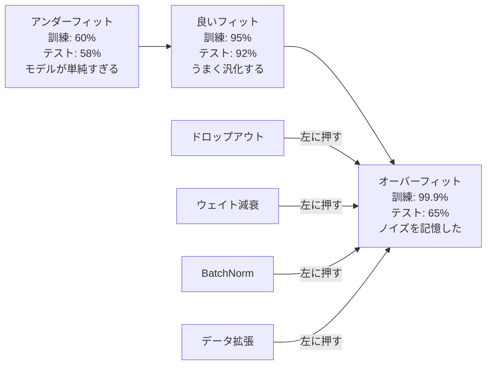
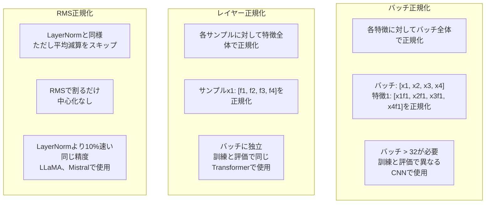
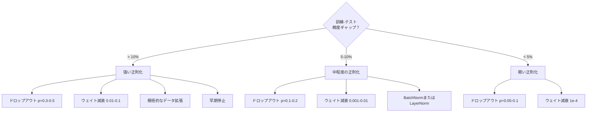

# 正則化

> モデルが訓練データで99%、テストデータで60%を達成した。学習の代わりに記憶した。正則化は汎化を強制するために複雑さに課す税金だ。


## 学習目標

- 逆スケーリング付きドロップアウト、L2ウェイト減衰、バッチ正規化、レイヤー正規化、RMSNormをゼロから実装する
- 訓練-テスト精度ギャップを測定し、正則化実験を使って過学習を診断する
- TransformerがBatchNormではなくLayerNormを使う理由と、現代のLLMがRMSNormを好む理由を説明する
- 過学習の深刻さに基づいて正しい正則化技法の組み合わせを適用する

## 問題設定

十分なパラメータを持つニューラルネットワークはどんなデータセットでも記憶できる。これは仮説ではない。Zhang et al.（2017）がランダムラベルでImageNetの標準ネットワークを訓練することで証明した。ネットワークはランダムなラベル割り当てに対してほぼゼロの訓練損失に達した。学習するパターンがない状態で、100万個のランダムな入出力ペアを記憶した。訓練損失は完璧。テスト精度はゼロ。

これが過学習問題で、モデルが大きくなるほど悪化する。GPT-3は1750億パラメータを持つ。訓練セットは約5000億トークンだ。それだけのパラメータで、モデルは訓練データのかなりの部分を一字一句記憶できるだけの容量を持つ。正則化なしでは、汎化可能なパターンを学習する代わりに訓練例を吐き出すだけになる。

訓練パフォーマンスとテストパフォーマンスのギャップが過学習ギャップだ。このレッスンのすべての技法が異なる角度からそのギャップを攻撃する。ドロップアウトはネットワークが単一のニューロンに依存しないよう強制する。ウェイト減衰は単一の重みが大きくなりすぎるのを防ぐ。バッチ正規化は損失の景観を滑らかにし、オプティマイザがより平坦で汎化しやすい最小値を見つけるようにする。レイヤー正規化はバッチ正規化が失敗するところ（小さなバッチ、可変長シーケンス）で同じことをする。RMSNormは平均計算を省略することで10%速くなる。各技法はシンプルだ。組み合わせると、記憶するモデルと汎化するモデルの違いになる。

## 概念

### 過学習のスペクトラム

すべてのモデルはアンダーフィット（パターンを捉えるには単純すぎる）からオーバーフィット（ノイズを捉えるほど複雑）のスペクトラム上にある。最適点はその間にあり、正則化はモデルをオーバーフィット側から押し付ける。



### ドロップアウト

最もエレガントな解釈を持つ最もシンプルな正則化技法だ。訓練中、確率pで各ニューロンの出力をランダムにゼロに設定する。

```
output = activation(z) * mask    ここで mask[i] ~ Bernoulli(1 - p)
```

p = 0.5では、すべての順伝播で半分のニューロンがゼロになる。ネットワークはどのニューロンが使えるか予測できないので、冗長な表現を学習しなければならない。これにより共適応を防ぐ。ニューロンが特定の他のニューロンが存在することに依存することを学ぶのを防ぐ。

アンサンブル解釈: Nニューロンとドロップアウトを持つネットワークは2^N個の可能なサブネットワーク（どのニューロンがオンオフかのすべての組み合わせ）を作る。ドロップアウトで訓練すると、すべての2^Nサブネットワークを異なるミニバッチで同時に訓練するのにほぼ相当する。テスト時にはすべてのニューロンを使い（ドロップアウトなし）、出力を(1 - p)でスケールして訓練中の期待値に合わせる。これは単一モデルから2^Nサブネットワークの予測を平均することと等価だ。

実際には、スケーリングはテスト時ではなく訓練時に適用される（逆ドロップアウト）:

```
訓練時:  output = activation(z) * mask / (1 - p)
テスト時: output = activation(z)   （変更不要）
```

テストコードがドロップアウトについて知る必要がないので、こちらがよりクリーンだ。

デフォルトレート: Transformerでp = 0.1、MLPでp = 0.5、CNNでp = 0.2〜0.3。ドロップアウトが高いほど強い正則化でアンダーフィットのリスクが高い。

### ウェイト減衰（L2正則化）

すべての重みの二乗の大きさを損失に加える:

```
total_loss = task_loss + (lambda / 2) * sum(w_i^2)
```

正則化項の勾配はlambda * wだ。これは毎ステップ、各重みが大きさに比例した割合でゼロに向かって縮むことを意味する。大きな重みはより多くペナルティを受ける。モデルは単一の重みが支配しない解に向かって押される。

なぜこれが汎化を助けるか: 過学習したモデルは訓練データのノイズを増幅する大きな重みを持つ傾向がある。ウェイト減衰は重みを小さく保ち、モデルの有効容量を制限し、記憶した癖ではなく頑健で汎化可能な特徴に依存するよう強制する。

ラムダのハイパーパラメータが強さを制御する。典型的な値:

- TransformerのAdamWで0.01
- CNNのSGDで1e-4
- 強く過学習したモデルで0.1

レッスン06で説明したように: ウェイト減衰とL2正則化はSGDでは等価だがAdamでは違う。Adamで訓練するときは常にAdamW（分離されたウェイト減衰）を使う。

### バッチ正規化

次の層に渡す前に、ミニバッチ全体で各層の出力を正規化する。

ある層のアクティベーションのミニバッチに対して:

```
mu = (1/B) * sum(x_i)           （バッチ平均）
sigma^2 = (1/B) * sum((x_i - mu)^2)   （バッチ分散）
x_hat = (x_i - mu) / sqrt(sigma^2 + eps)   （正規化）
y = gamma * x_hat + beta        （スケールとシフト）
```

ガンマとベータは学習可能なパラメータで、それが最適なら正規化を元に戻せるようにする。これなしでは、すべての層の出力を平均ゼロ単位分散に強制することになり、ネットワークが望むものではないかもしれない。

**訓練と推論の分割:** 訓練中、muとsigmaは現在のミニバッチから来る。推論中は、訓練中に蓄積された移動平均を使う（モメンタム = 0.1の指数移動平均、つまり90%古い + 10%新しい）。

なぜBatchNormが機能するかはまだ議論中だ。元の論文は「内部共変量シフト」（前の層が更新されるにつれて層の入力分布が変化すること）を減らすと主張した。Santurkakら（2018）はこの説明が間違いであることを示した。実際の理由: BatchNormは損失の景観を滑らかにする。勾配がより予測可能になり、リプシッツ定数が小さくなり、オプティマイザがより大きなステップを安全に取れる。これがBatchNormでより高い学習率を使い速く収束できる理由だ。

BatchNormには根本的な制限がある。バッチ統計に依存する。バッチサイズ1では平均と分散が意味を持たない。小さなバッチ（< 32）では統計がノイズになりパフォーマンスが低下する。これは物体検出（メモリがバッチサイズを制限する）や言語モデリング（シーケンス長が変動する）で重要だ。

### レイヤー正規化

バッチ全体ではなく特徴全体で正規化する。単一サンプルに対して:

```
mu = (1/D) * sum(x_j)           （特徴平均）
sigma^2 = (1/D) * sum((x_j - mu)^2)   （特徴分散）
x_hat = (x_j - mu) / sqrt(sigma^2 + eps)
y = gamma * x_hat + beta
```

Dは特徴次元だ。各サンプルは独立して正規化される。バッチサイズへの依存がない。これがTransformerがBatchNormではなくLayerNormを使う理由だ。シーケンスの長さが可変で、バッチサイズは（生成中にはしばしば1になり）小さく、訓練と推論の間で計算が同一だ。

TransformerのLayerNormは各自己アテンションブロックと各フィードフォワードブロックの後（Post-LN）またはその前（Pre-LN、訓練により安定）に適用される。

### RMSNorm

平均減算なしのLayerNormだ。Zhang & Sennrich（2019）が提案した。

```
rms = sqrt((1/D) * sum(x_j^2))
y = gamma * x / rms
```

それだけだ。平均計算なし、betaパラメータなし。観察: LayerNormの再中心化（平均減算）はモデルのパフォーマンスにほとんど貢献しないが、計算コストがかかる。除去すると約10%少ないオーバーヘッドで同じ精度が得られる。

LLaMA、LLaMA 2、LLaMA 3、Mistral、ほとんどの現代のLLMはLayerNormではなくRMSNormを使う。数十億パラメータと数兆トークンのスケールでは、この10%の節約は重要だ。

### 正規化の比較



### 正則化としてのデータ拡張

モデルの変更ではなくデータの変更だ。ラベルを保持しながら訓練入力を変換する:

- 画像: ランダムクロップ、フリップ、回転、色ジッター、カットアウト
- テキスト: 同義語置換、バック翻訳、ランダム削除
- 音声: タイムストレッチ、ピッチシフト、ノイズ追加

効果は正則化と同一だ: 訓練セットの実効サイズを増加させ、モデルが特定の例を記憶するのを難しくする。各画像を一度だけ元の形で見るモデルはそれを記憶できる。各画像の50の拡張バージョンを見るモデルは不変な構造を学習することを強制される。

### 早期停止

最もシンプルな正則化器: 検証損失が増加し始めたら訓練を止める。その時点でモデルはまだ過学習していない。実際には、各エポックで検証損失を追跡し、最良のモデルを保存し、「忍耐」ウィンドウ（通常5〜20エポック）で訓練を続ける。忍耐ウィンドウ内で検証損失が改善しなければ、停止して保存した最良モデルをロードする。

### 何をいつ適用するか



## 実装

### ステップ1: ドロップアウト（訓練と評価モード）

```python
import random
import math


class Dropout:
    def __init__(self, p=0.5):
        self.p = p
        self.training = True
        self.mask = None

    def forward(self, x):
        if not self.training:
            return list(x)
        self.mask = []
        output = []
        for val in x:
            if random.random() < self.p:
                self.mask.append(0)
                output.append(0.0)
            else:
                self.mask.append(1)
                output.append(val / (1 - self.p))
        return output

    def backward(self, grad_output):
        grads = []
        for g, m in zip(grad_output, self.mask):
            if m == 0:
                grads.append(0.0)
            else:
                grads.append(g / (1 - self.p))
        return grads
```

### ステップ2: L2ウェイト減衰

```python
def l2_regularization(weights, lambda_reg):
    penalty = 0.0
    for w in weights:
        penalty += w * w
    return lambda_reg * 0.5 * penalty

def l2_gradient(weights, lambda_reg):
    return [lambda_reg * w for w in weights]
```

### ステップ3: バッチ正規化

```python
class BatchNorm:
    def __init__(self, num_features, momentum=0.1, eps=1e-5):
        self.gamma = [1.0] * num_features
        self.beta = [0.0] * num_features
        self.eps = eps
        self.momentum = momentum
        self.running_mean = [0.0] * num_features
        self.running_var = [1.0] * num_features
        self.training = True
        self.num_features = num_features

    def forward(self, batch):
        batch_size = len(batch)
        if self.training:
            mean = [0.0] * self.num_features
            for sample in batch:
                for j in range(self.num_features):
                    mean[j] += sample[j]
            mean = [m / batch_size for m in mean]

            var = [0.0] * self.num_features
            for sample in batch:
                for j in range(self.num_features):
                    var[j] += (sample[j] - mean[j]) ** 2
            var = [v / batch_size for v in var]

            for j in range(self.num_features):
                self.running_mean[j] = (1 - self.momentum) * self.running_mean[j] + self.momentum * mean[j]
                self.running_var[j] = (1 - self.momentum) * self.running_var[j] + self.momentum * var[j]
        else:
            mean = list(self.running_mean)
            var = list(self.running_var)

        self.x_hat = []
        output = []
        for sample in batch:
            normalized = []
            out_sample = []
            for j in range(self.num_features):
                x_h = (sample[j] - mean[j]) / math.sqrt(var[j] + self.eps)
                normalized.append(x_h)
                out_sample.append(self.gamma[j] * x_h + self.beta[j])
            self.x_hat.append(normalized)
            output.append(out_sample)
        return output
```

### ステップ4: レイヤー正規化

```python
class LayerNorm:
    def __init__(self, num_features, eps=1e-5):
        self.gamma = [1.0] * num_features
        self.beta = [0.0] * num_features
        self.eps = eps
        self.num_features = num_features

    def forward(self, x):
        mean = sum(x) / len(x)
        var = sum((xi - mean) ** 2 for xi in x) / len(x)

        self.x_hat = []
        output = []
        for j in range(self.num_features):
            x_h = (x[j] - mean) / math.sqrt(var + self.eps)
            self.x_hat.append(x_h)
            output.append(self.gamma[j] * x_h + self.beta[j])
        return output
```

### ステップ5: RMSNorm

```python
class RMSNorm:
    def __init__(self, num_features, eps=1e-6):
        self.gamma = [1.0] * num_features
        self.eps = eps
        self.num_features = num_features

    def forward(self, x):
        rms = math.sqrt(sum(xi * xi for xi in x) / len(x) + self.eps)
        output = []
        for j in range(self.num_features):
            output.append(self.gamma[j] * x[j] / rms)
        return output
```

### ステップ6: 正則化ありとなしの訓練

```python
def sigmoid(x):
    x = max(-500, min(500, x))
    return 1.0 / (1.0 + math.exp(-x))


def make_circle_data(n=200, seed=42):
    random.seed(seed)
    data = []
    for _ in range(n):
        x = random.uniform(-2, 2)
        y = random.uniform(-2, 2)
        label = 1.0 if x * x + y * y < 1.5 else 0.0
        data.append(([x, y], label))
    return data


class RegularizedNetwork:
    def __init__(self, hidden_size=16, lr=0.05, dropout_p=0.0, weight_decay=0.0):
        random.seed(0)
        self.hidden_size = hidden_size
        self.lr = lr
        self.dropout_p = dropout_p
        self.weight_decay = weight_decay
        self.dropout = Dropout(p=dropout_p) if dropout_p > 0 else None

        self.w1 = [[random.gauss(0, 0.5) for _ in range(2)] for _ in range(hidden_size)]
        self.b1 = [0.0] * hidden_size
        self.w2 = [random.gauss(0, 0.5) for _ in range(hidden_size)]
        self.b2 = 0.0

    def forward(self, x, training=True):
        self.x = x
        self.z1 = []
        self.h = []
        for i in range(self.hidden_size):
            z = self.w1[i][0] * x[0] + self.w1[i][1] * x[1] + self.b1[i]
            self.z1.append(z)
            self.h.append(max(0.0, z))

        if self.dropout and training:
            self.dropout.training = True
            self.h = self.dropout.forward(self.h)
        elif self.dropout:
            self.dropout.training = False
            self.h = self.dropout.forward(self.h)

        self.z2 = sum(self.w2[i] * self.h[i] for i in range(self.hidden_size)) + self.b2
        self.out = sigmoid(self.z2)
        return self.out

    def backward(self, target):
        eps = 1e-15
        p = max(eps, min(1 - eps, self.out))
        d_loss = -(target / p) + (1 - target) / (1 - p)
        d_sigmoid = self.out * (1 - self.out)
        d_out = d_loss * d_sigmoid

        for i in range(self.hidden_size):
            d_relu = 1.0 if self.z1[i] > 0 else 0.0
            d_h = d_out * self.w2[i] * d_relu
            self.w2[i] -= self.lr * (d_out * self.h[i] + self.weight_decay * self.w2[i])
            for j in range(2):
                self.w1[i][j] -= self.lr * (d_h * self.x[j] + self.weight_decay * self.w1[i][j])
            self.b1[i] -= self.lr * d_h
        self.b2 -= self.lr * d_out

    def evaluate(self, data):
        correct = 0
        total_loss = 0.0
        for x, y in data:
            pred = self.forward(x, training=False)
            eps = 1e-15
            p = max(eps, min(1 - eps, pred))
            total_loss += -(y * math.log(p) + (1 - y) * math.log(1 - p))
            if (pred >= 0.5) == (y >= 0.5):
                correct += 1
        return total_loss / len(data), correct / len(data) * 100

    def train_model(self, train_data, test_data, epochs=300):
        history = []
        for epoch in range(epochs):
            total_loss = 0.0
            correct = 0
            for x, y in train_data:
                pred = self.forward(x, training=True)
                self.backward(y)
                eps = 1e-15
                p = max(eps, min(1 - eps, pred))
                total_loss += -(y * math.log(p) + (1 - y) * math.log(1 - p))
                if (pred >= 0.5) == (y >= 0.5):
                    correct += 1
            train_loss = total_loss / len(train_data)
            train_acc = correct / len(train_data) * 100
            test_loss, test_acc = self.evaluate(test_data)
            history.append((train_loss, train_acc, test_loss, test_acc))
            if epoch % 75 == 0 or epoch == epochs - 1:
                gap = train_acc - test_acc
                print(f"    エポック {epoch:3d}: 訓練精度={train_acc:.1f}%, テスト精度={test_acc:.1f}%, ギャップ={gap:.1f}%")
        return history
```

## 実用例

PyTorchはすべての正規化と正則化をモジュールとして提供している:

```python
import torch
import torch.nn as nn

model = nn.Sequential(
    nn.Linear(784, 256),
    nn.BatchNorm1d(256),
    nn.ReLU(),
    nn.Dropout(0.3),
    nn.Linear(256, 128),
    nn.BatchNorm1d(128),
    nn.ReLU(),
    nn.Dropout(0.3),
    nn.Linear(128, 10),
)

model.train()
out_train = model(torch.randn(32, 784))

model.eval()
out_test = model(torch.randn(1, 784))
```

`model.train()` / `model.eval()` の切り替えは重要だ。ドロップアウトをオン/オフに切り替え、BatchNormにバッチ統計と移動平均統計のどちらを使うかを指示する。推論前に`model.eval()`を忘れることは深層学習で最もよくあるバグの1つだ。ドロップアウトがまだアクティブでBatchNormがミニバッチ統計を使うため、テスト精度がランダムに変動する。

Transformerでは、パターンが異なる:

```python
class TransformerBlock(nn.Module):
    def __init__(self, d_model=512, nhead=8, dropout=0.1):
        super().__init__()
        self.attention = nn.MultiheadAttention(d_model, nhead, dropout=dropout)
        self.norm1 = nn.LayerNorm(d_model)
        self.ff = nn.Sequential(
            nn.Linear(d_model, d_model * 4),
            nn.GELU(),
            nn.Linear(d_model * 4, d_model),
            nn.Dropout(dropout),
        )
        self.norm2 = nn.LayerNorm(d_model)
        self.dropout = nn.Dropout(dropout)

    def forward(self, x):
        attended, _ = self.attention(x, x, x)
        x = self.norm1(x + self.dropout(attended))
        x = self.norm2(x + self.ff(x))
        return x
```

BatchNormではなくLayerNorm。ドロップアウトp = 0.1、p = 0.5ではない。これらがTransformerのデフォルトだ。

## 成果物

このレッスンの成果物:
- `outputs/prompt-regularization-advisor.md` -- 過学習を診断し正しい正則化戦略を推奨するプロンプト

## 演習

1. 2Dデータの空間ドロップアウトを実装する。個々のニューロンを削除する代わりに、特徴チャンネル全体を削除する。連続した特徴のグループをチャンネルとして扱い、グループ全体を削除することでシミュレートする。hidden_size=32の円データセットで標準ドロップアウトと訓練-テストギャップを比較する。

2. このレッスンのドロップアウトとレッスン05のラベル平滑化を組み合わせて実装する。4つの構成で訓練する: なし、ドロップアウトのみ、ラベル平滑化のみ、両方。それぞれの最終的な訓練-テスト精度ギャップを測定する。どの組み合わせが最小のギャップを与えるか？

3. 隠れ層と活性化の間にBatchNorm層を追加する。学習率0.01、0.05、0.1でBatchNormありとなしで訓練する。BatchNormにより、バニラネットワークが発散するような高い学習率でも安定した訓練が可能になるはずだ。

4. 早期停止を実装する: 各エポックでテスト損失を追跡し、最良の重みを保存し、20エポックテスト損失が改善しなければ停止する。正則化されたネットワークを1000エポック実行する。最良のテスト精度を持つエポックと節約した計算エポック数を報告する。

5. 2層ではなく4層ネットワークでLayerNorm vs RMSNormを比較する。同じ重みで両方を初期化する。200エポック訓練し、最終精度、訓練速度（エポックあたりの時間）、最初の層の勾配の大きさを比較する。RMSNormが同じ精度で速いことを確認する。

## 重要用語

| 用語 | よく言われること | 実際の意味 |
|------|----------------|----------------------|
| 過学習 | 「モデルがデータを記憶した」 | モデルの訓練パフォーマンスがテストパフォーマンスを大幅に上回るとき。シグナルではなくノイズを学習したことを示す |
| 正則化 | 「過学習を防ぐ」 | 汎化を改善するためにモデルの複雑さを制限する技法: ドロップアウト、ウェイト減衰、正規化、拡張 |
| ドロップアウト | 「ランダムなニューロン削除」 | 確率pで訓練中にランダムなニューロンをゼロにし、冗長な表現を強制する。アンサンブルの訓練に等価 |
| ウェイト減衰 | 「L2ペナルティ」 | 各ステップでlambda * wを引くことですべての重みをゼロに向かって縮める。重みの大きさを通じて複雑さにペナルティを与える |
| バッチ正規化 | 「バッチごとに正規化」 | 訓練中はバッチ統計を、推論中は移動平均を使ってバッチ次元全体で層の出力を正規化する |
| レイヤー正規化 | 「サンプルごとに正規化」 | 各サンプル内の特徴全体で正規化する。バッチに独立で、バッチサイズが変動するTransformerで使用 |
| RMSNorm | 「平均なしのLayerNorm」 | 二乗平均平方根正規化。LayerNormから平均減算をなくし、同じ精度で約10%の高速化 |
| 早期停止 | 「過学習前に止める」 | 検証損失が改善しなくなったら訓練を停止する。最もシンプルな正則化器、他と組み合わせて使われることが多い |
| データ拡張 | 「少ないデータからより多く」 | 訓練入力を変換し（フリップ、クロップ、ノイズ）有効データセットサイズを増加させ不変性学習を強制する |
| 汎化ギャップ | 「訓練-テスト分割」 | 訓練とテストパフォーマンスの差異。正則化はこのギャップを最小化することを目指す |

## 参考文献

- Srivastava et al., "Dropout: A Simple Way to Prevent Neural Networks from Overfitting" (2014) -- アンサンブル解釈と広範な実験を伴う元のドロップアウト論文
- Ioffe & Szegedy, "Batch Normalization: Accelerating Deep Network Training by Reducing Internal Covariate Shift" (2015) -- BatchNormとその訓練手順を導入、最も引用された深層学習論文の1つ
- Zhang & Sennrich, "Root Mean Square Layer Normalization" (2019) -- RMSNormがLayerNormと同じ精度を計算削減で達成することを示した。LLaMAとMistralに採用
- Zhang et al., "Understanding Deep Learning Requires Rethinking Generalization" (2017) -- ニューラルネットワークがランダムラベルを記憶できることを示し、汎化の伝統的な見方に挑戦した画期的な論文
