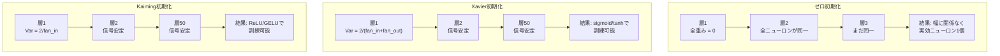
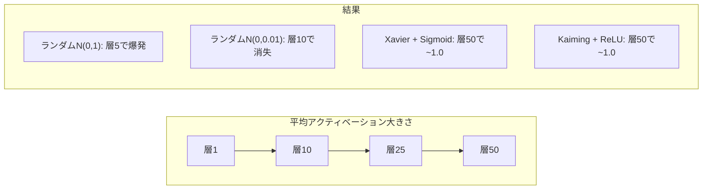
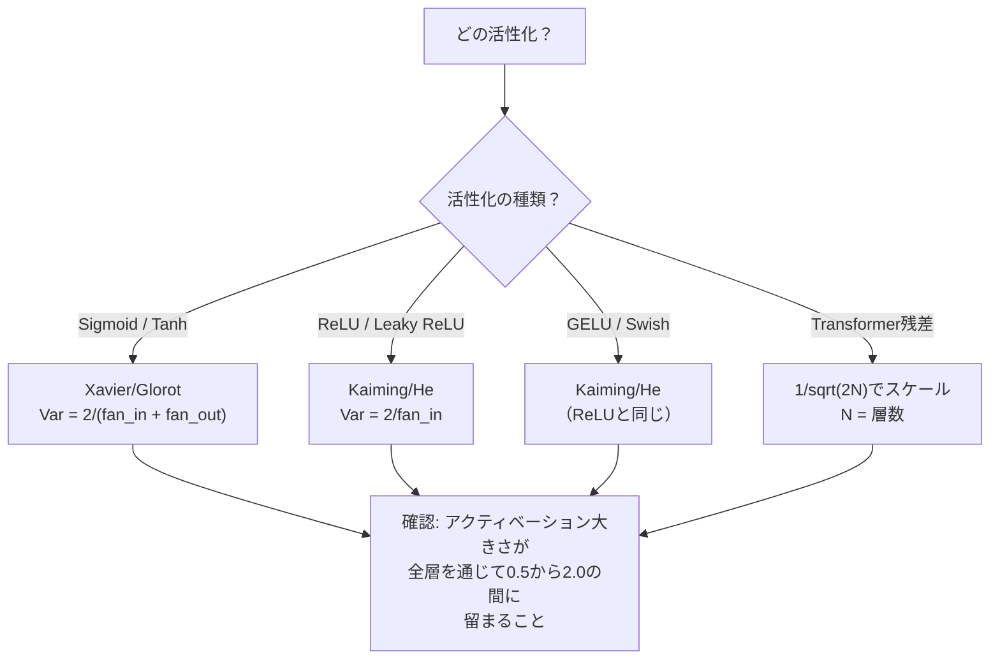

# 重み初期化と訓練安定性

> 間違って初期化するとトレーニングが始まらない。正しく初期化すると50層が3層と同じくらいスムーズに訓練できる。


## 学習目標

- ゼロ、ランダム、Xavier/Glorot、Kaiming/He初期化戦略を実装し、50層を通じたアクティベーション大きさへの効果を測定する
- XavierがVar(w) = 2/(fan_in + fan_out)を使い、KaimingがVar(w) = 2/fan_inを使う理由を導出する
- ゼロ初期化の対称性問題を示し、ランダムスケール単独では不十分な理由を説明する
- 正しい初期化戦略を活性化関数に対応付ける: sigmoid/tanhにはXavier、ReLU/GELUにはKaiming

## 問題設定

すべての重みをゼロで初期化する。何も学習しない。すべてのニューロンが同じ関数を計算し、同じ勾配を受け取り、同一に更新される。10,000エポック後、512ニューロン隠れ層はまだ同じニューロンの512コピーだ。512個のパラメータに対価を払って1個しか得られなかった。

大きすぎる値で初期化する。アクティベーションがネットワーク全体で爆発する。10層で1e15に達する。20層で無限大にオーバーフローする。勾配は同じ軌跡を逆方向にたどる。

標準正規分布からランダムに初期化する。3層では機能する。50層では、ランダムスケールがわずかに小さすぎるか大きすぎるかに応じて、信号がゼロに崩壊するか無限大に爆発する。「機能する」と「壊れる」の境界は薄刃のように薄い。

重み初期化は深層学習で最も過小評価される決定だ。アーキテクチャは論文になる。オプティマイザはブログ記事になる。初期化は脚注になる。だが間違えると他のすべてが意味を持たない、ネットワークは訓練が始まる前に死んでいる。

## 概念

### 対称性問題

層内のすべてのニューロンは同じ構造を持つ: 入力に重みを掛け、バイアスを加え、活性化を適用する。すべての重みが同じ値（ゼロは極端なケース）から始まると、すべてのニューロンが同じ出力を計算する。誤差逆伝播中、すべてのニューロンが同じ勾配を受け取る。更新ステップでは、すべてのニューロンが同じ量だけ変化する。

行き詰まる。ネットワークには数百のパラメータがあるが、すべてが一体となって動く。これを対称性と呼び、ランダム初期化はそれを破る力技だ。各ニューロンが重み空間の異なる点から始まるので、それぞれ異なる特徴を学習する。

しかし「ランダム」だけでは十分でない。ランダム性の**スケール**がネットワークが訓練できるかを決定する。

### 層を通じた分散伝播

fan_in個の入力を持つ単一層を考える:

```
z = w1*x1 + w2*x2 + ... + w_n*x_n
```

各重みwiが分散Var(w)の分布から引かれ、各入力xiの分散がVar(x)なら、出力分散は:

```
Var(z) = fan_in * Var(w) * Var(x)
```

Var(w) = 1でfan_in = 512なら、出力分散は入力分散の512倍になる。10層後: 512^10 = 1.2e27。信号が爆発した。

Var(w) = 0.001なら、出力分散は層ごとに0.001 * 512 = 0.512倍に縮む。10層後: 0.512^10 = 0.00013。信号が消えた。

目標: Var(z) = Var(x)となるようにVar(w)を選ぶ。信号の大きさが層を通じて一定に保たれる。

### Xavier/Glorot初期化

GlorotとBengio（2010）はsigmoidとtanhの活性化に対する解を導出した。順伝播と逆伝播の両方で分散を一定に保つために:

```
Var(w) = 2 / (fan_in + fan_out)
```

実際には、重みは以下から引かれる:

```
w ~ Uniform(-limit, limit)  ここで limit = sqrt(6 / (fan_in + fan_out))
```

または:

```
w ~ Normal(0, sqrt(2 / (fan_in + fan_out)))
```

これはsigmoidとtanhがゼロ付近ではほぼ線形であり、適切に初期化されたアクティベーションがそこに存在するため機能する。分散は数十層を通じて安定したままだ。

### Kaiming/He初期化

ReLUは出力の半分（負のものすべてがゼロになる）を削除する。平均して半分の入力がゼロになるため、実効fan_inが半分になる。Xavier初期化はこれを考慮しない。必要な分散を過小評価する。

He et al.（2015）は式を調整した:

```
Var(w) = 2 / fan_in
```

重みは以下から引かれる:

```
w ~ Normal(0, sqrt(2 / fan_in))
```

2の係数はReLUがアクティベーションの半分をゼロにすることを補償する。これなしでは、信号は層ごとに約0.5倍縮む。50層では: 0.5^50 = 8.8e-16。Kaiming初期化はこれを防ぐ。

### Transformer初期化

GPT-2は異なるパターンを導入した。残差接続は各サブ層の出力を入力に加える:

```
x = x + sublayer(x)
```

各加算が分散を増加させる。N個の残差層では、分散がNに比例して増大する。GPT-2は残差層の重みを1/sqrt(2N)でスケールする。ここでNは層の数だ。これにより蓄積された信号の大きさが安定する。

Llama 3（4050億パラメータ、126層）は同様のスキームを使う。このスケーリングなしでは、残差ストリームが126層のアテンションとフィードフォワードブロックを通じて制限なく成長する。



### 50層を通じたアクティベーション大きさ



### 正しい初期化の選び方



## 実装

### ステップ1: 初期化戦略

重み行列を初期化する4つの方法。それぞれfan_in列とfan_out行を持つリストのリスト（2次元行列）を返す。

```python
import math
import random


def zero_init(fan_in, fan_out):
    return [[0.0 for _ in range(fan_in)] for _ in range(fan_out)]


def random_init(fan_in, fan_out, scale=1.0):
    return [[random.gauss(0, scale) for _ in range(fan_in)] for _ in range(fan_out)]


def xavier_init(fan_in, fan_out):
    std = math.sqrt(2.0 / (fan_in + fan_out))
    return [[random.gauss(0, std) for _ in range(fan_in)] for _ in range(fan_out)]


def kaiming_init(fan_in, fan_out):
    std = math.sqrt(2.0 / fan_in)
    return [[random.gauss(0, std) for _ in range(fan_in)] for _ in range(fan_out)]
```

### ステップ2: 活性化関数

各初期化戦略をその対象の活性化でテストするためにsigmoid、tanh、ReLUが必要だ。

```python
def sigmoid(x):
    x = max(-500, min(500, x))
    return 1.0 / (1.0 + math.exp(-x))


def tanh_act(x):
    return math.tanh(x)


def relu(x):
    return max(0.0, x)
```

### ステップ3: 50層の順伝播

ランダムなデータを深いネットワークに通し、各層での平均アクティベーション大きさを測定する。

```python
def forward_deep(init_fn, activation_fn, n_layers=50, width=64, n_samples=100):
    random.seed(42)
    layer_magnitudes = []

    inputs = [[random.gauss(0, 1) for _ in range(width)] for _ in range(n_samples)]

    for layer_idx in range(n_layers):
        weights = init_fn(width, width)
        biases = [0.0] * width

        new_inputs = []
        for sample in inputs:
            output = []
            for neuron_idx in range(width):
                z = sum(weights[neuron_idx][j] * sample[j] for j in range(width)) + biases[neuron_idx]
                output.append(activation_fn(z))
            new_inputs.append(output)
        inputs = new_inputs

        magnitudes = []
        for sample in inputs:
            magnitudes.append(sum(abs(v) for v in sample) / width)
        mean_mag = sum(magnitudes) / len(magnitudes)
        layer_magnitudes.append(mean_mag)

    return layer_magnitudes
```

### ステップ4: 実験

全組み合わせを実行する: ゼロ初期化、ランダムN(0,1)、ランダムN(0,0.01)、Xavierとsigmoid、Xavierとtanh、Kaimingとの組み合わせ。主要な層での大きさを出力する。

```python
def run_experiment():
    configs = [
        ("Zero init + Sigmoid", lambda fi, fo: zero_init(fi, fo), sigmoid),
        ("Random N(0,1) + ReLU", lambda fi, fo: random_init(fi, fo, 1.0), relu),
        ("Random N(0,0.01) + ReLU", lambda fi, fo: random_init(fi, fo, 0.01), relu),
        ("Xavier + Sigmoid", xavier_init, sigmoid),
        ("Xavier + Tanh", xavier_init, tanh_act),
        ("Kaiming + ReLU", kaiming_init, relu),
    ]

    print(f"{'Strategy':<30} {'L1':>10} {'L5':>10} {'L10':>10} {'L25':>10} {'L50':>10}")
    print("-" * 80)

    for name, init_fn, act_fn in configs:
        mags = forward_deep(init_fn, act_fn)
        row = f"{name:<30}"
        for idx in [0, 4, 9, 24, 49]:
            val = mags[idx]
            if val > 1e6:
                row += f" {'EXPLODED':>10}"
            elif val < 1e-6:
                row += f" {'VANISHED':>10}"
            else:
                row += f" {val:>10.4f}"
        print(row)
```

### ステップ5: 対称性デモ

ゼロ初期化が同一のニューロンを生成することを示す。

```python
def symmetry_demo():
    random.seed(42)
    weights = zero_init(2, 4)
    biases = [0.0] * 4

    inputs = [0.5, -0.3]
    outputs = []
    for neuron_idx in range(4):
        z = sum(weights[neuron_idx][j] * inputs[j] for j in range(2)) + biases[neuron_idx]
        outputs.append(sigmoid(z))

    print("\nSymmetry Demo (4 neurons, zero init):")
    for i, out in enumerate(outputs):
        print(f"  Neuron {i}: output = {out:.6f}")
    all_same = all(abs(outputs[i] - outputs[0]) < 1e-10 for i in range(len(outputs)))
    print(f"  All identical: {all_same}")
    print(f"  Effective parameters: 1 (not {len(weights) * len(weights[0])})")
```

### ステップ6: 層ごとの大きさレポート

50層を通じたアクティベーション大きさの視覚的バーチャートを出力する。

```python
def magnitude_report(name, magnitudes):
    print(f"\n{name}:")
    for i, mag in enumerate(magnitudes):
        if i % 5 == 0 or i == len(magnitudes) - 1:
            if mag > 1e6:
                bar = "X" * 50 + " EXPLODED"
            elif mag < 1e-6:
                bar = "." + " VANISHED"
            else:
                bar_len = min(50, max(1, int(mag * 10)))
                bar = "#" * bar_len
            print(f"  Layer {i+1:3d}: {bar} ({mag:.6f})")
```

## 実用例

PyTorchはこれらを組み込み関数として提供している:

```python
import torch
import torch.nn as nn

layer = nn.Linear(512, 256)

nn.init.xavier_uniform_(layer.weight)
nn.init.xavier_normal_(layer.weight)

nn.init.kaiming_uniform_(layer.weight, nonlinearity='relu')
nn.init.kaiming_normal_(layer.weight, nonlinearity='relu')

nn.init.zeros_(layer.bias)
```

`nn.Linear(512, 256)`を呼び出すと、PyTorchはデフォルトでKaiming均一初期化を使う。ほとんどのシンプルなネットワークが「そのまま動く」のはそのためだ。PyTorchがすでに正しい選択をした。しかしカスタムアーキテクチャを構築したり20層以上に深くなる場合は、何が起きているか理解してデフォルトをオーバーライドする必要があるかもしれない。

Transformerの場合、HuggingFaceモデルは通常`_init_weights`メソッドで初期化を処理する。GPT-2の実装は残差射影を1/sqrt(N)でスケールする。Transformerをゼロから構築する場合、これを自分で追加する必要がある。

## 成果物

このレッスンの成果物:
- `outputs/prompt-init-strategy.md` -- 重み初期化の問題を診断し正しい戦略を推奨するプロンプト

## 演習

1. LeCun初期化（Var = 1/fan_in、SELU活性化用に設計）を追加する。LeCun初期化+tanhとXavier+tanhの50層実験を実行して比較する。

2. GPT-2の残差スケーリングを実装する: 残差ストリームに加える前に各層の出力を1/sqrt(2*N)で乗算する。スケーリングありとなしで50層を実行し、残差の大きさがどのくらい速く成長するかを測定する。

3. ネットワークの層の次元と活性化タイプを取り、正しい初期化を推奨し現在の初期化が問題を引き起こす場合は警告する「初期化ヘルスチェック」関数を作成する。

4. fan_in = 16 vs fan_in = 1024で実験を実行する。XavierとKaimingはfan_inに適応するが、ランダム初期化は適応しない。大きな層では「機能する」と「壊れる」の差がどのように広がるかを示す。

5. 直交初期化（ランダム行列を生成し、SVDを計算し、直交行列Uを使う）を実装する。50層でのReLUネットワークに対してKaimingと比較する。

## 重要用語

| 用語 | よく言われること | 実際の意味 |
|------|----------------|----------------------|
| 重み初期化 | 「ランダムに開始重みを設定する」 | ネットワークが全く訓練できるかを決める初期重み値の選択戦略 |
| 対称性の破れ | 「ニューロンを異なるものにする」 | ニューロンが同一の関数を計算する代わりに異なる特徴を学習するようにランダム初期化を使う |
| Fan-in | 「ニューロンへの入力数」 | 重み付き和で入力分散がどのように蓄積するかを決める受信結合の数 |
| Fan-out | 「ニューロンからの出力数」 | 誤差逆伝播中の勾配分散の維持に関係する発出結合の数 |
| Xavier/Glorot初期化 | 「sigmoidの初期化」 | Var(w) = 2/(fan_in + fan_out)、sigmoidとtanhの活性化を通じた分散保持に設計 |
| Kaiming/He初期化 | 「ReLUの初期化」 | Var(w) = 2/fan_in、ReLUがアクティベーションの半分をゼロにすることを考慮 |
| 分散伝播 | 「層を通じて信号がどのように成長または縮小するか」 | 重みスケールに基づいてアクティベーション分散が層ごとにどのように変化するかの数学的解析 |
| 残差スケーリング | 「GPT-2の初期化トリック」 | N個のTransformer層を通じた分散成長を防ぐために残差接続の重みを1/sqrt(2N)でスケール |
| 死んだネットワーク | 「何も訓練されない」 | 不適切な初期化によりすべての勾配がゼロになるか全アクティベーションが飽和するネットワーク |
| アクティベーション爆発 | 「値が無限大になる」 | 重みの分散が高すぎてアクティベーションの大きさが層を通じて指数関数的に成長するとき |

## 参考文献

- Glorot & Bengio, "Understanding the difficulty of training deep feedforward neural networks" (2010) -- 分散解析を含む元のXavier初期化論文
- He et al., "Delving Deep into Rectifiers" (2015) -- ReLUネットワーク向けのKaiming初期化を導入
- Radford et al., "Language Models are Unsupervised Multitask Learners" (2019) -- 残差スケーリング初期化を含むGPT-2論文
- Mishkin & Matas, "All You Need is a Good Init" (2016) -- 解析的な式の経験的代替として層逐次単位分散初期化
