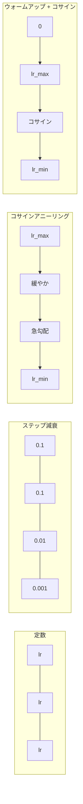
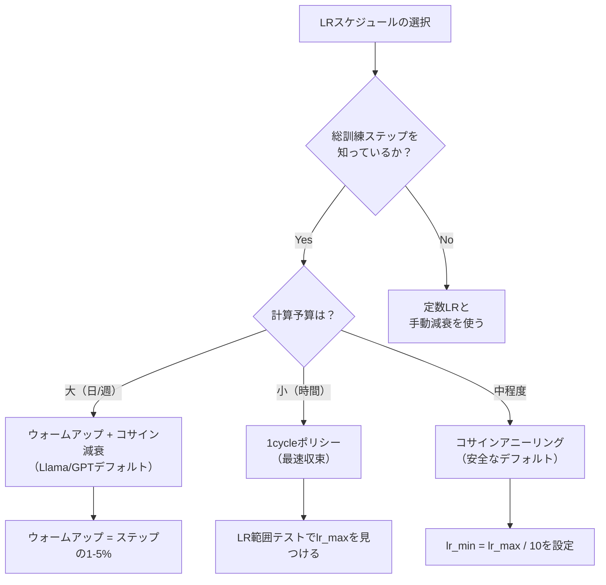
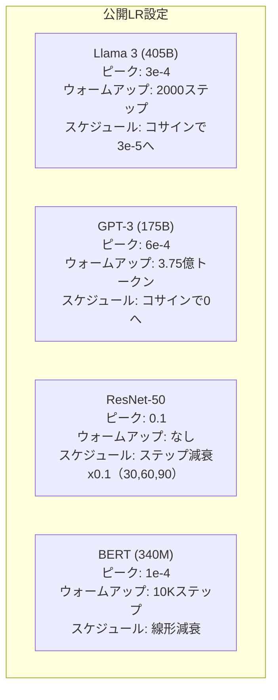

# 学習率スケジュールとウォームアップ

> 学習率は単一で最も重要なハイパーパラメータだ。アーキテクチャでもデータセットのサイズでも活性化関数でもない。学習率だ。他に何もチューニングしないなら、これをチューニングせよ。


## 学習目標

- 定数、ステップ減衰、コサインアニーリング、ウォームアップ+コサイン、1cycleの学習率スケジュールをゼロから実装する
- 学習率選択の3つの失敗モードを示す: 発散（高すぎる）、停滞（低すぎる）、振動（減衰なし）
- Adamベースのオプティマイザにウォームアップが必要な理由と訓練初期を安定化させる方法を説明する
- 同じタスクで5つのスケジュール全ての収束速度を比較し、与えられた訓練予算に対して適切なものを選択する

## 問題設定

学習率を0.1に設定する。訓練が発散する。損失が3ステップで無限大に跳ぶ。0.0001に設定する。訓練が這う。100エポック後、モデルはほとんどランダムから動いていない。0.01に設定する。50エポック訓練が機能するが、ステップが大きすぎるために届かない最小値の周りで損失が振動する。

最適な学習率は定数ではない。訓練中に変化する。最初は大きなステップで素早く進む。訓練の後半は鋭い最小値に落ち着くために小さなステップが必要だ。90%精度と95%精度のモデルの違いはしばしばスケジュールだけだ。

過去3年間に公開されたすべての主要モデルが学習率スケジュールを使う。Llama 3はピークlr=3e-4、2000ウォームアップステップ、3e-5へのコサイン減衰を使った。GPT-3はlr=6e-4、3億7500万トークンでのウォームアップを使った。これらは任意の選択ではない。数百万ドルのコストをかけた広範なハイパーパラメータスイープの結果だ。

スケジュールを理解する必要がある。デフォルトはあなたの問題には機能しないからだ。事前訓練済みモデルをファインチューニングするとき、正しいスケジュールはゼロからの訓練とは異なる。バッチサイズを増やすとき、ウォームアップ期間を変更する必要がある。10,000ステップで訓練が崩壊するとき、スケジュールの問題か別の問題かを知る必要がある。

## 概念

### 定数学習率

最もシンプルなアプローチ。値を選んで全ステップで使う。

```
lr(t) = lr_0
```

最適であることはほぼない。訓練終盤には高すぎる（最小値の周りの振動）か序盤には低すぎる（小さなステップによる計算の無駄）かのどちらかだ。小さなモデルとデバッグには問題ない。1時間以上訓練するものには最悪の選択だ。

### ステップ減衰

ResNet時代のオールドスクールなアプローチ。固定されたエポックで学習率を係数（通常10倍）で削減する。

```
lr(t) = lr_0 * gamma^(floor(epoch / step_size))
```

gamma = 0.1でstep_size = 30は: lrが30エポックごとに10倍低下することを意味する。ResNet-50はこれを使った。lr=0.1、エポック30、60、90で10倍低下。

問題: 最適な減衰点はデータセットとアーキテクチャに依存する。別の問題に移ると、いつ低下させるかを再チューニングする必要がある。移行が急激で、レートが急に変わると損失がスパイクする可能性がある。

### コサインアニーリング

最小学習率まで最大学習率からコサイン曲線に従って滑らかに減衰する:

```
lr(t) = lr_min + 0.5 * (lr_max - lr_min) * (1 + cos(pi * t / T))
```

tは現在のステップ、Tは総ステップ数。

t=0では、コサイン項が1なのでlr = lr_max。t=Tでは、コサイン項が-1なのでlr = lr_min。最初は減衰が緩やかで、中間で加速し、終盤に向けて再び緩やかになる。

これはほとんどの現代の訓練実行のデフォルトだ。lr_maxとlr_min以外にチューニングするハイパーパラメータがない。コサイン形状は訓練の大半が中間で起こるという経験的観察と一致している。その重要な期間中に適度なステップサイズが欲しい。

### ウォームアップ: 小さく始める理由

Adamと他の適応オプティマイザは勾配の平均と分散の移動推定を維持する。ステップ0では、これらの推定はゼロに初期化される。最初のいくつかの勾配更新はゴミの統計に基づいている。この期間に学習率が大きいと、モデルは巨大で方向性のないステップを踏む。

ウォームアップがこれを修正する。非常に小さな学習率（しばしばlr_max / warmup_stepsまたはゼロ）から始め、最初のNステップでlr_maxまで線形に増加させる。フル学習率に達する頃には、Adamの統計が安定している。

```
lr(t) = lr_max * (t / warmup_steps)     t < warmup_stepsの場合
```

典型的なウォームアップ: 総訓練ステップの1〜5%。Llama 3は約1.8兆トークン訓練して2000ステップウォームアップした。GPT-3は3億7500万トークンでウォームアップした。

### 線形ウォームアップ + コサイン減衰

現代のデフォルト。線形に増加してからコサインで減衰:

```
t < warmup_stepsの場合:
    lr(t) = lr_max * (t / warmup_steps)
それ以外:
    progress = (t - warmup_steps) / (total_steps - warmup_steps)
    lr(t) = lr_min + 0.5 * (lr_max - lr_min) * (1 + cos(pi * progress))
```

これがLlama、GPT、PaLM、ほとんどの現代TransformerのLRスケジュールだ。ウォームアップが初期の不安定性を防ぐ。コサイン減衰がモデルを良い最小値に落ち着かせる。

### 1cycleポリシー

Leslie Smithの発見（2018）: 訓練前半に低い値から高い値へ学習率を増加させ、後半に元に戻す。直感に反する。訓練の途中でなぜ学習率を**増加**させるのか？

理論: 高い学習率は最適化軌跡にノイズを加えることで正則化として機能する。モデルはランプアップ段階でより多くの損失ランドスケープを探索し、より良いバジンを見つける。ランプダウン段階は見つかった最良のバジン内で精緻化する。

```
フェーズ1 (0からT/2):    lrがlr_max/25からlr_maxへ増加
フェーズ2 (T/2からT):    lrがlr_maxからlr_max/10000へ減少
```

1cycleは固定された計算予算でコサインアニーリングより速く訓練することが多い。トレードオフ: 総ステップ数を事前に知らなければならない。

### スケジュールの形状



### 意思決定フローチャート



### 公開モデルの実際の数値



## 実装

### ステップ1: スケジュール関数

各関数は現在のステップを取り、そのステップでの学習率を返す。

```python
import math


def constant_schedule(step, lr=0.01, **kwargs):
    return lr


def step_decay_schedule(step, lr=0.1, step_size=100, gamma=0.1, **kwargs):
    return lr * (gamma ** (step // step_size))


def cosine_schedule(step, lr=0.01, total_steps=1000, lr_min=1e-5, **kwargs):
    if step >= total_steps:
        return lr_min
    return lr_min + 0.5 * (lr - lr_min) * (1 + math.cos(math.pi * step / total_steps))


def warmup_cosine_schedule(step, lr=0.01, total_steps=1000, warmup_steps=100, lr_min=1e-5, **kwargs):
    if total_steps <= warmup_steps:
        return lr * (step / max(warmup_steps, 1))
    if step < warmup_steps:
        return lr * step / warmup_steps
    progress = (step - warmup_steps) / (total_steps - warmup_steps)
    return lr_min + 0.5 * (lr - lr_min) * (1 + math.cos(math.pi * progress))


def one_cycle_schedule(step, lr=0.01, total_steps=1000, **kwargs):
    mid = max(total_steps // 2, 1)
    if step < mid:
        return (lr / 25) + (lr - lr / 25) * step / mid
    else:
        progress = (step - mid) / max(total_steps - mid, 1)
        return lr * (1 - progress) + (lr / 10000) * progress
```

### ステップ2: 全スケジュールを可視化

各スケジュールが訓練を通じてどのように変化するかを示すテキストベースのプロットを出力する。

```python
def visualize_schedule(name, schedule_fn, total_steps=500, **kwargs):
    steps = list(range(0, total_steps, total_steps // 20))
    if total_steps - 1 not in steps:
        steps.append(total_steps - 1)

    lrs = [schedule_fn(s, total_steps=total_steps, **kwargs) for s in steps]
    max_lr = max(lrs) if max(lrs) > 0 else 1.0

    print(f"\n{name}:")
    for s, lr_val in zip(steps, lrs):
        bar_len = int(lr_val / max_lr * 40)
        bar = "#" * bar_len
        print(f"  Step {s:4d}: lr={lr_val:.6f} {bar}")
```

### ステップ3: 訓練ネットワーク

円データセット上のシンプルな2層ネットワーク（前のレッスンと同じ）、ただし今回はスケジュールを変える。

```python
import random


def sigmoid(x):
    x = max(-500, min(500, x))
    return 1.0 / (1.0 + math.exp(-x))


def relu(x):
    return max(0.0, x)


def relu_deriv(x):
    return 1.0 if x > 0 else 0.0


def make_circle_data(n=200, seed=42):
    random.seed(seed)
    data = []
    for _ in range(n):
        x = random.uniform(-2, 2)
        y = random.uniform(-2, 2)
        label = 1.0 if x * x + y * y < 1.5 else 0.0
        data.append(([x, y], label))
    return data


def train_with_schedule(schedule_fn, schedule_name, data, epochs=300, base_lr=0.05, **kwargs):
    random.seed(0)
    hidden_size = 8
    total_steps = epochs * len(data)

    std = math.sqrt(2.0 / 2)
    w1 = [[random.gauss(0, std) for _ in range(2)] for _ in range(hidden_size)]
    b1 = [0.0] * hidden_size
    w2 = [random.gauss(0, std) for _ in range(hidden_size)]
    b2 = 0.0

    step = 0
    epoch_losses = []

    for epoch in range(epochs):
        total_loss = 0
        correct = 0

        for x, target in data:
            lr = schedule_fn(step, lr=base_lr, total_steps=total_steps, **kwargs)

            z1 = []
            h = []
            for i in range(hidden_size):
                z = w1[i][0] * x[0] + w1[i][1] * x[1] + b1[i]
                z1.append(z)
                h.append(relu(z))

            z2 = sum(w2[i] * h[i] for i in range(hidden_size)) + b2
            out = sigmoid(z2)

            error = out - target
            d_out = error * out * (1 - out)

            for i in range(hidden_size):
                d_h = d_out * w2[i] * relu_deriv(z1[i])
                w2[i] -= lr * d_out * h[i]
                for j in range(2):
                    w1[i][j] -= lr * d_h * x[j]
                b1[i] -= lr * d_h
            b2 -= lr * d_out

            total_loss += (out - target) ** 2
            if (out >= 0.5) == (target >= 0.5):
                correct += 1
            step += 1

        avg_loss = total_loss / len(data)
        accuracy = correct / len(data) * 100
        epoch_losses.append(avg_loss)

    return epoch_losses
```

### ステップ4: 全スケジュールを比較

各スケジュールで同じネットワークを訓練し、最終損失と収束挙動を比較する。

```python
def compare_schedules(data):
    configs = [
        ("Constant", constant_schedule, {}),
        ("Step Decay", step_decay_schedule, {"step_size": 15000, "gamma": 0.1}),
        ("Cosine", cosine_schedule, {"lr_min": 1e-5}),
        ("Warmup+Cosine", warmup_cosine_schedule, {"warmup_steps": 3000, "lr_min": 1e-5}),
        ("1cycle", one_cycle_schedule, {}),
    ]

    print(f"\n{'Schedule':<20} {'Start Loss':>12} {'Mid Loss':>12} {'End Loss':>12} {'Best Loss':>12}")
    print("-" * 70)

    for name, schedule_fn, extra_kwargs in configs:
        losses = train_with_schedule(schedule_fn, name, data, epochs=300, base_lr=0.05, **extra_kwargs)
        mid_idx = len(losses) // 2
        best = min(losses)
        print(f"{name:<20} {losses[0]:>12.6f} {losses[mid_idx]:>12.6f} {losses[-1]:>12.6f} {best:>12.6f}")
```

### ステップ5: LR高すぎvs低すぎ

3つの失敗モードを示す: 高すぎる（発散）、低すぎる（這う）、ちょうど良い。

```python
def lr_sensitivity(data):
    learning_rates = [1.0, 0.1, 0.01, 0.001, 0.0001]

    print("\nLR Sensitivity (constant schedule, 100 epochs):")
    print(f"  {'LR':>10} {'Start Loss':>12} {'End Loss':>12} {'Status':>15}")
    print("  " + "-" * 52)

    for lr in learning_rates:
        losses = train_with_schedule(constant_schedule, f"lr={lr}", data, epochs=100, base_lr=lr)
        start = losses[0]
        end = losses[-1]

        if end > start or math.isnan(end) or end > 1.0:
            status = "DIVERGED"
        elif end > start * 0.9:
            status = "BARELY MOVED"
        elif end < 0.15:
            status = "CONVERGED"
        else:
            status = "LEARNING"

        end_str = f"{end:.6f}" if not math.isnan(end) else "NaN"
        print(f"  {lr:>10.4f} {start:>12.6f} {end_str:>12} {status:>15}")
```

## 実用例

PyTorchは`torch.optim.lr_scheduler`でスケジューラを提供している:

```python
import torch
import torch.optim as optim
from torch.optim.lr_scheduler import CosineAnnealingLR, OneCycleLR, StepLR

model = nn.Sequential(nn.Linear(10, 64), nn.ReLU(), nn.Linear(64, 1))
optimizer = optim.Adam(model.parameters(), lr=3e-4)

scheduler = CosineAnnealingLR(optimizer, T_max=1000, eta_min=1e-5)

for step in range(1000):
    loss = train_step(model, optimizer)
    scheduler.step()
```

ウォームアップ + コサインには、ラムダスケジューラかHuggingFaceの`get_cosine_schedule_with_warmup`を使う:

```python
from transformers import get_cosine_schedule_with_warmup

scheduler = get_cosine_schedule_with_warmup(
    optimizer,
    num_warmup_steps=2000,
    num_training_steps=100000,
)
```

HuggingFaceの関数はほとんどのLlamaとGPTのファインチューニングスクリプトが使うものだ。迷ったら、ウォームアップ = 総ステップの3〜5%でウォームアップ + コサインを使う。ほぼ全てに機能する。

## 成果物

このレッスンの成果物:
- `outputs/prompt-lr-schedule-advisor.md` -- あなたの訓練設定に適切な学習率スケジュールとハイパーパラメータを推奨するプロンプト

## 演習

1. 指数減衰を実装する: lr(t) = lr_0 * gamma^t、ここでgamma = 0.999。円データセットでコサインアニーリングと比較する。

2. 学習率範囲テスト（Leslie Smith）を実装する: 数百ステップ訓練しながらLRを1e-7から1へ指数関数的に増加させる。損失 vs LRをプロットする。最適な最大LRは損失が増加し始める直前だ。

3. ウォームアップ + コサインでウォームアップの長さを変えて訓練する: 総ステップの0%、1%、5%、10%、20%。訓練が最も安定するスイートスポットを見つける。

4. ウォームリスタート付きコサインアニーリング（SGDR）を実装する: Tステップごとに学習率をlr_maxにリセットして再び減衰させる。より長い訓練実行で標準コサインと比較する。

5. 訓練損失を監視して損失が安定したときに自動的にウォームアップからコサインに切り替え、損失が長すぎるプラトーにあればlrを下げる「スケジュール外科医」を構築する。

## 重要用語

| 用語 | よく言われること | 実際の意味 |
|------|----------------|----------------------|
| 学習率 | 「モデルがどのくらい速く学習するか」 | パラメータ更新サイズを決定するために勾配に掛けるスカラー |
| スケジュール | 「時間とともにLRを変える」 | 訓練ステップを学習率にマッピングする関数、収束を最適化するために設計 |
| ウォームアップ | 「小さなLRから始める」 | オプティマイザ統計を安定化させるために最初のNステップでLRをほぼゼロから目標値まで線形に増加させる |
| コサインアニーリング | 「滑らかなLR減衰」 | 訓練を通じてlr_maxからlr_minへコサイン曲線に従ってLRを減少させる |
| ステップ減衰 | 「マイルストーンでLRを下げる」 | 固定されたエポック間隔でLRを係数（通常0.1）で乗算する |
| 1cycleポリシー | 「上がって下がる」 | 1つのサイクルでLRを増加させてから減少させてより速い収束を得るLeslie Smithの方法 |
| LR範囲テスト | 「最良の学習率を見つける」 | 損失が発散し始める値を見つけるためにLRを増加させながら短く訓練する |
| ウォームリスタート付きコサイン | 「リセットして繰り返す」 | 定期的にLRをlr_maxにリセットして再び減衰させる（SGDR） |
| Eta min | 「LRの下限」 | スケジュールが減衰する最小学習率 |
| ピーク学習率 | 「最大LR」 | 訓練中に達する最高のLR、通常ウォームアップ後 |

## 参考文献

- Loshchilov & Hutter, "SGDR: Stochastic Gradient Descent with Warm Restarts" (2017) -- コサインアニーリングとウォームリスタートを導入
- Smith, "Super-Convergence: Very Fast Training of Neural Networks Using Large Learning Rates" (2018) -- 1cycleポリシー論文
- Touvron et al., "Llama 2: Open Foundation and Fine-Tuned Chat Models" (2023) -- スケールでのウォームアップ + コサインスケジュールを記録
- Goyal et al., "Accurate, Large Minibatch SGD: Training ImageNet in 1 Hour" (2017) -- 大きなバッチ訓練のための線形スケーリングルールとウォームアップ
