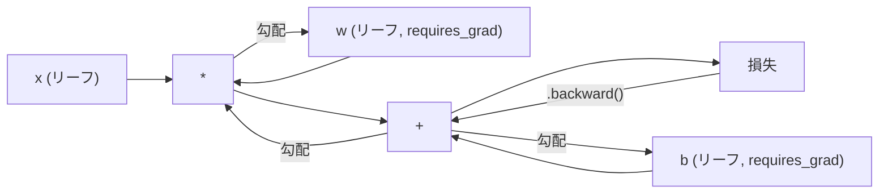
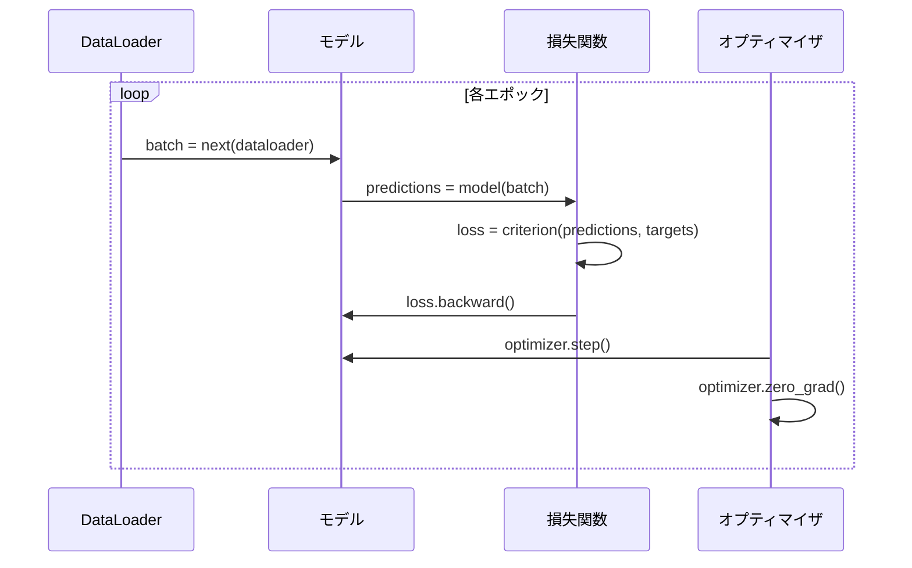

# PyTorch入門

> ピストンとクランクシャフトからエンジンを作った。今度は皆が実際に運転するものを学ぼう。


## 学習目標

- PyTorchのnn.Module、nn.Sequential、autogradを使ってニューラルネットワークを構築・訓練する
- PyTorchテンソル、GPUアクセラレーション、標準訓練ループ（zero_grad、forward、loss、backward、step）を使う
- ゼロから作ったミニフレームワークのコンポーネントをPyTorchの対応物に変換する
- 同じタスクで純粋PythonフレームワークとPyTorchの訓練速度をプロファイルして比較する

## 問題設定

動作するミニフレームワークがある。Linear層、ReLU、ドロップアウト、バッチノルム、Adam、DataLoader、訓練ループ。純粋Pythonで円分類問題の4層ネットワークを訓練する。

同じ問題でPyTorchより500倍遅くもある。

ミニフレームワークはネストしたPythonループで1サンプルずつ処理する。PyTorchは同じ操作をGPUで実行する最適化されたC++/CUDAカーネルにディスパッチする。単一のNVIDIA A100で、PyTorchはImageNet（128万画像）でResNet-50（2560万パラメータ）を約6時間で訓練する。あなたのフレームワークは同じタスクで約3,000時間かかる。メモリが先に尽きなければ。

速度だけがギャップではない。あなたのフレームワークにはGPUサポートがない。自動微分がない。各モジュールのbackward()を手書きした。シリアライゼーションがない。分散訓練がない。混合精度がない。printステートメントなしに勾配フローをデバッグする方法がない。

PyTorchはこれらすべてのギャップを埋める。そして、すでに構築したのと全く同じメンタルモデルを保ちながら: Module、forward()、parameters()、backward()、optimizer.step()。コンセプトは1対1で移行する。構文はほぼ同一だ。違いはPyTorchがゼロから設計した同じインターフェースの後ろに10年のシステムエンジニアリングを包んでいることだ。

## 概念

### PyTorchが勝った理由

2015年、TensorFlowは何かを実行する前に静的な計算グラフを定義することを要求した。グラフを構築し、コンパイルし、データを通す。デバッグはグラフ可視化を見つめることを意味した。アーキテクチャの変更はグラフをゼロから再構築することを意味した。

PyTorchは2017年に異なる哲学でローンチした: イーガー実行。Pythonを書く。すぐに実行される。`y = model(x)`は「後でyを計算するノードをグラフに追加する」ではなく、実際にyを今計算する。これは標準のPythonデバッグツールが機能することを意味した。print()が機能した。pdbが機能した。forward passのif/elseが機能した。

2020年までに市場が判断した。MLリサーチ論文でPyTorchのシェアは7%（2017）から75%超（2022）に上がった。Meta、Google DeepMind、OpenAI、Anthropic、Hugging FaceはすべてPyTorchを主要フレームワークとして使う。TensorFlow 2.xは対応してイーガー実行を採用した。PyTorchの設計が正しかったという暗黙の認承だ。

教訓: 開発者体験は積み上がる。10%遅くて50%速くデバッグできるフレームワークは毎回勝つ。

### テンソル

テンソルは3つの重要なプロパティを持つ多次元配列だ: shape、dtype、device。

```python
import torch

x = torch.zeros(3, 4)           # shape: (3, 4), dtype: float32, device: cpu
x = torch.randn(2, 3, 224, 224) # 2枚のRGB画像のバッチ、224x224
x = torch.tensor([1, 2, 3])     # Pythonリストから
```

**Shape**は次元性だ。スカラーはshape ()、ベクトルは(n,)、行列は(m, n)、画像のバッチは(batch, channels, height, width)。

**Dtype**は精度とメモリを制御する。

| dtype | ビット数 | 範囲 | ユースケース |
|-------|------|-------|----------|
| float32 | 32 | ~7桁の十進数 | デフォルト訓練 |
| float16 | 16 | ~3.3桁の十進数 | 混合精度 |
| bfloat16 | 16 | float32と同じ範囲、精度が低い | LLM訓練 |
| int8 | 8 | -128から127 | 量子化推論 |

**Device**は計算がどこで行われるかを決定する。

```python
device = torch.device("cuda" if torch.cuda.is_available() else "cpu")
x = torch.randn(3, 4, device=device)
x = x.to("cuda")
x = x.cpu()
```

すべての操作は同じデバイスのすべてのテンソルを必要とする。これは初心者が最もよくぶつかるPyTorchエラーだ: `RuntimeError: Expected all tensors to be on the same device`。計算前に全てを同じデバイスに移動することで修正する。

**Reshaping**は定数時間だ。データではなくメタデータを変更する。

```python
x = torch.randn(2, 3, 4)
x.view(2, 12)      # (2, 12)にreshape -- contiguousである必要がある
x.reshape(6, 4)    # (6, 4)にreshape -- 常に機能する
x.permute(2, 0, 1) # 次元を並べ替え
x.unsqueeze(0)     # 次元を追加: (1, 2, 3, 4)
x.squeeze()        # サイズ1の次元を削除
```

### Autograd

ミニフレームワークはすべてのモジュールにbackward()を実装することを要求した。PyTorchは要求しない。テンソルのすべての操作を有向非巡回グラフ（計算グラフ）に記録し、そのグラフを逆方向にたどって自動的に勾配を計算する。



あなたのフレームワークとの主な違い: PyTorchはテープベースの自動微分を使う。すべての操作が順伝播中に「テープ」に追加される。`.backward()`を呼び出すとテープが逆方向に再生される。

```python
x = torch.randn(3, requires_grad=True)
y = x ** 2 + 3 * x
z = y.sum()
z.backward()
print(x.grad)  # dz/dx = 2x + 3
```

autogradの3つのルール:

1. `requires_grad=True`のリーフテンソルだけが勾配を蓄積する
2. 勾配はデフォルトで蓄積される。各逆伝播の前に`optimizer.zero_grad()`を呼ぶ
3. `torch.no_grad()`は勾配追跡を無効にする（評価中に使用）

### nn.Module

`nn.Module`はPyTorchのすべてのニューラルネットワークコンポーネントの基底クラスだ。レッスン10でこの抽象化を既に構築した。PyTorchのバージョンは自動パラメータ登録、再帰的モジュール検出、デバイス管理、state dictシリアライゼーションを追加する。

```python
import torch.nn as nn

class MLP(nn.Module):
    def __init__(self, input_dim, hidden_dim, output_dim):
        super().__init__()
        self.layer1 = nn.Linear(input_dim, hidden_dim)
        self.relu = nn.ReLU()
        self.layer2 = nn.Linear(hidden_dim, output_dim)

    def forward(self, x):
        x = self.layer1(x)
        x = self.relu(x)
        x = self.layer2(x)
        return x
```

`__init__`の属性として`nn.Module`や`nn.Parameter`を代入すると、PyTorchは自動的にそれを登録する。`model.parameters()`は登録されたすべてのパラメータを再帰的に収集する。これがミニフレームワークのように手動で重みを集める必要がない理由だ。

主要なビルディングブロック:

| モジュール | 機能 | パラメータ数 |
|--------|-------------|------------|
| nn.Linear(in, out) | Wx + b | in*out + out |
| nn.Conv2d(in_ch, out_ch, k) | 2D畳み込み | in_ch*out_ch*k*k + out_ch |
| nn.BatchNorm1d(features) | アクティベーション正規化 | 2 * features |
| nn.Dropout(p) | ランダムゼロ化 | 0 |
| nn.ReLU() | max(0, x) | 0 |
| nn.GELU() | ガウス誤差線形 | 0 |
| nn.Embedding(vocab, dim) | ルックアップテーブル | vocab * dim |
| nn.LayerNorm(dim) | サンプルごとの正規化 | 2 * dim |

### 損失関数とオプティマイザ

PyTorchはあなたが構築したすべてのproduction-readyなバージョンを提供している。

**損失関数**（`torch.nn`から）:

| 損失 | タスク | 入力 |
|------|------|-------|
| nn.MSELoss() | 回帰 | 任意のshape |
| nn.CrossEntropyLoss() | マルチクラス分類 | ロジット（softmaxでない） |
| nn.BCEWithLogitsLoss() | 二値分類 | ロジット（sigmoidでない） |
| nn.L1Loss() | 回帰（ロバスト） | 任意のshape |
| nn.CTCLoss() | シーケンス整合 | 対数確率 |

注意: `CrossEntropyLoss`は内部で`LogSoftmax` + `NLLLoss`を組み合わせる。softmax出力でなく生のロジットを渡す。これは誤った勾配を黙って生成する一般的なミスだ。

**オプティマイザ**（`torch.optim`から）:

| オプティマイザ | いつ使うか | 典型的なLR |
|-----------|-------------|-----------|
| SGD(params, lr, momentum) | CNN、よくチューニングされたパイプライン | 0.01--0.1 |
| Adam(params, lr) | デフォルトの出発点 | 1e-3 |
| AdamW(params, lr, weight_decay) | Transformer、ファインチューニング | 1e-4--1e-3 |
| LBFGS(params) | 小規模、二次 | 1.0 |

### 訓練ループ

すべてのPyTorchの訓練ループは同じ5ステップパターンに従う。レッスン10からこれを既に知っている。



標準パターン:

```python
for epoch in range(num_epochs):
    model.train()
    for inputs, targets in train_loader:
        inputs, targets = inputs.to(device), targets.to(device)
        optimizer.zero_grad()
        outputs = model(inputs)
        loss = criterion(outputs, targets)
        loss.backward()
        optimizer.step()
```

バッチループ内の5行。GPT-4、Stable Diffusion、LLaMAを訓練した5行。アーキテクチャが変わる。データが変わる。これらの5行は変わらない。

### DatasetとDataLoader

PyTorchの`Dataset`は2つのメソッドを持つ抽象クラスだ: `__len__`と`__getitem__`。`DataLoader`はバッチ化、シャッフル、マルチプロセスデータロードでラップする。

```python
from torch.utils.data import Dataset, DataLoader

class MNISTDataset(Dataset):
    def __init__(self, images, labels):
        self.images = images
        self.labels = labels

    def __len__(self):
        return len(self.labels)

    def __getitem__(self, idx):
        return self.images[idx], self.labels[idx]

loader = DataLoader(dataset, batch_size=64, shuffle=True, num_workers=4)
```

`num_workers=4`はGPUが現在のバッチで訓練している間に並行してデータをロードする4つのプロセスを生成する。ディスクバウンドなワークロード（大きな画像、音声）では、これだけで訓練速度が2倍になることがある。

### GPU訓練

モデルをGPUに移動する:

```python
device = torch.device("cuda" if torch.cuda.is_available() else "cpu")
model = model.to(device)
```

これはすべてのパラメータとバッファを再帰的にGPUに移動する。次に訓練中の各バッチを移動する:

```python
inputs, targets = inputs.to(device), targets.to(device)
```

**混合精度**は現代のGPU（A100、H100、RTX 4090）でメモリ使用量を半減させ、スループットを2倍にする。マスター重みをfloat32に保ちながらfloat16でforward/backwardを実行する:

```python
from torch.amp import autocast, GradScaler

scaler = GradScaler()
for inputs, targets in loader:
    with autocast(device_type="cuda"):
        outputs = model(inputs)
        loss = criterion(outputs, targets)
    scaler.scale(loss).backward()
    scaler.step(optimizer)
    scaler.update()
    optimizer.zero_grad()
```

### 比較: ミニフレームワーク vs PyTorch vs JAX

| 特徴 | ミニフレームワーク（L10） | PyTorch | JAX |
|---------|---------------------|---------|-----|
| 自動微分 | 手動backward() | テープベースのautograd | 関数変換 |
| 実行 | イーガー（Pythonループ） | イーガー（C++カーネル） | トレース済み + JITコンパイル |
| GPUサポート | なし | あり（CUDA、ROCm、MPS） | あり（CUDA、TPU） |
| 速度（MNIST MLP） | ~300秒/エポック | ~0.5秒/エポック | ~0.3秒/エポック |
| モジュールシステム | カスタムModuleクラス | nn.Module | ステートレス関数（Flax/Equinox） |
| デバッグ | print() | print()、pdb、breakpoint() | 難しい（JITトレーシングがprintを壊す） |
| エコシステム | なし | Hugging Face、Lightning、timm | Flax、Optax、Orbax |
| 学習曲線 | 自分で作った | 中程度 | 急（関数型パラダイム） |
| プロダクション用途 | おもちゃの問題 | Meta、OpenAI、Anthropic、HF | Google DeepMind、Midjourney |

## 実装

PyTorchのみのプリミティブを使ってMNISTで訓練する3層MLP。高レベルのラッパーなし。`torchvision.datasets`なし。生データを自分でダウンロードしてパースする。

### ステップ1: 生ファイルからMNISTをロードする

MNISTは4つのgzipファイルとして提供される: 訓練画像（60,000 x 28 x 28）、訓練ラベル、テスト画像（10,000 x 28 x 28）、テストラベル。ダウンロードしてバイナリ形式をパースする。

```python
import torch
import torch.nn as nn
import struct
import gzip
import urllib.request
import os

def download_mnist(path="./mnist_data"):
    base_url = "https://storage.googleapis.com/cvdf-datasets/mnist/"
    files = [
        "train-images-idx3-ubyte.gz",
        "train-labels-idx1-ubyte.gz",
        "t10k-images-idx3-ubyte.gz",
        "t10k-labels-idx1-ubyte.gz",
    ]
    os.makedirs(path, exist_ok=True)
    for f in files:
        filepath = os.path.join(path, f)
        if not os.path.exists(filepath):
            urllib.request.urlretrieve(base_url + f, filepath)

def load_images(filepath):
    with gzip.open(filepath, "rb") as f:
        magic, num, rows, cols = struct.unpack(">IIII", f.read(16))
        data = f.read()
        images = torch.frombuffer(bytearray(data), dtype=torch.uint8)
        images = images.reshape(num, rows * cols).float() / 255.0
    return images

def load_labels(filepath):
    with gzip.open(filepath, "rb") as f:
        magic, num = struct.unpack(">II", f.read(8))
        data = f.read()
        labels = torch.frombuffer(bytearray(data), dtype=torch.uint8).long()
    return labels
```

### ステップ2: モデルを定義する

3層MLP: 784 -> 256 -> 128 -> 10。ReLU活性化。正則化のためのドロップアウト。シンプルにするためバッチノルムなし。

```python
class MNISTModel(nn.Module):
    def __init__(self):
        super().__init__()
        self.net = nn.Sequential(
            nn.Linear(784, 256),
            nn.ReLU(),
            nn.Dropout(0.2),
            nn.Linear(256, 128),
            nn.ReLU(),
            nn.Dropout(0.2),
            nn.Linear(128, 10),
        )

    def forward(self, x):
        return self.net(x)
```

出力層は10個の生のロジット（数字ごとに1個）を生成する。softmaxなし。`CrossEntropyLoss`が内部でそれを処理する。

パラメータ数: 784*256 + 256 + 256*128 + 128 + 128*10 + 10 = 235,146。現代の基準では非常に小さい。GPT-2 smallは1.24億個ある。これは数秒で訓練できる。

### ステップ3: 訓練ループ

forward-loss-backward-stepの標準パターン。

```python
def train_one_epoch(model, loader, criterion, optimizer, device):
    model.train()
    total_loss = 0
    correct = 0
    total = 0
    for images, labels in loader:
        images, labels = images.to(device), labels.to(device)
        optimizer.zero_grad()
        outputs = model(images)
        loss = criterion(outputs, labels)
        loss.backward()
        optimizer.step()
        total_loss += loss.item() * images.size(0)
        _, predicted = outputs.max(1)
        correct += predicted.eq(labels).sum().item()
        total += labels.size(0)
    return total_loss / total, correct / total


def evaluate(model, loader, criterion, device):
    model.eval()
    total_loss = 0
    correct = 0
    total = 0
    with torch.no_grad():
        for images, labels in loader:
            images, labels = images.to(device), labels.to(device)
            outputs = model(images)
            loss = criterion(outputs, labels)
            total_loss += loss.item() * images.size(0)
            _, predicted = outputs.max(1)
            correct += predicted.eq(labels).sum().item()
            total += labels.size(0)
    return total_loss / total, correct / total
```

評価中の`torch.no_grad()`に注意。autogradを無効にしてメモリ使用量を削減し推論を速める。これなしでは、PyTorchが一度も使わない計算グラフを構築する。

### ステップ4: すべてを結線する

```python
def main():
    device = torch.device("cuda" if torch.cuda.is_available() else "cpu")

    download_mnist()
    train_images = load_images("./mnist_data/train-images-idx3-ubyte.gz")
    train_labels = load_labels("./mnist_data/train-labels-idx1-ubyte.gz")
    test_images = load_images("./mnist_data/t10k-images-idx3-ubyte.gz")
    test_labels = load_labels("./mnist_data/t10k-labels-idx1-ubyte.gz")

    train_dataset = torch.utils.data.TensorDataset(train_images, train_labels)
    test_dataset = torch.utils.data.TensorDataset(test_images, test_labels)
    train_loader = torch.utils.data.DataLoader(
        train_dataset, batch_size=64, shuffle=True
    )
    test_loader = torch.utils.data.DataLoader(
        test_dataset, batch_size=256, shuffle=False
    )

    model = MNISTModel().to(device)
    criterion = nn.CrossEntropyLoss()
    optimizer = torch.optim.Adam(model.parameters(), lr=1e-3)

    num_params = sum(p.numel() for p in model.parameters())
    print(f"Device: {device}")
    print(f"Parameters: {num_params:,}")
    print(f"Train samples: {len(train_dataset):,}")
    print(f"Test samples: {len(test_dataset):,}")
    print()

    for epoch in range(10):
        train_loss, train_acc = train_one_epoch(
            model, train_loader, criterion, optimizer, device
        )
        test_loss, test_acc = evaluate(
            model, test_loader, criterion, device
        )
        print(
            f"Epoch {epoch+1:2d} | "
            f"Train Loss: {train_loss:.4f} | Train Acc: {train_acc:.4f} | "
            f"Test Loss: {test_loss:.4f} | Test Acc: {test_acc:.4f}"
        )

    torch.save(model.state_dict(), "mnist_mlp.pt")
    print(f"\nModel saved to mnist_mlp.pt")
    print(f"Final test accuracy: {test_acc:.4f}")
```

10エポック後の期待出力: ~97.8%のテスト精度。CPUでの訓練時間: ~30秒。GPUで: ~5秒。同じアーキテクチャのミニフレームワークで: ~45分。

## 実用例

### 簡単な比較: ミニフレームワーク vs PyTorch

| ミニフレームワーク（レッスン10） | PyTorch |
|---------------------------|---------|
| `model = Sequential(Linear(784, 256), ReLU(), ...)` | `model = nn.Sequential(nn.Linear(784, 256), nn.ReLU(), ...)` |
| `pred = model.forward(x)` | `pred = model(x)` |
| `optimizer.zero_grad()` | `optimizer.zero_grad()` |
| `grad = criterion.backward()` then `model.backward(grad)` | `loss.backward()` |
| `optimizer.step()` | `optimizer.step()` |
| GPUなし | `model.to("cuda")` |
| すべてのモジュールで手動backward | autogradが全て処理 |

インターフェースはほぼ同一だ。違いはフードの下のすべてにある。

### モデルの保存とロード

```python
torch.save(model.state_dict(), "model.pt")

model = MNISTModel()
model.load_state_dict(torch.load("model.pt", weights_only=True))
model.eval()
```

常にモデルオブジェクトではなく`state_dict()`（パラメータ辞書）を保存する。モデルオブジェクトの保存はpickleを使い、コードをリファクタリングすると壊れる。State dictはポータブルだ。

### 学習率スケジューリング

```python
scheduler = torch.optim.lr_scheduler.CosineAnnealingLR(
    optimizer, T_max=10
)
for epoch in range(10):
    train_one_epoch(model, train_loader, criterion, optimizer, device)
    scheduler.step()
```

PyTorchは15以上のスケジューラを提供している: StepLR、ExponentialLR、CosineAnnealingLR、OneCycleLR、ReduceLROnPlateau。すべて同じオプティマイザインターフェースに接続する。

## 成果物

このレッスンの成果物は2つだ:

- `outputs/prompt-pytorch-debugger.md` -- 一般的なPyTorchの訓練失敗を診断するプロンプト
- `outputs/skill-pytorch-patterns.md` -- PyTorchの訓練パターンのスキルリファレンス

## 演習

1. **バッチ正規化を追加する。** 各Linear層の後（活性化の前）に`nn.BatchNorm1d`を挿入する。ドロップアウトのみのバージョンとテスト精度と訓練速度を比較する。バッチノルムは少ないエポックで98%以上に達するはずだ。

2. **学習率ファインダーを実装する。** 指数的に増加する学習率（1e-7から1.0）で1エポック訓練する。損失 vs LRをプロットする。最適なLRは損失が上昇し始める直前だ。これを使ってMNISTモデルに良いLRを選ぶ。

3. **混合精度でGPUに移植する。** 訓練ループに`torch.amp.autocast`と`GradScaler`を追加する。GPUで混合精度ありとなしのスループット（サンプル/秒）を測定する。A100では~2倍の高速化を期待する。

4. **カスタムDatasetを構築する。** Fashion-MNISTをダウンロードする（MNISTと同じ形式だが衣服アイテム）。`__getitem__`と`__len__`を持つ`FashionMNISTDataset(Dataset)`クラスを実装する。同じMLPを訓練して精度を比較する。Fashion-MNISTは難しい。~98%ではなく~88%を期待する。

5. **AdamをSGD + モメンタムに置き換える。** `SGD(params, lr=0.01, momentum=0.9)`で訓練する。収束曲線を比較する。次に`CosineAnnealingLR`スケジューラを追加して、10エポックまでにSGDがAdamに追いつくか確認する。

## 重要用語

| 用語 | よく言われること | 実際の意味 |
|------|----------------|----------------------|
| テンソル | 「多次元配列」 | すべての操作に焼き付けられた自動微分サポートを持つ型付き、デバイス対応の配列 |
| Autograd | 「自動逆伝播」 | 順伝播中に操作を記録し、逆方向に再生して正確な勾配を計算するテープベースのシステム |
| nn.Module | 「層」 | 任意の微分可能な計算ブロックの基底クラス。パラメータを登録し、ネスティングをサポートし、train/evalモードを処理する |
| state_dict | 「モデルの重み」 | パラメータ名をテンソルにマッピングするOrderedDict。訓練済みモデルのポータブルでシリアル化可能な表現 |
| .backward() | 「勾配を計算する」 | 計算グラフを逆方向にたどり、requires_grad=Trueのすべてのリーフテンソルの勾配を計算・蓄積する |
| .to(device) | 「GPUに移動する」 | 指定されたデバイス（CPU、CUDA、MPS）にすべてのパラメータとバッファを再帰的に転送する |
| DataLoader | 「データパイプライン」 | Datasetからデータロードをバッチ化、シャッフル、オプションで並列化するイテレータ |
| 混合精度 | 「float16を使う」 | 数値安定性のためにfloat32のマスター重みを保ちながら速度のためにfloat16でforward/backwardを訓練する |
| イーガー実行 | 「今すぐ実行する」 | 後の計算ステップに延期されずに呼ばれた時にすぐ操作が実行される。PyTorchをTF 1.xと差別化する核心の設計選択 |
| zero_grad | 「勾配をリセット」 | PyTorchはデフォルトで勾配を蓄積するため、次の逆伝播の前にすべてのパラメータ勾配をゼロに設定する |

## 参考文献

- Paszke et al., "PyTorch: An Imperative Style, High-Performance Deep Learning Library" (2019) -- PyTorchの設計上のトレードオフを説明する元の論文
- PyTorch Tutorials: "Learning PyTorch with Examples" (https://pytorch.org/tutorials/beginner/pytorch_with_examples.html) -- テンソルからnn.Moduleへの公式パス
- PyTorch Performance Tuning Guide (https://pytorch.org/tutorials/recipes/recipes/tuning_guide.html) -- 混合精度、DataLoaderワーカー、ピンされたメモリ、他のプロダクション最適化
- Horace He, "Making Deep Learning Go Brrrr" (https://horace.io/brrr_intro.html) -- GPU訓練が速い理由、PyTorch固有の最適化戦略
