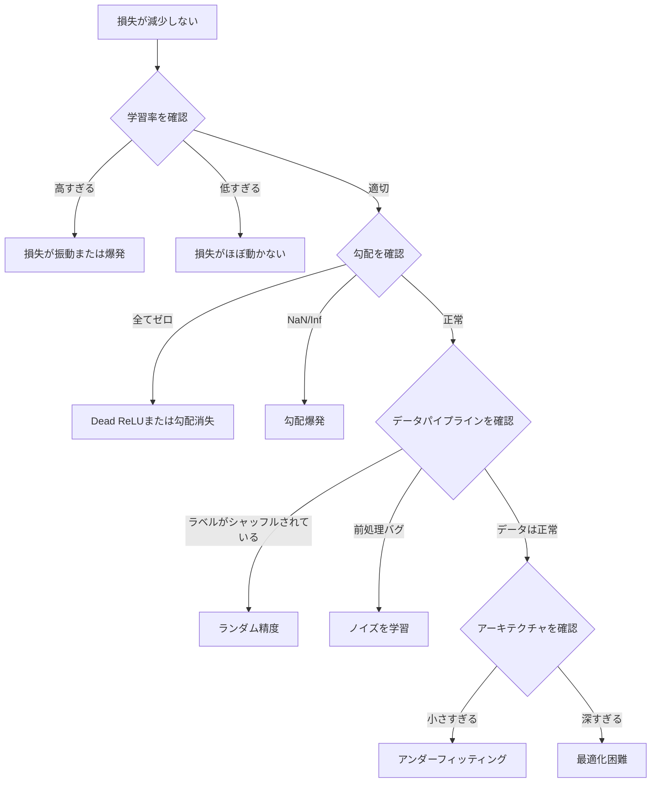
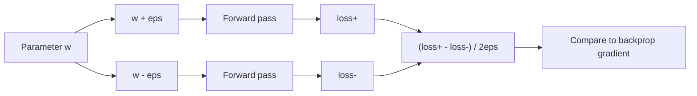
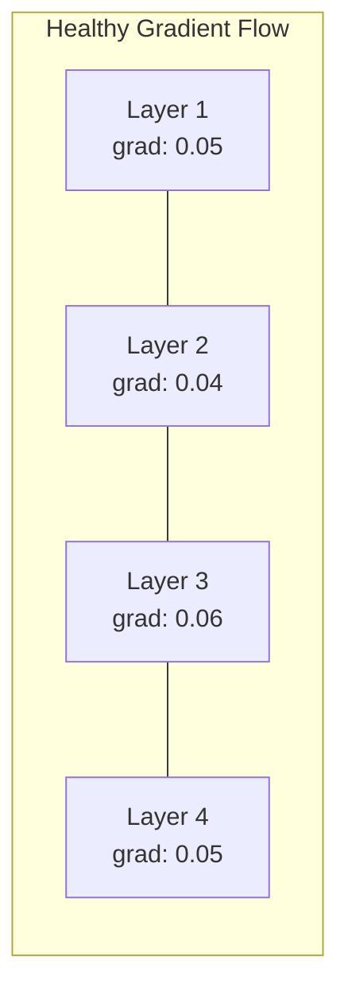
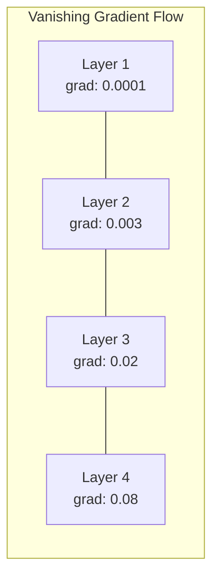
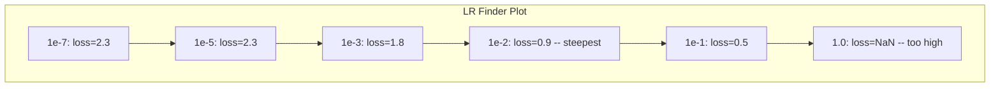

# ニューラルネットワークのデバッグ

> ネットワークはコンパイルされた。実行された。数値を出力した。その数値は間違っているが、何もクラッシュしていない。最も難しい種類のデバッグへようこそ——エラーメッセージのない種類の。


## 学習目標

- 体系的なデバッグ戦略を用いて、一般的なニューラルネットワークの失敗（NaN損失、フラットな損失曲線、過学習、振動）を診断する
- 「1バッチ過学習」テクニックを適用して、モデルアーキテクチャと訓練ループが正しいことを検証する
- 勾配の大きさ、活性化の分布、重みのノルムを検査して、勾配消失・爆発問題を特定する
- データパイプライン、モデルアーキテクチャ、損失関数、オプティマイザ、学習率の問題をカバーするデバッグチェックリストを作成する

## 問題

従来のソフトウェアは壊れるとクラッシュする。nullポインタは例外をスローする。型の不一致はコンパイル時に失敗する。オフバイワンエラーは明らかに間違った出力を生成する。

ニューラルネットワークはそのような贅沢を与えてくれない。

壊れたニューラルネットワークは最後まで実行され、損失値を出力し、予測を生成する。損失は減少するかもしれない。予測は妥当に見えるかもしれない。しかしモデルは暗黙のうちに間違っている——ショートカットを学習したり、ノイズを記憶したり、役に立たない局所最小値に収束したりしている。Googleの研究者たちは、MLデバッグ時間の60-70%が「サイレント」バグ——エラーを生成しないがモデル品質を低下させる——に費やされると推定した。

動作するモデルと壊れたモデルの違いは、しばしば1行の置き違い：`zero_grad()`の欠落、次元の転置、10倍ずれた学習率。「ニューラルネットワーク訓練のレシピ」（2019年）はこう始まる：「最も一般的なニューラルネットのミスは、クラッシュしないバグだ。」

このレッスンはそれらのバグを見つける方法を教える。

## 概念

### デバッグのマインドセット

print-and-prayデバッグを忘れろ。ニューラルネットワークのデバッグには体系的なアプローチが必要だ。なぜなら、フィードバックループが遅く（訓練実行ごとに数分〜数時間）、症状が曖昧だから（悪い損失は20の異なることを意味する可能性がある）。

黄金律：**シンプルに始め、一度に一つずつ複雑さを追加し、各部分を独立して検証せよ。**



### 症状1：損失が減少しない

これは最も一般的な不満だ。訓練ループが実行され、エポックが経過し、損失はフラットなままか激しく振動する。

**誤った学習率。** 高すぎる：損失が振動するかNaNにジャンプする。低すぎる：損失の減少が非常に遅くフラットに見える。Adamの場合は1e-3から始める。SGDの場合は1e-1または1e-2から始める。他に何か問題があると結論づける前に、常に10倍ずつ離れた3つの学習率（例：1e-2、1e-3、1e-4）を試す。

**Dead ReLU。** ReLUニューロンが大きな負の入力を受け取ると、0を出力し勾配も0になる。もう二度と活性化しない。十分なニューロンが死ぬと、ネットワークは学習できなくなる。確認：各ReLU層の後に正確に0の活性化の割合を出力する。50%以上が死んでいる場合は、LeakyReLUに切り替えるか学習率を下げる。

**勾配消失。** sigmoidやtanh活性化を持つ深いネットワークでは、勾配は逆伝播するにつれて指数的に縮小する。最初の層に到達する頃には、ほぼ0になっている。最初の層が学習を止める。修正：ReLU/GELUを使う、残差接続を追加する、またはバッチ正規化を使う。

**勾配爆発。** 反対の問題——勾配が指数的に成長する。RNNと非常に深いネットワークで一般的。損失がNaNにジャンプする。修正：勾配クリッピング（`torch.nn.utils.clip_grad_norm_`）、学習率を下げる、または正規化を追加する。

### 症状2：損失は減少しているがモデルが悪い

損失は下がる。訓練精度は99%に達する。しかしテスト精度は55%。または実際のデータでモデルが意味不明な出力を生成する。

**過学習。** モデルがパターンを学習する代わりに訓練データを記憶する。訓練損失と検証損失の差が時間とともに広がる。修正：データを増やす、ドロップアウト、重み減衰、早期停止、データ拡張。

**データリーク。** テストデータが訓練に漏れた。精度が不審に高い。一般的な原因：分割前のシャッフル、完全なデータセットの統計を使った前処理、分割をまたぐ重複サンプル。修正：先に分割し、次に前処理し、重複を確認する。

**ラベルエラー。** ほとんどの実際のデータセットのラベルの5-10%は間違っている（Northcuttら、2021年——「テストセットに蔓延するラベルエラー」）。モデルがノイズを学習する。修正：confident learningを使って誤ったラベルのサンプルを見つけて修正するか、損失のトランケーションを使って高損失のサンプルを無視する。

### 症状3：損失がNaNまたはInf

損失値が`nan`または`inf`になる。訓練が死んだ。

**学習率が高すぎる。** 勾配更新が行き過ぎて重みが爆発する。修正：10倍小さくする。

**log(0)またはlog(負の値)。** クロスエントロピー損失は`log(p)`を計算する。モデルが正確に0または負の確率を出力すると、対数が爆発する。修正：予測を`[eps, 1-eps]`（`eps=1e-7`）にクランプする。

**ゼロ除算。** バッチ正規化は標準偏差で除算する。定数値のバッチはstd=0になる。修正：分母にイプシロンを追加する（PyTorchはデフォルトでこれを行うが、カスタム実装はそうでない場合がある）。

**数値オーバーフロー。** `exp()`に供給された大きな活性化がInfを生成する。softmaxは特に影響を受けやすい。修正：指数化の前に最大値を引く（log-sum-expトリック）。

### テクニック1：勾配チェック

分析的な勾配（逆伝播から）と数値的な勾配（有限差分から）を比較する。一致しない場合、逆伝播にバグがある。

パラメータ`w`の数値的勾配：

```
grad_numerical = (loss(w + eps) - loss(w - eps)) / (2 * eps)
```

一致の指標（相対差）：

```
rel_diff = |grad_analytical - grad_numerical| / max(|grad_analytical|, |grad_numerical|, 1e-8)
```

`rel_diff < 1e-5`：正しい。`rel_diff > 1e-3`：ほぼ確実にバグ。



### テクニック2：活性化統計

訓練中に各層の後の活性化の平均と標準偏差を監視する。健全なネットワークは、活性化が平均0、std1（正規化後）に近いか、少なくとも有界に保たれる。

| 健全性指標 | 平均 | std | 診断 |
|-----------|------|-----|------|
| 健全 | ~0 | ~1 | ネットワークは正常に学習している |
| 飽和 | >>0または<<0 | ~0 | 活性化が極端な値に固まっている |
| Dead | 0 | 0 | ニューロンが死んでいる（全てゼロ） |
| 爆発 | >>10 | >>10 | 活性化が無制限に成長している |

### テクニック3：勾配フローの可視化

各層の平均勾配の大きさをプロットする。健全なネットワークでは、勾配の大きさは層を通じておおよそ同じになるはずだ。初期の層が後の層より1000倍小さな勾配を持つ場合、勾配消失がある。





### テクニック4：1バッチ過学習テスト

ディープラーニングで最も重要なデバッグテクニック。

1つの小さなバッチ（8〜32サンプル）を取り、それに対して100回以上のイテレーションで訓練する。損失はほぼゼロに近づき、訓練精度は100%になるはずだ。そうならない場合、モデルまたは訓練ループに根本的なバグがある——完全な訓練に進んではならない。

このテストが捕捉するもの：
- 壊れた損失関数
- 壊れた逆伝播
- データを表現するには小さすぎるアーキテクチャ
- モデルのパラメータに接続されていないオプティマイザ
- データとラベルの不整合

実行には30秒かかり、完全な訓練実行の何時間ものデバッグを節約する。

### テクニック5：学習率ファインダー

Leslie Smith（2017年）は、1エポックかけて非常に小さい値（1e-7）から非常に大きい値（10）まで学習率をスイープしながら損失を記録することを提案した。損失対学習率をプロットする。最適な学習率は、損失の減少が最も速くなる率より約10倍小さい。



この例での最適LR：~1e-3（最急点の1オーダー手前）。

### 一般的なPyTorchバグ

これらはPyTorchコミュニティで最も多くの時間を無駄にするバグだ：

| バグ | 症状 | 修正 |
|-----|------|------|
| `optimizer.zero_grad()`を忘れる | 勾配がバッチをまたいで蓄積し、損失が振動する | `loss.backward()`の前に`optimizer.zero_grad()`を追加 |
| テスト時に`model.eval()`を忘れる | ドロップアウトとバッチ正規化が異なる動作をし、テスト精度が実行ごとに変化する | `model.eval()`と`torch.no_grad()`を追加 |
| 誤ったテンソル形状 | サイレントなブロードキャストが間違った結果を生成し、エラーなし | デバッグ中はすべての操作の後に形状を出力する |
| CPU/GPUの不一致 | `RuntimeError: expected CUDA tensor` | モデルとデータの両方に`.to(device)`を使う |
| テンソルのデタッチを忘れる | 計算グラフが永遠に成長し、OOM | `.detach()`または`with torch.no_grad()`を使う |
| autogradを壊すインプレース操作 | `RuntimeError: modified by in-place operation` | `x += 1`を`x = x + 1`に置き換える |
| データが正規化されていない | 損失がランダムチャンスレベルで固まる | 入力をmean=0、std=1に正規化する |
| 誤ったdtypeのラベル | クロスエントロピーは`Long`を期待するが`Float`が来る | ラベルをキャスト：`labels.long()` |

### マスターデバッグテーブル

| 症状 | 可能性の高い原因 | 最初に試すこと |
|------|---------------|--------------|
| 損失が-log(1/クラス数)で固まる | モデルが一様分布を予測している | データパイプラインを確認し、ラベルが入力に一致することを検証する |
| 数ステップ後に損失がNaN | 学習率が高すぎる | LRを10倍下げる |
| 即座に損失がNaN | log(0)またはゼロ除算 | log/除算操作にイプシロンを追加する |
| 損失が激しく振動 | LRが高すぎるかバッチサイズが小さすぎる | LRを下げ、バッチサイズを増やす |
| 損失が減少して停滞 | ファインチューニングフェーズでLRが高すぎる | LRスケジュールを追加する（コサインまたはステップ減衰） |
| 訓練精度は高いがテスト精度が低い | 過学習 | ドロップアウト、重み減衰、データを増やす |
| 訓練精度=テスト精度=チャンス | モデルが何も学習していない | 1バッチ過学習テストを実行する |
| 訓練精度=テスト精度だが両方低い | 未学習 | より大きなモデル、より多くの層、より多くの特徴量 |
| 勾配が全てゼロ | Dead ReLUまたは切り離された計算グラフ | LeakyReLUに切り替え、`.requires_grad`を確認する |
| 訓練中にメモリ不足 | バッチが大きすぎるかグラフが解放されていない | バッチサイズを減らし、evalに`torch.no_grad()`を使う |

## 実装

活性化、勾配、損失曲線を監視する診断ツールキット。ネットワークを意図的に壊し、ツールキットを使って各問題を診断する。

### ステップ1：NetworkDebuggerクラス

PyTorchモデルにフックして、層ごとの活性化と勾配の統計を記録する。

```python
import torch
import torch.nn as nn
import math


class NetworkDebugger:
    def __init__(self, model):
        self.model = model
        self.activation_stats = {}
        self.gradient_stats = {}
        self.loss_history = []
        self.lr_losses = []
        self.hooks = []
        self._register_hooks()

    def _register_hooks(self):
        for name, module in self.model.named_modules():
            if isinstance(module, (nn.Linear, nn.Conv2d, nn.ReLU, nn.LeakyReLU)):
                hook = module.register_forward_hook(self._make_activation_hook(name))
                self.hooks.append(hook)
                hook = module.register_full_backward_hook(self._make_gradient_hook(name))
                self.hooks.append(hook)

    def _make_activation_hook(self, name):
        def hook(module, input, output):
            with torch.no_grad():
                out = output.detach().float()
                self.activation_stats[name] = {
                    "mean": out.mean().item(),
                    "std": out.std().item(),
                    "fraction_zero": (out == 0).float().mean().item(),
                    "min": out.min().item(),
                    "max": out.max().item(),
                }
        return hook

    def _make_gradient_hook(self, name):
        def hook(module, grad_input, grad_output):
            if grad_output[0] is not None:
                with torch.no_grad():
                    grad = grad_output[0].detach().float()
                    self.gradient_stats[name] = {
                        "mean": grad.mean().item(),
                        "std": grad.std().item(),
                        "abs_mean": grad.abs().mean().item(),
                        "max": grad.abs().max().item(),
                    }
        return hook

    def record_loss(self, loss_value):
        self.loss_history.append(loss_value)

    def check_loss_health(self):
        if len(self.loss_history) < 2:
            return "NOT_ENOUGH_DATA"
        recent = self.loss_history[-10:]
        if any(math.isnan(v) or math.isinf(v) for v in recent):
            return "NAN_OR_INF"
        if len(self.loss_history) >= 20:
            first_half = sum(self.loss_history[:10]) / 10
            second_half = sum(self.loss_history[-10:]) / 10
            if second_half >= first_half * 0.99:
                return "NOT_DECREASING"
        if len(recent) >= 5:
            diffs = [recent[i+1] - recent[i] for i in range(len(recent)-1)]
            if max(diffs) - min(diffs) > 2 * abs(sum(diffs) / len(diffs)):
                return "OSCILLATING"
        return "HEALTHY"

    def check_activations(self):
        issues = []
        for name, stats in self.activation_stats.items():
            if stats["fraction_zero"] > 0.5:
                issues.append(f"DEAD_NEURONS: {name} has {stats['fraction_zero']:.0%} zero activations")
            if abs(stats["mean"]) > 10:
                issues.append(f"EXPLODING_ACTIVATIONS: {name} mean={stats['mean']:.2f}")
            if stats["std"] < 1e-6:
                issues.append(f"COLLAPSED_ACTIVATIONS: {name} std={stats['std']:.2e}")
        return issues if issues else ["HEALTHY"]

    def check_gradients(self):
        issues = []
        grad_magnitudes = []
        for name, stats in self.gradient_stats.items():
            grad_magnitudes.append((name, stats["abs_mean"]))
            if stats["abs_mean"] < 1e-7:
                issues.append(f"VANISHING_GRADIENT: {name} abs_mean={stats['abs_mean']:.2e}")
            if stats["abs_mean"] > 100:
                issues.append(f"EXPLODING_GRADIENT: {name} abs_mean={stats['abs_mean']:.2e}")
        if len(grad_magnitudes) >= 2:
            first_mag = grad_magnitudes[0][1]
            last_mag = grad_magnitudes[-1][1]
            if last_mag > 0 and first_mag / last_mag > 100:
                issues.append(f"GRADIENT_RATIO: first/last = {first_mag/last_mag:.0f}x (vanishing)")
        return issues if issues else ["HEALTHY"]

    def print_report(self):
        print("\n=== NETWORK DEBUGGER REPORT ===")
        print(f"\nLoss health: {self.check_loss_health()}")
        if self.loss_history:
            print(f"  Last 5 losses: {[f'{v:.4f}' for v in self.loss_history[-5:]]}")
        print("\nActivation diagnostics:")
        for item in self.check_activations():
            print(f"  {item}")
        print("\nGradient diagnostics:")
        for item in self.check_gradients():
            print(f"  {item}")
        print("\nPer-layer activation stats:")
        for name, stats in self.activation_stats.items():
            print(f"  {name}: mean={stats['mean']:.4f} std={stats['std']:.4f} zero={stats['fraction_zero']:.1%}")
        print("\nPer-layer gradient stats:")
        for name, stats in self.gradient_stats.items():
            print(f"  {name}: abs_mean={stats['abs_mean']:.2e} max={stats['max']:.2e}")

    def remove_hooks(self):
        for hook in self.hooks:
            hook.remove()
        self.hooks.clear()
```

### ステップ2：1バッチ過学習テスト

```python
def overfit_one_batch(model, x_batch, y_batch, criterion, lr=0.01, steps=200):
    optimizer = torch.optim.Adam(model.parameters(), lr=lr)
    model.train()
    print("\n=== OVERFIT ONE BATCH TEST ===")
    print(f"Batch size: {x_batch.shape[0]}, Steps: {steps}")

    for step in range(steps):
        optimizer.zero_grad()
        output = model(x_batch)
        loss = criterion(output, y_batch)
        loss.backward()
        optimizer.step()

        if step % 50 == 0 or step == steps - 1:
            with torch.no_grad():
                preds = (output > 0).float() if output.shape[-1] == 1 else output.argmax(dim=1)
                targets = y_batch if y_batch.dim() == 1 else y_batch.squeeze()
                acc = (preds.squeeze() == targets).float().mean().item()
            print(f"  Step {step:3d} | Loss: {loss.item():.6f} | Accuracy: {acc:.1%}")

    final_loss = loss.item()
    if final_loss > 0.1:
        print(f"\n  FAIL: Loss did not converge ({final_loss:.4f}). Model or training loop is broken.")
        return False
    print(f"\n  PASS: Loss converged to {final_loss:.6f}")
    return True
```

### ステップ3：学習率ファインダー

```python
def find_learning_rate(model, x_data, y_data, criterion, start_lr=1e-7, end_lr=10, steps=100):
    import copy
    original_state = copy.deepcopy(model.state_dict())
    optimizer = torch.optim.SGD(model.parameters(), lr=start_lr)
    lr_mult = (end_lr / start_lr) ** (1 / steps)

    model.train()
    results = []
    best_loss = float("inf")
    current_lr = start_lr

    print("\n=== LEARNING RATE FINDER ===")

    for step in range(steps):
        optimizer.zero_grad()
        output = model(x_data)
        loss = criterion(output, y_data)

        if math.isnan(loss.item()) or loss.item() > best_loss * 10:
            break

        best_loss = min(best_loss, loss.item())
        results.append((current_lr, loss.item()))

        loss.backward()
        optimizer.step()

        current_lr *= lr_mult
        for param_group in optimizer.param_groups:
            param_group["lr"] = current_lr

    model.load_state_dict(original_state)

    if len(results) < 10:
        print("  Could not complete LR sweep -- loss diverged too quickly")
        return results

    min_loss_idx = min(range(len(results)), key=lambda i: results[i][1])
    suggested_lr = results[max(0, min_loss_idx - 10)][0]

    print(f"  Swept {len(results)} steps from {start_lr:.0e} to {results[-1][0]:.0e}")
    print(f"  Minimum loss {results[min_loss_idx][1]:.4f} at lr={results[min_loss_idx][0]:.2e}")
    print(f"  Suggested learning rate: {suggested_lr:.2e}")

    return results
```

### ステップ4：勾配チェッカー

```python
def _flat_to_multi_index(flat_idx, shape):
    multi_idx = []
    remaining = flat_idx
    for dim in reversed(shape):
        multi_idx.insert(0, remaining % dim)
        remaining //= dim
    return tuple(multi_idx)


def gradient_check(model, x, y, criterion, eps=1e-4):
    model.train()
    x_double = x.double()
    y_double = y.double()
    model_double = model.double()

    print("\n=== GRADIENT CHECK ===")
    overall_max_diff = 0
    checked = 0

    for name, param in model_double.named_parameters():
        if not param.requires_grad:
            continue

        layer_max_diff = 0

        model_double.zero_grad()
        output = model_double(x_double)
        loss = criterion(output, y_double)
        loss.backward()
        analytical_grad = param.grad.clone()

        num_checks = min(5, param.numel())
        for i in range(num_checks):
            idx = _flat_to_multi_index(i, param.shape)
            original = param.data[idx].item()

            param.data[idx] = original + eps
            with torch.no_grad():
                loss_plus = criterion(model_double(x_double), y_double).item()

            param.data[idx] = original - eps
            with torch.no_grad():
                loss_minus = criterion(model_double(x_double), y_double).item()

            param.data[idx] = original

            numerical = (loss_plus - loss_minus) / (2 * eps)
            analytical = analytical_grad[idx].item()

            denom = max(abs(numerical), abs(analytical), 1e-8)
            rel_diff = abs(numerical - analytical) / denom

            layer_max_diff = max(layer_max_diff, rel_diff)
            checked += 1

        overall_max_diff = max(overall_max_diff, layer_max_diff)
        status = "OK" if layer_max_diff < 1e-5 else "MISMATCH"
        print(f"  {name}: max_rel_diff={layer_max_diff:.2e} [{status}]")

    model.float()

    print(f"\n  Checked {checked} parameters")
    if overall_max_diff < 1e-5:
        print("  PASS: Gradients match (rel_diff < 1e-5)")
    elif overall_max_diff < 1e-3:
        print("  WARN: Small differences (1e-5 < rel_diff < 1e-3)")
    else:
        print("  FAIL: Gradient mismatch detected (rel_diff > 1e-3)")
    return overall_max_diff
```

### ステップ5：意図的に壊されたネットワーク

ツールキットを壊されたネットワークに適用し、それぞれを診断する。

```python
def demo_broken_networks():
    torch.manual_seed(42)
    x = torch.randn(64, 10)
    y = (x[:, 0] > 0).long()

    print("\n" + "=" * 60)
    print("BUG 1: Learning rate too high (lr=10)")
    print("=" * 60)
    model1 = nn.Sequential(nn.Linear(10, 32), nn.ReLU(), nn.Linear(32, 2))
    debugger1 = NetworkDebugger(model1)
    optimizer1 = torch.optim.SGD(model1.parameters(), lr=10.0)
    criterion = nn.CrossEntropyLoss()
    for step in range(20):
        optimizer1.zero_grad()
        out = model1(x)
        loss = criterion(out, y)
        debugger1.record_loss(loss.item())
        loss.backward()
        optimizer1.step()
    debugger1.print_report()
    debugger1.remove_hooks()

    print("\n" + "=" * 60)
    print("BUG 2: Dead ReLUs from bad initialization")
    print("=" * 60)
    model2 = nn.Sequential(nn.Linear(10, 32), nn.ReLU(), nn.Linear(32, 32), nn.ReLU(), nn.Linear(32, 2))
    with torch.no_grad():
        for m in model2.modules():
            if isinstance(m, nn.Linear):
                m.weight.fill_(-1.0)
                m.bias.fill_(-5.0)
    debugger2 = NetworkDebugger(model2)
    optimizer2 = torch.optim.Adam(model2.parameters(), lr=1e-3)
    for step in range(50):
        optimizer2.zero_grad()
        out = model2(x)
        loss = criterion(out, y)
        debugger2.record_loss(loss.item())
        loss.backward()
        optimizer2.step()
    debugger2.print_report()
    debugger2.remove_hooks()

    print("\n" + "=" * 60)
    print("BUG 3: Missing zero_grad (gradients accumulate)")
    print("=" * 60)
    model3 = nn.Sequential(nn.Linear(10, 32), nn.ReLU(), nn.Linear(32, 2))
    debugger3 = NetworkDebugger(model3)
    optimizer3 = torch.optim.SGD(model3.parameters(), lr=0.01)
    for step in range(50):
        out = model3(x)
        loss = criterion(out, y)
        debugger3.record_loss(loss.item())
        loss.backward()
        optimizer3.step()
    debugger3.print_report()
    debugger3.remove_hooks()

    print("\n" + "=" * 60)
    print("HEALTHY NETWORK: Correct setup for comparison")
    print("=" * 60)
    model_good = nn.Sequential(nn.Linear(10, 32), nn.ReLU(), nn.Linear(32, 2))
    debugger_good = NetworkDebugger(model_good)
    optimizer_good = torch.optim.Adam(model_good.parameters(), lr=1e-3)
    for step in range(50):
        optimizer_good.zero_grad()
        out = model_good(x)
        loss = criterion(out, y)
        debugger_good.record_loss(loss.item())
        loss.backward()
        optimizer_good.step()
    debugger_good.print_report()
    debugger_good.remove_hooks()

    print("\n" + "=" * 60)
    print("OVERFIT-ONE-BATCH TEST (healthy model)")
    print("=" * 60)
    model_test = nn.Sequential(nn.Linear(10, 32), nn.ReLU(), nn.Linear(32, 2))
    overfit_one_batch(model_test, x[:8], y[:8], criterion)

    print("\n" + "=" * 60)
    print("LEARNING RATE FINDER")
    print("=" * 60)
    model_lr = nn.Sequential(nn.Linear(10, 32), nn.ReLU(), nn.Linear(32, 2))
    find_learning_rate(model_lr, x, y, criterion)

    print("\n" + "=" * 60)
    print("GRADIENT CHECK")
    print("=" * 60)
    model_grad = nn.Sequential(nn.Linear(10, 8), nn.ReLU(), nn.Linear(8, 2))
    gradient_check(model_grad, x[:4], y[:4], criterion)
```

## 活用

### PyTorch組み込みツール

```python
import torch
import torch.nn as nn

model = nn.Sequential(
    nn.Linear(768, 256),
    nn.ReLU(),
    nn.Linear(256, 10),
)

with torch.autograd.detect_anomaly():
    output = model(input_tensor)
    loss = criterion(output, target)
    loss.backward()

for name, param in model.named_parameters():
    if param.grad is not None:
        print(f"{name}: grad_mean={param.grad.abs().mean():.2e}")
```

### Weights & Biasesとの統合

```python
import wandb

wandb.init(project="debug-training")

for epoch in range(100):
    loss = train_one_epoch()
    wandb.log({
        "loss": loss,
        "lr": optimizer.param_groups[0]["lr"],
        "grad_norm": torch.nn.utils.clip_grad_norm_(model.parameters(), float("inf")),
    })

    for name, param in model.named_parameters():
        if param.grad is not None:
            wandb.log({f"grad/{name}": wandb.Histogram(param.grad.cpu().numpy())})
```

### TensorBoard

```python
from torch.utils.tensorboard import SummaryWriter

writer = SummaryWriter("runs/debug_experiment")

for epoch in range(100):
    loss = train_one_epoch()
    writer.add_scalar("Loss/train", loss, epoch)

    for name, param in model.named_parameters():
        writer.add_histogram(f"weights/{name}", param, epoch)
        if param.grad is not None:
            writer.add_histogram(f"gradients/{name}", param.grad, epoch)
```

### デバッグチェックリスト（完全な訓練の前に）

1. 1バッチ過学習テストを実行する。失敗したら停止する。
2. モデルのサマリーを出力する——パラメータ数が妥当であることを確認する。
3. ランダムデータで単一の順伝播を実行する——出力形状を確認する。
4. 5エポック訓練する——損失が減少することを確認する。
5. 活性化統計を確認する——死んだ層なし、爆発なし。
6. 勾配フローを確認する——消失なし、爆発なし。
7. データパイプラインを検証する——ラベル付きの5つのランダムサンプルを出力する。

## 本番活用

このレッスンで生成するもの：
- `outputs/prompt-nn-debugger.md` -- ニューラルネットワーク訓練失敗を診断するプロンプト
- `outputs/skill-debug-checklist.md` -- 訓練問題をデバッグするための意思決定ツリーチェックリスト

デバッグのための主要なデプロイメントパターン：
- 本番の訓練スクリプトに監視フックを追加する
- NステップごとにW&BまたはTensorBoardに活性化と勾配の統計をログに記録する
- NaN損失、dead neurons（80%以上ゼロ）、または勾配爆発の自動アラートを実装する
- アーキテクチャやデータパイプラインを変更する際は必ず1バッチ過学習テストを実行する

## 演習

1. **爆発勾配検出器を追加する。** `NetworkDebugger`を変更して、勾配がしきい値を超えたときを検出し、自動的に勾配クリッピング値を提案するようにする。正規化なしの20層ネットワークでテストする。

2. **dead neuron復活器を作る。** 死んだReLUニューロン（常に0を出力する）を特定し、Kaiming初期化で入力重みを再初期化する関数を書く。70%以上のニューロンが死んでいるネットワークが回復することを示す。

3. **プロット付き学習率ファインダーを実装する。** `find_learning_rate`を拡張して結果をCSVとして保存し、CSVを読み込んでmatplotlibを使ってLR対損失曲線を表示する別のスクリプトを書く。CIFAR-10のResNet-18の最適LRを特定する。

4. **データパイプラインバリデータを作る。** 以下を確認する関数を書く：訓練/テスト分割をまたぐ重複サンプル、ラベル分布の不均衡（10:1比率超）、入力正規化（平均0、std1に近い）、データ内のNaN/Inf値。意図的に破損したデータセットで実行する。

5. **実際の失敗をデバッグする。** レッスン10のミニフレームワークを取り、微妙なバグを導入し（例：逆伝播で重み行列を転置する）、勾配チェックを使って正確にどのパラメータが誤った勾配を持っているかを特定する。デバッグプロセスを文書化する。

## キーワード

| 用語 | 人々が言うこと | 実際の意味 |
|------|-------------|----------|
| サイレントバグ | 「実行されるが悪い結果を出す」 | エラーを生成しないがモデル品質を低下させるバグ——MLの支配的な失敗モード |
| Dead ReLU | 「ニューロンが死んだ」 | 入力が常に負のReLUニューロン。そのため0を出力し、永遠に0の勾配を受け取る |
| 勾配消失 | 「初期層が学習を止める」 | 勾配が層を通じて指数的に縮小し、初期層の重みを事実上凍結させる |
| 勾配爆発 | 「損失がNaNになった」 | 勾配が層を通じて指数的に成長し、オーバーフローするほど大きな重み更新を引き起こす |
| 勾配チェック | 「逆伝播が正しいことを確認する」 | 逆伝播からの分析的勾配を有限差分からの数値的勾配と比較する |
| 1バッチ過学習 | 「最も重要なデバッグテスト」 | モデルが学習CAN DECREASEかを確認するために1つの小さなバッチで訓練する——できない場合、根本的に何かが壊れている |
| LRファインダー | 「適切な学習率を見つけるためのスイープ」 | 1エポックかけて学習率を指数的に増加させ、損失が発散する直前の率を選ぶ |
| データリーク | 「テストデータが訓練に漏れた」 | テストセットからの情報が訓練を汚染し、人工的に高い精度を生成する |
| 活性化統計 | 「層の健全性を監視する」 | 各層の出力の平均、std、ゼロ割合を追跡して、死んだ、飽和した、または爆発しているニューロンを検出する |
| 勾配クリッピング | 「勾配の大きさを制限する」 | ノルムがしきい値を超えたときに勾配をスケールダウンし、爆発する勾配更新を防ぐ |

## 参考文献

- Smith、「ニューラルネットワーク訓練のための周期的学習率」（2017年）——学習率範囲テスト（LRファインダー）を導入した論文
- Northcuttら、「テストセットに蔓延するラベルエラーが機械学習ベンチマークを不安定にする」（2021年）——ImageNet、CIFAR-10、その他の主要ベンチマークのラベルの3-6%が間違っていることを示した
- Zhangら、「ディープラーニングの理解には汎化の再考が必要」（2017年）——ニューラルネットワークがランダムなラベルを記憶できることを示した論文。1バッチ過学習テストが機能する理由
- NaN/Inf検出のための`torch.autograd.detect_anomaly`と`torch.autograd.set_detect_anomaly`に関するPyTorchドキュメント
