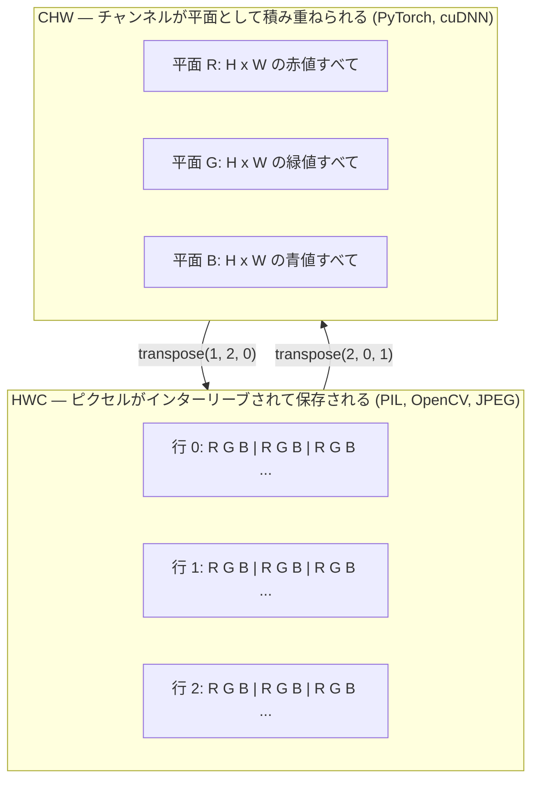

# 画像の基礎 — ピクセル・チャンネル・色空間

> 画像は光のサンプルを集めたテンソルである。あなたが使うすべてのビジョンモデルは、この一つの事実から始まる。


## 学習目標

- 連続的なシーンがどのようにピクセルへ離散化されるかを説明し、サンプリング/量子化の選択がすべての下流モデルの性能上限を決定することを理解する
- NumPy配列として画像を読み込み、スライスし、検査し、HWC形式とCHW形式を流暢に切り替える
- RGB、グレースケール、HSV、YCbCr間で変換し、各色空間が存在する理由を説明する
- torchvisionが期待する通りにピクセルレベルの前処理（正規化、標準化、リサイズ、チャンネルファースト）を適用する

## 問題の概要

読む論文も、ダウンロードする学習済みの重みも、呼び出すビジョンAPIも、すべて特定の入力エンコーディングを前提としている。モデルが`float32`を期待しているのに`uint8`の画像を渡すと、処理は動く——しかし無意味な結果を黙って返す。RGBで学習されたネットワークにBGRを渡すと精度が10ポイント落ちる。チャンネルファーストを期待するモデルにチャンネルラストの入力を渡すと、最初の畳み込み層が高さをチャンネルと解釈する。これらはどれもエラーを投げない。ただメトリクスが壊れ、ファイルの読み込み方法に潜むバグを1週間探し続けることになる。

畳み込みは、何をスライドしているかを理解すれば難しくない。難しいのは、「画像」がカメラ、JPEGデコーダ、PIL、OpenCV、torchvision、CUDAカーネルでそれぞれ異なるものを意味するという点だ。各スタックには固有の軸の順序、バイト範囲、チャンネルの慣例がある。これらを整理できないビジョンエンジニアは壊れたパイプラインを量産する。

このレッスンでは基礎を固めることで、フェーズの残りをその上に積み上げられるようにする。最終的には、ピクセルとは何か、なぜ1ピクセルに3つの数値があるのか、「ImageNetの統計で正規化する」とは実際に何をしているのか、そしてこのフェーズの他のすべてのレッスンが前提とする2つか3つのレイアウト間を行き来する方法がわかるようになる。

## 概念の解説

### 前処理パイプライン全体の概観

すべての本番ビジョンシステムは同じ可逆変換のシーケンスで構成される。一つのステップでも間違えると、モデルは学習時とは異なる入力を受け取ることになる。

```mermaid
flowchart LR
    A["画像ファイル<br/>(JPEG/PNG)"] --> B["デコード<br/>uint8 HWC"]
    B --> C["色空間変換<br/>(RGB/BGR/YCbCr)"]
    C --> D["リサイズ<br/>短辺を基準に"]
    D --> E["センタークロップ<br/>モデルサイズに"]
    E --> F["255で割る<br/>float32 [0,1]"]
    F --> G["平均を引く<br/>標準偏差で割る"]
    G --> H["転置<br/>HWC → CHW"]
    H --> I["バッチ化<br/>CHW → NCHW"]
    I --> J["モデル"]

    style A fill:#fef3c7,stroke:#d97706
    style J fill:#ddd6fe,stroke:#7c3aed
    style G fill:#fecaca,stroke:#dc2626
    style H fill:#bfdbfe,stroke:#2563eb
```



赤と青でハイライトされた2つのボックスが、サイレントな失敗の80%が潜む場所だ：標準化の欠如とレイアウトの誤り。

### ピクセルはサンプルであり、正方形ではない

カメラのセンサーは、微小な検出器のグリッドに当たる光子を数える。各検出器はわずかな時間光を積分し、当たった光子の数に比例した電圧を出力する。センサーはその電圧を整数へ離散化する。1つの検出器が1つのピクセルになる。

```
連続的なシーン              センサーグリッド                デジタル画像
(無限の詳細)               (H x W 個の検出器)             (H x W 個の整数)

    ~~~~~                  +--+--+--+--+--+               210 198 180 155 120
   ~   ~   ~                |  |  |  |  |  |              205 195 178 152 118
  ~ 光  ~      ---->        +--+--+--+--+--+    ---->     200 190 175 150 115
   ~~~~~                    |  |  |  |  |  |              195 185 170 148 112
                            +--+--+--+--+--+              188 180 165 145 108
```

この段階で2つの選択が行われ、それ以降のすべての上限が決まる：

- **空間サンプリング**はシーンの1度あたりの検出器数を決定する。少なすぎるとエッジがギザギザになる（エイリアシング）。多すぎると保存とコンピューティングが爆発する。
- **強度の量子化**は電圧をどれだけ細かくバケット化するかを決定する。8ビットは256レベルを与え、表示には標準的である。10、12、16ビットはより滑らかなグラジェントを提供し、医療画像、HDR、生センサーパイプラインで重要になる。

ピクセルは面積を持つ色付きの正方形ではない。それはグリッドの1箇所における単一の測定値だ。リサイズや回転を行うとき、あなたはその測定グリッドを再サンプリングしている。

### なぜ3つのチャンネルがあるのか

1つの検出器は可視スペクトル全体の光子を数える——それがグレースケールだ。色を得るために、センサーは赤、緑、青のフィルターのモザイクでグリッドを覆う。デモザイキング後、各空間位置には3つの整数がある：赤フィルタリングされた検出器の応答、緑フィルタリングされた応答、青フィルタリングされた応答。これら3つの整数がピクセルのRGBトリプレットだ。

```
メモリ上の1ピクセル：

    (R, G, B) = (210, 140, 30)   <- 赤みがかったオレンジ

H x W のRGB画像：

    形状 (H, W, 3)     保存形式   W個のピクセルがH行、各ピクセルが3つの値を持つ
                                  各値はuint8で [0, 255] の範囲
```

3は魔法の数字ではない。デプスカメラはZチャンネルを追加する。衛星は赤外線や紫外線バンドを追加する。医療スキャンはしばしば1チャンネル（X線、CT）または多チャンネル（ハイパースペクトル）を持つ。チャンネル数は最後の軸であり、畳み込み層はその軸方向にミックスすることを学習する。

### 2つのレイアウト規則：HWCとCHW

同じテンソル、2つの順序。各ライブラリはどちらかを選択する。

```
HWC (height, width, channels)           CHW (channels, height, width)

   W ->                                    H ->
  +-----+-----+-----+                     +-----+-----+
H |R G B|R G B|R G B|                   C |R R R R R R|
| +-----+-----+-----+                   | +-----+-----+
v |R G B|R G B|R G B|                   v |G G G G G G|
  +-----+-----+-----+                     +-----+-----+
                                          |B B B B B B|
                                          +-----+-----+

   PIL、OpenCV、matplotlib、              PyTorch、ほとんどの深層学習
   ディスク上のほぼすべての画像ファイル    フレームワーク、cuDNNカーネル
```

CHWが存在するのは、畳み込みカーネルがHとWをスライドするからだ。チャンネル軸を最初に置くことで、各カーネルがチャンネルごとに連続した2D平面を見ることができ、ベクトル化がきれいに行える。ディスク形式がHWCを使うのは、センサーからスキャンラインが出てくる順序に合わせているからだ。

千回は書くことになる1行の変換：

```
img_chw = img_hwc.transpose(2, 0, 1)      # NumPy
img_chw = img_hwc.permute(2, 0, 1)        # PyTorchテンソル
```

メモリレイアウトの可視化：



### バイト範囲とdtype

3つの慣例が支配的だ：

| 慣例 | dtype | 範囲 | 使用箇所 |
|------|-------|------|----------|
| 生データ | `uint8` | [0, 255] | ディスク上のファイル、PIL、OpenCVの出力 |
| 正規化済み | `float32` | [0.0, 1.0] | `img.astype('float32') / 255` 後 |
| 標準化済み | `float32` | おおよそ [-2, +2] | 平均を引いて標準偏差で割った後 |

畳み込みネットワークは標準化された入力で学習されている。ImageNetの統計 `mean=[0.485, 0.456, 0.406]`、`std=[0.229, 0.224, 0.225]` は、[0, 1]に正規化されたピクセル上でのImageNet学習セット全体の3チャンネルそれぞれの算術平均と標準偏差だ。標準化されたfloatを期待するモデルに生の`uint8`を渡すことは、応用ビジョンにおける最も一般的なサイレントな失敗の一つだ。

### 色空間とその存在理由

RGBはキャプチャフォーマットだが、モデルにとって常に最も有用な表現とは限らない。

```
 RGB               HSV                       YCbCr / YUV

 R 赤              H 色相（角度 0-360）       Y 輝度（明るさ）
 G 緑              S 彩度 (0-1)              Cb 色差（青-黄）
 B 青              V 明度/輝度 (0-1)         Cr 色差（赤-緑）

 センサー出力に     色と明るさを分離。         明るさと色を分離。
 対して線形        色によるしきい値処理、      JPEGとほとんどのビデオ
                  UIスライダー、             コーデックはYに比べて色差
                  シンプルなフィルタに        チャンネルをより強く圧縮する
                  有用                      （人間の目はYの詳細に
                                            より敏感なため）
```

最新のCNNにはRGBを渡す。他の色空間に出会うのは次のような場面だ：

- **HSV** — 古典的なCVコード、色ベースのセグメンテーション、ホワイトバランシング。
- **YCbCr** — JPEGの内部読み取り、ビデオパイプライン、Yのみで動作する超解像モデル。
- **グレースケール** — OCR、ドキュメントモデル、色がシグナルではなくノイズ変数になる場合。

RGBからグレースケールへの変換は、人間の目は青や赤よりも緑に敏感なため、平均ではなく加重和で行う：

```
Y = 0.299 R + 0.587 G + 0.114 B       (ITU-R BT.601、古典的な重み)
```

### アスペクト比、リサイズ、補間

すべてのモデルには固定の入力サイズがある（ほとんどのImageNet分類器には224x224、最新の検出器には384x384や512x512）。あなたの画像がそれに合うことはまれだ。重要な3つのリサイズ選択肢：

- **短辺をリサイズしてセンタークロップ** — 標準的なImageNetのレシピ。アスペクト比を保持し、端のピクセルの帯を除去する。
- **リサイズしてパディング** — アスペクト比とすべてのピクセルを保持し、黒いバーを追加する。検出とOCRの標準。
- **目標サイズに直接リサイズ** — 画像を伸縮させる。安価で幾何学的歪みが生じるが、多くの分類タスクには問題ない。

補間方法は、新しいグリッドが古いグリッドと一致しない場合に中間ピクセルがどのように計算されるかを決定する：

```
最近傍           最速、ブロック状、マスク/ラベルには唯一の選択肢
バイリニア        高速、滑らか、ほとんどの画像リサイズのデフォルト
バイキュービック   より遅く、アップスケール時にシャープ
Lanczos          最も遅く、最高品質、最終的な表示に使用
```

目安：学習にはバイリニア、見た目が重要なアセットにはバイキュービックまたはLanczos、整数クラスIDを含むものには最近傍。

## 実装する

### ステップ1：画像の読み込みと形状の確認

Pillowを使って任意のJPEGまたはPNGを読み込み、NumPyに変換して結果を表示する。オフラインで動作する決定論的な例として、合成画像を生成する。

```python
import numpy as np
from PIL import Image

def synthetic_rgb(h=128, w=192, seed=0):
    rng = np.random.default_rng(seed)
    yy, xx = np.meshgrid(np.linspace(0, 1, h), np.linspace(0, 1, w), indexing="ij")
    r = (np.sin(xx * 6) * 0.5 + 0.5) * 255
    g = yy * 255
    b = (1 - yy) * xx * 255
    rgb = np.stack([r, g, b], axis=-1) + rng.normal(0, 6, (h, w, 3))
    return np.clip(rgb, 0, 255).astype(np.uint8)

arr = synthetic_rgb()
# またはディスクから読み込む：
# arr = np.asarray(Image.open("your_image.jpg").convert("RGB"))

print(f"type:   {type(arr).__name__}")
print(f"dtype:  {arr.dtype}")
print(f"shape:  {arr.shape}     # (H, W, C)")
print(f"min:    {arr.min()}")
print(f"max:    {arr.max()}")
print(f"pixel at (0, 0): {arr[0, 0]}")
```

期待される出力：`shape: (H, W, 3)`、`dtype: uint8`、範囲 `[0, 255]`。これは、バイトがカメラ、JPEGデコーダ、または合成ジェネレーターのどこから来たとしても、ディスク上の標準的な表現だ。

### ステップ2：チャンネルの分割とレイアウトの変換

R、G、Bを個別に取り出し、PyTorch用にHWCからCHWへ変換する。

```python
R = arr[:, :, 0]
G = arr[:, :, 1]
B = arr[:, :, 2]
print(f"R shape: {R.shape}, mean: {R.mean():.1f}")
print(f"G shape: {G.shape}, mean: {G.mean():.1f}")
print(f"B shape: {B.shape}, mean: {B.mean():.1f}")

arr_chw = arr.transpose(2, 0, 1)
print(f"\nHWC shape: {arr.shape}")
print(f"CHW shape: {arr_chw.shape}")
```

チャンネルごとに3つのグレースケール平面。CHWは単に軸を並べ替えるだけで、メモリレイアウトが許す場合はデータのコピーは厳密には不要だ。

### ステップ3：グレースケールとHSVの変換

加重和によるグレースケール変換、その後RGBからHSVへの手動変換。

```python
def rgb_to_grayscale(rgb):
    weights = np.array([0.299, 0.587, 0.114], dtype=np.float32)
    return (rgb.astype(np.float32) @ weights).astype(np.uint8)

def rgb_to_hsv(rgb):
    rgb_f = rgb.astype(np.float32) / 255.0
    r, g, b = rgb_f[..., 0], rgb_f[..., 1], rgb_f[..., 2]
    cmax = np.max(rgb_f, axis=-1)
    cmin = np.min(rgb_f, axis=-1)
    delta = cmax - cmin

    h = np.zeros_like(cmax)
    mask = delta > 0
    rmax = mask & (cmax == r)
    gmax = mask & (cmax == g)
    bmax = mask & (cmax == b)
    h[rmax] = ((g[rmax] - b[rmax]) / delta[rmax]) % 6
    h[gmax] = ((b[gmax] - r[gmax]) / delta[gmax]) + 2
    h[bmax] = ((r[bmax] - g[bmax]) / delta[bmax]) + 4
    h = h * 60.0

    s = np.where(cmax > 0, delta / cmax, 0)
    v = cmax
    return np.stack([h, s, v], axis=-1)

gray = rgb_to_grayscale(arr)
hsv = rgb_to_hsv(arr)
print(f"gray shape: {gray.shape}, range: [{gray.min()}, {gray.max()}]")
print(f"hsv   shape: {hsv.shape}")
print(f"hue range: [{hsv[..., 0].min():.1f}, {hsv[..., 0].max():.1f}] degrees")
print(f"sat range: [{hsv[..., 1].min():.2f}, {hsv[..., 1].max():.2f}]")
print(f"val range: [{hsv[..., 2].min():.2f}, {hsv[..., 2].max():.2f}]")
```

色相は度数、彩度と明度は[0, 1]で出力される。これはOpenCVの`hsv_full`の規則に一致する。

### ステップ4：正規化、標準化、そしてその逆変換

生のバイトから学習済みImageNetモデルが期待する正確なテンソルへ、そして元に戻す。

```python
mean = np.array([0.485, 0.456, 0.406], dtype=np.float32)
std = np.array([0.229, 0.224, 0.225], dtype=np.float32)

def preprocess_imagenet(rgb_uint8):
    x = rgb_uint8.astype(np.float32) / 255.0
    x = (x - mean) / std
    x = x.transpose(2, 0, 1)
    return x

def deprocess_imagenet(chw_float32):
    x = chw_float32.transpose(1, 2, 0)
    x = x * std + mean
    x = np.clip(x * 255.0, 0, 255).astype(np.uint8)
    return x

x = preprocess_imagenet(arr)
print(f"preprocessed shape: {x.shape}     # (C, H, W)")
print(f"preprocessed dtype: {x.dtype}")
print(f"preprocessed mean per channel:  {x.mean(axis=(1, 2)).round(3)}")
print(f"preprocessed std  per channel:  {x.std(axis=(1, 2)).round(3)}")

roundtrip = deprocess_imagenet(x)
max_diff = np.abs(roundtrip.astype(int) - arr.astype(int)).max()
print(f"roundtrip max pixel diff: {max_diff}    # 0か1であるべき")
```

チャンネルごとの平均はゼロに近く、標準偏差は1に近くなるはずだ。前処理/逆処理のペアは、torchvisionの`transforms.Normalize`呼び出しが内部でやっていることとまったく同じだ。

### ステップ5：3つの補間方法でリサイズ

最近傍、バイリニア、バイキュービックをアップスケールで比較して違いを可視化する。

```python
target = (arr.shape[0] * 3, arr.shape[1] * 3)

nearest = np.asarray(Image.fromarray(arr).resize(target[::-1], Image.NEAREST))
bilinear = np.asarray(Image.fromarray(arr).resize(target[::-1], Image.BILINEAR))
bicubic = np.asarray(Image.fromarray(arr).resize(target[::-1], Image.BICUBIC))

def local_roughness(x):
    gy = np.diff(x.astype(float), axis=0)
    gx = np.diff(x.astype(float), axis=1)
    return float(np.abs(gy).mean() + np.abs(gx).mean())

for name, out in [("nearest", nearest), ("bilinear", bilinear), ("bicubic", bicubic)]:
    print(f"{name:>8}  shape={out.shape}  roughness={local_roughness(out):6.2f}")
```

最近傍は硬いエッジを保持するためラフネスが最も高くなる。バイリニアが最も滑らか。バイキュービックはその中間で、階段状のアーティファクトなしに知覚的なシャープネスを保持する。

## 使ってみる

`torchvision.transforms`は上記のすべてを単一の合成可能なパイプラインにまとめている。以下のコードは`preprocess_imagenet`が行うことを正確に再現し、さらにリサイズとクロップも追加している。

```python
import torch
from torchvision import transforms
from PIL import Image

img = Image.fromarray(synthetic_rgb(256, 256))

pipeline = transforms.Compose([
    transforms.Resize(256),
    transforms.CenterCrop(224),
    transforms.ToTensor(),
    transforms.Normalize(mean=[0.485, 0.456, 0.406], std=[0.229, 0.224, 0.225]),
])

x = pipeline(img)
print(f"tensor type:  {type(x).__name__}")
print(f"tensor dtype: {x.dtype}")
print(f"tensor shape: {tuple(x.shape)}      # (C, H, W)")
print(f"per-channel mean: {x.mean(dim=(1, 2)).tolist()}")
print(f"per-channel std:  {x.std(dim=(1, 2)).tolist()}")

batch = x.unsqueeze(0)
print(f"\nbatched shape: {tuple(batch.shape)}   # (N, C, H, W) — モデルへの準備完了")
```

4つのステップ、この順序で：`Resize(256)`は短辺を256にスケール；`CenterCrop(224)`は中央から224x224のパッチを取る；`ToTensor()`は255で割ってHWCをCHWに変換；`Normalize`はImageNetの平均を引いて標準偏差で割る。この順序を逆にすると、モデルに届く内容が静かに変わってしまう。

## 成果物を出す

このレッスンでは以下を生成する：

- `outputs/prompt-vision-preprocessing-audit.md` — 任意のモデルカードやデータセットカードを、チームが守るべき前処理の不変条件チェックリストに変換するプロンプト。
- `outputs/skill-image-tensor-inspector.md` — 画像形状のテンソルや配列を受け取り、dtype、レイアウト、範囲、生データ・正規化済み・標準化済みのどれに見えるかを報告するスキル。

## 演習

1. **(簡単)** OpenCV（`cv2.imread`）とPillowでそれぞれJPEGを読み込む。両方の形状と`(0, 0)`のピクセルを表示する。チャンネル順序の違いを説明し、OpenCVの配列をPillowのものと同一にする1行の変換を書く。
2. **(中級)** `standardize(img, mean, std)`とその逆関数を、HWCの単一画像とNCHWのバッチの両方に対して同じ呼び出しで動作し、任意のuint8画像で`roundtrip_max_diff <= 1`テストに合格するよう実装する。
3. **(難)** 3チャンネルのImageNet標準化テンソルを受け取り、RGBの加重混合を学習して単一のグレースケールチャンネルに変換する1x1畳み込みを実行する。重みを`[0.299, 0.587, 0.114]`に初期化してフリーズし、出力が手動の`rgb_to_grayscale`と浮動小数点誤差の範囲内で一致することを確認する。他にどんな古典的な色空間変換が1x1畳み込みとして書けるか？

## キーワード

| 用語 | よく言われること | 実際の意味 |
|------|----------------|-----------|
| ピクセル | 「色付きの正方形」 | あるグリッド位置での光強度の単一サンプル——色には3つの数値、グレースケールには1つ |
| チャンネル | 「色」 | 画像テンソルに積み重ねられた並列空間グリッドの1つ；HWCでは最後の軸、CHWでは最初の軸 |
| HWC / CHW | 「形状」 | 画像テンソルの軸の順序；ディスクとPILはHWC、PyTorchとcuDNNはCHW |
| 正規化 | 「画像をスケール」 | 255で割ってピクセルを[0, 1]に収める——必要だが十分ではない |
| 標準化 | 「ゼロセンタリング」 | チャンネルごとに平均を引いて標準偏差で割り、入力分布をモデルが学習した分布に合わせる |
| グレースケール変換 | 「チャンネルを平均」 | 人間の輝度知覚に一致する係数0.299/0.587/0.114による加重和 |
| 補間 | 「リサイズがピクセルを選ぶ方法」 | 新しいグリッドが古いグリッドと一致しない場合に出力値を決定するルール——ラベルには最近傍、学習にはバイリニア、表示にはバイキュービック |
| アスペクト比 | 「幅対高さ」 | 「リサイズしてパディング」と「リサイズして引き延ばし」を区別する比率 |

## 参考資料

- [Charles Poynton — A Guided Tour of Color Space](https://poynton.ca/PDFs/Guided_tour.pdf) — なぜ色空間がたくさん存在するのか、それぞれがいつ重要かについての最も明快な技術的解説
- [PyTorch Vision Transforms Docs](https://pytorch.org/vision/stable/transforms.html) — 本番で実際に合成するtransformsの完全なパイプライン
- [How JPEG Works (Colt McAnlis)](https://www.youtube.com/watch?v=F1kYBnY6mwg) — クロマサブサンプリング、DCT、JPEGがRGBではなくYCbCrでエンコードする理由についてのシャープな視覚的ツアー
- [ImageNet Preprocessing Conventions (torchvision models)](https://pytorch.org/vision/stable/models.html) — `mean=[0.485, 0.456, 0.406]`の真実のソースと、なぜzoo内のすべてのモデルがそれを期待するか
