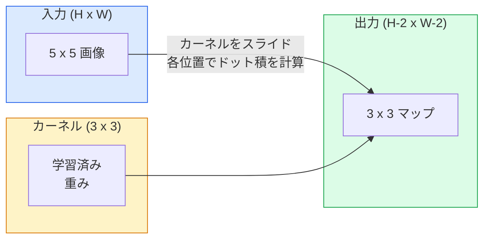
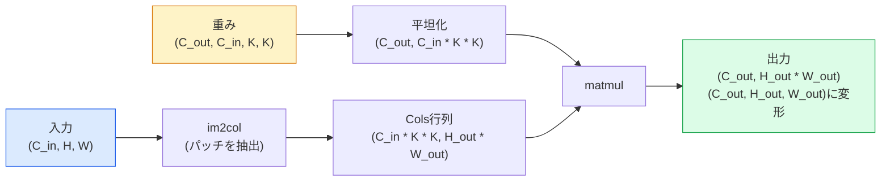

# ゼロから学ぶ畳み込み

> 畳み込みとは、画像全体をスライドしながら同じ重みを共有する小さな全結合層である。


## 学習目標

- NumPyのみを使って2D畳み込みをゼロから実装する（ネストされたループ版とベクトル化された`im2col`版を含む）
- 入力サイズ、カーネルサイズ、パディング、ストライドの任意の組み合わせに対して出力の空間サイズを計算し、`(H - K + 2P) / S + 1`の式を正当化する
- カーネルをハンドデザインし（エッジ、ブラー、シャープン、Sobel）、それぞれが生み出す活性化パターンを説明する
- 畳み込みをスタックして特徴抽出器を構築し、スタックの深さと受容野のサイズの関係を説明する

## 問題の概要

224x224のRGB画像に対する全結合層は、1ニューロンあたり224 * 224 * 3 = 150,528個の入力重みを必要とする。1,000ユニットの単一隠れ層だけで既に1億5000万パラメータになる——何も有用なことを学習する前に。さらに悪いことに、その層はトップ左の犬とボトム右の犬が同じパターンであるという認識がない。すべてのピクセル位置を独立に扱い、これは画像にとってまさに誤りだ：猫を3ピクセルずらしても、ネットワークにその概念を再学習させるべきではない。

画像モデルに必要な2つの特性は**並進等変性**（入力がシフトすると出力もシフトする）と**パラメータ共有**（同じ特徴検出器がどこでも動く）だ。全結合層はどちらも提供しない。畳み込みは両方を無料で提供する。

畳み込みは深層学習のために発明されたわけではない。それはJPEG圧縮、PhotoshopのGaussianブラー、産業用ビジョンのエッジ検出、そしてすべてのオーディオフィルターを動かすのと同じ演算だ。CNNが2012年から2020年にかけてImageNetを席巻した理由は、畳み込みが「隣り合う値が関連しており、同じパターンがどこにでも現れる可能性がある」データに対して正しい帰納バイアスだからだ。

## 概念の解説

### 1つのカーネルがスライドする

2D畳み込みは、カーネル（またはフィルター）と呼ばれる小さな重み行列を取り、入力をスライドして、各位置で要素ごとの積の和を計算する。その和が1つの出力ピクセルになる。



5x5入力上の具体的な3x3の例（パディングなし、ストライド1）：

```
入力 X (5 x 5):                カーネル W (3 x 3):

  1  2  0  1  2                   1  0 -1
  0  1  3  1  0                   2  0 -2
  2  1  0  2  1                   1  0 -1
  1  0  2  1  3
  2  1  1  0  1

カーネルはすべての有効な3 x 3ウィンドウをスライドする。出力 Y は 3 x 3:

 Y[0,0] = sum( W * X[0:3, 0:3] )
 Y[0,1] = sum( W * X[0:3, 1:4] )
 Y[0,2] = sum( W * X[0:3, 2:5] )
 Y[1,0] = sum( W * X[1:4, 0:3] )
 ... 以下同様
```

その1つの式——**重みの共有、局所性、スライドウィンドウ**——がアイデアの全てだ。残りはすべて帳簿付けだ。

### 出力サイズの式

入力空間サイズ`H`、カーネルサイズ`K`、パディング`P`、ストライド`S`が与えられた場合：

```
H_out = floor( (H - K + 2P) / S ) + 1
```

これを暗記すること。アーキテクチャごとに何十回も計算することになる。

| シナリオ | H | K | P | S | H_out |
|---------|---|---|---|---|-------|
| Validコンボ、パディングなし | 32 | 3 | 0 | 1 | 30 |
| Sameコンボ（サイズ保持） | 32 | 3 | 1 | 1 | 32 |
| 2倍ダウンサンプル | 32 | 3 | 1 | 2 | 16 |
| 2x2プール | 32 | 2 | 0 | 2 | 16 |
| 大きな受容野 | 32 | 7 | 3 | 2 | 16 |

「Sameパディング」とは、S == 1のとき H_out == H となるようにPを選ぶことを意味する。奇数Kの場合、P = (K - 1) / 2だ。3x3カーネルが主流なのはこのため——中心を持つ最小の奇数カーネルだからだ。

### パディング

パディングなしでは、すべての畳み込みで特徴マップが縮小する。20層重ねると224x224の画像が184x184になり、境界でコンピューティングが無駄になり、形状を一致させる必要のある残差接続が複雑になる。

```
ゼロパディング (P = 1) の 5 x 5 入力：

  0  0  0  0  0  0  0
  0  1  2  0  1  2  0
  0  0  1  3  1  0  0
  0  2  1  0  2  1  0       カーネルがピクセル(0, 0)を中心に置いても
  0  1  0  2  1  3  0       3行3列の値を掛け合わせることができる
  0  2  1  1  0  1  0
  0  0  0  0  0  0  0
```

実際に使うモード：`zero`（最も一般的）、`reflect`（エッジをミラーリング、生成モデルでの硬い境界を回避）、`replicate`（エッジをコピー）、`circular`（折り返し、トロイダル問題に使用）。

### ストライド

ストライドはスライドのステップサイズだ。`stride=1`がデフォルト。`stride=2`は空間次元を半分にし、別のプーリング層なしにCNN内でダウンサンプリングする古典的な方法だ——すべての最新アーキテクチャ（ResNet、ConvNeXt、MobileNet）は、どこかで最大プールの代わりにストライド付き畳み込みを使っている。

```
5 x 5 入力、3 x 3 カーネルでストライド1：

  開始位置：(0,0) (0,1) (0,2)        -> 出力行 0
           (1,0) (1,1) (1,2)        -> 出力行 1
           (2,0) (2,1) (2,2)        -> 出力行 2

  出力：3 x 3

同じ入力でストライド2：

  開始位置：(0,0) (0,2)              -> 出力行 0
           (2,0) (2,2)              -> 出力行 1

  出力：2 x 2
```

### 複数の入力チャンネル

実際の画像は3チャンネルを持つ。RGB入力に対する3x3畳み込みは、実際には3x3x3のボリュームだ：入力チャンネルごとに1つの3x3スライス。各空間位置で3つのスライス全体を掛けて足し合わせ、バイアスを加える。

```
入力：   (C_in,  H,  W)        3 x 5 x 5
カーネル：(C_in,  K,  K)        3 x 3 x 3 (1つのカーネル)
出力：   (1,     H', W')       2Dマップ

C_out個の出力チャンネルを生成する層では、C_out個のカーネルをスタックする：

重み：   (C_out, C_in, K, K)   例：64 x 3 x 3 x 3
出力：   (C_out, H', W')       64 x 3 x 3

パラメータ数：C_out * C_in * K * K + C_out   (+ C_outはバイアス)
```

最後の行がモデルを計画するときに計算するものだ。3チャンネル入力への64チャンネル3x3畳み込みは`64 * 3 * 3 * 3 + 64 = 1,792`パラメータを持つ。安価だ。

### im2colのトリック

ネストされたループは読みやすいが遅い。GPUは大きな行列乗算を必要とする。トリック：入力のすべての受容野ウィンドウを大きな行列の1列に平坦化し、カーネルを行に平坦化すると、畳み込み全体が単一の行列積になる。



すべての本番畳み込み実装はこのバリエーションにキャッシュタイリングトリック（ダイレクト畳み込み、Winograd、大きなカーネル用のFFT畳み込み）を加えたものだ。im2colを理解すれば核心がわかる。

### 受容野

単一の3x3畳み込みは9つの入力ピクセルを見る。3x3畳み込みを2層重ねると、2層目のニューロンは5x5の入力ピクセルを見る。3層の3x3畳み込みで7x7になる。一般に：

```
L層のK x K畳み込みをストライド1で重ねた後の受容野 = 1 + L * (K - 1)

ストライドを使う場合：受容野は各層でストライドに沿って乗法的に成長する。
```

「3x3を積み重ねる」方式（VGG、ResNet、ConvNeXt）が機能する全理由は、2層の3x3畳み込みが1層の5x5畳み込みと同じ入力領域を見るが、パラメータが少なく、間に余分な非線形性があることだ。

## 実装する

### ステップ1：配列のパディング

最小のプリミティブから始める：H x W 配列の周囲をゼロでパディングする関数。

```python
import numpy as np

def pad2d(x, p):
    if p == 0:
        return x
    h, w = x.shape[-2:]
    out = np.zeros(x.shape[:-2] + (h + 2 * p, w + 2 * p), dtype=x.dtype)
    out[..., p:p + h, p:p + w] = x
    return out

x = np.arange(9).reshape(3, 3)
print(x)
print()
print(pad2d(x, 1))
```

末尾軸のトリック`x.shape[:-2]`により、同じ関数が`(H, W)`、`(C, H, W)`、`(N, C, H, W)`に変更なしで動作する。

### ステップ2：ネストループによる2D畳み込み

リファレンス実装——遅いが明確。これが原理的に`torch.nn.functional.conv2d`が行うことだ。

```python
def conv2d_naive(x, w, b=None, stride=1, padding=0):
    c_in, h, w_in = x.shape
    c_out, c_in_w, kh, kw = w.shape
    assert c_in == c_in_w

    x_pad = pad2d(x, padding)
    h_out = (h + 2 * padding - kh) // stride + 1
    w_out = (w_in + 2 * padding - kw) // stride + 1

    out = np.zeros((c_out, h_out, w_out), dtype=np.float32)
    for oc in range(c_out):
        for i in range(h_out):
            for j in range(w_out):
                hs = i * stride
                ws = j * stride
                patch = x_pad[:, hs:hs + kh, ws:ws + kw]
                out[oc, i, j] = np.sum(patch * w[oc])
        if b is not None:
            out[oc] += b[oc]
    return out
```

4つのネストループ（出力チャンネル、行、列、加えてC_in/kh/kwにわたる暗黙の和）。これが、より高速な実装を検証するときのグランドトゥルースになる。

### ステップ3：ハンドデザインカーネルでの検証

垂直Sobelカーネルを構築し、合成ステップ画像に適用して、垂直エッジが光ることを確認する。

```python
def synthetic_step_image():
    img = np.zeros((1, 16, 16), dtype=np.float32)
    img[:, :, 8:] = 1.0
    return img

sobel_x = np.array([
    [[-1, 0, 1],
     [-2, 0, 2],
     [-1, 0, 1]]
], dtype=np.float32)[None]

x = synthetic_step_image()
y = conv2d_naive(x, sobel_x, padding=1)
print(y[0].round(1))
```

列7に大きな正の値（左から右への輝度増加）が、それ以外は0が出力されることを期待する。そのprint1行が、数学が正しいかのサニティチェックだ。

### ステップ4：im2col

入力内のすべてのカーネルサイズのウィンドウを行列の列に変換する。`C_in=3, K=3`の場合、各列は27個の数値になる。

```python
def im2col(x, kh, kw, stride=1, padding=0):
    c_in, h, w = x.shape
    x_pad = pad2d(x, padding)
    h_out = (h + 2 * padding - kh) // stride + 1
    w_out = (w + 2 * padding - kw) // stride + 1

    cols = np.zeros((c_in * kh * kw, h_out * w_out), dtype=x.dtype)
    col = 0
    for i in range(h_out):
        for j in range(w_out):
            hs = i * stride
            ws = j * stride
            patch = x_pad[:, hs:hs + kh, ws:ws + kw]
            cols[:, col] = patch.reshape(-1)
            col += 1
    return cols, h_out, w_out
```

まだPythonループだが、これで重い処理が単一のベクトル化された行列積になる。

### ステップ5：im2col + matmulによる高速畳み込み

4重ループを1つの行列乗算で置き換える。

```python
def conv2d_im2col(x, w, b=None, stride=1, padding=0):
    c_out, c_in, kh, kw = w.shape
    cols, h_out, w_out = im2col(x, kh, kw, stride, padding)
    w_flat = w.reshape(c_out, -1)
    out = w_flat @ cols
    if b is not None:
        out += b[:, None]
    return out.reshape(c_out, h_out, w_out)
```

正確性チェック：両方の実装を実行して比較する。

```python
rng = np.random.default_rng(0)
x = rng.normal(0, 1, (3, 16, 16)).astype(np.float32)
w = rng.normal(0, 1, (8, 3, 3, 3)).astype(np.float32)
b = rng.normal(0, 1, (8,)).astype(np.float32)

y_naive = conv2d_naive(x, w, b, padding=1)
y_im2col = conv2d_im2col(x, w, b, padding=1)

print(f"max abs diff: {np.max(np.abs(y_naive - y_im2col)):.2e}")
```

`max abs diff`は約`1e-5`になるはず——この差は浮動小数点の積算順序の違いであり、バグではない。

### ステップ6：ハンドデザインカーネルのバンク

学習前に単一の畳み込み層が何を表現できるかを示す5つのフィルター。

```python
KERNELS = {
    "identity": np.array([[0, 0, 0], [0, 1, 0], [0, 0, 0]], dtype=np.float32),
    "blur_3x3": np.ones((3, 3), dtype=np.float32) / 9.0,
    "sharpen": np.array([[0, -1, 0], [-1, 5, -1], [0, -1, 0]], dtype=np.float32),
    "sobel_x": np.array([[-1, 0, 1], [-2, 0, 2], [-1, 0, 1]], dtype=np.float32),
    "sobel_y": np.array([[-1, -2, -1], [0, 0, 0], [1, 2, 1]], dtype=np.float32),
}

def apply_kernel(img2d, kernel):
    x = img2d[None].astype(np.float32)
    w = kernel[None, None]
    return conv2d_im2col(x, w, padding=1)[0]
```

任意のグレースケール画像に適用すると、blurは柔らかく、sharpenはエッジを際立たせ、Sobel-xは垂直エッジを光らせ、Sobel-yは水平エッジを光らせる。これらはAlexNetとVGGの*最初*の学習済み畳み込み層が最終的に学習したパターンとまったく同じだ——なぜなら良い画像モデルは後でどんなタスクが来ても、エッジとブロブの検出器を必要とするからだ。

## 使ってみる

PyTorchの`nn.Conv2d`は同じ演算をオートグラッド、CUDAカーネル、cuDNN最適化でラップしている。形状のセマンティクスは同一だ。

```python
import torch
import torch.nn as nn

conv = nn.Conv2d(in_channels=3, out_channels=64, kernel_size=3, stride=1, padding=1)
print(conv)
print(f"weight shape: {tuple(conv.weight.shape)}   # (C_out, C_in, K, K)")
print(f"bias shape:   {tuple(conv.bias.shape)}")
print(f"param count:  {sum(p.numel() for p in conv.parameters())}")

x = torch.randn(8, 3, 224, 224)
y = conv(x)
print(f"\ninput  shape: {tuple(x.shape)}")
print(f"output shape: {tuple(y.shape)}")
```

`padding=1`を`padding=0`に変えると出力は222x222になる。`stride=1`を`stride=2`に変えると112x112になる。上で暗記した式と同じだ。

## 成果物を出す

このレッスンでは以下を生成する：

- `outputs/prompt-cnn-architect.md` — 入力サイズ、パラメータバジェット、目標受容野を与えると、各ステップで正しいK/S/Pを持つ`Conv2d`層のスタックを設計するプロンプト。
- `outputs/skill-conv-shape-calculator.md` — ネットワーク仕様を層ごとに処理し、すべてのブロックの出力形状、受容野、パラメータ数を返すスキル。

## 演習

1. **(簡単)** 128x128グレースケール入力と`[Conv3x3(s=1,p=1), Conv3x3(s=2,p=1), Conv3x3(s=1,p=1), Conv3x3(s=2,p=1)]`のスタックで、各層の出力空間サイズと受容野を手で計算する。ダミー畳み込みのPyTorch `nn.Sequential`で検証する。
2. **(中級)** `conv2d_naive`と`conv2d_im2col`を`groups`引数を受け付けるように拡張する。`groups=C_in=C_out`が深度方向畳み込みを再現すること、そのパラメータ数が`C * C * K * K`ではなく`C * K * K`になることを示す。
3. **(難)** `conv2d_im2col`のバックワードパスを手で実装する：出力の勾配が与えられたとき、`x`と`w`の勾配を計算する。同じ入力と重みで`torch.autograd.grad`と照合して検証する。トリック：im2colの勾配は`col2im`であり、重複するウィンドウを積算しなければならない。

## キーワード

| 用語 | よく言われること | 実際の意味 |
|------|----------------|-----------|
| 畳み込み | 「フィルターをスライドさせる」 | 共有重みですべての空間位置に適用される学習可能なドット積；数学的には相互相関だが、全員が畳み込みと呼ぶ |
| カーネル / フィルター | 「特徴検出器」 | 形状(C_in, K, K)の小さな重みテンソル；入力のウィンドウとのドット積が1つの出力ピクセルを生成する |
| ストライド | 「どれだけ跳ぶか」 | 連続するカーネル配置間のステップサイズ；ストライド2は各空間次元を半分にする |
| パディング | 「エッジへのゼロ」 | カーネルが境界ピクセルを中心に置けるよう入力の周囲に追加される余分な値；`same`パディングは出力サイズを入力サイズと等しく保つ |
| 受容野 | 「ニューロンが見る範囲」 | 特定の出力活性化が依存する元の入力パッチ；深さとストライドとともに成長する |
| im2col | 「GEMMのトリック」 | すべての受容野ウィンドウを列に再配置し、畳み込みを1つの大きな行列積にする——すべての高速畳み込みカーネルの核心 |
| 深度方向畳み込み | 「チャンネルごとに1カーネル」 | `groups == C_in`の畳み込み、各出力チャンネルを対応する入力チャンネルのみから計算；MobileNetとConvNeXtの骨格 |
| 並進等変性 | 「入力がシフトすれば出力もシフト」 | 入力をkピクセルシフトすると出力もkピクセルシフトする特性；共有重みで自然に得られる |

## 参考資料

- [A guide to convolution arithmetic for deep learning (Dumoulin & Visin, 2016)](https://arxiv.org/abs/1603.07285) — すべてのコースが静かに引用するパディング/ストライド/ダイレーションの決定版図解
- [CS231n: Convolutional Neural Networks for Visual Recognition](https://cs231n.github.io/convolutional-networks/) — 元のim2col説明を含む標準的な講義ノート
- [The Annotated ConvNet (fast.ai)](https://nbviewer.org/github/fastai/fastbook/blob/master/13_convolutions.ipynb) — 手動畳み込みから学習済みの数字分類器まで歩むノートブック
- [Receptive Field Arithmetic for CNNs (Dang Ha The Hien)](https://distill.pub/2019/computing-receptive-fields/) — 受容野計算の論文品質のインタラクティブ解説
