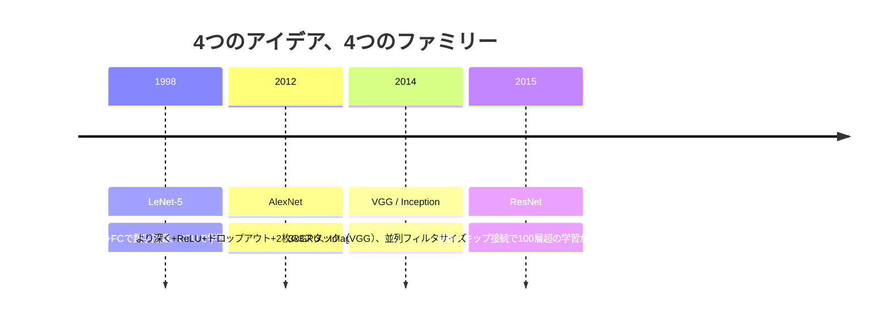
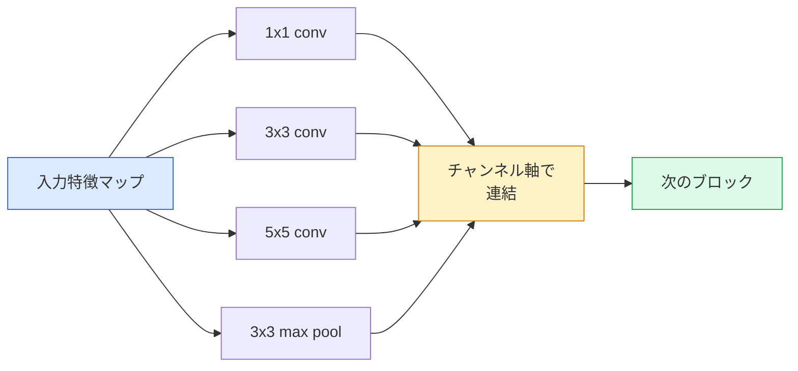
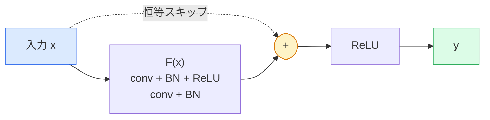

# CNNの系譜 — LeNetからResNetへ

> 過去30年の主要なCNNはすべて、畳み込み・非線形性・ダウンサンプリングという同じレシピに新しいアイデアを1つ追加したものだ。アイデアを順番に学べ。


## 学習目標

- LeNet-5 → AlexNet → VGG → Inception → ResNetというアーキテクチャの系譜をたどり、各ファミリーが貢献した1つの新しいアイデアを述べる
- PyTorchでLeNet-5、VGGスタイルのブロック、ResNet BasicBlockをそれぞれ40行以内で実装する
- 残差接続が1,000層のネットワークを「学習不可能」から「最先端」へと変える理由を説明する
- 最新のバックボーン（ResNet-18、ResNet-50）を読み、ソースを見る前にその出力形状、受容野、パラメータ数を予測する

## 問題の概要

2011年、最高のImageNet分類器はtop-5精度約74%だった。2012年、AlexNetは85%を出した。2015年、ResNetは96%に達した。新しいデータもない。新しいGPU世代もない。向上はアーキテクチャのアイデアから来た。現場のビジョンエンジニアはどのアイデアがどの論文から来たかを知っておく必要がある。なぜなら2026年に出荷するすべての本番バックボーンは、同じピースの組み合わせだからだ——そしてアイデアは転用され続ける：グループ畳み込みはCNNからトランスフォーマーへ渡り、残差接続はResNetから現存するすべてのLLMへと渡り、バッチ正規化は拡散モデルに生きている。

これらのネットワークを順番に学ぶことで、よくある間違いに対する免疫もつく：LeNetサイズのネットワークで問題が解けるのに、利用可能な最大のモデルに手を伸ばすという間違いだ。MNISTにResNetは必要ない。各ファミリーのスケーリングカーブを知ることで、どこに座るべきかがわかる。

## 概念の解説

### ビジョンを変えた4つのアイデア



古典的なビジョンでこれら4つの飛躍ほど重要なものは他にない。

### LeNet-5（1998年）

Yann LeCunの数字認識器。6万パラメータ。2つの畳み込み-プールブロック、2つの全結合層、tanh活性化関数。すべてのCNNが受け継ぐテンプレートを定義した：

```
入力 (1, 32, 32)
  conv 5x5 -> (6, 28, 28)
  avg pool 2x2 -> (6, 14, 14)
  conv 5x5 -> (16, 10, 10)
  avg pool 2x2 -> (16, 5, 5)
  flatten -> 400
  dense -> 120
  dense -> 84
  dense -> 10
```

現代が「CNN」と呼ぶすべて——交互に並ぶ畳み込みとダウンサンプリングが小さな分類ヘッドに送り込む——は、より多くの層、より大きなチャンネル、より良い活性化を持つLeNetだ。

### AlexNet（2012年）

ImageNetを破った3つの変更：

1. **ReLU**（tanhの代わりに）。勾配が消えなくなる。学習速度が6倍向上する。
2. **ドロップアウット**（全結合ヘッドに）。正則化が層になり、トリックではなくなる。
3. **深さと幅**。5つの畳み込み層、3つの全結合層、6000万パラメータ、2枚のGPUに分割して学習。

論文の図2は今もGPU分割を2つの並列ストリームとして示している。この並列性はハードウェアの回避策であり、アーキテクチャの洞察ではない——しかし上記の3つのアイデアは今でも使っているすべてのモデルに生きている。

### VGG（2014年）

VGGは問いかけた：3x3畳み込みだけを使って深くしたらどうなるか？

```
スタック：conv 3x3 -> conv 3x3 -> pool 2x2
繰り返し：16または19の畳み込み層
```

2層の3x3畳み込みは、1層の5x5畳み込みと同じ5x5入力領域を見るが、パラメータが少なく（2*9*C^2 = 18C^2 対 25*C^2）、間に余分なReLUがある。VGGはこの観察を1つのアーキテクチャ全体に変えた。シンプルさ——1種類のブロック型を繰り返す——により、それ以降のすべての基準点になった。

コスト：1億3800万パラメータ、学習が遅く、推論が高コスト。

### Inception（同じく2014年）

「どのカーネルサイズを使うべきか？」へのGoogleの答えは：すべてを並列に使う、だった。



各ブランチが特化する——1x1はチャンネルミキシング、3x3はローカルテクスチャ、5x5はより大きなパターン、プーリングはシフト不変特徴——そして連結により次の層が有用なブランチを選べる。Inception v1は各ブランチ内に1x1畳み込みをボトルネックとして使い、パラメータ数を抑えた。

### 劣化問題

2015年までに、VGG-19は機能したがVGG-32は機能しなかった。深さは役立つはずだったが、約20層を超えると学習損失もテスト損失も悪化した。これは過学習ではない。最適化器が、すべての層を通じて勾配が乗法的に縮小するため有用な重みを見つけられなくなっている状態だ。

```
プレーンな深いネットワーク：
  y = f_L( f_{L-1}( ... f_1(x) ... ) )

初期層に関する勾配：
  dL/dW_1 = dL/dy * df_L/df_{L-1} * ... * df_2/df_1 * df_1/dW_1

各乗算項は大まかに (重みの大きさ) * (活性化ゲイン) の大きさを持つ。
ゲインが < 1 のものを100個重ねると、勾配は事実上ゼロになる。
```

VGGが19層で機能したのは、（同時に発表された）バッチ正規化が活性化をスケールし続けたからだ。しかしバッチ正規化でも30層程度を超えると深さを救えなかった。

### ResNet（2015年）

He、Zhang、Ren、Sunは、すべてを解決する1つの変更を提案した：

```
標準ブロック：  y = F(x)
残差ブロック：  y = F(x) + x
```

`+ x`は、層が`F(x)`をゼロに追い込むことで常に何もしないことを選べることを意味する。1,000層のResNetは今や1層のネットワークよりも悪くなることがない。なぜなら各余分なブロックには自明な逃げ道があるからだ。その保証により、最適化器は各ブロックを*わずかに*有用にしようとする——わずかに有用なものが100回重ねられると、最先端になる。



ブロックの2つのバリアントがどこにでも現れる：

- **BasicBlock**（ResNet-18、ResNet-34）：2層の3x3畳み込み、両方をスキップ。
- **Bottleneck**（ResNet-50、-101、-152）：1x1で縮小、3x3の中間、1x1で拡大、3つをスキップ。チャンネル数が多い場合に安価。

スキップがダウンサンプル（stride=2）を跨ぐ場合、恒等パスは形状を合わせるために1x1 stride=2の畳み込みで置き換えられる。

### ビジョン以外での残差の重要性

このアイデアは実は画像分類についてではなかった。深いネットワークを「うまくいくことを祈りながら勾配が生き残るのを待つ」から「信頼できるスケーラブルなエンジニアリングツール」へと変えることについてだった。次のフェーズで読むすべてのトランスフォーマーは、すべてのブロックにまったく同じスキップ接続を持っている。ResNetなくしてGPTはない。

## 実装する

### ステップ1：LeNet-5

最小限の忠実なLeNet。tanh活性化、平均プーリング。現代への唯一の妥協は、元のGaussian接続の代わりに`nn.CrossEntropyLoss`を使うことだ。

```python
import torch
import torch.nn as nn
import torch.nn.functional as F

class LeNet5(nn.Module):
    def __init__(self, num_classes=10):
        super().__init__()
        self.conv1 = nn.Conv2d(1, 6, kernel_size=5)
        self.conv2 = nn.Conv2d(6, 16, kernel_size=5)
        self.pool = nn.AvgPool2d(2)
        self.fc1 = nn.Linear(16 * 5 * 5, 120)
        self.fc2 = nn.Linear(120, 84)
        self.fc3 = nn.Linear(84, num_classes)

    def forward(self, x):
        x = self.pool(torch.tanh(self.conv1(x)))
        x = self.pool(torch.tanh(self.conv2(x)))
        x = torch.flatten(x, 1)
        x = torch.tanh(self.fc1(x))
        x = torch.tanh(self.fc2(x))
        return self.fc3(x)

net = LeNet5()
x = torch.randn(1, 1, 32, 32)
print(f"output: {net(x).shape}")
print(f"params: {sum(p.numel() for p in net.parameters()):,}")
```

期待される出力：`output: torch.Size([1, 10])`、`params: 61,706`。これが現代ビジョンを始めた数字分類器の全体だ。

### ステップ2：VGGブロック

再利用可能な1つのブロック：2つの3x3畳み込み、ReLU、バッチ正規化、最大プーリング。

```python
class VGGBlock(nn.Module):
    def __init__(self, in_c, out_c):
        super().__init__()
        self.conv1 = nn.Conv2d(in_c, out_c, kernel_size=3, padding=1)
        self.bn1 = nn.BatchNorm2d(out_c)
        self.conv2 = nn.Conv2d(out_c, out_c, kernel_size=3, padding=1)
        self.bn2 = nn.BatchNorm2d(out_c)
        self.pool = nn.MaxPool2d(2)

    def forward(self, x):
        x = F.relu(self.bn1(self.conv1(x)))
        x = F.relu(self.bn2(self.conv2(x)))
        return self.pool(x)

class MiniVGG(nn.Module):
    def __init__(self, num_classes=10):
        super().__init__()
        self.stack = nn.Sequential(
            VGGBlock(3, 32),
            VGGBlock(32, 64),
            VGGBlock(64, 128),
        )
        self.head = nn.Sequential(
            nn.AdaptiveAvgPool2d(1),
            nn.Flatten(),
            nn.Linear(128, num_classes),
        )

    def forward(self, x):
        return self.head(self.stack(x))

net = MiniVGG()
x = torch.randn(1, 3, 32, 32)
print(f"output: {net(x).shape}")
print(f"params: {sum(p.numel() for p in net.parameters()):,}")
```

CIFARサイズの入力に3つのVGGブロック、アダプティブプール、1つの線形層。約29万パラメータ。CIFAR-10には十分だ。

### ステップ3：ResNet BasicBlock

ResNet-18とResNet-34のコアビルディングブロック。

```python
class BasicBlock(nn.Module):
    def __init__(self, in_c, out_c, stride=1):
        super().__init__()
        self.conv1 = nn.Conv2d(in_c, out_c, kernel_size=3, stride=stride, padding=1, bias=False)
        self.bn1 = nn.BatchNorm2d(out_c)
        self.conv2 = nn.Conv2d(out_c, out_c, kernel_size=3, stride=1, padding=1, bias=False)
        self.bn2 = nn.BatchNorm2d(out_c)
        if stride != 1 or in_c != out_c:
            self.shortcut = nn.Sequential(
                nn.Conv2d(in_c, out_c, kernel_size=1, stride=stride, bias=False),
                nn.BatchNorm2d(out_c),
            )
        else:
            self.shortcut = nn.Identity()

    def forward(self, x):
        out = F.relu(self.bn1(self.conv1(x)))
        out = self.bn2(self.conv2(out))
        out = out + self.shortcut(x)
        return F.relu(out)
```

畳み込み層での`bias=False`はバッチ正規化の慣例——BNのβパラメータが既にバイアスを処理しているため、畳み込みバイアスも持つのは無駄だ。`shortcut`はストライドかチャンネル数が変わる場合にのみ実際の畳み込みが必要で、そうでなければ恒等変換だ。

### ステップ4：小さなResNet

4グループのBasicBlockをスタックして、CIFARサイズの入力で動く ResNetを作る。

```python
class TinyResNet(nn.Module):
    def __init__(self, num_classes=10):
        super().__init__()
        self.stem = nn.Sequential(
            nn.Conv2d(3, 32, kernel_size=3, stride=1, padding=1, bias=False),
            nn.BatchNorm2d(32),
            nn.ReLU(inplace=True),
        )
        self.layer1 = self._make_group(32, 32, num_blocks=2, stride=1)
        self.layer2 = self._make_group(32, 64, num_blocks=2, stride=2)
        self.layer3 = self._make_group(64, 128, num_blocks=2, stride=2)
        self.layer4 = self._make_group(128, 256, num_blocks=2, stride=2)
        self.head = nn.Sequential(
            nn.AdaptiveAvgPool2d(1),
            nn.Flatten(),
            nn.Linear(256, num_classes),
        )

    def _make_group(self, in_c, out_c, num_blocks, stride):
        blocks = [BasicBlock(in_c, out_c, stride=stride)]
        for _ in range(num_blocks - 1):
            blocks.append(BasicBlock(out_c, out_c, stride=1))
        return nn.Sequential(*blocks)

    def forward(self, x):
        x = self.stem(x)
        x = self.layer1(x)
        x = self.layer2(x)
        x = self.layer3(x)
        x = self.layer4(x)
        return self.head(x)

net = TinyResNet()
x = torch.randn(1, 3, 32, 32)
print(f"output: {net(x).shape}")
print(f"params: {sum(p.numel() for p in net.parameters()):,}")
```

各グループ2ブロック、計4グループ。グループ2、3、4の先頭でストライド2。ダウンサンプルのたびにチャンネル数が倍増。約280万パラメータ。これがResNet-152まできれいにスケールする標準レシピだ。

### ステップ5：パラメータ対特徴効率の比較

同じ入力を3つのネットワークに通し、パラメータ数を比較する。

```python
def summary(name, net, x):
    y = net(x)
    params = sum(p.numel() for p in net.parameters())
    print(f"{name:12s}  input {tuple(x.shape)} -> output {tuple(y.shape)}  params {params:>10,}")

x = torch.randn(1, 3, 32, 32)
summary("LeNet5",     LeNet5(),       torch.randn(1, 1, 32, 32))
summary("MiniVGG",    MiniVGG(),      x)
summary("TinyResNet", TinyResNet(),   x)
```

3つのモデル、3つの時代、パラメータ数は3桁違う。CIFAR-10精度の目安は：LeNet 60%、MiniVGG 89%、TinyResNet 93%（数エポックの学習後）。

## 使ってみる

`torchvision.models`は上記のすべての学習済みバージョンを提供する。呼び出しシグネチャはファミリーをまたいで同一であり、これがバックボーン抽象化の意味だ。

```python
from torchvision.models import resnet18, ResNet18_Weights, vgg16, VGG16_Weights

r18 = resnet18(weights=ResNet18_Weights.IMAGENET1K_V1)
r18.eval()

print(f"ResNet-18 params: {sum(p.numel() for p in r18.parameters()):,}")
print(r18.layer1[0])
print()

v16 = vgg16(weights=VGG16_Weights.IMAGENET1K_V1)
v16.eval()
print(f"VGG-16   params: {sum(p.numel() for p in v16.parameters()):,}")
```

ResNet-18は1170万パラメータ。VGG-16は1億3800万。ImageNet top-1精度は近似（69.8% 対 71.6%）。残差接続が12倍のパラメータ効率向上をもたらす。これがViTが2021年に登場するまでResNetバリアントが2016年から主流だった理由であり、コンピューティングが制約になる実世界の展開では今もそうだ。

転移学習のレシピは常に同じだ：学習済みを読み込み、バックボーンを凍結し、分類ヘッドを置き換える。

```python
for p in r18.parameters():
    p.requires_grad = False
r18.fc = nn.Linear(r18.fc.in_features, 10)
```

3行。ImageNetが払った表現を受け継いだ10クラスCIFAR分類器の完成だ。

## 成果物を出す

このレッスンでは以下を生成する：

- `outputs/prompt-backbone-selector.md` — タスク、データセットサイズ、コンピューティングバジェットを与えると、正しいCNNファミリー（LeNet/VGG/ResNet/MobileNet/ConvNeXt）を選ぶプロンプト。
- `outputs/skill-residual-block-reviewer.md` — PyTorchモジュールを読み、スキップ接続の間違い（ストライド変化時のショートカット欠如、ショートカットの活性化順序、加算に対するBNの配置）にフラグを立てるスキル。

## 演習

1. **(簡単)** `TinyResNet`のパラメータを層ごとに手で数える。`sum(p.numel() for p in net.parameters())`と比較する。パラメータバジェットの大半はどこに使われているか——畳み込み、BN、それとも分類ヘッド？
2. **(中級)** Bottleneckブロック（1x1 → 3x3 → 1x1、スキップあり）を実装し、それを使ってResNet-50スタイルのCIFAR用ネットワークを構築する。`TinyResNet`のパラメータと比較する。
3. **(難)** `BasicBlock`からスキップ接続を取り除き、34ブロックの「プレーン」ネットワークと34ブロックのResNetをそれぞれCIFAR-10で10エポック学習する。両方で学習損失対エポックをプロットする。プレーンな深いネットワークがより浅いネットワークよりも高い損失に収束するというHe et al. 図1の結果を再現する。

## キーワード

| 用語 | よく言われること | 実際の意味 |
|------|----------------|-----------|
| バックボーン | 「モデル」 | タスクヘッドに送り込む特徴マップを生成する畳み込みブロックのスタック |
| 残差接続 | 「スキップ接続」 | `y = F(x) + x`；FをゼロにすることでFが恒等変換を学習できるようにし、任意の深さの学習を可能にする |
| BasicBlock | 「スキップあり2層の3x3畳み込み」 | ResNet-18/34のビルディングブロック：conv-BN-ReLU-conv-BN-add-ReLU |
| Bottleneck | 「1x1縮小、3x3、1x1拡大」 | ResNet-50/101/152ブロック；3x3が縮小された幅で動くため、チャンネル数が多い場合に安価 |
| 劣化問題 | 「深くするほど悪くなる」 | 約20層を超えたプレーンな畳み込み層では、学習損失とテスト損失の両方が増加；残差接続で解決、データ追加では解決しない |
| ステム | 「最初の層」 | 3チャンネル入力を基本特徴幅に変換する最初の畳み込み；通常ImageNetでは7x7ストライド2、CIFARでは3x3ストライド1 |
| ヘッド | 「分類器」 | 最終バックボーンブロックの後の層：アダプティブプール、フラット化、線形 |
| 転移学習 | 「学習済み重み」 | ImageNetで学習したバックボーンを読み込み、タスクに対してヘッドのみをファインチューニングする |

## 参考資料

- [Deep Residual Learning for Image Recognition (He et al., 2015)](https://arxiv.org/abs/1512.03385) — ResNet論文；すべての図が研究する価値がある
- [Very Deep Convolutional Networks (Simonyan & Zisserman, 2014)](https://arxiv.org/abs/1409.1556) — VGG論文；「なぜ3x3か」について今も最高のリファレンス
- [ImageNet Classification with Deep CNNs (Krizhevsky et al., 2012)](https://papers.nips.cc/paper_files/paper/2012/hash/c399862d3b9d6b76c8436e924a68c45b-Abstract.html) — AlexNet；手作業の特徴量時代を終わらせた論文
- [Going Deeper with Convolutions (Szegedy et al., 2014)](https://arxiv.org/abs/1409.4842) — Inception v1；今もビジョントランスフォーマーに現れる並列フィルタのアイデア
