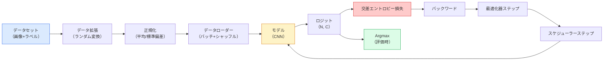

# 画像分類

> 分類器とはピクセルからクラスの確率分布へのマッピングだ。それ以外はすべて配管工事に過ぎない。


## 学習目標

- CIFAR-10でエンドツーエンドの画像分類パイプラインを構築する：データセット、データ拡張、モデル、学習ループ、評価
- 各コンポーネント（データローダー、損失、最適化器、スケジューラー、データ拡張）の役割を説明し、それぞれが壊れた場合に損失曲線にどのように現れるかを予測する
- mixup、cutout、ラベルスムージングをゼロから実装し、それぞれを追加する価値があるタイミングを正当化する
- 混同行列とクラスごとの精度/再現率テーブルを読み、集計精度を超えたデータセットとモデルの障害を診断する

## 問題の概要

出荷されるすべてのビジョンタスクは、何らかのレベルで画像分類に帰着する。検出は領域を分類する。セグメンテーションはピクセルを分類する。検索はクラス中心からの類似度でランク付けする。分類を正しく行うこと——データセットループ、データ拡張ポリシー、損失、評価——はフェーズの他のすべてのタスクに転用できるスキルだ。

ほとんどの分類バグはモデルにない。パイプラインに潜んでいる：壊れた正規化、シャッフルされていない学習セット、ラベルを歪めるデータ拡張、学習データで汚染された検証スプリット、エポック30以降に静かに発散する学習率。正しいセットアップで93%を出すCNNは、壊れたセットアップでは70-75%を出し、その間ずっと損失曲線はもっともらしく見える。

このレッスンではパイプライン全体を手で組み上げ、各部分が検査できるようにする。バグを隠す可能性のある`torchvision.datasets`からは何も使わない。

## 概念の解説

### 分類パイプラインの全体像



このループのすべての行がバグの潜み場所だ。交差エントロピーはsoftmax出力ではなく生のロジットを受け取るため、損失の前に`model(x).softmax()`を適用すると誤った勾配を静かに計算する。データ拡張は入力にのみ適用され、ラベルには適用しない——両方を混合するmixupを除いて。`optimizer.zero_grad()`はステップごとに1回行われなければならず、スキップすると勾配が蓄積され、学習率が非常に不安定なように見える。これらのバグはどれもエラーを投げず、学習曲線を平坦化するだけだ。

### 交差エントロピー、ロジット、softmax

分類器は画像ごとにロジットと呼ばれる`C`個の数値を生成する。softmaxを適用すると確率分布に変換される：

```
softmax(z)_i = exp(z_i) / sum_j exp(z_j)
```

交差エントロピーは正解クラスの負の対数確率を測定する：

```
CE(z, y) = -log( softmax(z)_y )
        = -z_y + log( sum_j exp(z_j) )
```

右辺の形式が数値安定版だ（log-sum-exp）。PyTorchの`nn.CrossEntropyLoss`はsoftmax + NLLを1つの演算で融合し、生のロジットを直接受け取る。自分でsoftmaxを先に適用することはほぼ常にバグだ——`log(softmax(softmax(z)))`を計算することになり、意味のない量になる。

### なぜデータ拡張が機能するのか

CNNは並進（重み共有から）に対する帰納バイアスを持っているが、クロップ、フリップ、カラージッター、遮蔽に対する組み込みの不変性は持っていない。それらの不変性を教える唯一の方法は、それらを練習するピクセルを見せることだ。学習中のすべてのランダム変換は「この2つの画像は同じラベルを持つ；その差異を無視する特徴を学べ」と言う方法だ。

```
元のクロップ：「左向きの犬」
フリップ：    「右向きの犬」       <- 同じラベル、異なるピクセル
Rotate(+15)： 「少し傾いた犬」
カラージッター：「暖かい光の中の犬」
RandomErasing：「パッチが欠けた犬」
```

ルール：データ拡張はラベルを保持しなければならない。数字への切り取りと回転は「6」を「9」に変えられる；そのデータセットでは小さな回転範囲を使い、数字固有の不変性を尊重するデータ拡張を選ぶ。

### MixupとCutmix

通常のデータ拡張はピクセルを変換するがラベルをone-hotのままにしておく。**Mixup**と**Cutmix**はその両方を補間することで壊す。

```
Mixup:
  lambda ~ Beta(a, a)
  x = lambda * x_i + (1 - lambda) * x_j
  y = lambda * y_i + (1 - lambda) * y_j

Cutmix:
  x_iにx_jのランダムな矩形を貼り付ける
  y = y_iとy_jの面積加重混合
```

なぜ役立つか：モデルは鋭いone-hotターゲットを記憶するのをやめ、クラス間を補間することを学習する。学習損失は上がるが、テスト精度も上がる。任意の分類器にとって最も安価な堅牢性アップグレードだ。

### ラベルスムージング

Mixupの近縁。`[0, 0, 1, 0, 0]`に対して学習するのではなく、小さな`eps`（例：0.1）で`[eps/C, eps/C, 1-eps, eps/C, eps/C]`に対して学習する。モデルが任意に鋭いロジットを生成するのを防ぎ、ほぼコストなしでキャリブレーションを改善する。PyTorch 1.10以降、`nn.CrossEntropyLoss(label_smoothing=0.1)`に組み込まれている。

### 精度を超えた評価

集計精度は不均衡を隠す。多数クラスを常に予測する90-10の二値分類器は90%のスコアを出す。実際に何が起きているかを教えるツール：

- **クラスごとの精度** — クラスごとの1つの数値；パフォーマンスが低いカテゴリをすぐに浮き彫りにする。
- **混同行列** — C x C のグリッド、行i列j = 真のクラスiがクラスjとして予測された数；対角線が正解、非対角線がモデルの生きている場所。
- **Top-1 / Top-5** — 正解クラスが上位1つまたは5つの予測に含まれるか；Top-5はImageNetで重要だ、「Norwich Terrier」対「Norfolk Terrier」のようなクラスは本質的に曖昧だから。
- **キャリブレーション（ECE）** — 0.8の信頼度予測は80%の確率で正解するか？現代のネットワークは系統的に過信している；温度スケーリングまたはラベルスムージングで修正する。

## 実装する

### ステップ1：決定論的な合成データセット

CIFAR-10はディスク上にある。このレッスンを再現可能で高速にするため、CIFARに見える合成データセットを構築する——モデルが学習しなければならないクラス固有の構造を持つ32x32 RGBイメージ。まったく同じパイプラインが変更なしで実際のCIFAR-10でも機能する。

```python
import numpy as np
import torch
from torch.utils.data import Dataset


def synthetic_cifar(num_per_class=1000, num_classes=10, seed=0):
    rng = np.random.default_rng(seed)
    X = []
    Y = []
    for c in range(num_classes):
        centre = rng.uniform(0, 1, (3,))
        freq = 2 + c
        for _ in range(num_per_class):
            yy, xx = np.meshgrid(np.linspace(0, 1, 32), np.linspace(0, 1, 32), indexing="ij")
            r = np.sin(xx * freq) * 0.5 + centre[0]
            g = np.cos(yy * freq) * 0.5 + centre[1]
            b = (xx + yy) * 0.5 * centre[2]
            img = np.stack([r, g, b], axis=-1)
            img += rng.normal(0, 0.08, img.shape)
            img = np.clip(img, 0, 1)
            X.append(img.astype(np.float32))
            Y.append(c)
    X = np.stack(X)
    Y = np.array(Y)
    idx = rng.permutation(len(X))
    return X[idx], Y[idx]


class ArrayDataset(Dataset):
    def __init__(self, X, Y, transform=None):
        self.X = X
        self.Y = Y
        self.transform = transform

    def __len__(self):
        return len(self.X)

    def __getitem__(self, i):
        img = self.X[i]
        if self.transform is not None:
            img = self.transform(img)
        img = torch.from_numpy(img).permute(2, 0, 1)
        return img, int(self.Y[i])
```

各クラスは固有のカラーパレットと周波数パターンを持ち、さらにGaussianノイズが加わってモデルがピクセルを記憶するのではなくシグナルを学習するよう強制する。10クラス、各1000枚、シャッフル済み。

### ステップ2：正規化とデータ拡張

すべてのビジョンパイプラインが持つ2つの変換。

```python
def standardize(mean, std):
    mean = np.array(mean, dtype=np.float32)
    std = np.array(std, dtype=np.float32)
    def _fn(img):
        return (img - mean) / std
    return _fn


def random_hflip(p=0.5):
    def _fn(img):
        if np.random.random() < p:
            return img[:, ::-1, :].copy()
        return img
    return _fn


def random_crop(pad=4):
    def _fn(img):
        h, w = img.shape[:2]
        padded = np.pad(img, ((pad, pad), (pad, pad), (0, 0)), mode="reflect")
        y = np.random.randint(0, 2 * pad)
        x = np.random.randint(0, 2 * pad)
        return padded[y:y + h, x:x + w, :]
    return _fn


def compose(*fns):
    def _fn(img):
        for fn in fns:
            img = fn(img)
        return img
    return _fn
```

クロップの前はゼロパディングではなくリフレクトパディングを使う。黒い境界はモデルが非有用な方法で無視することを学ぶシグナルになるからだ。

### ステップ3：Mixup

学習ステップ内で2つの画像と2つのラベルを混合する。バッチ変換として実装することで、データセット内ではなくフォワードパスの隣に置かれる。

```python
def mixup_batch(x, y, num_classes, alpha=0.2):
    if alpha <= 0:
        return x, torch.nn.functional.one_hot(y, num_classes).float()
    lam = float(np.random.beta(alpha, alpha))
    idx = torch.randperm(x.size(0), device=x.device)
    x_mixed = lam * x + (1 - lam) * x[idx]
    y_onehot = torch.nn.functional.one_hot(y, num_classes).float()
    y_mixed = lam * y_onehot + (1 - lam) * y_onehot[idx]
    return x_mixed, y_mixed


def soft_cross_entropy(logits, soft_targets):
    log_probs = torch.log_softmax(logits, dim=-1)
    return -(soft_targets * log_probs).sum(dim=-1).mean()
```

`soft_cross_entropy`はソフトラベル分布に対する交差エントロピーだ。ターゲットがちょうどone-hotの場合、通常のone-hotのケースに帰着する。

### ステップ4：学習ループ

完全なレシピ：データの1パス、バッチごとに1回の勾配計算、エポックごとに1回のスケジューラーステップ。

```python
import torch
import torch.nn as nn
from torch.utils.data import DataLoader
from torch.optim import SGD
from torch.optim.lr_scheduler import CosineAnnealingLR

def train_one_epoch(model, loader, optimizer, device, num_classes, use_mixup=True):
    model.train()
    total, correct, loss_sum = 0, 0, 0.0
    for x, y in loader:
        x, y = x.to(device), y.to(device)
        if use_mixup:
            x_m, y_soft = mixup_batch(x, y, num_classes)
            logits = model(x_m)
            loss = soft_cross_entropy(logits, y_soft)
        else:
            logits = model(x)
            loss = nn.functional.cross_entropy(logits, y, label_smoothing=0.1)
        optimizer.zero_grad()
        loss.backward()
        optimizer.step()
        loss_sum += loss.item() * x.size(0)
        total += x.size(0)
        # mixup使用時の学習精度はun-mixedラベル`y`に対する近似値
        # （モデルはソフトターゲットを見たが、yは見ていない）。
        # おおよその進捗シグナルとして扱い、本当のパフォーマンスはval精度で確認する。
        with torch.no_grad():
            pred = logits.argmax(dim=-1)
            correct += (pred == y).sum().item()
    return loss_sum / total, correct / total


@torch.no_grad()
def evaluate(model, loader, device, num_classes):
    model.eval()
    total, correct = 0, 0
    loss_sum = 0.0
    cm = torch.zeros(num_classes, num_classes, dtype=torch.long)
    for x, y in loader:
        x, y = x.to(device), y.to(device)
        logits = model(x)
        loss = nn.functional.cross_entropy(logits, y)
        pred = logits.argmax(dim=-1)
        for t, p in zip(y.cpu(), pred.cpu()):
            cm[t, p] += 1
        loss_sum += loss.item() * x.size(0)
        total += x.size(0)
        correct += (pred == y).sum().item()
    return loss_sum / total, correct / total, cm
```

学習ループを書くたびに確認する5つの不変条件：

1. 学習前に`model.train()`、評価前に`model.eval()`——ドロップアウトとバッチ正規化の動作を切り替える。
2. `.backward()`の前に`.zero_grad()`。
3. メトリクス蓄積時に`.item()`——計算グラフが生き続けるものがないようにする。
4. 評価中は`@torch.no_grad()`——メモリと時間を節約し、微妙な事故を防ぐ。
5. softmaxではなく生のロジットに対してArgmax——同じ結果、1演算少ない。

### ステップ5：まとめる

前のレッスンの`TinyResNet`を使い、数エポック学習し、評価する。

```python
from main import synthetic_cifar, ArrayDataset
from main import standardize, random_hflip, random_crop, compose
from main import mixup_batch, soft_cross_entropy
from main import train_one_epoch, evaluate
# TinyResNetは前のレッスン（03-cnns-lenet-to-resnet）から来る。
# 前のレッスンのコードを保存した場所に合わせてインポートパスを調整する。
from cnns_lenet_to_resnet import TinyResNet  # プレースホルダーの例

X, Y = synthetic_cifar(num_per_class=500)
split = int(0.9 * len(X))
X_train, Y_train = X[:split], Y[:split]
X_val, Y_val = X[split:], Y[split:]

mean = [0.5, 0.5, 0.5]
std = [0.25, 0.25, 0.25]
train_tf = compose(random_hflip(), random_crop(pad=4), standardize(mean, std))
eval_tf = standardize(mean, std)

train_ds = ArrayDataset(X_train, Y_train, transform=train_tf)
val_ds = ArrayDataset(X_val, Y_val, transform=eval_tf)

train_loader = DataLoader(train_ds, batch_size=128, shuffle=True, num_workers=0)
val_loader = DataLoader(val_ds, batch_size=256, shuffle=False, num_workers=0)

device = "cuda" if torch.cuda.is_available() else "cpu"
model = TinyResNet(num_classes=10).to(device)
optimizer = SGD(model.parameters(), lr=0.1, momentum=0.9, weight_decay=5e-4, nesterov=True)
scheduler = CosineAnnealingLR(optimizer, T_max=10)

for epoch in range(10):
    tr_loss, tr_acc = train_one_epoch(model, train_loader, optimizer, device, 10, use_mixup=True)
    va_loss, va_acc, _ = evaluate(model, val_loader, device, 10)
    scheduler.step()
    print(f"epoch {epoch:2d}  lr {scheduler.get_last_lr()[0]:.4f}  "
          f"train {tr_loss:.3f}/{tr_acc:.3f}  val {va_loss:.3f}/{va_acc:.3f}")
```

合成データセットでは、5エポック以内にほぼ完璧な検証精度に達する——これがポイントだ：パイプラインは正しく、モデルは学習可能なものを学習できる。データセットを実際のCIFAR-10に交換しても、同じループが変更なしで約90%まで学習する。

### ステップ6：混同行列を読む

精度だけではモデルがどこで失敗しているかが決してわからない。混同行列が教えてくれる。

```python
def print_confusion(cm, labels=None):
    c = cm.shape[0]
    labels = labels or [str(i) for i in range(c)]
    print(f"{'':>6}" + "".join(f"{l:>5}" for l in labels))
    for i in range(c):
        row = cm[i].tolist()
        print(f"{labels[i]:>6}" + "".join(f"{v:>5}" for v in row))
    print()
    tp = cm.diag().float()
    fp = cm.sum(dim=0).float() - tp
    fn = cm.sum(dim=1).float() - tp
    prec = tp / (tp + fp).clamp_min(1)
    rec = tp / (tp + fn).clamp_min(1)
    f1 = 2 * prec * rec / (prec + rec).clamp_min(1e-9)
    for i in range(c):
        print(f"{labels[i]:>6}  prec {prec[i]:.3f}  rec {rec[i]:.3f}  f1 {f1[i]:.3f}")

_, _, cm = evaluate(model, val_loader, device, 10)
print_confusion(cm)
```

行が真のクラス、列が予測。クラス3と5の間の非対角の集まりは、モデルがその2つを混同していることを意味し、ターゲットデータ収集またはクラス固有のデータ拡張の出発点になる。

## 使ってみる

`torchvision`は上記のすべてを慣用的なコンポーネントにまとめている。実際のCIFAR-10では、完全なパイプラインは4行プラス学習ループだ。

```python
from torchvision.datasets import CIFAR10
from torchvision.transforms import Compose, RandomCrop, RandomHorizontalFlip, ToTensor, Normalize

mean = (0.4914, 0.4822, 0.4465)
std = (0.2470, 0.2435, 0.2616)
train_tf = Compose([
    RandomCrop(32, padding=4, padding_mode="reflect"),
    RandomHorizontalFlip(),
    ToTensor(),
    Normalize(mean, std),
])
eval_tf = Compose([ToTensor(), Normalize(mean, std)])

train_ds = CIFAR10(root="./data", train=True,  download=True, transform=train_tf)
val_ds   = CIFAR10(root="./data", train=False, download=True, transform=eval_tf)
```

注目すべき2点：mean/stdは**データセット固有**だ——ImageNetではなくCIFAR-10学習セットで計算されている——そしてリフレクトパッドはコミュニティのデフォルトのクロップポリシーだ。ここにImageNetの統計をコピーペーストするのは、誰もモデルをプロファイルするまで気づかない約1%の精度漏れだ。

## 成果物を出す

このレッスンでは以下を生成する：

- `outputs/prompt-classifier-pipeline-auditor.md` — 学習スクリプトを上記の5つの不変条件で監査し、最初の違反を浮き彫りにするプロンプト。
- `outputs/skill-classification-diagnostics.md` — 混同行列とクラス名のリストが与えられたとき、クラスごとの失敗を要約し、最も影響力のある単一の修正を提案するスキル。

## 演習

1. **(簡単)** 合成データセットで同じモデルをmixupありとなしで5エポック学習する。両方の学習損失と検証損失をプロットする。mixupありの学習損失が高いにもかかわらず検証精度が同等かより良い理由を説明する。
2. **(中級)** Cutoutを実装する——各学習画像内のランダムな8x8の正方形をゼロにする——そしてデータ拡張なし、hflip+クロップ、hflip+クロップ+cutout、hflip+クロップ+mixupでアブレーションを実行する。各条件の検証精度を報告する。
3. **(難)** CIFAR-100パイプライン（100クラス、同じ入力サイズ）を構築し、ResNet-34の学習を公開精度の1%以内で再現する。追加：3つの学習率と2つの重み減衰をスイープし、ローカルCSVにログを記録し、最終的な混同行列トップ混同テーブルを生成する。

## キーワード

| 用語 | よく言われること | 実際の意味 |
|------|----------------|-----------|
| ロジット | 「生の出力」 | softmax前の画像ごとのC個の数値のベクトル；交差エントロピーはこれを期待し、softmax済みの値ではない |
| 交差エントロピー | 「損失」 | 正解クラスの負の対数確率；log-softmaxとNLLを1つの安定した演算に結合 |
| データローダー | 「バッチャー」 | シャッフル、バッチ化、（オプションの）マルチワーカーロードでデータセットをラップ；学習バグの半分はここのせいにされる |
| データ拡張 | 「ランダム変換」 | 学習時にラベルを保持するあらゆるピクセルレベルの変換；CNNがネイティブには持っていない不変性を教える |
| Mixup / Cutmix | 「2つの画像を混合」 | 入力とラベルの両方をブレンドして、分類器が硬い境界の代わりに滑らかな補間を学習するようにする |
| ラベルスムージング | 「ソフトなターゲット」 | one-hotを(1-eps, eps/(C-1), ...)で置き換える；キャリブレーションを改善し、精度をわずかに向上させる |
| Top-k精度 | 「Top-5」 | 正解クラスがk番目に高い確率の予測に含まれるか；本質的に曖昧なクラスを持つデータセットに使用 |
| 混同行列 | 「エラーの住み処」 | エントリ(i, j)が真のクラスiがjとして予測された画像数を数えるC x Cテーブル；対角線が正解、非対角線が修正すべき箇所を教える |

## 参考資料

- [CS231n: Training Neural Networks](https://cs231n.github.io/neural-networks-3/) — 今でも1ページで学習パイプラインを最も明確に解説している
- [Bag of Tricks for Image Classification (He et al., 2019)](https://arxiv.org/abs/1812.01187) — 合わせてResNetのImageNet精度を3-4%向上させる小さなトリック集
- [mixup: Beyond Empirical Risk Minimization (Zhang et al., 2017)](https://arxiv.org/abs/1710.09412) — オリジナルのmixup論文；3ページの理論と説得力ある実験
- [Why temperature scaling matters (Guo et al., 2017)](https://arxiv.org/abs/1706.04599) — 現代のネットワークが誤ったキャリブレーションを持つことを証明し、1つのスカラーパラメータで修正した論文
