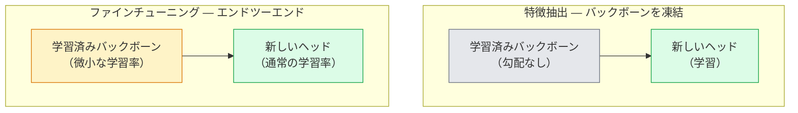

# 転移学習とファインチューニング

> 誰かが100万GPU時間をかけて、ネットワークにエッジ、テクスチャ、物体のパーツがどのように見えるかを教えた。自分のモデルを学習させる前に、それらの特徴を借りるべきだ。


## 学習目標

- 特徴抽出とファインチューニングを区別し、データセットサイズ、ドメイン距離、コンピューティングバジェットに基づいて適切なものを選ぶ
- 学習済みバックボーンをロードし、分類ヘッドを置き換え、20行以内でヘッドのみを学習させて動作するベースラインを作る
- 識別的学習率で層を段階的に解凍し、初期の汎用特徴が後期のタスク固有の特徴より小さい更新を受けるようにする
- 3つの一般的な失敗を診断する：解凍されたブロックへの高すぎる学習率による特徴ドリフト、小さなデータセットでのBN統計崩壊、破滅的な忘却

## 問題の概要

ImageNetでResNet-50を学習するには約2,000GPU時間かかる。出荷するすべてのタスクにそのバジェットを持てるチームは少ない。ほぼすべてのチームが実際に出荷するのは、数百または数千のタスク固有の画像で学習した新しいヘッドを持つ、学習済みバックボーンだ。

これは近道ではない。ImageNetで学習したCNNの最初の畳み込みブロックはエッジとGaborに似たフィルターを学習する。次のいくつかのブロックはテクスチャと単純なモチーフを学習する。中間のブロックは物体のパーツを学習する。最後のブロックは1,000のImageNetカテゴリに見え始める組み合わせを学習する。その階層の最初の90%は、医療画像、産業検査、衛星データ、その他のすべてのビジョンタスクにほぼ変更なく転移する——なぜなら自然界のエッジとテクスチャの語彙は限られているからだ。実際に学習するのは最後の10%だ。

転移学習を正しく行うためには3つのバグが待ち構えている：高すぎる学習率で学習済み特徴を破壊すること、凍結しすぎてモデルに情報を与えないこと、BatchNormの実行統計がネットワークの残りが学習したことのない小さなデータセットに向けてドリフトすること。このレッスンでは各バグを意図的に歩む。

## 概念の解説

### 特徴抽出 vs ファインチューニング

2つのレジーム。学習済み特徴をどれだけ信頼するか、データがどれだけあるかによって選ぶ。



経験則：

| データセットサイズ | ドメイン距離 | レシピ |
|-----------------|-------------|--------|
| 1,000枚未満 | ImageNetに近い | バックボーンを凍結し、ヘッドのみ学習 |
| 1,000〜10,000枚 | 近い | 最初の2〜3ステージを凍結し、残りをファインチューニング |
| 10,000〜100,000枚 | 任意 | 識別的学習率でエンドツーエンドにファインチューニング |
| 100,000枚以上 | 遠い | すべてをファインチューニング；ドメインが十分に遠ければスクラッチ学習を検討 |

「ImageNetに近い」とは、おおよそ物体のようなコンテンツを持つ自然なRGB写真を意味する。医療CTスキャン、上空からの衛星画像、顕微鏡写真は遠いドメインだ——特徴はまだ役立つが、より多くの層を適応させる必要がある。

### なぜ凍結がそもそも機能するのか

CNNがImageNetから学習する特徴は1,000カテゴリに特化していない。それらは自然画像の統計に特化している：特定の向きのエッジ、テクスチャ、コントラストパターン、形状のプリミティブ。それらの統計は人間が名付けられるほぼすべての視覚ドメインで安定している。だからこそ、ImageNetで学習して新しい線形ヘッドだけでCIFAR-10でゼロショット評価する（バックボーンのファインチューニングなし）モデルが80%以上の精度に達する。ヘッドはこのタスクのために既に学習された特徴のどれを重み付けするかを学習している。

### 識別的学習率

凍結を解除するとき、初期層は後期層より遅く学習すべきだ。初期層は保持したい汎用特徴をエンコードし、後期層は大きく移動させる必要があるタスク固有の構造をエンコードする。

```
典型的なレシピ：

  ステージ0（ステム+最初のグループ）：lr = base_lr / 100    （ほぼ固定）
  ステージ1：                          lr = base_lr / 10
  ステージ2：                          lr = base_lr / 3
  ステージ3（最後のバックボーングループ）：lr = base_lr
  ヘッド：                              lr = base_lr（またはわずかに高い）
```

PyTorchではこれは最適化器に渡されるパラメータグループのリストに過ぎない。1つのモデル、5つの学習率、余分なコードはゼロ。

### BatchNormの問題

BN層はImageNetで計算された`running_mean`と`running_var`バッファを保持している。タスクが異なるピクセル分布を持つ場合——異なる照明、異なるセンサー、異なる色空間——それらのバッファは間違っている。優先順位順の3つのオプション：

1. **BNを学習モードでファインチューニング。** BNの実行統計を他のすべてと一緒に更新させる。タスクデータセットが中程度のサイズ（5,000サンプル以上）の場合のデフォルトの選択。
2. **BNを評価モードで凍結。** ImageNetの統計を保持し、重みのみを学習する。データセットが小さくBNの移動平均がノイズになる場合に正しい。
3. **BNをGroupNormで置き換え。** 移動平均の問題を完全に除去。バッチサイズがGPUごとに小さい検出およびセグメンテーションバックボーンで使用。

これを間違えると精度が5〜15%静かに低下する。

### ヘッドの設計

分類ヘッドはオプションのドロップアウトを持つ1〜3つの線形層だ。すべてのtorchvisionの分類バックボーンには置き換えるデフォルトのヘッドが付属している：

```
backbone.fc = nn.Linear(backbone.fc.in_features, num_classes)          # ResNet
backbone.classifier[1] = nn.Linear(..., num_classes)                    # EfficientNet, MobileNet
backbone.heads.head = nn.Linear(..., num_classes)                       # torchvision ViT
```

小さなデータセットでは、単一の線形層で通常十分だ。隠れ層（Linear -> ReLU -> Dropout -> Linear）を追加することは、タスク分布がバックボーンの学習分布から遠い場合に役立つ。

### 層ごとの学習率減衰

現代のファインチューニング（BEiT、DINOv2、ViT-Bのファインチューニング）で使われる識別的学習率のより滑らかなバージョン。層をステージにグループ化するのではなく、各層に上の層より少し小さい学習率を与える：

```
lr_layer_k = base_lr * decay^(L - k)
```

decay = 0.75でL = 12のトランスフォーマーブロックの場合、最初のブロックはヘッドの学習率の`0.75^11 ≈ 0.04倍`で学習する。CNNよりもトランスフォーマーのファインチューニングでより重要で、CNNではステージグループ化された学習率で通常十分だ。

### 評価すべき指標

転移学習の実行ではスクラッチ実行では追跡しない2つの数値が必要だ：

- **学習済みのみの精度** — バックボーンを凍結したヘッドの精度。これが下限だ。
- **ファインチューニング後の精度** — エンドツーエンド学習後の同じモデル。これが上限だ。

ファインチューニング後が学習済みのみより低い場合、学習率またはBNのバグがある。常に両方を表示する。

## 実装する

### ステップ1：学習済みバックボーンをロードして検査する

```python
import torch
import torch.nn as nn
from torchvision.models import resnet18, ResNet18_Weights

backbone = resnet18(weights=ResNet18_Weights.IMAGENET1K_V1)
print(backbone)
print()
print("classifier head:", backbone.fc)
print("feature dim:", backbone.fc.in_features)
```

`ResNet18`はステムと`fc`ヘッドに加え4つのステージ（`layer1..layer4`）を持つ。すべてのtorchvisionの分類バックボーンには類似した構造がある。

### ステップ2：特徴抽出——すべてを凍結し、ヘッドを置き換える

```python
def make_feature_extractor(num_classes=10):
    model = resnet18(weights=ResNet18_Weights.IMAGENET1K_V1)
    for p in model.parameters():
        p.requires_grad = False
    model.fc = nn.Linear(model.fc.in_features, num_classes)
    return model

model = make_feature_extractor(num_classes=10)
trainable = sum(p.numel() for p in model.parameters() if p.requires_grad)
frozen = sum(p.numel() for p in model.parameters() if not p.requires_grad)
print(f"trainable: {trainable:>10,}")
print(f"frozen:    {frozen:>10,}")
```

`model.fc`のみが学習可能だ。バックボーンは凍結された特徴抽出器だ。

### ステップ3：識別的ファインチューニング

ステージ固有の学習率を持つパラメータグループを構築するユーティリティ。

```python
def discriminative_param_groups(model, base_lr=1e-3, decay=0.3):
    stages = [
        ["conv1", "bn1"],
        ["layer1"],
        ["layer2"],
        ["layer3"],
        ["layer4"],
        ["fc"],
    ]
    groups = []
    for i, names in enumerate(stages):
        lr = base_lr * (decay ** (len(stages) - 1 - i))
        params = [p for n, p in model.named_parameters()
                  if any(n.startswith(k) for k in names)]
        if params:
            groups.append({"params": params, "lr": lr, "name": "_".join(names)})
    return groups

model = resnet18(weights=ResNet18_Weights.IMAGENET1K_V1)
model.fc = nn.Linear(model.fc.in_features, 10)
for p in model.parameters():
    p.requires_grad = True

groups = discriminative_param_groups(model)
for g in groups:
    print(f"{g['name']:>10s}  lr={g['lr']:.2e}  params={sum(p.numel() for p in g['params']):>8,}")
```

`decay=0.3`は各ステージが次のステージの30%のレートで学習することを意味する。`fc`は`base_lr`を取得し、`layer4`は`0.3 * base_lr`、`conv1`は`0.3^5 * base_lr ≈ 0.00243 * base_lr`を取得する。極端に聞こえるが、経験的に機能する。

### ステップ4：BatchNormの処理

重みを凍結せずにBNの実行統計を凍結するヘルパー。

```python
def freeze_bn_stats(model):
    for m in model.modules():
        if isinstance(m, (nn.BatchNorm1d, nn.BatchNorm2d, nn.BatchNorm3d)):
            m.eval()
            for p in m.parameters():
                p.requires_grad = False
    return model
```

各エポックの開始時に`model.train()`の後に呼び出す。`model.train()`はすべてを学習モードに切り替える；これはBN層のみをもとに戻す。

### ステップ5：最小限のエンドツーエンドファインチューニングループ

```python
from torch.optim import SGD
from torch.utils.data import DataLoader
from torch.optim.lr_scheduler import CosineAnnealingLR
import torch.nn.functional as F

def fine_tune(model, train_loader, val_loader, device, epochs=5, base_lr=1e-3, freeze_bn=False):
    model = model.to(device)
    groups = discriminative_param_groups(model, base_lr=base_lr)
    optimizer = SGD(groups, momentum=0.9, weight_decay=1e-4, nesterov=True)
    scheduler = CosineAnnealingLR(optimizer, T_max=epochs)

    for epoch in range(epochs):
        model.train()
        if freeze_bn:
            freeze_bn_stats(model)
        tr_loss, tr_correct, tr_total = 0.0, 0, 0
        for x, y in train_loader:
            x, y = x.to(device), y.to(device)
            logits = model(x)
            loss = F.cross_entropy(logits, y, label_smoothing=0.1)
            optimizer.zero_grad()
            loss.backward()
            optimizer.step()
            tr_loss += loss.item() * x.size(0)
            tr_total += x.size(0)
            tr_correct += (logits.argmax(-1) == y).sum().item()
        scheduler.step()

        model.eval()
        va_total, va_correct = 0, 0
        with torch.no_grad():
            for x, y in val_loader:
                x, y = x.to(device), y.to(device)
                pred = model(x).argmax(-1)
                va_total += x.size(0)
                va_correct += (pred == y).sum().item()
        print(f"epoch {epoch}  train {tr_loss/tr_total:.3f}/{tr_correct/tr_total:.3f}  "
              f"val {va_correct/va_total:.3f}")
    return model
```

上記のレシピでCIFAR-10を5エポック学習すると、`ResNet18-IMAGENET1K_V1`はゼロショット線形プローブ精度約70%からファインチューニング後の約93%に達する。ヘッドだけではバックボーンに一切触れずに約86%で頭打ちになる。

### ステップ6：段階的な解凍

終端から始端に向けてエポックごとに1ステージを解凍するスケジュール。追加エポックのコストで特徴ドリフトを軽減する。

```python
def progressive_unfreeze_schedule(model):
    stages = ["layer4", "layer3", "layer2", "layer1"]
    yielded = set()

    def start():
        for p in model.parameters():
            p.requires_grad = False
        for p in model.fc.parameters():
            p.requires_grad = True

    def unfreeze(epoch):
        if epoch < len(stages):
            name = stages[epoch]
            yielded.add(name)
            for n, p in model.named_parameters():
                if n.startswith(name):
                    p.requires_grad = True
            return name
        return None

    return start, unfreeze
```

最初のエポックの前に`start()`を1回呼び出す。各エポックの開始時に`unfreeze(epoch)`を呼び出す。学習可能なパラメータのセットが変わるたびに最適化器を再構築する。そうしないと凍結されたパラメータが混乱させるキャッシュされたモーメントを保持し続ける。

## 使ってみる

ほとんどの実際のタスクでは、`torchvision.models` + 3行で十分だ。上記のより重い機能が重要になるのは、ライブラリのデフォルトでは修正できない問題に遭遇したときだ。

```python
from torchvision.models import resnet50, ResNet50_Weights

model = resnet50(weights=ResNet50_Weights.IMAGENET1K_V2)
model.fc = nn.Linear(model.fc.in_features, num_classes)
optimizer = torch.optim.AdamW(model.parameters(), lr=1e-4, weight_decay=1e-4)
```

2つの他の本番グレードのデフォルト：

- `timm`は一貫したAPI（`timm.create_model("resnet50", pretrained=True, num_classes=10)`）で約800の学習済みビジョンバックボーンを提供する。torchvisionのzooを超えた任意のファインチューニングでは標準だ。
- トランスフォーマーでは、`transformers.AutoModelForImageClassification.from_pretrained(name, num_labels=N)`がテキストモデルと同じロードセマンティクスでViT / BEiT / DeiTを提供する。

## 成果物を出す

このレッスンでは以下を生成する：

- `outputs/prompt-fine-tune-planner.md` — データセットサイズ、ドメイン距離、コンピューティングバジェットに基づいて特徴抽出 vs 段階的 vs エンドツーエンドファインチューニングを選ぶプロンプト。
- `outputs/skill-freeze-inspector.md` — PyTorchモデルが与えられたとき、学習可能なパラメータ、評価モードのBN層、最適化器が実際に学習可能なパラメータを受け取っているかを報告するスキル。

## 演習

1. **(簡単)** 同じ合成CIFARデータセットで`ResNet18`を線形プローブ（バックボーン凍結）と完全ファインチューニングとして学習する。両方の精度を並べて報告する。どのギャップが特徴が良く転移することを示し、どのギャップがそうでないことを示すかを説明する。
2. **(中級)** わざとバグを導入する：ヘッドの代わりにバックボーンステージで`base_lr = 1e-1`を設定する。学習損失が爆発するのを示し、次に`discriminative_param_groups`ヘルパーを適用して回復する。各ステージが発散し始める学習率を記録する。
3. **(難)** 医療画像データセット（例：CheXpert-small、PatchCamelyon、HAM10000）を使い3つのレジームを比較する：(a) ImageNet学習済みの凍結バックボーン+線形ヘッド；(b) ImageNet学習済みのエンドツーエンドファインチューニング；(c) スクラッチ学習。各条件の精度とコンピューティングコストを報告する。スクラッチ学習が競争力を持つのはどのデータセットサイズからか？

## キーワード

| 用語 | よく言われること | 実際の意味 |
|------|----------------|-----------|
| 特徴抽出 | 「凍結してヘッドを学習」 | バックボーンパラメータが凍結され、新しい分類ヘッドのみが勾配を受け取る |
| ファインチューニング | 「エンドツーエンドで再学習」 | すべてのパラメータが学習可能。通常スクラッチ学習より大幅に小さい学習率 |
| 識別的学習率 | 「初期層には小さい学習率」 | 初期ステージの学習率が後期ステージの一部になる最適化器のパラメータグループ |
| 層ごとの学習率減衰 | 「滑らかな学習率の勾配」 | 各層の学習率をdecay^(L - k)で乗算；トランスフォーマーのファインチューニングで一般的 |
| 破滅的な忘却 | 「モデルがImageNetを失った」 | 高すぎる学習率が、新しいタスクシグナルが学習される前に学習済み特徴を上書きする |
| BN統計ドリフト | 「実行平均が間違っている」 | 現在のタスクとは異なる分布で計算されたBatchNormのrunning_mean/var、静かに精度を傷つける |
| 線形プローブ | 「凍結バックボーン+線形ヘッド」 | 学習済み特徴の評価——凍結された表現上の最良の線形分類器の精度 |
| 破滅的崩壊 | 「すべてが1クラスを予測」 | ヘッドからの勾配が安定する前に特徴を破壊するほど高い学習率でファインチューニングしたとき発生 |

## 参考資料

- [How transferable are features in deep neural networks? (Yosinski et al., 2014)](https://arxiv.org/abs/1411.1792) — 層を超えた特徴の転移可能性を定量化した論文
- [Universal Language Model Fine-tuning (ULMFiT, Howard & Ruder, 2018)](https://arxiv.org/abs/1801.06146) — オリジナルの識別的学習率/段階的解凍レシピ；アイデアはビジョンに直接転移する
- [timm documentation](https://huggingface.co/docs/timm) — 最新のビジョンバックボーンとそれらが学習された正確なファインチューニングデフォルトのリファレンス
- [A Simple Framework for Linear-Probe Evaluation (Kornblith et al., 2019)](https://arxiv.org/abs/1805.08974) — 線形プローブ精度が重要な理由とその正しい報告方法
