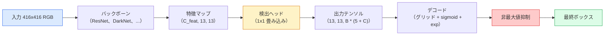

# 物体検出 — YOLOをゼロから

> 検出とは分類と回帰であり、特徴マップのすべての位置で実行し、非最大値抑制でクリーンアップする。


## 学習目標

- グリッドとアンカーの設計が検出を密な予測問題に変える仕組みを説明し、出力テンソルのすべての数値の意味を述べる
- ボックス間のIoU（Intersection over Union）を計算し、非最大値抑制（NMS）をゼロから実装する
- 分類、物体性、ボックス回帰の損失を含む、学習済みバックボーン上に最小限のYOLOスタイルヘッドを構築する
- 検出メトリクス行（precision@0.5、recall、mAP@0.5、mAP@0.5:0.95）を読み、次に調整すべきパラメータを選ぶ

## 問題の概要

分類は「この画像は犬だ」と言う。検出は「画像ピクセル(112, 40, 280, 210)に犬がいて、(400, 180, 560, 310)に猫がいて、フレームにはそれ以外は何もない」と言う。この1つの構造的変化——1画像につき1つのラベルではなく可変数のラベル付きボックスを予測すること——が、すべての自律システム、すべての監視製品、すべてのドキュメントレイアウトパーサー、すべての工場ビジョンラインが依存しているものだ。

検出はビジョンのすべての工学的トレードオフが一度に現れる場所でもある。正確なボックスが欲しい（回帰ヘッド）、各ボックスに正しいクラスが欲しい（分類ヘッド）、何も検出すべきものがないときにモデルに認識させたい（物体性スコア）、そして実際の物体ごとに正確に1つの予測が欲しい（非最大値抑制）。これらのいずれかを見逃すと、パイプラインは物体を見逃すか、幻覚のボックスを報告するか、わずかに異なる位置で同じ物体を15回予測する。

YOLO（You Only Look Once、Redmon et al. 2016）は、畳み込みネットのシングルフォワードパスでこれらすべてをリアルタイムで実行する設計であり、同じ構造的決定が今でも最新の検出器（YOLOv8、YOLOv9、YOLO-NAS、RT-DETR）のバックボーンだ。核心を学べば、すべてのバリアントが同じパーツの再配置になる。

## 概念の解説

### 密な予測としての検出

分類器は画像ごとにC個の数値を出力する。YOLOスタイルの検出器は画像ごとに`(S × S × (5 + C))`個の数値を出力する。Sは空間グリッドサイズだ。



`S * S`のグリッドセルそれぞれが`B`個のボックスを予測する。各ボックスについて：

- 4つの数値がジオメトリを記述する：`tx, ty, tw, th`
- 1つの数値が物体性スコア：「このセルに中心がある物体があるか？」
- C個の数値がクラス確率

セルあたりの合計：`B * (5 + C)`。`S=13, B=2, C=20`のVOCでは、セルあたり50個の数値になる。

### なぜグリッドとアンカーがあるのか

プレーンな回帰は絶対座標として`(x, y, w, h)`を予測する。これは畳み込みネットワークには難しい。画像を並進させると、同じ量だけすべての予測が並進するわけではないからだ——各物体は空間的にアンカーされている。グリッドはこの問題に、各真のボックスをその中心が収まるグリッドセルに割り当てることで対処する；そのセルだけがその物体に対して責任を持つ。

アンカーは2つ目の問題に対処する。3x3の畳み込みは、16ピクセルの受容野特徴セルから500ピクセル幅のボックスを簡単に回帰できない。代わりに、セルごとに`B`個の事前ボックス形状（アンカー）を定義し、各アンカーからの小さなデルタを予測する。モデルは適切なアンカーを選んで調整することを学習する。ゼロから回帰するのではなく。

```
アンカーボックスの事前形状（416x416入力の例）：

  小：    (30,  60)
  中：    (75,  170)
  大：    (200, 380)

各グリッドセルで、すべてのアンカーが (tx, ty, tw, th, obj, c_1, ..., c_C) を出力する。
```

最新の検出器はしばしば解像度ごとに異なるアンカーセットを持つFPNを使う——浅い高解像度マップでは小さなアンカー、深い低解像度マップでは大きなアンカー。同じアイデア、より多くのスケール。

### 予測のデコード

生の`tx, ty, tw, th`はボックス座標ではない；プロットする前に変換される回帰ターゲットだ：

```
中心 x = (sigmoid(tx) + cell_x) * stride
中心 y = (sigmoid(ty) + cell_y) * stride
幅    = anchor_w * exp(tw)
高さ   = anchor_h * exp(th)
```

`sigmoid`は中心オフセットをセル内に保つ。`exp`は符号の反転なしにアンカーから幅を自由にスケールさせる。`stride`はグリッド座標をピクセルに戻す。このデコードステップはv2以降のすべてのYOLOバージョンで同じだ。

### IoU

検出における2つのボックス間の普遍的な類似性メトリクス：

```
IoU(A, B) = area(A ∩ B) / area(A ∪ B)
```

IoU = 1は同一；IoU = 0は重複なし。予測と真のボックス間のIoUが、予測が真陽性としてカウントされるかどうかを決定する（通常IoU >= 0.5）。2つの予測間のIoUがNMSが重複排除に使うものだ。

### 非最大値抑制

隣接するアンカーで学習した畳み込みネットワークはしばしば同じ物体に対して重複するボックスを予測する。NMSは最高信頼度の予測を保持し、閾値を超えるIoUを持つ他の予測を削除する。

```
NMS(ボックス、スコア、IoU閾値):
    スコアの降順でボックスをソート
    keep = []
    ボックスが空でない間:
        トップスコアのボックスを選び、keepに追加
        選んだボックスとのIoU > IoU閾値のすべてのボックスを削除
    keepを返す
```

典型的な閾値：物体検出には0.45。最近の検出器は標準のNMSを`soft-NMS`、`DIoU-NMS`、または学習した抑制（RT-DETR）に置き換えるが、構造的な目的は同じだ。

### 損失

YOLO損失は重みを持つ3つの損失の和だ：

```
L = lambda_coord * L_box(予測, ターゲット, obj=1の場所)
  + lambda_obj   * L_obj(予測, 1,         obj=1の場所)
  + lambda_noobj * L_obj(予測, 0,         obj=0の場所)
  + lambda_cls   * L_cls(予測, ターゲット, obj=1の場所)
```

物体を含むセルのみがボックス回帰と分類損失に貢献する。物体のないセルは物体性損失のみに貢献する（モデルに沈黙を保つよう教える）。`lambda_noobj`は通常小さく（約0.5）、セルの大多数は空であり、そうでなければ総損失を支配してしまうからだ。

最新のバリアントはMSEボックス損失をCIoU / DIoU（IoUを直接最適化する）に置き換え、クラス不均衡にフォーカル損失を使い、クオリティフォーカル損失で物体性をバランスさせる。3コンポーネントの構造は変わらない。

### 検出メトリクス

精度は検出には転用できない。4つの有用な数値：

- **Precision@IoU=0.5** — 陽性としてカウントされた予測の中で実際に正しいものの割合。
- **Recall@IoU=0.5** — 実際の物体の中でいくつ見つけられたか。
- **AP@0.5** — IoU閾値0.5での精度-再現率曲線の面積；クラスごとに1つの数値。
- **mAP@0.5:0.95** — IoU閾値0.5、0.55、...、0.95にわたるAPの平均。COCOメトリクス；最も厳しく、最も情報量が多い。

4つすべてを報告する。mAP@0.5は強いがmAP@0.5:0.95は弱い検出器は、おおよその局所化はできているが厳密ではない；より良いボックス回帰損失で修正する。高精度低再現率の検出器は保守的すぎる；信頼度閾値を下げるか物体性重みを増やす。

## 実装する

### ステップ1：IoU

このレッスン全体の作業馬。`(x1, y1, x2, y2)`形式の2つのボックス配列に対して機能する。

```python
import numpy as np

def box_iou(boxes_a, boxes_b):
    ax1, ay1, ax2, ay2 = boxes_a[:, 0], boxes_a[:, 1], boxes_a[:, 2], boxes_a[:, 3]
    bx1, by1, bx2, by2 = boxes_b[:, 0], boxes_b[:, 1], boxes_b[:, 2], boxes_b[:, 3]

    inter_x1 = np.maximum(ax1[:, None], bx1[None, :])
    inter_y1 = np.maximum(ay1[:, None], by1[None, :])
    inter_x2 = np.minimum(ax2[:, None], bx2[None, :])
    inter_y2 = np.minimum(ay2[:, None], by2[None, :])

    inter_w = np.clip(inter_x2 - inter_x1, 0, None)
    inter_h = np.clip(inter_y2 - inter_y1, 0, None)
    inter = inter_w * inter_h

    area_a = (ax2 - ax1) * (ay2 - ay1)
    area_b = (bx2 - bx1) * (by2 - by1)
    union = area_a[:, None] + area_b[None, :] - inter
    return inter / np.clip(union, 1e-8, None)
```

ペアワイズIoUの`(N_a, N_b)`行列を返す。一方の配列を形状`(1, 4)`にすることで、単一の真のボックスに対して使える。

### ステップ2：非最大値抑制

```python
def nms(boxes, scores, iou_threshold=0.45):
    order = np.argsort(-scores)
    keep = []
    while len(order) > 0:
        i = order[0]
        keep.append(i)
        if len(order) == 1:
            break
        rest = order[1:]
        ious = box_iou(boxes[[i]], boxes[rest])[0]
        order = rest[ious <= iou_threshold]
    return np.array(keep, dtype=np.int64)
```

決定論的で、ソートからの`O(N log N)`であり、同一の入力に対して`torchvision.ops.nms`の動作と一致する。

### ステップ3：ボックスのエンコードとデコード

ピクセル座標とネットワークが実際に回帰する`(tx, ty, tw, th)`ターゲットを相互変換する。

```python
def encode(box_xyxy, cell_x, cell_y, stride, anchor_wh):
    x1, y1, x2, y2 = box_xyxy
    cx = 0.5 * (x1 + x2)
    cy = 0.5 * (y1 + y2)
    w = x2 - x1
    h = y2 - y1
    tx = cx / stride - cell_x
    ty = cy / stride - cell_y
    tw = np.log(w / anchor_wh[0] + 1e-8)
    th = np.log(h / anchor_wh[1] + 1e-8)
    return np.array([tx, ty, tw, th])


def decode(tx_ty_tw_th, cell_x, cell_y, stride, anchor_wh):
    tx, ty, tw, th = tx_ty_tw_th
    cx = (sigmoid(tx) + cell_x) * stride
    cy = (sigmoid(ty) + cell_y) * stride
    w = anchor_wh[0] * np.exp(tw)
    h = anchor_wh[1] * np.exp(th)
    return np.array([cx - w / 2, cy - h / 2, cx + w / 2, cy + h / 2])


def sigmoid(x):
    return 1.0 / (1.0 + np.exp(-x))
```

テスト：ボックスをエンコードしてからデコードすると、元のものにほぼ戻るはずだ（txがpost-sigmoid範囲にない場合のsigmoidの逆関数が完全に可逆でないことによる誤差の範囲内で）。

### ステップ4：最小限のYOLOヘッド

特徴マップ上の1つの1x1畳み込み、`(B, S, S, num_anchors, 5 + C)`に変形する。

```python
import torch
import torch.nn as nn

class YOLOHead(nn.Module):
    def __init__(self, in_c, num_anchors, num_classes):
        super().__init__()
        self.num_anchors = num_anchors
        self.num_classes = num_classes
        self.conv = nn.Conv2d(in_c, num_anchors * (5 + num_classes), kernel_size=1)

    def forward(self, x):
        n, _, h, w = x.shape
        y = self.conv(x)
        y = y.view(n, self.num_anchors, 5 + self.num_classes, h, w)
        y = y.permute(0, 3, 4, 1, 2).contiguous()
        return y
```

出力形状：`(N, H, W, num_anchors, 5 + C)`。最後の次元は`[tx, ty, tw, th, obj, cls_0, ..., cls_{C-1}]`を保持する。

### ステップ5：真のターゲット割り当て

すべての真のボックスに対して、どの`(セル、アンカー)`が責任を持つかを決定する。

```python
def assign_targets(boxes_xyxy, classes, anchors, stride, grid_size, num_classes):
    num_anchors = len(anchors)
    target = np.zeros((grid_size, grid_size, num_anchors, 5 + num_classes), dtype=np.float32)
    has_obj = np.zeros((grid_size, grid_size, num_anchors), dtype=bool)

    for box, cls in zip(boxes_xyxy, classes):
        x1, y1, x2, y2 = box
        cx, cy = 0.5 * (x1 + x2), 0.5 * (y1 + y2)
        gx, gy = int(cx / stride), int(cy / stride)
        bw, bh = x2 - x1, y2 - y1

        ious = np.array([
            (min(bw, aw) * min(bh, ah)) / (bw * bh + aw * ah - min(bw, aw) * min(bh, ah))
            for aw, ah in anchors
        ])
        best = int(np.argmax(ious))
        aw, ah = anchors[best]

        target[gy, gx, best, 0] = cx / stride - gx
        target[gy, gx, best, 1] = cy / stride - gy
        target[gy, gx, best, 2] = np.log(bw / aw + 1e-8)
        target[gy, gx, best, 3] = np.log(bh / ah + 1e-8)
        target[gy, gx, best, 4] = 1.0
        target[gy, gx, best, 5 + cls] = 1.0
        has_obj[gy, gx, best] = True
    return target, has_obj
```

アンカー選択は「真のボックスとの最良のシェイプIoU」——YOLOv2/v3の割り当てと一致する安価なプロキシ。v5以降はより洗練された戦略（タスクアライン付きマッチング、ダイナミックk）を使い、同じアイデアを洗練する。

### ステップ6：3つの損失

```python
def yolo_loss(pred, target, has_obj, lambda_coord=5.0, lambda_obj=1.0, lambda_noobj=0.5, lambda_cls=1.0):
    has_obj_t = torch.from_numpy(has_obj).bool()
    target_t = torch.from_numpy(target).float()

    # ボックス回帰損失：物体があるセルのみ
    box_pred = pred[..., :4][has_obj_t]
    box_true = target_t[..., :4][has_obj_t]
    loss_box = torch.nn.functional.mse_loss(box_pred, box_true, reduction="sum")

    # 物体性損失
    obj_pred = pred[..., 4]
    obj_true = target_t[..., 4]
    loss_obj_pos = torch.nn.functional.binary_cross_entropy_with_logits(
        obj_pred[has_obj_t], obj_true[has_obj_t], reduction="sum")
    loss_obj_neg = torch.nn.functional.binary_cross_entropy_with_logits(
        obj_pred[~has_obj_t], obj_true[~has_obj_t], reduction="sum")

    # 物体があるセルの分類損失
    cls_pred = pred[..., 5:][has_obj_t]
    cls_true = target_t[..., 5:][has_obj_t]
    loss_cls = torch.nn.functional.binary_cross_entropy_with_logits(
        cls_pred, cls_true, reduction="sum")

    total = (lambda_coord * loss_box
             + lambda_obj * loss_obj_pos
             + lambda_noobj * loss_obj_neg
             + lambda_cls * loss_cls)
    return total, {"box": loss_box.item(), "obj_pos": loss_obj_pos.item(),
                   "obj_neg": loss_obj_neg.item(), "cls": loss_cls.item()}
```

すべてのYOLOチュートリアルがハードコードするかスイープする5つのハイパーパラメータ。比率が重要だ：`lambda_coord=5, lambda_noobj=0.5`はオリジナルのYOLOv1論文を反映しており、合理的なデフォルトとして今も機能する。

### ステップ7：推論パイプライン

生のヘッド出力をデコードし、sigmoid/expを適用し、物体性で閾値を設け、NMSを行う。

```python
def postprocess(pred_tensor, anchors, stride, img_size, conf_threshold=0.25, iou_threshold=0.45):
    pred = pred_tensor.detach().cpu().numpy()
    grid_h, grid_w = pred.shape[1], pred.shape[2]
    num_anchors = len(anchors)

    boxes, scores, classes = [], [], []
    for gy in range(grid_h):
        for gx in range(grid_w):
            for a in range(num_anchors):
                tx, ty, tw, th, obj, *cls = pred[0, gy, gx, a]
                score = sigmoid(obj) * sigmoid(np.array(cls)).max()
                if score < conf_threshold:
                    continue
                cls_idx = int(np.argmax(cls))
                cx = (sigmoid(tx) + gx) * stride
                cy = (sigmoid(ty) + gy) * stride
                w = anchors[a][0] * np.exp(tw)
                h = anchors[a][1] * np.exp(th)
                boxes.append([cx - w / 2, cy - h / 2, cx + w / 2, cy + h / 2])
                scores.append(float(score))
                classes.append(cls_idx)

    if not boxes:
        return np.zeros((0, 4)), np.zeros((0,)), np.zeros((0,), dtype=int)
    boxes = np.array(boxes)
    scores = np.array(scores)
    classes = np.array(classes)
    keep = nms(boxes, scores, iou_threshold)
    return boxes[keep], scores[keep], classes[keep]
```

これが完全な評価パスだ：ヘッド → デコード → 閾値 → NMS。

## 使ってみる

`torchvision.models.detection`は同じ概念的構造を持つ本番検出器を提供する。学習済みモデルのロードは3行だ。

```python
import torch
from torchvision.models.detection import fasterrcnn_resnet50_fpn_v2

model = fasterrcnn_resnet50_fpn_v2(weights="DEFAULT")
model.eval()
with torch.no_grad():
    predictions = model([torch.randn(3, 400, 600)])
print(predictions[0].keys())
print(f"boxes:  {predictions[0]['boxes'].shape}")
print(f"scores: {predictions[0]['scores'].shape}")
print(f"labels: {predictions[0]['labels'].shape}")
```

リアルタイム推論パイプラインでは、`ultralytics`（YOLOv8/v9）が標準だ：`from ultralytics import YOLO; model = YOLO('yolov8n.pt'); model(img)`。モデルはデコードとNMSを内部で処理し、上で構築したのと同じ`boxes / scores / labels`のトリプルを返す。

## 成果物を出す

このレッスンでは以下を生成する：

- `outputs/prompt-detection-metric-reader.md` — `precision, recall, AP, mAP@0.5:0.95`行を1行の診断と最も有用な次の実験に変えるプロンプト。
- `outputs/skill-anchor-designer.md` — 真のボックスのデータセットが与えられたとき、`(w, h)`でk-meansを実行し、FPNレベルごとのアンカーセットと適切なアンカー数を選ぶために必要なカバレッジ統計を返すスキル。

## 演習

1. **(簡単)** `box_iou`を実装し、1,000のランダムなボックスペアで`torchvision.ops.box_iou`と比較する。最大絶対差が`1e-6`以下であることを確認する。
2. **(中級)** `yolo_loss`をMSEの代わりに`CIoU`ボックス損失を使うバージョンに移植する。100枚の合成データセットで、CIoUが同じエポック数でMSEより良い最終mAP@0.5:0.95に収束することを示す。
3. **(難)** マルチスケール推論を実装する：同じ画像を3つの解像度でモデルに通し、ボックス予測を結合し、最後に単一のNMSを実行する。保持セットでシングルスケール推論に対するmAPの向上を測定する。

## キーワード

| 用語 | よく言われること | 実際の意味 |
|------|----------------|-----------|
| アンカー | 「ボックスの事前形状」 | 各グリッドセルに定義された形状で、ネットワークが絶対座標ではなくそこからのデルタを予測する |
| IoU | 「重複」 | 2つのボックスのIntersection-over-Union；検出における普遍的な類似性測定 |
| NMS | 「重複排除」 | 最高スコアの予測を保持し、閾値を超えるものを削除するグリーディアルゴリズム |
| 物体性 | 「ここに何かあるか」 | アンカーごと、セルごとのスカラー；そのセルに物体の中心があるかどうかを予測 |
| グリッドストライド | 「ダウンサンプル係数」 | グリッドセルあたりのピクセル数；13グリッドヘッドを持つ416px入力はストライド32 |
| mAP | 「平均精度」 | 精度-再現率曲線下の面積の平均、クラスにわたって（COCOではIoU閾値にも）平均 |
| AP@0.5 | 「PASCAL VOC AP」 | IoU閾値0.5での平均精度；寛容なメトリクスバージョン |
| mAP@0.5:0.95 | 「COCO AP」 | IoU閾値0.5..0.95ステップ0.05にわたる平均；厳格なバージョンで現在のコミュニティ標準 |

## 参考資料

- [YOLOv1: You Only Look Once (Redmon et al., 2016)](https://arxiv.org/abs/1506.02640) — 創設論文；それ以降のすべてのYOLOはこの構造の改良
- [YOLOv3 (Redmon & Farhadi, 2018)](https://arxiv.org/abs/1804.02767) — マルチスケールFPNスタイルヘッドを導入した論文；最も明確な図解
- [Ultralytics YOLOv8 docs](https://docs.ultralytics.com) — 現在の本番リファレンス；データセット形式、データ拡張、学習レシピをカバー
- [The Illustrated Guide to Object Detection (Jonathan Hui)](https://jonathan-hui.medium.com/object-detection-series-24d03a12f904) — 検出器全体の最良のプレーンイングリッシュツアー；DETR、RetinaNet、FCOS、YOLOの関係の理解に貴重
