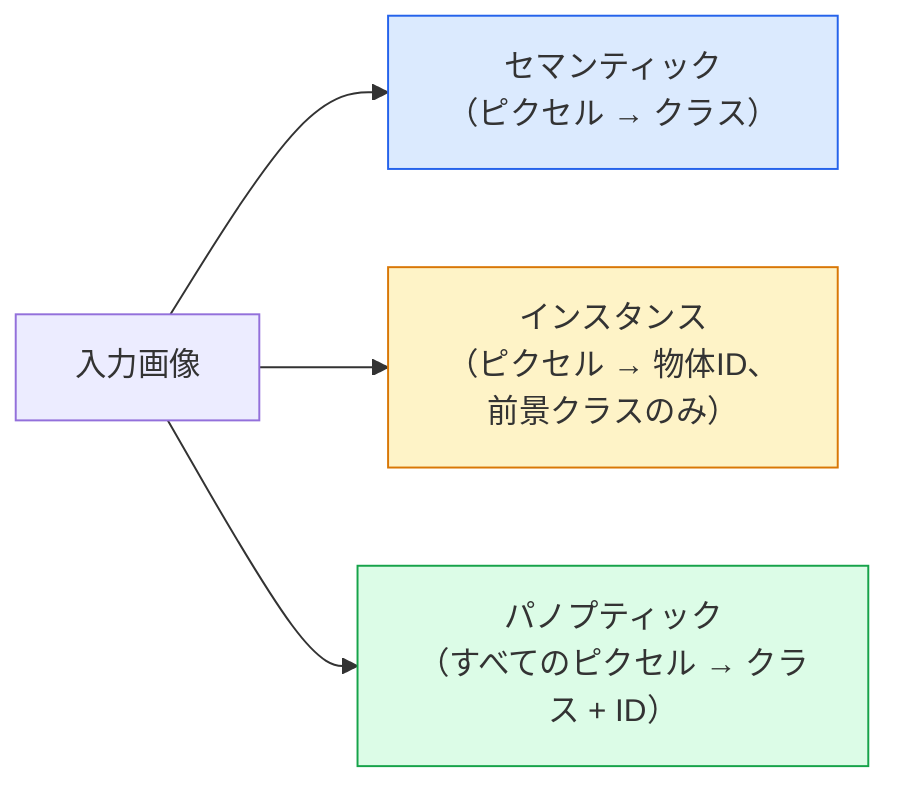
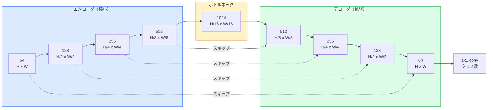

# セマンティックセグメンテーション — U-Net

> セグメンテーションはすべてのピクセルでの分類だ。U-Netはダウンサンプリングエンコーダとアップサンプリングデコーダをペアにし、それらの間にスキップ接続を配線することでこれを機能させる。


## 学習目標

- セマンティック、インスタンス、パノプティックセグメンテーションを区別し、与えられた問題に対して正しいタスクを選ぶ
- エンコーダブロック、ボトルネック、転置畳み込みを持つデコーダ、スキップ接続を持つU-NetをPyTorchでゼロから構築する
- ピクセルごとの交差エントロピー、Dice損失、医療および産業用セグメンテーションの現在のデフォルトである組み合わせ損失を実装する
- クラスごとのIoUとDiceメトリクスを読み、悪いスコアが小さな物体の再現率、境界精度、クラス不均衡から来るかどうかを診断する

## 問題の概要

分類は画像ごとに1つのラベルを出力する。検出は画像ごとに少数のボックスを出力する。セグメンテーションはピクセルごとに1つのラベルを出力する。`H × W`サイズの入力に対して、出力は`H × W`のテンソル（セマンティック）または`H × W × N_instances`（インスタンス）だ。1画像あたり数百万の予測であり、1つではない。

セグメンテーションの構造は、それがほぼすべての密な予測ビジョン製品を動かす理由だ：医療画像（腫瘍マスク）、自動運転（道路、車線、障害物）、衛星（建物のフットプリント、作物の境界）、ドキュメント解析（レイアウトゾーン）、ロボット工学（把持可能な領域）。これらのタスクはいずれも物体の周りにボックスを置くだけでは解決できない；正確なシルエットが必要だ。

セグメンテーションのアーキテクチャ上の問題は述べるのは単純だが解くのは単純ではない：ネットワークが画像のグローバルコンテキスト（これはどんな種類のシーンか）とローカルなピクセル詳細（ちょうどどのピクセルが道路対歩道か）を同時に見る必要がある。標準的なCNNはコンテキストを得るために空間的に圧縮し、これにより詳細が失われる。U-Netは両方を得た設計だ。

## 概念の解説

### セマンティック vs インスタンス vs パノプティック



- **セマンティック**は「このピクセルは道路、あのピクセルは車」と言う。隣り合う2台の車は単一のブロブに崩れる。
- **インスタンス**は「このピクセルは車#3、あのピクセルは車#5」と言う。背景のもの（「もの」 = 空、道路、草）は無視する。
- **パノプティック**は両方を統合する：すべてのピクセルがクラスラベルを持ち、すべてのインスタンスが一意のIDを持ち、「もの」も「こと」もセグメンテーションされる。

このレッスンではセマンティックを扱う。次のレッスン（Mask R-CNN）ではインスタンスを扱う。

### U-Netの形状



エンコーダは空間解像度を4回半分にし、チャンネルを2倍にする。デコーダは逆に行う：空間解像度を4回2倍にし、チャンネルを半分にする。スキップ接続は各解像度でエンコーダの特徴とデコーダの特徴を連結する。最後の1x1畳み込みが全解像度で`64 -> num_classes`にマッピングする。

スキップ接続が必要な理由：デコーダはピクセルレベルの予測を出力しようとする時点で、非常に小さな特徴マップしか見ていない。スキップなしではエッジを正確に局所化できない。なぜならその情報がエンコーダで圧縮されて失われているから。スキップ接続はエンコーダが降下途中で計算した高解像度の特徴マップを渡す。

### 転置畳み込み vs バイリニアアップサンプル

デコーダは空間次元を拡大する必要がある。2つの選択肢：

- **転置畳み込み**（`nn.ConvTranspose2d`）——学習可能なアップサンプル。歴史的なU-Netのデフォルト。ストライドとカーネルサイズが均等に割り切れない場合、チェッカーボードアーティファクトを生じる可能性がある。
- **バイリニアアップサンプル + 3x3畳み込み**——滑らかなアップサンプルに続く畳み込み。アーティファクトが少なく、パラメータが少なく、現在のモダンなデフォルト。

両方が現場で使われる。最初のU-Netにはバイリニアの方が安全だ。

### ピクセルグリッドでの交差エントロピー

Cクラスのセマンティックセグメンテーションでは、モデル出力は`(N, C, H, W)`だ。ターゲットは整数クラスIDを持つ`(N, H, W)`だ。交差エントロピーは分類のケースと同一で、すべての空間位置で適用される：

```
損失 = (n, h, w) にわたる平均 -log( softmax(logits[n, :, h, w])[target[n, h, w]] )
```

PyTorchの`F.cross_entropy`はこの形状をネイティブに処理する。変形は不要。

### Dice損失となぜそれが必要か

交差エントロピーはすべてのピクセルを等しく扱う。これは1つのクラスがフレームを支配する場合（医療画像：99%背景、1%腫瘍）は間違いだ。ネットワークはどこでも背景を予測することで99%の精度を出して、まだ役に立たない。

Dice損失は予測マスクと真のマスクの重複を直接最適化することでこれを解決する：

```
Dice(p, y) = 2 * sum(p * y) / (sum(p) + sum(y) + epsilon)
Dice_loss = 1 - Dice
```

ここで`p`はクラスのsigmoid/softmax確率マップ、`y`は二値の真のマスク。重複が完璧な場合のみ損失はゼロ。比率ベースなのでクラス不均衡は無関係だ。

実際には**組み合わせ損失**を使う：

```
L = L_cross_entropy + lambda * L_dice       (lambda ~ 1)
```

交差エントロピーは学習初期に安定した勾配を提供し；Diceは実際のマスク形状の一致に学習の後半を集中させる。この組み合わせは医療画像のデフォルトであり、クラス不均衡のあるデータセットで打ち負かすのが難しい。

### 評価メトリクス

- **ピクセル精度** — 正しく予測されたピクセルの割合。安価。分類での精度と同じ理由で不均衡データで壊れる。
- **クラスごとのIoU** — 各クラスのマスクに対するIntersection over Union；クラスにわたる平均 = mIoU。
- **Dice（ピクセルのF1）** — IoUに似ている；`Dice = 2 * IoU / (1 + IoU)`。医療画像コミュニティはDiceを好み、運転コミュニティはIoUを好む；単調に関連している。
- **境界F1** — 予測された境界がどれだけ真の境界に近いかを測定し、わずかなシフトでもペナルティを課す。半導体検査のような高精度タスクに重要。

mIoUだけでなくクラスごとのIoUを報告する。平均IoUは9つが85%のとき15%のクラスを隠す。

### 入力解像度のトレードオフ

U-Netのエンコーダは解像度を4回半分にするため、入力は16で割り切れなければならない。医療画像はしばしば512x512または1024x1024だ。自動運転のクロップは2048x1024だ。U-Netのメモリコストは`H * W * C_max`でスケールし、1024x1024で1024ボトルネックチャンネルではフォワードパスだけで何GBものVRAMを使う。

2つの標準的な回避策：
1. 入力をタイル化する——オーバーラップを持つ256x256タイルを処理してステッチする。
2. ボトルネックを、空間解像度をより高く保ちながら受容野を広げる拡張畳み込みに置き換える（DeepLabファミリー）。

最初のモデルには、64チャンネルベースのU-Netで256x256入力が8GB VRAMで快適に学習できる。

## 実装する

### ステップ1：エンコーダブロック

バッチ正規化とReLUを持つ2つの3x3畳み込み。最初の畳み込みがチャンネル数を変え；2番目がそれを保持する。

```python
import torch
import torch.nn as nn
import torch.nn.functional as F

class DoubleConv(nn.Module):
    def __init__(self, in_c, out_c):
        super().__init__()
        self.net = nn.Sequential(
            nn.Conv2d(in_c, out_c, kernel_size=3, padding=1, bias=False),
            nn.BatchNorm2d(out_c),
            nn.ReLU(inplace=True),
            nn.Conv2d(out_c, out_c, kernel_size=3, padding=1, bias=False),
            nn.BatchNorm2d(out_c),
            nn.ReLU(inplace=True),
        )

    def forward(self, x):
        return self.net(x)
```

このブロックは全体で再利用される。BNのβがバイアスを処理するため`bias=False`。

### ステップ2：ダウンとアップブロック

```python
class Down(nn.Module):
    def __init__(self, in_c, out_c):
        super().__init__()
        self.net = nn.Sequential(
            nn.MaxPool2d(2),
            DoubleConv(in_c, out_c),
        )

    def forward(self, x):
        return self.net(x)


class Up(nn.Module):
    def __init__(self, in_c, out_c):
        super().__init__()
        self.up = nn.Upsample(scale_factor=2, mode="bilinear", align_corners=False)
        self.conv = DoubleConv(in_c, out_c)

    def forward(self, x, skip):
        x = self.up(x)
        if x.shape[-2:] != skip.shape[-2:]:
            x = F.interpolate(x, size=skip.shape[-2:], mode="bilinear", align_corners=False)
        x = torch.cat([skip, x], dim=1)
        return self.conv(x)
```

空間のみの形状チェック（`shape[-2:]`）は16で割り切れない次元の入力を処理する；安全な`F.interpolate`が連結の前にテンソルを揃える。完全な形状を比較するとチャンネル数の違いにも反応し、これは静かな補間ではなく大きなエラーとして扱われるべきだ。

### ステップ3：U-Net

```python
class UNet(nn.Module):
    def __init__(self, in_channels=3, num_classes=2, base=64):
        super().__init__()
        self.inc = DoubleConv(in_channels, base)
        self.d1 = Down(base, base * 2)
        self.d2 = Down(base * 2, base * 4)
        self.d3 = Down(base * 4, base * 8)
        self.d4 = Down(base * 8, base * 16)
        self.u1 = Up(base * 16 + base * 8, base * 8)
        self.u2 = Up(base * 8 + base * 4, base * 4)
        self.u3 = Up(base * 4 + base * 2, base * 2)
        self.u4 = Up(base * 2 + base, base)
        self.outc = nn.Conv2d(base, num_classes, kernel_size=1)

    def forward(self, x):
        x1 = self.inc(x)
        x2 = self.d1(x1)
        x3 = self.d2(x2)
        x4 = self.d3(x3)
        x5 = self.d4(x4)
        x = self.u1(x5, x4)
        x = self.u2(x, x3)
        x = self.u3(x, x2)
        x = self.u4(x, x1)
        return self.outc(x)

net = UNet(in_channels=3, num_classes=2, base=32)
x = torch.randn(1, 3, 256, 256)
print(f"output: {net(x).shape}")
print(f"params: {sum(p.numel() for p in net.parameters()):,}")
```

出力形状`(1, 2, 256, 256)` — 入力と同じ空間サイズ、`num_classes`チャンネル。`base=32`で約770万パラメータ。

### ステップ4：損失

```python
def dice_loss(logits, targets, num_classes, eps=1e-6):
    probs = F.softmax(logits, dim=1)
    targets_one_hot = F.one_hot(targets, num_classes).permute(0, 3, 1, 2).float()
    dims = (0, 2, 3)
    intersection = (probs * targets_one_hot).sum(dim=dims)
    denom = probs.sum(dim=dims) + targets_one_hot.sum(dim=dims)
    dice = (2 * intersection + eps) / (denom + eps)
    return 1 - dice.mean()


def combined_loss(logits, targets, num_classes, lam=1.0):
    ce = F.cross_entropy(logits, targets)
    dc = dice_loss(logits, targets, num_classes)
    return ce + lam * dc, {"ce": ce.item(), "dice": dc.item()}
```

Diceはクラスごとに計算してから平均する（マクロDice）。`eps`はバッチに存在しないクラスでのゼロ除算を防ぐ。

### ステップ5：IoUメトリクス

```python
@torch.no_grad()
def iou_per_class(logits, targets, num_classes):
    preds = logits.argmax(dim=1)
    ious = torch.zeros(num_classes)
    for c in range(num_classes):
        pred_c = (preds == c)
        true_c = (targets == c)
        inter = (pred_c & true_c).sum().float()
        union = (pred_c | true_c).sum().float()
        ious[c] = (inter / union) if union > 0 else torch.tensor(float("nan"))
    return ious
```

長さCのベクトルを返す。`nan`はバッチに存在しないクラスを示す——mIoUを計算するときはそれらを平均しないこと。

### ステップ6：エンドツーエンド検証用の合成データセット

ネットワークがピクセルカラーではなく形状を学習しなければならないよう、色付き背景に形状を生成する。

```python
import numpy as np
from torch.utils.data import Dataset, DataLoader

def synthetic_segmentation(num_samples=200, size=64, seed=0):
    rng = np.random.default_rng(seed)
    images = np.zeros((num_samples, size, size, 3), dtype=np.float32)
    masks = np.zeros((num_samples, size, size), dtype=np.int64)
    for i in range(num_samples):
        bg = rng.uniform(0, 1, (3,))
        images[i] = bg
        masks[i] = 0
        num_shapes = rng.integers(1, 4)
        for _ in range(num_shapes):
            cls = int(rng.integers(1, 3))
            color = rng.uniform(0, 1, (3,))
            cx, cy = rng.integers(10, size - 10, size=2)
            r = int(rng.integers(4, 12))
            yy, xx = np.meshgrid(np.arange(size), np.arange(size), indexing="ij")
            if cls == 1:
                mask = (xx - cx) ** 2 + (yy - cy) ** 2 < r ** 2
            else:
                mask = (np.abs(xx - cx) < r) & (np.abs(yy - cy) < r)
            images[i][mask] = color
            masks[i][mask] = cls
        images[i] += rng.normal(0, 0.02, images[i].shape)
        images[i] = np.clip(images[i], 0, 1)
    return images, masks


class SegDataset(Dataset):
    def __init__(self, images, masks):
        self.images = images
        self.masks = masks

    def __len__(self):
        return len(self.images)

    def __getitem__(self, i):
        img = torch.from_numpy(self.images[i]).permute(2, 0, 1).float()
        mask = torch.from_numpy(self.masks[i]).long()
        return img, mask
```

3クラス：背景（0）、円（1）、正方形（2）。ネットワークは形状を区別することを学習しなければならない。

### ステップ7：学習ループ

```python
def train_one_epoch(model, loader, optimizer, device, num_classes):
    model.train()
    loss_sum, total = 0.0, 0
    iou_sum = torch.zeros(num_classes)
    for x, y in loader:
        x, y = x.to(device), y.to(device)
        logits = model(x)
        loss, _ = combined_loss(logits, y, num_classes)
        optimizer.zero_grad()
        loss.backward()
        optimizer.step()
        loss_sum += loss.item() * x.size(0)
        total += x.size(0)
        iou_sum += iou_per_class(logits, y, num_classes).nan_to_num(0)
    return loss_sum / total, iou_sum / len(loader)
```

合成データセットでこれを10〜30エポック実行すると、形状クラスでmIoUが0.9を超えるのを見ることができる。`nan_to_num(0)`はバッチにないクラスをゼロとして扱うことに注意；正確なクラスごとのIoUには、ここで平均するのではなく、存在でマスクして評価時にバッチにわたって`torch.nanmean`を使う。

## 使ってみる

本番環境では、`segmentation_models_pytorch`（"smp"）があらゆるtorchvisionまたはtimmバックボーンを持つすべての標準セグメンテーションアーキテクチャをラップしている。3行：

```python
import segmentation_models_pytorch as smp

model = smp.Unet(
    encoder_name="resnet34",
    encoder_weights="imagenet",
    in_channels=3,
    classes=3,
)
```

実際の作業でも知っておく価値のあるもの：
- **DeepLabV3+** は最大プールベースのダウンサンプリングを拡張畳み込みに置き換え、ボトルネックが解像度を高く保つ；衛星と運転データで境界が速い。
- **SegFormer** は畳み込みエンコーダを階層トランスフォーマーに置き換える；多くのベンチマークで現在のSOTA。
- **Mask2Former** / **OneFormer** はセマンティック、インスタンス、パノプティックセグメンテーションを単一のアーキテクチャに統合する。

3つはすべて同じデータローダーで`smp`または`transformers`のドロップイン置き換えだ。

## 成果物を出す

このレッスンでは以下を生成する：

- `outputs/prompt-segmentation-task-picker.md` — 与えられたタスクのためにセマンティック、インスタンス、パノプティックセグメンテーションのどれかを選び、アーキテクチャを名前で提示するプロンプト。
- `outputs/skill-segmentation-mask-inspector.md` — クラス分布、予測マスク統計、過小予測または境界がぼやけているクラスを報告するスキル。

## 演習

1. **(簡単)** 二値セグメンテーションタスク（前景 vs 背景）のために`bce_dice_loss`を実装する。前景がピクセルの5%の場合、組み合わせ損失がBCE単独より速く収束することを合成2クラスデータセットで確認する。
2. **(中級)** `nn.Upsample + conv`のアップブロックを`nn.ConvTranspose2d`のアップブロックに置き換える。両方を合成データセットで学習し、mIoUを比較する。転置畳み込みバージョンでチェッカーボードアーティファクトが現れる場所を観察する。
3. **(難)** 実際のセグメンテーションデータセット（Oxford-IIIT Pets、Cityscapes miniスプリット、または医療サブセット）を使い、`smp.Unet`リファレンスの2 IoUポイント以内までU-Netを学習する。クラスごとのIoUを報告し、損失にDiceを追加することで最も恩恵を受けるクラスを特定する。

## キーワード

| 用語 | よく言われること | 実際の意味 |
|------|----------------|-----------|
| セマンティックセグメンテーション | 「すべてのピクセルにラベルを付ける」 | Cクラスへのピクセルごとの分類；同じクラスのインスタンスが統合される |
| インスタンスセグメンテーション | 「すべての物体にラベルを付ける」 | 同じクラスの異なるインスタンスを分離する；前景のみ |
| パノプティックセグメンテーション | 「セマンティック + インスタンス」 | すべてのピクセルがクラスを持ち、すべての「こと」インスタンスが一意のIDも持つ |
| スキップ接続 | 「U-Netのブリッジ」 | エンコーダ特徴を一致する解像度のデコーダ特徴に連結；高周波の詳細を保持 |
| 転置畳み込み | 「デコンボリューション」 | 学習可能なアップサンプリング；チェッカーボードアーティファクトを生む可能性がある |
| Dice損失 | 「重複損失」 | 1 - 2|A ∩ B| / (|A| + |B|)；マスクの重複を直接最適化し、クラス不均衡にロバスト |
| mIoU | 「平均Intersection over Union」 | クラスにわたるIoUの平均；セグメンテーションのコミュニティ標準メトリクス |
| 境界F1 | 「境界精度」 | 境界ピクセルのみで計算されたF1スコア；精度クリティカルなタスクに重要 |

## 参考資料

- [U-Net: Convolutional Networks for Biomedical Image Segmentation (Ronneberger et al., 2015)](https://arxiv.org/abs/1505.04597) — オリジナル論文；全員がコピーする図は2ページにある
- [Fully Convolutional Networks (Long et al., 2015)](https://arxiv.org/abs/1411.4038) — セグメンテーションを初めてエンドツーエンドの畳み込み問題にした論文
- [segmentation_models_pytorch](https://github.com/qubvel/segmentation_models.pytorch) — 本番セグメンテーションのリファレンス；すべての標準アーキテクチャとすべての標準損失
- [Lessons learned from training SOTA segmentation (kaggle.com competitions)](https://www.kaggle.com/code/iafoss/carvana-unet-pytorch) — 実際のデータでTTA、疑似ラベリング、クラス重みが重要な理由のウォークスルー
