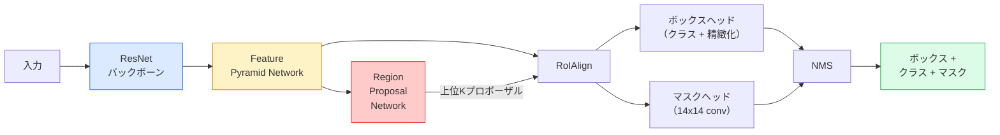

# インスタンスセグメンテーション — Mask R-CNN

> Faster R-CNN検出器に小さなマスクブランチを追加するとインスタンスセグメンテーションになる。難しいのはRoIAlignで、見た目よりも複雑だ。


## 学習目標

- Mask R-CNNのアーキテクチャをエンドツーエンドで追う：バックボーン、FPN、RPN、RoIAlign、ボックスヘッド、マスクヘッド
- RoIAlignをゼロから実装し、RoIPoolがもはや使われない理由を説明する
- torchvisionの`maskrcnn_resnet50_fpn_v2`学習済みモデルをプロダクション品質のインスタンスマスクに使い、その出力フォーマットを正しく読む
- ボックスヘッドとマスクヘッドを置き換えてバックボーンを凍結することで、小さなカスタムデータセットでMask R-CNNをファインチューニングする

## 問題の概要

セマンティックセグメンテーションはクラスごとに1つのマスクを提供する。インスタンスセグメンテーションは、2つの物体が同じクラスを共有していても、物体ごとに1つのマスクを提供する。個体を数えること、フレームをまたいで追跡すること、物を測定すること（壁の各レンガのバウンディングボックス、顕微鏡画像の各細胞）はすべてインスタンスセグメンテーションを必要とする。

Mask R-CNN（He et al., 2017）はインスタンスセグメンテーションを検出プラスマスクとして再フレームすることでこれを解決した。その設計はとても洗練されていたため、その後5年間でほぼすべてのインスタンスセグメンテーション論文がMask R-CNNのバリエーションとなり、torchvisionの実装は今でも小中規模データセットのプロダクションデフォルトだ。

難しいエンジニアリング問題はサンプリングだ：コーナーがピクセル境界に揃わないプロポーザルボックスから固定サイズの特徴領域をどのようにクロップするか？これを誤るとあらゆる場所でmAPが数十ポイント落ちる。RoIAlignがその答えだ。

## 概念の解説

### アーキテクチャ



理解すべき5つのパーツ：

1. **バックボーン** — ImageNetで学習したResNet-50またはResNet-101。ストライド4、8、16、32の特徴マップ階層を生成する。
2. **FPN（Feature Pyramid Network）** — すべてのレベルに意味豊かな特徴のCチャンネルを与えるトップダウン + ラテラル接続。検出は物体サイズに合致するFPNレベルを参照する。
3. **RPN（Region Proposal Network）** — すべてのアンカー位置で「ここに物体はあるか？」と「ボックスをどのように精緻化するか？」を予測する小さなconvヘッド。画像ごとに約1,000のプロポーザルを生成する。
4. **RoIAlign** — 任意のFPNレベルの任意のボックスから固定サイズ（例：7x7）の特徴パッチをサンプリングする。バイリニアサンプリング、量子化なし。
5. **ヘッド** — ボックスを精緻化してクラスを選ぶ2層ボックスヘッド、プラス各プロポーザルの`28x28`バイナリマスクを出力する小さなconvヘッド。

### RoIPool ではなくRoIAlignを使う理由

オリジナルのFast R-CNNはRoIPoolを使っていた。RoIPoolはプロポーザルボックスをグリッドに分割し、各セルの最大特徴を取り、すべての座標を整数に丸める。その丸めは特徴マップと入力ピクセル座標を最大1特徴マップピクセル分ずらす——224x224の画像では小さいが、特徴マップがストライド32の場合は壊滅的だ。

```
RoIPool:
  ボックス (34.7, 51.3, 98.2, 142.9)
  丸め -> (34, 51, 98, 142)
  グリッド分割 -> 各セル境界を丸め
  ずれが各ステップで蓄積

RoIAlign:
  ボックス (34.7, 51.3, 98.2, 142.9)
  バイリニア補間で正確な浮動小数点座標でサンプリング
  どこでも丸めなし
```

RoIAlignはCOCOのマスクAPを無料で3〜4ポイント向上させる。局所化にこだわるすべての検出器——YOLOv7 seg、RT-DETR、Mask2Formerも——今ではこれを使っている。

### RPNを1段落で

特徴マップのすべての位置に、異なるサイズと形状のKアンカーボックスを置く。各アンカーの物体性スコアとアンカーをより良くフィットするボックスに変換する回帰オフセットを予測する。スコアで上位約1,000のボックスを保持し、IoU 0.7でNMSを適用し、生存者をヘッドに渡す。RPNは自身のミニ損失で学習される——レッスン6のYOLO損失と同じ構造で、2クラス（物体あり / 物体なし）だ。

### マスクヘッド

各プロポーザルについて（RoIAlignの後）マスクヘッドは小さなFCNだ：4つの3x3 conv、2倍のデコンボリューション、`28x28`解像度で`num_classes`出力チャンネルを生成する最後の1x1 conv。予測されたクラスに対応するチャンネルのみが保持され；他は無視される。これによりマスク予測と分類が分離される。

28x28マスクをプロポーザルの元のピクセルサイズにアップサンプルして最終的なバイナリマスクを生成する。

### 損失

Mask R-CNNには合算された4つの損失がある：

```
L = L_rpn_cls + L_rpn_box + L_box_cls + L_box_reg + L_mask
```

- `L_rpn_cls`、`L_rpn_box` — RPNプロポーザルの物体性 + ボックス回帰。
- `L_box_cls` — ヘッドの分類器での（C+1）クラス（背景を含む）に対する交差エントロピー。
- `L_box_reg` — ヘッドのボックス精緻化に対するsmooth L1。
- `L_mask` — 28x28マスク出力に対するピクセルごとのバイナリ交差エントロピー。

各損失はデフォルトの重みを持つ；torchvisionの実装はそれらをコンストラクタ引数として公開している。

### 出力フォーマット

`torchvision.models.detection.maskrcnn_resnet50_fpn_v2`は画像ごとに1つのdictのリストを返す：

```
{
    "boxes":  (N, 4) (x1, y1, x2, y2)ピクセル座標,
    "labels": (N,) クラスID、0 = 背景なのでインデックスは1ベース,
    "scores": (N,) 信頼度スコア,
    "masks":  (N, 1, H, W) [0, 1]の浮動小数点マスク — バイナリには0.5で閾値処理,
}
```

マスクはすでに全画像解像度だ。28x28ヘッドの出力は内部でアップサンプルされている。

## 実装する

### ステップ1：RoIAlignをゼロから

これはMask R-CNNの中でも、散文よりコードとして理解する方が簡単なコンポーネントだ。

```python
import torch
import torch.nn.functional as F

def roi_align_single(feature, box, output_size=7, spatial_scale=1 / 16.0):
    """
    feature: (C, H, W) 単一画像の特徴マップ
    box: (x1, y1, x2, y2) 元画像のピクセル座標
    output_size: 出力グリッドの辺（ボックスヘッドは7、マスクヘッドは14）
    spatial_scale: 特徴マップのストライドの逆数
    """
    C, H, W = feature.shape
    x1, y1, x2, y2 = [c * spatial_scale - 0.5 for c in box]
    bin_w = (x2 - x1) / output_size
    bin_h = (y2 - y1) / output_size

    grid_y = torch.linspace(y1 + bin_h / 2, y2 - bin_h / 2, output_size)
    grid_x = torch.linspace(x1 + bin_w / 2, x2 - bin_w / 2, output_size)
    yy, xx = torch.meshgrid(grid_y, grid_x, indexing="ij")

    gx = 2 * (xx + 0.5) / W - 1
    gy = 2 * (yy + 0.5) / H - 1
    grid = torch.stack([gx, gy], dim=-1).unsqueeze(0)
    sampled = F.grid_sample(feature.unsqueeze(0), grid, mode="bilinear",
                            align_corners=False)
    return sampled.squeeze(0)
```

すべての数値がバイリニアサンプリングされた位置にある。丸めなし、量子化なし、ドロップされた勾配なし。

### ステップ2：torchvisionのRoIAlignと比較する

```python
from torchvision.ops import roi_align

feature = torch.randn(1, 16, 50, 50)
boxes = torch.tensor([[0, 10, 20, 100, 90]], dtype=torch.float32)  # (batch_idx, x1, y1, x2, y2)

ours = roi_align_single(feature[0], boxes[0, 1:].tolist(), output_size=7, spatial_scale=1/4)
theirs = roi_align(feature, boxes, output_size=(7, 7), spatial_scale=1/4, sampling_ratio=1, aligned=True)[0]

print(f"shape ours:   {tuple(ours.shape)}")
print(f"shape theirs: {tuple(theirs.shape)}")
print(f"max|diff|:    {(ours - theirs).abs().max().item():.3e}")
```

`sampling_ratio=1`と`aligned=True`で、2つは`1e-5`以内で一致する。

### ステップ3：学習済みMask R-CNNを読み込む

```python
import torch
from torchvision.models.detection import maskrcnn_resnet50_fpn_v2, MaskRCNN_ResNet50_FPN_V2_Weights

model = maskrcnn_resnet50_fpn_v2(weights=MaskRCNN_ResNet50_FPN_V2_Weights.DEFAULT)
model.eval()
print(f"params: {sum(p.numel() for p in model.parameters()):,}")
print(f"classes (including background): {len(model.roi_heads.box_predictor.cls_score.out_features * [0])}")
```

4,600万パラメータ、91クラス（COCO）。最初のクラス（id 0）は背景；モデルが実際に検出するものはすべてid 1から始まる。

### ステップ4：推論を実行する

```python
with torch.no_grad():
    x = torch.randn(3, 400, 600)
    predictions = model([x])
p = predictions[0]
print(f"boxes:  {tuple(p['boxes'].shape)}")
print(f"labels: {tuple(p['labels'].shape)}")
print(f"scores: {tuple(p['scores'].shape)}")
print(f"masks:  {tuple(p['masks'].shape)}")
```

マスクテンソルの形状は`(N, 1, H, W)`だ。物体ごとのバイナリマスクを得るために0.5で閾値処理する：

```python
binary_masks = (p['masks'] > 0.5).squeeze(1)  # (N, H, W) boolean
```

### ステップ5：カスタムクラス数のためにヘッドを交換する

一般的なファインチューニングのレシピ：バックボーン、FPN、RPNを再利用し；2つの分類ヘッドを置き換える。

```python
from torchvision.models.detection.faster_rcnn import FastRCNNPredictor
from torchvision.models.detection.mask_rcnn import MaskRCNNPredictor

def build_custom_maskrcnn(num_classes):
    model = maskrcnn_resnet50_fpn_v2(weights=MaskRCNN_ResNet50_FPN_V2_Weights.DEFAULT)
    in_features = model.roi_heads.box_predictor.cls_score.in_features
    model.roi_heads.box_predictor = FastRCNNPredictor(in_features, num_classes)
    in_features_mask = model.roi_heads.mask_predictor.conv5_mask.in_channels
    hidden_layer = 256
    model.roi_heads.mask_predictor = MaskRCNNPredictor(in_features_mask, hidden_layer, num_classes)
    return model

custom = build_custom_maskrcnn(num_classes=5)
print(f"custom cls_score.out_features: {custom.roi_heads.box_predictor.cls_score.out_features}")
```

`num_classes`は背景クラスを含まなければならず、4つの物体クラスを持つデータセットは`num_classes=5`を使う。

### ステップ6：学習不要な部分を凍結する

小さなデータセットではバックボーンとFPNを凍結する。RPN物体性 + 回帰と2つのヘッドのみが学習する。

```python
def freeze_backbone_and_fpn(model):
    # torchvisionのMask R-CNNはFPNを`model.backbone`内（`model.backbone.fpn`として）にパックするため、
    # `model.backbone.parameters()`のイテレーションはResNet特徴層とFPNラテラル/出力convの両方をカバーする。
    for p in model.backbone.parameters():
        p.requires_grad = False
    return model

custom = freeze_backbone_and_fpn(custom)
trainable = sum(p.numel() for p in custom.parameters() if p.requires_grad)
print(f"trainable after freeze: {trainable:,}")
```

500枚の画像データセットでは、これが収束と過学習の違いだ。

## 使ってみる

torchvisionでのMask R-CNNの完全な学習ループは40行で、タスク間でほとんど変わらない——データセットを交換して実行するだけだ。

```python
def train_step(model, images, targets, optimizer):
    model.train()
    loss_dict = model(images, targets)
    losses = sum(loss for loss in loss_dict.values())
    optimizer.zero_grad()
    losses.backward()
    optimizer.step()
    return {k: v.item() for k, v in loss_dict.items()}
```

`targets`リストはは`boxes`、`labels`、`masks`（`(num_instances, H, W)`バイナリテンソルとして）を持つ画像ごとのdictを持たなければならない。モデルは学習中に4つの損失のdictを返し、eval中は予測のリストを返す；`model.training`でキー付けされる。

`pycocotools`エバリュエータはボックスとマスクの両方でmAP@IoU=0.5:0.95を生成する；ボックスヘッドとマスクヘッドのどちらがボトルネックかを知るために両方の数値が必要だ。

## 成果物を出す

このレッスンでは以下を生成する：

- `outputs/prompt-instance-vs-semantic-router.md` — 3つの質問をしてインスタンス vs セマンティック vs パノプティックを選び、始めるべき正確なモデルを提示するプロンプト。
- `outputs/skill-mask-rcnn-head-swapper.md` — 新しい`num_classes`を与えると任意のtorchvision検出モデルのヘッドを交換する10行のコードを生成するスキル。

## 演習

1. **(簡単)** 100のランダムなボックスでRoIAlignを`torchvision.ops.roi_align`と検証する。最大絶対差を報告する。また、RoIPool（2017年以前の挙動）を実行し、境界近くのボックスで約1〜2特徴マップピクセル分ずれることを示す。
2. **(中級)** 50枚の画像のカスタムデータセット（任意の2クラス：バルーン、魚、穴ぼこ、ロゴ）で`maskrcnn_resnet50_fpn_v2`をファインチューニングする。バックボーンを凍結し、20エポック学習して、マスクAP@0.5を報告する。
3. **(難)** Mask R-CNNのマスクヘッドを28x28の代わりに56x56で予測するように置き換える。変更前後のmAP@IoU=0.75を測定する。利得（または欠如）が予想される境界精度/メモリトレードオフにどのように一致するかを説明する。

## キーワード

| 用語 | よく言われること | 実際の意味 |
|------|----------------|-----------|
| Mask R-CNN | 「検出プラスマスク」 | Faster R-CNN + プロポーザルごとクラスごとの28x28マスクを予測する小さなFCNヘッド |
| FPN | 「特徴ピラミッド」 | すべてのストライドレベルに意味豊かなCチャンネルを与えるトップダウン + ラテラル接続 |
| RPN | 「領域プロポーザー」 | 画像ごとに約1,000の物体/非物体プロポーザルを生成する小さなconvヘッド |
| RoIAlign | 「丸めなしクロップ」 | 任意の浮動小数点座標ボックスから固定サイズの特徴グリッドをバイリニアサンプリング |
| RoIPool | 「2017年以前のクロップ」 | RoIAlignと同じ目的だがボックス座標を丸める；廃止済み |
| マスクAP | 「インスタンスmAP」 | ボックスIoUの代わりにマスクIoUで計算される平均適合率；COCOインスタンスセグメンテーションメトリクス |
| バイナリマスクヘッド | 「クラスごとのマスク」 | 各プロポーザルについてクラスごとに1つのバイナリマスクを予測；予測されたクラスのチャンネルのみが保持される |
| 背景クラス | 「クラス0」 | 「物体なし」のキャッチオールクラス；実際のクラスのインデックスは1から始まる |

## 参考資料

- [Mask R-CNN (He et al., 2017)](https://arxiv.org/abs/1703.06870) — 論文；RoIAlignに関するセクション3が重要な読み物
- [FPN: Feature Pyramid Networks (Lin et al., 2017)](https://arxiv.org/abs/1612.03144) — FPN論文；すべてのモダンな検出器がこれを使う
- [torchvision Mask R-CNN チュートリアル](https://pytorch.org/tutorials/intermediate/torchvision_tutorial.html) — ファインチューニングループのリファレンス
- [Detectron2 モデルズー](https://github.com/facebookresearch/detectron2/blob/main/MODEL_ZOO.md) — ほぼすべての検出・セグメンテーションバリアントの学習済み重みを持つプロダクション実装
