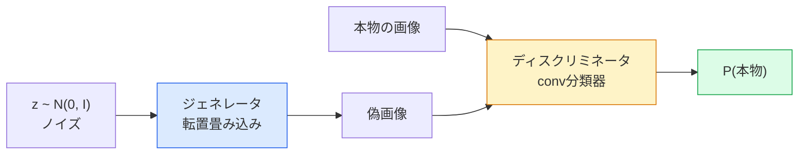
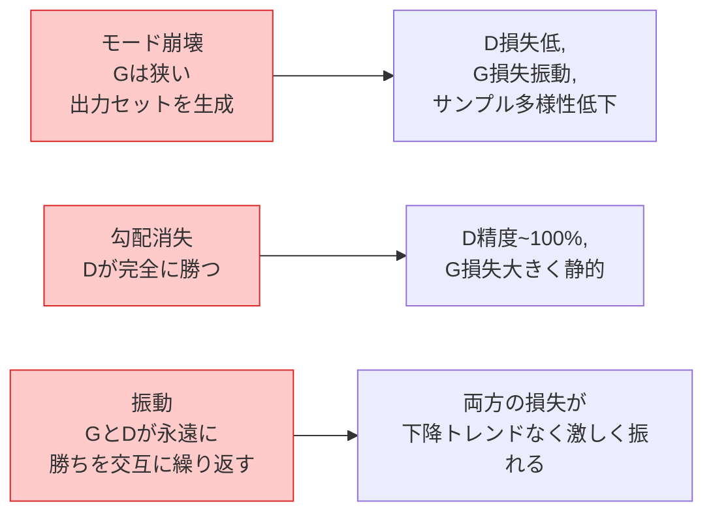

# 画像生成 — GAN

> GANとは2つのニューラルネットワークが固定されたゲームに取り組むものだ。一方が描き、もう一方が批評する。描いたものが批評家をだませるようになるまで、共に上手くなる。


## 学習目標

- ジェネレータとディスクリミネータのミニマックスゲームを説明し、均衡がp_model = p_dataに対応する理由を説明する
- DCGANをPyTorchで実装し、60行以下で一貫した32x32の合成画像を生成する
- 非飽和損失、スペクトル正規化、TTUR（二タイムスケール更新則）の3つの標準的なトリックでGAN学習を安定させる
- 健全な収束とモード崩壊、振動、ディスクリミネータの圧勝を区別する学習曲線を読む

## 問題の概要

分類はネットワークが画像をラベルにマッピングすることを学習する。生成はその問題を逆にする：同じ分布から来たように見える新しい画像をサンプリングする。比較できる「正解」の出力はなく；模倣したい分布があるだけだ。

標準的な損失関数（MSE、交差エントロピー）は「このサンプルは実際の分布から来たか」を測定できない。ピクセルごとのエラーを最小化するとリアルなサンプルではなくぼやけた平均が生成される。ブレークスルーは損失を学習することだった：本物と偽物を区別することが仕事の第2のネットワークを学習し、そのジャッジメントをジェネレータを押し進めるために使う。

GAN（Goodfellow et al., 2014）はそのフレームワークを定義した。2018年までにStyleGANは写真と区別がつかない1024x1024の顔を生成していた。拡散モデルがその後品質と制御可能性でトップの座を奪ったが、拡散モデルを実用的にするすべてのトリック——正規化の選択、潜在空間、特徴損失——は最初にGANで理解された。

## 概念の解説

### 2つのネットワーク



**ジェネレータ** G はノイズのベクトル`z`を取り、画像を出力する。**ディスクリミネータ** D は画像を取り、単一のスカラーを出力する：画像が本物である確率だ。

### ゲーム

GはDをだましたい。Dは正しくありたい。形式的には：

```
min_G max_D  E_x[log D(x)] + E_z[log(1 - D(G(z)))]
```

右から左に読む：Dは本物（`log D(real)`）と偽物（`log (1 - D(fake))`）の画像で精度を最大化している。Gは偽物へのDの精度を最小化しようとしている——`D(G(z))`が高くなることを望む。

Goodfellowはこのミニマックスに`p_G = p_data`、Dがすべての場所で0.5を出力し、生成された分布と実際の分布の間のジェンセン・シャノンダイバージェンスがゼロである大域的均衡があることを証明した。難しいのはそこに到達することだ。

### 非飽和損失

上記の形式は数値的に不安定だ。学習の初期に、すべての偽物に対して`D(G(z))`はゼロに近く、`log(1 - D(G(z)))`はGに対して消滅する勾配を持つ。修正：Gの損失を反転する。

```
L_D = -E_x[log D(x)] - E_z[log(1 - D(G(z)))]
L_G = -E_z[log D(G(z))]                          # 非飽和
```

`D(G(z))`がゼロに近い場合、Gの損失は大きく、その勾配は情報量がある。すべてのモダンなGANはこのバリアントで学習する。

### DCGANアーキテクチャルール

Radford、Metz、Chintala（2015）は何年もの失敗実験を、GAN学習を安定させる5つのルールに蒸留した：

1. プーリングをストライド付きconvに置き換える（両方のネット）。
2. 両方のネットでバッチ正規化を使う。ただしGの出力とDの入力は除く。
3. 深いアーキテクチャで全結合層を取り除く。
4. Gは出力以外のすべての層でReLUを使う（[-1, 1]の出力にtanh）。
5. Dはすべての層でLeakyReLU（negative_slope=0.2）を使う。

すべてのモダンなconv ベースのGAN（StyleGAN、BigGAN、GigaGAN）はこれらのルールから始まり、パーツを1つずつ置き換える。

### 失敗モードとそのシグネチャ



- **モード崩壊**：GはDをだます1枚の画像を見つけてそれだけを生成する。修正：ミニバッチ識別、スペクトル正規化、またはラベル条件付けを追加する。
- **ディスクリミネータの圧勝**：Dが速く強くなりすぎ、Gの勾配が消失する。修正：Dを小さくする、Dの学習率を下げる、または本物ラベルにラベルスムージングを適用する。
- **振動**：2つのネットが均衡に近づくことなく勝ちを交互に繰り返す。修正：TTUR（Dは2〜4倍の係数でGより速く学習する）、またはワッサースタイン損失に切り替える。

### 評価

GANには正解がないので、どうやって機能しているか分かるのか？

- **サンプル検査** — 各エポック終了時に64のサンプルを見る。交渉の余地なし。
- **FID（フレシェインセプション距離）** — 実際と生成されたセットのInception-v3特徴分布間の距離。低い方が良い。コミュニティ標準。
- **インセプションスコア** — 古い、より脆弱；FIDを好む。
- **生成モデルの精度/再現率** — 品質（精度）とカバレッジ（再現率）を別々に測定する。FIDだけより情報量がある。

小さな合成データの実行にはサンプル検査で十分だ。

## 実装する

### ステップ1：ジェネレータ

64次元のノイズを取り、32x32の画像を生成する小さなDCGANジェネレータ。

```python
import torch
import torch.nn as nn

class Generator(nn.Module):
    def __init__(self, z_dim=64, img_channels=3, feat=64):
        super().__init__()
        self.net = nn.Sequential(
            nn.ConvTranspose2d(z_dim, feat * 4, kernel_size=4, stride=1, padding=0, bias=False),
            nn.BatchNorm2d(feat * 4),
            nn.ReLU(inplace=True),
            nn.ConvTranspose2d(feat * 4, feat * 2, kernel_size=4, stride=2, padding=1, bias=False),
            nn.BatchNorm2d(feat * 2),
            nn.ReLU(inplace=True),
            nn.ConvTranspose2d(feat * 2, feat, kernel_size=4, stride=2, padding=1, bias=False),
            nn.BatchNorm2d(feat),
            nn.ReLU(inplace=True),
            nn.ConvTranspose2d(feat, img_channels, kernel_size=4, stride=2, padding=1, bias=False),
            nn.Tanh(),
        )

    def forward(self, z):
        return self.net(z.view(z.size(0), -1, 1, 1))
```

4つの転置conv、それぞれ`kernel_size=4, stride=2, padding=1`でクリーンに空間サイズを2倍にする。tanhによる[-1, 1]の出力活性化。

### ステップ2：ディスクリミネータ

ジェネレータのミラー。LeakyReLU、ストライド付きconv、スカラーロジットで終わる。

```python
class Discriminator(nn.Module):
    def __init__(self, img_channels=3, feat=64):
        super().__init__()
        self.net = nn.Sequential(
            nn.Conv2d(img_channels, feat, kernel_size=4, stride=2, padding=1),
            nn.LeakyReLU(0.2, inplace=True),
            nn.Conv2d(feat, feat * 2, kernel_size=4, stride=2, padding=1, bias=False),
            nn.BatchNorm2d(feat * 2),
            nn.LeakyReLU(0.2, inplace=True),
            nn.Conv2d(feat * 2, feat * 4, kernel_size=4, stride=2, padding=1, bias=False),
            nn.BatchNorm2d(feat * 4),
            nn.LeakyReLU(0.2, inplace=True),
            nn.Conv2d(feat * 4, 1, kernel_size=4, stride=1, padding=0),
        )

    def forward(self, x):
        return self.net(x).view(-1)
```

最後のconvが`4x4`の特徴マップを`1x1`に縮小する。出力は画像ごとの単一スカラー；損失計算時のみsigmoidを適用する。

### ステップ3：学習ステップ

交互に：各バッチでDを1回更新し、次にGを1回更新する。

```python
import torch.nn.functional as F

def train_step(G, D, real, z, opt_g, opt_d, device):
    real = real.to(device)
    bs = real.size(0)

    # D ステップ
    opt_d.zero_grad()
    d_real = D(real)
    d_fake = D(G(z).detach())
    loss_d = (F.binary_cross_entropy_with_logits(d_real, torch.ones_like(d_real))
              + F.binary_cross_entropy_with_logits(d_fake, torch.zeros_like(d_fake)))
    loss_d.backward()
    opt_d.step()

    # G ステップ
    opt_g.zero_grad()
    d_fake = D(G(z))
    loss_g = F.binary_cross_entropy_with_logits(d_fake, torch.ones_like(d_fake))
    loss_g.backward()
    opt_g.step()

    return loss_d.item(), loss_g.item()
```

DステップでのG(z).detach()は重要だ：Dの更新中にGに勾配が流れてほしくない。これを忘れるのは典型的な初心者のバグだ。

### ステップ4：合成形状での完全な学習ループ

```python
from torch.utils.data import DataLoader, TensorDataset
import numpy as np

def synthetic_images(num=2000, size=32, seed=0):
    rng = np.random.default_rng(seed)
    imgs = np.zeros((num, 3, size, size), dtype=np.float32) - 1.0
    for i in range(num):
        r = rng.uniform(6, 12)
        cx, cy = rng.uniform(r, size - r, size=2)
        yy, xx = np.meshgrid(np.arange(size), np.arange(size), indexing="ij")
        mask = (xx - cx) ** 2 + (yy - cy) ** 2 < r ** 2
        color = rng.uniform(-0.5, 1.0, size=3)
        for c in range(3):
            imgs[i, c][mask] = color[c]
    return torch.from_numpy(imgs)

device = "cuda" if torch.cuda.is_available() else "cpu"
data = synthetic_images()
loader = DataLoader(TensorDataset(data), batch_size=64, shuffle=True)

G = Generator(z_dim=64, img_channels=3, feat=32).to(device)
D = Discriminator(img_channels=3, feat=32).to(device)
opt_g = torch.optim.Adam(G.parameters(), lr=2e-4, betas=(0.5, 0.999))
opt_d = torch.optim.Adam(D.parameters(), lr=2e-4, betas=(0.5, 0.999))

for epoch in range(10):
    for (batch,) in loader:
        z = torch.randn(batch.size(0), 64, device=device)
        ld, lg = train_step(G, D, batch, z, opt_g, opt_d, device)
    print(f"epoch {epoch}  D {ld:.3f}  G {lg:.3f}")
```

`Adam(lr=2e-4, betas=(0.5, 0.999))`はDCGANのデフォルトだ——低いbeta1は対抗ゲームをモメンタム項が安定させすぎないようにする。

### ステップ5：サンプリング

```python
@torch.no_grad()
def sample(G, n=16, z_dim=64, device="cpu"):
    G.eval()
    z = torch.randn(n, z_dim, device=device)
    imgs = G(z)
    imgs = (imgs + 1) / 2
    return imgs.clamp(0, 1)
```

サンプリング前に必ずevalモードに切り替える。DCGANではバッチ統計の代わりにバッチ正規化のrunning statsが使われるため重要だ。

### ステップ6：スペクトル正規化

ディスクリミネータのBNのドロップイン代替で、ネットワークが1-リプシッツであることを保証する。ほとんどの「Dが強すぎる」失敗を修正する。

```python
from torch.nn.utils import spectral_norm

def build_sn_discriminator(img_channels=3, feat=64):
    return nn.Sequential(
        spectral_norm(nn.Conv2d(img_channels, feat, 4, 2, 1)),
        nn.LeakyReLU(0.2, inplace=True),
        spectral_norm(nn.Conv2d(feat, feat * 2, 4, 2, 1)),
        nn.LeakyReLU(0.2, inplace=True),
        spectral_norm(nn.Conv2d(feat * 2, feat * 4, 4, 2, 1)),
        nn.LeakyReLU(0.2, inplace=True),
        spectral_norm(nn.Conv2d(feat * 4, 1, 4, 1, 0)),
    )
```

`Discriminator`を`build_sn_discriminator()`に交換すると、多くの場合TTURのトリックが必要なくなる。スペクトル正規化は適用できる最も簡単な単一のロバストネスアップグレードだ。

## 使ってみる

本格的な生成には、学習済み重みを使うか拡散モデルに切り替える。2つの標準的なライブラリ：

- `torch_fidelity`はカスタムの評価コードを書かずにFID / ISをジェネレータに対して計算する。
- `pytorch-gan-zoo`（レガシー）と`StudioGAN`はDCGAN、WGAN-GP、SN-GAN、StyleGAN、BigGANのテスト済み実装を提供する。

2026年では、GANはまだ最良の選択だ：リアルタイム画像生成（レイテンシ<10 ms）、スタイル転送、正確な制御を持つ画像間変換（Pix2Pix、CycleGAN）。フォトリアリズムとテキスト条件付けでは拡散モデルが勝る。

## 成果物を出す

このレッスンでは以下を生成する：

- `outputs/prompt-gan-training-triage.md` — 学習曲線の説明を読み、失敗モード（モード崩壊、D勝利、振動）と単一の推奨修正を選ぶプロンプト。
- `outputs/skill-dcgan-scaffold.md` — `z_dim`、ターゲットの`image_size`、`num_channels`からDCGANスキャフォールドを書くスキル。学習ループとサンプルセーバーを含む。

## 演習

1. **(簡単)** 合成円データセットで上記のDCGANを学習し、各エポック終了時に16のサンプルのグリッドを保存する。何エポック目に生成された円が明確に円形になるか？
2. **(中級)** ディスクリミネータのバッチ正規化をスペクトル正規化に置き換える。両方のバージョンを並行して学習する。どちらが速く収束するか？3つのシードにわたって低い分散を持つのはどちらか？
3. **(難)** 条件付きDCGANを実装する：クラスラベルをGとDの両方に供給する（GではノイズにOne-hotを連結し、DではクラスEmbeddingチャンネルを連結する）。レッスン7の合成「円 vs 正方形」データセットで学習し、特定のラベルでサンプリングすることでクラス条件付けが機能することを示す。

## キーワード

| 用語 | よく言われること | 実際の意味 |
|------|----------------|-----------|
| ジェネレータ（G） | 「物を描くネット」 | ノイズを画像にマッピング；ディスクリミネータをだます訓練をされる |
| ディスクリミネータ（D） | 「批評家」 | バイナリ分類器；本物と生成画像を区別する訓練をされる |
| ミニマックス | 「ゲーム」 | Gに対してmin、Dに対してmax；均衡はp_G = p_data |
| 非飽和損失 | 「数値的に健全なバージョン」 | Gの損失は学習初期の勾配消失を避けるためlog(1 - D(G(z)))の代わりに-log(D(G(z))) |
| モード崩壊 | 「ジェネレータが1つのものを作る」 | Gはデータ分布の小さなサブセットのみを生成；SN、ミニバッチ識別、または大きなバッチで修正 |
| TTUR | 「2つの学習率」 | DはGより速く（通常2〜4倍の係数で）学習；学習を安定させる |
| スペクトル正規化 | 「1-リプシッツ層」 | 各層のリプシッツ定数を制限する重み正規化；Dが任意に急峻になるのを防ぐ |
| FID | 「フレシェインセプション距離」 | 実際と生成されたセットのInception-v3特徴分布間の距離；標準的な評価メトリクス |

## 参考資料

- [Generative Adversarial Networks (Goodfellow et al., 2014)](https://arxiv.org/abs/1406.2661) — すべてを始めた論文
- [DCGAN (Radford, Metz, Chintala, 2015)](https://arxiv.org/abs/1511.06434) — GANを学習可能にしたアーキテクチャルール
- [Spectral Normalization for GANs (Miyato et al., 2018)](https://arxiv.org/abs/1802.05957) — 最も有用な安定化トリック
- [StyleGAN3 (Karras et al., 2021)](https://arxiv.org/abs/2106.12423) — SOTA GAN；過去10年のすべてのトリックのグレイテストヒットアルバムのようなもの
