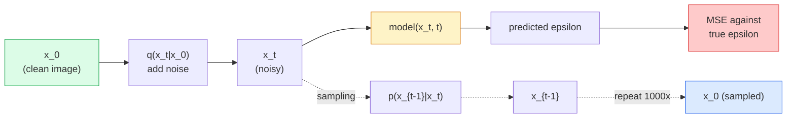

# 画像生成 — 拡散モデル

> 拡散モデルはノイズを除去することを学習する。ノイズだらけの画像から少しだけノイズを取り除く訓練を行い、それを千回繰り返すと画像生成器が完成する。


## 学習目標

- 順方向ノイズ付加プロセス `x_0 -> x_1 -> ... -> x_T` を導出し、任意の t に対して閉形式の `q(x_t | x_0)` が成り立つ理由を説明する
- 各ステップで加えられたノイズを回帰するDDPMスタイルの訓練目標と、純粋なノイズから画像へと逆方向に辿るサンプラーを実装する
- タイムステップに対してノイズを予測する時刻条件付きU-Net（CPUで訓練可能な小規模なもの）を構築する
- DDPMとDDIMサンプリングの違いと、それぞれが適切な場面を説明する（レッスン23ではフローマッチングと整流フローを詳しく扱う）

## 問題設定

GANはワンショット生成を行う。ノイズを入力し、画像を出力し、1回のフォワードパスで完了する。GANは高速だが訓練が難しい。拡散モデルは反復的に生成する。純粋なノイズからスタートし、小さなステップでノイズ除去を繰り返し、画像が現れてくる。低速だが訓練は容易だ。過去5年間は後者の性質が優勢だった。小さなチームでも拡散モデルを訓練してそれなりのサンプルを得られる一方、GANの訓練は何年もかけて数多くの失敗を重ねる中で身につく技術だ。

訓練の安定性に加えて、拡散モデルの反復的な構造こそが現代の画像生成のすべてを可能にしている。テキスト条件付け、インペインティング、画像編集、超解像、制御可能なスタイルなど、サンプリングループの各ステップは新しい制約を注入できる場所だ。このフックこそが、Stable Diffusion、Imagen、DALL-E 3、Midjourney、そして使うことになるあらゆる制御可能な画像モデルがすべて拡散ベースである理由だ。

このレッスンでは最小限のDDPMを構築する。順方向ノイズ付加、逆方向ノイズ除去、訓練ループだ。次のレッスン（Stable Diffusion）では、VAE、テキストエンコーダ、Classifier-Free Guidanceと組み合わせてプロダクションシステムへと組み上げる。

## 概念

### 順方向プロセス

画像 `x_0` を取る。少量のガウスノイズを加えて `x_1` を得る。さらに少量を加えて `x_2` を得る。`x_T` が純粋なガウスノイズとほぼ区別できなくなるまで T ステップ続ける。

```
q(x_t | x_{t-1}) = N(x_t; sqrt(1 - beta_t) * x_{t-1},  beta_t * I)
```

`beta_t` は小さな分散スケジュールで、T=1000 ステップにわたり 0.0001 から 0.02 への線形スケジュールが典型的だ。各ステップはシグナルをわずかに収縮させ、新鮮なノイズを注入する。

### 閉形式のジャンプ

ノイズを1ステップずつ加えるのはマルコフ連鎖だが、数学は折りたたむことができる。`x_t` を `x_0` から直接1ステップでサンプリングできる。

```
Define alpha_t = 1 - beta_t
Define alpha_bar_t = prod_{s=1..t} alpha_s

Then:
  q(x_t | x_0) = N(x_t; sqrt(alpha_bar_t) * x_0,  (1 - alpha_bar_t) * I)

Equivalently:
  x_t = sqrt(alpha_bar_t) * x_0 + sqrt(1 - alpha_bar_t) * epsilon
  where epsilon ~ N(0, I)
```

この単一の式こそが拡散が実用的な理由の全てだ。訓練中にランダムな `t` を選び、`x_0` から直接 `x_t` をサンプリングし、1ステップで訓練する。マルコフ連鎖全体のシミュレーションは不要だ。

### 逆方向プロセス

順方向プロセスは固定されている。逆方向プロセス `p(x_{t-1} | x_t)` はニューラルネットワークが学習するものだ。拡散モデルは `x_{t-1}` を直接予測せず、ステップ t で加えられたノイズ `epsilon` を予測し、そこから数学的に `x_{t-1}` を導出する。



### 訓練損失

各訓練ステップで：

1. 実画像 `x_0` をサンプリングする。
2. タイムステップ `t` を [1, T] から一様にサンプリングする。
3. ノイズ `epsilon ~ N(0, I)` をサンプリングする。
4. `x_t = sqrt(alpha_bar_t) * x_0 + sqrt(1 - alpha_bar_t) * epsilon` を計算する。
5. ネットワークで `epsilon_theta(x_t, t)` を予測する。
6. `|| epsilon - epsilon_theta(x_t, t) ||^2` を最小化する。

以上だ。ニューラルネットワークは任意のタイムステップでノイズを予測することを学習する。損失はMSEだ。敵対的なゲームも、崩壊も、振動もない。

### サンプラー（DDPM）

生成するには、`x_T ~ N(0, I)` から始め、一度に1ステップずつ逆方向に辿る。

```
for t = T, T-1, ..., 1:
    eps = model(x_t, t)
    x_{t-1} = (1 / sqrt(alpha_t)) * (x_t - (beta_t / sqrt(1 - alpha_bar_t)) * eps) + sqrt(beta_t) * z
    where z ~ N(0, I) if t > 1, else 0
return x_0
```

重要なのは、逆方向の条件分布は一般には閉形式で知られていないが、このガウス順方向プロセスについては分かっているということだ。醜く見える係数はベイズの定理が与えてくれるものだ。

### なぜ1000ステップか

順方向ノイズスケジュールは、各ステップがほぼガウスになる程度のノイズを加えるように設計されている。ステップ数が少なすぎると逆方向ステップがガウスから遠くなり、ネットワークがうまくモデル化できない。多すぎるとサンプリングコストが上がるがメリットは逓減する。T=1000の線形スケジュールがDDPMのデフォルトだ。

### DDIM：20倍高速なサンプリング

訓練は同じだ。サンプリングが変わる。DDIM（Song et al., 2020）は再訓練なしにタイムステップをスキップする決定論的な逆方向プロセスを定義する。DDIMで50ステップのサンプリングでDDPM 1000ステップとほぼ同等の品質が得られる。あらゆるプロダクションシステムはDDIMかさらに高速なバリアント（DPM-Solver、Euler ancestral）を使っている。

### 時刻条件付け

ネットワーク `epsilon_theta(x_t, t)` はどのタイムステップでノイズ除去しているかを知る必要がある。現代の拡散モデルは、トランスフォーマーの位置エンコーディングと同じアイデアである正弦波時刻埋め込み（sinusoidal time embeddings）で `t` を注入し、U-Netの各レベルの特徴マップに加算する。

```
t_embedding = sinusoidal(t)
feature_map += MLP(t_embedding)
```

時刻条件付けなしでは、ネットワークは画像自体からノイズレベルを推測しなければならず、機能はするがサンプル効率が大幅に低下する。

## 実装する

### ステップ1：ノイズスケジュール

```python
import torch

def linear_beta_schedule(T=1000, beta_start=1e-4, beta_end=2e-2):
    return torch.linspace(beta_start, beta_end, T)


def precompute_schedule(betas):
    alphas = 1.0 - betas
    alphas_cumprod = torch.cumprod(alphas, dim=0)
    return {
        "betas": betas,
        "alphas": alphas,
        "alphas_cumprod": alphas_cumprod,
        "sqrt_alphas_cumprod": torch.sqrt(alphas_cumprod),
        "sqrt_one_minus_alphas_cumprod": torch.sqrt(1.0 - alphas_cumprod),
        "sqrt_recip_alphas": torch.sqrt(1.0 / alphas),
    }

schedule = precompute_schedule(linear_beta_schedule(T=1000))
```

一度だけ事前計算し、訓練とサンプリング時にインデックスで取得する。

### ステップ2：順方向拡散（q_sample）

```python
def q_sample(x0, t, noise, schedule):
    sqrt_a = schedule["sqrt_alphas_cumprod"][t].view(-1, 1, 1, 1)
    sqrt_one_minus_a = schedule["sqrt_one_minus_alphas_cumprod"][t].view(-1, 1, 1, 1)
    return sqrt_a * x0 + sqrt_one_minus_a * noise
```

1行の閉形式だ。`t` はバッチ内の各画像に対応するタイムステップのバッチだ。

### ステップ3：小さな時刻条件付きU-Net

```python
import torch.nn as nn
import torch.nn.functional as F
import math

def timestep_embedding(t, dim=64):
    half = dim // 2
    freqs = torch.exp(-math.log(10000) * torch.arange(half, device=t.device) / half)
    args = t[:, None].float() * freqs[None]
    emb = torch.cat([args.sin(), args.cos()], dim=-1)
    return emb


class TinyUNet(nn.Module):
    def __init__(self, img_channels=3, base=32, t_dim=64):
        super().__init__()
        self.t_mlp = nn.Sequential(
            nn.Linear(t_dim, base * 4),
            nn.SiLU(),
            nn.Linear(base * 4, base * 4),
        )
        self.t_dim = t_dim
        self.enc1 = nn.Conv2d(img_channels, base, 3, padding=1)
        self.enc2 = nn.Conv2d(base, base * 2, 4, stride=2, padding=1)
        self.mid = nn.Conv2d(base * 2, base * 2, 3, padding=1)
        self.dec1 = nn.ConvTranspose2d(base * 2, base, 4, stride=2, padding=1)
        self.dec2 = nn.Conv2d(base * 2, img_channels, 3, padding=1)
        self.time_proj = nn.Linear(base * 4, base * 2)

    def forward(self, x, t):
        t_emb = timestep_embedding(t, self.t_dim)
        t_emb = self.t_mlp(t_emb)
        t_proj = self.time_proj(t_emb)[:, :, None, None]

        h1 = F.silu(self.enc1(x))
        h2 = F.silu(self.enc2(h1)) + t_proj
        h3 = F.silu(self.mid(h2))
        d1 = F.silu(self.dec1(h3))
        d2 = torch.cat([d1, h1], dim=1)
        return self.dec2(d2)
```

ボトルネックに時刻条件付けを注入する2レベルのU-Netだ。実際の画像に対してはこの深さと幅を拡大する。

### ステップ4：訓練ループ

```python
def train_step(model, x0, schedule, optimizer, device, T=1000):
    model.train()
    x0 = x0.to(device)
    bs = x0.size(0)
    t = torch.randint(0, T, (bs,), device=device)
    noise = torch.randn_like(x0)
    x_t = q_sample(x0, t, noise, schedule)
    pred = model(x_t, t)
    loss = F.mse_loss(pred, noise)
    optimizer.zero_grad()
    loss.backward()
    optimizer.step()
    return loss.item()
```

これが訓練ループの全てだ。GANゲームなし、特殊な損失なし、MSEを1回呼ぶだけだ。

### ステップ5：サンプラー（DDPM）

```python
@torch.no_grad()
def sample(model, schedule, shape, T=1000, device="cpu"):
    model.eval()
    x = torch.randn(shape, device=device)
    betas = schedule["betas"].to(device)
    sqrt_one_minus_a = schedule["sqrt_one_minus_alphas_cumprod"].to(device)
    sqrt_recip_alphas = schedule["sqrt_recip_alphas"].to(device)

    for t in reversed(range(T)):
        t_batch = torch.full((shape[0],), t, dtype=torch.long, device=device)
        eps = model(x, t_batch)
        coef = betas[t] / sqrt_one_minus_a[t]
        mean = sqrt_recip_alphas[t] * (x - coef * eps)
        if t > 0:
            x = mean + torch.sqrt(betas[t]) * torch.randn_like(x)
        else:
            x = mean
    return x
```

1バッチのサンプルを生成するためにフォワードパスを1000回実行する。実際のコードではこれをDDIM 50ステップサンプラーに置き換えるだろう。

### ステップ6：DDIMサンプラー（決定論的、約20倍高速）

```python
@torch.no_grad()
def sample_ddim(model, schedule, shape, steps=50, T=1000, device="cpu", eta=0.0):
    model.eval()
    x = torch.randn(shape, device=device)
    alphas_cumprod = schedule["alphas_cumprod"].to(device)

    ts = torch.linspace(T - 1, 0, steps + 1).long()
    for i in range(steps):
        t = ts[i]
        t_prev = ts[i + 1]
        t_batch = torch.full((shape[0],), t, dtype=torch.long, device=device)
        eps = model(x, t_batch)
        a_t = alphas_cumprod[t]
        a_prev = alphas_cumprod[t_prev] if t_prev >= 0 else torch.tensor(1.0, device=device)
        x0_pred = (x - torch.sqrt(1 - a_t) * eps) / torch.sqrt(a_t)
        sigma = eta * torch.sqrt((1 - a_prev) / (1 - a_t) * (1 - a_t / a_prev))
        dir_xt = torch.sqrt(1 - a_prev - sigma ** 2) * eps
        noise = sigma * torch.randn_like(x) if eta > 0 else 0
        x = torch.sqrt(a_prev) * x0_pred + dir_xt + noise
    return x
```

`eta=0` は完全に決定論的（同じノイズ入力は常に同じ出力を生成する）。`eta=1` はDDPMを再現する。

## 使ってみる

プロダクション作業では `diffusers` を使う：

```python
from diffusers import DDPMScheduler, UNet2DModel

unet = UNet2DModel(sample_size=32, in_channels=3, out_channels=3, layers_per_block=2)
scheduler = DDPMScheduler(num_train_timesteps=1000)
```

ライブラリには、既製のスケジューラ（DDPM、DDIM、DPM-Solver、Euler、Heun）、設定可能なU-Net、テキストから画像・画像から画像のパイプライン、LoRAファインチューニングヘルパーが含まれている。

研究用には、`k-diffusion`（Katherine Crowson）が最も忠実なリファレンス実装と最高のサンプリングバリアントを持っている。

## 成果物を出す

このレッスンで生成するもの：

- `outputs/prompt-diffusion-sampler-picker.md` — 品質目標、レイテンシ予算、条件付けの種類に基づいてDDPM / DDIM / DPM-Solver / Eulerを選ぶプロンプト。
- `outputs/skill-noise-schedule-designer.md` — T とターゲット劣化レベルが与えられたとき、線形・コサイン・シグモイドのベータスケジュールを生成し、時間経過によるSNR（信号対雑音比）の診断プロットを出力するスキル。

## 演習

1. **（簡単）** 順方向プロセスを可視化する。1枚の画像を取り、`t in [0, 100, 250, 500, 750, 1000]` での `x_t` をプロットする。`x_1000` が純粋なガウスノイズのように見えることを確認する。
2. **（中程度）** 合成円データセットでTinyUNetを20エポック訓練し、16個の円をサンプリングする。DDPM（1000ステップ）とDDIM（50ステップ）のサンプリングを比較する。同じノイズシードから同様の画像が生成されるか？
3. **（難しい）** コサインノイズスケジュール（Nichol & Dhariwal, 2021）を実装する: `alpha_bar_t = cos^2((t/T + s) / (1 + s) * pi / 2)`。同じモデルを線形スケジュールとコサインスケジュールで訓練し、コサインがステップ数が少ないときにより良いサンプルを生成することを示す。

## キーワード

| 用語 | よく言われること | 実際の意味 |
|------|----------------|----------------------|
| 順方向プロセス | "時間をかけてノイズを加える" | T ステップかけて画像をガウスノイズに劣化させる固定マルコフ連鎖 |
| 逆方向プロセス | "ステップごとにノイズを除去する" | ノイズから画像へと逆方向に辿る学習済み分布 |
| イプシロン予測 | "ノイズを予測する" | 訓練ターゲット: `epsilon_theta(x_t, t)` がステップ t で加えられたノイズを予測する |
| ベータスケジュール | "ノイズ量" | T 個の小さな分散の列。各ステップで加わるノイズ量を定義する |
| alpha_bar_t | "累積残存率" | (1 - beta_s) の時刻 t までの積; t が大きいほどシグナルが少ない |
| DDPM サンプラー | "祖先サンプリング、確率的" | 各 x_{t-1} を条件付きガウス分布からサンプリングする; 1000ステップ |
| DDIM サンプラー | "決定論的、高速" | サンプリングを決定論的ODEとして書き直す; 同等の品質で20〜100ステップ |
| 時刻条件付け | "モデルに t を伝える" | t の正弦波埋め込みをU-Netに注入し、ノイズレベルを知らせる |

## 参考資料

- [Denoising Diffusion Probabilistic Models (Ho et al., 2020)](https://arxiv.org/abs/2006.11239) — 拡散を実用的にしてGANをFIDで上回った論文
- [Improved DDPM (Nichol & Dhariwal, 2021)](https://arxiv.org/abs/2102.09672) — コサインスケジュールとv-パラメータ化
- [DDIM (Song, Meng, Ermon, 2020)](https://arxiv.org/abs/2010.02502) — リアルタイム推論を可能にした決定論的サンプラー
- [Elucidating the Design Space of Diffusion (Karras et al., 2022)](https://arxiv.org/abs/2206.00364) — あらゆる拡散設計選択の統一的な見方; 現在の最良のリファレンス
