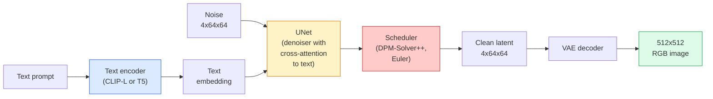

# Stable Diffusion — アーキテクチャとファインチューニング

> Stable Diffusionは、事前訓練済みVAEの潜在空間で動作し、クロスアテンションでテキストで条件付けされ、高速な決定論的ODEソルバーでサンプリングし、Classifier-Free Guidanceで誘導されるDDPMだ。


## 学習目標

- Stable Diffusionパイプラインの5つの構成要素（VAE、テキストエンコーダ、U-Net、スケジューラ、安全チェッカー）とそれぞれが実際に行うことを追う
- 潜在拡散と、4x64x64の潜在空間での訓練（3x512x512の画像空間ではなく）が品質を損なわずに計算量を48分の1に削減する理由を説明する
- `diffusers` を使って画像生成、image-to-image、インペインティング、ControlNet誘導生成を実行する
- 小さなカスタムデータセットでLoRAを使ってStable Diffusionをファインチューニングし、推論時にLoRAアダプタを読み込む

## 問題設定

512x512のRGB画像に直接DDPMを訓練するのは高コストだ。各訓練ステップは3x512x512 = 786,432個の入力値を見るU-Netを通してバックプロップし、サンプリングには同じU-Netの50回以上のフォワードパスが必要だ。Stable Diffusion 1.5（2022年リリース）の品質レベルでは、ピクセル空間の拡散にはおよそ256 GPUヶ月の訓練と民生用GPUで1枚あたり10〜30秒が必要になる。

オープンウェイトのテキストから画像への生成を実用的にしたトリックは**潜在拡散**（Rombach et al., CVPR 2022）だった。3x512x512の画像を4x64x64の潜在テンソルにマッピングして戻すVAEを訓練し、その潜在空間で拡散を行う。計算量は `(3*512*512)/(4*64*64) = 48倍` 削減される。サンプリングは同じGPUで数十秒から2秒未満になる。

ほぼすべての現代の画像生成モデル（SDXL、SD3、FLUX、HunyuanDiT、Wan-Video）は、オートエンコーダ、デノイザー（U-NetまたはDiT）、テキスト条件付けのバリエーションを持つ潜在拡散モデルだ。Stable Diffusionを学べばテンプレートを学んだことになる。

## 概念

### パイプライン



- **VAE** — 固定されたオートエンコーダ。エンコーダが画像を潜在変数に変換する（image-to-imageと訓練に使用）。デコーダが潜在変数を画像に戻す。
- **テキストエンコーダ** — CLIPテキストエンコーダ（SD 1.x/2.x）、CLIP-L + CLIP-G（SDXL）、またはT5-XXL（SD3/FLUX）。トークン埋め込みのシーケンスを生成する。
- **U-Net** — デノイザー。すべての解像度レベルでテキスト埋め込みへの潜在変数からのクロスアテンション層を持つ。
- **スケジューラ** — サンプリングアルゴリズム（DDIM、Euler、DPM-Solver++）。シグマを選択し、予測されたノイズを潜在変数の軌道に混ぜ戻す。
- **安全チェッカー** — 出力画像のオプションのNSFW/違法コンテンツフィルタ。

### Classifier-Free Guidance（CFG）

単純なテキスト条件付けは、すべてのプロンプト `c` に対して `epsilon_theta(x_t, t, c)` を学習する。CFGは同じネットワークを `c` を10%の確率でドロップ（空の埋め込みに置換）して訓練し、条件付きと非条件付きの両方のノイズを予測できる単一のモデルを作る。推論時：

```
eps = eps_uncond + w * (eps_cond - eps_uncond)
```

`w` はガイダンススケールだ。`w=0` は非条件付き、`w=1` は単純な条件付き、`w>1` は多様性を犠牲にして「プロンプトにより条件付けされた」出力の方向に押し出す。SDのデフォルトは `w=7.5` だ。

CFGはテキストから画像がプロダクション品質で機能する理由だ。これなしでは、プロンプトは出力をわずかにしか偏らせない。これありでは、プロンプトが支配的になる。

### 潜在空間の幾何学

VAEの4チャンネル潜在変数は単なる圧縮画像ではない。算術演算がほぼ意味的な編集に対応するマニフォールドだ（プロンプトエンジニアリングと補間の両方がここに存在する）。そして拡散U-Netがそのモデリング予算全体を費やして訓練されている空間だ。ランダムな4x64x64の潜在変数をデコードしても、ランダムに見える画像は生成されない。有効な画像にデコードされるのは潜在変数空間の特定の部分多様体だけだからだ。

2つの結果：

1. **Image-to-image** = 画像を潜在変数にエンコードし、部分的なノイズを加え、デノイザーを実行し、デコードする。エンコーディングはほぼ可逆なため画像構造が保たれる。コンテンツはプロンプトに基づいて変化する。
2. **インペインティング** = image-to-imageと同じだが、デノイザーはマスクされた領域のみを更新する。マスクされていない領域はエンコードされた潜在変数のまま保たれる。

### U-Netアーキテクチャ

SD U-Netはレッスン10のTinyUNetの大型版で、3つの追加がある：

- **トランスフォーマーブロック** — すべての空間解像度で、テキスト埋め込みへの自己アテンション + クロスアテンションを含む。
- **時刻埋め込み** — 正弦波エンコーディングへのMLPによる。
- **スキップ接続** — 対応する解像度でエンコーダとデコーダ間。

SD 1.5のパラメータ総数: 約860M。SDXL: 約2.6B。FLUX: 約12B。パラメータの増加はほとんどアテンション層によるものだ。

### LoRAファインチューニング

Stable Diffusionのフルファインチューニングには20GB以上のVRAMが必要で、860Mパラメータを更新する。LoRA（Low-Rank Adaptation）はベースモデルを固定し、アテンション層に小さなランク分解行列を注入する。SDのLoRAアダプタは通常10〜50 MBで、1枚の民生用GPUで10〜60分で訓練でき、推論時にドロップインの変更として読み込める。

```
Original: W_q : (d_in, d_out)   frozen
LoRA:     W_q + alpha * (A @ B)   where A : (d_in, r), B : (r, d_out)

r is typically 4-32.
```

LoRAはほぼすべてのコミュニティファインチューニングが配布される方法だ。CivitAIとHugging Faceには何百万ものLoRAがある。

### よく見るスケジューラ

- **DDIM** — 決定論的、約50ステップ、シンプル。
- **Euler ancestral** — 確率的、30〜50ステップ、やや創造的なサンプル。
- **DPM-Solver++ 2M Karras** — 決定論的、20〜30ステップ、プロダクションのデフォルト。
- **LCM / TCD / Turbo** — 一貫性モデルと蒸留バリアント。品質をある程度犠牲にして1〜4ステップ。

スケジューラの変更は `diffusers` での1行の変更であり、再訓練なしでサンプルの問題を修正することがある。

## 実装する

このレッスンはStable Diffusionをゼロから再構築するのではなく `diffusers` をエンドツーエンドで使用する。再構築に必要な部品（VAE、テキストエンコーダ、U-Net、スケジューラ）はそれぞれ固有のレッスンのトピックだ。ここでの目標はプロダクションAPIへの習熟だ。

### ステップ1：テキストから画像へ

```python
import torch
from diffusers import StableDiffusionPipeline

pipe = StableDiffusionPipeline.from_pretrained(
    "runwayml/stable-diffusion-v1-5",
    torch_dtype=torch.float16,
).to("cuda")

image = pipe(
    prompt="a dog riding a skateboard in tokyo, studio ghibli style",
    guidance_scale=7.5,
    num_inference_steps=25,
    generator=torch.Generator("cuda").manual_seed(42),
).images[0]
image.save("dog.png")
```

`float16` はVRAMを半分にするが、品質は見た目では変わらない。デフォルトのDPM-Solver++での `num_inference_steps=25` は、DDIMの `num_inference_steps=50` と同等だ。

### ステップ2：スケジューラの変更

```python
from diffusers import DPMSolverMultistepScheduler, EulerAncestralDiscreteScheduler

pipe.scheduler = DPMSolverMultistepScheduler.from_config(pipe.scheduler.config)
pipe.scheduler = EulerAncestralDiscreteScheduler.from_config(pipe.scheduler.config)
```

スケジューラの状態はU-Netの重みから切り離されている。DDPMで訓練して任意のスケジューラでサンプリングできる。

### ステップ3：Image-to-image

```python
from diffusers import StableDiffusionImg2ImgPipeline
from PIL import Image

img2img = StableDiffusionImg2ImgPipeline.from_pretrained(
    "runwayml/stable-diffusion-v1-5",
    torch_dtype=torch.float16,
).to("cuda")

init_image = Image.open("dog.png").convert("RGB").resize((512, 512))
out = img2img(
    prompt="a dog riding a skateboard, oil painting",
    image=init_image,
    strength=0.6,
    guidance_scale=7.5,
).images[0]
```

`strength` はデノイズ前に加えるノイズの量だ（0.0 = 変更なし、1.0 = 完全再生成）。スタイル転送には0.5〜0.7が標準的な範囲だ。

### ステップ4：インペインティング

```python
from diffusers import StableDiffusionInpaintPipeline

inpaint = StableDiffusionInpaintPipeline.from_pretrained(
    "runwayml/stable-diffusion-inpainting",
    torch_dtype=torch.float16,
).to("cuda")

image = Image.open("dog.png").convert("RGB").resize((512, 512))
mask = Image.open("dog_mask.png").convert("L").resize((512, 512))

out = inpaint(
    prompt="a cat",
    image=image,
    mask_image=mask,
    guidance_scale=7.5,
).images[0]
```

マスク内の白ピクセルが再生成する領域だ。黒ピクセルは保持される。

### ステップ5：LoRAの読み込み

```python
pipe.load_lora_weights("sayakpaul/sd-lora-ghibli")
pipe.fuse_lora(lora_scale=0.8)

image = pipe(prompt="a village square in ghibli style").images[0]
```

`lora_scale` は強度を制御する。0.0 = 効果なし、1.0 = フル効果。`fuse_lora` はアダプタを速度のためにインプレースで重みに焼き込むが、スワップを防ぐ。別のアダプタを読み込む前に `pipe.unfuse_lora()` を呼ぶ。

### ステップ6：LoRA訓練（スケッチ）

実際のLoRA訓練は `peft` または `diffusers.training` にある。概要：

```python
# Pseudocode
for step, batch in enumerate(dataloader):
    images, prompts = batch
    latents = vae.encode(images).latent_dist.sample() * 0.18215

    t = torch.randint(0, num_train_timesteps, (batch_size,))
    noise = torch.randn_like(latents)
    noisy_latents = scheduler.add_noise(latents, noise, t)

    text_emb = text_encoder(tokenizer(prompts))

    pred_noise = unet(noisy_latents, t, text_emb)  # LoRA weights injected here

    loss = F.mse_loss(pred_noise, noise)
    loss.backward()
    optimizer.step()
```

LoRA行列だけがグラジェントを受け取る。ベースのU-Net、VAE、テキストエンコーダは固定される。バッチサイズ1とグラジェントチェックポイントで8 GBのVRAMに収まる。

## 使ってみる

プロダクションでの実際の意思決定：

- **モデルファミリー**: オープンソースコミュニティのファインチューニングにはSD 1.5、より高い品質にはSDXL、最先端と厳格なライセンス要件にはSD3 / FLUX。
- **スケジューラ**: 20〜30ステップにはDPM-Solver++ 2M Karras、レイテンシが1秒以下の場合はLCM-LoRA。
- **精度**: 4080/4090では `float16`、A100以降では `bfloat16`、VRAMが厳しいときはTensorRT経由で `int8`。
- **条件付け**: 単純なテキストで機能する。より強い制御のためにはControlNet（canny、depth、pose）をベースパイプラインに追加する。

バッチ生成には `AUTO1111` / `ComfyUI` がコミュニティツール。プロダクションAPIには `diffusers` + `accelerate` または TensorRTコンパイルを使った `optimum-nvidia`。

## 成果物を出す

このレッスンで生成するもの：

- `outputs/prompt-sd-pipeline-planner.md` — レイテンシ予算、品質目標、ライセンス制約が与えられたとき、SD 1.5 / SDXL / SD3 / FLUXとスケジューラと精度を選ぶプロンプト。
- `outputs/skill-lora-training-setup.md` — キャプション、ランク、バッチサイズ、学習率を含むカスタムデータセット向けの完全なLoRA訓練設定を書き出すスキル。

## 演習

1. **（簡単）** `guidance_scale` を `[1, 3, 5, 7.5, 10, 15]` で同じプロンプトを生成する。画像がどのように変化するか説明する。どのガイダンス値でアーティファクトが現れるか？
2. **（中程度）** 実際の写真を撮り、`strength` を `[0.2, 0.4, 0.6, 0.8, 1.0]` で `StableDiffusionImg2ImgPipeline` を通す。どの強度がスタイルを変えながら構図を保つか？1.0が入力を完全に無視するのはなぜか？
3. **（難しい）** 単一の被写体（ペット、ロゴ、キャラクター）の10〜20枚の画像でLoRAを訓練し、その被写体を様々なシーンで生成する。最良のアイデンティティ保持を実現しつつ入力画像への過学習を防いだLoRAのランクと訓練ステップ数を報告する。

## キーワード

| 用語 | よく言われること | 実際の意味 |
|------|----------------|----------------------|
| 潜在拡散 | "潜在変数で拡散する" | DDPM全体をVAEの潜在空間（4x64x64）でピクセル空間（3x512x512）ではなく実行する; 計算量48倍削減 |
| VAEスケールファクター | "0.18215" | VAEの生の潜在変数をほぼ単位分散にスケール変換する定数; すべてのSDパイプラインにハードコードされている |
| Classifier-Free Guidance | "CFG" | 条件付きと非条件付きのノイズ予測を混ぜる; 単一の最も重要な推論ノブ |
| スケジューラ | "サンプラー" | ノイズとモデル予測をデノイズされた潜在変数の軌道に変換するアルゴリズム |
| LoRA | "低ランクアダプタ" | ベース重みを変えずにアテンション層をファインチューニングする小さなランク分解行列 |
| クロスアテンション | "テキスト-画像アテンション" | 潜在変数トークンからテキストトークンへのアテンション; すべてのU-Netレベルでプロンプト情報を注入する |
| ControlNet | "構造条件付け" | SDを追加入力（canny、depth、pose、segmentation）で誘導する別途訓練されたアダプタ |
| DPM-Solver++ | "デフォルトスケジューラ" | 2次決定論的ODEソルバー; 2026年の低ステップ数（20〜30）での最高品質 |

## 参考資料

- [High-Resolution Image Synthesis with Latent Diffusion (Rombach et al., 2022)](https://arxiv.org/abs/2112.10752) — Stable Diffusionの論文。設計を正当化するすべてのアブレーションを含む
- [Classifier-Free Diffusion Guidance (Ho & Salimans, 2022)](https://arxiv.org/abs/2207.12598) — CFGの論文
- [LoRA: Low-Rank Adaptation of Large Language Models (Hu et al., 2021)](https://arxiv.org/abs/2106.09685) — LoRAはNLPが最初; ほぼ変更なくSDに転用された
- [diffusersドキュメント](https://huggingface.co/docs/diffusers) — すべてのSD / SDXL / SD3 / FLUXパイプラインのリファレンス
