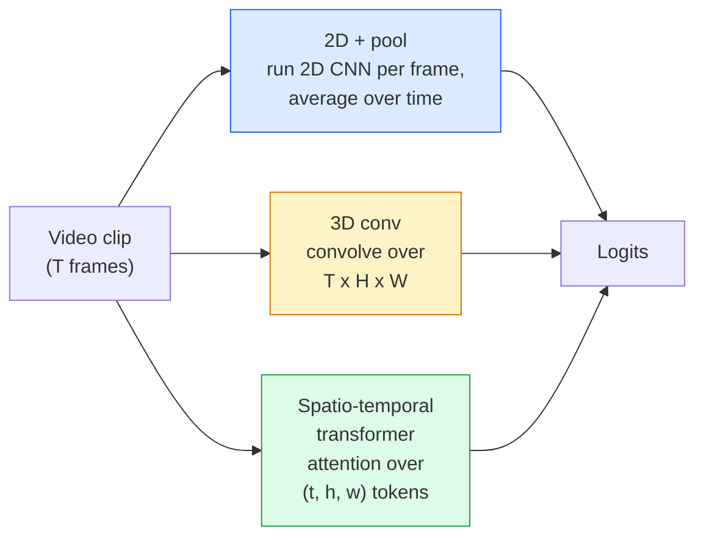

# 動画理解 — 時間モデリング

> 動画は画像のシーケンスにそれを繋ぐ物理法則を加えたものだ。すべての動画モデルは、時間を追加の軸として扱う（3D畳み込み）、アテンションを付けるシーケンスとして扱う（トランスフォーマー）、または一度抽出してプールする特徴として扱う（2D+プール）かのどれかだ。


## 学習目標

- 3つの主要な動画モデリングアプローチ（2D+プール、3D畳み込み、時空間トランスフォーマー）を区別し、それぞれのコストと精度のトレードオフを予測する
- PyTorchでフレームサンプリング、時間プーリング、2D+プールベースライン分類器を実装する
- I3Dの「膨張させた」3DカーネルがImageNetの重みから良く転移する理由と、因数分解（2+1)D畳み込みが何を異なって行うかを説明する
- 標準的な行動認識データセットとメトリクスを読む: Kinetics-400/600、UCF101、Something-Something V2; クリップレベルと動画レベルのtop-1精度

## 問題設定

30 fps の30秒動画は900枚の画像だ。単純に考えると、動画分類は画像分類を900回実行してから何らかの集約を行うことだ。これはアクションがほぼすべてのフレームで視認できる場合（スポーツ、料理、運動の動画）には機能し、アクション自体が動きで定義される場合には大きく失敗する。「何かを左から右に押す」は、すべての単一フレームで2つの静止オブジェクトのように見える。

すべての動画アーキテクチャにとって核心的な問いは: 時間的な構造はいつ、どのようにモデル化されるのか？という点だ。その答えが他のすべてを決める。計算コスト、事前訓練戦略、ImageNetの重みを再利用できるか、どのデータセットでモデルが訓練されるか、などだ。

このレッスンは静止画像のレッスンより意図的に短くなっている。コアとなる画像機構はすでに整っており、動画理解は主に時間的なストーリー: サンプリング、モデリング、集約についてだ。

## 概念

### 3つのアーキテクチャファミリー



### 2D + プール

2D CNN（ResNet、EfficientNet、ViT）を取る。すべてのサンプリングされたフレームで独立して実行する。フレームごとの埋め込みを時間方向に平均（またはマックスプール、またはアテンションプール）する。プールされたベクトルを分類器に送る。

利点：
- ImageNetの事前訓練が直接転移する。
- 最も実装が簡単。
- 安価: T フレーム × 1枚の画像の推論コスト。

欠点：
- 動きをモデル化できない。アクション = 外観の集約。
- 時間プーリングは順序不変。「ドアを開ける」と「ドアを閉める」は同じに見える。

使う時: 外観重視のタスク、小さな動画データセットへの転移学習、初期ベースライン。

### 3D畳み込み

2D（H、W）カーネルを3D（T、H、W）カーネルに置き換える。ネットワークは空間と時間の両方で畳み込む。初期ファミリー: C3D、I3D、SlowFast。

I3Dのトリック: 事前訓練済みの2D ImageNetモデルを取り、各2Dカーネルを新しい時間軸に沿ってコピーして「膨張させる」。3x3 2D畳み込みが3x3x3 3D畳み込みになる。これにより、ゼロから訓練する代わりに3Dモデルに強い事前訓練済み重みが与えられる。

利点：
- 動きを直接モデル化する。
- I3Dの膨張が無料の転移学習を与える。

欠点：
- 2D対応物より T/8 多くのFLOPS（時間カーネルが3で3回スタックされる場合）。
- 時間カーネルが小さい。長距離の動きにはピラミッドやデュアルストリームアプローチが必要。

使う時: 動きがシグナルとなる行動認識（Something-Something V2、動き重視のクラスを持つKinetics）。

### 時空間トランスフォーマー

動画を空間-時間パッチのグリッドにトークン化してすべてにわたってアテンションを付ける。TimeSformer、ViViT、Video Swin、VideoMAE。

重要なアテンションパターン：
- **ジョイント** — (t、h、w) 全体での1つの大きなアテンション。`T*H*W` で二次; 高コスト。
- **分割** — ブロックごとに2つのアテンション: 時間方向に1つ、空間方向に1つ。ほぼ線形スケーリング。
- **因数分解** — ブロック間で時間アテンションと空間アテンションが交互。

利点：
- あらゆる主要なベンチマークでSOTA精度。
- パッチの膨張により画像トランスフォーマー（ViT）から転移する。
- スパースアテンションによる長コンテキスト動画をサポート。

欠点：
- 計算量が多い。
- 実行がバルーンしないよう注意深いアテンションパターン選択が必要。

使う時: 大規模データセット、高品質動画理解、マルチモーダル動画+テキストタスク。

### フレームサンプリング

30 fps の10秒クリップは300フレーム。すべての300フレームをモデルに送るのは無駄だ。標準的な戦略：

- **均一サンプリング** — クリップ全体からT フレームを均等に選ぶ。2D+プールのデフォルト。
- **密サンプリング** — ランダムな連続 T フレームウィンドウ。動きには隣接フレームが必要なため3D畳み込みで一般的。
- **マルチクリップ** — 同じ動画から複数の T フレームウィンドウをサンプリングし、それぞれ分類して予測を平均する。

T は通常8、16、32、または64。高い T = より多い計算量でより多い時間的シグナル。

### 評価

2つのレベル：
- **クリップレベル精度** — モデルが1つの T フレームクリップを見てtop-kを報告する。
- **動画レベル精度** — 動画ごとに複数のクリップにわたってクリップレベル予測を平均する; より高く安定している。

常に両方を報告する。78% クリップ / 82% 動画のモデルはテスト時間の平均化に大きく依存している。80% / 81% のモデルはクリップあたりより堅牢だ。

### 扱うデータセット

- **Kinetics-400 / 600 / 700** — 汎用行動データセット。40万クリップ; YouTube URL（多くが今はリンク切れ）。
- **Something-Something V2** — 動きで定義されるアクション（「Xを左から右に移動させる」）。2D+プールでは解けない。
- **UCF-101**、**HMDB-51** — 古く、小さいが、まだ報告される。
- **AVA** — 空間と時間での行動*局所化*; 分類より難しい。

## 実装する

### ステップ1：フレームサンプラー

フレームのリスト（または動画テンソル）で動作する均一サンプラーと密サンプラー。

```python
import numpy as np

def sample_uniform(num_frames_total, T):
    if num_frames_total <= T:
        return list(range(num_frames_total)) + [num_frames_total - 1] * (T - num_frames_total)
    step = num_frames_total / T
    return [int(i * step) for i in range(T)]


def sample_dense(num_frames_total, T, rng=None):
    rng = rng or np.random.default_rng()
    if num_frames_total <= T:
        return list(range(num_frames_total)) + [num_frames_total - 1] * (T - num_frames_total)
    start = int(rng.integers(0, num_frames_total - T + 1))
    return list(range(start, start + T))
```

どちらも動画テンソルをスライスするために使う `T` 個のインデックスを返す。

### ステップ2：2D+プールベースライン

すべてのフレームで2D ResNet-18を実行し、特徴を平均プールして分類する。

```python
import torch
import torch.nn as nn
from torchvision.models import resnet18, ResNet18_Weights

class FramePool(nn.Module):
    def __init__(self, num_classes=400, pretrained=True):
        super().__init__()
        weights = ResNet18_Weights.IMAGENET1K_V1 if pretrained else None
        backbone = resnet18(weights=weights)
        self.features = nn.Sequential(*(list(backbone.children())[:-1]))  # global avg pool kept
        self.head = nn.Linear(512, num_classes)

    def forward(self, x):
        # x: (N, T, 3, H, W)
        N, T = x.shape[:2]
        x = x.view(N * T, *x.shape[2:])
        feats = self.features(x).view(N, T, -1)
        pooled = feats.mean(dim=1)
        return self.head(pooled)

model = FramePool(num_classes=10)
x = torch.randn(2, 8, 3, 224, 224)
print(f"output: {model(x).shape}")
print(f"params: {sum(p.numel() for p in model.parameters()):,}")
```

1100万パラメータ、ImageNet事前訓練済み、フレームごとに実行、平均して分類する。このベースラインは外観重視のタスクでは適切な3Dモデルから5〜10ポイント以内に収まることが多い。より強いImageNetバックボーンを再利用するため、時には上回ることもある。

### ステップ3：I3Dスタイルの膨張3D畳み込み

新しい時間軸に沿って重みを繰り返すことで単一の2D畳み込みを3D畳み込みに変換する。

```python
def inflate_2d_to_3d(conv2d, time_kernel=3):
    out_c, in_c, kh, kw = conv2d.weight.shape
    weight_3d = conv2d.weight.data.unsqueeze(2)  # (out, in, 1, kh, kw)
    weight_3d = weight_3d.repeat(1, 1, time_kernel, 1, 1) / time_kernel
    conv3d = nn.Conv3d(in_c, out_c, kernel_size=(time_kernel, kh, kw),
                        padding=(time_kernel // 2, conv2d.padding[0], conv2d.padding[1]),
                        stride=(1, conv2d.stride[0], conv2d.stride[1]),
                        bias=False)
    conv3d.weight.data = weight_3d
    return conv3d

conv2d = nn.Conv2d(3, 64, kernel_size=3, padding=1, bias=False)
conv3d = inflate_2d_to_3d(conv2d, time_kernel=3)
print(f"2D weight shape:  {tuple(conv2d.weight.shape)}")
print(f"3D weight shape:  {tuple(conv3d.weight.shape)}")
x = torch.randn(1, 3, 8, 56, 56)
print(f"3D output shape:  {tuple(conv3d(x).shape)}")
```

`time_kernel` での除算は活性化の大きさをほぼ一定に保つ。最初のパスでバッチ正規化の統計を壊さないために重要だ。

### ステップ4：因数分解（2+1）D畳み込み

3D畳み込みを2D（空間）と1D（時間）畳み込みに分割する。同じ受容野で、パラメータ数が少なく、いくつかのベンチマークでより良い精度だ。

```python
class Conv2Plus1D(nn.Module):
    def __init__(self, in_c, out_c, kernel_size=3):
        super().__init__()
        mid_c = (in_c * out_c * kernel_size * kernel_size * kernel_size) \
                // (in_c * kernel_size * kernel_size + out_c * kernel_size)
        self.spatial = nn.Conv3d(in_c, mid_c, kernel_size=(1, kernel_size, kernel_size),
                                 padding=(0, kernel_size // 2, kernel_size // 2), bias=False)
        self.bn = nn.BatchNorm3d(mid_c)
        self.act = nn.ReLU(inplace=True)
        self.temporal = nn.Conv3d(mid_c, out_c, kernel_size=(kernel_size, 1, 1),
                                  padding=(kernel_size // 2, 0, 0), bias=False)

    def forward(self, x):
        return self.temporal(self.act(self.bn(self.spatial(x))))

c = Conv2Plus1D(3, 64)
x = torch.randn(1, 3, 8, 56, 56)
print(f"(2+1)D output: {tuple(c(x).shape)}")
```

完全なR(2+1)Dネットワークは、すべての3x3畳み込みを `Conv2Plus1D` に置き換えたResNet-18と同じだ。

## 使ってみる

プロダクションの動画作業を2つのライブラリがカバーする：

- `torchvision.models.video` — 事前訓練済みKinetics重みを持つR(2+1)D、MViT、Swin3D。画像モデルと同じAPI。
- `pytorchvideo`（Meta）— モデルズー、Kinetics / SSv2 / AVAのデータローダー、標準的な変換。

ビジョン-言語動画モデル（動画キャプション、動画QA）には、`transformers`（`VideoMAE`、`VideoLLaMA`、`InternVideo`）を使う。

## 成果物を出す

このレッスンで生成するもの：

- `outputs/prompt-video-architecture-picker.md` — 外観対動き、データセットサイズ、計算予算に基づいて2D+プール / I3D / (2+1)D / トランスフォーマーを選ぶプロンプト。
- `outputs/skill-frame-sampler-auditor.md` — 動画パイプラインのサンプラーを検査し、一般的なバグ（インデックスのオフバイワン、num_frames < T での不均一サンプリング、アスペクト比を保つクロップの欠如など）をフラグ立てするスキル。

## 演習

1. **（簡単）** T=8 のFramePoolとT=8 のI3Dスタイル3D ResNetのFLOPS（概算）を計算する。なぜ2D+プールが3〜5倍安価か理由を述べる。
2. **（中程度）** 合成動画データセットを生成する: ランダムな方向に動くランダムなボールに動きの方向でラベルを付ける（「左から右」、「右から左」、「斜め上」）。それをFramePoolで訓練する。ほぼチャンス精度しか達成しないことを示し、外観だけでは動きタスクに不十分であることを証明する。
3. **（難しい）** ResNet-18のすべてのConv2dを `Conv2Plus1D` に置き換えてR(2+1)D-18を構築する。ImageNet事前訓練済みResNet-18から最初の畳み込みの重みを膨張させる。演習2の動きデータセットで訓練してFramePoolを上回る。

## キーワード

| 用語 | よく言われること | 実際の意味 |
|------|----------------|----------------------|
| 2D + プール | "フレームごとの分類器" | すべてのサンプリングフレームで2D CNNを実行し、時間方向に特徴を平均プールして分類する |
| 3D畳み込み | "時空間カーネル" | (T、H、W)に渡って畳み込むカーネル; 動きをネイティブにモデル化できる |
| 膨張 | "2Dの重みを3Dにリフトする" | 新しい時間軸に沿って2D畳み込みの重みを繰り返して3D畳み込みの重みを初期化し、活性化スケールを保つためにkernel_Tで除算する |
| (2+1)D | "因数分解畳み込み" | 3Dを2D空間 + 1D時間に分割; パラメータが少なく、間に追加の非線形性がある |
| 分割アテンション | "時間、その後空間" | 各レイヤーに2つのアテンションを持つトランスフォーマーブロック: 同じフレームのトークン上のもの、同じ位置のトークン上のもの |
| クリップ | "T フレームウィンドウ" | T フレームのサンプリングされたサブシーケンス; 動画モデルが消費する単位 |
| クリップ対動画精度 | "2つの評価設定" | クリップ = 動画あたり1つのサンプル、動画 = 複数のサンプリングクリップにわたって平均 |
| Kinetics | "動画のImageNet" | 400〜700の行動クラス、30万以上のYouTubeクリップ、標準的な動画事前訓練コーパス |

## 参考資料

- [I3D: Quo Vadis, Action Recognition (Carreira & Zisserman, 2017)](https://arxiv.org/abs/1705.07750) — 膨張とKineticsデータセットを導入
- [R(2+1)D: A Closer Look at Spatiotemporal Convolutions (Tran et al., 2018)](https://arxiv.org/abs/1711.11248) — 因数分解畳み込み、まだ強いベースライン
- [TimeSformer: Is Space-Time Attention All You Need? (Bertasius et al., 2021)](https://arxiv.org/abs/2102.05095) — 最初の強力な動画トランスフォーマー
- [VideoMAE (Tong et al., 2022)](https://arxiv.org/abs/2203.12602) — 動画向けマスクドオートエンコーダ事前訓練; 現在支配的な事前訓練レシピ
