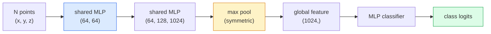

# 3Dビジョン — 点群とNeRF

> 3Dビジョンには2つの種類がある。点群はセンサーの生出力だ。NeRFは学習された体積場だ。どちらも「何が空間のどこにあるか」という問いに答える。


## 学習目標

- 明示的表現（点群、メッシュ、ボクセル）と暗示的表現（符号付き距離場、NeRF）の3D表現を区別し、それぞれが使われる場面を述べる
- PointNetのニューラルネットワークを順序のない点集合に対して置換不変にする対称関数トリックを理解する
- NeRFのフォワードパスを追う: レイキャスティング、体積レンダリング、位置エンコーディング、MLPの密度+色ヘッド
- 少数のポーズ済み画像からの事前訓練済み3D再構成のために `nerfstudio` または `instant-ngp` を使う

## 問題設定

カメラは2D画像を生成する。LiDARは順序のない3D点の集合を生成する。Structure-from-Motionパイプラインはスパースな3Dキーポイントの雲を生成する。NeRFは一握りのポーズ済み画像から3Dシーン全体を再構成する。これらはすべて「ビジョン」だが、CNNが欲しい密なテンソルには見えない。

3Dビジョンは、ほぼすべての高価値なロボットタスクが3Dで動くため重要だ: 把持、障害物回避、ナビゲーション、AR遮蔽、3Dコンテンツ取得。2D画像しか理解しないビジョンエンジニアは、分野で最も急成長しているスライス（AR/VRコンテンツ、ロボティクス、自律走行スタック、不動産や建設向けNeRFベース3D再構成）から締め出される。

2つの表現が異なる理由で支配的だ。点群はセンサーが無料で与えてくれるものだ。NeRFとその後継（3Dガウシアンスプラッティング、ニューラルSDF）は、ニューラルネットワークにシーンを学習させたときに得られるものだ。

## 概念

### 点群

点群はR^3の N 点の順序なし集合であり、オプションで各点に特徴（色、強度、法線）を持つ。

```
cloud = [
  (x1, y1, z1, r1, g1, b1),
  (x2, y2, z2, r2, g2, b2),
  ...
  (xN, yN, zN, rN, gN, bN),
]
```

グリッドなし、接続性なし。2つの性質がニューラルネットワークを困難にする：

- **置換不変性** — 出力が点の順序に依存してはならない。
- **可変 N** — 単一のモデルが異なるサイズの点群を処理できなければならない。

PointNet（Qi et al., 2017）は1つのアイデアで両方を解決した: すべての点に共有MLPを適用し、対称関数（最大プール）で集約する。結果は順序に依存しない固定サイズベクトルだ。

```
f(P) = max_{p in P} MLP(p)
```

これがPointNetのコア全体だ。より深いバリアント（PointNet++、Point Transformer）は階層的サンプリングとローカル集約を加えるが、対称関数トリックは変わらない。

### PointNetアーキテクチャ



「共有MLP」とは、同じMLPがすべての点に独立して実行されることを意味する。効率のため点次元への1x1畳み込みとして実装される。

### Neural Radiance Fields（NeRF）

NeRF（Mildenhall et al., 2020）は「N枚の写真から3Dシーンを再構成できるか？」という問いに対して、シーン自体であるニューラルネットワークで答えた。ネットワークは `(x, y, z, 視線方向)` を `(密度, 色)` にマッピングする。新しいビューをレンダリングすることはこのネットワーク上のレイキャスティングループだ。

```
NeRF MLP:  (x, y, z, theta, phi) -> (sigma, r, g, b)

To render a pixel (u, v) of a new view:
  1. Cast a ray from the camera through pixel (u, v)
  2. Sample points along the ray at distances t_1, t_2, ..., t_N
  3. Query the MLP at each point
  4. Composite the colours weighted by (1 - exp(-sigma * dt))
  5. The sum is the rendered pixel colour
```

損失はトレーニング写真のグラウンドトゥルースピクセルとレンダリングされたピクセルを比較する。レンダリングステップを通じたバックプロップがMLPを更新する。3Dグラウンドトゥルースなし、明示的な幾何学なし — シーンはMLPの重みに格納される。

### NeRFの位置エンコーディング

`(x, y, z)` 上の素のMLPは、MLPがスペクトル的に低周波に偏るため高周波の詳細を表現できない。NeRFはMLP前に各座標をフーリエ特徴ベクトルにエンコードすることでこれを修正する：

```
gamma(p) = (sin(2^0 pi p), cos(2^0 pi p), sin(2^1 pi p), cos(2^1 pi p), ...)
```

最大 L=10 周波数レベル。これはトランスフォーマーが位置に使うトリックと同じで、拡散の時刻条件付け（レッスン10）にも再び現れる。これなしではNeRFはぼやける。

### 体積レンダリング

```
C(r) = sum_i T_i * (1 - exp(-sigma_i * delta_i)) * c_i

T_i  = exp(- sum_{j<i} sigma_j * delta_j)
delta_i = t_{i+1} - t_i
```

`T_i` は透過率 — どれだけの光が点 i まで生き残るか。`(1 - exp(-sigma_i * delta_i))` は点 i での不透明度。`c_i` は色。最終的なピクセルはレイに沿った重み付き合計だ。

### NeRFに取って代わったもの

純粋なNeRFは訓練が遅く（時間単位）レンダリングも遅い（画像あたり秒単位）。それ以降の系譜：

- **Instant-NGP**（2022）— ハッシュグリッドエンコーディングがMLPの位置入力を置き換える。秒単位で訓練。
- **Mip-NeRF 360** — 無制限シーンとアンチエイリアシングを処理する。
- **3Dガウシアンスプラッティング**（2023）— 体積場を数百万の3Dガウシアンで置き換える。分単位で訓練、リアルタイムレンダリング。現在のプロダクションデフォルト。

2026年のほぼすべての実際のNeRF製品は実際には3Dガウシアンスプラッティングだ。メンタルモデルはまだNeRFだ。

### データセットとベンチマーク

- **ShapeNet** — 点群としての3D CADモデルの分類とセグメンテーション。
- **ScanNet** — セグメンテーション用の実内部スキャン。
- **KITTI** — 自律走行向けの屋外LiDAR点群。
- **NeRF Synthetic** / **Blended MVS** — ビュー合成用のポーズ済み画像データセット。
- **Mip-NeRF 360** データセット — 無制限の実シーン。

## 実装する

### ステップ1：PointNet分類器

```python
import torch
import torch.nn as nn

class PointNet(nn.Module):
    def __init__(self, num_classes=10):
        super().__init__()
        self.mlp1 = nn.Sequential(
            nn.Conv1d(3, 64, 1),    nn.BatchNorm1d(64),   nn.ReLU(inplace=True),
            nn.Conv1d(64, 64, 1),   nn.BatchNorm1d(64),   nn.ReLU(inplace=True),
        )
        self.mlp2 = nn.Sequential(
            nn.Conv1d(64, 128, 1),  nn.BatchNorm1d(128),  nn.ReLU(inplace=True),
            nn.Conv1d(128, 1024, 1), nn.BatchNorm1d(1024), nn.ReLU(inplace=True),
        )
        self.head = nn.Sequential(
            nn.Linear(1024, 512),   nn.BatchNorm1d(512),  nn.ReLU(inplace=True),
            nn.Dropout(0.3),
            nn.Linear(512, 256),    nn.BatchNorm1d(256),  nn.ReLU(inplace=True),
            nn.Dropout(0.3),
            nn.Linear(256, num_classes),
        )

    def forward(self, x):
        # x: (N, 3, num_points) — transposed for Conv1d
        x = self.mlp1(x)
        x = self.mlp2(x)
        x = torch.max(x, dim=-1)[0]       # (N, 1024)
        return self.head(x)

pts = torch.randn(4, 3, 1024)
net = PointNet(num_classes=10)
print(f"output: {net(pts).shape}")
print(f"params: {sum(p.numel() for p in net.parameters()):,}")
```

約160万パラメータ。点群あたり1,024点で動作する。

### ステップ2：位置エンコーディング

```python
def positional_encoding(x, L=10):
    """
    x: (..., D) -> (..., D * 2 * L)
    """
    freqs = 2.0 ** torch.arange(L, dtype=x.dtype, device=x.device)
    args = x.unsqueeze(-1) * freqs * 3.141592653589793
    sinc = torch.cat([args.sin(), args.cos()], dim=-1)
    return sinc.reshape(*x.shape[:-1], -1)

x = torch.randn(5, 3)
y = positional_encoding(x, L=10)
print(f"input:  {x.shape}")
print(f"encoded: {y.shape}     # (5, 60)")
```

`2^l * pi` を掛けることで次第に高い周波数が得られる。

### ステップ3：小さなNeRF MLP

```python
class TinyNeRF(nn.Module):
    def __init__(self, L_pos=10, L_dir=4, hidden=128):
        super().__init__()
        self.L_pos = L_pos
        self.L_dir = L_dir
        pos_dim = 3 * 2 * L_pos
        dir_dim = 3 * 2 * L_dir
        self.trunk = nn.Sequential(
            nn.Linear(pos_dim, hidden), nn.ReLU(inplace=True),
            nn.Linear(hidden, hidden),  nn.ReLU(inplace=True),
            nn.Linear(hidden, hidden),  nn.ReLU(inplace=True),
            nn.Linear(hidden, hidden),  nn.ReLU(inplace=True),
        )
        self.sigma = nn.Linear(hidden, 1)
        self.color = nn.Sequential(
            nn.Linear(hidden + dir_dim, hidden // 2), nn.ReLU(inplace=True),
            nn.Linear(hidden // 2, 3), nn.Sigmoid(),
        )

    def forward(self, x, d):
        x_enc = positional_encoding(x, self.L_pos)
        d_enc = positional_encoding(d, self.L_dir)
        h = self.trunk(x_enc)
        sigma = torch.relu(self.sigma(h)).squeeze(-1)
        rgb = self.color(torch.cat([h, d_enc], dim=-1))
        return sigma, rgb

nerf = TinyNeRF()
x = torch.randn(128, 3)
d = torch.randn(128, 3)
s, c = nerf(x, d)
print(f"sigma: {s.shape}   rgb: {c.shape}")
```

オリジナルのNeRF（深さ8の2つのMLPトランクを持つ）と比べて小さい。アーキテクチャを実証するのに十分だ。

### ステップ4：レイに沿った体積レンダリング

```python
def volumetric_render(sigma, rgb, t_vals):
    """
    sigma: (..., N_samples)
    rgb:   (..., N_samples, 3)
    t_vals: (N_samples,) distances along the ray
    """
    delta = torch.cat([t_vals[1:] - t_vals[:-1], torch.full_like(t_vals[:1], 1e10)])
    alpha = 1.0 - torch.exp(-sigma * delta)
    trans = torch.cumprod(torch.cat([torch.ones_like(alpha[..., :1]), 1.0 - alpha + 1e-10], dim=-1), dim=-1)[..., :-1]
    weights = alpha * trans
    rendered = (weights.unsqueeze(-1) * rgb).sum(dim=-2)
    depth = (weights * t_vals).sum(dim=-1)
    return rendered, depth, weights


N = 64
t_vals = torch.linspace(2.0, 6.0, N)
sigma = torch.rand(N) * 0.5
rgb = torch.rand(N, 3)
rendered, depth, weights = volumetric_render(sigma, rgb, t_vals)
print(f"rendered colour: {rendered.tolist()}")
print(f"depth:           {depth.item():.2f}")
```

1本のレイ、64サンプル、単一のRGBピクセルと深さに合成する。

## 使ってみる

実際の作業には：

- `nerfstudio`（Tancik et al.）— NeRF / Instant-NGP / ガウシアンスプラッティングの現在のリファレンスライブラリ。コマンドラインとウェブビューアー付き。
- `pytorch3d`（Meta）— 微分可能レンダリング、点群ユーティリティ、メッシュ操作。
- `open3d` — 点群処理、位置合わせ、可視化。

デプロイにあたっては、3Dガウシアンスプラッティングが100倍高速にレンダリングするため純粋なNeRFをほぼ置き換えた。再構成品質は同等だ。

## 成果物を出す

このレッスンで生成するもの：

- `outputs/prompt-3d-task-router.md` — タスクと入力データに基づいて適切な3D表現（点群、メッシュ、ボクセル、NeRF、ガウシアンスプラット）にルーティングするプロンプト。
- `outputs/skill-point-cloud-loader.md` — 正しい正規化、中心化、点サンプリングを持つ .ply / .pcd / .xyz ファイル向けのPyTorchの `Dataset` を書き出すスキル。

## 演習

1. **（簡単）** PointNetが置換不変であることを示す: 同じ点群を2回実行し、1回は点をシャッフルして。出力が浮動小数点誤差の範囲で同一であることを確認する。
2. **（中程度）** カメラの内部パラメータとポーズが与えられたとき、H × W 画像のすべてのピクセルに対するレイの原点と方向を生成する最小限のレイ生成関数を実装する。
3. **（難しい）** 色付きキューブのレンダリングビューの合成データセット（微分可能レンダリングまたは単純なレイトレーサーで生成）でTinyNeRFを訓練する。エポック1、10、100でのレンダリング損失を報告する。何エポックでモデルが認識可能なビューを生成するか？

## キーワード

| 用語 | よく言われること | 実際の意味 |
|------|----------------|----------------------|
| 点群 | "LiDARからの3D点" | 点あたりのオプション特徴を持つ (x, y, z) の順序なし集合 |
| PointNet | "点群上の最初のニューラルネット" | 点ごとの共有MLP + 対称（最大）プール; 構造的に置換不変 |
| NeRF | "シーンであるMLP" | (x, y, z, dir) を (密度, 色) にマッピングするネットワーク; レイキャスティングでレンダリング |
| 位置エンコーディング | "フーリエ特徴" | MLPの低周波バイアスを克服するために複数の周波数でsin/cosに各座標をエンコードする |
| 体積レンダリング | "レイ積分" | 透過率とアルファを使ってレイに沿ったサンプルを単一ピクセルに合成する |
| Instant-NGP | "ハッシュグリッドNeRF" | NeRFの座標MLPをマルチ解像度ハッシュグリッドで置き換える; 100〜1000倍高速 |
| 3Dガウシアンスプラッティング | "数百万のガウシアン" | シーン = 3Dガウシアンの集合; リアルタイムでレンダリング、分単位で訓練 |
| SDF | "符号付き距離場" | 最近傍面への符号付き距離を返す関数; もう一つの暗示的表現 |

## 参考資料

- [PointNet (Qi et al., 2017)](https://arxiv.org/abs/1612.00593) — 置換不変分類器
- [NeRF (Mildenhall et al., 2020)](https://arxiv.org/abs/2003.08934) — 3D再構成をニューラルネットの問題にした論文
- [Instant-NGP (Müller et al., 2022)](https://arxiv.org/abs/2201.05989) — ハッシュグリッド、1000倍高速化
- [3D Gaussian Splatting (Kerbl et al., 2023)](https://arxiv.org/abs/2308.04079) — プロダクションでNeRFを置き換えたアーキテクチャ
