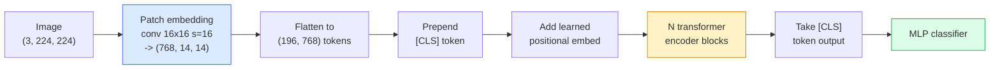

# Vision Transformers（ViT）

> 画像をパッチに切り取り、各パッチを単語として扱い、標準的なトランスフォーマーを実行する。もう後ろを振り返らない。


## 学習目標

- パッチ埋め込み、学習済み位置埋め込み、クラストークン、トランスフォーマーエンコーダブロックをゼロから実装して最小限のViTを構築する
- DeiTとMAEが証明するまでViTが大規模な事前訓練データを必要とすると考えられていた理由を説明する
- アーキテクチャの事前知識（なし、ローカルウィンドウアテンション、畳み込みバックボーン）についてViT、Swin、ConvNeXtを比較する
- `timm` を使って事前訓練済みViTを小さなデータセットでファインチューニングし、標準的な線形プローブ / ファインチューニングのレシピを適用する

## 問題設定

10年間、畳み込みはコンピュータビジョンの同義語だった。CNNは強い帰納的バイアスを持っていた — 局所性、平行移動同変性 — 誰もそれを置き換えられると思っていなかった。その後Dosovitskiy et al.（2020）は、畳み込み機構を一切持たない、フラット化した画像パッチに適用された素のトランスフォーマーが、スケールで最良のCNNと同等か上回れることを示した。

問題は「スケール」だった。ImageNet-1kでのViTはResNetに負けた。ImageNet-21kまたはJFT-300Mで事前訓練してからImageNet-1kでファインチューニングしたViTは上回った。結論は、トランスフォーマーには有用な事前知識がなかったが十分なデータから学習できるということだった。後続の研究（DeiT、MAE、DINO）は、適切な訓練レシピ — 強いデータ拡張、自己教師あり事前訓練、蒸留 — によりViTは小さなデータでも問題なく訓練できることを示した。

2026年までに、純粋なCNNはエッジデバイスではまだ競争力があるが（ConvNeXtが最強）、トランスフォーマーは他のすべてを支配する: セグメンテーション（Mask2Former、SegFormer）、検出（DETR、RT-DETR）、マルチモーダル（CLIP、SigLIP）、動画（VideoMAE、VJEPA）。ViTブロック構造が知っておくべき1つだ。

## 概念

### パイプライン



7ステップ。パッチ → トークン → アテンション → 分類器。すべてのバリアント（DeiT、Swin、ConvNeXt、MAE事前訓練）は7つのうちの1つか2つを変えて残りはそのままにする。

### パッチ埋め込み

最初の畳み込みが秘訣だ。カーネルサイズ16、ストライド16、そのため224x224画像は16x16パッチの14x14グリッドになり、各パッチが768次元の埋め込みに射影される。この単一の畳み込みがパッチ化と線形射影の両方を行う。

```
Input:  (3, 224, 224)
Conv (3 -> 768, k=16, s=16, no padding):
Output: (768, 14, 14)
Flatten spatial: (196, 768)
```

196パッチ = 196トークン。各トークンの特徴次元は768（ViT-B）、1024（ViT-L）、または1280（ViT-H）。

### クラストークン

シーケンスの先頭に追加される単一の学習済みベクトル：

```
tokens = [CLS; patch_1; patch_2; ...; patch_196]   shape (197, 768)
```

N個のトランスフォーマーブロックの後、`[CLS]` の出力がグローバル画像表現だ。分類ヘッドはこの1つのベクトルのみを読む。

### 位置埋め込み

トランスフォーマーには空間位置の概念が組み込まれていない。すべてのトークンに学習済みベクトルを加える：

```
tokens = tokens + learned_pos_embedding   (also shape (197, 768))
```

埋め込みはモデルのパラメータだ。勾配ベースの訓練がそれを2D画像構造に適応させる。正弦波2D代替も存在するが実際にはほとんど使われない。

### トランスフォーマーエンコーダブロック

標準的なものだ。マルチヘッド自己アテンション、MLP、残差接続、事前LayerNorm。

```
x = x + MSA(LN(x))
x = x + MLP(LN(x))

MLP is two-layer with GELU: Linear(d -> 4d) -> GELU -> Linear(4d -> d)
```

ViT-B/16はこれを12個積み重ね、各ブロックに12個のアテンションヘッドを持ち、合計86Mパラメータになる。

### なぜ事前LNか

初期のトランスフォーマーは事後LN（`x = LN(x + sublayer(x))`）を使い、ウォームアップなしに6〜8層を超えると訓練が困難になった。事前LN（`x = x + sublayer(LN(x))`）はウォームアップなしにより深いネットワークを安定して訓練する。すべてのViTとすべての現代のLLMは事前LNを使う。

### パッチサイズのトレードオフ

- 16x16パッチ → 196トークン、標準的。
- 32x32パッチ → 49トークン、高速だが低解像度。
- 8x8パッチ → 784トークン、細かいがO(n^2)アテンションコストが悪くスケールする。

大きなパッチ = 少ないトークン = 高速だが空間詳細が少ない。SwinV2は階層的ウィンドウで4x4パッチを使う。

### ImageNet-1kでViTを訓練するためのDeiTのレシピ

元のViTはCNNに勝つためにJFT-300Mが必要だった。DeiT（Touvron et al., 2020）は4つの変更でImageNet-1kだけでViT-Bを81.8% top-1に訓練した：

1. 重い拡張: RandAugment、Mixup、CutMix、Random Erasing。
2. 確率的深さ（訓練中にランダムでブロック全体をドロップ）。
3. 繰り返し拡張（同じ画像をバッチごとに3回サンプリング）。
4. CNNティーチャーからの蒸留（オプション、精度をさらに向上）。

すべての現代のViT訓練レシピはDeiTから派生している。

### Swin対ConvNeXt

- **Swin**（Liu et al., 2021）— ウィンドウベースのアテンション。各ブロックはローカルウィンドウ内でアテンションを付ける。交互のブロックはウィンドウをシフトしてウィンドウ間で情報を混ぜる。アテンション演算子を保ちながらCNNのような局所性の事前知識を持ち込む。
- **ConvNeXt**（Liu et al., 2022）— Swinのアーキテクチャ選択に合わせた再設計されたCNN（デプスワイズ畳み込み、LayerNorm、GELU、反転ボトルネック）。ギャップは「アテンション対畳み込み」ではなく「モダンな訓練レシピ + アーキテクチャ」であることを示した。

2026年には、ConvNeXt-V2とSwin-V2の両方がプロダクション品質だ。適切な選択は推論スタック（ConvNeXtはエッジ向けによりよくコンパイルされる）と事前訓練コーパスによる。

### MAE事前訓練

マスクドオートエンコーダ（He et al., 2022）: パッチの75%をランダムにマスクし、エンコーダが見えている25%のみを処理するように訓練し、小さなデコーダがエンコーダの出力からマスクされたパッチを再構成するように訓練する。事前訓練後、デコーダを捨ててエンコーダをファインチューニングする。

MAEはViTをImageNet-1kだけで訓練可能にし、SOTAを達成し、現在のデフォルトの自己教師あり学習レシピだ。

## 実装する

### ステップ1：パッチ埋め込み

```python
import torch
import torch.nn as nn

class PatchEmbedding(nn.Module):
    def __init__(self, in_channels=3, patch_size=16, dim=192, image_size=64):
        super().__init__()
        assert image_size % patch_size == 0
        self.proj = nn.Conv2d(in_channels, dim, kernel_size=patch_size, stride=patch_size)
        num_patches = (image_size // patch_size) ** 2
        self.num_patches = num_patches

    def forward(self, x):
        x = self.proj(x)
        return x.flatten(2).transpose(1, 2)
```

1つの畳み込み、1つのフラット化、1つの転置。これが画像からトークンへのステップ全体だ。

### ステップ2：トランスフォーマーブロック

事前LN、マルチヘッド自己アテンション、GELUを使ったMLP、残差接続。

```python
class Block(nn.Module):
    def __init__(self, dim, num_heads, mlp_ratio=4, dropout=0.0):
        super().__init__()
        self.ln1 = nn.LayerNorm(dim)
        self.attn = nn.MultiheadAttention(dim, num_heads, dropout=dropout, batch_first=True)
        self.ln2 = nn.LayerNorm(dim)
        self.mlp = nn.Sequential(
            nn.Linear(dim, dim * mlp_ratio),
            nn.GELU(),
            nn.Dropout(dropout),
            nn.Linear(dim * mlp_ratio, dim),
            nn.Dropout(dropout),
        )

    def forward(self, x):
        a, _ = self.attn(self.ln1(x), self.ln1(x), self.ln1(x), need_weights=False)
        x = x + a
        x = x + self.mlp(self.ln2(x))
        return x
```

`nn.MultiheadAttention` がヘッドへの分割、スケールドドット積、出力射影を処理する。形状が `(N, seq, dim)` になるように `batch_first=True`。

### ステップ3：ViT

```python
class ViT(nn.Module):
    def __init__(self, image_size=64, patch_size=16, in_channels=3,
                 num_classes=10, dim=192, depth=6, num_heads=3, mlp_ratio=4):
        super().__init__()
        self.patch = PatchEmbedding(in_channels, patch_size, dim, image_size)
        num_patches = self.patch.num_patches
        self.cls_token = nn.Parameter(torch.zeros(1, 1, dim))
        self.pos_embed = nn.Parameter(torch.zeros(1, num_patches + 1, dim))
        self.blocks = nn.ModuleList([
            Block(dim, num_heads, mlp_ratio) for _ in range(depth)
        ])
        self.ln = nn.LayerNorm(dim)
        self.head = nn.Linear(dim, num_classes)
        nn.init.trunc_normal_(self.pos_embed, std=0.02)
        nn.init.trunc_normal_(self.cls_token, std=0.02)

    def forward(self, x):
        x = self.patch(x)
        cls = self.cls_token.expand(x.size(0), -1, -1)
        x = torch.cat([cls, x], dim=1)
        x = x + self.pos_embed
        for blk in self.blocks:
            x = blk(x)
        x = self.ln(x[:, 0])
        return self.head(x)

vit = ViT(image_size=64, patch_size=16, num_classes=10, dim=192, depth=6, num_heads=3)
x = torch.randn(2, 3, 64, 64)
print(f"output: {vit(x).shape}")
print(f"params: {sum(p.numel() for p in vit.parameters()):,}")
```

約280万パラメータ — CPUで扱いやすい小さなViT。実際のViT-Bは86M; 同じクラス定義で `dim=768, depth=12, num_heads=12`。

### ステップ4：健全性チェック — 単一画像の推論

```python
logits = vit(torch.randn(1, 3, 64, 64))
print(f"logits: {logits}")
print(f"probs:  {logits.softmax(-1)}")
```

エラーなしで実行されるべきだ。確率の合計は1。

## 使ってみる

`timm` はImageNet事前訓練済み重みを持つすべてのViTバリアントを1行で提供する：

```python
import timm

model = timm.create_model("vit_base_patch16_224", pretrained=True, num_classes=10)
```

`timm` は2026年のプロダクションのビジョントランスフォーマーのデフォルトだ。ViT、DeiT、Swin、Swin-V2、ConvNeXt、ConvNeXt-V2、MaxViT、MViT、EfficientFormerなど多数が同じAPIで利用できる。

マルチモーダル作業（画像 + テキスト）には、`transformers` がCLIP、SigLIP、BLIP-2、LLaVAを提供する。それらすべての画像エンコーダはViTバリアントだ。

## 成果物を出す

このレッスンで生成するもの：

- `outputs/prompt-vit-vs-cnn-picker.md` — データセットサイズ、計算量、推論スタックに基づいてViT、ConvNeXt、またはSwinのいずれかを選ぶプロンプト。
- `outputs/skill-vit-patch-and-pos-embed-inspector.md` — ViTのパッチ埋め込みと位置埋め込みの形状がモデルの期待するシーケンス長と一致することを検証し、最も一般的な移植バグをキャッチするスキル。

## 演習

1. **（簡単）** 上の小さなViTのフォワードパスのすべての中間テンソルの形状を出力する。確認する: 入力 `(N, 3, 64, 64)` → パッチ `(N, 16, 192)` → CLSあり `(N, 17, 192)` → 分類器入力 `(N, 192)` → 出力 `(N, num_classes)`。
2. **（中程度）** レッスン4の合成CIFARデータセットで事前訓練済み `timm` ViT-S/16をファインチューニングする。同じデータでのResNet-18ファインチューニングと比較する。訓練時間と最終精度を報告する。
3. **（難しい）** 小さなViTのMAE事前訓練を実装する: パッチの75%をマスクし、エンコーダ + 小さなデコーダをマスクされたパッチを再構成するように訓練する。事前訓練前後の合成データでの線形プローブ精度を評価する。

## キーワード

| 用語 | よく言われること | 実際の意味 |
|------|----------------|----------------------|
| パッチ埋め込み | "最初の畳み込み" | カーネルサイズ = ストライド = パッチサイズの畳み込み; 画像をトークン埋め込みのグリッドに変換する |
| クラストークン | "[CLS]" | トークンシーケンスの先頭に追加される学習済みベクトル; その最終出力がグローバル画像表現 |
| 位置埋め込み | "学習済み位置" | すべてのトークンに加算される学習済みベクトル。トランスフォーマーに各パッチの出所を知らせる |
| 事前LN | "サブレイヤー前のLayerNorm" | 安定したトランスフォーマーバリアント: `LN(x + sublayer(x))` の代わりに `x + sublayer(LN(x))` |
| マルチヘッドアテンション | "並列アテンション" | 標準トランスフォーマーアテンションをnum_heads個の独立したサブスペースに分割し、後で連結 |
| ViT-B/16 | "ベース、パッチ16" | 標準的なサイズ: dim=768、depth=12、heads=12、patch_size=16、image=224; 約86Mパラメータ |
| DeiT | "データ効率ViT" | 強い拡張でImageNet-1kのみで訓練されたViT; 大規模な事前訓練データセットが厳密に必要ではないことを証明 |
| MAE | "マスクドオートエンコーダ" | 自己教師あり事前訓練: パッチの75%をマスクして再構成; 支配的なViT事前訓練レシピ |

## 参考資料

- [An Image is Worth 16x16 Words (Dosovitskiy et al., 2020)](https://arxiv.org/abs/2010.11929) — ViTの論文
- [DeiT: Data-efficient Image Transformers (Touvron et al., 2020)](https://arxiv.org/abs/2012.12877) — ImageNet-1kのみでViTを訓練する方法
- [Masked Autoencoders are Scalable Vision Learners (He et al., 2022)](https://arxiv.org/abs/2111.06377) — MAE事前訓練
- [timmドキュメント](https://huggingface.co/docs/timm) — プロダクションで使うすべてのビジョントランスフォーマーのリファレンス
