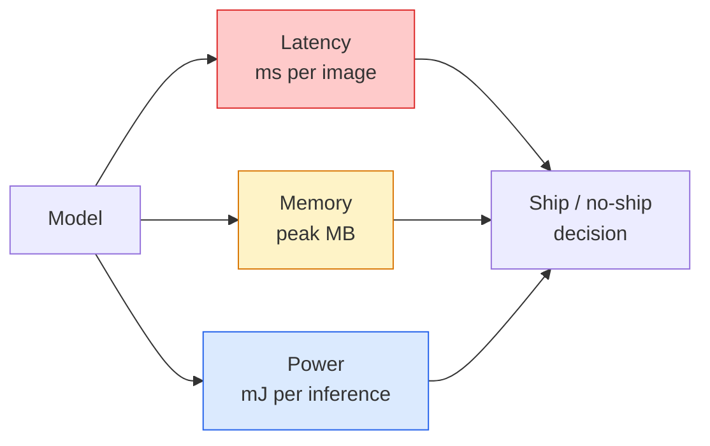

# リアルタイムビジョン — エッジデプロイ

> エッジ推論とは、精度90%のモデルを2GBのRAMを持つデバイスで30fpsで動かす技術だ。精度の1パーセントポイントは、レイテンシのミリ秒と引き換えにされる。


## 学習目標

- 任意のPyTorchモデルの推論レイテンシ、ピークメモリ、スループットを計測し、FLOPs/パラメータ数/レイテンシのトレードオフを読み取る
- PyTorchのポストトレーニング量子化を使ってビジョンモデルをINT8に量子化し、精度低下が1%未満であることを検証する
- ONNXにエクスポートしてONNX RuntimeまたはTensorRTでコンパイルする。最も一般的な3つのエクスポートの失敗とその修正方法を挙げる
- エッジの制約に対してMobileNetV3、EfficientNet-Lite、ConvNeXt-Tiny、MobileViTのどれを選ぶべきか説明する

## 問題

トレーニング時のビジョンモデルは浮動小数点の塊だ。パラメータ数1億、フォワードパスあたり10GFLOP、VRAM 2GB。これらはどれも、スマートフォン、車のインフォテインメントシステム、産業用カメラ、ドローンには収まらない。ビジョンシステムを出荷するとは、同じ予測を100倍小さい予算に収めることを意味する。

3つのノブが大部分の仕事をする。モデルの選択（同じレシピを持つより小さいアーキテクチャ）、量子化（FP32の代わりにINT8）、そして推論ランタイム（ONNX Runtime、TensorRT、Core ML、TFLite）だ。これらを正しく使うことが、ワークステーションで動くデモと、30ドルのカメラモジュールに搭載される製品との差を生む。

このレッスンでは最初に計測の規律を確立し（計測できないものは最適化できない）、次に3つのノブを説明する。目標はすべてのエッジランタイムを学ぶことではなく、どんなレバーが存在し、各レバーが期待通りに動作していることをどうやって検証するかを知ることだ。

## 概念

### 3つの予算



- **レイテンシ**: p50、p95、p99。p50だけを平均すると、リアルタイムシステムにとって重要なテール動作が隠れる。
- **ピークメモリ**: デバイスが目にする最大値であり、定常状態の平均ではない。組み込みターゲットではOOMが致命的なので重要だ。
- **電力/エネルギー**: バッテリー駆動デバイスでの推論1回あたりのミリジュール。しばしばCPU/GPU使用率×時間で近似される。

（モデル、レイテンシ、メモリ、精度）のテーブルが、エッジの意思決定の根拠になる。すべてのセルはワークステーションではなく、ターゲットデバイス上で計測する。

### 計測の規律

すべてのエッジプロファイルが守るべき3つのルール:

1. 計測の前に5〜10回のダミーフォワードパスでモデルを**ウォームアップ**する。コールドキャッシュとJITコンパイルが最初の数値を代表でないものにする。
2. タイムブロックの前後で`torch.cuda.synchronize()`を使ってGPUワークロードを**同期**する。これなしではカーネル実行ではなくカーネルディスパッチを計測することになる。
3. 入力サイズを本番の解像度に**固定**する。224x224でのレイテンシは512x512でのレイテンシではない。

### プロキシとしてのFLOPs

FLOPs（推論1回あたりの浮動小数点演算数）は、安価でデバイス非依存のレイテンシのプロキシだ。アーキテクチャ比較には有用だが、絶対的なウォールクロックとしては誤解を招く。FLOPs数が10%多いモデルが実際には2倍高速な場合がある。ハードウェアフレンドリーな演算（デプスワイズ畳み込みはコンパイルが良好で、大きな7×7畳み込みはそうでない）を使っているからだ。

ルール: アーキテクチャ探索にはFLOPsを使い、デプロイの意思決定にはデバイス上のレイテンシを使う。

### 量子化を1段落で

FP32の重みと活性化をINT8で置き換える。モデルサイズが4倍削減され、メモリ帯域幅が4倍削減され、INT8カーネルを持つハードウェア（すべての最新モバイルSoC、Tensor Coresを持つすべてのNVIDIA GPU）では計算が2〜4倍削減される。ビジョンタスクでの精度低下は、ポストトレーニング静的量子化で通常0.1〜1パーセントポイントだ。

種類:

- **動的量子化** — 重みをINT8に量子化し、活性化はFPで計算する。簡単で、わずかな高速化。
- **静的量子化（ポストトレーニング）** — 重みを量子化し、小さな較正セットで活性化の範囲を較正する。動的よりはるかに高速。
- **量子化アウェアトレーニング（QAT）** — トレーニング中に量子化をシミュレートし、モデルがそれを学習できるようにする。最高の精度だが、ラベル付きデータが必要。

ビジョンでは、ポストトレーニング静的量子化が5%の労力で95%のメリットをもたらす。PTQからの精度低下が許容できない場合のみQATを使用する。

### プルーニングと蒸留

- **プルーニング** — 重要度の低い重み（マグニチュードベース）またはチャネル（構造化）を削除する。過剰パラメータ化されたモデルでは効果的だが、すでにコンパクトなアーキテクチャにはあまり有用でない。
- **蒸留** — 大きな教師モデルのロジットを模倣するように小さな生徒モデルをトレーニングする。モデルを縮小することで失われた精度の大部分を回復することが多い。本番エッジモデルの標準手法。

### 推論ランタイム

- **PyTorch eager** — 遅く、デプロイには不向き。開発のみに使用する。
- **TorchScript** — レガシー。`torch.compile`とONNXエクスポートに取って代わられた。
- **ONNX Runtime** — ニュートラルなランタイム。CPU、CUDA、CoreML、TensorRT、OpenVINOすべてにONNXプロバイダーがある。ここから始める。
- **TensorRT** — NVIDIAのコンパイラ。NVIDIA GPU（ワークステーションとJetson）での最高レイテンシ。ONNX RuntimeまたはスタンドアロンでONNXと統合される。
- **Core ML** — iOSとmacOS向けAppleのランタイム。`.mlmodel`または`.mlpackage`が必要。
- **TFLite** — AndroidとARM向けGoogleのランタイム。`.tflite`が必要。
- **OpenVINO** — CPU/VPU向けIntelのランタイム。`.xml` + `.bin`が必要。

実際には: PyTorch → ONNX → ターゲット用ランタイムを選択する流れになる。ONNXは共通言語だ。

### エッジアーキテクチャ選択表

| 予算 | モデル | 理由 |
|--------|-------|-----|
| 3Mパラメータ未満 | MobileNetV3-Small | どこでもコンパイルでき、良いベースライン |
| 3〜10M | EfficientNet-Lite-B0 | TFLiteでパラメータあたり最高精度 |
| 10〜20M | ConvNeXt-Tiny | パラメータあたり最高精度、CPUフレンドリー |
| 20〜30M | MobileViT-SまたはEfficientViT | ImageNet精度を持つトランスフォーマー |
| 30〜80M | Swin-V2-Tiny | スタックがウィンドウアテンションをサポートする場合 |

特別な理由がない限り、これらすべてをINT8に量子化する。

## 実装する

### ステップ1: レイテンシを正確に計測する

```python
import time
import torch

def measure_latency(model, input_shape, device="cpu", warmup=10, iters=50):
    model = model.to(device).eval()
    x = torch.randn(input_shape, device=device)
    with torch.no_grad():
        for _ in range(warmup):
            model(x)
        if device == "cuda":
            torch.cuda.synchronize()
        times = []
        for _ in range(iters):
            if device == "cuda":
                torch.cuda.synchronize()
            t0 = time.perf_counter()
            model(x)
            if device == "cuda":
                torch.cuda.synchronize()
            times.append((time.perf_counter() - t0) * 1000)
    times.sort()
    return {
        "p50_ms": times[len(times) // 2],
        "p95_ms": times[int(len(times) * 0.95)],
        "p99_ms": times[int(len(times) * 0.99)],
        "mean_ms": sum(times) / len(times),
    }
```

ウォームアップ、同期、`time.perf_counter()`を使用する。平均だけでなくパーセンタイルを報告する。

### ステップ2: パラメータ数とFLOPカウント

```python
def parameter_count(model):
    return sum(p.numel() for p in model.parameters())

def flops_estimate(model, input_shape):
    """
    Rough FLOP count for a conv/linear-only model. For production use `fvcore` or `ptflops`.
    """
    total = 0
    def conv_hook(m, inp, out):
        nonlocal total
        c_out, c_in, kh, kw = m.weight.shape
        h, w = out.shape[-2:]
        total += 2 * c_in * c_out * kh * kw * h * w
    def linear_hook(m, inp, out):
        nonlocal total
        total += 2 * m.in_features * m.out_features
    hooks = []
    for m in model.modules():
        if isinstance(m, torch.nn.Conv2d):
            hooks.append(m.register_forward_hook(conv_hook))
        elif isinstance(m, torch.nn.Linear):
            hooks.append(m.register_forward_hook(linear_hook))
    model.eval()
    with torch.no_grad():
        model(torch.randn(input_shape))
    for h in hooks:
        h.remove()
    return total
```

実際のプロジェクトでは`fvcore.nn.FlopCountAnalysis`または`ptflops`を使用する。これらはすべてのモジュールタイプを正しく処理する。

### ステップ3: ポストトレーニング静的量子化

```python
def quantise_ptq(model, calibration_loader, backend="x86"):
    import torch.ao.quantization as tq
    model = model.eval().cpu()
    model.qconfig = tq.get_default_qconfig(backend)
    tq.prepare(model, inplace=True)
    with torch.no_grad():
        for x, _ in calibration_loader:
            model(x)
    tq.convert(model, inplace=True)
    return model
```

3ステップ: 設定、準備（オブザーバーの挿入）、実データでの較正、変換（融合＋量子化）。モデルが融合済みである必要がある（`Conv -> BN -> ReLU` → `ConvBnReLU`）。これは`torch.ao.quantization.fuse_modules`が処理する。

### ステップ4: ONNXへのエクスポート

```python
def export_onnx(model, sample_input, path="model.onnx"):
    model = model.eval()
    torch.onnx.export(
        model,
        sample_input,
        path,
        input_names=["input"],
        output_names=["output"],
        dynamic_axes={"input": {0: "batch"}, "output": {0: "batch"}},
        opset_version=17,
    )
    return path
```

`opset_version=17`は2026年の安全なデフォルトだ。`dynamic_axes`で任意のバッチサイズでONNXモデルを実行できる。

### ステップ5: 各方式のベンチマークと比較

```python
import torch.nn as nn
from torchvision.models import mobilenet_v3_small

def compare_regimes():
    model = mobilenet_v3_small(weights=None, num_classes=10)
    params = parameter_count(model)
    flops = flops_estimate(model, (1, 3, 224, 224))
    lat_fp32 = measure_latency(model, (1, 3, 224, 224), device="cpu")
    print(f"FP32 MobileNetV3-Small: {params:,} params  {flops/1e9:.2f} GFLOPs  "
          f"p50={lat_fp32['p50_ms']:.2f}ms  p95={lat_fp32['p95_ms']:.2f}ms")
```

`resnet50`、`efficientnet_v2_s`、`convnext_tiny`に対して同じ関数を実行すれば、デプロイの意思決定に必要な比較テーブルができる。

## 使ってみる

本番スタックは3つのパスのいずれかに収束する:

- **Webサーバーレス**: PyTorch → ONNX → ONNX Runtime（CPUまたはCUDAプロバイダー）。最も簡単で、ほとんどのケースに十分。
- **NVIDIAエッジ（Jetson、GPUサーバー）**: PyTorch → ONNX → TensorRT。最高レイテンシだが、エンジニアリングの労力が最も大きい。
- **モバイル**: PyTorch → ONNX → Core ML（iOS）またはTFLite（Android）。エクスポート前に量子化する。

計測には、`torch-tb-profiler`、`nvprof`/`nsys`、macOSのInstrumentsがレイヤーごとの内訳を提供する。`benchmark_app`（OpenVINO）と`trtexec`（TensorRT）はスタンドアロンCLIの数値を提供する。

## 成果物を出す

このレッスンで生成するもの:

- `outputs/prompt-edge-deployment-planner.md` — ターゲットデバイスとレイテンシSLAを与えると、バックボーン、量子化戦略、ランタイムを選択するプロンプト。
- `outputs/skill-latency-profiler.md` — ウォームアップ、同期、パーセンタイル、メモリ追跡を含む完全なレイテンシベンチマークスクリプトを書くスキル。

## 演習

1. **(易)** `resnet18`、`mobilenet_v3_small`、`efficientnet_v2_s`、`convnext_tiny`の224x224でのCPU上のp50レイテンシを計測する。テーブルを報告し、精度/ms比が最良のアーキテクチャを特定する。
2. **(中)** `mobilenet_v3_small`にポストトレーニング静的量子化を適用する。FP32とINT8のレイテンシとCIFAR-10またはその他のホールドアウトサブセットでの精度低下を報告する。
3. **(難)** `convnext_tiny`をONNXにエクスポートし、`CPUExecutionProvider`で`onnxruntime`を通して実行し、PyTorch eagerベースラインとレイテンシを比較する。ONNX Runtimeがより速い最初のレイヤーを特定し、その理由を説明する。

## キーワード

| 用語 | よく言われる表現 | 実際の意味 |
|------|----------------|----------------------|
| レイテンシ | 「どのくらい速いか」 | 入力から出力までの時間。平均ではなくp50/p95/p99パーセンタイル |
| FLOPs | 「モデルサイズ」 | フォワードパスあたりの浮動小数点演算数。計算コストの大まかなプロキシ |
| INT8量子化 | 「8ビット」 | FP32の重み/活性化を8ビット整数に置き換える。約4倍小さく、2〜4倍速い |
| PTQ | 「ポストトレーニング量子化」 | 再トレーニングなしで学習済みモデルを量子化する。簡単で通常十分 |
| QAT | 「量子化アウェアトレーニング」 | トレーニング中に量子化をシミュレートする。最高精度だが、ラベル付きデータが必要 |
| ONNX | 「ニュートラルフォーマット」 | すべての主要な推論ランタイムがサポートするモデル交換フォーマット |
| TensorRT | 「NVIDIAコンパイラ」 | NVIDIA GPU向けの最適化エンジンにONNXをコンパイルする |
| 蒸留 | 「教師→生徒」 | 大きなモデルのロジットを模倣するように小さなモデルをトレーニングする。失われた精度の大部分を回復する |

## 参考資料

- [EfficientNet (Tan & Le, 2019)](https://arxiv.org/abs/1905.11946) — 効率的なアーキテクチャのための複合スケーリング
- [MobileNetV3 (Howard et al., 2019)](https://arxiv.org/abs/1905.02244) — h-swishとsqueeze-exciteを持つモバイルファーストアーキテクチャ
- [A Practical Guide to TensorRT Optimization (NVIDIA)](https://developer.nvidia.com/blog/accelerating-model-inference-with-tensorrt-tips-and-best-practices-for-pytorch-users/) — 実際に論文の数値を出す方法
- [ONNX Runtime docs](https://onnxruntime.ai/docs/) — 量子化、グラフ最適化、プロバイダー選択
