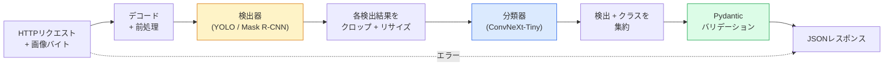

# 完全なビジョンパイプラインの構築 — 総合演習

> 本番ビジョンシステムは、データコントラクトで連結されたモデルとルールの連鎖だ。各パーツはこのフェーズで揃っている。総合演習はそれらをエンドツーエンドで繋ぎ合わせる。


## 学習目標

- 物体を検出し、分類し、構造化JSONを出力する本番ビジョンパイプラインを設計する。すべての失敗パスを処理する
- 検出器（Mask R-CNNまたはYOLO）、分類器（ConvNeXt-Tiny）、データコントラクト（Pydantic）を1つのサービスに組み込む
- エンドツーエンドのパイプラインをベンチマークし、最初のボトルネック（通常は前処理、次に検出器）を特定する
- 画像アップロードを受け付け、パイプラインを実行し、分類付き検出結果を返す最小限のFastAPIサービスを出荷する

## 問題

個々のビジョンモデルは有用だが、ビジョン製品はそれらの連鎖だ。小売棚の監査は検出器＋商品分類器＋価格OCRパイプラインだ。自律走行は2D検出器＋3D検出器＋セグメンタ＋トラッカー＋プランナーだ。医療プレスクリーニングはセグメンタ＋領域分類器＋臨床医UIだ。

これらの連鎖を繋ぎ合わせることが、MLプロトタイプと製品を分けるものだ。モデル間のすべてのインターフェースは新しいバグの温床だ。すべての座標変換、すべての正規化、すべてのマスクリサイズはサイレントな失敗候補だ。パイプラインはその最も弱いインターフェースと同じ強さしかない。

この総合演習では最小限のパイプラインを設定する。検出＋分類＋構造化出力＋サービングレイヤー。フェーズ4の他のすべてはこのスケルトンに組み込まれる。Mask R-CNNをYOLOv8に交換し、OCRヘッドを追加し、セグメンテーションブランチを追加し、トラッカーを追加する。アーキテクチャは安定していて、パーツはプラガブルだ。

## 概念

### パイプライン



7つのステージ。2つのモデルステージが重く、残りの5つのステージにバグが潜む。

### Pydanticによるデータコントラクト

すべてのモデル境界を型付きオブジェクトにする。これによってサイレントな失敗が大きな失敗に変わる。

```
Detection(
    box: tuple[float, float, float, float],   # (x1, y1, x2, y2), 絶対ピクセル
    score: float,                              # [0, 1]
    class_id: int,                             # 検出器のラベルマップから
    mask: Optional[list[list[int]]],           # RLEエンコードされている場合
)

PipelineResult(
    image_id: str,
    detections: list[Detection],
    classifications: list[Classification],
    inference_ms: float,
)
```

検出器がボックスを`(x1, y1, x2, y2)`の代わりに`(cx, cy, w, h)`で返した場合、Pydanticの検証が境界で失敗し、空の領域をサイレントに返すダウンストリームのクロップをデバッグする代わりにすぐに気づく。

### レイテンシの分布

ほぼすべてのビジョンパイプラインで3つの真実が成り立つ:

1. **前処理がしばしば最大の単一ブロックだ。** JPEGのデコード、色空間変換、リサイズ — これらはCPUバウンドで忘れがちだ。
2. **検出器がGPU時間を支配する。** GPU時間の70〜90%は検出フォワードパスにある。
3. **後処理（NMS、RLEエンコード/デコード）はGPUでは安価だが、CPUでは高コストだ。** 常に実際のターゲットでプロファイルする。

分布を知ることが、最適化を優先順位付けされたリストに変える。

### 失敗モード

- **検出なし** — 空のリストを返し、クラッシュしない。ログに記録する。
- **境界外のボックス** — クロップ前にイメージサイズにクランプする。
- **小さすぎるクロップ** — 分類器の最小入力より小さいボックスの分類をスキップする。
- **破損したアップロード** — 汎用的な`try/except`ではなく、特定のエラーコードで400レスポンスを返す。
- **モデルのロード失敗** — 最初のリクエスト時ではなく、サービス起動時に失敗させる。

本番パイプラインは、失敗を隠す汎用`try/except`を書かずにこれらそれぞれを処理する。すべての失敗には名前付きコードとレスポンスがある。

### バッチ処理

本番サービスは複数のクライアントにサービスを提供する。リクエスト間で検出と分類をバッチ処理することでスループットが倍増する。トレードオフ: バッチが溜まるのを待つ追加レイテンシ。典型的な設定: 最大20msリクエストを収集し、バッチ処理し、レスポンスを配布する。`torchserve`と`triton`はこれをネイティブに行う。予測可能な負荷を持つ小さなサービスは独自のマイクロバッチャーを実装する。

## 実装する

### ステップ1: データコントラクト

```python
from pydantic import BaseModel, Field
from typing import List, Optional, Tuple

class Detection(BaseModel):
    box: Tuple[float, float, float, float]
    score: float = Field(ge=0, le=1)
    class_id: int = Field(ge=0)
    mask_rle: Optional[str] = None


class Classification(BaseModel):
    detection_index: int
    class_id: int
    class_name: str
    score: float = Field(ge=0, le=1)


class PipelineResult(BaseModel):
    image_id: str
    detections: List[Detection]
    classifications: List[Classification]
    inference_ms: float
```

5秒のコードで、深刻なパイプラインでの1時間のデバッグを節約できる。

### ステップ2: 最小限のPipelineクラス

```python
import time
import numpy as np
import torch
from PIL import Image

class VisionPipeline:
    def __init__(self, detector, classifier, class_names,
                 device="cpu", min_crop=32):
        self.detector = detector.to(device).eval()
        self.classifier = classifier.to(device).eval()
        self.class_names = class_names
        self.device = device
        self.min_crop = min_crop

    def preprocess(self, image):
        """
        image: PIL.Image or np.ndarray (H, W, 3) uint8
        returns: CHW float tensor on device
        """
        if isinstance(image, Image.Image):
            image = np.asarray(image.convert("RGB"))
        tensor = torch.from_numpy(image).permute(2, 0, 1).float() / 255.0
        return tensor.to(self.device)

    @torch.no_grad()
    def detect(self, image_tensor):
        return self.detector([image_tensor])[0]

    @torch.no_grad()
    def classify(self, crops):
        if len(crops) == 0:
            return []
        batch = torch.stack(crops).to(self.device)
        logits = self.classifier(batch)
        probs = logits.softmax(-1)
        scores, cls = probs.max(-1)
        return list(zip(cls.tolist(), scores.tolist()))

    def run(self, image, image_id="anonymous"):
        t0 = time.perf_counter()
        tensor = self.preprocess(image)
        det = self.detect(tensor)

        crops = []
        detections = []
        valid_indices = []
        for i, (box, score, cls) in enumerate(zip(det["boxes"], det["scores"], det["labels"])):
            x1, y1, x2, y2 = [max(0, int(b)) for b in box.tolist()]
            x2 = min(x2, tensor.shape[-1])
            y2 = min(y2, tensor.shape[-2])
            detections.append(Detection(
                box=(x1, y1, x2, y2),
                score=float(score),
                class_id=int(cls),
            ))
            if (x2 - x1) < self.min_crop or (y2 - y1) < self.min_crop:
                continue
            crop = tensor[:, y1:y2, x1:x2]
            crop = torch.nn.functional.interpolate(
                crop.unsqueeze(0),
                size=(224, 224),
                mode="bilinear",
                align_corners=False,
            )[0]
            crops.append(crop)
            valid_indices.append(i)

        class_preds = self.classify(crops)

        classifications = []
        for valid_idx, (cls_id, cls_score) in zip(valid_indices, class_preds):
            classifications.append(Classification(
                detection_index=valid_idx,
                class_id=int(cls_id),
                class_name=self.class_names[cls_id],
                score=float(cls_score),
            ))

        return PipelineResult(
            image_id=image_id,
            detections=detections,
            classifications=classifications,
            inference_ms=(time.perf_counter() - t0) * 1000,
        )
```

すべてのインターフェースが型付きだ。すべての失敗パスに特定の処理の決定がある。

### ステップ3: 検出器と分類器を繋ぎ合わせる

```python
from torchvision.models.detection import maskrcnn_resnet50_fpn_v2
from torchvision.models import convnext_tiny

# トレーニングなしでリアルなパイプラインを作るためにImageNet事前学習済み重みを使用
detector = maskrcnn_resnet50_fpn_v2(weights="DEFAULT")
classifier = convnext_tiny(weights="DEFAULT")
class_names = [f"imagenet_class_{i}" for i in range(1000)]

pipe = VisionPipeline(detector, classifier, class_names)

# 合成画像でのスモークテスト
test_image = (np.random.rand(400, 600, 3) * 255).astype(np.uint8)
result = pipe.run(test_image, image_id="demo")
print(result.model_dump_json(indent=2)[:500])
```

### ステップ4: FastAPIサービス

```python
from fastapi import FastAPI, UploadFile, HTTPException
from io import BytesIO

app = FastAPI()
pipe = None  # 起動時に初期化

@app.on_event("startup")
def load():
    global pipe
    detector = maskrcnn_resnet50_fpn_v2(weights="DEFAULT").eval()
    classifier = convnext_tiny(weights="DEFAULT").eval()
    pipe = VisionPipeline(detector, classifier, class_names=[f"c{i}" for i in range(1000)])

@app.post("/detect")
async def detect_endpoint(file: UploadFile):
    if file.content_type not in {"image/jpeg", "image/png", "image/webp"}:
        raise HTTPException(status_code=400, detail="unsupported image type")
    data = await file.read()
    try:
        img = Image.open(BytesIO(data)).convert("RGB")
    except Exception:
        raise HTTPException(status_code=400, detail="cannot decode image")
    result = pipe.run(img, image_id=file.filename or "upload")
    return result.model_dump()
```

`uvicorn main:app --host 0.0.0.0 --port 8000`で実行する。`curl -F 'file=@dog.jpg' http://localhost:8000/detect`でテストする。

### ステップ5: パイプラインのベンチマーク

```python
import time

def benchmark(pipe, num_runs=20, image_size=(400, 600)):
    img = (np.random.rand(*image_size, 3) * 255).astype(np.uint8)
    pipe.run(img)  # ウォームアップ

    stages = {"preprocess": [], "detect": [], "classify": [], "total": []}
    for _ in range(num_runs):
        t0 = time.perf_counter()
        tensor = pipe.preprocess(img)
        t1 = time.perf_counter()
        det = pipe.detect(tensor)
        t2 = time.perf_counter()
        crops = []
        for box in det["boxes"]:
            x1, y1, x2, y2 = [max(0, int(b)) for b in box.tolist()]
            x2 = min(x2, tensor.shape[-1])
            y2 = min(y2, tensor.shape[-2])
            if (x2 - x1) >= pipe.min_crop and (y2 - y1) >= pipe.min_crop:
                crop = tensor[:, y1:y2, x1:x2]
                crop = torch.nn.functional.interpolate(
                    crop.unsqueeze(0), size=(224, 224), mode="bilinear", align_corners=False
                )[0]
                crops.append(crop)
        pipe.classify(crops)
        t3 = time.perf_counter()
        stages["preprocess"].append((t1 - t0) * 1000)
        stages["detect"].append((t2 - t1) * 1000)
        stages["classify"].append((t3 - t2) * 1000)
        stages["total"].append((t3 - t0) * 1000)

    for stage, times in stages.items():
        times.sort()
        print(f"{stage:12s}  p50={times[len(times)//2]:7.1f} ms  p95={times[int(len(times)*0.95)]:7.1f} ms")
```

CPUでの典型的な出力: 前処理約3ms、検出300〜500ms、分類20〜40ms、合計350〜550ms。GPUでは検出が20〜40msになり、前処理＋分類が相対的により重要になる。

## 使ってみる

本番テンプレートは同じ構造に収束し、さらに以下が追加される:

- **モデルのバージョニング** — レスポンスには常にモデル名と重みのハッシュを記録する。
- **リクエストごとのトレースID** — すべてのリクエストのすべてのステージのタイミングをログに記録し、遅いレスポンスをステージと相関させられるようにする。
- **フォールバックパス** — 分類器がタイムアウトした場合、リクエスト全体を失敗させるのではなく、分類なしで検出結果を返す。
- **安全フィルター** — NSFW/PIIフィルターは分類後、レスポンスがサービスを離れる前に実行する。
- **バッチエンドポイント** — バルク処理用の画像URLリストを受け付ける`/detect_batch`。

本番サービングには、`torchserve`、`Triton Inference Server`、`BentoML`がバッチ処理、バージョニング、メトリクス、ヘルスチェックをすぐに使える形で提供する。`FastAPI`を直接実行するのはプロトタイプや小規模製品には十分だ。

## 成果物を出す

このレッスンで生成するもの:

- `outputs/prompt-vision-service-shape-reviewer.md` — ビジョンサービスのコードをコントラクト/レスポンス形状の違反についてレビューし、最初の破壊的なバグを指摘するプロンプト。
- `outputs/skill-pipeline-budget-planner.md` — ターゲットレイテンシとスループットを与えると、すべてのパイプラインステージに時間予算を割り当て、どのステージが最初に予算を超えるかをフラグするスキル。

## 演習

1. **(易)** 任意のオープンデータセットから10枚の画像でパイプラインを実行する。ステージごとの平均時間と、画像ごとの検出数の分布を報告する。
2. **(中)** `Detection`にマスク出力フィールドを追加してRLEとしてエンコードする。10物体の画像でもJSONが1MB未満に収まることを検証する。
3. **(難)** 分類器の前にマイクロバッチャーを追加する。最大10msクロップを収集し、1つのGPU呼び出しで分類し、リクエストごとに結果を返す。毎秒5つの並列リクエストでのスループット向上と追加されたレイテンシを計測する。

## キーワード

| 用語 | よく言われる表現 | 実際の意味 |
|------|----------------|----------------------|
| パイプライン | 「システム」 | 前処理、推論、後処理の順序付けられた連鎖。各ペア間に型付きインターフェース |
| データコントラクト | 「スキーマ」 | すべてのステージの入出力が準拠するPydantic/データクラス定義。境界での統合バグを検出 |
| 前処理 | 「モデルの前」 | デコード、色変換、リサイズ、正規化。通常最大のCPU時間シンク |
| 後処理 | 「モデルの後」 | NMS、マスクリサイズ、閾値処理、RLEエンコード。GPUでは安価、CPUでは高コスト |
| マイクロバッチャー | 「集めてフォワード」 | 固定ウィンドウの間複数のリクエストを待ち、単一のバッチフォワードパスを実行するアグリゲータ |
| トレースID | 「リクエストID」 | すべてのステージでログに記録されるリクエストごとの識別子。遅いリクエストのエンドツーエンドのトレースを可能にする |
| 失敗コード | 「名前付きエラー」 | 汎用500の代わりに失敗クラスごとの特定のエラーコード。クライアントの再試行ロジックを可能にする |
| ヘルスチェック | 「準備プローブ」 | サービスが応答できるかどうかを報告する軽量エンドポイント。ロードバランサーが依存する |

## 参考資料

- [Full Stack Deep Learning — Deploying Models](https://fullstackdeeplearning.com/course/2022/lecture-5-deployment/) — 本番MLデプロイの決定版概要
- [BentoML docs](https://docs.bentoml.com) — バッチ処理、バージョニング、メトリクスを持つサービングフレームワーク
- [torchserve docs](https://pytorch.org/serve/) — PyTorchの公式サービングライブラリ
- [NVIDIA Triton Inference Server](https://developer.nvidia.com/triton-inference-server) — バッチ処理とマルチモデルサポートを持つ高スループットサービング
