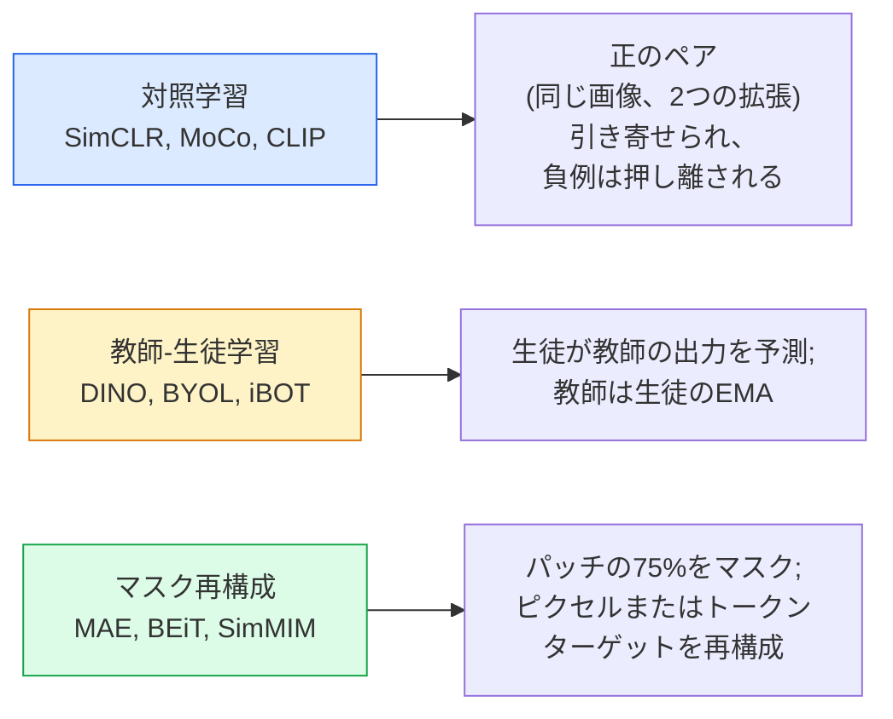

# 自己教師あり学習 — SimCLR、DINO、MAE

> ラベルが教師あり学習のボトルネックだ。自己教師あり事前学習はそれを排除する。1億枚のラベルなし画像から視覚的特徴を学習し、1万枚のラベル付き画像でファインチューニングする。


## 学習目標

- 3つの主要な自己教師ありファミリー（対照学習（SimCLR）、教師−生徒学習（DINO）、マスク再構成（MAE））を追い、それぞれが何を最適化するかを述べる
- InfoNCE損失をゼロから実装し、バッチサイズ512が機能して32が失敗する理由を説明する
- MAEの75%マスク率がなぜ任意ではなく、テキスト向けのBERTの15%とどう異なるかを説明する
- DINOv2またはMAE ImageNetチェックポイントを線形プロービングとゼロショット検索に使用する

## 問題

教師ありImageNetには130万枚のラベル付き画像があり、注釈付けには推定1000万ドルかかった。医療・産業データセットはより小さく、ラベル付けも高コストだ。すべてのビジョンチームが問いかける。安価なラベルなしデータ（YouTubeフレーム、ウェブクロール、ウェブカメラ映像、衛星画像）で事前学習し、小さなラベル付きセットでファインチューニングできるか？

自己教師あり学習がその答えだ。LAIONまたはJFTでトレーニングされた最新の自己教師ありViTは、ファインチューニング時に教師ありImageNetの精度に並ぶか上回る。また、教師ありImageNetの事前学習よりも下流タスク（検出、セグメンテーション、深度）への転移が優れている。DINOv2（Meta、2023年）とMAE（Meta、2022年）が転移可能なビジョン特徴の現在の本番デフォルトだ。

概念的なシフトは、事前タスク（モデルがトレーニングされること）が下流タスクである必要がないということだ。重要なのは、有用な特徴を学習するようモデルを強制することだ。グレースケール画像の色を予測する、画像を回転させてモデルに回転を分類させる、パッチをマスクして再構成する — すべて機能してきた。スケールする3つのアプローチが対照学習、教師−生徒蒸留、マスク再構成だ。

## 概念

### 3つのファミリー



### 対照学習（SimCLR）

1枚の画像を取り、2つのランダムな拡張を適用し、2つのビューを得る。両方を同じエンコーダーと射影ヘッドに通す。「これら2つの埋め込みは近いはず」と「この埋め込みはバッチ内のすべての他の画像の埋め込みから遠いはず」という損失を最小化する。

```
バッチあたり2Nビューの正のペア(z_i, z_j)に対する損失:

   L_ij = -log( exp(sim(z_i, z_j) / tau) / sum_k in batch \ {i} exp(sim(z_i, z_k) / tau) )

sim = コサイン類似度
tau = 温度（標準は0.1）
```

これがInfoNCE損失だ。正例1つに対して多くの負例が必要なので、バッチサイズが重要だ — SimCLRはバッチサイズ512〜8192が必要だ。MoCoは過去のバッチのモメンタムキューを導入し、負例の数をバッチサイズから切り離した。

### 教師−生徒学習（DINO）

同じアーキテクチャを持つ2つのネットワーク: 生徒と教師。教師は生徒の重みの指数移動平均（EMA）だ。両方が画像の拡張ビューを見る。生徒の出力が教師のものに一致するようトレーニングされる — 明示的な負例なし。

```
loss = CE( student_output(view_1),  teacher_output(view_2) )
     + CE( student_output(view_2),  teacher_output(view_1) )

teacher_weights = m * teacher_weights + (1 - m) * student_weights   (m ≈ 0.996)
```

「一定を予測する」方向に崩壊しない理由: 教師の出力はセンタリングされ（次元ごとの平均を引く）、シャープ化される（小さな温度で割る）。センタリングは1つの次元が支配するのを防ぎ、シャープ化は一様への出力崩壊を防ぐ。

DINOはDINOv2がスケールアップするものだ。1億4200万枚のキュレートされた画像で。生成された特徴はゼロショット視覚検索と密な予測の現在のSOTAだ。

### マスク再構成（MAE）

ViT入力のパッチの75%をマスクする。見えるパッチの25%だけをエンコーダーに通す。小さなデコーダーがエンコーダーの出力とマスクされた位置のマスクトークンを受け取り、マスクされたパッチのピクセルを再構成するようトレーニングされる。

```
エンコーダー: 可視パッチの25% → 特徴
デコーダー: 特徴 + マスクされた位置のマスクトークン → 再構成されたピクセル
損失: マスクされたパッチのみでの再構成とオリジナルピクセル間のMSE
```

MAEを機能させる主要な設計選択:

- **75%マスク率** — 高い。エンコーダーに意味的特徴を学習させる強制。25%の再構成はほぼ自明だ（隣接ピクセルが非常に相関しているためCNNで十分だろう）。
- **非対称エンコーダー/デコーダー** — 大きなViTエンコーダーは可視パッチのみを見る。小さなデコーダー（8層、512次元）が再構成を処理する。単純なBEiTより3倍速い事前学習。
- **ピクセル空間再構成ターゲット** — BEiTのトークン化ターゲットより単純で、ViTでより良く機能する。

事前学習後はデコーダーを破棄する。エンコーダーが特徴抽出器だ。

### 75%であって15%でない理由

BERTはトークンの15%をマスクする。MAEはパッチの75%をマスクする。違いは情報密度だ。

- 自然言語はトークンごとのエントロピーが高い。トークンの15%を予測することは、各マスクされた位置に多くの可能性のある補完があるため依然として難しい。
- 画像パッチのエントロピーは低い — マスクされていない近傍がマスクされたパッチのピクセルをほぼ正確に決定することが多い。予測に意味的理解が必要になるよう、積極的にマスクしなければならない。

75%は、単純な空間外挿でタスクを解けないほど高く、エンコーダーは画像内容を表現しなければならない。

### 線形プローブ評価

自己教師あり事前学習の後、標準評価は**線形プローブ**だ: エンコーダーを固定し、上にのみ単一の線形分類器をImageNetラベルでトレーニングする。Top-1精度を報告する。

- SimCLR ResNet-50: 〜71%（2020年）
- DINO ViT-S/16: 〜77%（2021年）
- MAE ViT-L/16: 〜76%（2022年）
- DINOv2 ViT-g/14: 〜86%（2023年）

線形プローブは特徴品質の純粋な尺度だ。ファインチューニングは通常2〜5ポイント追加されるが、ヘッド再トレーニングの効果も混入する。

## 実装する

### ステップ1: 2ビュー拡張パイプライン

```python
import torch
import torchvision.transforms as T

two_view_train = lambda: T.Compose([
    T.RandomResizedCrop(96, scale=(0.2, 1.0)),
    T.RandomHorizontalFlip(),
    T.ColorJitter(0.4, 0.4, 0.4, 0.1),
    T.RandomGrayscale(p=0.2),
    T.ToTensor(),
])


class TwoViewDataset(torch.utils.data.Dataset):
    def __init__(self, base):
        self.base = base
        self.aug = two_view_train()

    def __len__(self):
        return len(self.base)

    def __getitem__(self, i):
        img, _ = self.base[i]
        v1 = self.aug(img)
        v2 = self.aug(img)
        return v1, v2
```

各`__getitem__`が同じ画像の2つの拡張ビューを返す。ラベルは不要だ。

### ステップ2: InfoNCE損失

```python
import torch.nn.functional as F

def info_nce(z1, z2, tau=0.1):
    """
    z1, z2: (N, D) ペアビューのL2正規化埋め込み
    """
    N, D = z1.shape
    z = torch.cat([z1, z2], dim=0)  # (2N, D)
    sim = z @ z.T / tau              # (2N, 2N)

    mask = torch.eye(2 * N, dtype=torch.bool, device=z.device)
    sim = sim.masked_fill(mask, float("-inf"))

    targets = torch.cat([torch.arange(N, 2 * N), torch.arange(0, N)]).to(z.device)
    return F.cross_entropy(sim, targets)
```

呼び出し前に埋め込みをL2正規化する。`tau=0.1`はSimCLRのデフォルト。低いほど損失がシャープになり、より多くの負例が必要になる。

### ステップ3: InfoNCEのサニティチェック

```python
z1 = F.normalize(torch.randn(16, 32), dim=-1)
z2 = z1.clone()
loss_same = info_nce(z1, z2, tau=0.1).item()
z2_random = F.normalize(torch.randn(16, 32), dim=-1)
loss_random = info_nce(z1, z2_random, tau=0.1).item()
print(f"InfoNCE with identical pairs:  {loss_same:.3f}")
print(f"InfoNCE with random pairs:     {loss_random:.3f}")
```

同一ペアは低い損失を与えるはずだ（大きなバッチと低い温度での0に近い）。ランダムなペアはlog(2N-1) = 〜log(31) = 〜3.4を与えるはずだ（16ペアバッチ）。

### ステップ4: MAEスタイルのマスキング

```python
def random_mask_indices(num_patches, mask_ratio=0.75, seed=0):
    g = torch.Generator().manual_seed(seed)
    n_keep = int(num_patches * (1 - mask_ratio))
    perm = torch.randperm(num_patches, generator=g)
    visible = perm[:n_keep]
    masked = perm[n_keep:]
    return visible.sort().values, masked.sort().values


num_patches = 196
visible, masked = random_mask_indices(num_patches, mask_ratio=0.75)
print(f"visible: {len(visible)} / {num_patches}")
print(f"masked:  {len(masked)} / {num_patches}")
```

シンプルで速く、与えられたシードに対して決定的だ。実際のMAE実装はこれをバッチ処理し、サンプルごとのマスクを保持する。

## 使ってみる

2026年の本番標準はDINOv2だ:

```python
import torch
from transformers import AutoImageProcessor, AutoModel

processor = AutoImageProcessor.from_pretrained("facebook/dinov2-base")
model = AutoModel.from_pretrained("facebook/dinov2-base")
model.eval()

# ゼロショット検索のための画像ごとの埋め込み
with torch.no_grad():
    inputs = processor(images=[pil_image], return_tensors="pt")
    outputs = model(**inputs)
    embedding = outputs.last_hidden_state[:, 0]  # CLSトークン
```

得られた768次元の埋め込みは、現代の画像検索、密な対応、ゼロショット転移パイプラインのバックボーンだ。下流タスクへのファインチューニングはほとんどの場合、線形ヘッド以上は必要ない。

画像テキスト埋め込みには、SigLIPまたはOpenCLIPが同等品だ。MAEスタイルのファインチューニングには、`timm`リポジトリがすべてのMAEチェックポイントを提供する。

## 成果物を出す

このレッスンで生成するもの:

- `outputs/prompt-ssl-pretraining-picker.md` — データセットサイズ、計算量、下流タスクを与えると、SimCLR/MAE/DINOv2を選択するプロンプト。
- `outputs/skill-linear-probe-runner.md` — 任意の固定エンコーダー＋ラベル付きデータセットに対して線形プローブ評価を書くスキル。

## 演習

1. **(易)** 適切にアライメントされた埋め込みに対して温度を下げるとInfoNCE損失が下がり、ランダムな埋め込みに対して温度を下げると上がることを検証する。`tau in [0.05, 0.1, 0.2, 0.5]`対損失のプロットを生成する。
2. **(中)** DINOスタイルのセンターバッファーを実装する。センタリングがないと、生徒が数エポック以内に一定のベクターに崩壊することを示す。
3. **(難)** レッスン10のTinyUNetをバックボーンとしてCIFAR-100でMAEをトレーニングする。10、50、200エポックでの線形プローブ精度を報告する。MAEで事前学習した線形プローブが、同じ1000枚のサブセットに対してゼロから教師ありで学習した線形プローブより良いことを示す。

## キーワード

| 用語 | よく言われる表現 | 実際の意味 |
|------|----------------|----------------------|
| 自己教師あり学習 | 「ラベルフリー」 | ラベルなしデータから有用な表現を生成する事前タスク |
| 事前タスク | 「偽のタスク」 | SSL中に使用する目的（パッチの再構成、ビューのマッチング）。事前学習後に破棄される |
| 線形プローブ | 「固定エンコーダー＋線形ヘッド」 | SSL評価の標準: 固定された特徴の上に線形分類器のみをトレーニング |
| InfoNCE | 「対照損失」 | コサイン類似度のsoftmax。正のペアがターゲットクラスで、他はすべて負例 |
| EMA教師 | 「移動平均教師」 | 生徒の指数移動平均の重みを持つ教師。BYOL、MoCo、DINOで使用 |
| マスク率 | 「パッチを隠す割合」 | MAEでマスクされるパッチの割合。ビジョンでは75%、テキストでは15% |
| 表現崩壊 | 「一定出力」 | エンコーダーがすべての入力に対して一定のベクターを出力するSSLの失敗。センタリング、シャープ化、または負例で防ぐ |
| DINOv2 | 「本番SSLバックボーン」 | Metaの2023年の自己教師ありViT。2026年で最も強力な汎用画像特徴 |

## 参考資料

- [SimCLR (Chen et al., 2020)](https://arxiv.org/abs/2002.05709) — 対照学習のリファレンス
- [DINO (Caron et al., 2021)](https://arxiv.org/abs/2104.14294) — モメンタム、センタリング、シャープ化を持つ教師−生徒学習
- [MAE (He et al., 2022)](https://arxiv.org/abs/2111.06377) — ViT向けマスク自己エンコーダー事前学習
- [DINOv2 (Oquab et al., 2023)](https://arxiv.org/abs/2304.07193) — 自己教師ありViTを本番特徴にスケールアップ
