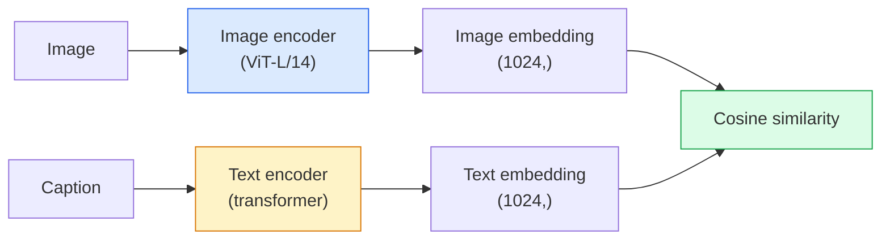

# オープンボキャブラリービジョン — CLIP

> 画像エンコーダーとテキストエンコーダーを一緒にトレーニングし、マッチング（画像、キャプション）ペアが共有空間の同じポイントに着地するようにする。それが全トリックだ。


## 学習目標

- CLIPの2タワーアーキテクチャと対照トレーニング目標を説明する
- タスク特有のトレーニングなしで、事前学習済みCLIP（またはSigLIP）をゼロショット分類に使用する
- ゼロショット分類をゼロから実装する: クラスプロンプトをエンコードし、コサイン類似度を計算し、argmaxを取る
- 2026年のCLIP、SigLIP、OpenCLIP、LLaVA/LLaMA-visionモデルを区別する — それぞれがどんなユースケースに向いているか

## 問題

従来の分類器はクローズドボキャブラリーだ: 1000クラスのImageNetモデルは1000のラベルしか予測できない。新しいカテゴリのたびにラベル付きデータと再トレーニングされたヘッドが必要だ。

CLIP（Radford et al.、OpenAI 2021年）は、ウェブからスクレイピングした4億（画像、キャプション）ペアでのトレーニングが、推論時に任意のカテゴリのセットに分類できるモデルを生成することを示した。純粋に自然言語で記述された文章だけでも新しいクラスを与えられる。

その能力 — ゼロショット転移 — がすべての現代ビジョンシステムがCLIPファミリーのチェックポイントで始まる理由だ。検出（Grounding DINO、OWL-ViT）、セグメンテーション（CLIPSeg、SAM）、検索、コンテンツモデレーション、VLM、テキスト-画像生成はすべてCLIPスタイルの結合埋め込みの上に構築されている。

## 概念

### 2タワー



両方のエンコーダーが同じ埋め込み次元への線形射影で終わる（CLIP-B/32では512、CLIP-L/14では1024）。L2正規化してコサイン類似度を計算する。

### 目的関数

N（画像、キャプション）ペアのバッチが与えられたとき、N×N類似度行列を構築する。対角線（マッチングペア）が高い類似度を持ち、対角線以外（非マッチング）が低い類似度を持つように両方のエンコーダーをトレーニングする。

```
sim_matrix = image_embeddings @ text_embeddings.T / tau

loss_i2t = cross_entropy(sim_matrix,       targets=arange(N))
loss_t2i = cross_entropy(sim_matrix.T,     targets=arange(N))
loss = (loss_i2t + loss_t2i) / 2
```

画像-テキストと テキスト-画像の両方の検索が機能するべきなので対称だ。`tau`（温度）は通常スカラーパラメータとして学習され、0.07で初期化される。

### SigLIP: より良い損失

SigLIP（Zhai et al.、2023年）はsoftmaxをペアごとのsigmoidに置き換えた:

```
loss = mean over pairs of log(1 + exp(-y_ij * sim_ij))
y_ij = +1 if matching, -1 otherwise
```

ペアごとの損失がCLIPに必要なバッチレベルの正規化を取り除く。SigLIPは小さなバッチサイズでより良くトレーニングされ、等しいデータでCLIPと同等かそれ以上の性能を発揮する。

### ゼロショット分類

学習済みCLIPが与えられたとき:

1. 各クラスに対してプロンプトを構成する: 「a photo of a {class}」。
2. テキストエンコーダーですべてのクラスプロンプトをエンコード → `T`の形状(C, d)。
3. テスト画像をエンコード → `I`の形状(1, d)。
4. 類似度 = `I @ T.T`の形状(1, C)。
5. Argmax → 予測クラス。

プロンプトエンジニアリングが重要だ。OpenAIはImageNet向けに80のプロンプトテンプレートを公開した（「a photo of a {}」、「a blurry photo of a {}」、「a sketch of a {}」...）。各クラスのすべてのテンプレートの埋め込みを平均すると、top-1精度が1〜3%向上する。

### 2026年でCLIPスタイルモデルが使われる場所

- **ゼロショット分類** — 直接使用。
- **画像検索** — すべての画像を一度エンコードし、推論時にクエリを埋め込む。
- **テキスト条件付き検出** — Grounding DINO、OWL-ViTが検出器の周りにCLIPテキストタワーをラップする。
- **テキスト条件付きセグメンテーション** — CLIPSeg。SAMはCLIP経由でテキストプロンプト入力を使う。
- **VLM** — LLaVA、Qwen-VL、InternVLがCLIPファミリーのビジョンエンコーダーをLLMに接続する。
- **テキスト-画像生成** — Stable Diffusion、DALL-E 3がCLIPテキスト埋め込みを条件として使う。

共有埋め込み空間ができれば、すべてのビジョン＋言語タスクが距離計算になる。

## 実装する

### ステップ1: 小さな2タワーモデル

実際のCLIPはViT＋トランスフォーマーだ。このレッスンではCPU上でトレーニング信号が見えるよう、タワーが事前抽出された特徴に対する小さなMLPになっている。

```python
import torch
import torch.nn as nn
import torch.nn.functional as F


class TwoTower(nn.Module):
    def __init__(self, img_in=128, txt_in=64, emb=64):
        super().__init__()
        self.image_proj = nn.Sequential(nn.Linear(img_in, 128), nn.ReLU(), nn.Linear(128, emb))
        self.text_proj = nn.Sequential(nn.Linear(txt_in, 128), nn.ReLU(), nn.Linear(128, emb))
        self.logit_scale = nn.Parameter(torch.ones([]) * 2.6592)  # ln(1/0.07)

    def forward(self, img_feats, txt_feats):
        i = F.normalize(self.image_proj(img_feats), dim=-1)
        t = F.normalize(self.text_proj(txt_feats), dim=-1)
        return i, t, self.logit_scale.exp()
```

2つの射影、共有次元出力、学習済み温度。実際のCLIP APIと同じ形状だ。

### ステップ2: 対照損失

```python
def clip_loss(image_emb, text_emb, logit_scale):
    N = image_emb.size(0)
    sim = logit_scale * image_emb @ text_emb.T
    targets = torch.arange(N, device=sim.device)
    l_i = F.cross_entropy(sim, targets)
    l_t = F.cross_entropy(sim.T, targets)
    return (l_i + l_t) / 2
```

対称だ。logit_scaleが高いほどsoftmaxがシャープになり、より自信が高くなるが不安定性のリスクがある。

### ステップ3: ゼロショット分類器

```python
@torch.no_grad()
def zero_shot_classify(model, image_feats, class_text_feats, class_names):
    """
    image_feats:      (N, img_in)
    class_text_feats: (C, txt_in)   クラスごとに1つの平均埋め込み
    """
    i = F.normalize(model.image_proj(image_feats), dim=-1)
    t = F.normalize(model.text_proj(class_text_feats), dim=-1)
    sim = i @ t.T
    pred = sim.argmax(dim=-1)
    return [class_names[p] for p in pred.tolist()]
```

ステップごとに1行だ。これは本番CLIPチェックポイントで使われる正確なゼロショット手順だ。

### ステップ4: サニティチェック

```python
torch.manual_seed(0)
model = TwoTower()

img = torch.randn(8, 128)
txt = torch.randn(8, 64)
i, t, scale = model(img, txt)
loss = clip_loss(i, t, scale)
print(f"batch size: {i.size(0)}   loss: {loss.item():.3f}")
```

ランダム初期化モデルの損失は`log(N) = log(8) = 2.08`に近いはずだ — 構造が学習されていないときの対称クロスエントロピーターゲット。

## 使ってみる

OpenCLIPが2026年のコミュニティデフォルトだ:

```python
import open_clip
import torch
from PIL import Image

model, _, preprocess = open_clip.create_model_and_transforms("ViT-B-32", pretrained="laion2b_s34b_b79k")
tokenizer = open_clip.get_tokenizer("ViT-B-32")

image = preprocess(Image.open("dog.jpg")).unsqueeze(0)
text = tokenizer(["a photo of a dog", "a photo of a cat", "a photo of a car"])

with torch.no_grad():
    image_features = model.encode_image(image)
    text_features = model.encode_text(text)
    image_features = image_features / image_features.norm(dim=-1, keepdim=True)
    text_features = text_features / text_features.norm(dim=-1, keepdim=True)
    probs = (100.0 * image_features @ text_features.T).softmax(dim=-1)

print(probs)
```

SigLIPはより新しく、小規模ではより良くトレーニングされ、新しい作業に好まれる: `google/siglip-base-patch16-224`。Hugging Faceが両方を提供している。

## 成果物を出す

このレッスンで生成するもの:

- `outputs/prompt-zero-shot-class-picker.md` — クラスリストとドメインを与えると、ゼロショットCLIP向けのクラステンプレートを設計するプロンプト。
- `outputs/skill-image-text-retriever.md` — 任意のCLIPチェックポイントで画像埋め込みインデックスを構築し、テキストと画像の両方によるクエリをサポートするスキル。

## 演習

1. **(易)** 事前学習済みOpenCLIP ViT-B/32を使い、80テンプレートプロンプトセットでCIFAR-10のゼロショット分類を行う。Top-1精度を報告する。85〜90%前後になるはずだ。
2. **(中)** 同じCIFAR-10タスクで単一テンプレート（「a photo of a {}」）と80テンプレート平均埋め込みを比較する。差を定量化し、テンプレートが役立つ理由を説明する。
3. **(難)** ゼロショット画像検索インデックスを構築する: 1000枚の画像をCLIPで埋め込み、FAISSインデックスを構築し、自然言語の説明でクエリする。手作業で書いた20のホールドアウトクエリのrecall@5を報告する。

## キーワード

| 用語 | よく言われる表現 | 実際の意味 |
|------|----------------|----------------------|
| 2タワー | 「デュアルエンコーダー」 | 共有次元の射影ヘッドで終わる別々の画像とテキストエンコーダー |
| ゼロショット | 「タスク特有のトレーニングなし」 | 推論時にテキストのみで記述されたクラスに分類。ラベルは触れない |
| 温度/logit_scale | 「tau」 | softmax前の類似度行列をスケールする学習済みスカラー |
| プロンプトテンプレート | 「a photo of a {}」 | クラス名の周りの自然言語ラッパー。多くのテンプレートを平均するとゼロショット精度が向上 |
| CLIP | 「画像+テキストモデル」 | 2021年のOpenAIモデル。2026年の分野の語彙 |
| SigLIP | 「シグモイドCLIP」 | softmaxをペアごとのsigmoidに交換。小さなバッチでより良くトレーニングされる |
| OpenCLIP | 「オープン再現」 | LAIONでコミュニティがトレーニングしたCLIPバリアント。オープンソースパイプラインの本番デフォルト |
| VLM | 「ビジョン言語モデル」 | CLIPファミリーのエンコーダーにLLMを加えた、画像に関する質問に答えるようトレーニングされたモデル |

## 参考資料

- [CLIP: Learning Transferable Visual Models from Natural Language Supervision (Radford et al., 2021)](https://arxiv.org/abs/2103.00020)
- [SigLIP: Sigmoid Loss for Language-Image Pre-Training (Zhai et al., 2023)](https://arxiv.org/abs/2303.15343)
- [OpenCLIP](https://github.com/mlfoundations/open_clip) — コミュニティコードベース
- [DINOv2 vs CLIP vs MAE: a features comparison](https://huggingface.co/blog/dinov2) — 並列ユースケースを持つHFガイド
