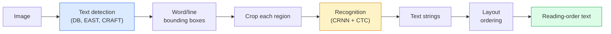

# OCRとドキュメント理解

> OCRは3段階のパイプラインだ — テキストボックスを検出し、文字を認識し、レイアウトを整える。すべての現代OCRシステムはこれらのステージを並べ替えるか統合する。


## 学習目標

- 古典的なOCRパイプライン（検出→認識→レイアウト）と現代のエンドツーエンドの代替手段（Donut、Qwen-VL-OCR）を追う
- シーケンス間OCRトレーニングのためのCTC（接続主義的時間分類）損失を実装する
- トレーニングなしで本番ドキュメント解析にPaddleOCRまたはEasyOCRを使用する
- OCR、レイアウト解析、ドキュメント理解を区別し — タスクごとに適切なツールを選ぶ

## 問題

テキストが詰まった画像はいたるところにある: レシート、請求書、ID、スキャンされた本、フォーム、ホワイトボード、看板、スクリーンショット。それらから構造化データを抽出すること — 文字だけでなく、「これが合計金額だ」というところまで — は応用ビジョン問題の中で最も価値が高い。

この分野は3つのスキル層に分かれる:

1. **OCR本来**: ピクセルをテキストに変換する。
2. **レイアウト解析**: OCR出力を領域（タイトル、本文、表、ヘッダー）にグループ化する。
3. **ドキュメント理解**: レイアウトから構造化フィールド（「invoice_total = $42.50」）を抽出する。

各層に古典的および現代的なアプローチがあり、「画像からテキストが欲しい」と「このレシートの合計金額が必要だ」の差は、ほとんどのチームが実感するより大きい。

## 概念

### 古典的なパイプライン



- **テキスト検出**は行ごとまたは単語ごとの四辺形を生成する。
- **認識**は各領域を固定高さにクロップし、CNN + BiLSTM + CTCを実行して文字シーケンスを生成する。
- **レイアウト**は読み取り順序を再構築する（ラテン語は上から下、左から右; アラビア語、日本語は異なる）。

### CTCを1段落で

OCR認識は固定長の特徴マップから可変長シーケンスを生成する。CTC（Graves et al.、2006年）により、文字レベルのアライメントなしでこれをトレーニングできる。モデルは各タイムステップで（語彙 + 空白）の分布を出力し; CTC損失は繰り返しのマージと空白の除去後にターゲットテキストに還元するすべてのアライメントを周辺化する。

```
raw output: "h h h _ _ e e l l _ l l o _ _"
after merge repeats and remove blanks: "hello"
```

CTCが2015年にCRNNを機能させた理由であり、2026年でも多くの本番OCRモデルのトレーニングが行われている。

### 現代のエンドツーエンドモデル

- **Donut**（Kim et al.、2022年）— ViTエンコーダー + テキストデコーダー; 画像を読み取り直接JSONを出力する。テキスト検出器なし、レイアウトモジュールなし。
- **TrOCR** — ViT + トランスフォーマーデコーダーによる行レベルOCR。
- **Qwen-VL-OCR / InternVL** — OCRタスク向けにファインチューニングされた完全なビジョン言語モデル; 2026年の複雑なドキュメントで最高精度。
- **PaddleOCR** — 成熟した本番パッケージの古典的なDB + CRNNパイプライン; 今でもオープンソースの主力。

エンドツーエンドモデルはより多くのデータとコンピューティングが必要だが、多段階パイプラインのエラー蓄積を省略する。

### レイアウト解析

構造化ドキュメントには、各領域をラベル付けするレイアウト検出器（LayoutLMv3、DocLayNet）を実行する: タイトル、段落、図、表、脚注。読み取り順序はその後「レイアウト順序で領域を反復し、連結する」になる。

フォームには**キー値抽出**モデル（視覚的に豊富なドキュメントにはDonut、平明なスキャンにはLayoutLMv3）を使用する。これらは画像 + 検出されたテキスト + 位置を受け取り、構造化されたキー値ペアを予測する。

### 評価指標

- **文字エラー率（CER）** — レーベンシュタイン距離 / 参照の長さ。低いほど良い。製品目標: クリーンスキャンで< 2%。
- **単語エラー率（WER）** — 単語レベルで同様。
- **構造化フィールドのF1** — キー値タスク用; `{invoice_total: 42.50}`が正しく現れるかを測定。
- **JSONの編集距離** — エンドツーエンドドキュメント解析用; Donut論文は正規化ツリー編集距離を導入した。

## 実装する

### ステップ1: CTC損失 + グリーディデコーダー

```python
import torch
import torch.nn as nn
import torch.nn.functional as F


def ctc_loss(log_probs, targets, input_lengths, target_lengths, blank=0):
    """
    log_probs:      (T, N, C) log-softmax over vocab including blank at index 0
    targets:        (N, S) int targets (no blanks)
    input_lengths:  (N,) per-sample time steps used
    target_lengths: (N,) per-sample target length
    """
    return F.ctc_loss(log_probs, targets, input_lengths, target_lengths,
                      blank=blank, reduction="mean", zero_infinity=True)


def greedy_ctc_decode(log_probs, blank=0):
    """
    log_probs: (T, N, C) log-softmax
    returns: list of index sequences (blanks removed, repeats merged)
    """
    preds = log_probs.argmax(dim=-1).transpose(0, 1).cpu().tolist()
    out = []
    for seq in preds:
        decoded = []
        prev = None
        for idx in seq:
            if idx != prev and idx != blank:
                decoded.append(idx)
            prev = idx
        out.append(decoded)
    return out
```

`F.ctc_loss`は利用可能な場合は効率的なCuDNN実装を使用する。グリーディデコーダーはビームサーチよりシンプルで、通常CERの差は1%以内だ。

### ステップ2: 小型CRNNレコグナイザー

行OCRのための最小限のCNN + BiLSTM。

```python
class TinyCRNN(nn.Module):
    def __init__(self, vocab_size=40, hidden=128, feat=32):
        super().__init__()
        self.cnn = nn.Sequential(
            nn.Conv2d(1, feat, 3, 1, 1), nn.BatchNorm2d(feat), nn.ReLU(inplace=True),
            nn.MaxPool2d(2),
            nn.Conv2d(feat, feat * 2, 3, 1, 1), nn.BatchNorm2d(feat * 2), nn.ReLU(inplace=True),
            nn.MaxPool2d(2),
            nn.Conv2d(feat * 2, feat * 4, 3, 1, 1), nn.BatchNorm2d(feat * 4), nn.ReLU(inplace=True),
            nn.MaxPool2d((2, 1)),
            nn.Conv2d(feat * 4, feat * 4, 3, 1, 1), nn.BatchNorm2d(feat * 4), nn.ReLU(inplace=True),
            nn.MaxPool2d((2, 1)),
        )
        self.rnn = nn.LSTM(feat * 4, hidden, bidirectional=True, batch_first=True)
        self.head = nn.Linear(hidden * 2, vocab_size)

    def forward(self, x):
        # x: (N, 1, H, W)
        f = self.cnn(x)                # (N, C, H', W')
        f = f.mean(dim=2).transpose(1, 2)  # (N, W', C)
        h, _ = self.rnn(f)
        return F.log_softmax(self.head(h).transpose(0, 1), dim=-1)  # (W', N, vocab)
```

固定高さ入力（CNNがmax-poolで高さを1にする）。幅がCTCの時間次元だ。

### ステップ3: 合成OCR

エンドツーエンドのスモークテスト用に黒-白の数字文字列を生成する。

```python
import numpy as np

def synthetic_line(text, height=32, char_width=16):
    W = char_width * len(text)
    img = np.ones((height, W), dtype=np.float32)
    for i, c in enumerate(text):
        x = i * char_width
        shade = 0.0 if c.isalnum() else 0.5
        img[6:height - 6, x + 2:x + char_width - 2] = shade
    return img


def build_batch(strings, vocab):
    H = 32
    W = 16 * max(len(s) for s in strings)
    imgs = np.ones((len(strings), 1, H, W), dtype=np.float32)
    target_lengths = []
    targets = []
    for i, s in enumerate(strings):
        imgs[i, 0, :, :16 * len(s)] = synthetic_line(s)
        ids = [vocab.index(c) for c in s]
        targets.extend(ids)
        target_lengths.append(len(ids))
    return torch.from_numpy(imgs), torch.tensor(targets), torch.tensor(target_lengths)


vocab = ["_"] + list("0123456789abcdefghijklmnopqrstuvwxyz")
imgs, targets, lengths = build_batch(["hello", "world"], vocab)
print(f"images: {imgs.shape}   targets: {targets.shape}   lengths: {lengths.tolist()}")
```

実際のOCRデータセットにはフォント、ノイズ、回転、ぼかし、色が追加される。上記のパイプラインは同一だ。

### ステップ4: トレーニングスケッチ

```python
model = TinyCRNN(vocab_size=len(vocab))
opt = torch.optim.Adam(model.parameters(), lr=1e-3)

for step in range(200):
    strings = ["abc" + str(step % 10)] * 4 + ["xyz" + str((step + 1) % 10)] * 4
    imgs, targets, target_lens = build_batch(strings, vocab)
    log_probs = model(imgs)  # (W', 8, vocab)
    input_lens = torch.full((8,), log_probs.size(0), dtype=torch.long)
    loss = ctc_loss(log_probs, targets, input_lens, target_lens, blank=0)
    opt.zero_grad(); loss.backward(); opt.step()
```

損失はこの単純な合成データで200ステップの間に~3から~0.2に下がるはずだ。

## 使ってみる

3つの本番パス:

- **PaddleOCR** — 成熟、高速、多言語。ワンライン使用: `paddleocr.PaddleOCR(lang="en").ocr(image_path)`。
- **EasyOCR** — Pythonネイティブ、多言語、PyTorchバックボーン。
- **Tesseract** — 古典的; モデルが苦手な古いスキャンドキュメントでまだ有用。

エンドツーエンドドキュメント解析には、DonutまたはVLMを使用する:

```python
from transformers import DonutProcessor, VisionEncoderDecoderModel

processor = DonutProcessor.from_pretrained("naver-clova-ix/donut-base-finetuned-cord-v2")
model = VisionEncoderDecoderModel.from_pretrained("naver-clova-ix/donut-base-finetuned-cord-v2")
```

繰り返し構造を持つレシート、請求書、フォームにはDonutをファインチューニングする。任意のドキュメントや推論を伴うOCRには、Qwen-VL-OCRのようなVLMが現在のデフォルトだ。

## 成果物を出す

このレッスンで生成するもの:

- `outputs/prompt-ocr-stack-picker.md` — ドキュメントタイプ、言語、構造を与えてTesseract / PaddleOCR / Donut / VLM-OCRを選ぶプロンプト。
- `outputs/skill-ctc-decoder.md` — 長さ正規化を含むグリーディとビームサーチのCTCデコーダーをゼロから書くスキル。

## 演習

1. **(易)** TinyCRNNを500ステップで5桁のランダム数字文字列でトレーニングする。ホールドアウトセットのCERを報告する。
2. **(中)** グリーディデコーディングをビームサーチ（beam_width=5）に置き換える。CERの差を報告する。どんな入力でビームサーチが勝つか？
3. **(難)** 20枚のレシートセットでPaddleOCRを使用し、明細項目を抽出し、{item_name, price}ペアの手動ラベル付けグラウンドトゥルースに対してF1を計算する。

## キーワード

| 用語 | よく言われる表現 | 実際の意味 |
|------|----------------|----------------------|
| OCR | 「ピクセルからテキスト」 | 画像領域を文字シーケンスに変換する |
| CTC | 「アライメントフリー損失」 | タイムステップごとのラベルなしでシーケンスモデルをトレーニングする損失; アライメントを周辺化する |
| CRNN | 「古典的OCRモデル」 | 畳み込み特徴抽出器 + BiLSTM + CTC; 本番でまだ使われている2015年のベースライン |
| Donut | 「エンドツーエンドOCR」 | ViTエンコーダー + テキストデコーダー; 画像から直接JSONを出力する |
| レイアウト解析 | 「領域を見つける」 | ドキュメント内のタイトル/表/図/段落領域の検出とラベル付け |
| 読み取り順序 | 「テキストシーケンス」 | 認識された領域を文章に並べる順序; ラテン語では簡単、混合レイアウトでは簡単ではない |
| CER / WER | 「エラー率」 | 文字または単語粒度での参照長に対するレーベンシュタイン距離 |
| VLM-OCR | 「読めるLLM」 | OCRタスク向けにトレーニングまたはプロンプトされたビジョン言語モデル; 複雑なドキュメントの現在のSOTA |

## 参考資料

- [CRNN (Shi et al., 2015)](https://arxiv.org/abs/1507.05717) — オリジナルのCNN+RNN+CTCアーキテクチャ
- [CTC (Graves et al., 2006)](https://www.cs.toronto.edu/~graves/icml_2006.pdf) — オリジナルのCTC論文; アルゴリズムのアイデアが詰まっている
- [Donut (Kim et al., 2022)](https://arxiv.org/abs/2111.15664) — OCRフリーのドキュメント理解トランスフォーマー
- [PaddleOCR](https://github.com/PaddlePaddle/PaddleOCR) — オープンソースの本番OCRスタック
