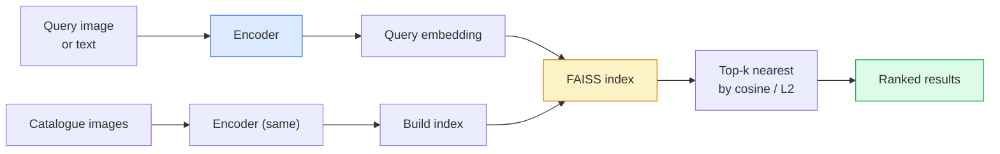

# 画像検索とメトリック学習

> 検索システムは埋め込み空間内の距離で候補をランク付けする。メトリック学習はその空間を形成し、距離が望む意味を持つようにする規律だ。


## 学習目標

- トリプレット、対照、プロキシベースのメトリック学習損失を説明し、与えられたデータセットに適切なものを選ぶ
- L2正規化とコサイン類似度を正しく実装し、「同じアイテム」と「同じクラス」の検索の違いを調べる
- FAISSインデックスを構築し、テキストと画像でクエリし、ホールドアウトクエリセットのrecall@Kを報告する
- DINOv2、CLIP、SigLIPを既製品の埋め込みバックボーンとして使用し、それぞれがいつ勝つかを知る

## 問題

検索は本番ビジョンのいたるところにある: 重複検出、逆画像検索、ビジュアル検索（「似た製品を見つける」）、顔の再識別、監視の人物再IDe、Eコマースのインスタンスレベルマッチング。製品の質問は常に同じだ: 「このクエリ画像が与えられたら、カタログをランク付けしてほしい。」

2つの設計上の決定がシステム全体を形成する。埋め込み — どのモデルがベクターを生成するか。インデックス — スケールで最近傍を見つける方法。2026年では両方が商品（埋め込みにはDINOv2、インデックスにはFAISS）になっているため、ハードルが上がっている: 難しい部分はアプリケーションで*何が類似しているか*を定義し、埋め込み空間を形成して距離が一致するようにすることだ。

その形成がメトリック学習だ。小さいが高い効果の規律だ。

## 概念

### 検索の概観



### 4つの損失ファミリー

| 損失 | 必要なもの | 長所 | 短所 |
|------|----------|------|------|
| **対照** | （アンカー、ポジティブ）+ ネガティブ | シンプル、任意のペアラベルで機能する | 多くのネガティブなしで収束が遅い |
| **トリプレット** | （アンカー、ポジティブ、ネガティブ） | 直感的; 直接的なマージン制御 | ハードトリプレットマイニングが高コスト |
| **NT-Xent / InfoNCE** | ペア + バッチマイニングのネガティブ | 大きなバッチにスケールする | 大きなバッチまたはモメンタムキューが必要 |
| **プロキシベース（ProxyNCA）** | クラスラベルのみ | 高速、安定、マイニングなし | 小さなデータセットでプロキシにオーバーフィットする可能性 |

ほとんどの本番ユースケースでは、事前学習済みバックボーンから始め、既製品の埋め込みがテストセットで性能不足の場合のみメトリック学習のファインチューニングを追加する。

### トリプレット損失の形式

```
L = max(0, ||f(a) - f(p)||^2 - ||f(a) - f(n)||^2 + margin)
```

アンカー`a`をポジティブ`p`に近づけ、ネガティブ`n`から遠ざける。`margin`でギャップを確保する。3つの画像構造はあらゆる類似度の順序付けに一般化される。

マイニングが重要だ: 簡単なトリプレット（`n`がすでに`a`から遠い）はゼロ損失を提供する; ハードトリプレットのみがネットワークに学習させる。セミハードマイニング（`n`が`p`より遠いがマージン内）は2016年のFaceNetレシピで今でも主流だ。

### コサイン類似度 vs L2

2つのメトリック、2つの慣例:

- **コサイン**: ベクトル間の角度。L2正規化された埋め込みが必要だ。
- **L2**: ユークリッド距離。生または正規化された埋め込みで機能するが、通常はL2正規化 + 二乗L2とペアになる。

ほとんどの現代のネットでは、`||a|| = ||b|| = 1`の場合に`||a - b||^2 = 2 - 2 cos(a, b)`なので、2つは等価だ。埋め込みトレーニングに合う慣例を選ぶ; 混在させると「最近傍」の意味が静かに変わる。

### Recall@K

標準的な検索メトリック:

```
recall@K = 少なくとも1つの正しいマッチが上位K結果にあるクエリの割合
```

recall@1、@5、@10を並べて報告する。recall@10が0.95超でrecall@1が0.5未満の場合、埋め込み空間は正しい構造を持っているが、ランク付けにノイズがある — 長めのファインチューニングや再ランク付けステップを試す。

重複検出ではprecision@Kがより重要だ、すべての偽陽性がユーザーに見えるミスだから。ビジュアル検索では、recall@Kが製品シグナルだ。

### FAISSを1段落で

Facebook AI Similarity Search。最近傍探索のデファクトライブラリ。3つのインデックスの選択肢:

- `IndexFlatIP` / `IndexFlatL2` — ブルートフォース、正確、トレーニングなし。~1Mベクターまで使用。
- `IndexIVFFlat` — K個のセルに分割し、最も近いセルのみ検索する。近似、高速、トレーニングデータが必要。
- `IndexHNSW` — グラフベース、多くのクエリに最速、大きなインデックスサイズ。

100kベクターには`IndexFlatIP`がコサイン類似度に向いている。10Mには`IndexIVFFlat`。100M+には積量子化と組み合わせた`IndexIVFPQ`。

### インスタンスレベル vs カテゴリレベル検索

同じ名前の2つの非常に異なる問題:

- **カテゴリレベル** — 「カタログから猫を見つける。」クラス条件付き類似度; 既製品のCLIP / DINOv2埋め込みがうまく機能する。
- **インスタンスレベル** — 「カタログでこの*まったく同じ製品*を見つける。」同じクラスの視覚的に類似したオブジェクト間の細かい識別が必要; 既製品の埋め込みは性能不足; メトリック学習によるファインチューニングが重要だ。

モデルを選ぶ前に常にどちらを解こうとしているかを確認する。

## 実装する

### ステップ1: トリプレット損失

```python
import torch
import torch.nn.functional as F

def triplet_loss(anchor, positive, negative, margin=0.2):
    d_ap = F.pairwise_distance(anchor, positive, p=2)
    d_an = F.pairwise_distance(anchor, negative, p=2)
    return F.relu(d_ap - d_an + margin).mean()
```

1行だ。L2正規化または生の埋め込みで機能する。

### ステップ2: セミハードマイニング

埋め込みとラベルのバッチが与えられたとき、各アンカーに対して最もハードなセミハードネガティブを見つける。

```python
def semi_hard_negatives(emb, labels, margin=0.2):
    dist = torch.cdist(emb, emb)
    same_class = labels[:, None] == labels[None, :]
    diff_class = ~same_class
    N = emb.size(0)

    positives = dist.clone()
    positives[~same_class] = float("-inf")
    positives.fill_diagonal_(float("-inf"))
    pos_idx = positives.argmax(dim=1)

    semi_hard = dist.clone()
    semi_hard[same_class] = float("inf")
    d_ap = dist[torch.arange(N), pos_idx].unsqueeze(1)
    semi_hard[dist <= d_ap] = float("inf")
    neg_idx = semi_hard.argmin(dim=1)

    fallback_mask = semi_hard[torch.arange(N), neg_idx] == float("inf")
    if fallback_mask.any():
        hardest = dist.clone()
        hardest[same_class] = float("inf")
        neg_idx = torch.where(fallback_mask, hardest.argmin(dim=1), neg_idx)
    return pos_idx, neg_idx
```

各アンカーはクラス内で最もハードなポジティブとポジティブより遠いがマージン内のセミハードネガティブを得る。

### ステップ3: Recall@K

```python
def recall_at_k(query_emb, gallery_emb, query_labels, gallery_labels, k=1):
    sim = query_emb @ gallery_emb.T
    _, top_k = sim.topk(k, dim=-1)
    matches = (gallery_labels[top_k] == query_labels[:, None]).any(dim=-1)
    return matches.float().mean().item()
```

L2正規化された埋め込みでの内積によるTop-kはコサインによるTop-kと等しい。少なくとも1つの正しい近傍を持つクエリの平均割合を報告する。

### ステップ4: まとめ

```python
import torch
import torch.nn as nn
from torch.optim import Adam

class Encoder(nn.Module):
    def __init__(self, in_dim=128, emb_dim=64):
        super().__init__()
        self.net = nn.Sequential(
            nn.Linear(in_dim, 128), nn.ReLU(),
            nn.Linear(128, emb_dim),
        )

    def forward(self, x):
        return F.normalize(self.net(x), dim=-1)

torch.manual_seed(0)
num_classes = 6
protos = F.normalize(torch.randn(num_classes, 128), dim=-1)

def sample_batch(bs=32):
    labels = torch.randint(0, num_classes, (bs,))
    x = protos[labels] + 0.15 * torch.randn(bs, 128)
    return x, labels

enc = Encoder()
opt = Adam(enc.parameters(), lr=3e-3)

for step in range(200):
    x, y = sample_batch(32)
    emb = enc(x)
    pos_idx, neg_idx = semi_hard_negatives(emb, y)
    loss = triplet_loss(emb, emb[pos_idx], emb[neg_idx])
    opt.zero_grad(); loss.backward(); opt.step()
```

数百ステップ後、埋め込みクラスターはクラスごとに1つのクラスターを形成する。

## 使ってみる

2026年の本番スタック:

- **DINOv2 + FAISS** — 汎用ビジュアル検索。既製品で機能する。
- **CLIP + FAISS** — クエリがテキストの場合。
- **ファインチューニングされたDINOv2 + FAISS** — インスタンスレベル検索、顔再ID、ファッション、Eコマース。
- **Milvus / Weaviate / Qdrant** — FAISSまたはHNSWのマネージドベクターDBラッパー。

SOTAインスタンス検索のレシピ: DINOv2バックボーン、埋め込みヘッドを追加し、インスタンスラベル付きペアでトリプレットまたはInfoNCE損失でファインチューニングし、FAISSでインデックス化する。

## 成果物を出す

このレッスンで生成するもの:

- `outputs/prompt-retrieval-loss-picker.md` — 与えられた検索問題にトリプレット / InfoNCE / ProxyNCAを選ぶプロンプト。
- `outputs/skill-recall-at-k-runner.md` — train/val/galleryスプリットと適切なデータコントラクトを持つrecall@Kのクリーンな評価ハーネスを書くスキル。

## 演習

1. **(易)** 上記のトイ例を実行する。トレーニング前後の埋め込みをPCAでプロットして、6つのクラスターが形成されるのを見る。
2. **(中)** ProxyNCA損失実装を追加する: クラスごとに1つの学習済み「プロキシ」、コサイン類似度の標準クロスエントロピー。トイデータでトリプレット損失と収束速度を比較する。
3. **(難)** 1,000枚のImageNetバリデーション画像を取り、HuggingFace経由でDINOv2で埋め込み、FAISSフラットインデックスを構築し、同じ画像をクエリとして使ったrecall@{1, 5, 10}（1.0になるはず）とImageNetラベルをグラウンドトゥルースとしたホールドアウトスプリットの両方を報告する。

## キーワード

| 用語 | よく言われる表現 | 実際の意味 |
|------|----------------|----------------------|
| メトリック学習 | 「空間を形成する」 | 出力空間の距離が目標の類似度を反映するようエンコーダーをトレーニングする |
| トリプレット損失 | 「引っ張って押す」 | L = max(0, d(a, p) - d(a, n) + margin); 標準的なメトリック学習損失 |
| セミハードマイニング | 「有益なネガティブ」 | アンカーからポジティブより遠いがマージン内のネガティブ; 経験的に最も有益 |
| プロキシベース損失 | 「クラスプロトタイプ」 | クラスごとに1つの学習済みプロキシ; プロキシへの類似度のクロスエントロピー; ペアマイニングなし |
| Recall@K | 「Top-Kヒット率」 | 上位KにA以上の正しい結果を持つクエリの割合 |
| インスタンス検索 | 「これを正確に見つける」 | 細粒度マッチング; 既製品の特徴は通常性能不足 |
| FAISS | 「NNライブラリ」 | Facebookの最近傍ライブラリ; 正確と近似インデックスをサポート |
| HNSW | 「グラフインデックス」 | 階層ナビゲーブル小世界; 小さなメモリオーバーヘッドで高速な近似NN |

## 参考資料

- [FaceNet: A Unified Embedding for Face Recognition (Schroff et al., 2015)](https://arxiv.org/abs/1503.03832) — トリプレット損失 / セミハードマイニング論文
- [In Defense of the Triplet Loss for Person Re-Identification (Hermans et al., 2017)](https://arxiv.org/abs/1703.07737) — トリプレットファインチューニングの実践ガイド
- [FAISS documentation](https://github.com/facebookresearch/faiss/wiki) — すべてのインデックス、すべてのトレードオフ
- [SMoT: Metric Learning Taxonomy (Kim et al., 2021)](https://arxiv.org/abs/2010.06927) — 現代の損失とその関係のサーベイ
