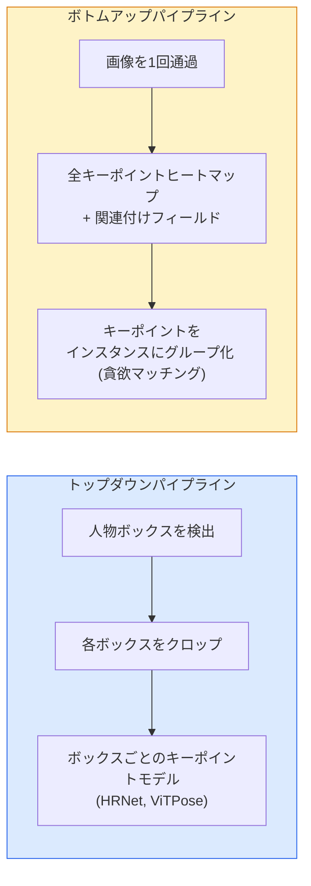

# キーポイント検出とポーズ推定

> ポーズは順序付けられたキーポイントのセットだ。キーポイント検出器はヒートマップリグレッサーだ。他はすべて事務的な処理だ。


## 学習目標

- トップダウンとボトムアップのポーズ推定を区別し、それぞれがいつ使われるかを述べる
- ガウス-キーポイントターゲットでKキーポイントのヒートマップを回帰し、推論時にキーポイント座標を抽出する
- パーツアフィニティフィールド（PAF）とボトムアップパイプラインがキーポイントをインスタンスに関連付ける方法を説明する
- 本番キーポイント推定にMediaPipe PoseまたはMMPoseを使用し、その出力形式を理解する

## 問題

キーポイントタスクは多くの名前で隠れている: 人体ポーズ（17の体関節）、顔ランドマーク（68または478ポイント）、手（21ポイント）、動物ポーズ、ロボット物体ポーズ、医療解剖学ランドマーク。すべて同じ構造を共有する: 物体上のK個の離散ポイントを検出し、その(x, y)座標を出力する。

ポーズ推定はモーションキャプチャー、フィットネスアプリ、スポーツ分析、ジェスチャーコントロール、アニメーション、ARトライオン、ロボットグラスピングの基盤だ。2Dの場合は成熟している; 3Dポーズ（単一カメラからワールド座標でジョイント位置を推定する）が現在の研究フロンティアだ。

エンジニアリングの問題はスケールだ。単一画像、単一人物のポーズは20msの問題だ。30fpsの群衆でのマルチパーソンポーズは、異なるアーキテクチャを持つ異なる問題だ。

## 概念

### トップダウン vs ボトムアップ



- **トップダウン** — まず人を検出し、次に各クロップでパーパーソンキーポイントモデルを実行する。最高精度; 人数に線形比例する。
- **ボトムアップ** — 1回のフォワードパスですべてのキーポイントと関連フィールドを予測し、グループ化する。群衆サイズに関わらず一定時間。

トップダウン（HRNet、ViTPose）は精度のリーダー; ボトムアップ（OpenPose、HigherHRNet）は混雑シーンでのスループットのリーダー。

### ヒートマップ回帰

`(x, y)`を直接回帰する代わりに、真の位置を中心にガウスブロブを持つキーポイントごとの`H x W`ヒートマップを予測する。

```
target[k, y, x] = exp(-((x - cx_k)^2 + (y - cy_k)^2) / (2 sigma^2))
```

推論時には、各ヒートマップのargmaxが予測されたキーポイント位置だ。

ヒートマップが直接回帰より良く機能する理由: ネットワークの空間構造（畳み込み特徴マップ）が空間出力と自然に一致する。ガウスターゲットも正規化する — 小さな位置誤差は小さな損失を生成し、ゼロではない。

### サブピクセル局在化

Argmaxは整数座標を与える。サブピクセル精度のために、argmaxとその近傍に放物線を当てはめて精緻化するか、周知のオフセット `(dx, dy) = 0.25 * (heatmap[y, x+1] - heatmap[y, x-1], ...)` 方向を使用する。

### パーツアフィニティフィールド（PAF）

ボトムアップ関連付けのためのOpenPoseのトリック。接続されたキーポイントの各ペアに対して（例: 左肩から左肘）、一方から他方を指す単位ベクトルをエンコードする2チャンネルフィールドを予測する。肩をその肘に関連付けるために、候補ペアを結ぶ線に沿ってPAFを積分する; 最高積分のペアがマッチングされる。

```
For each connection (limb):
  PAF channels: 2 (unit vector x, y)
  Line integral: sum over sample points of (PAF . line_direction)
  Higher integral = stronger match
```

エレガントで、パーパーソンクロップなしに任意の群衆サイズにスケールする。

### COCOキーポイント

標準的な人体ポーズデータセット: 人ごとに17のキーポイント、PCK（Percentage of Correct Keypoints）とOKS（Object Keypoint Similarity）がメトリック。OKSはIoUのキーポイントアナログで、COCO mAP@OKSが報告するものだ。

### 2D vs 3D

- **2Dポーズ** — 画像座標; 本番品質で解決済み（MediaPipe、HRNet、ViTPose）。
- **3Dポーズ** — ワールド / カメラ座標; まだ活発な研究。一般的なアプローチ:
  - 2D予測を小さなMLPで3Dにリフト（VideoPose3D）。
  - 画像からの直接3D回帰（PyMAF、MHFormer）。
  - グラウンドトゥルースのためのマルチビューセットアップ（CMU Panoptic）。

## 実装する

### ステップ1: ガウスヒートマップターゲット

```python
import numpy as np
import torch

def gaussian_heatmap(size, cx, cy, sigma=2.0):
    yy, xx = np.meshgrid(np.arange(size), np.arange(size), indexing="ij")
    return np.exp(-((xx - cx) ** 2 + (yy - cy) ** 2) / (2 * sigma ** 2)).astype(np.float32)

hm = gaussian_heatmap(64, 32, 32, sigma=2.0)
print(f"peak: {hm.max():.3f} at ({hm.argmax() % 64}, {hm.argmax() // 64})")
```

チャンネル軸に積み上げられたキーポイントごとのヒートマップが完全なターゲットテンソルを与える。

### ステップ2: 小型キーポイントヘッド

Kヒートマップチャンネルを出力するU-Netスタイルモデル。

```python
import torch.nn as nn
import torch.nn.functional as F

class TinyKeypointNet(nn.Module):
    def __init__(self, num_keypoints=4, base=16):
        super().__init__()
        self.down1 = nn.Sequential(nn.Conv2d(3, base, 3, 2, 1), nn.ReLU(inplace=True))
        self.down2 = nn.Sequential(nn.Conv2d(base, base * 2, 3, 2, 1), nn.ReLU(inplace=True))
        self.mid = nn.Sequential(nn.Conv2d(base * 2, base * 2, 3, 1, 1), nn.ReLU(inplace=True))
        self.up1 = nn.ConvTranspose2d(base * 2, base, 2, 2)
        self.up2 = nn.ConvTranspose2d(base, num_keypoints, 2, 2)

    def forward(self, x):
        h1 = self.down1(x)
        h2 = self.down2(h1)
        h3 = self.mid(h2)
        u1 = self.up1(h3)
        return self.up2(u1)
```

入力`(N, 3, H, W)`、出力`(N, K, H, W)`。損失はガウスターゲットに対するピクセルごとのMSEだ。

### ステップ3: 推論 — キーポイント座標の抽出

```python
def heatmap_to_coords(heatmaps):
    """
    heatmaps: (N, K, H, W)
    returns:  (N, K, 2) float coordinates in image pixels
    """
    N, K, H, W = heatmaps.shape
    hm = heatmaps.reshape(N, K, -1)
    idx = hm.argmax(dim=-1)
    ys = (idx // W).float()
    xs = (idx % W).float()
    return torch.stack([xs, ys], dim=-1)

coords = heatmap_to_coords(torch.randn(2, 4, 32, 32))
print(f"coords: {coords.shape}")  # (2, 4, 2)
```

推論時の1行。サブピクセル精緻化にはargmaxの周りを補間する。

### ステップ4: 合成キーポイントデータセット

シンプル: 白いキャンバスに4つのポイントを描き、それを予測するよう学習する。

```python
def make_synthetic_sample(size=64):
    img = np.ones((3, size, size), dtype=np.float32)
    rng = np.random.default_rng()
    kps = rng.integers(8, size - 8, size=(4, 2))
    for cx, cy in kps:
        img[:, cy - 2:cy + 2, cx - 2:cx + 2] = 0.0
    hms = np.stack([gaussian_heatmap(size, cx, cy) for cx, cy in kps])
    return img, hms, kps
```

小型モデルが1分で学習するのに十分シンプルだ。

### ステップ5: トレーニング

```python
model = TinyKeypointNet(num_keypoints=4)
opt = torch.optim.Adam(model.parameters(), lr=3e-3)

for step in range(200):
    batch = [make_synthetic_sample() for _ in range(16)]
    imgs = torch.from_numpy(np.stack([b[0] for b in batch]))
    hms = torch.from_numpy(np.stack([b[1] for b in batch]))
    pred = model(imgs)
    # Upsample pred to full resolution
    pred = F.interpolate(pred, size=hms.shape[-2:], mode="bilinear", align_corners=False)
    loss = F.mse_loss(pred, hms)
    opt.zero_grad(); loss.backward(); opt.step()
```

## 使ってみる

- **MediaPipe Pose** — Googleの本番ポーズ推定器; 10ms未満のレイテンシーのWebGL + モバイルランタイムを搭載。
- **MMPose**（OpenMMLab）— 包括的な研究コードベース; 事前学習済みウェイトを持つすべてのSOTAアーキテクチャ。
- **YOLOv8-pose** — 単一フォワードパスで最速のリアルタイムマルチパーソンポーズ。
- **transformers HumanDPT / PoseAnything** — オープンボキャブラリーポーズのための新しいビジョン言語アプローチ（任意の物体、任意のキーポイントセット）。

## 成果物を出す

このレッスンで生成するもの:

- `outputs/prompt-pose-stack-picker.md` — レイテンシー、群衆サイズ、2D vs 3Dの必要性に応じてMediaPipe / YOLOv8-pose / HRNet / ViTPoseを選ぶプロンプト。
- `outputs/skill-heatmap-to-coords.md` — すべての本番ポーズモデルが使うサブピクセルヒートマップ-座標変換ルーティンを書くスキル。

## 演習

1. **(易)** 合成4ポイントデータセットで小型キーポイントモデルをトレーニングする。200ステップ後の予測されたキーポイントと真のキーポイント間の平均L2誤差を報告する。
2. **(中)** サブピクセル精緻化を追加する: argmax位置が与えられたら、隣接ピクセルからxとyに沿って1D放物線を当てはめる。整数argmaxとの精度向上を報告する。
3. **(難)** 各画像に4キーポイントパターンの2つのインスタンスが表示される2人用合成データセットを構築する。どのキーポイントがどのインスタンスに属するかを予測するPAFを使ったボトムアップパイプラインをトレーニングし、OKSを評価する。

## キーワード

| 用語 | よく言われる表現 | 実際の意味 |
|------|----------------|----------------------|
| キーポイント | 「ランドマーク」 | 物体上の特定の順序付けられたポイント（関節、コーナー、特徴） |
| ポーズ | 「スケルトン」 | 1つのインスタンスに属する順序付けられたキーポイントのセット |
| トップダウン | 「検出してからポーズ」 | 2段階パイプライン: 人検出器 + パークロップキーポイントモデル; 最高精度 |
| ボトムアップ | 「先にポーズ、後でグループ化」 | 単一パスのすべてキーポイント予測 + グループ化; 群衆サイズで一定時間 |
| ヒートマップ | 「ガウスターゲット」 | 真の位置にピークを持つキーポイントごとのH x Wテンソル; 好まれる回帰ターゲット |
| PAF | 「パーツアフィニティフィールド」 | 腕の方向をエンコードする2チャンネル単位ベクトルフィールド; キーポイントをインスタンスにグループ化するために使用 |
| OKS | 「キーポイントIoU」 | Object Keypoint Similarity; ポーズのCOCOメトリック |
| HRNet | 「高解像度ネット」 | 支配的なトップダウンキーポイントアーキテクチャ; 全体を通じて高解像度特徴を保持 |

## 参考資料

- [OpenPose (Cao et al., 2017)](https://arxiv.org/abs/1812.08008) — PAFによるボトムアップ; アプローチの最良の説明書
- [HRNet (Sun et al., 2019)](https://arxiv.org/abs/1902.09212) — トップダウンリファレンスアーキテクチャ
- [ViTPose (Xu et al., 2022)](https://arxiv.org/abs/2204.12484) — ポーズバックボーンとしてのプレーンViT; 多くのベンチマークで現在のSOTA
- [MediaPipe Pose](https://developers.google.com/mediapipe/solutions/vision/pose_landmarker) — 本番リアルタイムポーズ; 2026年で最速のデプロイスタック
