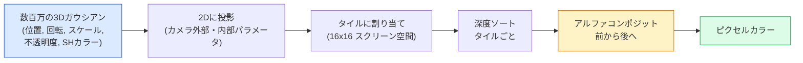

# ゼロから作る3Dガウシアンスプラッティング

> シーンは数百万の3Dガウシアンのクラウドだ。それぞれが位置、向き、スケール、不透明度、視点方向に依存する色を持つ。ラスタライズし、ラスタライゼーションを通じてバックプロップする、完成だ。


## 学習目標

- なぜ3Dガウシアンスプラッティングが2026年にフォトリアリスティック3D再構成のための本番デフォルトとしてNeRFを置き換えたかを説明する
- ガウシアンごとの6つのパラメーター（位置、回転クォータニオン、スケール、不透明度、球面調和係数による色、オプション特徴）とそれぞれが何フロートを持つかを述べる
- `alpha`コンポジティングを使った2Dガウシアンスプラッティングラスタライザーをゼロから実装し、3Dの場合が同じループに投影される様子を示す
- `nerfstudio`、`gsplat`、または`SuperSplat`を使用して20〜50枚の写真からシーンを再構成し、`KHR_gaussian_splatting` glTF拡張またはOpenUSD 26.03の`UsdVolParticleField3DGaussianSplat`スキーマにエクスポートする

## 問題

NeRFはMLPの重みとしてシーンを格納する。レンダリングされたすべてのピクセルはレイに沿った何百ものMLPクエリだ。トレーニングに数時間かかり、レンダリングに数秒かかり、重みは編集できない — シーン内の椅子を移動したい場合は、再トレーニングが必要だ。

3Dガウシアンスプラッティング（Kerbl、Kopanas、Leimkühler、Drettakis、SIGGRAPH 2023）はそのすべてを置き換えた。シーンは明示的な3Dガウシアンのセットだ。レンダリングは100+ fpsのGPUラスタライゼーションだ。トレーニングは数分だ。編集は直接的だ: ガウシアンのサブセットを移動すれば椅子を移動したことになる。2026年までに、KhronosグループがガウシアンスプラットのglTF拡張を批准し、OpenUSD 26.03がガウシアンスプラットスキーマを搭載し、ZillowとApartments.comがそれで不動産をレンダリングし、3D再構成に関するほとんどの新しい研究論文はコア3DGSアイデアのバリアントだ。

メンタルモデルはシンプルで、数学には十分な複雑さがあり、ほとんどの入門書はラスタライゼーションから始まり、投影と球面調和関数を飛ばしている。このレッスンは全部を構築する — まず2Dバージョン、次に3D拡張。

## 概念

### ガウシアンが持つもの

1つの3Dガウシアンはこれらの属性を持つ空間内のパラメトリックブロブだ:

```
position         mu         (3,)    centre in world coordinates
rotation         q          (4,)    unit quaternion encoding orientation
scale            s          (3,)    log-scales per axis (exponentiated at render time)
opacity          alpha      (1,)    post-sigmoid opacity [0, 1]
SH coefficients  c_lm       (3 * (L+1)^2,)   view-dependent colour
```

回転 + スケールが3x3共分散を構築する: `Sigma = R S S^T R^T`。それが3DのガウシアンのShapeだ。球面調和関数により、ビューごとのテクスチャを格納せずに色が視点方向によって変わる — 鏡面ハイライト、微妙な輝き、視点依存のグロー。SH次数3では色チャンネルごとに16係数、色だけでガウシアンごとに48フロートになる。

シーンは通常100万〜500万のガウシアンを持つ。各ガウシアンはおよそ60フロートを格納する（3 + 4 + 3 + 1 + 48 + misc）。500万ガウシアンのシーンで240MB — ポイントごとのテクスチャを持つ同等のポイントクラウドよりはるかに小さく、高解像度で再レンダリングされたNeRFのMLPウェイトより1桁小さい。

### ラスタライゼーション（レイマーチングではない）



5ステップ、すべてGPUに優しい。ピクセルごとのMLPクエリなし。単一のRTX 3080 Tiが600万スプラットを147fpsでレンダリングする。

### 投影ステップ

ワールド位置`mu`と3D共分散`Sigma`を持つ3Dガウシアンは、スクリーン位置`mu'`と2D共分散`Sigma'`を持つ2Dガウシアンに投影される:

```
mu' = project(mu)
Sigma' = J W Sigma W^T J^T          (2 x 2)

W = viewing transform (rotation + translation of camera)
J = Jacobian of the perspective projection at mu'
```

2Dガウシアンのフットプリントは`Sigma'`の固有ベクトルを軸とする楕円だ。その楕円内のすべてのピクセルはガウシアンの寄与を受ける、`exp(-0.5 * (p - mu')^T Sigma'^-1 (p - mu'))`で重み付けされて。

### アルファコンポジティングルール

1つのピクセルに対して、それを覆うガウシアンが背面から前面（または等価に前面から背面で逆式）にソートされる。色は1980年代以来すべての半透明ラスタライザーと同じ方程式でコンポジットされる:

```
C_pixel = sum_i alpha_i * T_i * c_i

T_i = prod_{j < i} (1 - alpha_j)       transmittance up to i
alpha_i = opacity_i * exp(-0.5 * d^T Sigma'^-1 d)   local contribution
c_i = eval_SH(SH_i, view_direction)    view-dependent colour
```

これは**NeRFの体積レンダリングと同じ方程式**で、レイに沿った密なサンプルの代わりに明示的なスパースなガウシアンセット上で行われる。この同一性がレンダリング品質がNeRFに匹敵する理由だ — 両方とも同じ放射場方程式を積分している。

### なぜこれが微分可能なのか

すべてのステップ — 投影、タイル割り当て、アルファコンポジティング、SH評価 — がガウシアンパラメーターに対して微分可能だ。グラウンドトゥルース画像が与えられたとき、レンダリングされたピクセル損失を計算し、ラスタライザーを通じてバックプロップし、`(mu, q, s, alpha, c_lm)`すべてを勾配降下法で更新する。~30,000イテレーションにわたって、ガウシアンは正しい位置、スケール、色を見つける。

### 高密度化と刈り込み

固定されたガウシアンのセットは複雑なシーンをカバーできない。トレーニングには2つの適応メカニズムが含まれる:

- ガウシアンの勾配の大きさが高いがスケールが小さい場合、その位置に**クローン**する — ここではより多くの詳細が必要だ。
- 勾配が高い場合、大きなスケールのガウシアンを2つの小さなものに**分割**する — 1つの大きなガウシアンは領域に対して滑らかすぎる。
- 不透明度が閾値を下回るガウシアンを**刈り込む** — それらは寄与していない。

高密度化はNイテレーションごとに実行される。シーンは通常~10万の初期ガウシアン（SfMポイントからシード）からトレーニング終了時には100万〜500万に成長する。

### 球面調和関数を1段落で

視点依存の色は単位球上の関数`c(direction)`だ。球面調和関数は球のフーリエ基底だ。次数`L`で打ち切ると、チャンネルごとに`(L+1)^2`基底関数を得る。新しい視点の色を評価するには、学習済みSH係数と視点方向で評価された基底のドット積を計算する。次数0 = 1係数 = 定数色。次数3 = 16係数 = ランベルトシェーディング、鏡面、軽い反射を捉えるのに十分。3DGSの論文はデフォルトで次数3を使用する。

### 2026年の本番スタック

```
1. Capture         smartphone / DJI drone / handheld scanner
2. SfM / MVS       COLMAP or GLOMAP derives camera poses + sparse points
3. Train 3DGS      nerfstudio / gsplat / inria official / PostShot (~10-30 min on RTX 4090)
4. Edit            SuperSplat / SplatForge (clean floaters, segment)
5. Export          .ply -> glTF KHR_gaussian_splatting or .usd (OpenUSD 26.03)
6. View            Cesium / Unreal / Babylon.js / Three.js / Vision Pro
```

### 4Dと生成バリアント

- **4Dガウシアンスプラッティング** — ガウシアンは時間の関数; 体積ビデオに使用（Superman 2026、A$AP Rockyの「Helicopter」）。
- **生成スプラット** — テキスト-スプラットモデル（World LabsのMarble）がシーン全体を幻覚する。
- **3D Gaussian Unscented Transform** — 自律走行シミュレーションのためのNVIDIA NuRecのバリアント。

## 実装する

### ステップ1: 2Dガウシアン

まず2Dラスタライザーを構築する。3Dの場合は投影後に同じになる。

```python
import torch
import torch.nn as nn
import torch.nn.functional as F


def eval_2d_gaussian(means, covs, points):
    """
    means:  (G, 2)      centres
    covs:   (G, 2, 2)   covariance matrices
    points: (H, W, 2)   pixel coordinates
    returns: (G, H, W)  density at every pixel for every Gaussian
    """
    G = means.size(0)
    H, W, _ = points.shape
    flat = points.view(-1, 2)
    inv = torch.linalg.inv(covs)
    diff = flat[None, :, :] - means[:, None, :]
    d = torch.einsum("gpi,gij,gpj->gp", diff, inv, diff)
    density = torch.exp(-0.5 * d)
    return density.view(G, H, W)
```

`einsum`がすべての（ガウシアン、ピクセル）ペアに対して二次形式`diff^T Sigma^-1 diff`を計算する。

### ステップ2: 2Dスプラッティングラスタライザー

前面から背面へのアルファコンポジティング。2Dでは奥行きに意味がないので、順序のための学習済みガウシアンごとのスカラーを使用する。

```python
def rasterise_2d(means, covs, colours, opacities, depths, image_size):
    """
    means:     (G, 2)
    covs:      (G, 2, 2)
    colours:   (G, 3)
    opacities: (G,)     in [0, 1]
    depths:    (G,)     per-Gaussian scalar used for ordering
    image_size: (H, W)
    returns:   (H, W, 3) rendered image
    """
    H, W = image_size
    yy, xx = torch.meshgrid(
        torch.arange(H, dtype=torch.float32, device=means.device),
        torch.arange(W, dtype=torch.float32, device=means.device),
        indexing="ij",
    )
    points = torch.stack([xx, yy], dim=-1)

    densities = eval_2d_gaussian(means, covs, points)
    alphas = opacities[:, None, None] * densities
    alphas = alphas.clamp(0.0, 0.99)

    order = torch.argsort(depths)
    alphas = alphas[order]
    colours_sorted = colours[order]

    T = torch.ones(H, W, device=means.device)
    out = torch.zeros(H, W, 3, device=means.device)
    for i in range(means.size(0)):
        a = alphas[i]
        out += (T * a)[..., None] * colours_sorted[i][None, None, :]
        T = T * (1.0 - a)
    return out
```

速くはない — 実際の実装はタイルベースのCUDAカーネルを使用する — が、正確な数学で完全に微分可能だ。

### ステップ3: 学習可能な2Dスプラットシーン

```python
class Splats2D(nn.Module):
    def __init__(self, num_splats=128, image_size=64, seed=0):
        super().__init__()
        g = torch.Generator().manual_seed(seed)
        H, W = image_size, image_size
        self.means = nn.Parameter(torch.rand(num_splats, 2, generator=g) * torch.tensor([W, H]))
        self.log_scale = nn.Parameter(torch.ones(num_splats, 2) * math.log(2.0))
        self.rot = nn.Parameter(torch.zeros(num_splats))  # single angle in 2D
        self.colour_logits = nn.Parameter(torch.randn(num_splats, 3, generator=g) * 0.5)
        self.opacity_logit = nn.Parameter(torch.zeros(num_splats))
        self.depth = nn.Parameter(torch.rand(num_splats, generator=g))

    def covs(self):
        s = torch.exp(self.log_scale)
        c, si = torch.cos(self.rot), torch.sin(self.rot)
        R = torch.stack([
            torch.stack([c, -si], dim=-1),
            torch.stack([si, c], dim=-1),
        ], dim=-2)
        S = torch.diag_embed(s ** 2)
        return R @ S @ R.transpose(-1, -2)

    def forward(self, image_size):
        covs = self.covs()
        colours = torch.sigmoid(self.colour_logits)
        opacities = torch.sigmoid(self.opacity_logit)
        return rasterise_2d(self.means, covs, colours, opacities, self.depth, image_size)
```

`log_scale`、`opacity_logit`、`colour_logits`はすべてレンダリング時に適切な活性化関数を通じてマッピングされる制約なしパラメーターだ。これはすべての3DGS実装の標準パターンだ。

### ステップ4: ターゲット画像に2Dガウシアンをフィット

```python
import math
import numpy as np

def make_target(size=64):
    yy, xx = np.meshgrid(np.arange(size), np.arange(size), indexing="ij")
    img = np.zeros((size, size, 3), dtype=np.float32)
    # Red circle
    mask = (xx - 20) ** 2 + (yy - 20) ** 2 < 10 ** 2
    img[mask] = [1.0, 0.2, 0.2]
    # Blue square
    mask = (np.abs(xx - 45) < 8) & (np.abs(yy - 40) < 8)
    img[mask] = [0.2, 0.3, 1.0]
    return torch.from_numpy(img)


target = make_target(64)
model = Splats2D(num_splats=64, image_size=64)
opt = torch.optim.Adam(model.parameters(), lr=0.05)

for step in range(200):
    pred = model((64, 64))
    loss = F.mse_loss(pred, target)
    opt.zero_grad(); loss.backward(); opt.step()
    if step % 40 == 0:
        print(f"step {step:3d}  mse {loss.item():.4f}")
```

200ステップにわたって64個のガウシアンが2つの形状に落ち着く。これがアイデア全体だ — 明示的な幾何学的プリミティブに対する勾配降下。

### ステップ5: 2Dから3Dへ

3Dの拡張は同じループを保つ。追加される点:

1. ガウシアンごとの回転が単一角度ではなくクォータニオンになる。
2. 共分散は`R S S^T R^T`で、`R`はクォータニオンから構築され、`S = diag(exp(log_scale))`。
3. 投影`(mu, Sigma) -> (mu', Sigma')`がカメラの外部パラメーターと`mu`での透視投影のヤコビアンを使用する。
4. 色が球面調和展開になり; 視点方向で評価する。
5. 深度ソートが学習済みスカラーではなく実際のカメラ空間のzからになる。

すべての本番実装（`gsplat`、`inria/gaussian-splatting`、`nerfstudio`）がGPU上でタイルベースのCUDAカーネルでまさにこれを行う。

### ステップ6: 球面調和関数の評価

次数3までのSH基底は1チャンネルあたり16項を持つ。評価:

```python
def eval_sh_degree_3(sh_coeffs, dirs):
    """
    sh_coeffs: (..., 16, 3)   last dim is RGB channels
    dirs:      (..., 3)       unit vectors
    returns:   (..., 3)
    """
    C0 = 0.282094791773878
    C1 = 0.488602511902920
    C2 = [1.092548430592079, 1.092548430592079,
          0.315391565252520, 1.092548430592079,
          0.546274215296039]
    x, y, z = dirs[..., 0], dirs[..., 1], dirs[..., 2]
    x2, y2, z2 = x * x, y * y, z * z
    xy, yz, xz = x * y, y * z, x * z

    result = C0 * sh_coeffs[..., 0, :]
    result = result - C1 * y[..., None] * sh_coeffs[..., 1, :]
    result = result + C1 * z[..., None] * sh_coeffs[..., 2, :]
    result = result - C1 * x[..., None] * sh_coeffs[..., 3, :]

    result = result + C2[0] * xy[..., None] * sh_coeffs[..., 4, :]
    result = result + C2[1] * yz[..., None] * sh_coeffs[..., 5, :]
    result = result + C2[2] * (2.0 * z2 - x2 - y2)[..., None] * sh_coeffs[..., 6, :]
    result = result + C2[3] * xz[..., None] * sh_coeffs[..., 7, :]
    result = result + C2[4] * (x2 - y2)[..., None] * sh_coeffs[..., 8, :]

    # degree 3 terms omitted here for brevity; full 16-coefficient version in the code file
    return result
```

学習済み`sh_coeffs`がそのガウシアンの「すべての方向における色」を格納する。レンダリング時に現在の視点方向に対して評価し、3ベクトルRGBを得る。

## 使ってみる

実際の3DGS作業には、`gsplat`（Meta）または`nerfstudio`を使用する:

```bash
pip install nerfstudio gsplat
ns-download-data example
ns-train splatfacto --data path/to/data
```

`splatfacto`はnerfstudioの3DGSトレーナーだ。一般的なシーンではRTX 4090で10〜30分かかる。

2026年で重要なエクスポートオプション:

- `.ply` — 生のガウシアンクラウド（ポータブル、最大ファイル）。
- `.splat` — PlayCanvas / SuperSplat量子化形式。
- glTF `KHR_gaussian_splatting` — Khronos標準、ビューワー間でポータブル（2026年2月RC）。
- OpenUSD `UsdVolParticleField3DGaussianSplat` — USD-ネイティブ、NVIDIA OmniverseとVision Proパイプライン用。

4D / 動的シーンには、`4DGS`と`Deformable-3DGS`が時間変化する平均と不透明度で同じメカニズムを拡張する。

## 成果物を出す

このレッスンで生成するもの:

- `outputs/prompt-3dgs-capture-planner.md` — 与えられたシーンタイプのキャプチャーセッション（写真枚数、カメラパス、照明）を計画するプロンプト。
- `outputs/skill-3dgs-export-router.md` — 下流のビューワーまたはエンジンに応じて適切なエクスポート形式（`.ply` / `.splat` / glTF / USD）を選ぶスキル。

## 演習

1. **(易)** 上記の2Dスプラットトレーナーを別の合成画像で実行する。`num_splats`を`[16, 64, 256]`で変えて、各々のMSE対ステップをプロットする。収益逓減の点を特定する。
2. **(中)** 2Dラスタライザーを拡張し、次数2の調和関数を通じてスカラー「視点角度」に依存するガウシアンごとのRGB色をサポートする。一対のターゲット画像でトレーニングし、モデルが両方を再構成することを確認する。
3. **(難)** `nerfstudio`をクローンし、手元にある（デスク、植物、顔、部屋など）任意のシーンの20枚の写真キャプチャーで`splatfacto`をトレーニングする。glTF `KHR_gaussian_splatting`にエクスポートし、ビューワー（Three.js `GaussianSplats3D`、SuperSplat、Babylon.js V9）で開く。トレーニング時間、ガウシアン数、レンダリングfpsを報告する。

## キーワード

| 用語 | よく言われる表現 | 実際の意味 |
|------|----------------|----------------------|
| 3DGS | 「ガウシアンスプラット」 | ガウシアンごとの位置、回転、スケール、不透明度、SH色を持つ数百万の3Dガウシアンとしての明示的シーン表現 |
| 共分散 | 「ガウシアンのShape」 | `Sigma = R S S^T R^T`; 1つのガウシアンの向きと異方性スケール |
| アルファコンポジティング | 「背面から前面へのブレンド」 | NeRFの体積レンダリングと同じ方程式、明示的なスパースセット上で行われる |
| 高密度化 | 「クローンと分割」 | 再構成が不十分な場所への新しいガウシアンの適応的追加 |
| 刈り込み | 「低不透明度を削除」 | トレーニング中にほぼゼロの不透明度に崩壊したガウシアンを削除 |
| 球面調和関数 | 「視点依存の色」 | 球上のフーリエ基底; 視点方向の関数として色を格納 |
| Splatfacto | 「nerfstudioの3DGS」 | 2026年の3DGSトレーニングへの最も簡単なパス |
| `KHR_gaussian_splatting` | 「glTF標準」 | 3DGSをビューワーとエンジン間でポータブルにする2026年のKhronos拡張 |

## 参考資料

- [3D Gaussian Splatting for Real-Time Radiance Field Rendering (Kerbl et al., SIGGRAPH 2023)](https://repo-sam.inria.fr/fungraph/3d-gaussian-splatting/) — オリジナル論文
- [gsplat (Meta/nerfstudio)](https://github.com/nerfstudio-project/gsplat) — 本番品質のCUDAラスタライザー
- [nerfstudio Splatfacto](https://docs.nerf.studio/nerfology/methods/splat.html) — リファレンストレーニングレシピ
- [Khronos KHR_gaussian_splatting extension](https://github.com/KhronosGroup/glTF/blob/main/extensions/2.0/Khronos/KHR_gaussian_splatting/README.md) — 2026年のポータブルフォーマット
- [OpenUSD 26.03 release notes](https://openusd.org/release/) — `UsdVolParticleField3DGaussianSplat`スキーマ
- [THE FUTURE 3D State of Gaussian Splatting 2026](https://www.thefuture3d.com/blog-0/2026/4/4/state-of-gaussian-splatting-2026) — 業界概観
