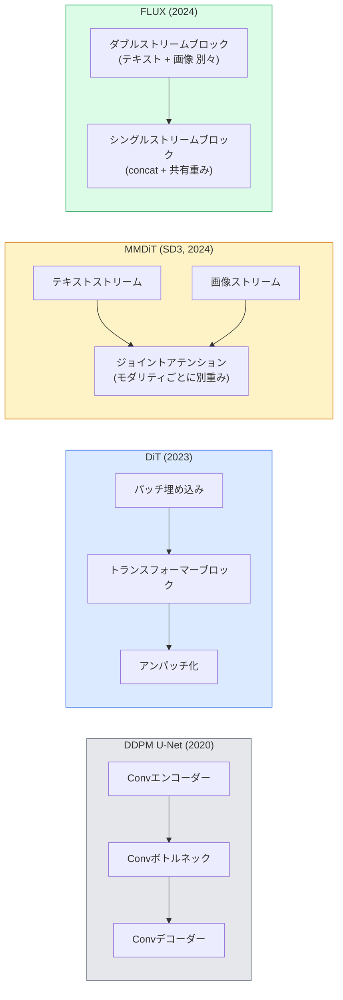

# 拡散トランスフォーマーと整流フロー

> U-Netは拡散の秘密ではない。トランスフォーマーに置き換え、ノイズスケジュールを直線フローに交換すると、突然SD3、FLUX、そして2026年のすべてのテキスト-画像モデルができあがる。


## 学習目標

- U-Net DDPM（レッスン10）から拡散トランスフォーマー（DiT）、MMDiT（SD3）、シングル+ダブルストリームDiT（FLUX）への進化を追う
- 整流フローを説明する: ノイズとデータ間の直線軌跡がモデルに1000ステップではなく20ステップでサンプリングさせる理由
- 100行未満の小型DiTブロックと整流フロートレーニングループを実装する
- モデルのバリアント（SD3、FLUX.1-dev、FLUX.1-schnell、Z-Image、Qwen-Image）をアーキテクチャ、パラメーター数、ライセンスで区別する

## 問題

レッスン10はU-Netデノイザーを使ったDDPMを構築した。そのレシピが2020〜2023年を支配した: U-Net + ベータスケジュール + ノイズ予測損失。Stable Diffusion 1.5と2.1、DALL-E 2を生み出した。

2026年のすべての最先端テキスト-画像モデルはそれを超えた。Stable Diffusion 3、FLUX、SD4、Z-Image、Qwen-Image、Hunyuan-Image — いずれもU-Netを使わない。拡散トランスフォーマー（DiT）を使う。SD3とFLUXはDDPMノイズスケジュールも整流フローに交換し、ノイズからデータへのパスを直線化し、一貫性または蒸留バリアントで1〜4ステップの推論を可能にする。

この変化が重要な理由: 拡散ベースの画像生成が制御可能になり、プロンプト精度が高くなり（SD3/SD4がテキストレンダリングを解決）、本番速度が速くなった。DiT + 整流フローを理解することは2026年の生成画像スタックを理解することだ。

## 概念

### U-Netからトランスフォーマーへ



- **DiT**（Peebles & Xie、2023年）— U-NetをViTのようなトランスフォーマーに置き換え、潜在パッチ上で動作する。適応レイヤーノーム（AdaLN）を通じた条件付け。
- **MMDiT**（SD3、Esser et al.、2024年）— 結合注意を共有するテキストと画像トークンのための別々の重みを持つ2つのストリーム。
- **FLUX**（Black Forest Labs、2024年）— 最初のNブロックはSD3のようにダブルストリーム、後のブロックは効率のために連結して重みを共有（シングルストリーム）。
- **Z-Image**（2025年）— 「コストをかけてスケール」に挑む6Bパラメーターの効率的なシングルストリームDiT。

### 整流フローを1段落で

DDPMは`x_t`がますます壊れていくノイズのあるSDEとして順方向プロセスを定義する。学習済みの逆プロセスは第2のSDEで、1000の小さなステップで解かれる。

整流フローはクリーンデータと純粋なノイズ間の**直線**補間を定義する:

```
x_t = (1 - t) * x_0 + t * epsilon,     t in [0, 1]
```

速度`v_theta(x_t, t) = epsilon - x_0`を予測するネットワークをトレーニングする — クリーンデータからノイズへの直線パスに沿った順方向方向（`dx_t/dt`）。サンプリング中、この速度を後方に積分してノイズからデータに向かって進む。結果のODEは直線により近いので、サンプリングに必要な積分ステップが大幅に少なくなる。

SD3はこれを**整流フローマッチング**と呼ぶ。FLUX、Z-Image、ほとんどの2026年のモデルが同じ目的関数を使用する。典型的な推論: 20〜30のEulerステップ（決定論的）vs 旧DDPMレジームの50+ DDIMステップ。蒸留 / turbo / schnell / LCMバリアントはこれを1〜4ステップに下げる。

### AdaLN条件付け

DiTはタイムステップとクラス/テキストで**適応レイヤーノーム**を通じて条件付けする: 条件付けベクトルから`scale`と`shift`を予測し、LayerNorm後に適用する。U-Netのフィルム風変調よりずっとクリーンで、すべての現代DiTのデフォルトだ。

```
cond -> MLP -> (scale, shift, gate)
norm(x) * (1 + scale) + shift, then residual add * gate
```

### SD3とFLUXのテキストエンコーダー

- **SD3**は3つのテキストエンコーダーを使用する: 2つのCLIPモデル + T5-XXL。埋め込みを連結してテキスト条件付けとして画像ストリームに入力する。
- **FLUX**はCLIP-L + T5-XXLを1つずつ使用する。
- **Qwen-Image / Z-Imageバリアント**はベースLLMとアライメントされた独自のテキストエンコーダーを使用する。

テキストエンコーダーはSD3/FLUXがSD1.5よりはるかによくプロンプトを推論できる大きな理由だ。T5-XXL単体で47億パラメーターある。

### Classifier-freeガイダンスは依然として有効

整流フローはサンプラーを変え、条件付けを変えない。Classifier-freeガイダンス（トレーニング中10%の確率でテキストをドロップし、推論時に条件付きと無条件の予測を混合）は整流フローで同一に機能する。ほとんどの2026年モデルはガイダンススケール3.5〜5を使用する — 整流フローモデルがデフォルトでより厳密にプロンプトに従うため、SD1.5の7.5より低い。

### Consistency、Turbo、Schnell、LCM

同じアイデアの4つの名前: 遅い多段階モデルを速い少段階モデルに蒸留する。

- **LCM（Latent Consistency Model）** — 任意の中間`x_t`から最終`x_0`を1ステップで予測する学生をトレーニングする。
- **SDXL Turbo / FLUX schnell** — 敵対的拡散蒸留でトレーニングされた1〜4ステップモデル。
- **SD Turbo** — 潜在拡散に適応されたOpenAIスタイルの一貫性モデル。

新しいモデルの本番サービングは「フル品質」チェックポイントと「turbo / schnell」バリアントの両方を提供する。Schnell（ドイツ語で「速い」、Black Forest Labsの慣例）は1〜4ステップで実行し、リアルタイムパイプラインに対応する。

### 2026年のモデルランドスケープ

| モデル | サイズ | アーキテクチャ | ライセンス |
|-------|------|--------------|---------|
| Stable Diffusion 3 Medium | 2B | MMDiT | SAI Community |
| Stable Diffusion 3.5 Large | 8B | MMDiT | SAI Community |
| FLUX.1-dev | 12B | Double + Single Stream DiT | non-commercial |
| FLUX.1-schnell | 12B | same, distilled | Apache 2.0 |
| FLUX.2 | — | iterated FLUX.1 | mixed |
| Z-Image | 6B | S3-DiT (Scalable Single-Stream) | permissive |
| Qwen-Image | ~20B | DiT + Qwen text tower | Apache 2.0 |
| Hunyuan-Image-3.0 | ~80B | DiT | research |
| SD4 Turbo | 3B | DiT + distillation | SAI Commercial |

FLUX.1-schnellが2026年のオープンソースデフォルトだ。Z-Imageは効率のリーダー。FLUX.2とSD4が現在の品質の先端だ。

### なぜこのフェーズシフトが重要なのか

DDPM + U-Netは機能した。DiT + 整流フローは**より良く、より速く、よりクリーンにスケールする**。この移行はNLPでのRNNからトランスフォーマーへの移行と並行している: 両アーキテクチャが同じ問題を解いたが、トランスフォーマーがスケールして現在支配している。2026年の画像、動画、または3D生成に関するすべての論文がDiT形状のデノイザーを使用し、通常は整流フロー目的関数を使用する。U-Net DDPMは現在主に教育的だ（レッスン10）。

## 実装する

### ステップ1: AdaLNを持つDiTブロック

```python
import torch
import torch.nn as nn


class AdaLNZero(nn.Module):
    """
    Adaptive LayerNorm with a gate. Predicts (scale, shift, gate) from the conditioning.
    Init such that the whole block starts as identity ("zero init").
    """

    def __init__(self, dim, cond_dim):
        super().__init__()
        self.norm = nn.LayerNorm(dim, elementwise_affine=False)
        self.mlp = nn.Linear(cond_dim, dim * 3)
        nn.init.zeros_(self.mlp.weight)
        nn.init.zeros_(self.mlp.bias)

    def forward(self, x, cond):
        scale, shift, gate = self.mlp(cond).chunk(3, dim=-1)
        h = self.norm(x) * (1 + scale.unsqueeze(1)) + shift.unsqueeze(1)
        return h, gate.unsqueeze(1)


class DiTBlock(nn.Module):
    def __init__(self, dim=192, heads=3, mlp_ratio=4, cond_dim=192):
        super().__init__()
        self.adaln1 = AdaLNZero(dim, cond_dim)
        self.attn = nn.MultiheadAttention(dim, heads, batch_first=True)
        self.adaln2 = AdaLNZero(dim, cond_dim)
        self.mlp = nn.Sequential(
            nn.Linear(dim, dim * mlp_ratio),
            nn.GELU(),
            nn.Linear(dim * mlp_ratio, dim),
        )

    def forward(self, x, cond):
        h, gate1 = self.adaln1(x, cond)
        a, _ = self.attn(h, h, h, need_weights=False)
        x = x + gate1 * a
        h, gate2 = self.adaln2(x, cond)
        x = x + gate2 * self.mlp(h)
        return x
```

`AdaLNZero`はMLPの重みがゼロに初期化されているため恒等マッピングとして始まる。トレーニングがブロックを恒等から離れるように少しずつ動かす; これにより深い変換器拡散モデルのトレーニングが大幅に安定する。

### ステップ2: 小型DiT

```python
def timestep_embedding(t, dim):
    import math
    half = dim // 2
    freqs = torch.exp(-math.log(10000) * torch.arange(half, device=t.device) / half)
    args = t[:, None].float() * freqs[None]
    return torch.cat([args.sin(), args.cos()], dim=-1)


class TinyDiT(nn.Module):
    def __init__(self, image_size=16, patch_size=2, in_channels=3, dim=96, depth=4, heads=3):
        super().__init__()
        self.patch_size = patch_size
        self.num_patches = (image_size // patch_size) ** 2
        self.patch = nn.Conv2d(in_channels, dim, kernel_size=patch_size, stride=patch_size)
        self.pos = nn.Parameter(torch.zeros(1, self.num_patches, dim))
        self.time_mlp = nn.Sequential(
            nn.Linear(dim, dim * 2),
            nn.SiLU(),
            nn.Linear(dim * 2, dim),
        )
        self.blocks = nn.ModuleList([DiTBlock(dim, heads, cond_dim=dim) for _ in range(depth)])
        self.norm_out = nn.LayerNorm(dim, elementwise_affine=False)
        self.head = nn.Linear(dim, patch_size * patch_size * in_channels)

    def forward(self, x, t):
        n = x.size(0)
        x = self.patch(x)
        x = x.flatten(2).transpose(1, 2) + self.pos
        t_emb = self.time_mlp(timestep_embedding(t, self.pos.size(-1)))
        for blk in self.blocks:
            x = blk(x, t_emb)
        x = self.norm_out(x)
        x = self.head(x)
        return self._unpatchify(x, n)

    def _unpatchify(self, x, n):
        p = self.patch_size
        h = w = int(self.num_patches ** 0.5)
        x = x.view(n, h, w, p, p, -1).permute(0, 5, 1, 3, 2, 4).reshape(n, -1, h * p, w * p)
        return x
```

### ステップ3: 整流フロートレーニング

```python
import torch.nn.functional as F

def rectified_flow_train_step(model, x0, optimizer, device):
    model.train()
    x0 = x0.to(device)
    n = x0.size(0)
    t = torch.rand(n, device=device)
    epsilon = torch.randn_like(x0)
    x_t = (1 - t[:, None, None, None]) * x0 + t[:, None, None, None] * epsilon

    target_velocity = epsilon - x0
    pred_velocity = model(x_t, t)

    loss = F.mse_loss(pred_velocity, target_velocity)
    optimizer.zero_grad()
    loss.backward()
    optimizer.step()
    return loss.item()
```

DDPMのノイズ予測損失（レッスン10）と比較: 同じ構造、異なるターゲット。ノイズ`epsilon`を予測する代わりに、直線補間に沿ってデータからノイズを指す**速度** `epsilon - x_0`を予測する。

### ステップ4: Eulerサンプラー

整流フローはODEだ。Euler法は最もシンプルで、十分にトレーニングされた整流フローモデルには20+ステップで高次ソルバーとほぼ同等の精度だ。

```python
@torch.no_grad()
def rectified_flow_sample(model, shape, steps=20, device="cpu"):
    model.eval()
    x = torch.randn(shape, device=device)
    dt = 1.0 / steps
    t = torch.ones(shape[0], device=device)
    for _ in range(steps):
        v = model(x, t)
        x = x - dt * v
        t = t - dt
    return x
```

20ステップ。トレーニング済みモデルでは1000ステップのDDPMに匹敵するサンプルを生成する。

### ステップ5: エンドツーエンドのスモークテスト

```python
import numpy as np

def synthetic_blobs(num=200, size=16, seed=0):
    rng = np.random.default_rng(seed)
    out = np.zeros((num, 3, size, size), dtype=np.float32)
    yy, xx = np.meshgrid(np.arange(size), np.arange(size), indexing="ij")
    for i in range(num):
        cx, cy = rng.uniform(4, size - 4, size=2)
        r = rng.uniform(2, 4)
        mask = (xx - cx) ** 2 + (yy - cy) ** 2 < r ** 2
        colour = rng.uniform(-1, 1, size=3)
        for c in range(3):
            out[i, c][mask] = colour[c]
    return torch.from_numpy(out)
```

整流フローを使ってこれに対して`TinyDiT`をトレーニングする。500ステップ後、サンプリングされた出力は薄い色のブロブのように見えるはずだ。

## 使ってみる

FLUX / SD3 / Z-Imageによる実際の画像生成には、`diffusers`がすべてを統一APIで提供する:

```python
from diffusers import FluxPipeline, StableDiffusion3Pipeline
import torch

pipe = FluxPipeline.from_pretrained(
    "black-forest-labs/FLUX.1-schnell",
    torch_dtype=torch.bfloat16,
).to("cuda")

out = pipe(
    prompt="a golden retriever surfing a tsunami, hyperrealistic, studio lighting",
    guidance_scale=0.0,           # schnell was trained without CFG
    num_inference_steps=4,
    max_sequence_length=256,
).images[0]
out.save("surf.png")
```

3行。4ステップで`FLUX.1-schnell`。CFGで20〜30ステップの高品質なら、モデルIDを`black-forest-labs/FLUX.1-dev`に変える。

SD3用:

```python
pipe = StableDiffusion3Pipeline.from_pretrained(
    "stabilityai/stable-diffusion-3.5-large",
    torch_dtype=torch.bfloat16,
).to("cuda")
out = pipe(prompt, guidance_scale=3.5, num_inference_steps=28).images[0]
```

## 成果物を出す

このレッスンで生成するもの:

- `outputs/prompt-dit-model-picker.md` — 品質、レイテンシー、ライセンス制約に応じてSD3、FLUX.1-dev、FLUX.1-schnell、Z-Image、SD4 Turboを選ぶ。
- `outputs/skill-rectified-flow-trainer.md` — AdaLN DiTとEulerサンプリングを使った整流フローの完全なトレーニングループを書く。

## 演習

1. **(易)** 上記のTinyDiTを500ステップ合成ブロブデータセットでトレーニングする。10、20、50のEulerステップで生成されたサンプルを比較する。
2. **(中)** 時間埋め込みに学習済みクラス埋め込みを連結することでテキスト条件付けを追加する（色で10のブロブ「クラス」）。クラス0、5、9でサンプリングし、色が一致することを確認する。
3. **(難)** 整流フローとDDPMバージョンの同じサイズネットワークを同じデータで同じステップ数トレーニングした場合の、生成サンプル間のフレシェ距離（FIDプロキシ）を計算する。どちらが速く収束するかを報告する。

## キーワード

| 用語 | よく言われる表現 | 実際の意味 |
|------|----------------|----------------------|
| DiT | 「拡散トランスフォーマー」 | パッチ化された潜在変数上で動作する拡散デノイザーとしてU-Netを置き換えるトランスフォーマー |
| AdaLN | 「適応レイヤーノーム」 | LayerNorm後に適用される学習済みスケール、シフト、ゲートによるタイムステップ/テキスト条件付け; すべての現代DiTの標準 |
| MMDiT | 「マルチモーダルDiT（SD3）」 | 結合自己注意を共有するテキストと画像トークンの別々の重みストリーム |
| シングルストリーム / ダブルストリーム | 「FLUXのトリック」 | 最初のNブロックはダブルストリーム（モダリティごとの別々の重み）、後のブロックはシングルストリーム（効率のために連結 + 共有重み） |
| 整流フロー | 「直線ノイズ-データ」 | データとノイズ間の線形補間; ネットワークが速度を予測; 推論時に必要なODEステップが少ない |
| 速度ターゲット | 「epsilon - x_0」 | 整流フローの回帰ターゲット; クリーンデータからノイズを指す |
| CFGガイダンス | 「Classifier-freeガイダンス」 | 条件付きと無条件の予測を混合; 整流フローモデルでも同様に使用 |
| Schnell / turbo / LCM | 「1〜4ステップ蒸留」 | フル品質モデルから蒸留された少ステップバリアント; 本番リアルタイム |

## 参考資料

- [Scalable Diffusion Models with Transformers (Peebles & Xie, 2023)](https://arxiv.org/abs/2212.09748) — DiT論文
- [Scaling Rectified Flow Transformers (Esser et al., SD3 paper)](https://arxiv.org/abs/2403.03206) — スケールでのMMDiTと整流フロー
- [FLUX.1 model card and technical report (Black Forest Labs)](https://huggingface.co/black-forest-labs/FLUX.1-dev) — ダブル + シングルストリームの詳細
- [Z-Image: Efficient Image Generation Foundation Model (2025)](https://arxiv.org/html/2511.22699v1) — 6Bのシングルストリームディット
- [Elucidating the Design Space of Diffusion (Karras et al., 2022)](https://arxiv.org/abs/2206.00364) — すべての拡散設計トレードオフのリファレンス
- [Latent Consistency Models (Luo et al., 2023)](https://arxiv.org/abs/2310.04378) — LCM-LoRAで4ステップ推論を実現する方法
