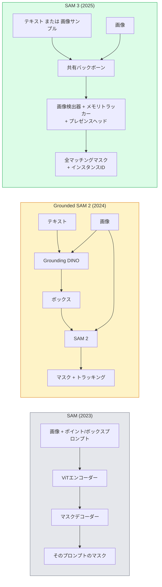

# SAM 3とオープンボキャブラリーセグメンテーション

> モデルにテキストプロンプトと画像を与えると、すべてのマッチするオブジェクトのマスクが得られる。SAM 3はそれを単一のフォワードパスにした。


## 学習目標

- SAM（ビジュアルプロンプトのみ）、Grounded SAM / SAM 2（検出器 + SAM）、SAM 3（プロンプタブルコンセプトセグメンテーション経由のネイティブテキストプロンプト）を区別する
- SAM 3のアーキテクチャを説明する: 共有バックボーン + 画像検出器 + メモリベースビデオトラッカー + プレゼンスヘッド + デカップルされた検出器-トラッカー設計
- テキストプロンプトによる検出、セグメンテーション、ビデオトラッキングのためのHugging Face `transformers` SAM 3統合を使用する
- レイテンシー、コンセプトの複雑さ、デプロイターゲットに基づいてSAM 3、Grounded SAM 2、YOLO-World、SAM-MIを選ぶ

## 問題

2023年のSAMはビジュアルプロンプトのみのモデルだった: ポイントをクリックするかボックスを描くとマスクを返す。「この写真のすべてのオレンジを取得する」ためにはボックスを生成する検出器（Grounding DINO）が必要で、次に各ボックスをセグメントするSAMが必要だった。Grounded SAMはこれをパイプラインにしたが、避けられないエラー蓄積を持つ2つの凍結モデルのカスケードだった。

SAM 3（Meta、2025年11月、ICLR 2026）はカスケードを折りたたんだ。短い名詞句または画像のサンプルをプロンプトとして受け取り、単一のフォワードパスですべてのマッチするマスクとインスタンスIDを返す。これが**プロンプタブルコンセプトセグメンテーション（PCS）**だ。2026年3月のObject Multiplexアップデート（SAM 3.1）と組み合わせると、同じコンセプトの複数インスタンスを効率的にビデオ全体でトラッキングする。

このレッスンはこれが表す構造的なシフトについてだ。2Dセグメンテーション、検出、テキスト-画像グラウンディングが1つのモデルに統合された。本番の問いはもはや「どのパイプラインを連鎖させるか」ではなく「どのプロンプタブルモデルが私のユースケースをエンドツーエンドで処理するか」だ。

## 概念

### 3世代



### プロンプタブルコンセプトセグメンテーション

「コンセプトプロンプト」は短い名詞句（`"yellow school bus"`、`"striped red umbrella"`、`"hand holding a mug"`）または画像のサンプルだ。モデルはコンセプトに一致する画像内のすべてのインスタンスのセグメンテーションマスクを、マッチごとのユニークなインスタンスIDとともに返す。

これは古典的なビジュアルプロンプトSAMと3つの点で異なる:

1. インスタンスごとのプロンプトが不要 — 1つのテキストプロンプトですべてのマッチを返す。
2. オープンボキャブラリー — コンセプトは自然言語で記述できる何でも良い。
3. プロンプトごとに1つのマスクではなく、複数のインスタンスを一度に返す。

### 主要なアーキテクチャの部品

- **共有バックボーン** — 単一のViTが画像を処理する。検出器ヘッドとメモリベースのトラッカーの両方がそこから読み取る。
- **プレゼンスヘッド** — コンセプトが画像内に存在するかどうかを予測する。「これはここにあるか？」を「どこにあるか？」からデカップルする。存在しないコンセプトの偽陽性を減らす。
- **デカップルされた検出器-トラッカー** — 画像レベルの検出とビデオレベルのトラッキングが別々のヘッドを持つため相互に干渉しない。
- **メモリバンク** — ビデオトラッキングのためにフレーム間のインスタンスごとの特徴を格納する（SAM 2が使用したのと同じメカニズム）。

### スケールでのトレーニング

SAM 3はAI + 人間レビューを使って反復的にアノテーションと修正を行うデータエンジンが生成した**400万の固有コンセプト**でトレーニングされた。新しい**SA-COベンチマーク**には27万の固有コンセプトが含まれ、以前のベンチマークより50倍大きい。SAM 3はSA-COで人間のパフォーマンスの75〜80%に達し、画像 + ビデオPCSで既存システムを2倍にした。

### SAM 3.1 Object Multiplex

2026年3月アップデート: **Object Multiplex**は同じコンセプトの多くのインスタンスを同時に結合トラッキングするための共有メモリメカニズムを導入した。以前はN個のインスタンスのトラッキングにN個の別々のメモリバンクが必要だった。Multiplexはそれをインスタンスごとのクエリを持つ1つの共有メモリに折りたたんだ。結果: 精度を犠牲にすることなく大幅に速いマルチオブジェクトトラッキング。

### 2026年でGrounded SAMがまだ重要な場面

- 特定のオープンボキャブラリー検出器（DINO-X、Florence-2）を入れ替える必要がある場合。
- SAM 3のライセンス（HFでゲート管理）がブロッカーの場合。
- SAM 3が公開しているより検出器の閾値をより細かく制御する必要がある場合。
- 検出器コンポーネントの研究/アブレーション作業のため。

モジュラーパイプラインにはまだ場所がある。ほとんどの本番作業では、SAM 3がよりシンプルな答えだ。

### YOLO-World vs SAM 3

- **YOLO-World** — オープンボキャブラリー検出器のみ（マスクなし）。リアルタイム。高fpsでボックスが必要な場合に最適。
- **SAM 3** — 完全なセグメンテーション + トラッキング。遅いが豊富な出力。

本番の分割: YOLO-Worldは高速検出のみのパイプライン（ロボットナビゲーション、高速ダッシュボード）、SAM 3はマスクまたはトラッキングが必要なもの。

### SAM-MI効率化

SAM-MI（2025〜2026年）はSAMのデコーダーボトルネックに対処する。主要なアイデア:

- **スパースポイントプロンプティング** — 密なプロンプトの代わりに適切に選ばれた少数のポイントを使用; デコーダー呼び出しを96%削減。
- **浅いマスク集約** — 粗いマスク予測を1つのシャープなマスクにマージする。
- **デカップルされたマスク注入** — デコーダーが再実行する代わりに事前計算されたマスク特徴を受け取る。

結果: オープンボキャブラリーベンチマークでGrounded-SAMより~1.6倍の高速化。

### 3つのモデルの出力形式

すべてが同じ一般的な構造（ボックス + ラベル + スコア + マスク + ID）を返す — これは役立つ、どのモデルが実行したかによって下流のパイプラインが分岐する必要がない。

## 実装する

### ステップ1: プロンプト構築

ユーザーの文をSAM 3のコンセプトプロンプトのリストに変換するヘルパーを構築する。これは「ユーザーが入力したもの」と「モデルが消費するもの」の境界だ。

```python
def split_concepts(sentence):
    """
    Heuristic splitter for multi-concept prompts.
    Returns list of short noun phrases.
    """
    for sep in [",", ";", "and", "or", "&"]:
        if sep in sentence:
            parts = [p.strip() for p in sentence.replace("and ", ",").split(",")]
            return [p for p in parts if p]
    return [sentence.strip()]

print(split_concepts("cats, dogs and balloons"))
```

SAM 3はフォワードパスごとに1つのコンセプトを受け取る; マルチコンセプトクエリにはループまたはバッチ処理する。

### ステップ2: 後処理ヘルパー

SAM 3の生の出力をフェーズ4 レッスン16のパイプラインコントラクトに合うクリーンな検出リストに変換する。

```python
from dataclasses import dataclass
from typing import List

@dataclass
class ConceptDetection:
    concept: str
    instance_id: int
    box: tuple          # (x1, y1, x2, y2)
    score: float
    mask_rle: str       # run-length encoded


def rle_encode(binary_mask):
    flat = binary_mask.flatten().astype("uint8")
    runs = []
    prev, count = flat[0], 0
    for v in flat:
        if v == prev:
            count += 1
        else:
            runs.append((int(prev), count))
            prev, count = v, 1
    runs.append((int(prev), count))
    return ";".join(f"{v}x{c}" for v, c in runs)
```

RLEは多くの高解像度マスクでもレスポンスペイロードを小さく保つ。同じフォーマットがSAM 2、SAM 3、Grounded SAM 2にわたって機能する。

### ステップ3: 統一されたオープンボキャブラリーセグメンテーションインターフェース

持っているバックエンド（SAM 3、Grounded SAM 2、YOLO-World + SAM 2）を単一のメソッドの後ろに包む。バックエンドが変わっても下流コードは変更しない。

```python
from abc import ABC, abstractmethod
import numpy as np

class OpenVocabSeg(ABC):
    @abstractmethod
    def detect(self, image: np.ndarray, concept: str) -> List[ConceptDetection]:
        ...


class StubOpenVocabSeg(OpenVocabSeg):
    """
    Deterministic stub used for pipeline testing when real models are not loaded.
    """
    def detect(self, image, concept):
        h, w = image.shape[:2]
        return [
            ConceptDetection(
                concept=concept,
                instance_id=0,
                box=(w * 0.2, h * 0.3, w * 0.5, h * 0.8),
                score=0.89,
                mask_rle="0x100;1x50;0x200",
            ),
            ConceptDetection(
                concept=concept,
                instance_id=1,
                box=(w * 0.55, h * 0.25, w * 0.85, h * 0.75),
                score=0.74,
                mask_rle="0x80;1x40;0x220",
            ),
        ]
```

実際の`SAM3OpenVocabSeg`サブクラスは`transformers.Sam3Model`と`Sam3Processor`をラップする。

### ステップ4: Hugging Face SAM 3の使用（リファレンス）

実際のモデルでは、`transformers`統合:

```python
from transformers import Sam3Processor, Sam3Model
import torch

processor = Sam3Processor.from_pretrained("facebook/sam3")
model = Sam3Model.from_pretrained("facebook/sam3").eval()

inputs = processor(images=pil_image, return_tensors="pt")
inputs = processor.set_text_prompt(inputs, "yellow school bus")

with torch.no_grad():
    outputs = model(**inputs)

masks = processor.post_process_masks(
    outputs.masks, inputs.original_sizes, inputs.reshaped_input_sizes
)
boxes = outputs.boxes
scores = outputs.scores
```

1つのプロンプト、すべてのマッチが単一の呼び出しで返される。

### ステップ5: Grounded SAM 2が無償で提供していたものを測定する

正直なベンチマーク: 実際のパイプラインでGrounded SAM 2をSAM 3に置き換えると何が起きるか？

- レイテンシー: SAM 3は1つのフォワードパスを節約する（別の検出器なし）が、モデル自体が重い; 通常はネット中立またはわずかな高速化。
- 精度: SAM 3はまれまたは合成コンセプト（「striped red umbrella」）で大幅に優れている。一般的な単語コンセプトでは同等。
- 柔軟性: Grounded SAM 2は検出器を交換できる（DINO-X、Florence-2、Grounding DINO 1.5）; SAM 3はモノリシック。

結論: SAM 3は2026年のオープンボキャブラリーセグメンテーションのデフォルト。Grounded SAM 2は検出器の柔軟性または異なるライセンス条件が必要な場合に依然として正しい答えだ。

## 使ってみる

本番デプロイメントパターン:

- **リアルタイムアノテーション** — SAM 3 + CVATのラベル-テキストプロンプト機能。アノテーターがラベル名を選択; SAM 3がすべてのマッチするインスタンスを事前ラベル付けする。レビューと修正。
- **ビデオ分析** — マルチオブジェクトトラッキングのためのSAM 3.1 Object Multiplex; メモリベーストラッカーにフレームを供給する。
- **ロボティクス** — オープンボキャブラリー操作のためのSAM 3（「赤いカップを拾い上げる」）; 計画プリミティブとして実行する。
- **医療画像** — 医療コンセプトでファインチューニングされたSAM 3; HFへのアクセスリクエストが必要。

UltralyticsはSAM 3をPythonパッケージにラップしている:

```python
from ultralytics import SAM

model = SAM("sam3.pt")
results = model(image_path, prompts="yellow school bus")
```

YOLOとSAM 2と同じインターフェース。

## 成果物を出す

このレッスンで生成するもの:

- `outputs/prompt-open-vocab-stack-picker.md` — レイテンシー、コンセプトの複雑さ、ライセンスに基づいてSAM 3 / Grounded SAM 2 / YOLO-World / SAM-MIを選ぶプロンプト。
- `outputs/skill-concept-prompt-designer.md` — ユーザーの発言を適切に形成されたSAM 3コンセプトプロンプトに変換するスキル（分割、曖昧性解消、フォールバック）。

## 演習

1. **(易)** 選択したコンセプトプロンプトで10枚の画像にSAM 3を実行する。同じ画像でSAM 2 + Grounding DINO 1.5と比較する。各モデルが逃したコンセプトを報告する。
2. **(中)** SAM 3の上に「クリックして含める / クリックして除外する」UIを構築する: テキストプロンプトが候補インスタンスを返す; ユーザーのクリックがどれが陽性としてカウントされるかを保持する。最終コンセプトセットをJSONとして出力する。
3. **(難)** カスタムコンセプトセット（例: 5種類の電子部品）で各20枚のラベル付き画像を使ってSAM 3をファインチューニングする。同じテストセットでゼロショットSAM 3と比較する; マスクIoUの改善を測定する。

## キーワード

| 用語 | よく言われる表現 | 実際の意味 |
|------|----------------|----------------------|
| オープンボキャブラリーセグメンテーション | 「テキストでセグメント」 | 固定ラベルセットではなく、自然言語で記述されたオブジェクトのマスクを生成する |
| PCS | 「プロンプタブルコンセプトセグメンテーション」 | SAM 3のコアタスク — 名詞句または画像サンプルが与えられると、すべてのマッチするインスタンスをセグメントする |
| コンセプトプロンプト | 「テキスト入力」 | 短い名詞句または画像サンプル; 完全な文ではない |
| プレゼンスヘッド | 「これはここにあるか？」 | コンセプトが画像内に存在するかを局在化の前に決定するSAM 3モジュール |
| SA-CO | 「SAM 3ベンチマーク」 | 27万コンセプトのオープンボキャブラリーセグメンテーションベンチマーク; 以前のオープンボキャブラリーベンチマークより50倍大きい |
| Object Multiplex | 「SAM 3.1アップデート」 | 共有メモリマルチオブジェクトトラッキング; 多くのインスタンスの高速結合トラッキング |
| Grounded SAM 2 | 「モジュラーパイプライン」 | 検出器 + SAM 2カスケード; 検出器の交換が重要な場合に依然として関連 |
| SAM-MI | 「効率的SAMバリアント」 | Grounded-SAMより1.6倍の高速化のためのマスク注入 |

## 参考資料

- [SAM 3: Segment Anything with Concepts (arXiv 2511.16719)](https://arxiv.org/abs/2511.16719)
- [SAM 3.1 Object Multiplex (Meta AI, March 2026)](https://ai.meta.com/blog/segment-anything-model-3/)
- [SAM 3 model page on Hugging Face](https://huggingface.co/facebook/sam3)
- [Grounded SAM 2 tutorial (PyImageSearch)](https://pyimagesearch.com/2026/01/19/grounded-sam-2-from-open-set-detection-to-segmentation-and-tracking/)
- [Ultralytics SAM 3 docs](https://docs.ultralytics.com/models/sam-3/)
- [SAM3-I: Instruction-aware SAM (arXiv 2512.04585)](https://arxiv.org/abs/2512.04585)
