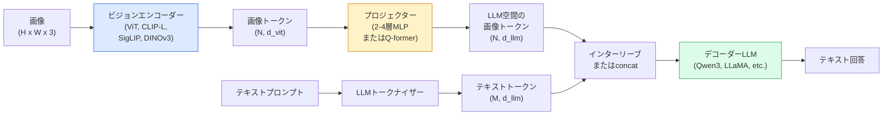

# ビジョン言語モデル — ViT-MLP-LLMパターン

> ビジョンエンコーダーが画像をトークンに変換する。MLPプロジェクターがそれらのトークンをLLMの埋め込み空間にマッピングする。言語モデルが残りを処理する。そのパターン — ViT-MLP-LLM — が2026年のすべての本番VLMだ。


## 学習目標

- ViT-MLP-LLMアーキテクチャを述べ、3つの各コンポーネントが何に貢献するかを説明する
- Qwen3-VL、InternVL3.5、LLaVA-Next、GLM-4.6Vをパラメーター数、コンテキスト長、ベンチマーク性能で比較する
- DeepStackを説明する: マルチレベルのViT特徴が単一の最終層特徴よりビジョン言語アライメントを改善する理由
- Cross-Modal Error Rate（CMER）で本番のVLM幻覚を測定し、シグナルに基づいて行動する

## 問題

CLIP（フェーズ4 レッスン18）は画像とテキストの共有埋め込み空間を提供し、ゼロショット分類と検索に十分だ。CLIPはテキストを生成しない — 類似度をスコアリングするだけなので、「この画像に赤い車は何台ありますか？」には答えられない。

ビジョン言語モデル（VLM）— Qwen3-VL、InternVL3.5、LLaVA-Next、GLM-4.6V — はCLIPファミリーの画像エンコーダーを完全な言語モデルに接続する。モデルは画像と質問を見て答えを生成する。2026年のオープンソースVLMはマルチモーダルベンチマーク（MMMU、MMBench、DocVQA、ChartQA、MathVista、OSWorld）でGPT-5とGemini-2.5-Proに匹敵するかそれを上回る。

3つの部品（ViT、プロジェクター、LLM）が標準だ。モデル間の違いはどのViT、どのプロジェクター、どのLLM、トレーニングデータ、アライメントレシピにある。パターンを理解したら、どのコンポーネントを交換しても機械的だ。

## 概念

### ViT-MLP-LLMアーキテクチャ



1. **ビジョンエンコーダー** — 事前学習済みViT（CLIP-L/14、SigLIP、DINOv3、またはファインチューニングされたバリアント）。パッチトークンを生成する。
2. **プロジェクター** — ビジョントークンをLLMの埋め込み次元にマッピングする小さなモジュール（2〜4層MLP、またはQ-former）。ほとんどのファインチューニングがここで行われる。
3. **LLM** — デコーダーのみの言語モデル（Qwen3、Llama、Mistral、GLM、InternLM）。ビジョン + テキストトークンを順番に読み取り、テキストを生成する。

原則として3つすべてのピースがトレーニング可能だ。実際には、ビジョンエンコーダーとLLMはほぼ凍結されたまま、プロジェクターがトレーニングされる — 安価で数十億パラメーターのシグナル。

### DeepStack

バニラのプロジェクションは最終ViT層のみを使用する。DeepStack（Qwen3-VL）は複数のViT深さから特徴をサンプリングし、積み上げる。深い層は高レベルの意味論を持ち; 浅い層は細粒度の空間的および質感情報を持つ。両方をLLMに入力すると、「画像に何が含まれているか」（意味論）と「正確にどこに」（空間的グラウンディング）のギャップが埋まる。

### 3つのトレーニングステージ

現代のVLMはステージでトレーニングする:

1. **アライメント** — ViTとLLMを凍結する。画像-キャプションペアでのみプロジェクターをトレーニングする。プロジェクターにビジョン空間を言語空間にマッピングする方法を教える。
2. **事前学習** — すべてを解凍する。大規模な交互の画像-テキストデータ（5億+ペア）でトレーニングする。モデルの視覚的知識を構築する。
3. **インストラクションチューニング** — 厳選された（画像、質問、回答）トリプルでファインチューニングする。会話的な動作とタスクフォーマットを教える。これが「ビジョン対応LM」を使用可能なアシスタントに変える。

ほとんどのLoRAファインチューニングはステージ3を小さなラベル付きデータセットでターゲットにする。

### モデルファミリーの比較（2026年初頭）

| モデル | パラメーター | ビジョンエンコーダー | LLM | コンテキスト | 強み |
|-------|--------|----------------|-----|---------|-----------|
| Qwen3-VL-235B-A22B (MoE) | 235B (22B active) | カスタムViT + DeepStack | Qwen3 | 256K | 一般SOTA、GUIエージェント |
| Qwen3-VL-30B-A3B (MoE) | 30B (3B active) | カスタムViT + DeepStack | Qwen3 | 256K | より小さいMoE代替 |
| Qwen3-VL-8B (dense) | 8B | カスタムViT | Qwen3 | 128K | 本番密デフォルト |
| InternVL3.5-38B | 38B | InternViT-6B | Qwen3 + GPT-OSS | 128K | 強いMMBench / MMVet |
| InternVL3.5-241B-A28B | 241B (28B active) | InternViT-6B | Qwen3 | 128K | GPT-4oと競合 |
| LLaVA-Next 72B | 72B | SigLIP | Llama-3 | 32K | オープン、ファインチューニングが簡単 |
| GLM-4.6V | ~70B | カスタム | GLM | 64K | オープンソース、強いOCR |
| MiniCPM-V-2.6 | 8B | SigLIP | MiniCPM | 32K | エッジフレンドリー |

### ビジュアルエージェント

Qwen3-VL-235BはOSWorld — GUI（デスクトップ、モバイル、ウェブ）を操作する**ビジュアルエージェント**のベンチマーク — で世界トップ性能に達した。モデルはスクリーンショットを見てUIを理解し、アクション（クリック、タイプ、スクロール）を出力する。ツールと組み合わせると、一般的なデスクトップタスクのループを閉じる。これが2026年の「AI PC」デモのほとんどが内部で実行するものだ。

### エージェンティック機能 + RoPEバリアント

VLMはビデオ内でフレームが**いつ**か知る必要がある。Qwen3-VLはT-RoPE（時間的回転位置埋め込み）から**テキストベースの時間アライメント** — ビデオフレームと交互に配置された明示的なタイムスタンプテキストトークン — に進化した。モデルは「`<timestamp 00:32>` frame, prompt」を見て時間的関係について推論できる。

### アライメント問題

クロールされたデータセットの画像-テキストペアの12%は画像に完全にグラウンドされていない説明を含む。これでトレーニングされたVLMは静かに幻覚を学習する — オブジェクトを捏造し、数を誤って読み、関係を発明する。本番では、これが支配的な失敗モードだ。

Skywork.aiはそれを追跡するための**Cross-Modal Error Rate（CMER）**を導入した:

```
CMER = fraction of outputs where the text confidence is high but the image-text similarity (via a CLIP-family checker) is low
```

高いCMERはモデルが画像にグラウンドされていないことを自信満々に言っていることを意味する。CMERを監視してプロダクションKPIとして扱うと、そのデプロイで幻覚率が~35%低下した。トリックは「モデルを修正する」のではなく「高CMERの出力を人間のレビューにルーティングする」ことだ。

### LoRA / QLoRAによるファインチューニング

70B VLMのフルファインチューニングはほとんどのチームには届かない。アテンション + プロジェクター層のLoRA（ランク16〜64）、または4ビットベース重みのQLoRAが単一のA100 / H100に収まる。コスト: 5,000〜50,000の例、$100〜$5,000のコンピューティング、2〜10時間のトレーニング。

### 空間的推論はまだ弱い

現在のVLMは空間的推論ベンチマーク（上下、左右、カウント、距離）で50〜60%をスコアする。ユースケースが「どのオブジェクトが上にあるか」に依存する場合、徹底的に検証する — 汎用VLMの性能は人間以下だ。純粋な空間タスクのVLMより良い代替手段: 特化したキーポイント / ポーズ推定器、深度モデル、またはボックスジオメトリを後処理した検出モデル。

## 実装する

### ステップ1: プロジェクター

最もよくトレーニングする部品。GELUを使った2〜4層MLP。

```python
import torch
import torch.nn as nn


class Projector(nn.Module):
    def __init__(self, vit_dim=768, llm_dim=4096, hidden=4096):
        super().__init__()
        self.net = nn.Sequential(
            nn.Linear(vit_dim, hidden),
            nn.GELU(),
            nn.Linear(hidden, llm_dim),
        )

    def forward(self, x):
        return self.net(x)
```

入力は`(N_patches, d_vit)`トークンテンソルだ。出力は`(N_patches, d_llm)`。LLMはすべての出力行を単なる別のトークンとして扱う。

### ステップ2: ViT-MLP-LLMをエンドツーエンドで組み立てる

最小限のVLMのフォワードパスのスケルトン。実際のコードは`transformers`を使用する; これは概念的なレイアウトだ。

```python
class MinimalVLM(nn.Module):
    def __init__(self, vit, projector, llm, image_token_id):
        super().__init__()
        self.vit = vit
        self.projector = projector
        self.llm = llm
        self.image_token_id = image_token_id  # placeholder token in text prompt

    def forward(self, image, input_ids, attention_mask):
        # 1. vision features
        vision_tokens = self.vit(image)                     # (B, N_patches, d_vit)
        vision_embeds = self.projector(vision_tokens)       # (B, N_patches, d_llm)

        # 2. text embeddings
        text_embeds = self.llm.get_input_embeddings()(input_ids)  # (B, M, d_llm)

        # 3. replace image placeholder tokens with vision embeds
        merged = self._merge(text_embeds, vision_embeds, input_ids)

        # 4. run LLM
        return self.llm(inputs_embeds=merged, attention_mask=attention_mask)

    def _merge(self, text_embeds, vision_embeds, input_ids):
        out = text_embeds.clone()
        expected = vision_embeds.size(1)
        for b in range(input_ids.size(0)):
            positions = (input_ids[b] == self.image_token_id).nonzero(as_tuple=True)[0]
            if len(positions) != expected:
                raise ValueError(
                    f"batch item {b} has {len(positions)} image tokens but vision_embeds has {expected} patches."
                    " Every sample in the batch must be pre-padded to the same number of image placeholder tokens.")
            out[b, positions] = vision_embeds[b]
        return out
```

テキスト内の`<image>`プレースホルダートークンが実際の画像埋め込みに置き換えられる — LLaVA、Qwen-VL、InternVLが使用するのと同じパターンだ。

### ステップ3: CMER計算

軽量なランタイムチェック。

```python
import torch.nn.functional as F


def cross_modal_error_rate(image_emb, text_emb, text_confidence, sim_threshold=0.25, conf_threshold=0.8):
    """
    image_emb, text_emb: embeddings of image and generated text (normalised internally)
    text_confidence:     mean per-token probability in [0, 1]
    Returns:             fraction of high-confidence outputs with low image-text alignment
    """
    image_emb = F.normalize(image_emb, dim=-1)
    text_emb = F.normalize(text_emb, dim=-1)
    sim = (image_emb * text_emb).sum(dim=-1)        # cosine similarity
    high_conf_low_sim = (text_confidence > conf_threshold) & (sim < sim_threshold)
    return high_conf_low_sim.float().mean().item()
```

CMERをプロダクションKPIとして扱う。エンドポイントごと、プロンプトタイプごと、顧客ごとに監視する。CMERの上昇はモデルが一部の入力分布で幻覚を始めていることを示す。

### ステップ4: トイVLM分類器（実行可能）

プロジェクターがトレーニングされることを実証する。フェイクの「ViT特徴」が入力され; 小型のLLMスタイルのトークンがクラスを予測する。

```python
class ToyVLM(nn.Module):
    def __init__(self, vit_dim=32, llm_dim=64, num_classes=5):
        super().__init__()
        self.projector = Projector(vit_dim, llm_dim, hidden=64)
        self.head = nn.Linear(llm_dim, num_classes)

    def forward(self, vision_tokens):
        projected = self.projector(vision_tokens)
        pooled = projected.mean(dim=1)
        return self.head(pooled)
```

200ステップ未満で合成（特徴、クラス）ペアにフィットできる — プロジェクターパターンが機能することを示すのに十分だ。

## 使ってみる

2026年の本番チームがVLMを使う3つの方法:

- **ホストされたAPI** — OpenAI Vision、Anthropic Claude Vision、Google Gemini Vision。インフラゼロ、ベンダーリスク。
- **オープンソースセルフホスト** — `transformers`と`vllm`経由のQwen3-VLまたはInternVL3.5。完全なコントロール、高い初期努力。
- **ドメインでファインチューン** — Qwen2.5-VL-7BまたはLLaVA-1.6-7Bをロード、5k〜50kのカスタム例でLoRA、`vllm`または`TGI`でサービス。

```python
from transformers import AutoProcessor, AutoModelForVision2Seq
import torch
from PIL import Image

model_id = "Qwen/Qwen3-VL-8B-Instruct"
processor = AutoProcessor.from_pretrained(model_id)
model = AutoModelForVision2Seq.from_pretrained(model_id, torch_dtype=torch.bfloat16, device_map="auto")

messages = [{
    "role": "user",
    "content": [
        {"type": "image", "image": Image.open("plot.png")},
        {"type": "text", "text": "What does this chart show?"},
    ],
}]
inputs = processor.apply_chat_template(messages, add_generation_prompt=True, tokenize=True, return_dict=True, return_tensors="pt").to("cuda")
generated = model.generate(**inputs, max_new_tokens=256)
answer = processor.decode(generated[0][inputs["input_ids"].shape[1]:], skip_special_tokens=True)
```

`apply_chat_template`は`<image>`プレースホルダートークン化を隠す; モデルが内部でマージを処理する。

## 成果物を出す

このレッスンで生成するもの:

- `outputs/prompt-vlm-selector.md` — 精度、レイテンシー、コンテキスト長、予算に応じてQwen3-VL / InternVL3.5 / LLaVA-Next / APIを選ぶ。
- `outputs/skill-cmer-monitor.md` — プロダクションVLMエンドポイントをクロスモーダルエラー率、エンドポイントごとのダッシュボード、アラートの閾値で計測するコードを出力する。

## 演習

1. **(易)** 任意のオープンVLMで5枚の画像に3つのプロンプト（「これは何？」、「オブジェクトを数える」、「シーンを説明する」）を実行する。各回答を手動で正解 / 部分的に正解 / 幻覚としてスコアリングする。ファーストパスのCMERのような率を計算する。
2. **(中)** キャプション付きのターゲットドメインの500枚の画像でLoRA（ランク16）を使ってQwen2.5-VL-3BまたはLLaVA-1.6-7Bをファインチューニングする。ゼロショットとファインチューニングされたMMBenchスタイルの精度を比較する。
3. **(難)** VLMの画像エンコーダーをデフォルトのSigLIP/CLIPの代わりにDINOv3に置き換える。プロジェクターのみを再トレーニングする（LLM + DINOv3は凍結）。密な予測タスク（カウント、空間的推論）が改善するかどうかを測定する。

## キーワード

| 用語 | よく言われる表現 | 実際の意味 |
|------|----------------|----------------------|
| ViT-MLP-LLM | 「VLMパターン」 | ビジョンエンコーダー + プロジェクター + 言語モデル; 2026年のすべてのVLM |
| プロジェクター | 「ブリッジ」 | ビジョントークンをLLM埋め込み空間にマッピングする2〜4層MLP（またはQ-former） |
| DeepStack | 「Qwen3-VL特徴トリック」 | 最終層のみではなく、複数のViT深さから積み上げられた特徴 |
| 画像トークン | 「`<image>`プレースホルダー」 | 投影されたビジョン埋め込みに置き換えられるテキストストリームの特殊トークン |
| CMER | 「幻覚KPI」 | Cross-Modal Error Rate; テキスト信頼度が高いが画像-テキスト類似度が低い場合に高い |
| ビジュアルエージェント | 「クリックするVLM」 | ツール呼び出しでGUI（OSWorld、モバイル、ウェブ）を操作するVLM |
| Q-former | 「固定数トークンブリッジ」 | 固定数のビジュアルクエリトークンを生成するBLIP-2スタイルのプロジェクター |
| アライメント / 事前学習 / インストラクションチューニング | 「3つのステージ」 | 標準VLMトレーニングパイプライン |

## 参考資料

- [Qwen3-VL Technical Report (arXiv 2511.21631)](https://arxiv.org/abs/2511.21631)
- [InternVL3.5 Advancing Open-Source Multimodal Models (arXiv 2508.18265)](https://arxiv.org/html/2508.18265v1)
- [LLaVA-Next series](https://llava-vl.github.io/blog/2024-05-10-llava-next-stronger-llms/)
- [BentoML: Best Open-Source VLMs 2026](https://www.bentoml.com/blog/multimodal-ai-a-guide-to-open-source-vision-language-models)
- [MMMU: Multi-discipline Multimodal Understanding benchmark](https://mmmu-benchmark.github.io/)
- [VLMs in manufacturing (Robotics Tomorrow, March 2026)](https://www.roboticstomorrow.com/story/2026/03/when-machines-learn-to-see-like-experts-the-rise-of-vision-language-models-in-manufacturing/26335/)
