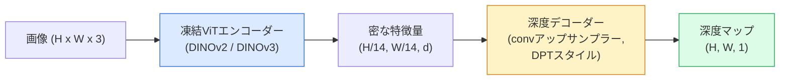

# 単眼深度・幾何学推定

> 深度マップは各ピクセルがカメラからの距離を示す1チャンネル画像だ。ステレオカメラやLiDARなしに1枚のRGBフレームから予測することはかつて不可能だった。2026年、凍結されたViTエンコーダに軽量ヘッドを加えるだけでグラウンドトゥルースから数パーセント以内に収まる。


## 学習目標

- 相対深度とメトリック深度を区別し、各プロダクションモデル（MiDaS、Marigold、Depth Anything V3、ZoeDepth）がどちらを解くかを述べる
- キャリブレーションなしで任意の1枚の画像の深度を予測するDepth Anything V3（DINOv2バックボーン）を使う
- 単眼深度が1枚の画像から機能する理由（遠近感の手がかり、テクスチャ勾配、学習済み事前知識）と、回復できないもの（絶対スケール、遮蔽された幾何学）を説明する
- 深度マップとピンホールカメラの内部パラメータを使って2D検出を3D点にリフトする

## 問題設定

深度は2Dコンピュータビジョンの欠けている軸だ。RGBが与えられると、画像平面上でどこに物があるかはわかるが、どれだけ離れているかはわからない。深度センサー（ステレオリグ、LiDAR、飛行時間センサー）はこれを直接解決するが、高価で壊れやすく、射程が限られている。

単眼深度推定 — 1枚のRGBフレームから深度を予測すること — はかつてぼやけた信頼性の低い出力を生成していた。2026年までに大規模な事前訓練済みエンコーダがそれを変えた。Depth Anything V3は凍結されたDINOv2バックボーンを使い、室内、屋外、医療、衛星のドメインにわたって汎化する深度マップを生成する。Marigoldは深度を条件付き拡散問題として再定式化する。ZoeDepthは真のメトリック距離を回帰する。

深度はまた2D検出と3D理解の橋渡しでもある: 検出されたボックスのピクセルに深度を掛けると2Dオブジェクトを3D点群にリフトできる。これがすべてのAR遮蔽システム、すべての障害物回避パイプライン、すべての「カップを取り上げる」ロボットのコアだ。

## 概念

### 相対深度とメトリック深度

- **相対深度** — 実世界の単位のない順序付けられた `z` 値。「ピクセルAはピクセルBより近いが、距離の比はメートルに固定されていない。」
- **メトリック深度** — カメラからの絶対距離（メートル）。モデルが画像の手がかりと実際の距離の統計的関係を学習していることが必要。

MiDaSとDepth Anything V3は相対深度を生成する。Marigoldは相対深度を生成する。ZoeDepth、UniDepth、Metric3Dはメトリック深度を生成する。メトリックモデルはカメラ内部パラメータに敏感。相対モデルはそうでない。

### エンコーダ-デコーダパターン



Depth Anything V3はエンコーダを凍結し、DPTスタイルのデコーダのみを訓練する。エンコーダがリッチな特徴を提供し、デコーダが画像解像度にアップサンプリングして深度を回帰する。

### 1枚の画像から深度が得られる理由

2D画像には深度と相関する多くの単眼の手がかりが含まれる：

- **遠近感** — 3Dで平行な線は2Dで収束する。
- **テクスチャ勾配** — 遠くの表面はより小さく密なテクスチャを持つ。
- **遮蔽の順序** — 近いオブジェクトが遠いオブジェクトを遮蔽する。
- **サイズの恒常性** — 既知のオブジェクト（車、人間）がおおよそのスケールを与える。
- **大気遠近法** — 遠くのオブジェクトは屋外シーンでよりかすんで青みを帯びて見える。

数十億枚の画像で訓練されたViTはこれらの手がかりを内面化する。十分なデータと強いバックボーンで、単眼深度は明示的な3D監督なしに適切な精度に達する。

### 単眼深度にできないこと

- 内部パラメータまたはシーン内の既知のオブジェクトなしの**絶対メトリックスケール**。ネットワークは「カップはスプーンの2倍遠い」を予測できるが、カップが1mなのか10mなのかは知ることができない。
- **遮蔽された幾何学** — 椅子の背面は見えず信頼性高く推論できない。
- **本当に無地/反射する表面** — 鏡、ガラス、均一な壁。ネットワークはもっともらしいが誤った深度を報告する。

### 2026年のDepth Anything V3

- バニラDINOv2 ViT-L/14をエンコーダとして（凍結）。
- DPTデコーダ。
- 多様なソースからのポーズ済み画像ペアで訓練（明示的な深度監督は不要。フォトメトリック整合性のみ）。
- **任意の数のビジュアル入力から、カメラポーズの有無にかかわらず**空間的に一貫した幾何学を予測。
- 単眼深度、任意ビュー幾何学、ビジュアルレンダリング、カメラポーズ推定にわたってSOTA。

2026年に深度が必要な時にドロップインで呼ぶモデルだ。

### Marigold — 深度のための拡散

Marigold（Ke et al., CVPR 2024）は深度推定を条件付きimage-to-image拡散として再定式化する。条件付け: RGB。ターゲット: 深度マップ。事前訓練済みStable Diffusion 2 U-Netをバックボーンとして使用。出力深度マップはオブジェクトの境界で非常に鮮明だ。トレードオフ: フィードフォワードモデルより遅い推論（10〜50ステップのデノイズ）。

### 内部パラメータとピンホールカメラ

深度 `d` を持つピクセル `(u, v)` をカメラ座標の3D点 `(X, Y, Z)` にリフトするには：

```
fx, fy, cx, cy = camera intrinsics
X = (u - cx) * d / fx
Y = (v - cy) * d / fy
Z = d
```

内部パラメータはEXIFメタデータ、キャリブレーションパターン、または単眼内部パラメータ推定器（Perspective Fields、UniDepth）から得る。内部パラメータなしで、60〜70°のFOVと中程度の解像度のプリンシパルを仮定して点群をレンダリングできる — 可視化には使えるが測定には使えない。

### 評価

2つの標準的なメトリクス：

- **AbsRel**（絶対相対誤差）: `mean(|d_pred - d_gt| / d_gt)`。低いほど良い。プロダクションモデルで0.05〜0.1。
- **delta < 1.25**（閾値精度）: `max(d_pred/d_gt, d_gt/d_pred) < 1.25` のピクセルの割合。高いほど良い。SOTAで0.9以上。

相対深度（Depth Anything V3、MiDaS）の評価には両メトリクスのスケールとシフト不変バージョンを使う。

## 実装する

### ステップ1：深度メトリクス

```python
import torch

def abs_rel_error(pred, target, mask=None):
    if mask is not None:
        pred = pred[mask]
        target = target[mask]
    return (torch.abs(pred - target) / target.clamp(min=1e-6)).mean().item()


def delta_accuracy(pred, target, threshold=1.25, mask=None):
    if mask is not None:
        pred = pred[mask]
        target = target[mask]
    ratio = torch.maximum(pred / target.clamp(min=1e-6), target / pred.clamp(min=1e-6))
    return (ratio < threshold).float().mean().item()
```

評価前に無効な深度ピクセル（ゼロ、NaN、飽和）を常にマスクする。

### ステップ2：スケールとシフトの整合

相対深度モデルでは、メトリクスを計算する前に予測をグラウンドトゥルースに整合させる。`a * pred + b = target` の最小二乗フィット：

```python
def align_scale_shift(pred, target, mask=None):
    if mask is not None:
        p = pred[mask]
        t = target[mask]
    else:
        p = pred.flatten()
        t = target.flatten()
    A = torch.stack([p, torch.ones_like(p)], dim=1)
    coeffs, *_ = torch.linalg.lstsq(A, t.unsqueeze(-1))
    a, b = coeffs[:2, 0]
    return a * pred + b
```

MiDaS / Depth Anythingを評価するときは `abs_rel_error` の前に `align_scale_shift` を実行する。

### ステップ3：深度を点群にリフトする

```python
import numpy as np

def depth_to_point_cloud(depth, intrinsics):
    H, W = depth.shape
    fx, fy, cx, cy = intrinsics
    v, u = np.meshgrid(np.arange(H), np.arange(W), indexing="ij")
    z = depth
    x = (u - cx) * z / fx
    y = (v - cy) * z / fy
    return np.stack([x, y, z], axis=-1)


depth = np.random.uniform(0.5, 4.0, (240, 320))
intr = (320.0, 320.0, 160.0, 120.0)
pc = depth_to_point_cloud(depth, intr)
print(f"point cloud shape: {pc.shape}  (H, W, 3)")
```

1つの関数、すべての3Dリフトアプリケーションに使える。点群を `.ply` にエクスポートしてMeshLabやCloudCompareで開く。

### ステップ4：合成深度シーンでのスモークテスト

```python
def synthetic_depth(size=96):
    yy, xx = np.meshgrid(np.arange(size), np.arange(size), indexing="ij")
    # Floor: linear gradient from near (top) to far (bottom)
    depth = 1.0 + (yy / size) * 4.0
    # Box in the middle: closer
    mask = (np.abs(xx - size / 2) < size / 6) & (np.abs(yy - size * 0.6) < size / 6)
    depth[mask] = 2.0
    return depth.astype(np.float32)


gt = torch.from_numpy(synthetic_depth(96))
pred = gt + 0.3 * torch.randn_like(gt)  # simulated prediction
aligned = align_scale_shift(pred, gt)
print(f"before align  absRel = {abs_rel_error(pred, gt):.3f}")
print(f"after align   absRel = {abs_rel_error(aligned, gt):.3f}")
```

### ステップ5：Depth Anything V3の使い方（リファレンス）

```python
import torch
from transformers import pipeline
from PIL import Image

pipe = pipeline(task="depth-estimation", model="LiheYoung/depth-anything-v2-large")

image = Image.open("street.jpg").convert("RGB")
out = pipe(image)
depth_np = np.array(out["depth"])
```

3行だ。`out["depth"]` はPILグレースケール。数学のためにnumpyに変換する。Depth Anything V3については、リリース後にモデルIDを変更する。APIは変わらない。

## 使ってみる

- **Depth Anything V3**（Meta AI / ByteDance、2024-2026）— 相対深度のデフォルト。プロダクションで最速のViT-largeバックボーンモデル。
- **Marigold**（ETH、2024）— 最高の視覚品質、遅い推論。
- **UniDepth**（ETH、2024）— 内部パラメータ推定付きのメトリック深度。
- **ZoeDepth**（Intel、2023）— メトリック深度。古いが信頼性あり。
- **MiDaS v3.1** — レガシーだが安定。比較の良いベースライン。

典型的な統合パターン：

1. RGBフレームが到着。
2. 深度モデルが深度マップを生成。
3. 検出器がボックスを生成。
4. ボックスの重心を深度を通じて3Dにリフト。利用可能であれば点群にマージ。
5. ダウンストリーム: AR遮蔽、経路計画、オブジェクトサイズ推定、ステレオ置き換え。

リアルタイム使用には、Depth Anything V2 Small（INT8量子化）が518x518で民生用GPUで約30 fpsに達する。

## 成果物を出す

このレッスンで生成するもの：

- `outputs/prompt-depth-model-picker.md` — レイテンシ、メトリック対相対の必要性、シーンタイプが与えられたとき、Depth Anything V3、Marigold、UniDepth、MiDaSを選ぶ。
- `outputs/skill-depth-to-pointcloud.md` — 正しい内部パラメータ処理と `.ply` へのエクスポートで深度マップから点群を構築するスキル。

## 演習

1. **（簡単）** Depth Anything V2を机の上の任意の10枚の画像で実行する。深度をグレースケールPNGとして保存して検査する。予測深度が間違って見えるオブジェクトを1つ特定し、単眼の手がかりが失敗した理由を説明する。
2. **（中程度）** Depth Anything V2からRGB + 深度が与えられたとき、点群にリフトして `open3d` でレンダリングする。2つのシーン（室内/屋外）を比較し、どちらがより信頼性高く見えるか注目する。
3. **（難しい）** 既知のオブジェクトの位置だけが異なる5組の画像を撮る（例えばボトルを30cm近くに移動）。両方でUniDepthを使ってメトリック深度を予測する。予測された距離の差を真の30cmと比較して報告する。

## キーワード

| 用語 | よく言われること | 実際の意味 |
|------|----------------|----------------------|
| 単眼深度 | "単一画像深度" | 1枚のRGBフレームからの深度推定。ステレオやLiDARなし |
| 相対深度 | "順序付き深度" | 実世界の単位のない順序付けられたz値 |
| メトリック深度 | "絶対距離" | メートル単位の深度。キャリブレーションまたはメトリック監督で訓練されたモデルが必要 |
| AbsRel | "絶対相対誤差" | |d_pred - d_gt| / d_gtの平均; 標準深度メトリクス |
| デルタ精度 | "delta < 1.25" | グラウンドトゥルースの25%以内の予測を持つピクセルの割合 |
| ピンホールカメラ | "fx、fy、cx、cy" | (u、v、d)を(X、Y、Z)にリフトするために使われるカメラモデル |
| DPT | "Dense Prediction Transformer" | 深度のための凍結ViTエンコーダの上に使われる畳み込みベースのデコーダ |
| DINOv2バックボーン | "機能する理由" | 深度ラベルなしでドメインにわたって汎化する自己教師あり特徴 |

## 参考資料

- [Depth Anything V3論文ページ](https://depth-anything.github.io/) — DINOv2エンコーダを使ったSOTA単眼深度
- [Marigold (Ke et al., CVPR 2024)](https://marigoldmonodepth.github.io/) — 拡散ベースの深度推定
- [UniDepth (Piccinelli et al., 2024)](https://arxiv.org/abs/2403.18913) — 内部パラメータ付きのメトリック深度
- [MiDaS v3.1 (Intel ISL)](https://github.com/isl-org/MiDaS) — 標準的な相対深度ベースライン
- [DINOv3ブログ記事 (Meta)](https://ai.meta.com/blog/dinov3-self-supervised-vision-model/) — 深度精度を高めるエンコーダファミリー
