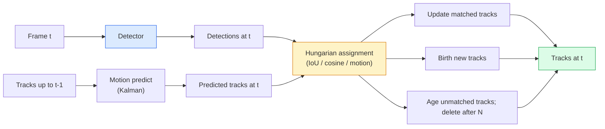

# 多物体追跡とビデオメモリ

> 追跡は検出に加えて関連付けを行うことだ。すべてのフレームを検出する。このフレームの検出を前のフレームのトラックにIDで対応させる。


## 学習目標

- 検出追跡と問合せベースの追跡を区別し、アルゴリズムファミリーを挙げる（SORT、DeepSORT、ByteTrack、BoT-SORT、SAM 2メモリトラッカー、SAM 3.1 Object Multiplex）
- クラシックな検出追跡のためにIoU + ハンガリアン割り当てをゼロから実装する
- SAM 2のメモリバンクとそれがIoUベースの関連付けより遮蔽をうまく処理できる理由を説明する
- 3つの追跡メトリクス（MOTA、IDF1、HOTA）を読み取り、特定のユースケースに対してどれが重要かを選ぶ

## 問題設定

検出器は1つのフレーム内のオブジェクトがどこにあるかを教えてくれる。トラッカーはフレーム `t` のある検出がフレーム `t-1` のある検出と同じオブジェクトであるかを教えてくれる。これなしでは、ラインを越えるオブジェクトを数えたり、遮蔽を通じてボールを追ったり、「車#4が8秒間レーンにいる」と知ることができない。

追跡はすべての動画向け製品に不可欠だ: スポーツ分析、監視、自律走行、医療動画分析、野生生物モニタリング、ウォーターマーカウント。コアビルディングブロックは共有されている: フレームごとの検出器、動きモデル（カルマンフィルタまたはリッチなもの）、関連付けステップ（IoU/コサイン/学習済み特徴に対するハンガリアンアルゴリズム）、トラックのライフサイクル（誕生、更新、消滅）。

2026年は2つの新しいパターンをもたらした: **SAM 2メモリベース追跡**（動きモデルの関連付けの代わりに特徴-メモリ）と**SAM 3.1 Object Multiplex**（同じ概念の多数のインスタンスに対する共有メモリ）。このレッスンはクラシックなスタックを最初に歩み、次にメモリベースのアプローチを扱う。

## 概念

### 検出追跡



2026年に遭遇するすべてのトラッカーはこのループのバリエーションだ。違い:

- **SORT**（2016）: カルマンフィルタ + IoUハンガリアン。シンプル、高速、外観モデルなし。
- **DeepSORT**（2017）: SORT + トラックごとのCNNベースの外観特徴（ReID埋め込み）。交差をうまく処理する。
- **ByteTrack**（2021）: 2番目のステージとして低信頼度の検出を関連付ける。外観特徴不要だがMOT17でトップパフォーマー。
- **BoT-SORT**（2022）: Byte + カメラ動き補償 + ReID。
- **StrongSORT / OC-SORT** — ByteTrackの後継でより良い動きと外観。

### 1段落でカルマンフィルタ

カルマンフィルタはトラックごとに共分散を持つ状態 `(x, y, w, h, dx, dy, dw, dh)` を維持する。各フレームで、定速モデルを使って状態を**予測**し、次にマッチした検出で**更新**する。更新は予測の不確実性が高いときほど検出を信頼する。これにより滑らかな軌道と短い遮蔽（1〜5フレーム）でもトラックを続けられる。

すべてのクラシックなトラッカーは動き予測ステップでカルマンフィルタを使う。

### ハンガリアンアルゴリズム

`M × N` のコスト行列（トラック × 検出）が与えられると、総コストを最小化する一対一の割り当てを見つける。コストは通常 `1 - IoU(track_bbox, detection_bbox)` または外観特徴の負のコサイン類似度だ。実行時間はO((M+N)^3)。MとNが最大約1000の場合、`scipy.optimize.linear_sum_assignment` でPythonでも十分高速だ。

### ByteTrackの核心的なアイデア

標準的なトラッカーは低信頼度の検出（< 0.5）をドロップする。ByteTrackはそれらを**第2ステージ候補**として保持する。高信頼度検出にトラックをマッチさせた後、マッチしないトラックが低信頼度検出に少し緩いIoU閾値でマッチを試みる。短い遮蔽やIDスイッチを群衆の近くで回復する。

### SAM 2メモリベース追跡

SAM 2は**メモリバンク**のインスタンスごとの時空間特徴を持つことで動画を処理する。1フレームのプロンプト（クリック、ボックス、テキスト）が与えられると、インスタンスをメモリにエンコードする。後続フレームでは、メモリが新しいフレームの特徴とクロスアテンションされ、デコーダが同じインスタンスの新しいフレームのマスクを生成する。

カルマンフィルタなし、ハンガリアン割り当てなし。関連付けはメモリアテンション操作に暗示的だ。

利点：
- 大きな遮蔽に対して堅牢（メモリはインスタンスのアイデンティティを多くのフレームにわたって保持）。
- SAM 3のテキストプロンプトと組み合わせるとオープンボキャブラリー。
- 別の動きモデルなしで機能する。

欠点：
- 多くのオブジェクト追跡ではByteTrackより遅い。
- メモリバンクが増加する。コンテキストウィンドウを制限する。

### SAM 3.1 Object Multiplex

以前のSAM 2 / SAM 3追跡はインスタンスごとに別々のメモリバンクを保持していた。50オブジェクトには50個のメモリバンク。Object Multiplex（2026年3月）はそれらを**インスタンスごとのクエリトークン**を持つ1つの共有メモリに折り畳む。コストはインスタンス数に対してサブリニアにスケールする。

Multiplexは2026年の群衆追跡のための新しいデフォルトだ: コンサートの群衆、倉庫作業員、交差点の交通。

### 知っておくべき3つのメトリクス

- **MOTA（多物体追跡精度）** — 1 - (FN + FP + IDスイッチ) / GT。エラータイプによって重み付け。検出と関連付けの失敗を混在させる単一メトリクス。
- **IDF1（ID F1）** — ID精度とID再現率の調和平均。各グラウンドトゥルーストラックが時間経過にわたってどれだけうまくIDを保持するかに具体的に焦点を当てる。IDスイッチに敏感なタスクにはMOTAより良い。
- **HOTA（高次追跡精度）** — 検出精度（DetA）と関連付け精度（AssA）に分解する。2020年以来のコミュニティ標準。最も包括的。

監視（誰が誰か）には: IDF1を報告する。スポーツ分析（パスの数）には: HOTA。一般的な学術比較: HOTA。

## 実装する

### ステップ1：IoUベースのコスト行列

```python
import numpy as np


def bbox_iou(a, b):
    """
    a, b: (N, 4) arrays of [x1, y1, x2, y2].
    Returns (N_a, N_b) IoU matrix.
    """
    ax1, ay1, ax2, ay2 = a[:, 0], a[:, 1], a[:, 2], a[:, 3]
    bx1, by1, bx2, by2 = b[:, 0], b[:, 1], b[:, 2], b[:, 3]
    inter_x1 = np.maximum(ax1[:, None], bx1[None, :])
    inter_y1 = np.maximum(ay1[:, None], by1[None, :])
    inter_x2 = np.minimum(ax2[:, None], bx2[None, :])
    inter_y2 = np.minimum(ay2[:, None], by2[None, :])
    inter = np.clip(inter_x2 - inter_x1, 0, None) * np.clip(inter_y2 - inter_y1, 0, None)
    area_a = (ax2 - ax1) * (ay2 - ay1)
    area_b = (bx2 - bx1) * (by2 - by1)
    union = area_a[:, None] + area_b[None, :] - inter
    return inter / np.clip(union, 1e-8, None)
```

### ステップ2：最小限のSORTスタイルトラッカー

簡潔さのために固定定速カルマンは省略 — ここでは単純なIoU関連付けを使う。プロダクションではカルマン予測が不可欠だ。`sort` Pythonパッケージが完全版を提供する。

```python
from scipy.optimize import linear_sum_assignment


class Track:
    def __init__(self, tid, bbox, frame):
        self.id = tid
        self.bbox = bbox
        self.last_frame = frame
        self.hits = 1

    def update(self, bbox, frame):
        self.bbox = bbox
        self.last_frame = frame
        self.hits += 1


class SimpleTracker:
    def __init__(self, iou_threshold=0.3, max_age=5):
        self.tracks = []
        self.next_id = 1
        self.iou_threshold = iou_threshold
        self.max_age = max_age

    def step(self, detections, frame):
        if not self.tracks:
            for d in detections:
                self.tracks.append(Track(self.next_id, d, frame))
                self.next_id += 1
            return [(t.id, t.bbox) for t in self.tracks]

        track_boxes = np.array([t.bbox for t in self.tracks])
        det_boxes = np.array(detections) if len(detections) else np.empty((0, 4))

        iou = bbox_iou(track_boxes, det_boxes) if len(det_boxes) else np.zeros((len(track_boxes), 0))
        cost = 1 - iou
        cost[iou < self.iou_threshold] = 1e6

        matched_track = set()
        matched_det = set()
        if cost.size > 0:
            row, col = linear_sum_assignment(cost)
            for r, c in zip(row, col):
                if cost[r, c] < 1.0:
                    self.tracks[r].update(det_boxes[c], frame)
                    matched_track.add(r); matched_det.add(c)

        for i, d in enumerate(det_boxes):
            if i not in matched_det:
                self.tracks.append(Track(self.next_id, d, frame))
                self.next_id += 1

        self.tracks = [t for t in self.tracks if frame - t.last_frame <= self.max_age]
        return [(t.id, t.bbox) for t in self.tracks]
```

60行。フレームごとの検出を受け取り、フレームごとのトラックIDを返す。実際のシステムはカルマン予測、ByteTrackの第2ステージ再マッチ、外観特徴を加える。

### ステップ3：合成軌道テスト

```python
def synthetic_frames(num_frames=20, num_objects=3, H=240, W=320, seed=0):
    rng = np.random.default_rng(seed)
    starts = rng.uniform(20, 200, size=(num_objects, 2))
    velocities = rng.uniform(-5, 5, size=(num_objects, 2))
    frames = []
    for f in range(num_frames):
        dets = []
        for i in range(num_objects):
            cx, cy = starts[i] + f * velocities[i]
            dets.append([cx - 10, cy - 10, cx + 10, cy + 10])
        frames.append(dets)
    return frames


tracker = SimpleTracker()
for f, dets in enumerate(synthetic_frames()):
    tracks = tracker.step(dets, f)
```

直線上で動く3つのオブジェクトはすべての20フレームにわたってIDを保持するはずだ。

### ステップ4：IDスイッチメトリクス

```python
def count_id_switches(tracks_per_frame, gt_per_frame):
    """
    tracks_per_frame:  list of list of (track_id, bbox)
    gt_per_frame:      list of list of (gt_id, bbox)
    Returns number of ID switches.
    """
    prev_assignment = {}
    switches = 0
    for tracks, gts in zip(tracks_per_frame, gt_per_frame):
        if not tracks or not gts:
            continue
        t_boxes = np.array([b for _, b in tracks])
        g_boxes = np.array([b for _, b in gts])
        iou = bbox_iou(g_boxes, t_boxes)
        for g_idx, (gt_id, _) in enumerate(gts):
            j = iou[g_idx].argmax()
            if iou[g_idx, j] > 0.5:
                t_id = tracks[j][0]
                if gt_id in prev_assignment and prev_assignment[gt_id] != t_id:
                    switches += 1
                prev_assignment[gt_id] = t_id
    return switches
```

これはIDF1に隣接した単純化されたメトリクスだ: グラウンドトゥルースオブジェクトが割り当てられた予測トラックIDを変える回数を数える。実際のMOTA / IDF1 / HOTAツールは `py-motmetrics` と `TrackEval` にある。

## 使ってみる

2026年のプロダクショントラッカー：

- `ultralytics` — YOLOv8 + ByteTrack / BoT-SORTが組み込み。`results = model.track(source, tracker="bytetrack.yaml")`。デフォルト。
- `supervision`（Roboflow）— ByteTrackラッパーとアノテーションユーティリティ。
- SAM 2 / SAM 3.1 — `processor.track()` 経由のメモリベース追跡。
- カスタムスタック: 検出器（YOLOv8 / RT-DETR）+ `sort-tracker` / `OC-SORT` / `StrongSORT`。

選択：

- 歩行者/車/ボックスの30fps以上: **ByteTrackとultralytics**。
- 群衆内の1クラスの多数インスタンス: **SAM 3.1 Object Multiplex**。
- 識別可能な外観を持つ重い遮蔽: **DeepSORT / StrongSORT**（ReID特徴）。
- スポーツ/複雑な相互作用: **BoT-SORT**または学習済みトラッカー（MOTRv3）。

## 成果物を出す

このレッスンで生成するもの：

- `outputs/prompt-tracker-picker.md` — シーンタイプ、遮蔽パターン、レイテンシ予算が与えられたとき、SORT / ByteTrack / BoT-SORT / SAM 2 / SAM 3.1を選ぶ。
- `outputs/skill-mot-evaluator.md` — グラウンドトゥルーストラックに対してMOTA / IDF1 / HOTAの完全な評価ハーネスを書き出す。

## 演習

1. **（簡単）** 上の合成トラッカーを3、10、30オブジェクトで実行する。それぞれの場合のIDスイッチ数を報告する。単純なIoUのみの関連付けが失敗し始める場所を特定する。
2. **（中程度）** 関連付けの前に定速カルマン予測ステップを加える。短い（2〜3フレーム）遮蔽がもはやIDスイッチを引き起こさないことを示す。
3. **（難しい）** SAM 2のメモリベーストラッカー（`transformers` 経由）を代替トラッカーバックエンドとして統合する。SimpleTrackerとSAM 2の両方を30秒の群衆クリップで実行し、IDスイッチ数を比較する。5人の目立つ人に対して手動でグラウンドトゥルースIDをラベル付けする。

## キーワード

| 用語 | よく言われること | 実際の意味 |
|------|----------------|----------------------|
| 検出追跡 | "検出してから関連付ける" | フレームごとの検出器 + IoU/外観のハンガリアン割り当て |
| カルマンフィルタ | "動き予測" | 滑らかなトラック予測と遮蔽処理のための線形ダイナミクス + 共分散 |
| ハンガリアンアルゴリズム | "最適割り当て" | 最小コストの二部マッチング問題を解く。`scipy.optimize.linear_sum_assignment` |
| ByteTrack | "低信頼度の第2パス" | 短い遮蔽を回復するためにマッチしないトラックを低信頼度検出に再マッチする |
| DeepSORT | "SORT + 外観" | クロスフレームマッチングのためのReID特徴を追加。IDの保持に優れている |
| メモリバンク | "SAM 2のトリック" | インスタンスごとの時空間特徴をフレームにわたって保存。クロスアテンションが明示的な関連付けを置き換える |
| Object Multiplex | "SAM 3.1の共有メモリ" | インスタンスごとのクエリを持つ単一の共有メモリ。高速な多オブジェクト追跡のため |
| HOTA | "モダンな追跡メトリクス" | 検出と関連付け精度に分解。コミュニティ標準 |

## 参考資料

- [SORT (Bewley et al., 2016)](https://arxiv.org/abs/1602.00763) — 最小限の検出追跡論文
- [DeepSORT (Wojke et al., 2017)](https://arxiv.org/abs/1703.07402) — 外観特徴を追加
- [ByteTrack (Zhang et al., 2022)](https://arxiv.org/abs/2110.06864) — 低信頼度の第2パス
- [BoT-SORT (Aharon et al., 2022)](https://arxiv.org/abs/2206.14651) — カメラ動き補償
- [HOTA (Luiten et al., 2020)](https://arxiv.org/abs/2009.07736) — 分解された追跡メトリクス
- [SAM 2動画セグメンテーション (Meta, 2024)](https://ai.meta.com/sam2/) — メモリベーストラッカー
- [SAM 3.1 Object Multiplex (Meta, 2026年3月)](https://ai.meta.com/blog/segment-anything-model-3/)
