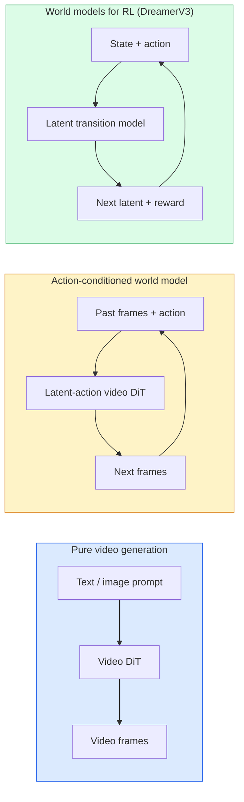

# ワールドモデルとビデオ拡散

> 次の数秒のシーンを予測する動画モデルはワールドシミュレータだ。その予測にアクションを条件付けると、学習されたゲームエンジンができる。


## 学習目標

- 純粋な動画生成モデル（Sora 2）とアクション条件付きワールドモデル（Genie 3、DreamerV3）の違いを説明する
- ビデオDiTを説明する: 時空間パッチ、3D位置エンコーディング、(T、H、W)トークンにわたるジョイントアテンション
- ワールドモデルがロボティクスにどう組み込まれるかを追う: VLMが計画 → 動画モデルがシミュレート → 逆ダイナミクスがアクションを出力
- 与えられたユースケース（クリエイティブ動画、インタラクティブシミュレーション、自律走行合成）に対してSora 2、Genie 3、Runway GWM-1 Worlds、Wan-Video、HunyuanVideoのどれを選ぶか決める

## 問題設定

動画生成とワールドモデリングは2026年に収束した。1分間のまとまった動画を生成できるモデルはある意味で世界がどのように動くかを学習している: オブジェクトの永続性、重力、因果関係、スタイル。その予測にアクション（左に歩く、ドアを開ける）を条件付けると、動画モデルはゲームエンジン、ドライビングシミュレータ、またはロボティクス環境を置き換えられる学習可能なシミュレータになる。

具体的な賭けは明確だ。Genie 3は1枚の画像からプレイ可能な環境を生成する。Runway GWM-1 Worldsは無限に探索可能なシーンを合成する。Sora 2は同期オーディオとモデル化された物理を持つ1分の動画を生成する。NVIDIA Cosmos-Drive、Wayve Gaia-2、Tesla DrivingWorldは自律走行訓練データのためのリアルなドライビング動画を生成する。ワールドモデルパラダイムはロボティクスのシム・トゥ・リアルを静かに引き継ぎつつある。

このレッスンはフェーズ4の「全体像」レッスンだ。画像生成、動画理解、エージェント型推論を、主要な研究が向かっているアーキテクチャパターンに接続する。

## 概念

### ワールドモデリングの3ファミリー



- **Sora 2** はプロンプトを条件とした純粋な動画生成だ。アクションインターフェースなし。生成途中で「操縦」できない。
- **Genie 3**、**GWM-1 Worlds**、**Mirage / Magica** はアクション条件付きワールドモデルだ。観察された動画から潜在的なアクションを推論し、アクションに対して将来のフレーム予測を条件付ける。インタラクティブ — キーを押したりカメラを動かしたりするとシーンが応答する。
- **DreamerV3** とクラシックなRLワールドモデルファミリーは明示的なアクション条件付きを持つ潜在空間で予測し、報酬シグナルで訓練される。視覚的ではないが、サンプル効率の高いRLに対してより有用だ。

### ビデオDiTアーキテクチャ

```
Video latent:          (C, T, H, W)
Patchify (spatial):    grid of P_h x P_w patches per frame
Patchify (temporal):   group P_t frames into a temporal patch
Resulting tokens:      (T / P_t) * (H / P_h) * (W / P_w) tokens
```

位置エンコーディングは3Dだ: (t、h、w)座標ごとのロータリーまたは学習済み埋め込み。アテンションは以下のいずれか：

- **フルジョイント** — すべてのトークンがすべてのトークンにアテンションを付ける。Nトークンで O(N^2)。長い動画には禁止的。
- **分割** — 時間アテンション（同じ空間位置、時間を越えて: `(H*W) * T^2`）と空間アテンション（同じタイムステップ、空間を越えて: `T * (H*W)^2`）を交互に。TimeSformerとほとんどのビデオDiTで使われる。
- **ウィンドウ** — (t、h、w)でのローカルウィンドウ。Video Swinで使われる。

2026年のすべての動画拡散モデルはこれら3つのパターンのいずれかにAdaLN条件付け（レッスン23）と整流フローを組み合わせて使う。

### アクション条件付け: 潜在アクションモデル

Genieは連続する2フレームのペアからフレーム間のアクションを識別的に予測することで**潜在的なアクション**をフレームごとに学習する。そのすると、モデルのデコーダは推論された潜在アクションに条件付けられる — 明示的なキーボードキーではなく。推論時、ユーザーは潜在アクションを指定（または新鮮な事前分布からサンプリング）でき、モデルはそのアクションと一貫した次のフレームを生成する。

Soraはアクションインターフェースを完全にスキップする。そのデコーダは過去の時空間トークンから次の時空間トークンを予測する。プロンプトはスタートを条件付けるが、何も生成途中で操縦しない。

### 物理的な妥当性

Sora 2の2026年リリースは**物理的な妥当性**を明示的に宣伝した: 重み、バランス、オブジェクトの永続性、原因と結果。チームが手動評価スコアで測定。落とされたオブジェクト、衝突するキャラクター、意図的な失敗（ミスしたジャンプ）でSora 1より目に見えて改善。

妥当性は依然として支配的な失敗モードだ。2024〜2025年のスパゲッティを食べる人やグラスから飲む人の動画は、モデルが持続するオブジェクト表現を欠くことを明らかにした。2026年のモデル（Sora 2、Runway Gen-5、HunyuanVideo）はこれらを減らすが排除はしない。

### 自律走行ワールドモデル

ドライビングワールドモデルは軌道、バウンディングボックス、またはナビゲーションマップを条件としてリアルな道路シーンを生成する。用途：

- **Cosmos-Drive-Dreams**（NVIDIA）— RL訓練のための数分のドライビング動画を生成する。
- **Gaia-2**（Wayve）— ポリシー評価のための軌道条件付きシーン合成。
- **DrivingWorld**（Tesla）— 様々な天候、時間帯、交通状況をシミュレートする。
- **Vista**（ByteDance）— 反応するドライビングシーン合成。

これらは難しいケース — 夜の歩行者の飛び出し、凍った交差点、通常でない車種 — のために高価な実世界データ収集を置き換え、そうでなければ何百万マイルもの走行が必要になる。

### ロボティクススタック: VLM + 動画モデル + 逆ダイナミクス

新しい3コンポーネントロボティクスループ：

1. **VLM** がゴール（「赤いカップを取り上げる」）を解析し、高レベルのアクションシーケンスを計画する。
2. **動画生成モデル** が各アクションを実行するとどう見えるかをシミュレートする — N フレーム先の観察を予測する。
3. **逆ダイナミクスモデル** がそれらの観察を生成する具体的な運動コマンドを抽出する。

これは報酬整形とサンプル大量消費のRLを置き換える。ワールドモデルが想像を担い、逆ダイナミクスがアクチュエーションのループを閉じる。Genie Envisionerは1つの具体化だ。多くの研究グループがこの構造に収束しつつある。

### 評価

- **視覚品質** — FVD（フレシェ動画距離）、ユーザースタディ。
- **プロンプト整合** — フレームごとのCLIPScore、VQAスタイル評価。
- **物理的妥当性** — ベンチマークスイートの手動評価（Sora 2の内部ベンチマーク、VBench）。
- **制御可能性**（インタラクティブワールドモデルの場合）— アクション → 観察の整合性。前の状態に戻れるか？

### 2026年のモデル全景

| モデル | 用途 | パラメータ | 出力 | ライセンス |
|-------|-----|------------|--------|---------|
| Sora 2 | テキストから動画、オーディオ | — | 1分1080p + オーディオ | APIのみ |
| Runway Gen-5 | テキスト/画像から動画 | — | 10秒クリップ | API |
| Runway GWM-1 Worlds | インタラクティブワールド | — | 無限3Dロールアウト | API |
| Genie 3 | 画像からインタラクティブワールド | 11B以上 | プレイ可能フレーム | リサーチプレビュー |
| Wan-Video 2.1 | オープンテキストから動画 | 14B | 高品質クリップ | 非商用 |
| HunyuanVideo | オープンテキストから動画 | 13B | 10秒クリップ | 許容的ライセンス |
| Cosmos / Cosmos-Drive | 自律走行シミュレーション | 7〜14B | ドライビングシーン | NVIDIAオープン |
| Magica / Mirage 2 | AIネイティブゲームエンジン | — | 変更可能なワールド | 製品 |

## 実装する

### ステップ1：動画の3Dパッチ化

```python
import torch
import torch.nn as nn


class VideoPatch3D(nn.Module):
    def __init__(self, in_channels=4, dim=64, patch_t=2, patch_h=2, patch_w=2):
        super().__init__()
        self.proj = nn.Conv3d(
            in_channels, dim,
            kernel_size=(patch_t, patch_h, patch_w),
            stride=(patch_t, patch_h, patch_w),
        )
        self.patch_t = patch_t
        self.patch_h = patch_h
        self.patch_w = patch_w

    def forward(self, x):
        # x: (N, C, T, H, W)
        x = self.proj(x)
        n, c, t, h, w = x.shape
        tokens = x.reshape(n, c, t * h * w).transpose(1, 2)
        return tokens, (t, h, w)
```

ストライドがカーネルと等しい3D畳み込みが時空間パッチ化の役割を果たす。`(T、H、W) -> (T/2、H/2、W/2)` のトークングリッドになる。

### ステップ2：3DロータリーPosition Encoding

`t`、`h`、`w` 軸に別々に適用されるRotary Position Embeddings（RoPE）：

```python
def rope_3d(tokens, t_dim, h_dim, w_dim, grid):
    """
    tokens: (N, T*H*W, D)
    grid: (T, H, W) sizes
    t_dim + h_dim + w_dim == D
    """
    T, H, W = grid
    n, seq, d = tokens.shape
    if t_dim + h_dim + w_dim != d:
        raise ValueError(f"t_dim+h_dim+w_dim ({t_dim}+{h_dim}+{w_dim}) must equal D={d}")
    assert seq == T * H * W
    t_idx = torch.arange(T, device=tokens.device).repeat_interleave(H * W)
    h_idx = torch.arange(H, device=tokens.device).repeat_interleave(W).repeat(T)
    w_idx = torch.arange(W, device=tokens.device).repeat(T * H)
    # Simplified: just scale channels by frequencies. Real RoPE rotates pairs.
    freqs_t = torch.exp(-torch.log(torch.tensor(10000.0)) * torch.arange(t_dim // 2, device=tokens.device) / (t_dim // 2))
    freqs_h = torch.exp(-torch.log(torch.tensor(10000.0)) * torch.arange(h_dim // 2, device=tokens.device) / (h_dim // 2))
    freqs_w = torch.exp(-torch.log(torch.tensor(10000.0)) * torch.arange(w_dim // 2, device=tokens.device) / (w_dim // 2))
    emb_t = torch.cat([torch.sin(t_idx[:, None] * freqs_t), torch.cos(t_idx[:, None] * freqs_t)], dim=-1)
    emb_h = torch.cat([torch.sin(h_idx[:, None] * freqs_h), torch.cos(h_idx[:, None] * freqs_h)], dim=-1)
    emb_w = torch.cat([torch.sin(w_idx[:, None] * freqs_w), torch.cos(w_idx[:, None] * freqs_w)], dim=-1)
    return tokens + torch.cat([emb_t, emb_h, emb_w], dim=-1)
```

加算形式を単純化。実際のRoPEは周波数でペアになったチャンネルを回転させる。位置情報は同じだ。

### ステップ3：分割アテンションブロック

```python
class DividedAttentionBlock(nn.Module):
    def __init__(self, dim=64, heads=2):
        super().__init__()
        self.time_attn = nn.MultiheadAttention(dim, heads, batch_first=True)
        self.space_attn = nn.MultiheadAttention(dim, heads, batch_first=True)
        self.ln1 = nn.LayerNorm(dim)
        self.ln2 = nn.LayerNorm(dim)
        self.ln3 = nn.LayerNorm(dim)
        self.mlp = nn.Sequential(nn.Linear(dim, 4 * dim), nn.GELU(), nn.Linear(4 * dim, dim))

    def forward(self, x, grid):
        T, H, W = grid
        n, seq, d = x.shape
        # time attention: same (h, w), across t
        xt = x.view(n, T, H * W, d).permute(0, 2, 1, 3).reshape(n * H * W, T, d)
        a, _ = self.time_attn(self.ln1(xt), self.ln1(xt), self.ln1(xt), need_weights=False)
        xt = (xt + a).reshape(n, H * W, T, d).permute(0, 2, 1, 3).reshape(n, seq, d)
        # space attention: same t, across (h, w)
        xs = xt.view(n, T, H * W, d).reshape(n * T, H * W, d)
        a, _ = self.space_attn(self.ln2(xs), self.ln2(xs), self.ln2(xs), need_weights=False)
        xs = (xs + a).reshape(n, T, H * W, d).reshape(n, seq, d)
        xs = xs + self.mlp(self.ln3(xs))
        return xs
```

時間アテンションは各空間位置で時間を越えてアテンションを付ける。空間アテンションは各フレームで位置を越えてアテンションを付ける。O((THW)^2)の代わりに2つのO(T^2 + (HW)^2)操作だ。これがTimeSformerとすべての現代のビデオDiTのコアだ。

### ステップ4：小さなビデオDiTを組み立てる

```python
class TinyVideoDiT(nn.Module):
    def __init__(self, in_channels=4, dim=64, depth=2, heads=2):
        super().__init__()
        self.patch = VideoPatch3D(in_channels=in_channels, dim=dim, patch_t=2, patch_h=2, patch_w=2)
        self.blocks = nn.ModuleList([DividedAttentionBlock(dim, heads) for _ in range(depth)])
        self.out = nn.Linear(dim, in_channels * 2 * 2 * 2)

    def forward(self, x):
        tokens, grid = self.patch(x)
        for blk in self.blocks:
            tokens = blk(tokens, grid)
        return self.out(tokens), grid
```

動作する動画生成器ではない。すべての部品が正しく形成されることを示す構造的デモだ。

### ステップ5：形状確認

```python
vid = torch.randn(1, 4, 8, 16, 16)  # (N, C, T, H, W)
model = TinyVideoDiT()
out, grid = model(vid)
print(f"input  {tuple(vid.shape)}")
print(f"tokens grid {grid}")
print(f"output {tuple(out.shape)}")
```

`grid = (4, 8, 8)` と `out = (1, 256, 32)` を期待する。ヘッドは次にトークンごとの時空間パッチに射影し、動画に逆パッチ化する準備ができる。

## 使ってみる

2026年のプロダクションアクセスパターン：

- **Sora 2 API**（OpenAI）— テキストから動画、同期オーディオ。プレミアム価格。
- **Runway Gen-5 / GWM-1**（Runway）— 画像から動画、インタラクティブワールド。
- **Wan-Video 2.1 / HunyuanVideo** — オープンソースセルフホスト。
- **Cosmos / Cosmos-Drive**（NVIDIA）— ドライビングシミュレーションオープンウェイト。
- **Genie 3** — リサーチプレビュー、アクセスをリクエスト。

インタラクティブワールドモデルデモの構築には: 品質のためにWan-Videoから始め、インタラクティビティのために潜在アクションアダプタを重ねる。自律走行シミュレーションには: Cosmos-Driveが2026年のオープンリファレンスだ。

ロボティクスでは実際に動いているスタック：

1. 言語ゴール → VLM（Qwen3-VL）→ 高レベル計画。
2. 計画 → 潜在アクション動画モデル → 想像されたロールアウト。
3. ロールアウト → 逆ダイナミクスモデル → 低レベルアクション。
4. アクション実行 → 観察をステップ1にフィードバック。

## 成果物を出す

このレッスンで生成するもの：

- `outputs/prompt-video-model-picker.md` — タスク、ライセンス、レイテンシが与えられたとき、Sora 2 / Runway / Wan / HunyuanVideo / Cosmosを選ぶ。
- `outputs/skill-physical-plausibility-checks.md` — 生成された任意の動画で出荷前に実行する自動チェック（オブジェクトの永続性、重力、連続性）を定義するスキル。

## 演習

1. **（簡単）** patch-t=2、patch-h=8、patch-w=8で5秒の360p動画のトークン数を計算する。このサイズでのアテンションのメモリについて推論する。
2. **（中程度）** 上の分割アテンションブロックをフルジョイントアテンションブロックに置き換えて形状とパラメータ数を測定する。実際の動画モデルに分割アテンションが必要な理由を説明する。
3. **（難しい）** 最小限の潜在アクション動画モデルを構築する: (frame_t、action_t、frame_{t+1})トリプルのデータセット（任意のシンプルな2Dゲーム）を取り、アクション埋め込みで条件付けられた小さなビデオDiTを訓練し、異なるアクションが異なる次のフレームを生成することを示す。

## キーワード

| 用語 | よく言われること | 実際の意味 |
|------|----------------|----------------------|
| ワールドモデル | "学習されたシミュレータ" | 状態とアクションが与えられたとき将来の観察を予測するモデル |
| ビデオDiT | "時空間トランスフォーマー" | 3Dパッチ化と分割アテンションを持つ拡散トランスフォーマー |
| 潜在アクション | "推論された制御" | フレームペアから推論される離散または連続アクション潜在変数。次フレーム生成の条件付けに使われる |
| 分割アテンション | "時間、その後空間" | ブロックごとに2つのアテンション操作 — 時間を越えてその後空間を越えて — O(N^2)を管理可能に保つ |
| オブジェクトの永続性 | "物がリアルなままであること" | 動画モデルが学習しなければならないシーンの性質。食べ物やガラス製品での典型的な失敗モード |
| FVD | "フレシェ動画距離" | FIDの動画版。主要な視覚品質メトリクス |
| 逆ダイナミクスモデル | "観察からアクションへ" | (状態、次の状態)が与えられたとき、それらを繋ぐアクションを出力する。ロボティクスのループを閉じる |
| Cosmos-Drive | "NVIDIAドライビングシミュレーター" | RLと評価のためのオープンウェイト自律走行ワールドモデル |

## 参考資料

- [Soraテクニカルレポート (OpenAI)](https://openai.com/index/video-generation-models-as-world-simulators/)
- [Genie: Generative Interactive Environments (Bruce et al., 2024)](https://arxiv.org/abs/2402.15391) — 潜在アクションワールドモデル
- [TimeSformer (Bertasius et al., 2021)](https://arxiv.org/abs/2102.05095) — 動画トランスフォーマーの分割アテンション
- [DreamerV3 (Hafner et al., 2023)](https://arxiv.org/abs/2301.04104) — RLのためのワールドモデル
- [Cosmos-Drive-Dreams (NVIDIA, 2025)](https://research.nvidia.com/labs/toronto-ai/cosmos-drive-dreams/) — ドライビングワールドモデル
- [Top 10 Video Generation Models 2026 (DataCamp)](https://www.datacamp.com/blog/top-video-generation-models)
- [From Video Generation to World Model — サーベイリポジトリ](https://github.com/ziqihuangg/Awesome-From-Video-Generation-to-World-Model/)
