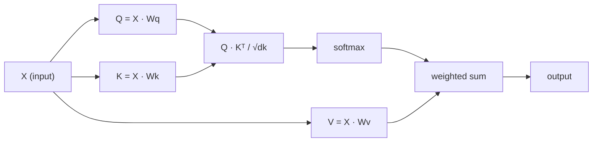

# Self-Attentionをゼロから

> アテンションはルックアップテーブルだ。すべての単語が「私にとって何が重要か？」と問いかけ——そして答えを学習する。


## 学習目標

- NumPyだけを使い、クエリ・キー・バリューの射影とsoftmax加重和を含む、スケール済みドット積Self-Attentionをゼロから実装する
- ヘッドを分割し、並列アテンションを計算し、結果を連結するMulti-Head Attention層を構築する
- アテンション行列がどのようにトークンの関係を捉えるかをトレースし、`sqrt(d_k)`によるスケーリングがsoftmax飽和を防ぐ理由を説明する
- 双方向アテンションを自己回帰（デコーダスタイル）アテンションに変換するためのCausal Maskを適用する

## 問題

RNNはシーケンスを1トークンずつ処理する。トークン50に到達するころには、トークン1の情報は50回の圧縮ステップを通じてすでに絞り込まれている。長距離依存関係は固定サイズの隠れ状態に押し込められてしまう——どれだけLSTMをゲーティングしても完全には解決できないボトルネックだ。

2014年のBahdanauアテンション論文が解決策を示した：デコーダが現在のステップに関係のあるエンコーダ位置を選んで振り返れるようにする。しかしそれはまだRNNに組み込まれていた。2017年の「Attention Is All You Need」論文はより鋭い問いを立てた：アテンションが*唯一*のメカニズムだったとしたら？再帰なし。畳み込みなし。アテンションだけ。

Self-Attentionにより、シーケンスのすべての位置が他のすべての位置に1つの並列ステップでアテンションを向けられる。それがTransformerを高速で、スケーラブルで、支配的にしているものだ。

## 概念

### データベースルックアップの類比

アテンションをソフトなデータベースルックアップとして考える：

```
従来のデータベース:
  クエリ: "フランスの首都"  -->  完全一致  -->  "パリ"

アテンション:
  クエリ: "フランスの首都"  -->  すべてのキーとの類似度  -->  すべての値の加重ブレンド
```

各トークンは3つのベクトルを生成する：
- **クエリ（Q）**：「私は何を求めているか？」
- **キー（K）**：「私は何を含んでいるか？」
- **バリュー（V）**：「選ばれたらどんな情報を提供するか？」

クエリとすべてのキーのドット積がアテンションスコアを生成する。高いスコアは「このキーが私のクエリにマッチする」を意味する。それらのスコアがバリューを重み付ける。出力はバリューの加重和だ。

### Q、K、Vの計算

各トークンの埋め込みは3つの学習済み重み行列によって射影される：

```
入力埋め込み（n個のトークンのシーケンス、各d次元）:

  X = [x1, x2, x3, ..., xn]       shape: (n, d)

3つの重み行列:

  Wq  shape: (d, dk)
  Wk  shape: (d, dk)
  Wv  shape: (d, dv)

射影:

  Q = X @ Wq    shape: (n, dk)      各トークンのクエリ
  K = X @ Wk    shape: (n, dk)      各トークンのキー
  V = X @ Wv    shape: (n, dv)      各トークンのバリュー
```

1つのトークンを視覚的に示すと：

```
             Wq
  x_i ------[*]------> q_i    "私は何を求めているか？"
       |
       |     Wk
       +----[*]------> k_i    "私は何を含んでいるか？"
       |
       |     Wv
       +----[*]------> v_i    "私は何を提供するか？"
```

### アテンション行列

すべてのトークンのQ、K、Vが揃ったら、アテンションスコアは行列を形成する：

```
Scores = Q @ K^T    shape: (n, n)

              k1    k2    k3    k4    k5
        +-----+-----+-----+-----+-----+
   q1   | 2.1 | 0.3 | 0.1 | 0.8 | 0.2 |   <- q1が各キーにどれだけアテンションを向けるか
        +-----+-----+-----+-----+-----+
   q2   | 0.4 | 1.9 | 0.7 | 0.1 | 0.3 |
        +-----+-----+-----+-----+-----+
   q3   | 0.2 | 0.6 | 2.3 | 0.5 | 0.1 |
        +-----+-----+-----+-----+-----+
   q4   | 0.9 | 0.1 | 0.4 | 1.7 | 0.6 |
        +-----+-----+-----+-----+-----+
   q5   | 0.1 | 0.3 | 0.2 | 0.5 | 2.0 |
        +-----+-----+-----+-----+-----+

各行: あるトークンがシーケンス全体に向けるアテンション
```

1つのクエリがすべてのキーをスキャンするのを観察する：各行はすべてのトークンにスコアをつけ、softmaxがスコアを重みに変換し、コンテキストベクトルはバリューの加重ブレンドになる。

```figure
attention-matrix
```

### なぜスケールするのか？

ドット積は次元dkとともに成長する。dk = 64の場合、ドット積は数十の範囲になり、softmaxを勾配が消失する領域に押し込む。解決策：sqrt(dk)で割る。

```
スケール済みスコア = (Q @ K^T) / sqrt(dk)
```

これにより値がsoftmaxが有用な勾配を生成する範囲に保たれる。

### Softmaxがスコアを重みに変換する

Softmaxは生のスコアを各行の確率分布に変換する：

```
q1の生スコア:   [2.1, 0.3, 0.1, 0.8, 0.2]
                        |
                     softmax
                        |
アテンション重み:   [0.52, 0.09, 0.07, 0.14, 0.08]   (合計 ~1.0)
```

これで各トークンは他のすべてのトークンにどれだけアテンションを向けるかを示す重みセットを持つ。

### バリューの加重和

各トークンの最終出力はすべてのバリューベクトルの加重和だ：

```
output_i = sum( attention_weight[i][j] * v_j  for all j )

トークン1の場合:
  output_1 = 0.52 * v1 + 0.09 * v2 + 0.07 * v3 + 0.14 * v4 + 0.08 * v5
```

### 全パイプライン



1行の数式：

```
Attention(Q, K, V) = softmax( Q @ K^T / sqrt(dk) ) @ V
```

## 実装する

### ステップ1：ゼロからSoftmax

Softmaxは生のロジットを確率に変換する。数値的安定性のために最大値を引く。

```python
import numpy as np

def softmax(x):
    shifted = x - np.max(x, axis=-1, keepdims=True)
    exp_x = np.exp(shifted)
    return exp_x / np.sum(exp_x, axis=-1, keepdims=True)

logits = np.array([2.0, 1.0, 0.1])
print(f"logits:  {logits}")
print(f"softmax: {softmax(logits)}")
print(f"sum:     {softmax(logits).sum():.4f}")
```

### ステップ2：スケール済みドット積アテンション

コア関数。Q、K、V行列を受け取り、アテンション出力と重み行列を返す。

```python
def scaled_dot_product_attention(Q, K, V):
    dk = Q.shape[-1]
    scores = Q @ K.T / np.sqrt(dk)
    weights = softmax(scores)
    output = weights @ V
    return output, weights
```

### ステップ3：学習済み射影を持つSelf-Attentionクラス

Xavierスケーリングで初期化されたWq、Wk、Wvの重み行列を持つ完全なSelf-Attentionモジュール。

```python
class SelfAttention:
    def __init__(self, d_model, dk, dv, seed=42):
        rng = np.random.default_rng(seed)
        scale = np.sqrt(2.0 / (d_model + dk))
        self.Wq = rng.normal(0, scale, (d_model, dk))
        self.Wk = rng.normal(0, scale, (d_model, dk))
        scale_v = np.sqrt(2.0 / (d_model + dv))
        self.Wv = rng.normal(0, scale_v, (d_model, dv))
        self.dk = dk

    def forward(self, X):
        Q = X @ self.Wq
        K = X @ self.Wk
        V = X @ self.Wv
        output, weights = scaled_dot_product_attention(Q, K, V)
        return output, weights
```

### ステップ4：文に対して実行する

文の偽の埋め込みを作り、アテンション重みを観察する。

```python
sentence = ["The", "cat", "sat", "on", "the", "mat"]
n_tokens = len(sentence)
d_model = 8
dk = 4
dv = 4

rng = np.random.default_rng(42)
X = rng.normal(0, 1, (n_tokens, d_model))

attn = SelfAttention(d_model, dk, dv, seed=42)
output, weights = attn.forward(X)

print("アテンション重み（各行：そのトークンが見る場所）:\n")
print(f"{'':>6}", end="")
for token in sentence:
    print(f"{token:>6}", end="")
print()

for i, token in enumerate(sentence):
    print(f"{token:>6}", end="")
    for j in range(n_tokens):
        w = weights[i][j]
        print(f"{w:6.3f}", end="")
    print()
```

### ステップ5：ASCIIヒートマップでアテンションを可視化する

アテンション重みを文字にマップして素早い視覚化を行う。

```python
def ascii_heatmap(weights, tokens, chars=" ░▒▓█"):
    n = len(tokens)
    print(f"\n{'':>6}", end="")
    for t in tokens:
        print(f"{t:>6}", end="")
    print()

    for i in range(n):
        print(f"{tokens[i]:>6}", end="")
        for j in range(n):
            level = int(weights[i][j] * (len(chars) - 1) / weights.max())
            level = min(level, len(chars) - 1)
            print(f"{'  ' + chars[level] + '   '}", end="")
        print()

ascii_heatmap(weights, sentence)
```

## 使ってみる

PyTorchの`nn.MultiheadAttention`は私たちが構築したものとまったく同じことをする。マルチヘッド分割と出力射影が加わっている：

```python
import torch
import torch.nn as nn

d_model = 8
n_heads = 2
seq_len = 6

mha = nn.MultiheadAttention(embed_dim=d_model, num_heads=n_heads, batch_first=True)

X_torch = torch.randn(1, seq_len, d_model)

output, attn_weights = mha(X_torch, X_torch, X_torch)

print(f"入力のshape:            {X_torch.shape}")
print(f"出力のshape:           {output.shape}")
print(f"アテンション重みのshape: {attn_weights.shape}")
print(f"\nアテンション重み（ヘッド平均）:")
print(attn_weights[0].detach().numpy().round(3))
```

主な違い：Multi-Head Attentionはそれぞれ独自のQ、K、V射影を持つ複数のアテンション関数を並列に実行し（サイズdk = d_model / n_heads）、結果を連結する。これによりモデルは同時に異なる種類の関係にアテンションを向けられる。

## 成果物を出す

このレッスンの成果物：
- `outputs/prompt-attention-explainer.md` - データベースルックアップの類比を通じてアテンションを説明するためのプロンプト

## 演習

1. `scaled_dot_product_attention`を修正して、softmax前に特定の位置を負の無限大に設定するオプションのマスク行列を受け取れるようにせよ（これがCausal/デコーダマスキングの仕組みだ）
2. Multi-Head Attentionをゼロから実装せよ：Q、K、Vを`n_heads`チャンクに分割し、各チャンクでアテンションを実行し、連結して、最終重み行列Woで射影する
3. 同じ長さの2つの異なる文を取り、同じSelfAttentionインスタンスに通し、アテンションパターンを比較せよ。何が変わるか？何が同じか？

## キーワード

| 用語 | 人々が言うこと | 実際の意味 |
|------|----------------|----------------------|
| クエリ（Q） | 「質問ベクトル」 | このトークンが求めている情報を表す入力の学習済み射影 |
| キー（K） | 「ラベルベクトル」 | このトークンが含む情報を表す学習済み射影で、クエリとマッチングされる |
| バリュー（V） | 「コンテンツベクトル」 | アテンションスコアに基づいて集約される実際の情報を運ぶ学習済み射影 |
| スケール済みドット積アテンション | 「アテンション式」 | softmax(QK^T / sqrt(dk)) @ V - スケーリングにより高次元でのsoftmax飽和を防ぐ |
| Self-Attention | 「トークンが自分自身と他を見る」 | Q、K、Vがすべて同じシーケンスから来るアテンションで、すべての位置が他のすべての位置にアテンションを向けられる |
| アテンション重み | 「どれだけフォーカスするか」 | softmaxによるスケール済みドット積から生成される位置上の確率分布 |
| Multi-Head Attention | 「並列アテンション」 | 異なる射影を持つ複数のアテンション関数を実行し、結果を連結してよりリッチな表現を得る |

## 参考資料

- [Attention Is All You Need (Vaswani et al., 2017)](https://arxiv.org/abs/1706.03762) - 元のTransformer論文
- [The Illustrated Transformer (Jay Alammar)](https://jalammar.github.io/illustrated-transformer/) - 完全なアーキテクチャの最良のビジュアルウォークスルー
- [The Annotated Transformer (Harvard NLP)](https://nlp.seas.harvard.edu/annotated-transformer/) - 説明付きの行ごとのPyTorch実装
