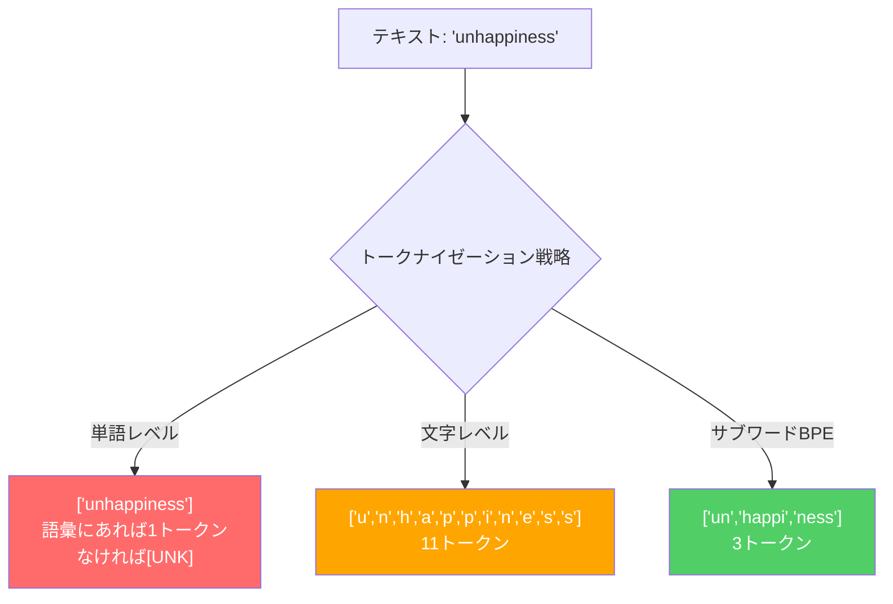
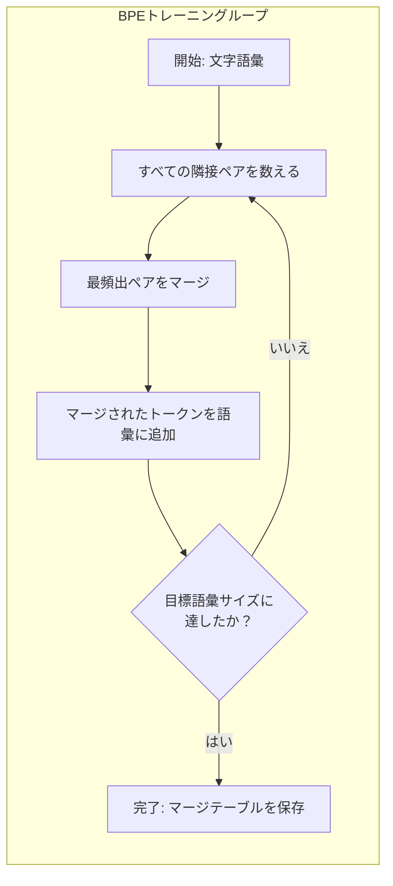
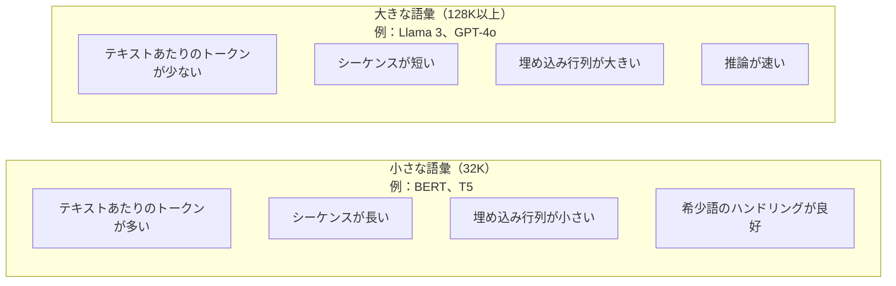

# トークナイザー: BPE、WordPiece、SentencePiece

> LLMは英語を読まない。整数を読む。トークナイザーが、その整数が意味を持つか無駄になるかを決める。


## 学習目標

- BPE、WordPiece、Unigramトークナイゼーションアルゴリズムをゼロから実装し、マージ戦略を比較する
- 語彙サイズがモデルの効率に与える影響を説明する：小さすぎると長いシーケンスが生まれ、大きすぎると埋め込みパラメータを無駄にする
- 言語やコードをまたいだトークナイゼーションの問題点を分析し、特定のトークナイザーがどこで崩れるかを特定する
- tiktokenとsentencepieceライブラリを使ってテキストをトークナイズし、生成されたトークンIDを調べる

## 問題

LLMは英語を読まない。どの言語も読まない。数字を読む。

「Hello, world!」と [15496, 11, 995, 0] の間にある隔たり、それがトークナイザーだ。単語も空白も句読点も、モデルが処理できるようになる前にすべて整数に変換しなければならない。この変換は中立ではない。後から取り消せない前提をモデルに焼き付けてしまう。

これを間違えると、モデルは一般的な単語を複数のトークンにエンコードするという無駄な処理を行う。「unfortunately」は1トークンではなく4トークンになる。128Kのコンテキストウィンドウが、多音節語の多いテキストでは75%も縮んでしまう。正しくやれば、同じコンテキストウィンドウに2倍の意味を詰め込める。「このモデルはコードをうまく扱える」と「このモデルはPythonで詰まる」の違いは、しばしばトークナイザーの訓練方法に帰着する。

GPT-4やClaudeへのすべてのAPIコールはトークン単位で課金される。モデルが生成するトークンはそれぞれ計算コストを消費する。出力を表現するのに必要なトークンが少ないほど、エンドツーエンドの推論は速くなる。トークナイゼーションは前処理ではない。アーキテクチャだ。

## 概念

### 失敗した3つのアプローチ（そして勝者）

テキストを数値に変換する明らかな方法が3つある。そのうち2つはスケールしない。

**単語レベルのトークナイゼーション**はスペースと句読点で分割する。「The cat sat」は ["The", "cat", "sat"] になる。シンプルだ。しかし「tokenization」はどうなる？「GPT-4o」は？ドイツ語の複合語「Geschwindigkeitsbegrenzung」は？単語レベルでは、あらゆる言語のすべての単語をカバーするために膨大な語彙が必要になる。単語が見つからないと、おそれていた `[UNK]` トークンが出てくる――モデルが「これは何かわからない」と言う方法だ。英語だけで100万以上の語形がある。コード、URL、科学的表記、さらに100言語以上を加えると、語彙は無限に膨らむ。

**文字レベルのトークナイゼーション**は逆に行く。「hello」は ["h", "e", "l", "l", "o"] になる。語彙は小さい（数百文字）。未知のトークンは絶対に出ない。しかしシーケンスが非常に長くなる。10の単語レベルトークンになるような文が、文字レベルでは50トークンになる。モデルは「t」「h」「e」が合わさって「the」を意味することを学習しなければならない――人間が3歳で覚えることにアテンション容量を浪費してしまう。

**サブワードのトークナイゼーション**はその中間点を見つける。一般的な単語はそのまま：「the」は1トークン。希少な単語は意味のある部品に分解：「unhappiness」は ["un", "happi", "ness"] になる。語彙は管理可能な範囲に収まる（3万〜12万8千トークン）。シーケンスは短いまま。未知のトークンは実質的になくなる。なぜならどんな単語もサブワード片から組み立てられるからだ。

現代のLLMはすべてサブワードトークナイゼーションを使っている。GPT-2、GPT-4、BERT、Llama 3、Claude――すべてそうだ。問いは、どのアルゴリズムを使うかだ。



### BPE: Byte Pair Encoding

BPEはトークナイゼーション用に転用された貪欲な圧縮アルゴリズムだ。アイデアはインデックスカード1枚に収まるほどシンプルだ。

個々の文字から始める。訓練コーパス内のすべての隣接ペアを数える。最も頻繁なペアを新しいトークンにマージする。目標の語彙サイズに達するまで繰り返す。

```figure
tokenizer-bpe
```

以下は「lower」「lowest」「newest」という単語の小さなコーパスでBPEを動かした例だ：

```
コーパス（単語頻度付き）:
  "lower"  x5
  "lowest" x2
  "newest" x6

ステップ0 -- 文字から開始:
  l o w e r       (x5)
  l o w e s t     (x2)
  n e w e s t     (x6)

ステップ1 -- 隣接ペアを数える:
  (e,s): 8    (s,t): 8    (l,o): 7    (o,w): 7
  (w,e): 13   (e,r): 5    (n,e): 6    ...

ステップ2 -- 最頻出ペア(w,e)をマージ -> "we":
  l o we r        (x5)
  l o we s t      (x2)
  n e we s t      (x6)

ステップ3 -- 再カウントして(e,s)をマージ -> "es":
  l o we r        (x5)
  l o we s t      (x2)    <- 'es'は'e'+'s'からのみ形成、'we'+'s'からではない
  n e we s t      (x6)    <- 'we'の前の'e'と'we'の後の's'に注目

正確に追跡すると:
  "we"マージ後、残りのペア:
  (l,o): 7   (o,we): 7   (we,r): 5   (we,s): 8
  (s,t): 8   (n,e): 6    (e,we): 6

ステップ3 -- (we,s)をマージ -> "wes" または(s,t)をマージ -> "st"（同率8、先を選択）:
  (we,s)をマージ -> "wes":
  l o we r        (x5)
  l o wes t       (x2)
  n e wes t       (x6)

ステップ4 -- (wes,t)をマージ -> "west":
  l o we r        (x5)
  l o west        (x2)
  n e west        (x6)

...目標語彙サイズに達するまで続ける。
```

マージテーブルがトークナイザーだ。新しいテキストをエンコードするには、学習された順序でマージを適用する。訓練コーパスがどのマージを存在させるかを決定し、その選択がモデルが見るものを永続的に形作る。



### バイトレベルBPE（GPT-2、GPT-3、GPT-4）

標準的なBPEはUnicode文字で動作する。バイトレベルBPEは生バイト（0〜255）で動作する。これにより基底語彙はちょうど256になり、どんな言語やエンコーディングも扱え、未知のトークンは絶対に生まれない。

GPT-2がこのアプローチを導入した。基底語彙はすべての可能なバイトをカバーする。BPEのマージがその上に構築される。OpenAIのtiktokenライブラリは以下の語彙サイズでバイトレベルBPEを実装している：

- GPT-2: 50,257トークン
- GPT-3.5/GPT-4: 約100,256トークン（cl100k_baseエンコーディング）
- GPT-4o: 200,019トークン（o200k_baseエンコーディング）

### WordPiece（BERT）

WordPieceはBPEに似ているが、マージの選び方が異なる。生の頻度ではなく、訓練データの尤度を最大化する：

```
BPEのマージ基準:      count(A, B)
WordPieceのマージ基準: count(AB) / (count(A) * count(B))
```

BPEは「どのペアが最も頻繁に現れるか？」と問う。WordPieceは「どのペアが偶然に期待されるよりも頻繁に一緒に現れるか？」と問う。この微妙な違いが異なる語彙を生み出す。WordPieceは単に頻繁なだけでなく、共起が意外なマージを好む。

WordPieceはまた継続サブワードに「##」プレフィックスを使う：

```
"unhappiness" -> ["un", "##happi", "##ness"]
"embedding"   -> ["em", "##bed", "##ding"]
```

「##」プレフィックスは、この部品が前のトークンを継続していることを示す。BERTはWordPieceを30,522トークンの語彙で使用している。すべてのBERTバリアント――DistilBERT、RoBERTaのトークナイザーは実際にはBPEだが、BERT自体はWordPieceだ。

### SentencePiece（Llama、T5）

SentencePieceは入力を空白を含むUnicode文字の生のストリームとして扱う。前処理ステップはない。単語の境界に関する言語固有のルールもない。これによりSentencePieceは真に言語非依存になる――スペースで単語が分かれない中国語、日本語、タイ語などでも機能する。

SentencePieceは2つのアルゴリズムをサポートする：
- **BPEモード**: 生の文字シーケンスに適用される標準的なBPEと同じマージロジック
- **Unigramモード**: 大きな語彙から始め、全体的な尤度に最も影響を与えないトークンを反復的に削除する。BPEの逆――マージではなく刈り込み。

Llama 2は32,000トークンの語彙でSentencePiece BPEを使用している。T5は32,000トークンでSentencePiece Unigramを使用している。注意：Llama 3は128,256トークンを持つtiktokenベースのバイトレベルBPEトークナイザーに切り替えた。

### 語彙サイズのトレードオフ

これは測定可能な結果を伴う本物のエンジニアリング上の決断だ。



具体的な数字で見てみよう。4,096次元の埋め込みを持つ128K語彙の場合、埋め込み行列だけで128,000 × 4,096 = 5億2,400万パラメータになる。32K語彙なら1億3,100万パラメータだ。トークナイザーの選択だけで4億パラメータの差が生まれる。

しかし語彙が大きいほど、テキストをより積極的に圧縮する。32K語彙で100トークンかかる同じ英語の段落が、128K語彙では70トークンになることもある。つまり生成中のフォワードパスが30%少なくなる。数百万のリクエストを処理するモデルにとって、これは計算コストの直接的な削減だ。

傾向は明確だ：語彙サイズは大きくなっている。GPT-2は50,257を使った。GPT-4は約10万を使う。Llama 3は128Kを使う。GPT-4oは200Kを使う。

| モデル | 語彙サイズ | トークナイザーの種類 | 英語1語あたりの平均トークン数 |
|-------|-----------|----------------|---------------------------|
| BERT | 30,522 | WordPiece | 約1.4 |
| GPT-2 | 50,257 | バイトレベルBPE | 約1.3 |
| Llama 2 | 32,000 | SentencePiece BPE | 約1.4 |
| GPT-4 | 約100,256 | バイトレベルBPE | 約1.2 |
| Llama 3 | 128,256 | バイトレベルBPE（tiktoken） | 約1.1 |
| GPT-4o | 200,019 | バイトレベルBPE | 約1.0 |

### 多言語の代償

主に英語で訓練されたトークナイザーは他の言語に対して過酷だ。GPT-2のトークナイザーでは韓国語テキストは1語あたり平均2〜3トークンになる。中国語はさらに悪化することがある。つまり韓国語ユーザーのコンテキストウィンドウは英語ユーザーの半分の大きさになる――同じ価格を払いながら情報密度が半分だ。

これがLlama 3が語彙を32Kから128Kへと4倍に増やした理由だ。非英語スクリプトに割り当てられるトークンが増えることで、言語をまたいだ圧縮がより公平になる。

## 実装する

### ステップ1: 文字レベルトークナイザー

基礎から始めよう。文字レベルトークナイザーは各文字をそのUnicodeコードポイントにマッピングする。訓練不要。未知のトークンなし。ただの直接マッピングだ。

```python
class CharTokenizer:
    def encode(self, text):
        return [ord(c) for c in text]

    def decode(self, tokens):
        return "".join(chr(t) for t in tokens)
```

「hello」は [104, 101, 108, 108, 111] になる。各文字が独自のトークンだ。これが改善のベースラインとなる。

### ステップ2: ゼロからのBPEトークナイザー

本物の実装。生バイトで訓練し（GPT-2のように）、ペアを数え、最も頻繁なものをマージし、すべてのマージを順番に記録する。マージテーブルがトークナイザーだ。

```python
from collections import Counter

class BPETokenizer:
    def __init__(self):
        self.merges = {}
        self.vocab = {}

    def _get_pairs(self, tokens):
        pairs = Counter()
        for i in range(len(tokens) - 1):
            pairs[(tokens[i], tokens[i + 1])] += 1
        return pairs

    def _merge_pair(self, tokens, pair, new_token):
        merged = []
        i = 0
        while i < len(tokens):
            if i < len(tokens) - 1 and tokens[i] == pair[0] and tokens[i + 1] == pair[1]:
                merged.append(new_token)
                i += 2
            else:
                merged.append(tokens[i])
                i += 1
        return merged

    def train(self, text, num_merges):
        tokens = list(text.encode("utf-8"))
        self.vocab = {i: bytes([i]) for i in range(256)}

        for i in range(num_merges):
            pairs = self._get_pairs(tokens)
            if not pairs:
                break
            best_pair = max(pairs, key=pairs.get)
            new_token = 256 + i
            tokens = self._merge_pair(tokens, best_pair, new_token)
            self.merges[best_pair] = new_token
            self.vocab[new_token] = self.vocab[best_pair[0]] + self.vocab[best_pair[1]]

        return self

    def encode(self, text):
        tokens = list(text.encode("utf-8"))
        for pair, new_token in self.merges.items():
            tokens = self._merge_pair(tokens, pair, new_token)
        return tokens

    def decode(self, tokens):
        byte_sequence = b"".join(self.vocab[t] for t in tokens)
        return byte_sequence.decode("utf-8", errors="replace")
```

トレーニングループがBPEの核心だ：ペアを数え、勝者をマージし、繰り返す。各マージがトークンの総数を削減する。`num_merges`ラウンド後、語彙は256（基底バイト）から256 + num_mergesに成長する。

エンコードは学習した順序でマージを適用する。これが重要だ。マージ1が「th」を作り、マージ5が「the」を作ったなら、エンコードはまずマージ1を適用して、マージ5で「th」+「e」から「the」が形成できるようにしなければならない。

デコードは逆だ：各トークンIDを語彙で調べ、バイトを連結し、UTF-8にデコードする。

### ステップ3: エンコードとデコードの往復

```python
corpus = (
    "The cat sat on the mat. The cat ate the rat. "
    "The dog sat on the log. The dog ate the frog. "
    "Natural language processing is the study of how computers "
    "understand and generate human language. "
    "Tokenization is the first step in any NLP pipeline."
)

tokenizer = BPETokenizer()
tokenizer.train(corpus, num_merges=40)

test_sentences = [
    "The cat sat on the mat.",
    "Natural language processing",
    "tokenization pipeline",
    "unhappiness",
]

for sentence in test_sentences:
    encoded = tokenizer.encode(sentence)
    decoded = tokenizer.decode(encoded)
    raw_bytes = len(sentence.encode("utf-8"))
    ratio = len(encoded) / raw_bytes
    print(f"'{sentence}'")
    print(f"  トークン数: {len(encoded)} ({raw_bytes}バイトから) -- 比率: {ratio:.2f}")
    print(f"  往復テスト: {'PASS' if decoded == sentence else 'FAIL'}")
```

圧縮比がトークナイザーの効率を示す。0.50という比率は、トークナイザーがテキストを生バイトの半分のトークンに圧縮したことを意味する。低いほど良い。訓練コーパスでは比率が良くなる。「unhappiness」のようなコーパス外のテキスト（コーパスに登場しない）では比率が悪くなる――トークナイザーは未見のパターンに対して文字レベルのエンコードにフォールバックする。

### ステップ4: tiktokenとの比較

```python
import tiktoken

enc = tiktoken.get_encoding("cl100k_base")

texts = [
    "The cat sat on the mat.",
    "unhappiness",
    "Hello, world!",
    "def fibonacci(n): return n if n < 2 else fibonacci(n-1) + fibonacci(n-2)",
    "Geschwindigkeitsbegrenzung",
]

for text in texts:
    our_tokens = tokenizer.encode(text)
    tiktoken_tokens = enc.encode(text)
    tiktoken_pieces = [enc.decode([t]) for t in tiktoken_tokens]
    print(f"'{text}'")
    print(f"  自作BPE:   {len(our_tokens)}トークン")
    print(f"  tiktoken:  {len(tiktoken_tokens)}トークン -> {tiktoken_pieces}")
```

tiktokenはまったく同じアルゴリズムを使っているが、数百ギガバイトのテキストで10万回のマージを行って訓練されている。アルゴリズムは同一だ。違いは訓練データとマージ回数だ。段落で40回のマージで訓練した自作トークナイザーは、大規模コーパスで10万回マージしたtiktokenには敵わない。しかしメカニズムは同じだ。

### ステップ5: 語彙分析

```python
def analyze_vocabulary(tokenizer, test_texts):
    total_tokens = 0
    total_chars = 0
    token_usage = Counter()

    for text in test_texts:
        encoded = tokenizer.encode(text)
        total_tokens += len(encoded)
        total_chars += len(text)
        for t in encoded:
            token_usage[t] += 1

    print(f"語彙サイズ: {len(tokenizer.vocab)}")
    print(f"全テキストの合計トークン数: {total_tokens}")
    print(f"合計文字数: {total_chars}")
    print(f"文字あたりの平均トークン数: {total_tokens / total_chars:.2f}")

    print(f"\n最も使われるトークン:")
    for token_id, count in token_usage.most_common(10):
        token_bytes = tokenizer.vocab[token_id]
        display = token_bytes.decode("utf-8", errors="replace")
        print(f"  トークン {token_id:4d}: '{display}' ({count}回使用)")

    unused = [t for t in tokenizer.vocab if t not in token_usage]
    print(f"\n未使用トークン: {len(tokenizer.vocab)}中{len(unused)}個")
```

これにより語彙のZipf分布が明らかになる。少数のトークンが支配的だ（スペース、「the」、「e」）。ほとんどのトークンはめったに使われない。本番トークナイザーはこの分布に最適化されている――一般的なパターンは短いトークンIDを得て、希少なパターンはより長い表現を得る。

## 使ってみる

自作のBPEは機能する。今度は本番ツールがどんなものか見てみよう。

### tiktoken（OpenAI）

```python
import tiktoken

enc = tiktoken.get_encoding("cl100k_base")

text = "Tokenizers convert text to integers"
tokens = enc.encode(text)
print(f"トークン: {tokens}")
print(f"ピース: {[enc.decode([t]) for t in tokens]}")
print(f"往復テスト: {enc.decode(tokens)}")
```

tiktokenはRustで書かれPythonバインディングを持つ。毎秒数百万トークンをエンコードする。同じBPEアルゴリズム、産業レベルの実装だ。

### Hugging Faceトークナイザー

```python
from tokenizers import Tokenizer
from tokenizers.models import BPE
from tokenizers.trainers import BpeTrainer
from tokenizers.pre_tokenizers import ByteLevel

tokenizer = Tokenizer(BPE())
tokenizer.pre_tokenizer = ByteLevel()

trainer = BpeTrainer(vocab_size=1000, special_tokens=["<pad>", "<eos>", "<unk>"])
tokenizer.train(["corpus.txt"], trainer)

output = tokenizer.encode("The cat sat on the mat.")
print(f"トークン: {output.tokens}")
print(f"ID: {output.ids}")
```

Hugging Faceのtokenizersライブラリも内部はRustだ。ギガバイト規模のコーパスでのBPE訓練を数秒で行う。独自モデルを訓練する際にはこれを使う。

### LlamaのTokenizerを読み込む

```python
from transformers import AutoTokenizer

tokenizer = AutoTokenizer.from_pretrained("meta-llama/Llama-3.1-8B")

text = "Tokenizers are the unsung heroes of LLMs"
tokens = tokenizer.encode(text)
print(f"トークンID: {tokens}")
print(f"トークン: {tokenizer.convert_ids_to_tokens(tokens)}")
print(f"語彙サイズ: {tokenizer.vocab_size}")

multilingual = ["Hello world", "Hola mundo", "Bonjour le monde"]
for text in multilingual:
    ids = tokenizer.encode(text)
    print(f"'{text}' -> {len(ids)}トークン")
```

Llama 3の128K語彙は、GPT-2の50K語彙よりも非英語テキストをはるかに効率よく圧縮する。同じ文を複数言語でエンコードしてトークン数を数えることで、これを自分で確認できる。

## 成果物を出す

このレッスンでは `outputs/prompt-tokenizer-analyzer.md` を作成する――あらゆるテキストとモデルの組み合わせに対してトークナイゼーション効率を分析する再利用可能なプロンプトだ。テキストサンプルを入力すると、どのモデルのトークナイザーが最もうまく処理するかを教えてくれる。

## 演習

1. BPEトークナイザーを修正して、各マージステップで語彙を表示するようにする。「t」+「h」が「th」に、「th」+「e」が「the」になる様子を観察しよう。一般的な英単語が部品ごとに組み上げられていく過程を追跡する。

2. BPEトークナイザーに特殊トークン（`<pad>`、`<eos>`、`<unk>`）を追加する。それらにID 0、1、2を割り当て、他のすべてのトークンをずらす。BPEを実行する前にスペースで分割する前処理ステップを実装する。

3. WordPieceのマージ基準（頻度ではなく尤度比）を実装する。同じコーパスで同じマージ回数でBPEとWordPieceの両方を訓練する。結果の語彙を比較する――どちらがより言語学的に意味のあるサブワードを生み出すか？

4. 多言語トークナイザー効率ベンチマークを構築する。英語、スペイン語、中国語、韓国語、アラビア語で各10文を用意する。tiktoken（cl100k_base）でそれぞれをトークナイズし、1文字あたりの平均トークン数を測定する。各言語の「多言語の代償」を定量化する。

5. 大きなコーパス（Wikipediaの記事をダウンロードする）でBPEトークナイザーを訓練する。マージ回数を調整して、同じテキストでtiktokenの10%以内の圧縮比を達成する。これにより、コーパスサイズ、マージ回数、圧縮品質の関係を深く理解できる。

## キーワード

| 用語 | 一般的な説明 | 実際の意味 |
|------|-------------|-----------| 
| Token | 「単語」 | モデルの語彙における単位――文字、サブワード、単語、複数単語のチャンクのいずれかになりうる |
| BPE | 「何らかの圧縮技術」 | Byte Pair Encoding――最も頻繁な隣接トークンペアを目標語彙サイズに達するまで繰り返しマージする |
| WordPiece | 「BERTのトークナイザー」 | BPEに似ているが、生の頻度ではなくcount(AB)/(count(A)*count(B))という尤度比でマージを選ぶ |
| SentencePiece | 「トークナイザーライブラリ」 | 前処理なしで生のUnicodeを直接操作する言語非依存のトークナイザー。BPEとUnigramアルゴリズムをサポート |
| 語彙サイズ | 「知っている単語の数」 | ユニークなトークンの総数：GPT-2は50,257、BERTは30,522、Llama 3は128,256 |
| Fertility | 「トークナイザー用語ではない」 | 単語あたりの平均トークン数――言語をまたいだトークナイザー効率を測る（1.0が完璧、3.0はモデルが3倍の作業をする） |
| バイトレベルBPE | 「GPTのトークナイザー」 | Unicode文字ではなく生バイト（0〜255）で動作するBPE。あらゆる入力に対して未知のトークンが絶対に生まれない |
| マージテーブル | 「トークナイザーファイル」 | 訓練中に学習されたペアマージの順序付きリスト――これがトークナイザーそのものであり、順序が重要 |
| 前処理 | 「スペースで分割すること」 | サブワードトークナイゼーションの前に適用されるルール：空白分割、数字分離、句読点処理 |
| 圧縮比 | 「トークナイザーの効率」 | 生成されたトークン数を入力バイト数で割ったもの――低いほど圧縮が良く推論が速い |

## 参考資料

- [Sennrich et al., 2016 -- "Neural Machine Translation of Rare Words with Subword Units"](https://arxiv.org/abs/1508.07909) -- BPEをNLPに導入した論文。1994年の圧縮アルゴリズムを現代トークナイゼーションの基盤に転換した
- [Kudo & Richardson, 2018 -- "SentencePiece: A simple and language independent subword tokenizer"](https://arxiv.org/abs/1808.06226) -- 多言語モデルを実用的にした言語非依存のトークナイゼーション
- [OpenAI tiktokenリポジトリ](https://github.com/openai/tiktoken) -- RustとPythonバインディングによる本番BPE実装。GPT-3.5/4/4oで使用
- [Hugging Face Tokenizersドキュメント](https://huggingface.co/docs/tokenizers) -- Rustパフォーマンスによる本番グレードのトークナイザー訓練
