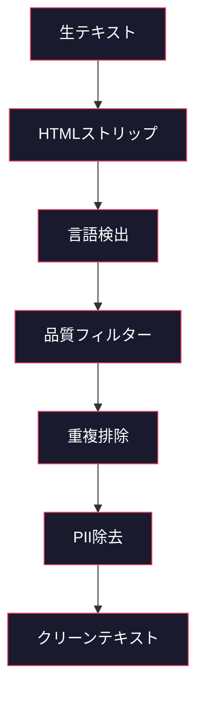
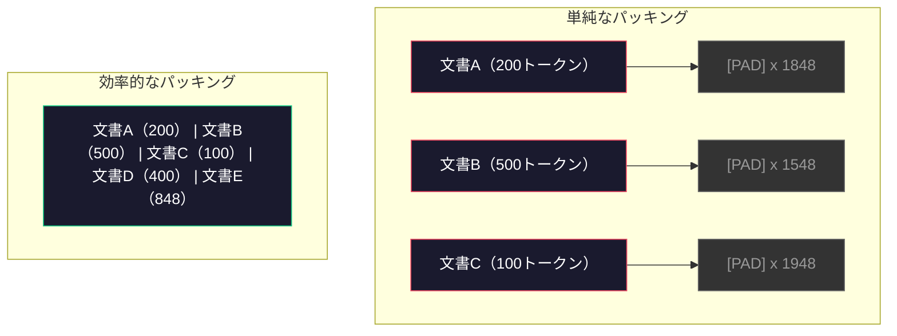

# 事前学習のためのデータパイプライン

> モデルは鏡だ。与えたデータを反映する。ゴミを与えれば、完璧な流暢さでゴミを反映する。


## 学習目標

- テラバイトのテキストをすべてメモリに読み込まずに、トークナイズ、チャンク化、シャッフル、バッチ処理するストリーミングデータパイプラインを構築する
- 実際の事前学習パイプラインで使われるデータ品質フィルター（重複排除、言語検出、コンテンツフィルタリング）を実装する
- 適切なアテンションマスクと文書境界処理を備えた固定長の訓練シーケンスを作成する
- データローダーがGPU訓練速度に追いつけるようにパイプラインのスループットをプロファイルする

## 問題

トークナイザーが手元にある。今度はデータが必要だ。

データセットではない。CSVファイルでもない。テラバイトのテキスト――クリーニングされ、重複排除され、品質でフィルタリングされ、固定長のシーケンスにトークナイズされ、8GPUクラスターが次のバッチを待つことのないよう、ランダム化されたバッチで提供される。

LLMの訓練はモデルアーキテクチャの問題だと思っている人が多い。違う。Llama 3は15.6兆トークンを使った。GPT-3は3000億を使った。DeepSeek-V2は8.1兆を使った。3つすべてのアーキテクチャはほぼ同じだ：アテンションとフィードフォワード層を持つトランスフォーマーブロックのスタック。出力品質の差は圧倒的にデータから来る。

DeepMindのChinchillaペーパーがこれを明確にした。固定された計算予算に対して、モデルのパラメータ数と訓練トークン数には最適な比率がある。Chinchillaは、2022年のほとんどのモデルが著しく訓練不足だったことを示した――データ量に対してパラメータが多すぎた。1.4兆トークンで訓練された700億パラメータのモデル（Chinchilla最適）は、3000億トークンで訓練された2800億パラメータのモデル（Gopher）を上回った。

データパイプラインが、モデルが言語を学ぶかノイズを学ぶかを決定する。

## 概念

### データの出どころ

すべての大規模言語モデルは複数のソースの混合で訓練される。正確な構成はほとんどのラボで厳重に守られた秘密だが、カテゴリを理解するには十分な情報がある。

| ソース | サイズ | 品質 | 使用先 |
|--------|------|------|-------|
| Common Crawl | 生データ約250TB | 低（大量のフィルタリングが必要） | GPT-3、Llama、ほとんどのオープンモデル |
| Wikipedia | 約20GB | 高 | すべての主要LLM |
| GitHubコード | 1TB以上 | 中（重複や死んだコードが多い） | StarCoder、CodeLlama、DeepSeek-Coder |
| 書籍（BookCorpus、Pile） | 約100GB | 高 | GPT-2、GPT-3、初期モデル |
| 学術論文（arXiv、S2ORC） | 約100GB | STEMでは高 | Llama、Galactica |
| StackOverflow、Reddit | 約100GB | 中 | Llama、Falcon |
| キュレーションされたウェブ（C4、RefinedWeb） | 約5TB | 中〜高（事前フィルタリング済み） | T5、Falcon |

Llama 3はデータの混合比率を開示した：約50%がウェブデータ、25%がコード、13%が書籍と学術論文、8%が数学データ、4%が多言語ウェブデータ。合計は生テキスト5TB超のソースから15.6兆トークンだった。

比率は総サイズと同じくらい重要だ。ウェブデータが多すぎるとモデルはRedditのオウムになる。コードが少なすぎるとプログラムができない。数学が少なすぎると推論で失敗する。この混合比率を正しく決めることはLLM訓練で最も難しい部分の1つで、公式はない――実験と評価が必要だ。

### データクリーニング

生のウェブデータは汚い。典型的なCommon Crawlのダンプには以下が含まれる：

- HTMLタグとJavaScript
- ボイラープレートのヘッダー、フッター、ナビゲーションメニュー
- 重複ページ（完全一致と近似重複）
- 機械生成スパム
- 個人を特定できる情報（PII）
- 低品質テキスト（キーワードの羅列、SEOスパム）
- テキストとしてエンコードされた非テキストコンテンツ

このクリーニングは省略できない。一貫した段落を生成するモデルと、製品リストが混じったHTMLタグを出力するモデルの違いはここにある。



各ステップがノイズの一カテゴリを排除する：

**HTMLストリップ：** すべてのマークアップを除去する。可視テキストコンテンツのみを保持する。`trafilatura`や`readability`のようなライブラリは、ナビゲーション、広告、ボイラープレートを捨てながら記事コンテンツを抽出する。

**言語検出：** fastTextの言語識別モデル（lid.176.bin）を使って各ドキュメントを分類する。対象言語にフィルタリングする。信頼度0.8未満で英語に分類されたドキュメントはおそらくクリーンな英語ではない。

**品質フィルタリング：** ここが興味深いところだ。RefinedWeb（Falconの背後にあるデータセット）はパープレキシティベースのフィルターを使う：Wikipediaで小さな言語モデルを訓練し、各ドキュメントをスコアリングする。パープレキシティが高いということは、そのドキュメントがWikipediaとは異なる――おそらくスパム、キーワードの羅列、または機械生成コンテンツだ。閾値を超えたパープレキシティのドキュメントは除去される。

**重複排除：** 単独で最も効果的なクリーニングステップだ。Common Crawlには膨大な数の重複ページが含まれる――法的免責事項、クッキー通知、利用規約。重複での訓練は計算を無駄にし、モデルが特定の文章をそのまま暗記して吐き出す原因になりうる。

**PII除去：** 氏名、メールアドレス、電話番号、社会保障番号。構造化PIIには正規表現ベースの検出、文脈中の名前にはNERモデルを使う。

### MinHashによる重複排除

完全一致の重複排除は簡単だ：各ドキュメントをハッシュして重複を削除する。しかし近似重複が本当の問題だ。周囲の広告が少し違う同じニュース記事の2部は近似重複だ。コンテンツは95%同一だが、バイト単位では異なる。

MinHash + Locality-Sensitive Hashing（LSH）がこれを効率的に解決する。


アイデア：

1. **シングリング：** 各ドキュメントをn-gramのセットに変換する（例：単語か文字の5-gram）。「the quick brown fox」の3単語シングルは {"the quick brown", "quick brown fox"} になる。

2. **MinHash：** 各ドキュメントのシングルセットについて、k個のハッシュ値を計算する。各ハッシュ値は、異なるハッシュ関数の下ですべてのシングルの中の最小ハッシュだ。これにより2つのドキュメント間のJaccard類似度を近似する固定サイズの「シグネチャ」が作られる。

3. **LSH：** MinHashシグネチャのバンドに基づいてドキュメントをバケットにグループ化する。同じバケットのドキュメントが近似重複の候補だ。すべてのペアを比較するのを避け、候補のみを比較する。

4. **検証：** 各候補ペアについて、正確なJaccard類似度を計算する。類似度が閾値（通常0.8）を超えたら片方を削除する。

Llamaチームは重複排除によってウェブデータの約38%を削除したと報告した。小さな数字ではない。Common Crawlの3分の1以上が重複または近似重複コンテンツだ。

### シーケンスパッキング

モデルは固定長の入力シーケンスを期待する。しかしドキュメントは可変長だ。50トークンのものもあれば5万トークンのものもある。

単純なアプローチ：すべてのドキュメントを最大シーケンス長にパディングする。これは学習に何も貢献しないパディングトークンに膨大な計算を無駄にする。

より良いアプローチ：複数のドキュメントを1つのシーケンスにパック（連結）し、文末トークンで区切る。2048トークンのシーケンスに、[EOS]トークンで区切られた3つの短いドキュメントが含まれることがある。



アテンションマスクを正しく設定しなければならない。同じパック済みシーケンス内で、文書Aのトークンは文書Bのトークンにアテンションを向けてはならない。これにはブロック対角アテンションマスクが必要だ。

長いドキュメントはシーケンス境界で切り捨てられるかチャンクに分割される。分割ポイントは重要だ：文の途中で分割するとモデルが不完全な思考を見ることになる。可能な限り段落や文の境界に合わせて分割するパイプラインもある。

### Chinchillaスケーリング則

固定された計算予算C（FLOPsで測定）に対して、最適なモデルサイズNとデータセットサイズDは以下に従う：

```
N_opt ~ C^0.5
D_opt ~ C^0.5
```

実践的には、モデルサイズとデータセットサイズをほぼ等しくスケールすべきことを意味する。10倍多くのパラメータを持つモデルは、同じ損失に達するために約10倍多くの訓練トークンを必要とする。

| モデル | パラメータ数 | 訓練トークン数 | Chinchilla最適か？ |
|-------|-----------|----------------|-------------------|
| GPT-3 | 1750億 | 3000億 | いいえ（3〜4倍の訓練不足） |
| Chinchilla | 700億 | 1.4兆 | はい（設計通り） |
| Llama 2 | 700億 | 2兆 | 過訓練（意図的） |
| Llama 3 | 700億 | 15兆 | 大幅な過訓練 |

Llama 3は意図的にChinchilla則を違反している。Metaは、計算最適比率をはるかに超えてより多くのデータで過訓練することが、推論に向けたより良いモデルを生み出すことを発見した。追加の訓練コストは一度支払われるが、より小さなモデルは永遠により安く提供できる。これは「推論最適」スケーリングアプローチと呼ばれることもあり、2024年以降の業界標準となっている。

## 実装する

### ステップ1: テキストクリーニング

HTMLをストリップし、空白を正規化し、非テキストコンテンツを除去する。小さなコーパスとしてパブリックドメインのテキスト（プロジェクト・グーテンベルク）を使う。

```python
import re

def clean_text(text):
    text = re.sub(r"<[^>]+>", "", text)
    text = re.sub(r"http\S+", "", text)
    text = re.sub(r"[^\x20-\x7E\n]", "", text)
    text = re.sub(r"\n{3,}", "\n\n", text)
    text = re.sub(r" {2,}", " ", text)
    return text.strip()

def quality_filter(text, min_words=50, max_ratio_caps=0.3, max_ratio_special=0.1):
    words = text.split()
    if len(words) < min_words:
        return False
    caps_ratio = sum(1 for w in words if w.isupper()) / len(words)
    if caps_ratio > max_ratio_caps:
        return False
    special_chars = sum(1 for c in text if not c.isalnum() and not c.isspace())
    if special_chars / max(len(text), 1) > max_ratio_special:
        return False
    return True
```

品質フィルターはSEOスパム（ALL CAPS）、機械生成ノイズ（高い特殊文字比率）、スタブページ（短すぎる）を捕捉する。この3つのチェックだけでウェブクロールから驚くほどのゴミを除去できる。

### ステップ2: MinHashによる重複排除

ゼロからMinHashを実装する。外部ライブラリ不要――`hashlib`だけだ。

```python
import hashlib
from collections import defaultdict

def get_shingles(text, k=5):
    words = text.lower().split()
    if len(words) < k:
        return set()
    return {" ".join(words[i:i+k]) for i in range(len(words) - k + 1)}

def minhash_signature(shingles, num_hashes=128):
    signature = []
    for i in range(num_hashes):
        min_hash = float("inf")
        for shingle in shingles:
            h = int(hashlib.sha256(f"{i}:{shingle}".encode()).hexdigest(), 16)
            min_hash = min(min_hash, h)
        signature.append(min_hash)
    return signature

def lsh_buckets(signature, bands=16):
    rows_per_band = len(signature) // bands
    buckets = []
    for b in range(bands):
        start = b * rows_per_band
        band_data = tuple(signature[start:start + rows_per_band])
        bucket_hash = hashlib.md5(str(band_data).encode()).hexdigest()
        buckets.append((b, bucket_hash))
    return buckets

def deduplicate(documents, threshold=0.8, num_hashes=128, bands=16):
    signatures = []
    shingle_sets = []
    for doc in documents:
        shingles = get_shingles(doc)
        shingle_sets.append(shingles)
        signatures.append(minhash_signature(shingles, num_hashes))

    bucket_map = defaultdict(list)
    for doc_idx, sig in enumerate(signatures):
        for band_id, bucket_hash in lsh_buckets(sig, bands):
            bucket_map[(band_id, bucket_hash)].append(doc_idx)

    duplicate_pairs = set()
    for bucket_docs in bucket_map.values():
        if len(bucket_docs) < 2:
            continue
        for i in range(len(bucket_docs)):
            for j in range(i + 1, len(bucket_docs)):
                duplicate_pairs.add((bucket_docs[i], bucket_docs[j]))

    removed = set()
    for i, j in duplicate_pairs:
        if i in removed or j in removed:
            continue
        s1, s2 = shingle_sets[i], shingle_sets[j]
        if not s1 or not s2:
            continue
        jaccard = len(s1 & s2) / len(s1 | s2)
        if jaccard >= threshold:
            removed.add(j)

    return [doc for idx, doc in enumerate(documents) if idx not in removed], len(removed)
```

`num_hashes=128`と`bands=16`というパラメータは精度とリコールのトレードオフを制御する。ハッシュが多いほど類似度の推定がより正確になる。バンドが多いほどリコールが上がり（より多くの重複を捕捉）、偽陽性も増える。これらの値は典型的なウェブテキストでうまく機能する。

### ステップ3: シーケンスのトークナイズとパッキング

クリーニング済みで重複排除されたテキストをトークナイズし、訓練用の固定長シーケンスにパックする。

```python
def tokenize_corpus(documents, tokenizer):
    all_tokens = []
    for doc in documents:
        tokens = tokenizer.encode(doc)
        all_tokens.extend(tokens)
        all_tokens.append(tokenizer.eos_id)
    return all_tokens

def pack_sequences(token_ids, seq_length, pad_id=0):
    sequences = []
    attention_masks = []
    for i in range(0, len(token_ids), seq_length):
        seq = token_ids[i:i + seq_length]
        mask = [1] * len(seq)
        if len(seq) < seq_length:
            pad_count = seq_length - len(seq)
            seq = seq + [pad_id] * pad_count
            mask = mask + [0] * pad_count
        sequences.append(seq)
        attention_masks.append(mask)
    return sequences, attention_masks
```

### ステップ4: 訓練用データローダー

パック済みシーケンスのランダム化されたバッチを生成する。これが訓練ループが消費するものだ。

```python
import random

class PreTrainingDataLoader:
    def __init__(self, sequences, attention_masks, batch_size, shuffle=True):
        self.sequences = sequences
        self.attention_masks = attention_masks
        self.batch_size = batch_size
        self.shuffle = shuffle

    def __len__(self):
        return (len(self.sequences) + self.batch_size - 1) // self.batch_size

    def __iter__(self):
        indices = list(range(len(self.sequences)))
        if self.shuffle:
            random.shuffle(indices)
        for start in range(0, len(indices), self.batch_size):
            batch_idx = indices[start:start + self.batch_size]
            batch_seqs = [self.sequences[i] for i in batch_idx]
            batch_masks = [self.attention_masks[i] for i in batch_idx]
            yield batch_seqs, batch_masks
```

### ステップ5: データセット統計

重要な数値を計算する：総トークン数、ユニークトークン数、圧縮比、ドキュメント長分布。

```python
from collections import Counter

def compute_statistics(documents, token_ids, sequences, tokenizer_vocab_size):
    total_chars = sum(len(d) for d in documents)
    total_tokens = len(token_ids)
    unique_tokens = len(set(token_ids))
    compression_ratio = total_chars / total_tokens

    doc_lengths = [len(d.split()) for d in documents]
    avg_doc_length = sum(doc_lengths) / max(len(doc_lengths), 1)
    max_doc_length = max(doc_lengths) if doc_lengths else 0
    min_doc_length = min(doc_lengths) if doc_lengths else 0

    token_counts = Counter(token_ids)
    top_tokens = token_counts.most_common(10)

    non_pad_tokens = sum(sum(1 for t in seq if t != 0) for seq in sequences)
    total_positions = sum(len(seq) for seq in sequences)
    utilization = non_pad_tokens / max(total_positions, 1)

    stats = {
        "total_documents": len(documents),
        "total_characters": total_chars,
        "total_tokens": total_tokens,
        "unique_tokens": unique_tokens,
        "vocab_utilization": unique_tokens / tokenizer_vocab_size,
        "compression_ratio": compression_ratio,
        "avg_doc_length_words": avg_doc_length,
        "max_doc_length_words": max_doc_length,
        "min_doc_length_words": min_doc_length,
        "num_sequences": len(sequences),
        "sequence_utilization": utilization,
        "top_10_tokens": top_tokens,
    }
    return stats
```

圧縮比はトークナイザーがこのコーパスでどれだけ効率的かを示す。英語テキストは通常、1トークンあたり約3〜4文字に圧縮される。1トークンあたり1.5文字なら、トークナイザーが過度に分割している。8文字以上なら、非常にドメイン固有のマージを学習している。

シーケンス利用率は、パック済みシーケンスのどれだけが本物のデータかパディングかを示す。90%未満はパッキングが非効率だということ――パディングトークンに計算を無駄にしている。

## 使ってみる

### HuggingFace Datasetsとの比較

HuggingFaceのdatasetsライブラリで同じコーパスを読み込み、パイプライン速度を比較する。

```python
from datasets import load_dataset
from transformers import AutoTokenizer

ds = load_dataset("wikitext", "wikitext-2-raw-v1", split="train")
tokenizer = AutoTokenizer.from_pretrained("meta-llama/Meta-Llama-3-8B")

import time

start = time.time()
tokenized = ds.map(
    lambda x: tokenizer(x["text"], truncation=True, max_length=2048),
    batched=True,
    num_proc=4,
)
hf_time = time.time() - start
total_tokens = sum(len(t) for t in tokenized["input_ids"])
print(f"HuggingFace: {total_tokens:,}トークン {hf_time:.2f}秒で ({total_tokens/hf_time:,.0f}トークン/秒)")
```

HuggingFaceパイプラインは内部でRustトークナイザーを使い、4コアで並列処理する。純粋なPythonパイプラインは10〜50倍遅い。その差が本番チームがコンパイル済みトークナイザーを使う理由だ。アルゴリズムは同じ。実装言語が違う。

## 成果物を出す

このレッスンではLLM訓練パイプラインのデータ品質を検証・デバッグするためのプロンプトを作成する。`outputs/prompt-data-quality-checker.md`を参照。

## 演習

1. **易：** 単純なヒューリスティック（文字セット分析）を使って言語検出をクリーニングパイプラインに追加する。英語ドキュメントのみにフィルタリングし、どれだけのドキュメントが除去されるかを測定する。
2. **中：** MinHashの近似重複排除と並べて、SHA-256ハッシュを使った完全一致の重複排除を実装する。ウェブスクレイピングされたコーパスで各方法が捕捉する重複の数を比較する。
3. **難：** パープレキシティベースの品質フィルターを構築する。Wikipediaのテキストで小さなバイグラム言語モデルを訓練し、パープレキシティで各ドキュメントをスコアリングし、下位20%を除去する。フィルタリングされたデータとフィルタリングされていないデータで訓練したときのモデル出力品質を比較する。

## キーワード

| 用語 | 一般的な説明 | 実際の意味 |
|------|-------------|-----------|
| Common Crawl | 「インターネット」 | 毎月ウェブをクロールする非営利団体――生データ約250TB、ほとんどのLLM訓練データの出発点 |
| MinHash | 「何らかのハッシュトリック」 | 固定サイズのシグネチャを使ってセット間のJaccard類似度を推定する技術――大規模な近似重複検出を可能にする |
| LSH | 「Locality-Sensitive Hashing」 | 類似アイテムを同じバケットにグループ化する方法――ペアワイズ比較をO(n^2)から線形近くに削減する |
| シーケンスパッキング | 「ドキュメントの連結」 | 適切なアテンションマスクを使って複数のドキュメントを固定長シーケンスに詰め込む――パディングの無駄をなくす |
| Chinchillaスケーリング | 「より多くのデータで訓練する」 | 固定された計算予算に対して、最適性能にはモデルサイズと訓練トークン数をほぼ等しくスケールする必要がある |
| Fertility | 「単語あたりのトークン数」 | 単語あたりの平均トークン数――GPT-4の英語では1.3、非ラテン文字スクリプトでは高い |
| データ混合 | 「訓練データの選択」 | コード対テキスト対数学対多言語データの比率――公式はなく、実験が必要 |
| パープレキシティフィルター | 「品質スコアリング」 | 小さな言語モデルを使ってドキュメントをスコアリングする――パープレキシティが高いということは、そのテキストがクリーンな参照データと異なることを意味する |
| 重複排除 | 「コピーの除去」 | 完全一致と近似重複ドキュメントを排除する――通常、生ウェブデータの30〜40%を除去する |
| アテンションマスク | 「どのトークンを見るか」 | パック済みシーケンス内の文書境界をまたいだアテンションを防ぐバイナリマスク |

## 参考資料

- [Hoffmann et al., 2022 -- Training Compute-Optimal Large Language Models（Chinchilla）](https://arxiv.org/abs/2203.15556) -- データスケールについての考え方を変えた論文
- [Penedo et al., 2023 -- The RefinedWeb Dataset for Falcon LLM](https://arxiv.org/abs/2306.01116) -- Common Crawlを高品質にフィルタリングする方法
- [Touvron et al., 2023 -- Llama 2: Open Foundation and Fine-Tuned Chat Models](https://arxiv.org/abs/2307.09288) -- Llama 2のデータパイプラインの詳細
- [Lee et al., 2022 -- Deduplicating Training Data Makes Language Models Better](https://arxiv.org/abs/2107.06499) -- 重複排除が思った以上に重要な理由
- [Broder, 1997 -- On the Resemblance and Containment of Documents](https://ieeexplore.ieee.org/document/666900) -- MinHashの元論文
- [Meta, 2024 -- Llama 3 Technical Report](https://arxiv.org/abs/2407.21783) -- 15.6兆トークン、データ混合比率、フィルタリングパイプライン
