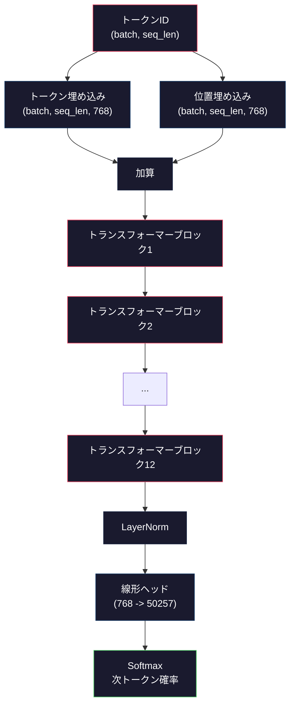
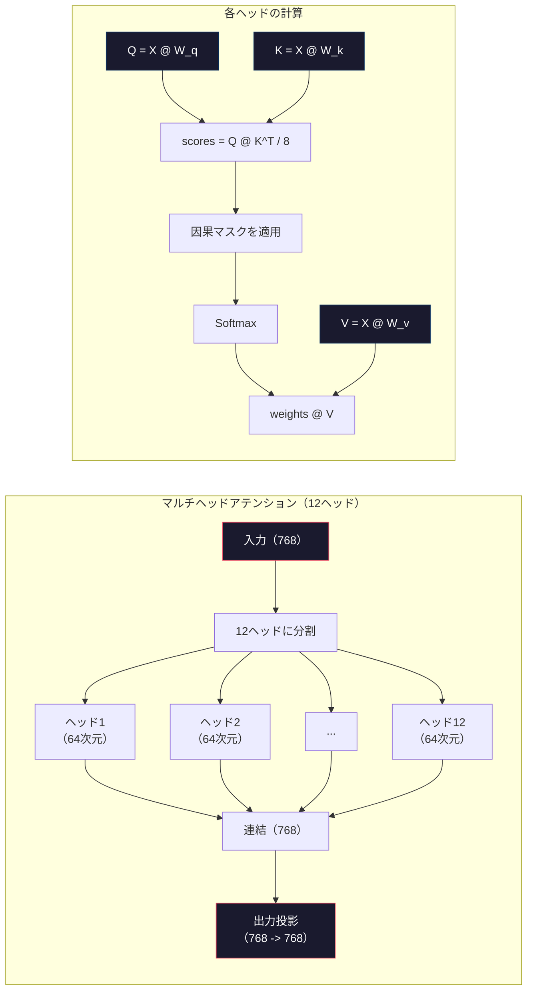
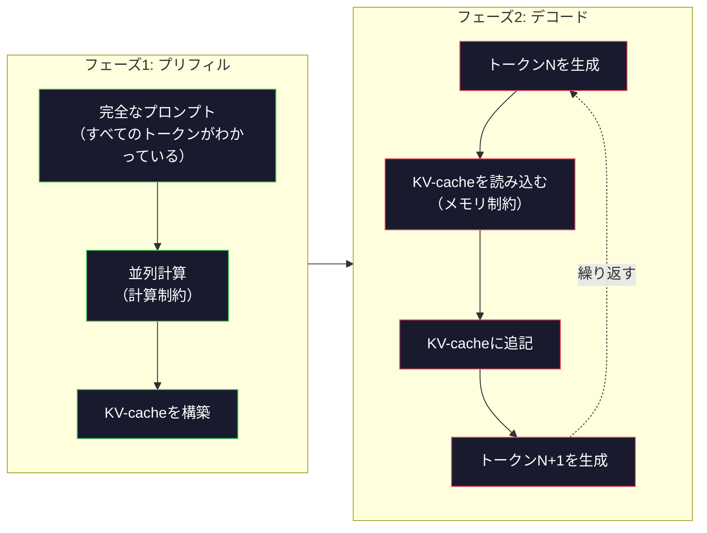

# ミニGPTの事前学習（1億2400万パラメータ）

> GPT-2 Smallは1億2400万パラメータを持つ。12のトランスフォーマー層、12のアテンションヘッド、768次元の埋め込みだ。シングルGPUで数時間で一からトレーニングできる。ほとんどの人はこれをやらない。事前学習済みチェックポイントを使う。しかし自分でトレーニングしなければ、製品を作っているモデルの内部で何が起きているかを本当に理解したとは言えない。


## 学習目標

- GPT-2アーキテクチャ（1億2400万パラメータ）をゼロから実装する：トークン埋め込み、位置埋め込み、トランスフォーマーブロック、言語モデルヘッド
- 次トークン予測とクロスエントロピー損失を使ってテキストコーパスでGPTモデルを訓練する
- 温度サンプリングとtop-k/top-pフィルタリングを使った自己回帰テキスト生成を実装する
- 訓練損失カーブを監視し、モデルが一貫した言語パターンを学習していることを確認する

## 問題

トランスフォーマーとは何かを知っている。図を見たことがある。「Attention Is All You Need」を暗唱でき、ホワイトボードに「マルチヘッドアテンション」とラベルされた箱を描ける。

それでも、モデルがテキストを生成するときに何が起きているかを理解したとは言えない。

GPT-2 Smallには124,438,272個のパラメータがある（重み共有を使用）。それらすべては訓練ループを実行することで設定された：フォワードパス、損失の計算、バックワードパス、重みの更新。12のトランスフォーマーブロック。ブロックごとに12のアテンションヘッド。768次元の埋め込み空間。50,257トークンの語彙。モデルがトークンを生成するたびに、1億2400万のパラメータすべてが、トークンIDのシーケンスを受け取って次のトークンの確率分布を生成する単一の行列乗算の連鎖に参加する。

これを自分で構築したことがなければ、ブラックボックスを扱っていることになる。APIを使える。ファインチューニングできる。しかし何かがうまくいかないとき――モデルが幻覚を起こすとき、繰り返しが起きるとき、指示に従わないとき――*なぜ*かについての心的モデルがない。

このレッスンではGPT-2 Smallをゼロから構築する。PyTorchではない。numpyで。すべての行列乗算が見える。すべての勾配がコードで計算される。1億2400万の数字がどのように次の単語を予測するために連携するかを正確に見ることになる。

## 概念

### GPTアーキテクチャ

GPTは自己回帰言語モデルだ。「自己回帰」とは、1度に1つのトークンを生成し、それぞれが前のすべてのトークンに条件付けられていることを意味する。アーキテクチャはトランスフォーマーデコーダーブロックのスタックだ。

トークンIDから次トークン確率までの完全な計算グラフはこうなる：

1. トークンIDが入力される。形状：(batch_size, seq_len)。
2. トークン埋め込みの参照。各IDが768次元のベクトルにマッピングされる。形状：(batch_size, seq_len, 768)。
3. 位置埋め込みの参照。各位置（0、1、2、...）が768次元のベクトルにマッピングされる。同じ形状。
4. トークン埋め込みと位置埋め込みを加算する。
5. 12のトランスフォーマーブロックを通過する。
6. 最終のLayerNorm。
7. 語彙サイズへの線形投影。形状：(batch_size, seq_len, vocab_size)。
8. Softmaxで確率を取得する。

これがモデル全体だ。畳み込みなし。再帰なし。埋め込み、アテンション、フィードフォワードネットワーク、LayerNormを12回積み重ねただけ。



### トランスフォーマーブロック

12のブロックそれぞれが同じパターンに従う。Pre-normアーキテクチャ（GPT-2は元のトランスフォーマーのpost-normではなくpre-normを使用）：

1. LayerNorm
2. マルチヘッド自己アテンション
3. 残差接続（入力を加え戻す）
4. LayerNorm
5. フィードフォワードネットワーク（MLP）
6. 残差接続（入力を加え戻す）

残差接続は重要だ。これなしでは、バックプロパゲーション中にブロック1に到達するまでに勾配が消えてしまう。あれば、「スキップ」パスを通じて損失から任意の層に直接勾配が流れる。これが12、32、さらには96のブロックを積み重ねられる理由だ（GPT-4は120を使用していると噂される）。

### アテンション：核心メカニズム

自己アテンションはすべてのトークンが前のすべてのトークンを参照し、各トークンにどれだけ注目するかを決定できるようにする。数学はこうなる。

各トークン位置について、入力から3つのベクトルを計算する：
- **Query（Q）**：「私は何を探しているか？」
- **Key（K）**：「私は何を含んでいるか？」
- **Value（V）**：「私はどんな情報を持っているか？」

```
Q = input @ W_q    (768 -> 768)
K = input @ W_k    (768 -> 768)
V = input @ W_v    (768 -> 768)

attention_scores = Q @ K^T / sqrt(d_k)
attention_scores = mask(attention_scores)   # 因果マスク: 未来の位置には-inf
attention_weights = softmax(attention_scores)
output = attention_weights @ V
```

因果マスクがGPTを自己回帰にする。位置5は位置0〜5にアテンションできるが6、7、8以降はできない。これにより、訓練中に未来のトークンを「カンニング」するのを防ぐ。

**マルチヘッドアテンション**は768次元空間を各64次元の12ヘッドに分割する。各ヘッドは異なるアテンションパターンを学習する。1つのヘッドは統語的関係（主語-動詞一致）を追跡するかもしれない。別のヘッドは意味的類似性（同義語）を追跡するかもしれない。さらに別のヘッドは位置的近接性（近くの単語）を追跡するかもしれない。12ヘッドすべての出力が連結されて768次元に投影し直される。



sqrt(d_k)による除算――sqrt(64) = 8――はスケーリングだ。これなしでは、高次元ベクトルに対して内積が大きくなり、softmaxが勾配がほぼゼロになる領域に押しやられる。これが元の「Attention Is All You Need」論文の重要な洞察の1つだった。

### KV-cache：推論が速い理由

訓練中はシーケンス全体を一度に処理する。推論中は1度に1つのトークンを生成する。最適化なしでは、トークンNの生成にはすべてのN-1個の前のトークンのアテンションを再計算する必要がある。これは生成トークンごとにO(N^2)、長さNのシーケンス全体ではO(N^3)だ。

KV-cacheがこれを解決する。各トークンのKとVを計算した後、保存する。トークンN+1を生成するとき、新しいトークンのQを計算し、前のすべてのトークンからのキャッシュされたKとVを参照するだけでよい。これにより、KとV計算のトークンあたりのコストがO(N)からO(1)に削減される。アテンションスコアの計算はすべての前の位置にアテンションするためまだO(N)だが、入力への冗長な行列乗算を避けられる。

12層12ヘッドのGPT-2では、KV-cacheはトークンあたり2（K + V）× 12層 × 12ヘッド × 64次元 = 18,432個の値を保存する。1024トークンのシーケンスでは、FP32で約75MBだ。128層のLlama 3 405Bでは、単一シーケンスのKV-cacheは10GBを超えることがある。これが長コンテキスト推論がメモリ制約になる理由だ。

### プリフィルとデコード：推論の2フェーズ

LLMにプロンプトを送ると、推論は2つの明確なフェーズで行われる。

**プリフィル**はプロンプト全体を並列処理する。すべてのトークンがわかっているため、モデルはすべての位置のアテンションを同時に計算できる。このフェーズは計算制約だ――GPUがフルスループットで行列乗算をしている。A100上で1000トークンのプロンプトのプリフィルには約20〜50ミリ秒かかる。

**デコード**は1度に1つのトークンを生成する。各新しいトークンはすべての前のトークンに依存する。このフェーズはメモリ制約だ――ボトルネックは行列の数学そのものではなく、GPUメモリからモデルの重みとKV-cacheを読み込むことだ。GPUの計算コアは、メモリ読み込みを待ちながらほぼアイドル状態だ。GPT-2では、各デコードステップはmatmulsが必要とするFLOPsの数に関係なく、ほぼ同じ時間がかかる。メモリ帯域幅が制約だからだ。

この区別は本番システムで重要だ。プリフィルスループットはGPUの計算性能でスケールする（より多くのFLOPS = より速いプリフィル）。デコードスループットはメモリ帯域幅でスケールする（より速いメモリ = より速いデコード）。これがNVIDIAのH100がA100よりもメモリ帯域幅の向上に注力した理由だ――トークン生成を直接速くするからだ。



### 訓練ループ

LLMの訓練は次トークン予測だ。トークン [0, 1, 2, ..., N-1] が与えられたら、トークン [1, 2, 3, ..., N] を予測する。損失関数はモデルの予測確率分布と実際の次トークンのクロスエントロピーだ。

1回の訓練ステップ：

1. **フォワードパス**：バッチを12ブロックすべてに通す。各位置のロジット（softmax前のスコア）を取得する。
2. **損失の計算**：ロジットとターゲットトークン（入力を1位置ずらしたもの）のクロスエントロピー。
3. **バックワードパス**：バックプロパゲーションを使って1億2400万のパラメータすべての勾配を計算する。
4. **オプティマイザのステップ**：重みを更新する。GPT-2は学習率ウォームアップとコサイン減衰を使ったAdamを使用する。

学習率のスケジュールは思ったより重要だ。GPT-2は最初の2,000ステップで0からピーク学習率にウォームアップし、その後コサイン曲線に沿って減衰する。高い学習率から始めるとモデルが発散する。一定の高い学習率を保つと、後の訓練で振動が起きる。ウォームアップ後に減衰するパターンはすべての主要なLLMで使われている。

### GPT-2 Small：数字

| コンポーネント | 形状 | パラメータ数 |
|-----------|-------|------------|
| トークン埋め込み | (50257, 768) | 38,597,376 |
| 位置埋め込み | (1024, 768) | 786,432 |
| ブロックごとのアテンション（W_q, W_k, W_v, W_out） | 4 × (768, 768) | 2,359,296 |
| ブロックごとのFFN（up + down） | (768, 3072) + (3072, 768) | 4,718,592 |
| ブロックごとのLayerNorm（2つ） | 2 × 768 × 2 | 3,072 |
| 最終LayerNorm | 768 × 2 | 1,536 |
| **ブロックごとの合計** | | **7,080,960** |
| **合計（12ブロック）** | | **85,054,464 + 39,383,808 = 124,438,272** |

出力投影（ロジットヘッド）はトークン埋め込み行列と重みを共有する。これが重み共有（weight tying）と呼ばれる――パラメータ数を3800万削減し、モデルが入力と出力で同じ表現空間を使うよう強制するため性能が向上する。

## 実装する

### ステップ1: 埋め込み層

トークン埋め込みは50,257の可能なトークンそれぞれを768次元のベクトルにマッピングする。位置埋め込みはシーケンス内の各トークンの位置情報を加える。2つは合計される。

```python
import numpy as np

class Embedding:
    def __init__(self, vocab_size, embed_dim, max_seq_len):
        self.token_embed = np.random.randn(vocab_size, embed_dim) * 0.02
        self.pos_embed = np.random.randn(max_seq_len, embed_dim) * 0.02

    def forward(self, token_ids):
        seq_len = token_ids.shape[-1]
        tok_emb = self.token_embed[token_ids]
        pos_emb = self.pos_embed[:seq_len]
        return tok_emb + pos_emb
```

初期化の標準偏差0.02はGPT-2論文からだ。大きすぎると初期フォワードパスが極端な値を生み出し、訓練が不安定になる。小さすぎると初期出力がすべての入力でほぼ同一になり、初期の勾配シグナルが無駄になる。

### ステップ2: 因果マスクつき自己アテンション

まず単一ヘッドのアテンション。因果マスクはsoftmaxの前に未来の位置を負の無限大に設定し、各位置が自身と前の位置にのみアテンションできるようにする。

```python
def attention(Q, K, V, mask=None):
    d_k = Q.shape[-1]
    scores = Q @ K.transpose(0, -1, -2 if Q.ndim == 4 else 1) / np.sqrt(d_k)
    if mask is not None:
        scores = scores + mask
    weights = np.exp(scores - scores.max(axis=-1, keepdims=True))
    weights = weights / weights.sum(axis=-1, keepdims=True)
    return weights @ V
```

softmaxの実装は指数化の前に最大値を引く。これなしでは、exp(大きな数)が無限大にオーバーフローする。これは数値安定性のトリックで、softmax(x - c) = softmax(x)（任意の定数c）なので出力は変わらない。

### ステップ3: マルチヘッドアテンション

768次元の入力を各64次元の12ヘッドに分割する。各ヘッドがアテンションを独立して計算する。結果を連結して768次元に投影し直す。

```python
class MultiHeadAttention:
    def __init__(self, embed_dim, num_heads):
        self.num_heads = num_heads
        self.head_dim = embed_dim // num_heads
        self.W_q = np.random.randn(embed_dim, embed_dim) * 0.02
        self.W_k = np.random.randn(embed_dim, embed_dim) * 0.02
        self.W_v = np.random.randn(embed_dim, embed_dim) * 0.02
        self.W_out = np.random.randn(embed_dim, embed_dim) * 0.02

    def forward(self, x, mask=None):
        batch, seq_len, d = x.shape
        Q = (x @ self.W_q).reshape(batch, seq_len, self.num_heads, self.head_dim).transpose(0, 2, 1, 3)
        K = (x @ self.W_k).reshape(batch, seq_len, self.num_heads, self.head_dim).transpose(0, 2, 1, 3)
        V = (x @ self.W_v).reshape(batch, seq_len, self.num_heads, self.head_dim).transpose(0, 2, 1, 3)

        scores = Q @ K.transpose(0, 1, 3, 2) / np.sqrt(self.head_dim)
        if mask is not None:
            scores = scores + mask
        weights = np.exp(scores - scores.max(axis=-1, keepdims=True))
        weights = weights / weights.sum(axis=-1, keepdims=True)
        attn_out = weights @ V

        attn_out = attn_out.transpose(0, 2, 1, 3).reshape(batch, seq_len, d)
        return attn_out @ self.W_out
```

reshape-transpose-reshapeの操作はマルチヘッドアテンションで最も混乱しやすい部分だ。何が起きているかというと：(batch, seq_len, 768)テンソルが(batch, seq_len, 12, 64)になり、次に(batch, 12, seq_len, 64)になる。これで12ヘッドそれぞれがアテンションを実行するための(seq_len, 64)行列を持つ。アテンション後、プロセスを逆にする：(batch, 12, seq_len, 64)が(batch, seq_len, 12, 64)になり(batch, seq_len, 768)になる。

### ステップ4: トランスフォーマーブロック

完全なトランスフォーマーブロック1つ：LayerNorm、残差つきマルチヘッドアテンション、LayerNorm、残差つきフィードフォワード。

```python
class LayerNorm:
    def __init__(self, dim, eps=1e-5):
        self.gamma = np.ones(dim)
        self.beta = np.zeros(dim)
        self.eps = eps

    def forward(self, x):
        mean = x.mean(axis=-1, keepdims=True)
        var = x.var(axis=-1, keepdims=True)
        return self.gamma * (x - mean) / np.sqrt(var + self.eps) + self.beta


class FeedForward:
    def __init__(self, embed_dim, ff_dim):
        self.W1 = np.random.randn(embed_dim, ff_dim) * 0.02
        self.b1 = np.zeros(ff_dim)
        self.W2 = np.random.randn(ff_dim, embed_dim) * 0.02
        self.b2 = np.zeros(embed_dim)

    def forward(self, x):
        h = x @ self.W1 + self.b1
        h = np.maximum(0, h)  # GELUの近似：シンプルさのためにReLU
        return h @ self.W2 + self.b2


class TransformerBlock:
    def __init__(self, embed_dim, num_heads, ff_dim):
        self.ln1 = LayerNorm(embed_dim)
        self.attn = MultiHeadAttention(embed_dim, num_heads)
        self.ln2 = LayerNorm(embed_dim)
        self.ffn = FeedForward(embed_dim, ff_dim)

    def forward(self, x, mask=None):
        x = x + self.attn.forward(self.ln1.forward(x), mask)
        x = x + self.ffn.forward(self.ln2.forward(x))
        return x
```

フィードフォワードネットワークは768次元の入力を3,072次元に拡張し（4倍）、非線形変換を適用して、768次元に投影し直す。この拡張-収縮パターンにより、モデルは各位置でより「広い」内部表現を使って作業できる。GPT-2はGELU活性化を使うが、アーキテクチャを理解する目的ではここでReLUを使う――違いは微小だ。

### ステップ5: 完全なGPTモデル

12のトランスフォーマーブロックを積み重ねる。前に埋め込み層を、後ろに出力投影を追加する。

```python
class MiniGPT:
    def __init__(self, vocab_size=50257, embed_dim=768, num_heads=12,
                 num_layers=12, max_seq_len=1024, ff_dim=3072):
        self.embedding = Embedding(vocab_size, embed_dim, max_seq_len)
        self.blocks = [
            TransformerBlock(embed_dim, num_heads, ff_dim)
            for _ in range(num_layers)
        ]
        self.ln_f = LayerNorm(embed_dim)
        self.vocab_size = vocab_size
        self.embed_dim = embed_dim

    def forward(self, token_ids):
        seq_len = token_ids.shape[-1]
        mask = np.triu(np.full((seq_len, seq_len), -1e9), k=1)

        x = self.embedding.forward(token_ids)
        for block in self.blocks:
            x = block.forward(x, mask)
        x = self.ln_f.forward(x)

        logits = x @ self.embedding.token_embed.T
        return logits

    def count_parameters(self):
        total = 0
        total += self.embedding.token_embed.size
        total += self.embedding.pos_embed.size
        for block in self.blocks:
            total += block.attn.W_q.size + block.attn.W_k.size
            total += block.attn.W_v.size + block.attn.W_out.size
            total += block.ffn.W1.size + block.ffn.b1.size
            total += block.ffn.W2.size + block.ffn.b2.size
            total += block.ln1.gamma.size + block.ln1.beta.size
            total += block.ln2.gamma.size + block.ln2.beta.size
        total += self.ln_f.gamma.size + self.ln_f.beta.size
        return total
```

重み共有に注目：`logits = x @ self.embedding.token_embed.T`。出力投影はトークン埋め込み行列（転置）を再利用する。これは単なるパラメータ節約のトリックではない。モデルがトークンを理解するための（埋め込み）とトークンを予測するための（出力）で同じベクトル空間を使うことを意味する。

### ステップ6: 訓練ループ

1億2400万パラメータでの本物の訓練実行には、GPUとPyTorchが必要だ。この訓練ループは純粋なnumpyで実行できる小さなモデルでメカニズムを示す。実行可能にするために、小さなモデル（4層、4ヘッド、128次元）を使う。

```python
def cross_entropy_loss(logits, targets):
    batch, seq_len, vocab_size = logits.shape
    logits_flat = logits.reshape(-1, vocab_size)
    targets_flat = targets.reshape(-1)

    max_logits = logits_flat.max(axis=-1, keepdims=True)
    log_softmax = logits_flat - max_logits - np.log(
        np.exp(logits_flat - max_logits).sum(axis=-1, keepdims=True)
    )

    loss = -log_softmax[np.arange(len(targets_flat)), targets_flat].mean()
    return loss


def train_mini_gpt(text, vocab_size=256, embed_dim=128, num_heads=4,
                   num_layers=4, seq_len=64, num_steps=200, lr=3e-4):
    tokens = np.array(list(text.encode("utf-8")[:2048]))
    model = MiniGPT(
        vocab_size=vocab_size, embed_dim=embed_dim, num_heads=num_heads,
        num_layers=num_layers, max_seq_len=seq_len, ff_dim=embed_dim * 4
    )

    print(f"モデルパラメータ: {model.count_parameters():,}")
    print(f"訓練トークン数: {len(tokens):,}")
    print(f"設定: {num_layers}層、{num_heads}ヘッド、{embed_dim}次元")
    print()

    for step in range(num_steps):
        start_idx = np.random.randint(0, max(1, len(tokens) - seq_len - 1))
        batch_tokens = tokens[start_idx:start_idx + seq_len + 1]

        input_ids = batch_tokens[:-1].reshape(1, -1)
        target_ids = batch_tokens[1:].reshape(1, -1)

        logits = model.forward(input_ids)
        loss = cross_entropy_loss(logits, target_ids)

        if step % 20 == 0:
            print(f"ステップ {step:4d} | 損失: {loss:.4f}")

    return model
```

損失はln(vocab_size)近くから始まる――256トークンのバイトレベル語彙の場合、ln(256) = 5.55。ランダムなモデルはすべてのトークンに等しい確率を割り当てる。訓練が進むにつれて、モデルが一般的なパターンを学習するため損失が下がる：「t」の後の「h」、ピリオドの後のスペース、など。

本番では、勾配蓄積、学習率ウォームアップ、勾配クリッピングを使ったAdamオプティマイザを使う。フォワードパス-損失-バックワードパス-更新のループは同一だ。オプティマイザがより洗練されている。

### ステップ7: テキスト生成

生成は訓練済みモデルを使って1度に1つのトークンを予測する。各予測は出力分布からサンプリングされる（または最高確率のargmaxとして貪欲に取得される）。

```python
def generate(model, prompt_tokens, max_new_tokens=100, temperature=0.8):
    tokens = list(prompt_tokens)
    seq_len = model.embedding.pos_embed.shape[0]

    for _ in range(max_new_tokens):
        context = np.array(tokens[-seq_len:]).reshape(1, -1)
        logits = model.forward(context)
        next_logits = logits[0, -1, :]

        next_logits = next_logits / temperature
        probs = np.exp(next_logits - next_logits.max())
        probs = probs / probs.sum()

        next_token = np.random.choice(len(probs), p=probs)
        tokens.append(next_token)

    return tokens
```

温度はランダム性を制御する。温度1.0は生の分布を使う。温度0.5はそれをシャープにする（より決定的――モデルはより頻繁にトップの選択肢を選ぶ）。温度1.5はそれをフラットにする（よりランダム――低確率のトークンがより大きなチャンスを得る）。温度0.0は貪欲デコーディングだ（常に最高確率のトークンを選ぶ）。

`tokens[-seq_len:]`ウィンドウは、モデルが最大コンテキスト長（GPT-2では1024）を持つため必要だ。それを超えると、最も古いトークンを削除しなければならない。これが誰もが話す「コンテキストウィンドウ」だ。

## 使ってみる

### 完全な訓練と生成のデモ

```python
corpus = """The transformer architecture has revolutionized natural language processing.
Attention mechanisms allow the model to focus on relevant parts of the input.
Self-attention computes relationships between all pairs of positions in a sequence.
Multi-head attention splits the representation into multiple subspaces.
Each attention head can learn different types of relationships.
The feedforward network provides nonlinear transformations at each position.
Residual connections enable gradient flow through deep networks.
Layer normalization stabilizes training by normalizing activations.
Position embeddings give the model information about token ordering.
The causal mask ensures autoregressive generation during training.
Pre-training on large text corpora teaches the model general language understanding.
Fine-tuning adapts the pre-trained model to specific downstream tasks."""

model = train_mini_gpt(corpus, num_steps=200)

prompt = list("The transformer".encode("utf-8"))
output_tokens = generate(model, prompt, max_new_tokens=100, temperature=0.8)
generated_text = bytes(output_tokens).decode("utf-8", errors="replace")
print(f"\n生成テキスト: {generated_text}")
```

小さなコーパスと小さなモデルでは、生成されるテキストはせいぜい半分程度の一貫性しか持たない。訓練テキストからいくつかのバイトレベルのパターンを学習するが、40GBの訓練データと1億2400万の完全なアーキテクチャを持つGPT-2のように汎化することはできない。重要なのは出力の品質ではない。すべてのステップを追えることだ：埋め込みの参照、アテンション計算、フィードフォワード変換、ロジット投影、softmax、サンプリング。すべての操作が見える。

## 成果物を出す

このレッスンでは `outputs/prompt-gpt-architecture-analyzer.md` を作成する――あらゆるGPTスタイルのモデルのアーキテクチャ選択を分析するプロンプトだ。モデルカードや技術レポートを入力すると、パラメータの配分、アテンション設計、スケーリングの決定を分解してくれる。

## 演習

1. モデルを12/12の代わりに24層16ヘッドを使うように修正する。パラメータ数を数える。深さを2倍にすることと幅（埋め込み次元）を2倍にすることはどう違うか？

2. GELU活性化関数（GELU(x) = x * 0.5 * (1 + erf(x / sqrt(2)))）を実装し、フィードフォワードネットワークのReLUを置き換える。各活性化で500ステップ訓練し、最終損失を比較する。

3. 生成関数にKV-cacheを追加する。最初のフォワードパス後に各層のKとVテンソルを保存し、後続のトークンで再利用する。高速化を測定する：キャッシュありとなしで200トークンを生成し、実時間を比較する。

4. top-kサンプリング（確率上位kのトークンのみを考慮）とtop-pサンプリング（nucleus sampling：累積確率がpを超える最小トークンセットを考慮）を実装する。温度0.8でtop-k=50とtop-p=0.95の出力品質を比較する。

5. 訓練損失カーブプロッターを構築する。1000ステップモデルを訓練し、損失対ステップをプロットする。3つのフェーズを特定する：急速な初期降下（一般的なバイトの学習）、遅い中間フェーズ（バイトパターンの学習）、プラトー（小さなコーパスへの過学習）。このカーブの形状は128次元モデルを訓練しても、GPT-4を訓練しても同じだ。

## キーワード

| 用語 | 一般的な説明 | 実際の意味 |
|------|-------------|-----------|
| 自己回帰 | 「1度に1単語を生成する」 | 各出力トークンはすべての前のトークンに条件付けられる――モデルはP(token_n \| token_0, ..., token_{n-1})を予測する |
| 因果マスク | 「未来が見えない」 | アテンション中に未来の位置へのアテンションを防ぐ-無限大の値の上三角行列 |
| マルチヘッドアテンション | 「複数のアテンションパターン」 | Q、K、Vを並列ヘッドに分割する（例：GPT-2では各64次元の12ヘッド）ことで、各ヘッドが異なる関係タイプを学習できる |
| KV-cache | 「高速化のためのキャッシュ」 | 自己回帰生成中の冗長な計算を避けるため、前のトークンの計算済みKeyとValueテンソルを保存する |
| プリフィル | 「プロンプトの処理」 | すべてのプロンプトトークンが並列処理される最初の推論フェーズ――GPU FLOPSで計算制約 |
| デコード | 「トークンの生成」 | トークンが1度に1つ生成される2番目の推論フェーズ――GPU帯域幅でメモリ制約 |
| 重み共有 | 「埋め込みの共有」 | 入力トークン埋め込みと出力投影ヘッドに同じ行列を使う――GPT-2では3800万パラメータを節約 |
| 残差接続 | 「スキップ接続」 | サブ層の入力を出力に直接加える（x + sublayer(x)）――深いネットワークでの勾配フローを可能にする |
| LayerNorm | 「活性化の正規化」 | 特徴次元で平均0、分散1に正規化し、学習可能なスケールとバイアスパラメータを持つ |
| クロスエントロピー損失 | 「予測がどれだけ外れているか」 | 正しい次のトークンに割り当てられた確率の-log、すべての位置で平均化――標準的なLLM訓練目標 |

## 参考資料

- [Radford et al., 2019 -- "Language Models are Unsupervised Multitask Learners"（GPT-2）](https://cdn.openai.com/better-language-models/language_models_are_unsupervised_multitask_learners.pdf) -- 124Mから15億パラメータファミリーを導入したGPT-2論文
- [Vaswani et al., 2017 -- "Attention Is All You Need"](https://arxiv.org/abs/1706.03762) -- スケールド内積アテンションとマルチヘッドアテンションを使った元のトランスフォーマー論文
- [Llama 3テクニカルレポート](https://arxiv.org/abs/2407.21783) -- MetaがGPTアーキテクチャを1万6000GPUで4050億パラメータにスケールした方法
- [Pope et al., 2022 -- "Efficiently Scaling Transformer Inference"](https://arxiv.org/abs/2211.05102) -- プリフィル対デコードとKV-cache分析を形式化した論文
