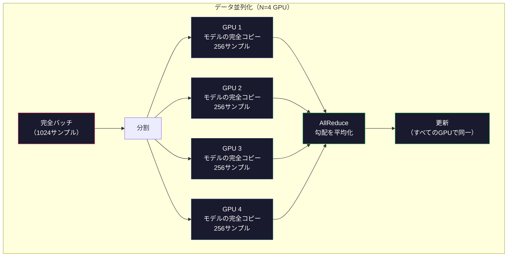
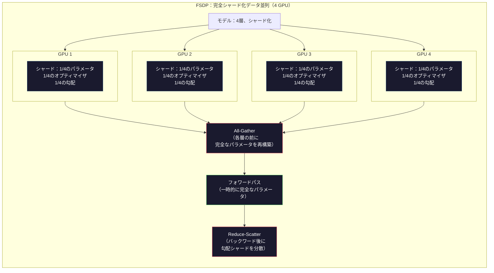
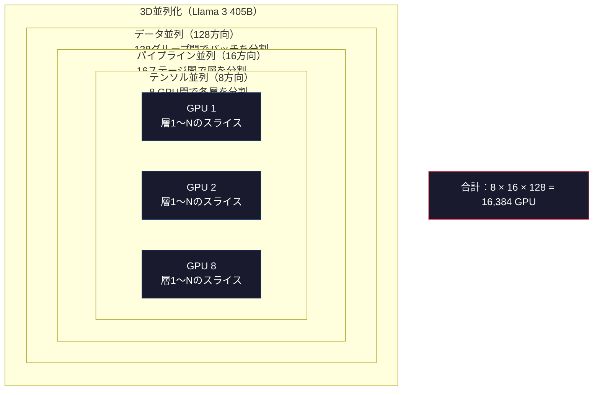

# スケーリング：分散訓練、FSDP、DeepSpeed

> 1億2400万パラメータのモデルは1枚のGPUで訓練できた。次は70億パラメータを試してみよう。モデルはメモリに収まらない。データは1台のマシンで何週間もかかる。スケールにおける分散訓練は任意ではない。唯一の道だ。


## 学習目標

- 3種類の並列化（データ、テンソル、パイプライン）を説明し、モデルとクラスターのサイズに基づいてそれぞれがいつ必要かを理解する
- 複数GPU間での勾配同期を使ったPyTorch DDPによるデータ並列訓練を実装する
- 最小ハードウェアを決定するために、特定のモデルサイズのメモリ予算（重み + オプティマイザの状態 + 勾配 + 活性化）を計算する
- FSDPまたはDeepSpeed ZeROステージを設定して、シングルGPUメモリを超えるモデルが収まるようにGPU間でモデル状態をシャードする

## 問題

FP16の70億パラメータモデルは重みだけで14GBが必要だ。Adamオプティマイザはすべてのパラメータの2つの追加コピーを保存する（一次モーメントと二次モーメントの推定）。それがさらに28GBだ。バックプロパゲーション中の勾配がさらに14GBを追加する。単一の活性化が保存される前に56GBに達してしまう。

NVIDIA A100は80GBのメモリを持つ。

80GBのうち56GBが消費される。フォワードパス中に計算されてバックプロパゲーションのために生かし続けなければならない中間値である活性化のために24GBが残る。4096次元モデルの2048トークンシーケンスでは、単一層の活性化は約64MBを使う。32層では1サンプルあたり2GBが必要だ。バッチサイズ8なら16GBが必要だ。24GBある。バッチサイズ12では爆発する。

700億パラメータを試してみよう。重みだけで：FP16で140GB。1台のGPUには収まらない。重みを保持するだけで少なくとも2つのA100（2 x 80GB = 160GB）が必要だ。オプティマイザの状態と勾配を追加するとさらに多く必要だ：最低3台以上のGPU、シャーディング戦略によっては現実的には8〜16台だ。

Llama 3 405Bは16,384台のNVIDIA H100 GPUで訓練された。この訓練実行の計算コストは推定1億ドルだ。DeepSeek V3はアーキテクチャ（Mixture of Expertsはトークンごとにパラメータの一部しか活性化しない）と訓練効率を工夫することで、約560万ドルで同等のモデルを訓練した。

このレッスンでは、大規模訓練を可能にする4つの戦略をカバーする：データ並列化、テンソル並列化、パイプライン並列化、完全シャード化データ並列化。分散訓練フレームワークに触れる前にメカニズムを理解するために、純粋なPythonでそれぞれをシミュレートする。

## 概念

### 分散化が必要な理由

実際のモデルのメモリ計算を示す。すべての数値は推測ではなく計算されたものだ。

| モデル | パラメータ数 | 重み（FP16） | Adamの状態 | 勾配（FP16） | 合計（活性化なし） |
|-------|--------|----------------|-------------|------------------|----------------------|
| GPT-2 Small | 1億2400万 | 248 MB | 992 MB | 248 MB | 1.5 GB |
| Llama 3 8B | 80億 | 16 GB | 64 GB | 16 GB | 96 GB |
| Llama 3 70B | 700億 | 140 GB | 560 GB | 140 GB | 840 GB |
| Llama 3 405B | 4050億 | 810 GB | 3,240 GB | 810 GB | 4,860 GB |

「Adamの状態」列が問題だ。AdamはすべてのパラメータについてFP32で移動平均（m）と移動分散（v）を保存する。700億モデルでは、700億 × 4バイト × 2 = 560GBだ。オプティマイザだけで7台のA100が必要だ。

1台のH100は80GBを持つ。Llama 3 405Bは重み、オプティマイザ、勾配を保持するだけで少なくとも61台のH100が必要だ。活性化を追加するとさらに増える。Metaが16,384台のGPUを使ったのは望んだからではない――そうしなければならなかったからだ。

### データ並列化

最もシンプルな分散戦略。モデル全体をN台のGPUにコピーする。各訓練バッチをN等分する。各GPUはデータのシャードに対してフォワードとバックワードパスを実行する。バックワードパス後、すべてのGPU間で勾配を平均化する。すべてのGPUが同じ平均化された勾配で重みのコピーを更新し、すべてのコピーを同期させる。

**利点：** スループットが線形にスケールする。N台のGPUはステップあたりN倍のデータを処理する。通信は勾配の平均化に限られ、計算とオーバーラップする。

**欠点：** すべてのGPUがモデル、オプティマイザの状態、勾配の完全なコピーを保持する。700億モデルでは、各GPUに840GBが必要だ。データ並列化はGPUあたりのメモリを削減しない。訓練時間を削減するだけだ。

**計算：** 有効バッチサイズ = per_gpu_batch_size × N。GPUあたりのバッチ16でN=64 GPUの場合、有効バッチは1,024だ。Llama 3はステップあたり1600万トークンの有効バッチサイズを使った。



### テンソル並列化

個々の層をGPU間で分割する。単一の行列乗算がGPU間で分割され、各GPUが結果の一部を計算する。

フィードフォワード層の形状(8192, 8192)の重み行列を考えよう。4方向テンソル並列化では、各GPUが(8192, 2048)のシャードを保持する。各GPUが入力をそのシャードで乗算し、部分的な結果を生成する。部分的な結果が組み合わされて（all-reduceまたはall-gatherを通じて）完全な出力を生成する。

**利点：** モデル重みのGPUあたりのメモリを削減する。8台のGPUに分散された700億モデルでは、各GPUが約87.5億パラメータ相当の重みを保持する。

**欠点：** すべての層の後に高速なGPU間通信が必要だ。各行列乗算後のall-reduceがレイテンシを追加する。これは同一ノード上のGPU間のNVLink（GPU間で900GB/s）ではうまく機能するが、InfiniBandで接続されたノード間（400Gb/s、約50GB/s）ではうまくいかない。テンソル並列化はほぼ常に単一ノード（8 GPU）内に限られる。

**実際の使用：** Megatron-LMがテンソル並列化を先導した。Llama 3 405Bは各ノード内で8方向テンソル並列化を使用している。

### パイプライン並列化

モデルを層ごとに分割する。GPU 1が層1〜8を実行する。GPU 2が層9〜16を実行する。GPU 3が層17〜24を実行する。GPU 4が層25〜32を実行する。データがパイプラインを流れる：GPU 1が自分の層を計算してGPU 2に活性化を送り、GPU 2が自分の層を計算してGPU 3に送る、という具合だ。

**利点：** GPU間の通信が最小限――層の境界での活性化だけで、勾配や重みに比べて小さい。帯域幅要件が低いため、ノードをまたいで機能する。

**欠点：** パイプラインバブル。GPU 4がマイクロバッチ1のフォワードパスを計算しているとき、GPU 1、2、3はアイドル状態だ（自分の部分はすでに転送済みだ）。バックワードパス中はパターンが逆転する。単純なパイプライン化では、N個のパイプラインステージでGPUの利用率は1/Nだけだ。

**GPipeとPipeDream**はバッチをマイクロバッチに分割することでバブル問題を解決する。GPU 1はマイクロバッチ1の転送が終わったらすぐにマイクロバッチ2を始める。これによりパイプラインステージ間で計算がオーバーラップする。Mのマイクロバッチとのステージで、バブル割合は(N-1)/Mに低下する。N=4ステージでM=16マイクロバッチを使うとバブルは3/16 = 18.75%のアイドル時間になる。

### FSDP：完全シャード化データ並列

FSDPはデータ並列化のスケーラビリティとシャーディングのメモリ効率を組み合わせる。各GPUがモデルの完全なコピーを保持する代わりに、各GPUはパラメータ、勾配、オプティマイザの状態の1/Nだけを保持する。

層のフォワードパスの前に、FSDPは**all-gather**を実行して、各GPUのメモリに全GPUからの完全なパラメータを収集する。フォワードパス後、各GPUはローカルでないパラメータを破棄する。バックワード中、勾配計算のためのパラメータを再構築するためにall-gatherが再び実行される。バックワードパス後、**reduce-scatter**が勾配シャードを分散させるので、各GPUはNの1/Nの勾配だけを保存する。

**8 GPUでの700億モデルの計算：**

| コンポーネント | FSDPなし | FSDPあり |
|-----------|-------------|-----------|
| 重み（FP16） | GPUあたり140 GB | GPUあたり17.5 GB |
| Adamの状態（FP32） | GPUあたり560 GB | GPUあたり70 GB |
| 勾配（FP16） | GPUあたり140 GB | GPUあたり17.5 GB |
| **合計** | **GPUあたり840 GB** | **GPUあたり105 GB** |

FSDPなしでは、700億モデルを単一の80GB GPUに収めることができない。8 GPUでFSDPを使うと、各GPUは105GBを使う――待って、これでもまだ収まらない。GPUあたり80GB以下にするには少なくとも16 GPUが必要だ。あるいはFSDPとアクティベーションチェックポイント（活性化を保存する代わりにバックワード中に再計算する）を組み合わせる。

通信コストはall-gatherが各層の前に必要なため、通常のデータ並列化より高い。しかしメモリの節約により、以前は不可能だった訓練実行が可能になる。



### DeepSpeed ZeRO

DeepSpeedのZeRO（Zero Redundancy Optimizer）は概念的にFSDPと同一だが、Microsoftが独立して開発した。3つのステージを定義し、それぞれがより積極的にシャーディングを行う：

| ステージ | シャードの対象 | メモリ節約 | 通信 |
|-------|--------|---------------|---------------|
| ZeRO-1 | オプティマイザの状態のみ | 約4倍削減 | データ並列と同等 |
| ZeRO-2 | + 勾配 | 約8倍削減 | わずかに多い |
| ZeRO-3 | + パラメータ | 約N倍削減（N GPU） | 層ごとにall-gather |

ZeRO-3はFSDPと同等だ。命名は異なるがメカニズムは同じだ。PyTorchはDeepSpeedがコンセプトを証明した後、FSDPをネイティブ実装として追加した。

DeepSpeedはまたZeRO-Offload（オプティマイザの状態をより安価で大容量のCPU RAMにオフロード）とZeRO-Infinity（NVMe SSDにオフロード）を導入した。これらは計算速度をメモリ容量と引き換えにする――オフロードされた操作は遅いがGPUメモリを解放する。

### 混合精度訓練

現代の訓練では複数の浮動小数点フォーマットを同時に使う：

- **フォワードパス**：FP16またはBF16（16ビット）。FP32の半分のメモリ。行列乗算はテンソルコアで2倍速く実行される。
- **マスターウェイト**：FP32（32ビット）。重み更新中の数値精度のためにオプティマイザが維持する。
- **損失スケーリング**：バックワードパスの前に損失に大きな定数を掛けて、FP16の勾配がゼロにアンダーフローするのを防ぐ。オプティマイザのステップの前に同じ定数で割る。

BF16（Brain Float 16）はFP32と同じ指数範囲（8指数ビット）を持つが精度が低い（7仮数ビット対FP32の23）。同じ値の範囲を表現できるため、損失スケーリングがほとんど必要ない。FP16は5指数ビットと10仮数ビットを持つ――細かな値を表現できるが、極端な大きさでオーバーフロー/アンダーフローする。

GoogleのTPUはBF16をネイティブに使う。NVIDIAのA100とH100はFP16とBF16の両方をサポートする。損失スケーリングの問題を排除するため、業界はBF16に大きく移行している。

**7Bモデルのメモリ比較：**

| 精度 | 重み | オプティマイザ | 勾配 | 合計 |
|-----------|---------|-----------|-----------|-------|
| FP32のみ | 28 GB | 56 GB | 28 GB | 112 GB |
| 混合（BF16 + FP32マスター） | 14 GB | 56 GB | 14 GB | 84 GB |

このモデルで混合精度は28GBを節約する。オプティマイザの状態はいずれにせよFP32のまま――ここがメモリの大部分が行く場所だ。

### Megatron-LMと3D並列化

実際の大規模訓練はすべての3種の並列化を組み合わせる：

- ノードのグループ間での**データ並列化**（バッチサイズをスケール）
- ノード内での**テンソル並列化**（8 GPU間で層を分割）
- ノード間での**パイプライン並列化**（マシン間で層グループを分割）

16,384台のH100でのLlama 3 405B：
- 各ノード内で8方向テンソル並列化（ノードあたり8 GPU）
- ノード間で16方向パイプライン並列化（16パイプラインステージ）
- 残りの次元で128方向データ並列化（16,384 / 8 / 16 = 128）

この3D分解（8 × 16 × 128 = 16,384）が何千台ものGPUにスケールする方法だ。各GPUは異なるデータシャードを見て（データ並列）、各層の1スライスを保持し（テンソル並列）、異なる層のセットを計算する（パイプライン並列）。

DeepSeek V3は別のアプローチを取った。Mixture of Expertsアーキテクチャはトークンごとに6710億のうち370億のパラメータしか活性化しない。つまり各GPUは活性化されたパラメータのみを計算（および活性化を保存）すればよい。彼らは2,048台のH800 GPU――Metaのわずか1/8未満のGPU数――でMetaの推定1億ドルに対して560万ドルで訓練した。



## 実装する

### ステップ1: データ並列化のシミュレート

バッチを仮想GPUに分割する。各GPUはそのシャードでフォワードパスを計算する。「勾配」（損失値としてシミュレートする）を平均化する。

```python
import numpy as np

def simulate_data_parallelism(data, num_gpus, model_fn):
    batch_size = len(data)
    shard_size = batch_size // num_gpus
    remainder = batch_size % num_gpus

    gpu_losses = []
    gpu_gradients = []

    offset = 0
    for gpu_id in range(num_gpus):
        extra = 1 if gpu_id < remainder else 0
        shard = data[offset:offset + shard_size + extra]
        offset += shard_size + extra

        loss, grad = model_fn(shard)
        gpu_losses.append(loss)
        gpu_gradients.append(grad)

    avg_loss = np.mean(gpu_losses)
    avg_gradient = np.mean(gpu_gradients, axis=0)

    return avg_loss, avg_gradient
```

all-reduce操作（勾配の平均化）はデータ並列化における唯一の通信だ。実際には、NVIDIA GPUでのNCCLライブラリを使用し、リングall-reduceを実装する：各GPUが勾配の1/Nを隣のGPUに送り、もう一方の隣から1/Nを受け取り、N-1ステップ後にすべてのGPUが完全な平均を持つ。合計通信量：2 × 勾配サイズ × (N-1)/N、大きなNでは2倍の勾配サイズに近づく。

### ステップ2: テンソル並列化のシミュレート

重み行列をGPU間で分割する。各GPUが部分的な行列乗算を計算する。結果を組み合わせる。

```python
def simulate_tensor_parallelism(input_data, weight_matrix, num_gpus):
    d_in, d_out = weight_matrix.shape
    assert d_out % num_gpus == 0, f"d_out {d_out}はnum_gpus {num_gpus}で割り切れない"
    shard_size = d_out // num_gpus

    partial_results = []
    for gpu_id in range(num_gpus):
        start = gpu_id * shard_size
        end = start + shard_size
        weight_shard = weight_matrix[:, start:end]

        partial = input_data @ weight_shard
        partial_results.append(partial)

    full_output = np.concatenate(partial_results, axis=-1)

    direct_output = input_data @ weight_matrix
    error = np.abs(full_output - direct_output).max()

    return full_output, error
```

エラーは正確にゼロ（または機械精度）になるはずだ。テンソル並列化は数学的に正確だ――1台のGPUで完全な行列乗算を計算するのと同じ結果を生み出す。分割は出力次元に沿っているため、各GPUが異なる列チャンクを生成し、連結によって完全な結果が再構築される。

列並列線形層（出力次元を分割）では連結する。行並列（入力次元を分割）では合計する。トランスフォーマーFFNでは、最初の線形（拡張）が列並列を使い、2番目の線形（収縮）が行並列を使う。これにより2つの層間のall-reduceを避けられる。

### ステップ3: パイプライン並列化のシミュレート

モデルの層を仮想GPUに分割する。後のステージが計算している間に前のステージがアイドルになるバブル問題を示す。

```python
def simulate_pipeline_parallelism(num_layers, num_stages, num_microbatches):
    layers_per_stage = num_layers // num_stages

    timeline = {}
    clock = 0

    for mb in range(num_microbatches):
        for stage in range(num_stages):
            start_time = max(
                timeline.get((stage, mb - 1, "fwd"), (0, 0))[1] if mb > 0 else 0,
                timeline.get((stage - 1, mb, "fwd"), (0, 0))[1] if stage > 0 else 0,
            )
            end_time = start_time + layers_per_stage
            timeline[(stage, mb, "fwd")] = (start_time, end_time)

    last_fwd_end = max(v[1] for v in timeline.values())

    for mb in range(num_microbatches - 1, -1, -1):
        for stage in range(num_stages - 1, -1, -1):
            deps = [last_fwd_end]
            if mb < num_microbatches - 1 and (stage, mb + 1, "bwd") in timeline:
                deps.append(timeline[(stage, mb + 1, "bwd")][1])
            if stage < num_stages - 1 and (stage + 1, mb, "bwd") in timeline:
                deps.append(timeline[(stage + 1, mb, "bwd")][1])
            start_time = max(deps)
            end_time = start_time + layers_per_stage
            timeline[(stage, mb, "bwd")] = (start_time, end_time)

    total_time = max(v[1] for v in timeline.values())
    compute_time = num_microbatches * num_stages * layers_per_stage * 2
    bubble_fraction = 1.0 - compute_time / (total_time * num_stages)

    return timeline, total_time, bubble_fraction
```

4ステージと1マイクロバッチでは、バブル割合は75%だ――4台のうち3台のGPUがいつでもアイドル状態だ。16マイクロバッチでは約19%に低下する。バブルを排除するコストはメモリだ：飛行中のすべてのマイクロバッチの活性化を同時に保存しなければならない。

### ステップ4: メモリ計算機

任意のモデルサイズの訓練に必要なメモリを正確に計算する。

```python
def memory_calculator(
    params_billions,
    precision_bytes=2,
    optimizer="adam",
    num_gpus=1,
    sharding="none",
    sequence_length=2048,
    batch_size_per_gpu=1,
    hidden_dim=None,
    num_layers=None,
):
    params = params_billions * 1e9

    weight_memory = params * precision_bytes

    if optimizer == "adam":
        optimizer_memory = params * 4 * 2
    elif optimizer == "sgd":
        optimizer_memory = params * 4
    else:
        optimizer_memory = 0

    gradient_memory = params * precision_bytes

    total_no_activation = weight_memory + optimizer_memory + gradient_memory

    if hidden_dim and num_layers:
        activation_per_layer = (
            sequence_length * batch_size_per_gpu * hidden_dim * precision_bytes * 4
        )
        activation_memory = activation_per_layer * num_layers
    else:
        activation_memory = params * precision_bytes * 0.5

    if sharding == "fsdp" or sharding == "zero3":
        weight_memory /= num_gpus
        optimizer_memory /= num_gpus
        gradient_memory /= num_gpus
    elif sharding == "zero2":
        optimizer_memory /= num_gpus
        gradient_memory /= num_gpus
    elif sharding == "zero1":
        optimizer_memory /= num_gpus

    per_gpu_total = weight_memory + optimizer_memory + gradient_memory + activation_memory

    return {
        "params_billions": params_billions,
        "weights_gb": weight_memory / 1e9,
        "optimizer_gb": optimizer_memory / 1e9,
        "gradients_gb": gradient_memory / 1e9,
        "activations_gb": activation_memory / 1e9,
        "per_gpu_total_gb": per_gpu_total / 1e9,
        "total_across_gpus_gb": per_gpu_total * num_gpus / 1e9,
        "fits_on_80gb": per_gpu_total / 1e9 <= 80,
        "num_gpus": num_gpus,
        "sharding": sharding,
    }
```

この計算機はすべてのMLエンジニアが聞く質問に答える：「GPUはいくつ必要か？」モデルサイズを入力して収まるかどうか確認する。GPUあたりの合計が80GB以下になるまでシャーディング戦略を調整する。

### ステップ5: 混合精度のシミュレーション

FP32、FP16、混合精度訓練のメモリ使用量を比較する。

```python
def mixed_precision_comparison(params_billions):
    params = params_billions * 1e9

    fp32_weights = params * 4
    fp32_optimizer = params * 4 * 2
    fp32_gradients = params * 4
    fp32_total = fp32_weights + fp32_optimizer + fp32_gradients

    fp16_weights = params * 2
    fp16_master = params * 4
    fp16_optimizer = params * 4 * 2
    fp16_gradients = params * 2
    fp16_total = fp16_weights + fp16_master + fp16_optimizer + fp16_gradients

    mixed_weights = params * 2
    mixed_optimizer = params * 4 * 2
    mixed_gradients = params * 2
    mixed_total = mixed_weights + mixed_optimizer + mixed_gradients

    return {
        "fp32_total_gb": fp32_total / 1e9,
        "fp16_with_master_gb": fp16_total / 1e9,
        "mixed_bf16_gb": mixed_total / 1e9,
        "savings_vs_fp32": 1 - mixed_total / fp32_total,
    }
```

ほとんどの人にとって最大の驚き：混合精度はメモリを半分にしない。オプティマイザの状態（AdamのmとV）は精度に関係なくFP32のままだ。7Bモデルでは、FP32訓練は112GBを使う。混合精度は84GBを使う。これは50%削減ではなく25%削減だ。オプティマイザが支配的だ。

## 使ってみる

### すべてのシミュレーションを実行する

```python
def run_all_demos():
    print("=" * 70)
    print("データ並列化シミュレーション")
    print("=" * 70)

    np.random.seed(42)
    data = np.random.randn(64, 32)
    weight = np.random.randn(32, 16)

    def model_fn(batch):
        output = batch @ weight
        loss = np.mean(output ** 2)
        grad = 2 * batch.T @ (batch @ weight) / len(batch)
        return loss, grad

    for n_gpus in [1, 2, 4, 8]:
        loss, grad = simulate_data_parallelism(data, n_gpus, model_fn)
        print(f"  {n_gpus} GPU: loss={loss:.4f}, grad_norm={np.linalg.norm(grad):.4f}")

    print()
    print("=" * 70)
    print("テンソル並列化シミュレーション")
    print("=" * 70)

    x = np.random.randn(4, 8192)
    W = np.random.randn(8192, 8192)

    for n_gpus in [1, 2, 4, 8]:
        output, error = simulate_tensor_parallelism(x, W, n_gpus)
        print(f"  {n_gpus} GPU: output_shape={output.shape}, max_error={error:.2e}")

    print()
    print("=" * 70)
    print("パイプライン並列化シミュレーション")
    print("=" * 70)

    for n_mb in [1, 4, 8, 16, 32]:
        _, total_t, bubble = simulate_pipeline_parallelism(32, 4, n_mb)
        print(f"  {n_mb:2d}マイクロバッチ: total_time={total_t:4d}, bubble={bubble:.1%}")

    print()
    print("=" * 70)
    print("メモリ計算機")
    print("=" * 70)

    configs = [
        (7, "none", 1),
        (7, "fsdp", 8),
        (70, "none", 1),
        (70, "fsdp", 8),
        (70, "fsdp", 16),
        (405, "fsdp", 64),
        (405, "fsdp", 128),
    ]

    print(f"  {'モデル':>8} {'シャーディング':>10} {'GPU数':>5} {'GPUあたり':>10} {'80GB収容':>10}")
    print("  " + "-" * 55)
    for params, shard, gpus in configs:
        result = memory_calculator(params, num_gpus=gpus, sharding=shard)
        fits = "はい" if result["fits_on_80gb"] else "いいえ"
        print(f"  {params:>6}B {shard:>10} {gpus:>5} {result['per_gpu_total_gb']:>8.1f}GB {fits:>10}")

    print()
    print("=" * 70)
    print("混合精度比較")
    print("=" * 70)

    for params_b in [7, 13, 70, 405]:
        result = mixed_precision_comparison(params_b)
        print(f"  {params_b}B: FP32={result['fp32_total_gb']:.0f}GB, "
              f"混合BF16={result['mixed_bf16_gb']:.0f}GB, "
              f"節約={result['savings_vs_fp32']:.0%}")
```

## 成果物を出す

このレッスンでは `outputs/prompt-distributed-training-planner.md` を作成する――モデルサイズと利用可能なハードウェアを入力として、完全な分散訓練計画（並列化戦略、メモリ予算、通信オーバーヘッド、期待スループット）を生成するプロンプトだ。

## 演習

1. アクティベーションチェックポイントを含むようにメモリ計算機を修正する。チェックポイント化では、K層ごとにのみ活性化を保存する（一般的なK=1、すべてを再計算することを意味する）。メモリと計算のトレードオフを示す：チェックポイント化はどれだけメモリを節約するか、そして訓練をどれだけ遅くするか（完全なチェックポイント化でほぼ33%多くの計算）？

2. PipeDreamで使われる1F1B（1フォワード、1バックワード）スケジュールを実装するようにパイプライン並列化シミュレーションを拡張する。4ステージと8マイクロバッチについて、単純なスケジュールとバブル割合を比較する。1F1Bスケジュールはバックワードパスを早く始めるためピークメモリが小さくなるはずだ。

3. 勾配蓄積シミュレーターを実装する。各マイクロバッチ後にall-reduceする代わりに、Kステップ間ローカルに勾配を蓄積してからall-reduceする。K倍通信が削減されるが同一の最終勾配（したがって同一の訓練）を生み出すことを示す。

4. コスト見積もり機を構築する。モデルサイズ、目標トークン数、GPUタイプ（A100は時間2ドル、H100は時間3.50ドル）、並列化戦略を入力として、総訓練コストをドルで見積もる。既知のコストで検証する：Llama 3 405Bは推定約1億ドル、DeepSeek V3は約560万ドルかかった。

5. ZeRO-Offloadをメモリ計算機に追加する。ノードあたりCPU RAMが512GB、NVMeが2TBと仮定する。オプティマイザの状態をCPUにオフロードすることで、700億モデルが16台ではなく4台のGPUで訓練できるようになる様子を示す。ただしオプティマイザのステップが30〜50%遅くなるコストがある。

## キーワード

| 用語 | 一般的な説明 | 実際の意味 |
|------|-------------|-----------|
| データ並列化 | 「すべてのGPUにモデルをコピーする」 | 各GPUが異なるデータシャードを処理し、各ステップ後にall-reduceで勾配を平均化する |
| テンソル並列化 | 「GPU間で層を分割する」 | 各GPUが行列乗算の一部を計算するよう重み行列を分割する。高速なNVLink相互接続が必要 |
| パイプライン並列化 | 「GPU間で層を分割する」 | 各GPUが異なる層グループを実行し、データがパイプラインを流れる。バブルを減らすためにマイクロバッチを使う |
| FSDP | 「すべてをシャードする」 | 完全シャード化データ並列――各GPUが重み、勾配、オプティマイザの状態の1/Nを保持し、計算前にall-gatherする |
| ZeRO | 「DeepSpeedバージョンのFSDP」 | Zero Redundancy Optimizerの3ステージ：オプティマイザをシャード（ステージ1）、+勾配（ステージ2）、+パラメータ（ステージ3） |
| All-reduce | 「GPU間で平均化する」 | すべてのGPUがすべてのGPUの入力の合計（または平均）で終わる集合的操作――通常リングall-reduceとして実装 |
| All-gather | 「すべてのGPUから収集する」 | すべてのGPUがすべてのGPUのデータの連結で終わる集合的操作――FSDPで完全なパラメータを再構築するために使用 |
| Reduce-scatter | 「合計して分散する」 | データを削減（合計）して異なるチャンクを異なるGPUに分散する集合的操作――FSDPでの勾配シャーディングに使用 |
| 混合精度 | 「半精度で訓練する」 | フォワード/バックワードにはFP16/BF16を使い、オプティマイザの状態にはFP32を使う――オプティマイザが支配的なため、メモリは50%ではなく約25%節約 |
| パイプラインバブル | 「パイプライン内のアイドル時間」 | GPUが前のステージからのデータを待ちながらアイドル状態になる割合――マイクロバッチを増やすことで削減 |

## 参考資料

- [Rajbhandari et al., 2020 -- "ZeRO: Memory Optimizations Toward Training Trillion Parameter Models"](https://arxiv.org/abs/1910.02054) -- 3つのシャーディングステージを定義したDeepSpeed ZeRO論文
- [Shoeybi et al., 2020 -- "Megatron-LM: Training Multi-Billion Parameter Language Models Using Model Parallelism"](https://arxiv.org/abs/1909.08053) -- トランスフォーマー向けNVIDIAのテンソル並列化
- [Narayanan et al., 2021 -- "Efficient Large-Scale Language Model Training on GPU Clusters Using Megatron-LM"](https://arxiv.org/abs/2104.04473) -- データ、テンソル、パイプラインを組み合わせた3D並列化
- [Zhao et al., 2023 -- "PyTorch FSDP: Experiences on Scaling Fully Sharded Data Parallel"](https://arxiv.org/abs/2304.11277) -- PyTorchネイティブFSDP実装
- [Llama 3テクニカルレポート](https://arxiv.org/abs/2407.21783) -- 3D並列化詳細を含む16,384 GPU訓練
- [DeepSeek-V3テクニカルレポート](https://arxiv.org/abs/2412.19437) -- MoEアーキテクチャが訓練コストを1桁削減する方法
