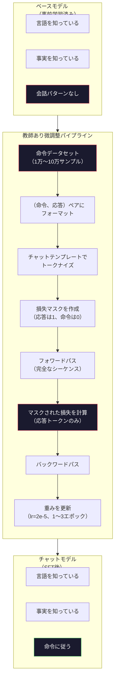

# 命令チューニング（SFT）

> ベースモデルは次のトークンを予測する。それだけだ。指示に従わず、質問に答えず、有害なリクエストを断らない。SFTはトークン予測器と有用なアシスタントの間の橋だ。これまで会話したすべてのモデル――Claude、GPT、Llama Chat――はこのステップを経ている。


## 学習目標

- ベース言語モデルを命令に従うアシスタントに変換するSFT（教師あり微調整）を実装する
- システム、ユーザー、アシスタントのロールを持つチャットテンプレートを使って訓練データをフォーマットし、非アシスタントトークンの損失をマスクする
- SFTが必要な理由を説明する：ベースモデルは質問に答えるのではなくテキストを継続する
- ベースモデル対微調整済みモデルの応答をホールドアウト命令セットで比較してSFTの品質を評価する

## 問題

レッスン04でモデルを訓練した。シーケンスが与えられたら次のトークンを予測できる。「The transformer architecture」を入力すると「has revolutionized natural language processing.」と続けるかもしれない。次トークン予測器としては印象的だ。

今度は「What is the capital of France?」を入力してみよう。ベースモデルは「Paris.」と答えない。パターンを継続する。「What is the capital of Germany? What is the capital of Spain?」を生成するかもしれない――質問のリストを含む文書から学習したからだ。あるいは「is a question that many people ask」を生成するかもしれない。それがもっともらしい次トークンの継続だからだ。モデルには*答える*という概念がない。*継続する*しか知らない。

これがGPT-3（ベースモデル、2020年6月リリース）とChatGPT（命令チューニング済み、2022年11月リリース）の差だ。同じアーキテクチャ。同じ事前学習。違いは、会話パターンを学習させた2万〜10万の丁寧に作られた（命令、応答）ペアだ。

Stanford AlpacaはサンプルがなくてもSFTが機能することを証明した。2023年3月、彼らはGPT-3.5が生成したたった5万2千の命令-応答ペアでLlama 7Bを微調整した。総コスト：600ドル。結果は命令に従い、質問に答え、会話を続けられるチャットボットだった。ChatGPTほど良くはないが、600ドルで数時間の訓練にしては驚くほど近い。

MetaのLlama 2 Chatは初期SFTステージにわずか2万7千の高品質サンプルだけを使った。重要な洞察：品質は量より重要だ。熟練した注釈者が書いた2万7千サンプルは、インターネットからスクレイプした100万の雑なサンプルに勝る。

## 概念

### SFTが実際にすること

教師あり微調整は事前学習と同じ訓練ループを続ける――フォワードパス、損失の計算、バックワードパス、重みの更新――しかし異なる種類のデータで行う。生テキストの代わりに、構造化された会話で訓練する：

```json
{
  "system": "You are a helpful assistant.",
  "user": "What is the capital of France?",
  "assistant": "The capital of France is Paris."
}
```

モデルはすでにパリがフランスの首都であることを知っている。事前学習中にWikipedia、教科書、ウェブページで学習した。SFTはモデルに新しい事実を教えない。新しい*行動*を教える：質問を見たら答えを生成する。命令を見たら補完を生成する。有害なリクエストを見たら断る応答を生成する。

このように考えよう。事前学習はモデルに知識を与える。SFTはモデルに礼儀を与える。

### データフォーマット

業界では3つのフォーマットが主流だ。それぞれ同じ情報――誰が何を言ったか――を異なる区切り文字でエンコードする。

**Alpacaフォーマット**（Stanford、2023年3月）：

```json
{
  "instruction": "Summarize the following article in 3 sentences.",
  "input": "The European Central Bank raised interest rates...",
  "output": "The ECB increased rates by 25 basis points..."
}
```

シンプルで広く使われている。`input`フィールドはオプション――多くの命令には追加のコンテキストが不要だ。Stanfordは5万2千のサンプルをこのフォーマットでリリースした。GPT-3.5で600ドルで生成され、オープンソース命令チューニング運動を始動させた。

**ShareGPTフォーマット**（コミュニティ、2023年）：

```json
{
  "conversations": [
    {"from": "system", "value": "You are a helpful assistant."},
    {"from": "human", "value": "What causes tides?"},
    {"from": "gpt", "value": "Tides are caused by the gravitational pull of the Moon..."},
    {"from": "human", "value": "How often do they occur?"},
    {"from": "gpt", "value": "Most coastal areas experience two high tides and two low tides per day..."}
  ]
}
```

マルチターンの会話をサポートする。「from」フィールドは実際のモデルに関係なく慣例的に「human」と「gpt」を使う。VicunaはユーザーがシェアしたChatGPTのやり取りからスクレイプした7万のShareGPT会話で訓練された。

**ChatMLフォーマット**（OpenAI、多くのオープンソースモデルで使用）：

```
<|im_start|>system
You are a helpful assistant.<|im_end|>
<|im_start|>user
What is the capital of France?<|im_end|>
<|im_start|>assistant
The capital of France is Paris.<|im_end|>
```

会話データ内でスピーカーのロールをマークするために特殊トークン（`<|im_start|>`、`<|im_end|>`）を使う。これらのトークンは微調整中にトークナイザーの語彙に追加される。Qwen、Yi、その他多くのモデルがChatMLを使用する。

3つのフォーマットすべてが同じことを達成する：モデルに「これが命令で、これが応答だ、このパターンを学べ」と伝える。

### なぜ機能するのか

モデルはすでに事前学習から言語を知っている。質問の後に答えが来る、命令の後に補完が来る、人々の会話という何十億もの例を見ている。パターンはすでに重みにエンコードされている。

SFTはこの潜在的な能力を集中させる。モデルが質問に答えるべきか文書を継続すべきかをコンテキストから解読する必要がある代わりに、SFTは会話パターンを明示的に訓練する。数千のサンプルの後、モデルは学習する：アシスタントのロールマーカーを見たら、役立つ応答を生成する。

これが2万7千のサンプルで十分な理由だ。英語を教えているのではない。世界についての事実を教えているのではない。1つのシンプルな行動を教えている：命令に応答する。知識はすでにそこにある。

### マスクされた損失

これはSFTで最も重要な技術的詳細だが、ほとんどのチュートリアルがスキップする。

事前学習では、すべてのトークンで損失を計算する。モデルはシーケンス内のすべての次のトークンを予測することを学習する。SFTでは、*応答*トークンのみで損失を計算する。命令トークンはコンテキストとして存在するが、モデルはそれらを「予測」できなかったことへのペナルティを受けない。

なぜか？モデルに命令を*生成する*ことを学習させたくないからだ。命令に*応答する*ことを学習させたい。命令トークンで損失を計算すると、まるでモデルが質問している側であるかのように「What is the capital of France?」を予測するよう訓練してしまう。これは勾配シグナルを無駄にし、自分のロールについてモデルを混乱させる可能性がある。

実際には、損失マスクを作成する：応答トークンは1、命令トークンは0。平均化の前にトークンごとの損失をこのマスクで掛け合わせる。

```
トークン:   [SYS] You are helpful [USER] What is the capital? [ASST] Paris is the capital [EOS]
損失マスク:   0    0    0     0      0     0   0  0     0       1     1    1   1     1      1
```

`[ASST]`の後のトークンのみが損失に貢献する。モデルはフォワードパス中に完全な会話を見る（正しい応答を生成するために命令が必要だ）が、応答をどれだけうまく予測したかに基づいてのみ重みを更新する。

### 訓練のハイパーパラメータ

SFTは事前学習とは劇的に異なるハイパーパラメータを使う。ゼロから訓練しているわけではない。すでに機能しているモデルを調整している。

| パラメータ | 事前学習（Llama 2 7B） | SFT（Llama 2 Chat） |
|-----------|---------------------------|---------------------|
| 学習率 | 3e-4（ピーク） | 2e-5 |
| エポック数 | 1（データの1回通過） | 2 |
| バッチサイズ | 400万トークン | 64サンプル |
| ウォームアップステップ | 2,000 | 0〜100 |
| 重み減衰 | 0.1 | 0.0〜0.1 |
| データサイズ | 2兆トークン | 2万7千サンプル |

SFTの学習率は15倍低い。これは重要だ。微調整中に高い学習率を使うと事前学習済みの知識が破壊される。モデルが学習したことを「忘れ」、小さな微調整データセットに過学習する。これが壊滅的忘却だ。

2エポックとは、モデルが各訓練サンプルを2回見ることを意味する。小さなデータセットで3エポックを超えると暗記につながる――モデルは汎化ではなくそのまま訓練サンプルを再現し始める。

### 壊滅的忘却

微調整は一般的な能力を破壊することがある。命令追従データで長すぎるほど訓練すると、モデルはコードを書く、数学をする、または創造的なテキストを生成する能力を失う。訓練データの特定のフォーマットには非常に得意になり、他のすべてには非常に苦手になる。

3つの緩和策：

1. **低い学習率。** 1e-5〜5e-5。更新が小さいほど、事前学習済みの特徴の破壊が少ない。

2. **短い訓練。** 1〜3エポック。モデルが過学習する前に止める。

3. **事前学習データを混ぜる。** Llama 2 Chatは事前学習の生データの小さな割合（2〜5%）をSFTデータセットに混ぜた。これによりモデルが新しい命令追従行動を学習する一方で、一般的な能力を「思い出す」ようにした。

### 実際の数字

10,000の高品質命令ペアでの7Bモデルの微調整は、NVIDIA A100 80GB GPU 1枚で約1時間かかる。計算してみよう：

- 10,000サンプル × 平均512トークン = 512万トークン
- 2エポック = 合計1,024万トークン
- 7Bモデル微調整のA100スループット：約3,000トークン/秒
- 10,240,000 / 3,000 = 約3,400秒 = 約57分

ミニGPT（4層、128次元）では、訓練はほぼ瞬間的だ。重要なのは規模ではなくメカニズムを理解することだ。



## 実装する

### ステップ1: 命令データセット

合成命令データセットを作成する。本番では、Scale AIやAnthropicのような企業が人間の注釈者を雇ってこれらを書く。フォーマットを示すためにプログラムで作成する。

```python
import numpy as np

INSTRUCTION_DATA = [
    {
        "instruction": "What is the capital of France?",
        "response": "The capital of France is Paris."
    },
    {
        "instruction": "Explain gravity in one sentence.",
        "response": "Gravity is the force that attracts objects with mass toward each other."
    },
    {
        "instruction": "Write a haiku about the ocean.",
        "response": "Waves crash on the shore, salt and foam beneath the sun, endless blue expanse."
    },
    {
        "instruction": "What is 15 multiplied by 7?",
        "response": "15 multiplied by 7 is 105."
    },
    {
        "instruction": "Name three programming languages.",
        "response": "Three programming languages are Python, Rust, and TypeScript."
    },
    {
        "instruction": "Summarize photosynthesis.",
        "response": "Photosynthesis converts sunlight, water, and carbon dioxide into glucose and oxygen."
    },
    {
        "instruction": "What year did World War II end?",
        "response": "World War II ended in 1945."
    },
    {
        "instruction": "Define machine learning.",
        "response": "Machine learning is a field where algorithms learn patterns from data to make predictions."
    },
]
```

8つのサンプルは小さすぎる。Stanford Alpacaは5万2千を使った。しかしメカニズムは8であっても5万2千であっても同一だ：トークナイズ、マスク、応答のみで損失を計算する。

### ステップ2: チャットテンプレートでトークナイズ

命令-応答ペアを特殊なロールマーカーを持つトークンシーケンスに変換する。マーカーはモデルに命令がどこで終わり、応答がどこから始まるかを伝える。

```python
SPECIAL_TOKENS = {
    "INST_START": 253,
    "INST_END": 254,
    "RESP_START": 255,
}


def tokenize_instruction_pair(instruction, response, vocab_size=256):
    inst_tokens = list(instruction.encode("utf-8"))
    resp_tokens = list(response.encode("utf-8"))

    inst_tokens = [min(t, vocab_size - 4) for t in inst_tokens]
    resp_tokens = [min(t, vocab_size - 4) for t in resp_tokens]

    tokens = (
        [SPECIAL_TOKENS["INST_START"]]
        + inst_tokens
        + [SPECIAL_TOKENS["INST_END"]]
        + [SPECIAL_TOKENS["RESP_START"]]
        + resp_tokens
    )

    return tokens


def create_loss_mask(tokens):
    mask = np.zeros(len(tokens), dtype=np.float32)
    in_response = False

    for i, token in enumerate(tokens):
        if token == SPECIAL_TOKENS["RESP_START"]:
            in_response = True
            continue
        if in_response:
            mask[i] = 1.0

    return mask
```

損失マスクは命令トークンでは全ゼロ、応答トークンでは全1だ。`RESP_START`トークン自体はマスクが0になる。応答コンテンツの一部ではなく区切り文字だからだ。

### ステップ3: マスクされたクロスエントロピー損失

標準的なクロスエントロピーだが、損失マスクで掛け合わせる。応答トークンのみが勾配に貢献する。

```python
def masked_cross_entropy_loss(logits, targets, loss_mask):
    batch, seq_len, vocab_size = logits.shape
    logits_flat = logits.reshape(-1, vocab_size)
    targets_flat = targets.reshape(-1)
    mask_flat = loss_mask.reshape(-1)

    max_logits = logits_flat.max(axis=-1, keepdims=True)
    log_softmax = logits_flat - max_logits - np.log(
        np.exp(logits_flat - max_logits).sum(axis=-1, keepdims=True)
    )

    per_token_loss = -log_softmax[np.arange(len(targets_flat)), targets_flat]

    masked_loss = per_token_loss * mask_flat
    num_response_tokens = mask_flat.sum()
    if num_response_tokens == 0:
        return 0.0
    loss = masked_loss.sum() / num_response_tokens

    return loss
```

分母は`num_response_tokens`であって`seq_len`ではない。総シーケンス長で割ると、長い命令が勾配シグナルを希釈する。応答トークン数で割ることで、命令の長さに関係なく応答トークンごとに等しい重みが保証される。

### ステップ4: SFT訓練ループ

レッスン04のMiniGPTを再使用する。訓練ループは事前学習とほぼ同一だが、命令フォーマットとマスクされた損失がある。

```python
import sys
import os
sys.path.insert(0, os.path.join(os.path.dirname(__file__), "..", "..", "04-pre-training-mini-gpt", "code"))
from main import MiniGPT, LayerNorm, FeedForward, MultiHeadAttention, TransformerBlock, Embedding


def sft_train(model, dataset, num_epochs=2, lr=2e-5, seq_len=64):
    formatted_data = []
    for example in dataset:
        tokens = tokenize_instruction_pair(example["instruction"], example["response"])
        mask = create_loss_mask(tokens)
        formatted_data.append((tokens, mask))

    print(f"SFT訓練: {len(formatted_data)}サンプル、{num_epochs}エポック、lr={lr}")
    print(f"総トークン数: {sum(len(t) for t, _ in formatted_data):,}")
    print()

    losses = []

    for epoch in range(num_epochs):
        epoch_loss = 0.0
        num_batches = 0

        indices = np.random.permutation(len(formatted_data))

        for idx in indices:
            tokens, mask = formatted_data[idx]

            if len(tokens) < 3:
                continue
            if len(tokens) > seq_len:
                tokens = tokens[:seq_len]
                mask = mask[:seq_len]

            input_ids = np.array(tokens[:-1]).reshape(1, -1)
            target_ids = np.array(tokens[1:]).reshape(1, -1)
            loss_mask = np.array(mask[1:]).reshape(1, -1)

            logits = model.forward(input_ids)
            loss = masked_cross_entropy_loss(logits, target_ids, loss_mask)

            batch_size, s_len, v_size = logits.shape
            probs = np.exp(logits - logits.max(axis=-1, keepdims=True))
            probs = probs / probs.sum(axis=-1, keepdims=True)
            dlogits = probs.copy()
            dlogits[np.arange(batch_size)[:, None], np.arange(s_len), target_ids] -= 1.0

            mask_expanded = loss_mask[:, :, np.newaxis]
            num_resp = loss_mask.sum()
            if num_resp > 0:
                dlogits = dlogits * mask_expanded / num_resp

            for block in model.blocks:
                block.ffn.W1 -= lr * np.random.randn(*block.ffn.W1.shape) * 0.01
                block.ffn.W2 -= lr * np.random.randn(*block.ffn.W2.shape) * 0.01
                block.ffn.b1 -= lr * np.random.randn(*block.ffn.b1.shape) * 0.01
                block.ffn.b2 -= lr * np.random.randn(*block.ffn.b2.shape) * 0.01

            epoch_loss += loss
            num_batches += 1
            losses.append(loss)

        avg_loss = epoch_loss / max(num_batches, 1)
        print(f"エポック {epoch + 1}/{num_epochs} | 平均損失: {avg_loss:.4f}")

    return model, losses
```

学習率は2e-5で、Llama 2 Chatに合わせている。事前学習で使った3e-4と比較してみよう――15倍小さい。勾配はマスクされている：命令トークンは勾配ゼロを生成する。応答トークンのみが重みを動かす。

### ステップ5: ベースモデルとSFTモデルの比較

SFTの目的は行動の変化だ。モデルが命令フォーマットの入力にどう応答するかを生テキストの継続と比較することで測定する。

```python
def generate_response(model, prompt_tokens, max_new_tokens=50, temperature=0.8):
    tokens = list(prompt_tokens)
    seq_len = model.embedding.pos_embed.shape[0]

    for _ in range(max_new_tokens):
        context = np.array(tokens[-seq_len:]).reshape(1, -1)
        logits = model.forward(context)
        next_logits = logits[0, -1, :]

        next_logits = next_logits / max(temperature, 1e-8)
        probs = np.exp(next_logits - next_logits.max())
        probs = probs / probs.sum()
        probs = np.clip(probs, 1e-10, 1.0)
        probs = probs / probs.sum()

        next_token = np.random.choice(len(probs), p=probs)
        tokens.append(int(next_token))

    return tokens


def evaluate_instruction_following(model, instructions):
    print("命令追従の評価：")
    print("-" * 50)

    for instruction in instructions:
        tokens = (
            [SPECIAL_TOKENS["INST_START"]]
            + [min(t, 252) for t in list(instruction.encode("utf-8"))]
            + [SPECIAL_TOKENS["INST_END"]]
            + [SPECIAL_TOKENS["RESP_START"]]
        )

        output = generate_response(model, tokens, max_new_tokens=30, temperature=0.6)
        response_start = len(tokens)
        response_tokens = output[response_start:]
        response_bytes = bytes([t for t in response_tokens if t < 128])
        response_text = response_bytes.decode("utf-8", errors="replace")

        print(f"  Q: {instruction}")
        print(f"  A: {response_text[:80]}")
        print()
```

8サンプルの小さなモデルでは、応答は意味をなさないだろう。それは予想内だ。重要なのは*構造*だ：モデルは応答マーカーの後に出力を生成することを学習する。さらに多くの命令を生成し続けるのではなく。

### ステップ6: 壊滅的忘却を測定する

SFTの前後でモデルの次トークン予測能力を比較する。SFTが一般的な能力を損なうと、生テキストの損失が増加する。

```python
def measure_forgetting(model, test_text, seq_len=64):
    tokens = np.array(list(test_text.encode("utf-8")[:512]))

    total_loss = 0.0
    num_windows = 0

    for start in range(0, len(tokens) - seq_len - 1, seq_len):
        input_ids = tokens[start:start + seq_len].reshape(1, -1)
        target_ids = tokens[start + 1:start + seq_len + 1].reshape(1, -1)

        logits = model.forward(input_ids)

        batch, s_len, vocab_size = logits.shape
        logits_flat = logits.reshape(-1, vocab_size)
        targets_flat = target_ids.reshape(-1)

        max_logits = logits_flat.max(axis=-1, keepdims=True)
        log_softmax = logits_flat - max_logits - np.log(
            np.exp(logits_flat - max_logits).sum(axis=-1, keepdims=True)
        )

        loss = -log_softmax[np.arange(len(targets_flat)), targets_flat].mean()
        total_loss += loss
        num_windows += 1

    return total_loss / max(num_windows, 1)
```

実際の微調整では、訓練中ずっとこのメトリクスを追跡する。生テキストの損失が10〜15%以上増加したら、SFTが積極的すぎる。学習率を下げるかエポック数を減らす。

## 使ってみる

### 完全なSFTパイプラインのデモ

```python
if __name__ == "__main__":
    np.random.seed(42)

    test_text = """The transformer architecture processes sequences through self-attention.
Each layer applies multi-head attention followed by a feedforward network.
Residual connections and layer normalization stabilize deep networks.
The model learns to predict the next token given all previous tokens."""

    print("=" * 70)
    print("命令チューニング（SFT）デモ")
    print("=" * 70)
    print()

    model = MiniGPT(
        vocab_size=256, embed_dim=128, num_heads=4,
        num_layers=4, max_seq_len=128, ff_dim=512
    )
    print(f"モデル: {model.count_parameters():,}パラメータ")
    print(f"設定: 4層、4ヘッド、128次元（レッスン04のミニGPT）")
    print()

    print("SFT前: ベースモデルの生テキスト損失を測定")
    base_loss = measure_forgetting(model, test_text)
    print(f"  ベースモデル損失: {base_loss:.4f}")
    print()

    print("=" * 70)
    print("SFT訓練")
    print("=" * 70)

    model, losses = sft_train(
        model, INSTRUCTION_DATA, num_epochs=3, lr=2e-5, seq_len=128
    )

    print()
    print("SFT後: 微調整済みモデルの生テキスト損失を測定")
    sft_loss = measure_forgetting(model, test_text)
    print(f"  SFTモデル損失: {sft_loss:.4f}")
    print(f"  変化: {((sft_loss - base_loss) / base_loss * 100):+.1f}%")
    if abs(sft_loss - base_loss) / base_loss < 0.15:
        print("  忘却が最小（15%未満の変化）")
    else:
        print("  大幅な忘却を検出")
    print()
```

## 成果物を出す

このレッスンでは `outputs/prompt-sft-data-curator.md` を作成する――SFTのための命令データセットの設計とキュレーションを助けるプロンプトだ。対象能力（コード生成、数学、会話）を与えると、フォーマット仕様、品質基準、多様性要件を含むデータ収集計画を生成する。

## 演習

1. システムプロンプトのサポートを追加する。`tokenize_instruction_pair`を変更してシステムメッセージを受け入れ、命令の前に付加する。異なるシステムプロンプト（「You are a poet」、「You are a math tutor」）を持つ5つのサンプルを作成し、訓練中にモデルが異なるシステムプロンプトを見ることを確認する。

2. データ混合を実装する。SFTデータセットと生テキストコーパスを受け取り、5%が生テキスト（マスクなし）、95%が命令ペア（マスクあり）の訓練バッチを生成する関数を作成する。3エポック実行して忘却メトリクスを純粋なSFT訓練と比較する。

3. データ品質スコアラーを構築する。各命令-応答ペアについて：（a）トークン数での応答長、（b）命令対応答比率、（c）語彙の多様性（ユニークトークン数/総トークン数）を計算する。応答長が10トークン未満または多様性が0.3未満のサンプルをフィルタリングする。フィルタリングが最終損失にどう影響するかを示す。

4. マルチターン会話訓練を実装する。3ターンの会話（ユーザー-アシスタント-ユーザー-アシスタント-ユーザー-アシスタント）を処理するようにトークナイゼーションを拡張する。損失マスクはすべての3つのアシスタントターンをカバーすべきだ。1つのサンプルのトークン-マスクのアライメントを出力してマスクが正しいことを確認する。

5. 学習率を比較する。同じモデルをlr=1e-4、lr=2e-5、lr=1e-6で3回訓練する。損失カーブをプロットする。1e-4の実行は急速な初期降下を示すが最終損失が高くなる（過学習）はずだ。1e-6の実行はほとんど動かないはずだ。2e-5の実行が最適点になるはずだ。

## キーワード

| 用語 | 一般的な説明 | 実際の意味 |
|------|-------------|-----------|
| SFT | 「会話での微調整」 | 教師あり微調整：（命令、応答）ペアで訓練を継続し、応答トークンのみで損失を計算する |
| 命令チューニング | 「モデルに命令に従うことを教える」 | 明示的な命令-応答ペアで訓練して、ベースモデルが新しい知識ではなく会話パターンを学ぶようにする |
| 損失マスキング | 「プロンプトを無視する」 | 命令トークンの損失をゼロに設定して、勾配が応答トークンの予測からのみ流れるようにする |
| ChatML | 「Chat Markup Language」 | 会話データ内でスピーカーのロールをマークするために`<|im_start|>`と`<|im_end|>`区切り文字を使うトークンフォーマット |
| Alpacaフォーマット | 「Stanfordのフォーマット」 | instruction/input/outputフィールドを持つJSONフォーマット。600ドルで生成された5万2千のGPT-3.5サンプルに使用 |
| 壊滅的忘却 | 「モデルが馬鹿になる」 | 勾配の更新が一般的な知識をタスク固有のパターンで上書きするため、微調整が事前学習済みの能力を破壊する |
| 重み共有 | 「埋め込みの共有」 | 入力トークン埋め込みと出力予測ヘッドに同じ行列を使い、パラメータを節約して一貫性を向上させる |
| チャットテンプレート | 「プロンプトのフォーマット方法」 | モデルの会話を構造化する特定のトークンシーケンス（ロールマーカー、区切り文字） |

## 参考資料

- [Ouyang et al., 2022 -- "Training language models to follow instructions with human feedback"（InstructGPT）](https://arxiv.org/abs/2203.02155) -- OpenAIで命令チューニング + RLHFを導入した論文
- [Taori et al., 2023 -- "Stanford Alpaca: An Instruction-following LLaMA Model"](https://github.com/tatsu-lab/stanford_alpaca) -- 600ドルで5万2千の命令サンプル、SFTが小さなデータセットで機能することを証明
- [Touvron et al., 2023 -- "Llama 2: Open Foundation and Fine-Tuned Chat Models"](https://arxiv.org/abs/2307.09288) -- 2万7千の高品質サンプルを使ったMetaのSFT + RLHFパイプライン
- [Chiang et al., 2023 -- "Vicuna: An Open-Source Chatbot Impressing GPT-4"](https://lmsys.org/blog/2023-03-30-vicuna/) -- 7万のShareGPT会話での訓練
- [Zhou et al., 2023 -- "LIMA: Less Is More for Alignment"](https://arxiv.org/abs/2305.11206) -- 1,000の丁寧にキュレーションされたサンプルがはるかに大きなデータセットのSFTに匹敵できることを証明
