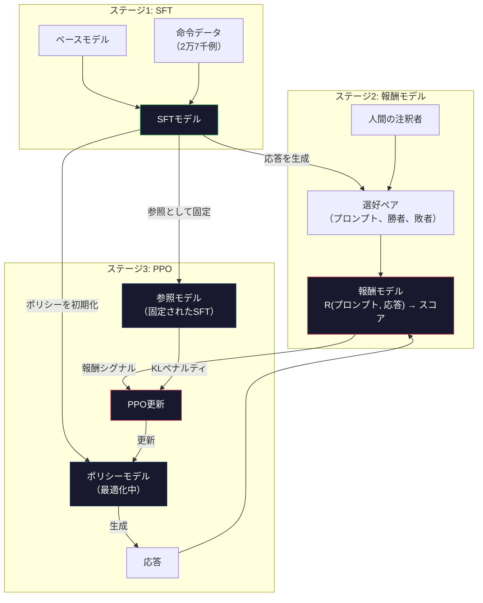
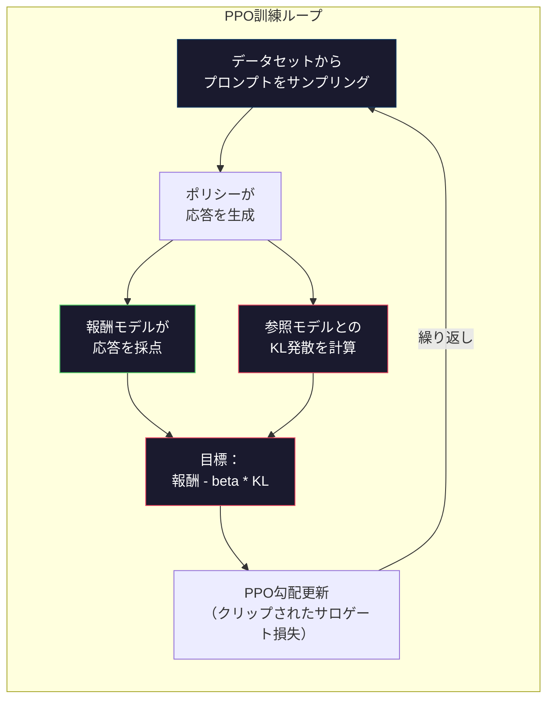

# RLHF：報酬モデル＋PPO

> SFTはモデルに指示に従うことを教える。しかしどの応答が「より良い」かは教えない。文法的に正しく事実として正確な2つの答えは、有用性において大きく異なることがある。RLHFは人間の判断をモデルの行動にエンコードする方法だ。Claudeが有用でGPTが礼儀正しい理由はここにある。


## 学習目標

- 人間の選好ペア（選択/拒否）から応答品質を採点する報酬モデルを構築する
- KLペナルティを持つ報酬モデルに対して言語モデルポリシーを最適化するPPO訓練ループを実装する
- RLHFが3つのモデル（SFT・報酬・ポリシー）を必要とする理由とKL制約が報酬ハッキングを防ぐ仕組みを説明する
- 選好最適化の前後で応答品質を比較してRLHFの効果を評価する

## 問題

「量子コンピューティングを説明してください」とモデルに問うと、次のような答えが返ってくるかもしれない。

**応答A：**「量子コンピューティングは、0・1・またはその両方に同時に存在できる重ね合わせ状態のキュービットを使う。これにより量子コンピュータは特定の計算を古典コンピュータよりも指数関数的に速く処理できる。主なアルゴリズムには、大きな数の素因数分解のためのShorのアルゴリズムと、未整列データベース検索のためのGroverのアルゴリズムがある。」

**応答B：**「量子コンピューティングは量子力学的現象を使うコンピューティングの一種だ。1980年代に最初に提案された。リチャード・ファインマンが量子システムは量子コンピュータでシミュレートできると示唆した。それ以来この分野は大きく成長した。多くの企業が現在量子コンピュータに取り組んでいる。IBM、Google、その他が進歩を遂げた。量子超越性はGoogleが2019年に主張した。」

両方の応答は事実として正確だ。両方とも文法的に正しい。両方とも指示に従っている。しかし応答Aは明らかに優れている。より簡潔で、より情報量が多く、より良く構成されている。人間なら毎回Aを選ぶだろう。

SFTはこの区別を捉えられない。「正しい」応答で訓練するが、「この応答はあれより良い」と言うメカニズムを持たない。すべての訓練例を等しく扱う。もしAとBの両方がSFTデータセットに現れたら、モデルは両方から等しく学習する。

RLHFはこれを解決する。人間がどちらの応答を好むかを予測する報酬モデルを訓練し、その報酬シグナルを使って言語モデルをより高品質な出力に向けて押し進める。InstructGPT（ChatGPTの前身）はRLHFを使ってGPT-3の有用性、真実性、無害性を劇的に改善した。OpenAIの内部評価者はInstructGPTの出力をGPT-3の出力より85%の確率で好んだ――InstructGPTが135倍小さい（1.3B対175Bパラメータ）にもかかわらず。

## 概念

### 3つのステージ

RLHFは単一の訓練ランではない。3つの連続したステージからなるパイプラインで、各ステージが前のものの上に構築される。

**ステージ1: SFT。** ベースモデルを命令-応答ペアで訓練する（レッスン06）。指示に従えるが、どの応答が他より優れているかを知らないモデルができる。

**ステージ2: 報酬モデル。** 人間の選好データを収集する：注釈者に同じプロンプトへの2つの応答を見せて「どちらが良いか？」を尋ねる。これらの選好を予測するモデルを訓練する。報酬モデルは（プロンプト、応答）を入力として受け取り、スカラースコアを出力する。

**ステージ3: PPO。** 報酬モデルを使って言語モデルの訓練シグナルを生成する。言語モデルが応答を生成し、報酬モデルがそれを採点し、PPOが言語モデルを更新してより高いスコアの応答を生成するようにする。KL発散ペナルティは言語モデルがSFTチェックポイントから大きく離れるのを防ぐ。



### 報酬モデル

報酬モデルは採点器として再利用された言語モデルだ。SFTモデルを取り、語彙サイズの出力ヘッド（語彙全体の分布を出力する）をスカラーヘッド（単一の数値を出力する）に置き換える。アーキテクチャは最終層まで同一だ。

入力：プロンプトと応答を連結したもの。出力：単一のスカラー報酬スコア。

訓練データは人間の選好ペアだ。各プロンプトについて、注釈者は2つの応答を見てより良いものを選ぶ。これにより訓練トリプルが作成される：（プロンプト、選好応答、拒否応答）。

損失関数はBradley-Terryモデルのペアワイズ選好を使う：

```
loss = -log(sigmoid(reward(preferred) - reward(rejected)))
```

これが重要な方程式だ。`sigmoid(reward(A) - reward(B))`は応答AがBより好まれる確率を与える。損失は報酬モデルに選好応答により高いスコアを割り当てるよう押し付ける。

なぜペアワイズ比較を使うのか？人間は絶対品質スコアの割り当てが非常に苦手だからだ（「この応答は10点満点で7.3か7.5か？」）が、相対的な比較は非常に得意だ（「AとBどちらが良いか？」）。Bradley-Terryモデルは相対的な比較を一貫した絶対採点システムに変換する。

**InstructGPTの数字：** OpenAIは40名の契約者から3万3千の比較ペアを収集した。各比較は約5分かかった。これは報酬モデル訓練データのために2,750時間の人間の労働だ。

### PPO：近似方策最適化

PPOは強化学習アルゴリズムだ。RLHFでは、「環境」が報酬モデル、「エージェント」が言語モデル、「行動」がトークンを生成することだ。

目標：

```
maximize: E[R(prompt, response)] - beta * KL(policy || reference)
```

最初の項はモデルに高報酬の応答を生成するよう押し付ける。2番目の項（KL発散ペナルティ）はモデルがSFTチェックポイントから大きく逸脱するのを防ぐ。

なぜKLペナルティが必要か？なしでは、モデルは退化した解を見つける。報酬モデルは有限な人間選好データセットで訓練されており、盲点を持っている。言語モデルはその盲点を悪用する――報酬モデルでは高くスコアされるが実際には無意味な出力を見つける。典型的な例：

- 「私はとても役立つし無害だ！」を繰り返すことが有用性/無害性報酬モデルで高くスコアされる
- 冗長で形式的に聞こえるが空虚な応答を生成して「高品質」にパターンマッチングする
- 訓練データで高い報酬と相関していた特定のフレーズを悪用する

KLペナルティが言う：改善はできるが、完全に別のモデルにはなれない。すでに合理的だったSFTバージョンに近くいなさい。あまりに離れるとKLコストが報酬を支配する。

**InstructGPTの数字：** PPO訓練はlr=1.5e-5、KL係数beta=0.02、25万6千エピソード（プロンプト-応答ペア）、バッチあたり4つのPPOエポックを使用した。RLHFパイプライン全体でGPUクラスタ上で数日かかった。



### PPO目標の詳細

PPOは過度に大きな更新を防ぐために「クリップされたサロゲート目標」を使う。新旧ポリシーの確率の比率は[1 - epsilon, 1 + epsilon]の範囲にクリップされる（epsilonは通常0.2）。

```
ratio = pi_new(action | state) / pi_old(action | state)
clipped_ratio = clip(ratio, 1 - epsilon, 1 + epsilon)
loss = -min(ratio * advantage, clipped_ratio * advantage)
```

アドバンテージ関数は現在の応答が予想品質と比較してどれだけ良いかを推定する。RLHFでは：

```
advantage = reward(prompt, response) - baseline
```

ベースラインは最近の応答の平均報酬だ。正のアドバンテージは応答が平均より良かったことを意味し、負は悪かったことを意味する。PPOは平均以上の応答の確率を増加させ、平均以下の確率を減少させる。

クリッピングは壊滅的な更新を防ぐ。単一の応答が異常に高い報酬を受け取ると、クリップされていない比率は非常に大きくなり、モデルがその応答に向かって劇的にシフトする可能性がある。クリッピングは更新を制限して訓練の安定性を維持する。

### 報酬ハッキング

RLHFの暗い側面。言語モデルは報酬モデルに対して最適化しており、それは人間の選好の不完全な代理だ。言語モデルが報酬を最大化するのが上手くなると、報酬モデルの弱点を悪用し始める。

よくある失敗パターン：

| 失敗 | 何が起きるか | なぜ |
|------|-------------|------|
| 冗長性 | モデルがどんどん長い応答を生成する | 人間の注釈者はしばしば長くより詳細な応答を好んだため、報酬モデルは長さに高いスコアを割り当てる |
| 迎合主義 | モデルがユーザーの言うことすべてに同意する | 注釈者は質問の前提に同意する応答を好んだ |
| ヘッジング | モデルが答えにコミットするのを拒否する | ヘッジングされた応答（「これは多くの視点を持つ複雑なトピックです...」）は間違っているとマークされることがほとんどない |
| フォーマットのゲーム化 | モデルが過度に箇条書きと見出しを使う | フォーマットされた応答は注釈者にとってより「洗練された」に見えた |

緩和策：より強いKLペナルティ（弱点を悪用するほどモデルが離れるのを防ぐ）、敵対的な例での報酬モデルの訓練（既知の失敗モードをパッチする）、異なるアーキテクチャの複数の報酬モデルを使う（同時にすべてをハッキングするのが難しい）。

### 実際のRLHFパイプライン

| モデル | 比較ペア | 注釈者 | RMサイズ | PPOステップ | KL係数 |
|--------|----------|--------|---------|------------|--------|
| InstructGPT | 3.3万 | 40 | 6B | 25.6万 | 0.02 |
| Llama 2 Chat | 約100万 | 非公開 | 70B | 非公開 | 0.01 |
| Claude | 非公開 | 非公開 | 非公開 | 非公開 | 非公開 |
| Anthropic RLHFペーパー | 2.2万 | 20 | 52B | 5万 | 0.001 |

Anthropicの2022年論文は2万2千の比較で52Bの報酬モデルを訓練した。大きな報酬モデルはより信頼性の高いシグナルを生成し、PPO訓練をより安定させる。小さな報酬モデルを使って大きな言語モデルを訓練するのはリスクがある――報酬モデルに良い応答と悪い応答のニュアンスを捉えるのに十分な容量がない。

## 実装する

### ステップ1: 合成選好データ

本番では人間の注釈者が選好データを作成する。「選好」応答が客観的に優れている（より簡潔、より正確、より有用）合成ペアを作成する。

```python
import numpy as np

PREFERENCE_DATA = [
    {
        "prompt": "What is the capital of France?",
        "preferred": "The capital of France is Paris.",
        "rejected": "France is a country in Europe. It has many cities. The capital is Paris. Paris is known for the Eiffel Tower.",
    },
    {
        "prompt": "Explain gravity in one sentence.",
        "preferred": "Gravity is the force that attracts objects with mass toward each other.",
        "rejected": "Gravity is something that makes things fall down when you drop them.",
    },
    {
        "prompt": "What is 15 times 7?",
        "preferred": "15 times 7 is 105.",
        "rejected": "Let me think about this. 15 times 7. Well, 10 times 7 is 70, and 5 times 7 is 35, so the answer might be around 105.",
    },
    {
        "prompt": "Name three programming languages.",
        "preferred": "Python, Rust, and TypeScript.",
        "rejected": "There are many programming languages. Some popular ones include various languages like Python and others.",
    },
    {
        "prompt": "What year did World War II end?",
        "preferred": "World War II ended in 1945.",
        "rejected": "World War II was a major global conflict. It involved many countries. The war ended in the mid-1940s, specifically in 1945.",
    },
    {
        "prompt": "Define machine learning.",
        "preferred": "Machine learning is a field where algorithms learn patterns from data to make predictions without being explicitly programmed.",
        "rejected": "Machine learning is a type of AI. AI stands for artificial intelligence. Machine learning uses data to learn.",
    },
]
```

選好応答は簡潔で直接的だ。拒否応答は一般的な失敗パターンを示している：不必要な埋め草、ヘッジング、冗長な説明、不正確さ。これはSFTが捉えられないがRLHFが捉えられる正確な区別だ。

### ステップ2: 報酬モデルアーキテクチャ

報酬モデルはミニGPTのトランスフォーマーアーキテクチャを再利用するが、語彙サイズの出力ヘッドをスカラー射影に置き換える。

```python
import sys
import os
sys.path.insert(0, os.path.join(os.path.dirname(__file__), "..", "..", "04-pre-training-mini-gpt", "code"))
from main import MiniGPT, LayerNorm, Embedding, TransformerBlock


class RewardModel:
    def __init__(self, vocab_size=256, embed_dim=128, num_heads=4,
                 num_layers=4, max_seq_len=128, ff_dim=512):
        self.embedding = Embedding(vocab_size, embed_dim, max_seq_len)
        self.blocks = [
            TransformerBlock(embed_dim, num_heads, ff_dim)
            for _ in range(num_layers)
        ]
        self.ln_f = LayerNorm(embed_dim)
        self.reward_head = np.random.randn(embed_dim) * 0.02

    def forward(self, token_ids):
        seq_len = token_ids.shape[-1]
        mask = np.triu(np.full((seq_len, seq_len), -1e9), k=1)

        x = self.embedding.forward(token_ids)
        for block in self.blocks:
            x = block.forward(x, mask)
        x = self.ln_f.forward(x)

        last_hidden = x[:, -1, :]
        reward = last_hidden @ self.reward_head

        return reward
```

報酬モデルは*最後の*トークン位置の隠れ状態を取り、スカラーに射影する。なぜ最後のトークンか？因果アテンションマスクにより、最後の位置はすべての前のトークンにアテンションを向けていたからだ。（プロンプト、応答）シーケンス全体の最も完全な表現を持っている。

### ステップ3: Bradley-Terry損失

選好ペアでBradley-Terryペアワイズ損失を使って報酬モデルを訓練する。

```python
def tokenize_for_reward(prompt, response, vocab_size=256):
    prompt_tokens = [min(t, vocab_size - 1) for t in list(prompt.encode("utf-8"))]
    response_tokens = [min(t, vocab_size - 1) for t in list(response.encode("utf-8"))]
    return prompt_tokens + [0] + response_tokens


def sigmoid(x):
    return np.where(
        x >= 0,
        1.0 / (1.0 + np.exp(-x)),
        np.exp(x) / (1.0 + np.exp(x))
    )


def bradley_terry_loss(reward_preferred, reward_rejected):
    diff = reward_preferred - reward_rejected
    loss = -np.log(sigmoid(diff) + 1e-8)
    return loss


def train_reward_model(rm, preference_data, num_epochs=10, lr=1e-4, max_seq_len=128):
    print(f"報酬モデルの訓練: {len(preference_data)}選好ペア、{num_epochs}エポック")
    print()

    losses = []
    accuracies = []

    for epoch in range(num_epochs):
        epoch_loss = 0.0
        epoch_correct = 0
        num_pairs = 0

        indices = np.random.permutation(len(preference_data))

        for idx in indices:
            pair = preference_data[idx]

            preferred_tokens = tokenize_for_reward(pair["prompt"], pair["preferred"])
            rejected_tokens = tokenize_for_reward(pair["prompt"], pair["rejected"])

            preferred_tokens = preferred_tokens[:max_seq_len]
            rejected_tokens = rejected_tokens[:max_seq_len]

            preferred_ids = np.array(preferred_tokens).reshape(1, -1)
            rejected_ids = np.array(rejected_tokens).reshape(1, -1)

            r_preferred = rm.forward(preferred_ids)[0]
            r_rejected = rm.forward(rejected_ids)[0]

            loss = bradley_terry_loss(r_preferred, r_rejected)

            if r_preferred > r_rejected:
                epoch_correct += 1

            diff = r_preferred - r_rejected
            grad = sigmoid(diff) - 1.0

            rm.reward_head -= lr * grad * rm.ln_f.forward(
                rm.embedding.forward(preferred_ids)
            )[:, -1, :].flatten()

            epoch_loss += loss
            num_pairs += 1

        avg_loss = epoch_loss / max(num_pairs, 1)
        accuracy = epoch_correct / max(num_pairs, 1)
        losses.append(avg_loss)
        accuracies.append(accuracy)

        if epoch % 2 == 0:
            print(f"  エポック {epoch + 1:3d} | 損失: {avg_loss:.4f} | 精度: {accuracy:.1%}")

    return rm, losses, accuracies
```

精度メトリクスは単純だ：報酬モデルは選好ペアの何割を正しくランク付けするか？ランダムモデルは50%をスコアする。きれいなデータでよく訓練された報酬モデルは70%を超えるはずだ。InstructGPTの報酬モデルはホールドアウト比較で約72%の精度を達成した。低く聞こえるが実は良い――多くの選好ペアは人間にとっても曖昧だ（注釈者間合意率は約73%）。

### ステップ4: 簡略化されたPPOループ

完全なPPOは複雑だ。この実装はコアメカニズムを捉えている：応答を生成し、採点し、アドバンテージを計算し、KLペナルティでポリシーを更新する。

```python
def compute_kl_divergence(policy_logits, reference_logits):
    policy_probs = np.exp(policy_logits - policy_logits.max(axis=-1, keepdims=True))
    policy_probs = policy_probs / policy_probs.sum(axis=-1, keepdims=True)
    policy_probs = np.clip(policy_probs, 1e-10, 1.0)

    ref_probs = np.exp(reference_logits - reference_logits.max(axis=-1, keepdims=True))
    ref_probs = ref_probs / ref_probs.sum(axis=-1, keepdims=True)
    ref_probs = np.clip(ref_probs, 1e-10, 1.0)

    kl = np.sum(policy_probs * np.log(policy_probs / ref_probs), axis=-1)
    return kl.mean()


def generate_response(model, prompt_tokens, max_new_tokens=30, temperature=0.8, max_seq_len=128):
    tokens = list(prompt_tokens)

    for _ in range(max_new_tokens):
        context = np.array(tokens[-max_seq_len:]).reshape(1, -1)
        logits = model.forward(context)
        next_logits = logits[0, -1, :]

        next_logits = next_logits / max(temperature, 1e-8)
        probs = np.exp(next_logits - next_logits.max())
        probs = probs / probs.sum()
        probs = np.clip(probs, 1e-10, 1.0)
        probs = probs / probs.sum()

        next_token = np.random.choice(len(probs), p=probs)
        tokens.append(int(next_token))

    return tokens


def ppo_training(policy_model, reference_model, reward_model, prompts,
                 num_episodes=20, lr=1.5e-5, kl_coeff=0.02, max_seq_len=128):
    print(f"PPO訓練: {num_episodes}エピソード、lr={lr}、KL係数={kl_coeff}")
    print()

    rewards_history = []
    kl_history = []

    for episode in range(num_episodes):
        prompt_text = prompts[episode % len(prompts)]
        prompt_tokens = [min(t, 252) for t in list(prompt_text.encode("utf-8"))]

        response_tokens = generate_response(
            policy_model, prompt_tokens,
            max_new_tokens=20, temperature=0.8, max_seq_len=max_seq_len
        )

        response_ids = np.array(response_tokens[:max_seq_len]).reshape(1, -1)
        reward = reward_model.forward(response_ids)[0]

        policy_logits = policy_model.forward(response_ids)
        ref_logits = reference_model.forward(response_ids)
        kl = compute_kl_divergence(policy_logits, ref_logits)

        total_reward = reward - kl_coeff * kl

        rewards_history.append(float(reward))
        kl_history.append(float(kl))

        for block in policy_model.blocks:
            update_scale = lr * total_reward
            block.ffn.W1 += update_scale * np.random.randn(*block.ffn.W1.shape) * 0.01
            block.ffn.W2 += update_scale * np.random.randn(*block.ffn.W2.shape) * 0.01

        if episode % 5 == 0:
            avg_reward = np.mean(rewards_history[-5:]) if rewards_history else 0
            avg_kl = np.mean(kl_history[-5:]) if kl_history else 0
            print(f"  エピソード {episode:3d} | 報酬: {reward:.4f} | KL: {kl:.4f} | "
                  f"平均報酬: {avg_reward:.4f}")

    return policy_model, rewards_history, kl_history
```

コアループ：(1)プロンプトをサンプリング、(2)応答を生成、(3)報酬モデルで採点、(4)固定参照に対するKL発散を計算、(5)調整された報酬（報酬マイナスKLペナルティ）を計算、(6)ポリシーを更新。KLペナルティはポリシーが参照から乖離するにつれて大きくなり、自動的に報酬ハッキングを防ぐ。

### ステップ5: 報酬スコアの比較

RLHF後、ポリシーモデルの応答は元のSFTモデルの応答より報酬モデルで高くスコアされるべきだ。

```python
def compare_models(sft_model, rlhf_model, reward_model, prompts, max_seq_len=128):
    print("モデル比較（報酬スコア）")
    print("-" * 60)
    print(f"  {'プロンプト':<35} {'SFT':>10} {'RLHF':>10}")
    print("  " + "-" * 55)

    sft_total = 0.0
    rlhf_total = 0.0

    for prompt in prompts:
        prompt_tokens = [min(t, 252) for t in list(prompt.encode("utf-8"))]

        sft_response = generate_response(
            sft_model, prompt_tokens,
            max_new_tokens=20, temperature=0.6, max_seq_len=max_seq_len
        )
        rlhf_response = generate_response(
            rlhf_model, prompt_tokens,
            max_new_tokens=20, temperature=0.6, max_seq_len=max_seq_len
        )

        sft_ids = np.array(sft_response[:max_seq_len]).reshape(1, -1)
        rlhf_ids = np.array(rlhf_response[:max_seq_len]).reshape(1, -1)

        sft_reward = reward_model.forward(sft_ids)[0]
        rlhf_reward = reward_model.forward(rlhf_ids)[0]

        sft_total += sft_reward
        rlhf_total += rlhf_reward

        truncated_prompt = prompt[:33] + ".." if len(prompt) > 35 else prompt
        print(f"  {truncated_prompt:<35} {sft_reward:>10.4f} {rlhf_reward:>10.4f}")

    n = len(prompts)
    print("  " + "-" * 55)
    print(f"  {'平均':<35} {sft_total/n:>10.4f} {rlhf_total/n:>10.4f}")

    return sft_total / n, rlhf_total / n
```

## 使ってみる

### 完全なRLHFパイプラインのデモ

```python
if __name__ == "__main__":
    np.random.seed(42)

    print("=" * 70)
    print("RLHFパイプライン: 報酬モデル + PPO")
    print("=" * 70)
    print()

    print("ステージ1: SFTモデル（レッスン06から）")
    print("-" * 40)
    sft_model = MiniGPT(
        vocab_size=256, embed_dim=128, num_heads=4,
        num_layers=4, max_seq_len=128, ff_dim=512
    )
    print(f"  パラメータ: {sft_model.count_parameters():,}")
    print()

    print("ステージ2: 報酬モデルの訓練")
    print("-" * 40)
    rm = RewardModel(
        vocab_size=256, embed_dim=128, num_heads=4,
        num_layers=4, max_seq_len=128, ff_dim=512
    )

    rm, rm_losses, rm_accuracies = train_reward_model(rm, PREFERENCE_DATA, num_epochs=10, lr=1e-4)
    print()

    print("報酬モデルの評価:")
    print("-" * 40)
    correct = 0
    for pair in PREFERENCE_DATA:
        pref_tokens = tokenize_for_reward(pair["prompt"], pair["preferred"])[:128]
        rej_tokens = tokenize_for_reward(pair["prompt"], pair["rejected"])[:128]

        r_pref = rm.forward(np.array(pref_tokens).reshape(1, -1))[0]
        r_rej = rm.forward(np.array(rej_tokens).reshape(1, -1))[0]

        if r_pref > r_rej:
            correct += 1
        print(f"  選好: {r_pref:+.4f} | 拒否: {r_rej:+.4f} | {'正解' if r_pref > r_rej else '不正解'}")

    print(f"\n  精度: {correct}/{len(PREFERENCE_DATA)} = {correct/len(PREFERENCE_DATA):.1%}")
    print()

    print("ステージ3: PPO訓練")
    print("-" * 40)

    policy_model = MiniGPT(
        vocab_size=256, embed_dim=128, num_heads=4,
        num_layers=4, max_seq_len=128, ff_dim=512
    )
    reference_model = MiniGPT(
        vocab_size=256, embed_dim=128, num_heads=4,
        num_layers=4, max_seq_len=128, ff_dim=512
    )

    copy_model_weights(sft_model, policy_model)
    copy_model_weights(sft_model, reference_model)

    train_prompts = [pair["prompt"] for pair in PREFERENCE_DATA]

    policy_model, rewards, kls = ppo_training(
        policy_model, reference_model, rm,
        train_prompts, num_episodes=20, lr=1.5e-5, kl_coeff=0.02
    )
```

## 成果物を出す

このレッスンでは `outputs/prompt-reward-model-designer.md` を作成する――報酬モデル訓練パイプラインの設計を助けるプロンプトだ。対象動作（有用性、コーディング能力、安全性）を与えると、データ収集プロトコル、注釈者ガイドライン、報酬モデル評価基準を生成する。

## 演習

1. 報酬モデルを最後の位置だけでなく全ての隠れ状態の平均を使うように修正する。精度を比較する。平均プーリングアプローチはすべてのトークンに等しい重みを与え、最後の位置アプローチは因果アテンションに情報集約を依存する。6つの選好ペアでテストしてどのアプローチが高い精度をスコアするかを報告する。

2. 報酬モデルの較正を実装する。訓練後、すべての選好ペアを報酬モデルに通して（a）選好応答の平均報酬、（b）拒否応答の平均報酬、（c）マージン（選好マイナス拒否）を計算する。よく較正されたモデルは明確なマージンを持つべきだ。次に4つの新しい選好ペアを追加して、マージンが未見データで保持されるかを確認する。

3. 報酬ハッキングをシミュレートする。長い応答に高いスコアを与える報酬モデルを作成する（reward = len(response) / 100）。この欠陥のある報酬モデルでPPOを実行し、ポリシーモデルがどんどん長く繰り返しの多い出力を生成するのを観察する。次にKLペナルティ0.1を追加して退化した動作を防ぐことを示す。

4. マルチ目標報酬を実装する。2つの報酬モデルを訓練する――有用性用と簡潔性用。R = 0.7 * R_helpful + 0.3 * R_conciseとして組み合わせる。組み合わせた目標が有用かつ簡潔な応答を生成し、単一の有用性報酬の冗長性トラップを避けることを示す。

5. 異なるKL係数を比較する。beta=0.001（低すぎる、報酬ハッキング）、beta=0.02（標準）、beta=0.5（高すぎる、学習なし）でPPOを実行する。それぞれの報酬曲線とKL曲線をプロットする。beta=0.02の実行は制限されたKLで安定した報酬改善を示すべきだ。

## キーワード

| 用語 | 一般的な説明 | 実際の意味 |
|------|-------------|-----------|
| RLHF | 「人間のフィードバックで訓練する」 | 人間フィードバックからの強化学習：言語モデルの出力を人間選好シグナルで最適化する3ステージパイプライン（SFT・報酬モデル・PPO） |
| 報酬モデル | 「応答を採点するモデル」 | スカラー出力ヘッドを持つトランスフォーマー。Bradley-Terry損失を使ったペアワイズな人間選好で訓練 |
| Bradley-Terry | 「比較モデル」 | P(A > B) = sigmoid(score(A) - score(B))の確率モデル。ペアワイズ選好を一貫した採点関数に変換 |
| PPO | 「RLアルゴリズム」 | 近似方策最適化：不安定さを防ぐために更新の大きさをクリップしながらポリシーを更新して報酬を最大化 |
| KL発散 | 「2つの分布がどれだけ異なるか」 | ポリシーモデルのトークン分布と参照モデルとの差の測定値――報酬ハッキングを防ぐためのペナルティとして使用 |
| KLペナルティ | 「モデルのリード」 | 報酬シグナルから差し引かれるbeta * KL(policy \|\| reference)――SFTチェックポイントからポリシーが大きく乖離するのを防ぐ |
| 報酬ハッキング | 「報酬をゲーム化する」 | 実際に改善せずに報酬モデルの弱点を悪用して退化した高報酬の出力を見つけるポリシー |
| 選好ペア | 「AとB、どちらが良いか？」 | （プロンプト、選好応答、拒否応答）からなる訓練例――RLHFの訓練データの基本単位 |
| 参照モデル | 「固定されたSFTチェックポイント」 | 重みが変わらないSFTモデルのコピー――KL発散計算のアンカーとして使用 |

## 参考資料

- [Ouyang et al., 2022 -- "Training language models to follow instructions with human feedback"（InstructGPT）](https://arxiv.org/abs/2203.02155) -- 大規模言語モデルでRLHFを実用的にした論文
- [Schulman et al., 2017 -- "Proximal Policy Optimization Algorithms"](https://arxiv.org/abs/1707.06347) -- OpenAIによるオリジナルPPO論文
- [Bai et al., 2022 -- "Training a Helpful and Harmless Assistant with Reinforcement Learning from Human Feedback"](https://arxiv.org/abs/2204.05862) -- 報酬ハッキングとKLペナルティの詳細分析を含むAnthropicのRLHF論文
- [Stiennon et al., 2020 -- "Learning to summarize with human feedback"](https://arxiv.org/abs/2009.01325) -- 要約に適用されたRLHF。報酬モデルが微妙な品質判断を捉えられることを示す
- [Christiano et al., 2017 -- "Deep reinforcement learning from human preferences"](https://arxiv.org/abs/1706.03741) -- 人間の比較から報酬関数を学習する基礎的な研究
