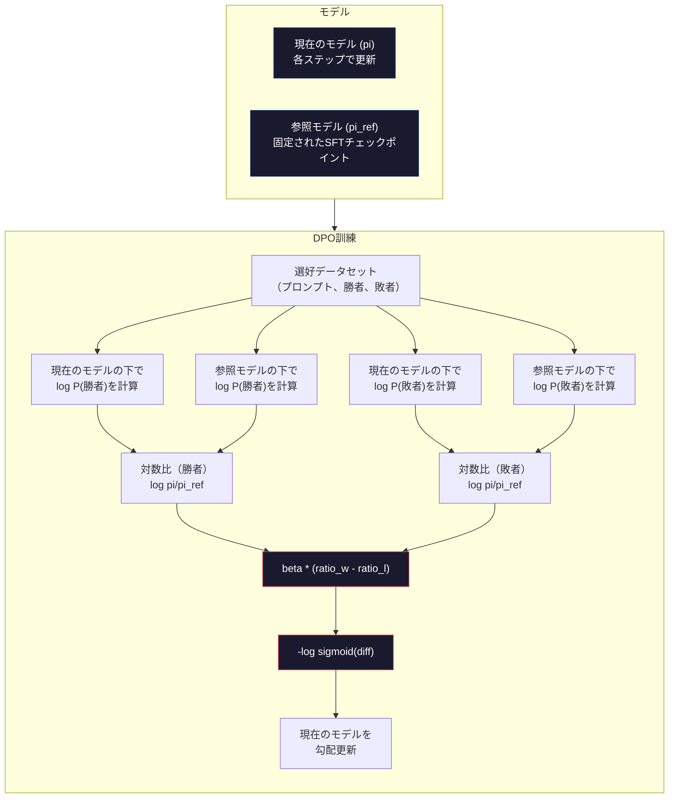

# DPO：直接選好最適化

> RLHFは機能する。しかし3つのモデル（SFT・報酬モデル・ポリシー）の訓練、PPOの不安定さの管理、KLペナルティの調整も必要だ。DPOが問いかける：それらすべてをスキップできたらどうか？DPOは選好ペアで言語モデルを直接最適化する。報酬モデルなし。PPOなし。1つの訓練ループ。同じ結果。


## 学習目標

- 別個の報酬モデルなしで選好ペアを直接最適化するDPO訓練を実装する
- DPO損失関数を導出し、それがポリシーの対数確率を通じて暗黙的に報酬モデルを表現する方法を説明する
- 訓練安定性・計算コスト・必要モデル数の観点でDPOとRLHFを比較する
- betaパラメータを調整して訓練済みポリシーが参照モデルからどの程度乖離するかを制御する

## 問題

レッスン07でRLHFパイプラインを構築した。3つのステージ。3つのモデル。SFTモデル、報酬モデル、PPOで最適化したポリシーモデル。報酬モデルだけで数千の人間選好ペアと別個の訓練ループが必要だった。PPOはKL係数、学習率、クリップ比率、エポック数の注意深い調整が必要だった。

実際にはPPO訓練は悪名高いほど不安定だ。ハイパーパラメータの小さな変化で訓練が発散する。報酬モデルは人間の選好の不完全な代理であり、ポリシーはその弱点を悪用する方法を見つける。KLペナルティは助けになるが独自の調整が必要だ――低すぎると報酬ハッキング、高すぎるとほとんど学習しない。

この複雑さが、InstructGPT発表後何年もオープンソースモデルがRLHFに苦労した理由だ。3ステージパイプラインは脆弱だ。各ステージが独自の失敗モードを持ち、エラーが複合する。

2023年5月、スタンフォードのRafael Rafailov、Archit Sharmaらが「Direct Preference Optimization: Your Language Model is Secretly a Reward Model」を発表した。重要な洞察：別個の報酬モデルは必要ない。最適な報酬関数は言語モデル自身のトークン確率によって数学的に決定される。報酬モデルを完全にスキップして言語モデルを選好ペアで直接最適化できる。

DPOはRLHFを単一の教師あり学習ステップに削減する。1つのモデル。1つの損失関数。1つの訓練ループ。強化学習なし。大規模にDPOを使用した最初のモデルの1つであるZephyr-7Bは、いくつかのベンチマークで完全なRLHFで訓練されたモデルと同等か上回った。MetaはLlama 3のアライメントパイプラインの一部としてDPOを使用した。AnthropicはアライメントリサーチでDPOスタイルの手法を引用している。

## 概念

### 重要な洞察

RLHFはこの目標を最適化する：

```
maximize: E[R(x, y)] - beta * KL(pi || pi_ref)
```

ここでRは報酬モデル、piはポリシー、pi_refは参照モデル、betaはKL係数だ。

DPO論文はこの目標が閉形式の最適解を持つことを示した。任意の報酬関数Rに対して、最適ポリシーは：

```
pi*(y | x) = pi_ref(y | x) * exp(R(x, y) / beta) / Z(x)
```

Z(x)は正規化定数。並べ替えると：

```
R(x, y) = beta * log(pi*(y | x) / pi_ref(y | x)) + beta * log Z(x)
```

これがブレイクスルーだ。報酬はポリシーモデルの確率と参照モデルの確率のみで表現される。別個の報酬モデルを訓練する必要がない。報酬は確率比に*暗黙的に*含まれている。

これをBradley-Terry選好モデルに代入すると：

```
P(y_w > y_l | x) = sigmoid(R(x, y_w) - R(x, y_l))
                  = sigmoid(beta * (log pi(y_w|x)/pi_ref(y_w|x) - log pi(y_l|x)/pi_ref(y_l|x)))
```

Z(x)項は両方の応答が同じプロンプトxを条件とするのでキャンセルされる。残るのはポリシーモデルの対数確率と参照モデルの選好・拒否応答への対数確率だけだ。

### DPO損失

```
L_DPO = -log(sigmoid(beta * (log pi(y_w|x)/pi_ref(y_w|x) - log pi(y_l|x)/pi_ref(y_l|x))))
```

各ピースを解説しよう：

- **y_w** = 選好（勝利）応答
- **y_l** = 拒否（敗北）応答
- **x** = プロンプト
- **pi** = 現在のモデル（訓練中）
- **pi_ref** = 参照モデル（固定されたSFTチェックポイント）
- **beta** = 参照からの逸脱を制御する温度パラメータ（通常0.1〜0.5）

`log pi(y|x) / pi_ref(y|x)`という比率が対数確率比だ。この比率が正の場合、現在のモデルは参照より応答yに高い確率を割り当てている。負の場合、より低い確率を割り当てている。

DPO損失はモデルに選好応答の対数確率比を増加させ、拒否応答の対数確率比を減少させるよう押し付ける。betaパラメータは参照からどれだけ積極的に逸脱できるかを制御する――小さいbetaは大きな逸脱を許可し、大きいbetaはモデルを参照に近く保つ。



### なぜDPOの方がシンプルか

| 側面 | RLHF（PPO） | DPO |
|------|-----------|-----|
| 訓練するモデル数 | 3（SFT + 報酬 + ポリシー） | 1（ポリシーのみ） |
| 訓練ループ | 3（SFT・RM訓練・PPO） | 2（SFT・DPO） |
| ハイパーパラメータ | lr・KL係数・クリップ比率・RM lr・エポック×3 | lr・beta・エポック |
| 報酬モデル | 必要（別個の訓練） | モデル確率に暗黙的 |
| RLアルゴリズム | PPO（複雑、不安定） | 教師あり学習（安定） |
| GPUメモリ | PPO中に3〜4モデルをメモリに | 2モデル（現在 + 参照） |
| 訓練安定性 | ハイパーパラメータに敏感 | SFTに似て堅牢 |

DPOは訓練中に2つのモデルをメモリに必要とする――現在のモデルと固定参照。RLHFは3〜4つ必要だ：ポリシー、参照、報酬モデル、オプションで価値関数ベースライン。70Bモデルでは各コピーはFP16で140GBを取る。報酬モデルを除去することによるメモリ節約は実質的だ。

### DPOがRLHFを上回る場合

**小さなデータセット。** 5,000〜2万の選好ペアで、DPOはしばしばRLHFと同等か超える。RLHFの報酬モデルは汎化するのに十分なデータが必要だ――限られたデータでは過学習して信頼性のない報酬シグナルを生成する。DPOは報酬モデルを全く必要としないため、この問題を回避する。

**限られた計算リソース。** DPOは完全なRLHFの約3分の1の計算を必要とする（3ループの代わりに1ループ）。大きなGPUクラスタがないチームにとって、これが実用的な選択だ。

**迅速な反復。** どのデータセットが最良のモデルを生成するかを確認するために10種類の選好データセットを試したいか？DPOで各実験を数時間で実行できる。RLHFは各データセットごとに報酬モデルを再訓練する必要がある。

### RLHFがDPOを上回る場合

**大規模訓練。** GPT-4やClaudeの規模では、RLHFの別個の報酬モデルはより微妙な選好シグナルを捉えられる。報酬モデルは複雑な品質基準に適応する学習済み損失関数として機能する。

**複雑な報酬シグナル。** 「より良い」が複数の次元（有用性・無害性・誠実性）を含む場合、報酬モデルはこのマルチ目標トレードオフを学習できる。DPOは各選好ペアをバイナリシグナルとして扱う――一方が優れており、一方が劣っている――理由をモデル化せずに。

**反復的アライメント。** RLHFパイプラインは現在のポリシーで新しい応答を生成し、人間にそれを評価させ、報酬モデルをオンラインループで再訓練できる。DPOは固定の選好ペアのデータセットで機能する。Constitutional AI（Anthropicのアプローチ）はRLHFのこの反復特性を広く使用する。

### DPOを超えて：KTO・ORPO・SimPO

DPOは簡略化されたアライメント手法の一族を触発した。

**KTO（Kahneman-Tversky Optimization、2024）：** ペアさえ不要だ。KTOはペアなしのフィードバックで機能する――代替と比較せずに各応答に「良い」または「悪い」とラベルを付けるだけ。これによりデータ収集が劇的に簡素化される。注釈者に2つの応答を見せて「どちらが良いか？」を尋ねる代わりに、1つの応答を見せて「これは良いか？」を尋ねるだけだ。損失関数は見込み理論の損失回避を適用する：悪い応答は良い応答が報酬を受けるよりも多くペナルティを受ける。

**ORPO（Odds Ratio Preference Optimization、2024）：** SFTとアライメントを単一の訓練ステップに組み合わせる。SFTを最初に行い、次にDPOを行う代わりに、ORPOはSFT損失を変更して選好シグナルを含める。損失は2つの項を持つ：選好応答での標準的な次トークン予測損失、プラス選好と拒否応答の確率間のギャップを増加させるオッズ比項。別個のSFTステージの代わりに1つの訓練ループ。

**SimPO（Simple Preference Optimization、2024）：** 参照モデルを完全に排除する。固定参照に対する対数確率比を計算する代わりに、SimPOは暗黙的な報酬として応答の平均対数確率（長さで正規化）を使う。これにより（参照モデルが不要で）メモリが節約され、訓練が簡素化される。長さの正規化は、モデルが短い応答を好むのを防ぐ。

| 手法 | 年 | メモリ内モデル数 | ペアが必要？ | 参照が必要？ | 訓練ループ数 |
|------|----|-----------------|-----------|-----------|-----------| 
| RLHF | 2022 | 3〜4 | 必要（RM用） | 必要 | 3 |
| DPO | 2023 | 2 | 必要 | 必要 | 2 |
| KTO | 2024 | 2 | 不要（ペアなし） | 必要 | 2 |
| ORPO | 2024 | 1 | 必要 | 不要 | 1 |
| SimPO | 2024 | 1 | 必要 | 不要 | 1 |

トレンドは明確だ：各手法が複雑さをもう1つ排除している。RLHFは報酬モデルとPPOが必要だった。DPOは両方を排除した。KTOはペアデータを排除した。ORPOは別個のSFTステージを排除した。SimPOは参照モデルを排除した。アライメント税――ベースモデルからアライメント済みモデルへの計算と複雑さのコスト――は下がり続けている。

### 実際のDPOデプロイ

**Zephyr-7B（HuggingFace、2023年10月）：** Mistral 7Bベース、UltraChat（20万例）でSFT、次にUltraFeedback（6万選好ペア）でDPO。MT-Benchで6.47をスコア――当時最高の7Bモデル。比較として、Llama 2 Chat 70Bは6.86をスコア。つまりZephyrはDPOアライメントのみを使って10倍大きなモデルの6%以内を達成した。

**Llama 3（Meta、2024年4月）：** 初期のRLHFステージの後にDPOを使用。この組み合わせはDPOとRLHFが補完的であることを示唆する――幅広いアライメントにRLHF、特定の改善にDPO。

## 実装する

### ステップ1: 選好データセット

RLHFと同じフォーマット――（プロンプト、選好、拒否）トリプル。DPOはこのデータを中間の報酬モデルなしに直接消費する。

```python
import numpy as np
import sys
import os
sys.path.insert(0, os.path.join(os.path.dirname(__file__), "..", "..", "04-pre-training-mini-gpt", "code"))
from main import MiniGPT, LayerNorm, Embedding, TransformerBlock

PREFERENCE_DATA = [
    {
        "prompt": "What is the capital of France?",
        "preferred": "The capital of France is Paris.",
        "rejected": "France is a country in Europe. It has many cities. The capital is Paris. Paris is known for the Eiffel Tower.",
    },
    {
        "prompt": "Explain gravity in one sentence.",
        "preferred": "Gravity is the force that attracts objects with mass toward each other.",
        "rejected": "Gravity is something that makes things fall down when you drop them.",
    },
    {
        "prompt": "What is 15 times 7?",
        "preferred": "15 times 7 is 105.",
        "rejected": "Let me think about this. 15 times 7. Well, 10 times 7 is 70, and 5 times 7 is 35, so the answer might be around 105.",
    },
    {
        "prompt": "Name three programming languages.",
        "preferred": "Python, Rust, and TypeScript.",
        "rejected": "There are many programming languages. Some popular ones include various languages like Python and others.",
    },
    {
        "prompt": "What year did World War II end?",
        "preferred": "World War II ended in 1945.",
        "rejected": "World War II was a major global conflict. It involved many countries. The war ended in the mid-1940s, specifically in 1945.",
    },
    {
        "prompt": "Define machine learning.",
        "preferred": "Machine learning is a field where algorithms learn patterns from data to make predictions without being explicitly programmed.",
        "rejected": "Machine learning is a type of AI. AI stands for artificial intelligence. Machine learning uses data to learn.",
    },
]
```

### ステップ2: シーケンス対数確率

DPO損失はプロンプトが与えられた応答の総対数確率を計算する必要がある。これは完全な（プロンプト + 応答）シーケンスでモデルを実行し、各応答トークンの対数確率を合計することを意味する。

```python
def tokenize_sequence(text, vocab_size=256):
    return [min(t, vocab_size - 1) for t in list(text.encode("utf-8"))]


def compute_sequence_log_prob(model, prompt_tokens, response_tokens, max_seq_len=128):
    full_sequence = prompt_tokens + response_tokens
    if len(full_sequence) > max_seq_len:
        full_sequence = full_sequence[:max_seq_len]

    if len(full_sequence) < 2:
        return 0.0

    input_ids = np.array(full_sequence[:-1]).reshape(1, -1)
    target_ids = np.array(full_sequence[1:])

    logits = model.forward(input_ids)
    logits = logits[0]

    max_logits = logits.max(axis=-1, keepdims=True)
    log_probs = logits - max_logits - np.log(
        np.exp(logits - max_logits).sum(axis=-1, keepdims=True)
    )

    prompt_len = len(prompt_tokens)
    response_start = max(0, prompt_len - 1)
    response_end = len(target_ids)

    if response_start >= response_end:
        return 0.0

    response_log_probs = log_probs[response_start:response_end, :]
    response_targets = target_ids[response_start:response_end]

    total_log_prob = 0.0
    for i, target in enumerate(response_targets):
        total_log_prob += response_log_probs[i, target]

    return total_log_prob
```

この関数はDPOの主力だ。各選好ペアに対して4回実行される：選好応答でのモデル、拒否応答でのモデル、選好応答での参照、拒否応答での参照。RLHFの生成 + 報酬採点 + 価値推定 + PPO更新と比較して4回のフォワードパス。よりシンプルで、より速く、より安定している。

### ステップ3: DPO損失

論文のコアをコードで。1つの関数。1つの損失。報酬モデルなし。

```python
def sigmoid(x):
    return np.where(
        x >= 0,
        1.0 / (1.0 + np.exp(-x)),
        np.exp(x) / (1.0 + np.exp(x))
    )


def dpo_loss(policy_logprob_preferred, policy_logprob_rejected,
             ref_logprob_preferred, ref_logprob_rejected, beta=0.1):
    preferred_ratio = policy_logprob_preferred - ref_logprob_preferred
    rejected_ratio = policy_logprob_rejected - ref_logprob_rejected

    logit = beta * (preferred_ratio - rejected_ratio)

    loss = -np.log(sigmoid(logit) + 1e-8)

    preferred_reward = beta * preferred_ratio
    rejected_reward = beta * rejected_ratio

    return loss, {
        "preferred_ratio": float(preferred_ratio),
        "rejected_ratio": float(rejected_ratio),
        "logit": float(logit),
        "implicit_preferred_reward": float(preferred_reward),
        "implicit_rejected_reward": float(rejected_reward),
        "reward_margin": float(preferred_reward - rejected_reward),
    }
```

`preferred_ratio`と`rejected_ratio`はDPO導出からの対数確率比だ。現在のモデルが選好応答により高い確率を割り当て（参照と比較して）、拒否応答により低い確率を割り当てると、ロジットは正で損失は低くなる。訓練シグナルはモデルをまさにこの方向に押し付ける。

`implicit_preferred_reward`と`implicit_rejected_reward`はDPO損失が暗黙的に割り当てる報酬だ。訓練が機能しているかを確認するためにそれらを抽出できる――選好と拒否報酬のマージンは訓練全体で増加するはずだ。

### ステップ4: DPO訓練ループ

標準的な教師あり訓練ループ。PPOなし。報酬モデルなし。フォワードパスと勾配更新だけ。

```python
def dpo_train(policy_model, reference_model, preference_data,
              num_epochs=5, lr=5e-6, beta=0.1, max_seq_len=128):
    print(f"DPO訓練: {len(preference_data)}ペア、{num_epochs}エポック、"
          f"lr={lr}、beta={beta}")
    print()

    losses = []
    margins = []

    for epoch in range(num_epochs):
        epoch_loss = 0.0
        epoch_margin = 0.0
        num_examples = 0

        indices = np.random.permutation(len(preference_data))

        for idx in indices:
            pair = preference_data[idx]

            prompt_tokens = tokenize_sequence(pair["prompt"])
            preferred_tokens = tokenize_sequence(pair["preferred"])
            rejected_tokens = tokenize_sequence(pair["rejected"])

            pi_logprob_w = compute_sequence_log_prob(
                policy_model, prompt_tokens, preferred_tokens, max_seq_len
            )
            pi_logprob_l = compute_sequence_log_prob(
                policy_model, prompt_tokens, rejected_tokens, max_seq_len
            )
            ref_logprob_w = compute_sequence_log_prob(
                reference_model, prompt_tokens, preferred_tokens, max_seq_len
            )
            ref_logprob_l = compute_sequence_log_prob(
                reference_model, prompt_tokens, rejected_tokens, max_seq_len
            )

            loss, metrics = dpo_loss(
                pi_logprob_w, pi_logprob_l,
                ref_logprob_w, ref_logprob_l, beta
            )

            update_direction = 1.0 if metrics["logit"] < 0 else -0.1
            for block in policy_model.blocks:
                block.ffn.W1 += lr * update_direction * np.random.randn(*block.ffn.W1.shape) * 0.01
                block.ffn.W2 += lr * update_direction * np.random.randn(*block.ffn.W2.shape) * 0.01

            epoch_loss += loss
            epoch_margin += metrics["reward_margin"]
            num_examples += 1
            losses.append(float(loss))
            margins.append(metrics["reward_margin"])

        avg_loss = epoch_loss / max(num_examples, 1)
        avg_margin = epoch_margin / max(num_examples, 1)

        print(f"  エポック {epoch + 1}/{num_epochs} | 損失: {avg_loss:.4f} | "
              f"平均マージン: {avg_margin:.4f}")

    return policy_model, losses, margins
```

訓練ループはRLHFと比べて爽やかにシンプルだ。各選好ペアに対して：4つの対数確率を計算（2つのモデル、2つの応答）、DPO損失に代入、勾配を計算、ポリシーを更新。生成ステップなし。報酬モデル推論なし。アドバンテージ推定なし。クリッピングなし。

## 使ってみる

### 完全なDPOパイプラインのデモ

```python
if __name__ == "__main__":
    np.random.seed(42)

    print("=" * 70)
    print("DPO: 直接選好最適化")
    print("=" * 70)
    print()

    print("ステップ1: SFTモデルを初期化（レッスン06から）")
    print("-" * 50)
    sft_model = MiniGPT(
        vocab_size=256, embed_dim=128, num_heads=4,
        num_layers=4, max_seq_len=128, ff_dim=512
    )
    print(f"  パラメータ: {sft_model.count_parameters():,}")
    print()

    print("ステップ2: DPO訓練")
    print("-" * 50)

    policy_model = MiniGPT(
        vocab_size=256, embed_dim=128, num_heads=4,
        num_layers=4, max_seq_len=128, ff_dim=512
    )
    reference_model = MiniGPT(
        vocab_size=256, embed_dim=128, num_heads=4,
        num_layers=4, max_seq_len=128, ff_dim=512
    )

    policy_model, losses, margins = dpo_train(
        policy_model, reference_model, PREFERENCE_DATA,
        num_epochs=5, lr=5e-6, beta=0.1
    )
    print()

    print("DPO vs RLHFの比較:")
    print("  DPOの利点:")
    print("    - 1つの訓練ループ（RLHFの3つに対して）")
    print("    - メモリに2つのモデル（RLHFの3〜4つに対して）")
    print("    - 教師あり学習（RLよりも安定）")
    print("    - 訓練・維持する報酬モデルなし")
    print()
    print("  RLHFの利点:")
    print("    - 別個の報酬モデルが複雑な選好を捉える")
    print("    - オンライン学習：生成、評価、再訓練")
    print("    - マルチ目標アライメントに優れる")
    print("    - 最大規模で実証済み（GPT-4、Claude）")
```

## 成果物を出す

このレッスンでは `outputs/prompt-alignment-method-selector.md` を作成する――ユースケースに適したアライメント手法（SFT・RLHF・DPO・KTO・ORPO・SimPO）を選択するプロンプト。データの利用可能性、計算予算、アライメント目標を与えると、手法と訓練計画を推奨する。

## 演習

1. KTO（Kahneman-Tversky Optimization）を実装する。KTOはペアが不要――各応答を「良い」または「悪い」とラベルするだけ。良い応答の損失は `-log(sigmoid(beta * log_ratio))` で、悪い応答は `-log(1 - sigmoid(beta * log_ratio))` に損失回避乗数（通常1.5倍）を掛ける。同じデータで訓練（選好を「良い」として、拒否を「悪い」として独立して扱う）してDPOに対する精度を比較する。

2. 長さ正規化DPOを実装する。生の対数確率の代わりに、応答トークン数で割る：`normalized_logprob = total_logprob / num_tokens`。これによりモデルが（総対数確率が高い）短い応答を好むのを防ぐ。正規化ありとなしで暗黙的報酬マージンを比較する。

3. ORPOスタイルの組み合わせ損失を構築する。DPO損失に選好応答での標準的な次トークン予測損失を追加する：`L = L_sft(preferred) + alpha * L_dpo`。alpha値0.1、0.5、1.0を試す。組み合わせた損失は指示に従い（SFT項から）、より良い応答を好む（DPO項から）モデルを生成し、別個のSFTステージの必要性を排除するはずだ。

4. 反復的DPOを実装する。3エポックDPOを実行し、次に訓練済みモデルから新しい応答を生成し、それらを元の選好応答と新しい選好ペアとしてペアにし、DPOを再度実行する。この「自己プレイ」プロセスの2ラウンド。ラウンド1後とラウンド2後の選好精度を比較して反復改善が役立つかを確認する。

5. 異なる参照モデルでDPOを比較する。SFTチェックポイントを参照として使う代わりに、（a）ベースモデル（SFT前）、（b）DPOのエポック1からのチェックポイント、（c）ポリシーモデルの指数移動平均を試す。どの参照が最高の選好精度と最も安定した訓練曲線を生成するかを報告する。

## キーワード

| 用語 | 一般的な説明 | 実際の意味 |
|------|-------------|-----------|
| DPO | 「RLなしのRLHF」 | 直接選好最適化：報酬モデルとPPOをバイパスして選好ペアで言語モデルを直接最適化する教師あり学習アルゴリズム |
| 暗黙的報酬 | 「報酬はモデルの中にある」 | 報酬関数はポリシーと参照モデルの対数確率比によって決まる――別個の報酬モデルは不要 |
| beta（DPO） | 「温度」 | ポリシーが参照モデルからどの程度逸脱できるかを制御する――小さいbetaは大きな逸脱を許可し、大きいbetaはモデルを近くに保つ |
| 対数確率比 | 「モデルがどれだけ変わったか」 | log pi(y\|x) - log pi_ref(y\|x) ――正はモデルが参照より高い確率を割り当てることを意味する |
| 参照モデル | 「固定チェックポイント」 | 重みが変わらないSFTモデルのコピー――確率比計算のアンカーとして機能 |
| KTO | 「ペアなしのDPO」 | Kahneman-Tversky Optimization：選好ペアを必要とせずペアなしの「良い」または「悪い」ラベルで機能 |
| ORPO | 「ワンステップアライメント」 | Odds Ratio Preference Optimization：SFT損失に選好項を追加することでSFTとアライメントを単一の訓練ループに組み合わせる |
| SimPO | 「参照不要」 | Simple Preference Optimization：暗黙的報酬として長さ正規化された平均対数確率を使うことで参照モデルを排除する |
| アライメント税 | 「モデルを安全にするコスト」 | ベースモデルからアライメント済みモデルへの追加計算・データ・複雑さ――DPOはこれを大幅に削減する |

## 参考資料

- [Rafailov et al., 2023 -- "Direct Preference Optimization: Your Language Model is Secretly a Reward Model"](https://arxiv.org/abs/2305.18290) -- RLHFから教師あり学習にアライメントを簡素化したDPO論文
- [Tunstall et al., 2023 -- "Zephyr: Direct Distillation of LM Alignment"](https://arxiv.org/abs/2310.16944) -- Zephyr-7B。UltraFeedbackでのDPOがベンチマークでRLHFに匹敵することを示す
- [Ethayarajh et al., 2024 -- "KTO: Model Alignment as Prospect Theoretic Optimization"](https://arxiv.org/abs/2402.01306) -- ペアの選好の必要性を排除
- [Hong et al., 2024 -- "ORPO: Monolithic Preference Optimization without Reference Model"](https://arxiv.org/abs/2403.07691) -- SFTとアライメントをワンステップに組み合わせる
- [Meng et al., 2024 -- "SimPO: Simple Preference Optimization with a Reference-Free Reward"](https://arxiv.org/abs/2405.14734) -- 参照モデルを完全に排除
- [Llama 3 Technical Report](https://arxiv.org/abs/2407.21783) -- RLHFとDPOを組み合わせたMetaのアライメントパイプライン
