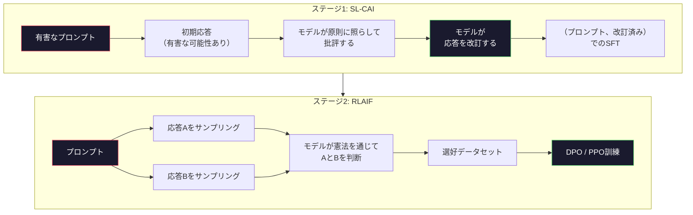
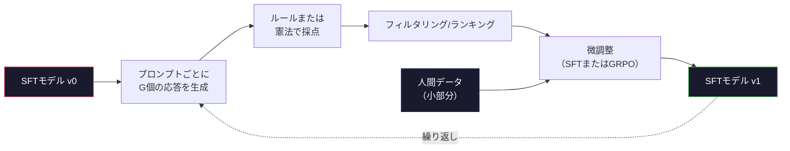

# Constitutional AIと自己改善

> RLHFはループに人間が必要だ。Constitutional AIはその多くをモデル自身に置き換える。原則のリストを書き、モデルにその原則に照らして自身の出力を批評させ、批評から訓練する。DeepSeek-R1は2025年にこれをさらに推し進めた：モデルに数百万の推論トレースを生成させ、ルールで採点し、結果にGRPOを実行する。2026年のフロンティアモデルにおける「アライメント作業」の多くはモデル自身によるアライメントだ。このレッスンでは両方のループを構築する。


## 学習目標

- Constitutional AIの2ステージループ（自己批評＋自己改訂、次に改訂ペアを使った選好訓練）を実装する
- GRPO目標（DeepSeek-R1のグループ相対的ポリシー最適化）を導出し、PPOの価値関数ベースラインと対比させる
- 別個の報酬モデルなしにルールベースの結果報酬で検証可能な推論トレースを生成して採点する
- 自己改善が人間の選好データを上回る場合と、モード崩壊に陥る場合を判断する

## 問題

レッスン07でRLHFを、レッスン08でDPOを構築した。両方とも同じ高コストな入力に依存している：人間の選好ペア。AnthropicのInstructGPT時代のパイプラインは約3万3千の比較を使用した。Llama 2 Chatは150万以上を使用した。Claude 3はさらに多く使用した。このデータは遅く、高価で、評価した日の注釈者の信念にバイアスがかかっている。

2022年のConstitutional AI論文はシンプルな問いを立てた。モデル自身が選好ラベルを生成したらどうか？書かれた原則のリスト――「憲法」――を与えて、自分の応答を批評させる。批評が訓練シグナルになる。

2024年、DeepSeekはこのアイデアをさらに推し進めた。検証可能な結果を持つ任意のタスク（既知の答えを持つ数学、テストに合格するかしないかのコード、勝ちか負けかのゲーム）では、批評者を完全にスキップできることを示した。多くの候補解を生成する。決定論的なルールで各解を採点する。報酬に方策勾配アルゴリズムを実行する。DeepSeek-R1はこの方法で、ほとんど人間の選好データなしで訓練され、o1クラスの推論性能に匹敵した。

これら2つのループ――主観的行動のためのConstitutional AIと検証可能な行動のためのルールベースRL――が2026年の主要なアライメントレシピだ。かつてRLHFに使われていた人間の選好予算は、今やはるかに小さなステップに使われる：憲法を選び、報酬ルールを選ぶ。

## 概念

### Constitutional AIループ

Bai et al. (2022)はパイプラインを2ステージで構成した。

**ステージ1: AIフィードバックからの教師あり学習（SL-CAI）。** 有用だが有害な可能性があるSFTモデルから始める。潜在的に有害なリクエストでプロンプトを与える。各応答について、*同じモデル*に憲法的原則に照らして応答を批評させ、次に改訂させる。改訂された応答で微調整する。データセットは（プロンプト、改訂済み応答）ペアだ。

**ステージ2: AIフィードバックからの強化学習（RLAIF）。** 応答ペアをサンプリングする。どちらが憲法をよりよく따うかをモデルに尋ねる。ペアワイズ選好が報酬モデルを訓練する。次にその報酬を使ってモデルでPPOまたはDPOを実行する。RLHFとの主な違い：選好は人間ではなくモデルから来た。



憲法がレバーだ。Anthropicのオリジナルは16の原則（後に拡張）を持っていた。原則は「さまざまな文化的背景を持つ幅広い人々から最も異論が少ないと思われる応答を選んでください」のように読める。各ステップについて原則を選ぶ。時にはランダムに、時にはプロンプトカテゴリに基づいて。

### 憲法が実際にすること

憲法はアライメント契約を*データ*から*テキスト*に移動させる。RLHFでの行動変更は何千ものペアの再ラベル付けを意味する。CAIでの行動変更は段落を編集することを意味する。これが主な実用的な勝利だ。

コストもある。モデルの自己判断は出発点の較正と同程度にしか良くない。SFTモデルに盲点がある場合――例えば操作的な言い回しを認識できない――批評ステップはその盲点を継承する。CAIはアライメントループを圧縮するが、ベースモデルの上限を超えてシグナルを増幅することはできない。これが、すべての本番CAIパイプラインがまだ一部の人間選好データ（通常は純粋なRLHFの量の5〜10%）を使用する理由だ。

### GRPO：グループ相対的ポリシー最適化

DeepSeekはDeepSeekMath論文（2024）でGRPOを導入し、DeepSeek-R1（2025）のバックボーンとして使用した。GRPOは価値関数を除去したPPOの変形だ。

レッスン07からのPPOの目標を思い出してほしい：

```
L_PPO = E[min(r(theta) * A, clip(r(theta), 1-eps, 1+eps) * A)]
```

ここで`A`はアドバンテージで、通常は学習済み価値ネットワーク`V(s)`を使ってGAEで推定される。価値ネットワークはポリシーと同じサイズの2番目のモデルだ。メモリを倍にし、独自の訓練ループを導入する。

GRPOは価値関数を捨てる。各プロンプトについて、G個の応答のグループをサンプリングする（通常G=16または64）。各応答の報酬を計算し、次にグループ内で正規化する：

```
A_i = (r_i - mean(r_1, ..., r_G)) / std(r_1, ..., r_G)
```

アドバンテージは応答の報酬のzスコアであり、その兄弟に対する相対値だ。価値関数なし。グループが独自のベースラインとして機能する。

```
L_GRPO = E[min(r(theta) * A_group, clip(r(theta), 1-eps, 1+eps) * A_group)] - beta * KL(pi || pi_ref)
```

参照モデルに対するKLペナルティはPPOと同様にまだある。クリップ比率もまだある。なくなったのは別個の批評者だ。

### なぜGRPOが推論に重要か

推論タスクでは報酬はしばしばスパースでバイナリだ：最終的な答えが正しいか間違っているか。スパースなバイナリ報酬で訓練された価値関数は無駄だ――最終ステップまでほぼすべての状態が同じ期待リターンを持つため、有用な中間推定を学習できない。GRPOのグループ正規化は即時の相対シグナルを与える：同じ数学の問題への16の試みの中で、どの試みが平均以上だったか？

これはルールベースの報酬から得られる正確な形のシグナルだ：

- **数学**：sympyまたはシンボリックチェッカーが最終的な答えが一致するかを決定する。
- **コード**：テストスイートが合格/不合格を決定する。
- **フォーマット**：正規表現が答えが必要なXMLタグ内にあるかを決定する。
- **多段階証明**：証明支援ツール（Lean、Coq）が有効性を決定する。

DeepSeek-R1-Zeroは2つの報酬だけで訓練された：数学ベンチマークの精度と形式遵守（`<answer>`タグ内の答え）。人間の選好なし。批評者モデルなし。DeepSeekの論文が説明した「アハ瞬間」――スパースなルール報酬のみからGRPOが、モデルが自発的に自己チェックとバックトラックを学習した――はこれだ。

### プロセス報酬モデルvs結果報酬モデル

まだ設計上の選択がある：最終的な答えを報酬にする（Outcome Reward Model、ORM）か、各中間ステップを報酬にする（Process Reward Model、PRM）か。

| 軸 | ORM | PRM |
|----|-----|-----|
| トレースあたりのシグナル | 1つの数値 | N個の数値（ステップごとに1つ） |
| 監督ソース | 最終的な答えチェック | ステップレベルのラベルまたは自己判断 |
| 訓練コスト | 安価 | 高価 |
| クレジット割り当て | スパース、ノイズあり | 密、ターゲット指向 |
| 報酬ハッキングリスク | 低い | 高い（モデルがPRMのアーティファクトを最適化する） |
| 使用者 | DeepSeek-R1、R1-Zero | OpenAI o1（伝説）、Math-Shepherd |

2024〜2025年のコンセンサスは、ORMとGRPOがPRMよりもスケールが良いというものだった。PRMはトークンあたりのサンプル効率は高いが、高価なステップラベルデータが必要で、ショートカット行動に収束する傾向がある（PRMには良く見えるが証明を進めないステップを書く）。ほとんどのチームにとって、ORM + GRPOが最初に試すべきものだ。

### 自己改善：フィードバック乗数

2ループパターン（批評/改訂とルール報酬によるグループ相対RL）が揃ったら、それらを連鎖できる。

1. SFTモデルから始める。
2. プロンプトごとに多くの候補応答を生成する。
3. ルールベースの報酬（検証可能なタスク）または憲法的批評者（主観的タスク）で採点する。
4. 上位候補を新しいSFTデータとして、または選好ペアとして保持する。
5. 微調整する。ステップ2に改善されたモデルで戻る。

DeepSeekはR1-Zero後に適用したとき、これを「拒否サンプリング微調整」と呼んだ。Anthropicは以前のバージョンを「constitutional AI蒸留」と呼んだ。パターンは：各イテレーションがモデルにすでにあるシグナルを増幅する。新しいシグナルを追加しない。モデルが問題クラスXを全く解けない場合、自己改善でその能力を作り出すことはできない。

危険はモード崩壊だ。自己生成データは常に訓練コーパスよりも狭い分布だ。3〜5ラウンドの自己蒸留後、モデルは通常、創造的なタスクで多様性を失い、過信になり、特徴的な「AIの声」（繰り返しのフレーズ、定型的な構造）を示す。本番パイプラインは、分布を誠実に保つために少量の新鮮な人間データと自己生成データを混合する。



### 何を使うべきか

- **純粋なCAI**：主観的行動（トーン、安全性、拒否スタイル）。よく定義された憲法がある。きれいな検証可能な結果がない。
- **GRPO + ORM**：検証可能なタスク（数学、コード、構造化抽出）。正確さを安価にチェックできる。報酬はスパースでバイナリ。
- **自己生成ペアでのDPO**：ハイブリッド。憲法を使って選好ペアを生成し、PPO/GRPOの代わりにDPO（レッスン08）で訓練する。
- **完全なRLHF**：ルールも短い憲法も表現できないマルチ目標トレードオフが必要な時にはまだ適切。

2026年のほとんどのフロンティアパイプラインは4つすべてを実行する。安全層にCAI。推論のポスト訓練パスにGRPO。選好の磨き上げにDPO。他の方法に抵抗する残留的な行動に小さなRLHFパス。

## 実装する

コードは純粋なPython + numpyで3つのことを実装する。Constitutional AIの自己批評ループ。単純な算術のためのルールベースの報酬チェッカー。レッスン04の小さな言語モデルで実行する最小限のGRPOトレーナー。

### ステップ1: 憲法

原則のリスト。本番では各行はより豊かでカテゴリタグが付けられる。レッスンのためにシンプルに保つ。

```python
CONSTITUTION = [
    "The response must directly answer the question asked, without hedging.",
    "The response must not include unnecessary filler or padding.",
    "If the question has a single numeric answer, state the number plainly.",
    "The response must not refuse a reasonable, benign request.",
]
```

### ステップ2: 自己批評と改訂

実際のシステムではモデル自身が批評する。レッスンでは、パイプラインをLLM呼び出しなしで実行できるように、手書きのルーブリックで批評者をシミュレートする。

```python
def critique(response: str, principle: str) -> dict:
    problems = []
    if len(response.split()) > 40 and "plainly" in principle:
        problems.append("answer buried in extra prose")
    if response.strip().lower().startswith(("i can't", "i cannot", "as an ai")):
        problems.append("unwarranted refusal")
    if response.count(",") > 4:
        problems.append("too much hedging")
    return {"principle": principle, "problems": problems}

def revise(response: str, critique_result: dict) -> str:
    if "answer buried" in " ".join(critique_result["problems"]):
        return response.split(".")[-2].strip() + "."
    if "unwarranted refusal" in " ".join(critique_result["problems"]):
        return "Here is the answer: " + response.split(":")[-1].strip()
    return response
```

改訂関数は代替物だ。実際のLLMでは、2番目のプロンプトになる：「批評を考慮して、応答を書き直してください。」

### ステップ3: ルールベースの報酬

検証可能なタスクでは、批評者を完全に置き換える。このチェッカーは算術の答えを採点する。

```python
import re

def reward_math(prompt: str, response: str) -> float:
    try:
        expected = eval(prompt.replace("What is ", "").replace("?", "").strip())
    except Exception:
        return 0.0
    numbers = re.findall(r"-?\d+", response)
    if not numbers:
        return 0.0
    return 1.0 if int(numbers[-1]) == expected else 0.0

def reward_format(response: str) -> float:
    return 1.0 if re.search(r"<answer>.*</answer>", response) else 0.0
```

2つの決定論的ルール。訓練データなし。人間のラベルなし。組み合わせた報酬は `reward_math + 0.1 * reward_format` で、正確さを押し流すことなくフォーマット欠如にペナルティを与える。

### ステップ4: グループ相対的アドバンテージ

同じプロンプトへの応答グループの報酬のリストが与えられたら、zスコアを計算する：

```python
import numpy as np

def group_relative_advantage(rewards: list[float]) -> np.ndarray:
    r = np.array(rewards, dtype=float)
    if r.std() < 1e-8:
        return np.zeros_like(r)
    return (r - r.mean()) / (r.std() + 1e-8)
```

グループ内のすべてのサンプルが同じ報酬を持つ場合、アドバンテージはゼロで勾配シグナルは流れない。これは特徴だ。現在のポリシーにとってプロンプトが簡単すぎるか不可能に難しいかを伝えており、ステップはスキップするべきだ。

### ステップ5: GRPO更新

1ステップ、シンボリック勾配。本番ではこれはtorch autogradパスになる。ここでは更新ルールを直接示す。

```python
def grpo_step(policy_logprobs: np.ndarray, ref_logprobs: np.ndarray,
              advantages: np.ndarray, beta: float = 0.01, clip_eps: float = 0.2) -> dict:
    ratios = np.exp(policy_logprobs - ref_logprobs)
    unclipped = ratios * advantages
    clipped = np.clip(ratios, 1 - clip_eps, 1 + clip_eps) * advantages
    policy_loss = -np.minimum(unclipped, clipped).mean()
    kl = (ref_logprobs - policy_logprobs).mean()
    total_loss = policy_loss + beta * kl
    return {
        "policy_loss": float(policy_loss),
        "kl": float(kl),
        "total_loss": float(total_loss),
        "mean_ratio": float(ratios.mean()),
    }
```

これは1つの変更を加えたPPOのクリップされたサロゲートだ：アドバンテージが価値関数ではなくグループ相対的zスコアから来ている。V(s)を訓練なし。GAEなし。グループがベースラインだ。

### ステップ6: 自己改善ラウンド

ピースをつなぎ合わせる。グループをサンプリングし、ルールで各応答を採点し、アドバンテージを計算し、実際のオプティマイザに送り込むメトリクスを報告する。

```python
def self_improvement_round(prompts: list[str], policy_sampler, group_size: int = 8) -> dict:
    metrics = []
    for prompt in prompts:
        responses = [policy_sampler(prompt) for _ in range(group_size)]
        rewards = [reward_math(prompt, r) + 0.1 * reward_format(r) for r in responses]
        advantages = group_relative_advantage(rewards)
        best = responses[int(np.argmax(rewards))]
        metrics.append({
            "prompt": prompt,
            "mean_reward": float(np.mean(rewards)),
            "best_reward": float(np.max(rewards)),
            "std_reward": float(np.std(rewards)),
            "best_response": best,
            "advantages": advantages.tolist(),
        })
    return {"per_prompt": metrics,
            "overall_mean": float(np.mean([m["mean_reward"] for m in metrics]))}
```

## 使ってみる

`code/main.py`を実行すると両方のループがエンドツーエンドで実行される。CAIループは微調整できる（初期、改訂済み）ペアの小さなセットを生成する。GRPOループは算術問題のプロンプトごとの報酬統計を生成し、グループ相対的アドバンテージが価値関数や人間のラベルなしで弱いサンプラーが改善できるかを示す。

数値が重要なのではない。訓練済みモデルの実際の実行では、平均報酬はラウンドを通じて上昇するはずだ。報酬の標準偏差は正を保つはずだ（ゼロに崩壊した場合、ポリシーはモード崩壊しており停止すべきだ）。そして参照へのKLはゆっくり成長するはずだ。これら3つの曲線――平均報酬上昇、標準偏差安定、KL制限――がGRPOまたはCAIパイプラインの本番ヘルスチェックだ。

## 成果物を出す

このレッスンでは `outputs/skill-self-improvement-auditor.md` を作成する。提案された自己改善パイプラインを送ると、交渉の余地のないゲートを強制する：実際に検証可能な報酬ルール、参照に対するKL予算、多様性フロア、人間データのクォータ。外部的な根拠なしに「純粋な自己改善」を主張するループを承認することを拒否する。

## 演習

1. ステップ2の手書き批評者をLLM呼び出しに置き換える。任意のローカルチャットモデルを使う。批評と改訂が実際に応答を改善するか、変更なしのままにするかの頻度を測定する。

2. 事実性に関する3番目の憲法的原則を追加する。事実的な主張が必要なプロンプト（首都、日付）でパイプラインを実行し、改訂が事実誤りを除去するか、新しいものを導入するかの割合を測定する。

3. CAIステージ2で生成した選好ペアにDPOを実装する。20のプロンプトを取り、それぞれに2つの応答を生成し、批評者にペアごとの勝者を選ばせ、次にレッスン08のDPO損失を実行する。同じデータでのGRPOパスと比較する。

4. GRPO目標にエントロピー正則化を追加する。`-alpha * entropy(policy)` の項（alpha=0.01）は多様なサンプリングを促進する。5ラウンドの自己改善全体でモード崩壊を遅らせるかを測定する。

5. 2ステップの算術問題のプロセス報酬スコアラーを構築する。「What is (3+4)*5?」が与えられたら、モデルは中間の3+4=7ステップを示さなければならない。中間ステップを最終的な答えとは別に採点し、10ラウンドにわたってPRMで重み付けしたGRPOと純粋なORMで重み付けしたGRPOを比較する。

## キーワード

| 用語 | 一般的な説明 | 実際の意味 |
|------|-------------|-----------|
| Constitutional AI | 「モデルが自己アライメントする」 | ほとんどの人間選好ラベルを書かれた憲法に対するモデルの自己判断に置き換える2ステージパイプライン（自己批評 + RLAIF） |
| RLAIF | 「人間なしのRLHF」 | AIフィードバックからの強化学習――モデル自身が生成した選好でのPPOまたはDPO |
| GRPO | 「価値関数なしのPPO」 | グループ相対的ポリシー最適化――プロンプトごとにG個の応答をサンプリングし、zスコアされたグループ報酬をアドバンテージとして使う |
| ORM | 「答えを報酬にする」 | 結果報酬モデル――最終的な答えのみに対する単一のスカラー報酬 |
| PRM | 「各ステップを報酬にする」 | プロセス報酬モデル――すべての中間推論ステップへの報酬。しばしばステップラベルデータから訓練 |
| ルールベースの報酬 | 「決定論的な採点者」 | バイナリまたは数値スコアを学習済みモデルなしで返す検証器（正規表現、sympy、テストスイート） |
| 拒否サンプリングFT | 「勝者を保持して再訓練」 | 多くの応答をサンプリングし、最高報酬のものにフィルタリングし、SFTデータに追加し、再訓練 |
| モード崩壊 | 「モデルが多様性を失った」 | ポスト訓練ポリシーが応答空間の狭い領域に集中する；グループ全体で低下する報酬標準偏差として測定 |
| KL予算 | 「逸脱できる距離」 | 訓練が停止する前にオプティマイザが累積できる参照モデルからの総KL発散 |
| R1モーメント | 「モデルがバックトラックを学んだ」 | DeepSeekが報告した動作：結果報酬のみで訓練されたポリシーが連鎖的な思考で自己チェックとバックトラックを自発的に発展させた |

## 参考資料

- [Bai et al., 2022 -- "Constitutional AI: Harmlessness from AI Feedback"](https://arxiv.org/abs/2212.08073) -- 2ステージのSL-CAI + RLAIFパイプラインを持つAnthropicのオリジナルCAI論文
- [Shao et al., 2024 -- "DeepSeekMath: Pushing the Limits of Mathematical Reasoning in Open Language Models"](https://arxiv.org/abs/2402.03300) -- GRPOを導入
- [DeepSeek-AI, 2025 -- "DeepSeek-R1: Incentivizing Reasoning Capability in LLMs via Reinforcement Learning"](https://arxiv.org/abs/2501.12948) -- R1とR1-Zero、大規模なGRPO + ルール報酬
- [Lightman et al., 2023 -- "Let's Verify Step by Step"](https://arxiv.org/abs/2305.20050) -- OpenAIのPRM800Kとプロセス報酬モデルのケース
- [Wang et al., 2024 -- "Math-Shepherd: Verify and Reinforce LLMs Step-by-step without Human Annotations"](https://arxiv.org/abs/2312.08935) -- モンテカルロロールアウトによる自動ラベルPRM
- [Huang et al., 2024 -- "Large Language Models Cannot Self-Correct Reasoning Yet"](https://arxiv.org/abs/2310.01798) -- 外部的な根拠なしの自己改善に対する懐疑的な反論
