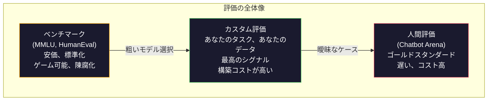
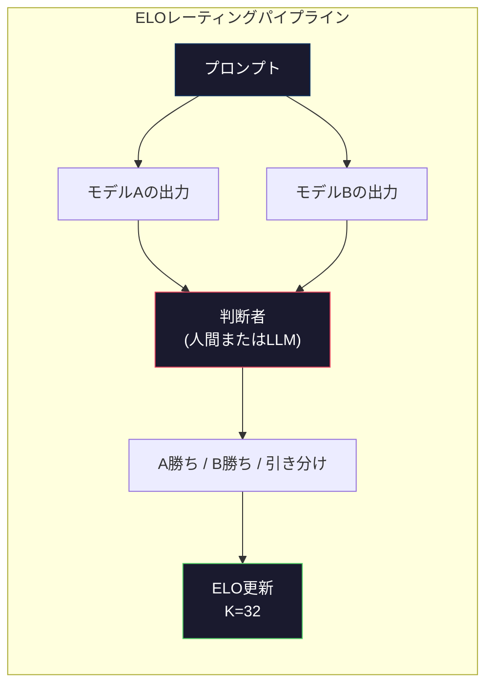

# 評価：ベンチマーク・評価ハーネス・LMハーネス

> グッドハートの法則：ある指標が目標になった途端、良い指標でなくなる。フロンティアラボはすべてベンチマークをゲームする。MMLUのスコアは上がる一方で、モデルは依然として「strawberry」の中のRの数を確実に数えられない。唯一重要な評価はあなた自身の評価だ――あなたのタスク、あなたのデータで。


## 学習目標

- 言語モデルに対して選択式問題と自由記述式ベンチマークを実行するカスタム評価ハーネスを構築する
- 標準的なベンチマーク（MMLU、HumanEval）が飽和してフロンティアモデルを差別化できなくなる理由を説明する
- タスク固有の評価を適切なメトリクスで実装する：完全一致、F1、BLEU、LLM-as-judgeスコアリング
- 公開リーダーボードに頼るだけでなく、特定のユースケースを対象としたカスタム評価スイートを設計する

## 問題

MMLUは2020年に57科目・15,908問で公開された。3年以内にフロンティアモデルが飽和させた。GPT-4は86.4%。Claude 3 Opusは86.8%。Llama 3 405Bは88.6%。リーダーボードは3ポイントの範囲に圧縮され、差異は統計的ノイズとなり実際の能力差を反映しなくなった。

一方、同じモデルが10歳の子供なら考えずにこなせるタスクで失敗する。MMLUで88.7%を記録したClaude 3.5 Sonnetは、当初「strawberry」の文字数を数えられなかった――世界知識も推論もゼロが必要で、文字レベルの反復さえできればいいタスクだ。HumanEvalは164問でコード生成をテストする。モデルは90%以上を記録しながら、新人開発者なら当然気づくエッジケースでクラッシュするコードを生成し続ける。

ベンチマーク性能と実世界での信頼性のギャップが、LLM評価の核心的な問題だ。ベンチマークはベンチマーク上のモデルのパフォーマンスを教えてくれる。特定のタスク、特定のデータ、特定の失敗モードでそのモデルがどう動くかはほとんど何も教えてくれない。カスタマーサポートボットを構築しているなら、MMLUは無関係だ。コードアシスタントを構築しているなら、HumanEvalは関数レベルの生成しかカバーしない――ファイル横断でのデバッグ、リファクタリング、コード説明については何も言わない。

カスタム評価が必要だ。ベンチマークが役に立たないからではない――粗いモデル選択には有用だ――最終評価は展開条件と完全に一致しなければならないからだ。

## 概念

### 評価の全体像

評価には3つのカテゴリがあり、それぞれコストとシグナル品質が異なる。

**ベンチマーク**は標準化されたテストスイートだ。MMLU、HumanEval、SWE-bench、MATH、ARC、HellaSwag。モデルをベンチマークに対して実行してスコアを得る。利点：全員が同じテストを使うので、モデルを比較できる。欠点：モデルと訓練データはますますこれらのベンチマークを汚染する。ラボはベンチマーク問題を含むデータで訓練する。スコアが上がる。能力は上がらないかもしれない。

**カスタム評価**は特定のユースケースのために構築するテストスイートだ。入力、期待される出力、スコアリング関数を定義する。法的文書要約器は法的文書で評価される。SQLジェネレータはデータベーススキーマで評価される。作成コストは高いが、本番パフォーマンスを予測する唯一の評価だ。

**人間評価**は有償の注釈者を使って、有用性、正確性、流暢さ、安全性などの基準でモデルの出力を判断する。自動採点が失敗するオープンエンドのタスクのゴールドスタンダード。Chatbot Arenaは100以上のモデルにわたって200万件以上の人間の選好投票を収集した。欠点：コスト（判断あたり$0.10-$2.00）とスピード（数時間から数日）。



### ベンチマークが壊れる理由

3つのメカニズムがベンチマークスコアを実際の能力から乖離させる。

**データ汚染。** 訓練コーパスはインターネットをスクレイピングする。ベンチマーク問題はインターネット上に存在する。モデルは訓練中に答えを見てしまう。従来の意味での不正ではない――ラボは意図的にベンチマークデータを含めるわけではない。しかしウェブスケールのスクレイピングでは除外することがほぼ不可能だ。

**テストに向けた訓練。** ラボはベンチマーク性能のために訓練ミックスを最適化する。訓練ミックスの5%がMMLUスタイルの選択式であれば、モデルはフォーマットと答えの分布を学ぶ。MMLUは4択だ。モデルは答えの分布がA/B/C/Dにほぼ均一であることを学び、答えを知らなくても役に立つ。

**飽和。** すべてのフロンティアモデルがベンチマークで85-90%を記録すると、ベンチマークは差別化を止める。残りの10-15%の問題は曖昧、誤ラベル、または難解なドメイン知識を必要とするものかもしれない。MMLUで87%から89%に改善することは、モデルがさらに2つの難解な問題を記憶したことを意味し、賢くなったことを意味しないかもしれない。

### パープレキシティ：クイックヘルスチェック

パープレキシティはモデルがトークンのシーケンスにどれだけ驚くかを測定する。形式的には、指数化した平均負の対数尤度だ：

```
PPL = exp(-1/N * sum(log P(token_i | context)))
```

パープレキシティが10であれば、モデルは平均して各トークン位置で10択から一様に選ぶのと同程度の不確かさを持っている。低いほど良い。GPT-2はWikiText-103で約30のパープレキシティを得る。GPT-3は約20。Llama 3 8Bは約7。

パープレキシティは同じテストセット上でモデルを比較するのに有用だが、盲点がある。一般的なパターンを予測するのが得意になることで低パープレキシティを達成できる一方、稀だが重要なパターンでひどい性能を示すことがある。命令追従、推論、事実的正確性についても何も言わない。最終判断としてではなく、健全性チェックとして使う。

### LLM-as-judge

強いモデルを使って弱いモデルの出力を評価する。アイデアはシンプルだ：GPT-4oまたはClaude Sonnetに応答を正確性、有用性、安全性について1-5のスケールで評価させる。GPT-4o-miniで判断あたり約$0.01のコストで、人間の判断と驚くほど高い相関――ほとんどのタスクで約80%の合意――を示す。

モデルよりもスコアリングプロンプトが重要だ。曖昧なプロンプト（「この応答を評価して」）はノイズの多いスコアを生成する。ルーブリック付きの構造化されたプロンプト（「答えが事実的に正確でソースを引用している場合は5、正確だがソースなしの場合は4、部分的に正確な場合は3...」）は一貫した再現可能なスコアを生成する。

失敗モード：判断モデルは位置バイアス（ペアワイズ比較で最初の応答を好む）、冗長性バイアス（長い応答を好む）、自己選好（GPT-4はGPT-4の出力を同等のClaudeの出力より高く評価する）を示す。軽減策：順序をランダム化し、長さで正規化し、評価するモデルとは異なる判断者を使う。

### ペアワイズ比較からのELOレーティング

Chatbot Arenaのアプローチ。異なるモデルからの同じプロンプトへの2つの応答を表示する。人間（またはLLM判断者）が良い方を選ぶ。数千のこれらの比較から、各モデルのELOレーティングを計算する――チェスで使われる同じシステムだ。

ELOの利点：相対的なランキングは絶対的なスコアリングより信頼性が高く、引き分けをうまく処理し、各出力を独立してスコアリングするよりも少ない比較で収束する。2026年初頭のChatbot Arenaランキングでは、GPT-4o、Claude 3.5 Sonnet、Gemini 1.5 Proが上位で互いに20 ELOポイント以内にいる。



### 評価フレームワーク

**lm-evaluation-harness**（EleutherAI）：標準的なオープンソース評価フレームワーク。200以上のベンチマークをサポート。1つのコマンドでMMLU、HellaSwag、ARCなどに対してHugging Faceモデルを実行する。Open LLM Leaderboardで使用されている。

**RAGAS**：RAGパイプライン専用の評価フレームワーク。忠実度（答えは取得されたコンテキストと一致しているか？）、関連性（取得されたコンテキストは質問に関連しているか？）、答えの正確性を測定する。

**promptfoo**：プロンプトエンジニアリングのための設定駆動評価。YAMLでテストケースを定義し、複数のモデルに対して実行し、合格/不合格レポートを得る。プロンプト回帰テストに有用――プロンプトの変更が既存のテストケースを壊さないことを確認する。

### カスタム評価の構築

本番での唯一重要な評価。プロセス：

1. **タスクを定義する。** モデルは正確に何をすべきか？具体的に。「質問に答える」は曖昧すぎる。「顧客クレームメールを受け取って、製品名、問題カテゴリ、センチメントを抽出する」は評価できるタスクだ。

2. **テストケースを作成する。** プロトタイプ評価には最低50、本番には200以上。各テストケースは（入力、期待される出力）ペアだ。エッジケースを含める：空の入力、敵対的な入力、曖昧な入力、他の言語の入力。

3. **スコアリングを定義する。** 構造化された出力には完全一致。テキスト類似性にはBLEU/ROUGE。オープンエンドの品質にはLLM-as-judge。抽出タスクにはF1。重み付きで複数のメトリクスを組み合わせる。

4. **自動化する。** すべての評価は1つのコマンドで実行する。手動ステップなし。時間経過にわたる比較を可能にする形式で結果を保存する。

5. **時間経過を追跡する。** 評価スコアは単独では意味がない。トレンドラインが必要だ。最後のプロンプト変更後にスコアは改善したか？モデルを切り替えた後に低下したか？プロンプトとともに評価をバージョン管理する。

| 評価タイプ | 判断あたりのコスト | 人間との合意率 | 最適な用途 |
|-----------|------------------|--------------|-----------|
| 完全一致 | 〜$0 | 100%（該当する場合） | 構造化出力、分類 |
| BLEU/ROUGE | 〜$0 | 〜60% | 翻訳、要約 |
| LLM-as-judge | 〜$0.01 | 〜80% | オープンエンドの生成 |
| 人間評価 | $0.10-$2.00 | N/A（グラウンドトゥルース） | 曖昧、高リスクのタスク |

## 実装する

### ステップ1：最小限の評価フレームワーク

コアの抽象化を定義する。評価ケースは入力、期待される出力、オプションのメタデータ辞書を持つ。スコアラーは予測と参照を受け取り、0から1のスコアを返す。

```python
import json
from collections import Counter

class EvalCase:
    def __init__(self, input_text, expected, metadata=None):
        self.input_text = input_text
        self.expected = expected
        self.metadata = metadata or {}

class EvalSuite:
    def __init__(self, name, cases, scorers):
        self.name = name
        self.cases = cases
        self.scorers = scorers

    def run(self, model_fn):
        results = []
        for case in self.cases:
            prediction = model_fn(case.input_text)
            scores = {}
            for scorer_name, scorer_fn in self.scorers.items():
                scores[scorer_name] = scorer_fn(prediction, case.expected)
            results.append({
                "input": case.input_text,
                "expected": case.expected,
                "prediction": prediction,
                "scores": scores,
            })
        return results
```

### ステップ2：スコアリング関数

完全一致、トークンF1、シミュレートされたLLM-as-judgeスコアラーを構築する。

```python
def exact_match(prediction, expected):
    return 1.0 if prediction.strip().lower() == expected.strip().lower() else 0.0

def token_f1(prediction, expected):
    pred_tokens = set(prediction.lower().split())
    exp_tokens = set(expected.lower().split())
    if not pred_tokens or not exp_tokens:
        return 0.0
    common = pred_tokens & exp_tokens
    precision = len(common) / len(pred_tokens)
    recall = len(common) / len(exp_tokens)
    if precision + recall == 0:
        return 0.0
    return 2 * (precision * recall) / (precision + recall)

def llm_judge_simulated(prediction, expected):
    pred_words = set(prediction.lower().split())
    exp_words = set(expected.lower().split())
    if not exp_words:
        return 0.0
    overlap = len(pred_words & exp_words) / len(exp_words)
    length_penalty = min(1.0, len(prediction) / max(len(expected), 1))
    return round(overlap * 0.7 + length_penalty * 0.3, 3)
```

### ステップ3：ELOレーティングシステム

ELO更新を使ったペアワイズ比較を実装する。これはChatbot Arenaがモデルをランク付けするために使っているまさにそのシステムだ。

```python
class ELOTracker:
    def __init__(self, k=32, initial_rating=1500):
        self.ratings = {}
        self.k = k
        self.initial_rating = initial_rating
        self.history = []

    def _ensure_player(self, name):
        if name not in self.ratings:
            self.ratings[name] = self.initial_rating

    def expected_score(self, rating_a, rating_b):
        return 1 / (1 + 10 ** ((rating_b - rating_a) / 400))

    def record_match(self, player_a, player_b, outcome):
        self._ensure_player(player_a)
        self._ensure_player(player_b)

        ea = self.expected_score(self.ratings[player_a], self.ratings[player_b])
        eb = 1 - ea

        if outcome == "a":
            sa, sb = 1.0, 0.0
        elif outcome == "b":
            sa, sb = 0.0, 1.0
        else:
            sa, sb = 0.5, 0.5

        self.ratings[player_a] += self.k * (sa - ea)
        self.ratings[player_b] += self.k * (sb - eb)

        self.history.append({
            "a": player_a, "b": player_b,
            "outcome": outcome,
            "rating_a": round(self.ratings[player_a], 1),
            "rating_b": round(self.ratings[player_b], 1),
        })

    def leaderboard(self):
        return sorted(self.ratings.items(), key=lambda x: -x[1])
```

### ステップ4：パープレキシティ計算

トークン確率を使ってパープレキシティを計算する。実際にはモデルのlogitsからこれらを取得する。ここでは確率分布でシミュレートする。

```python
import numpy as np

def perplexity(log_probs):
    if not log_probs:
        return float("inf")
    avg_neg_log_prob = -np.mean(log_probs)
    return float(np.exp(avg_neg_log_prob))

def token_log_probs_simulated(text, model_quality=0.8):
    np.random.seed(hash(text) % 2**31)
    tokens = text.split()
    log_probs = []
    for i, token in enumerate(tokens):
        base_prob = model_quality
        if len(token) > 8:
            base_prob *= 0.6
        if i == 0:
            base_prob *= 0.7
        prob = np.clip(base_prob + np.random.normal(0, 0.1), 0.01, 0.99)
        log_probs.append(float(np.log(prob)))
    return log_probs
```

### ステップ5：結果の集計

評価実行全体の要約統計を計算する：平均、中央値、閾値での合格率、メトリクス別の内訳。

```python
def summarize_results(results, threshold=0.8):
    all_scores = {}
    for r in results:
        for metric, score in r["scores"].items():
            all_scores.setdefault(metric, []).append(score)

    summary = {}
    for metric, scores in all_scores.items():
        arr = np.array(scores)
        summary[metric] = {
            "mean": round(float(np.mean(arr)), 3),
            "median": round(float(np.median(arr)), 3),
            "std": round(float(np.std(arr)), 3),
            "min": round(float(np.min(arr)), 3),
            "max": round(float(np.max(arr)), 3),
            "pass_rate": round(float(np.mean(arr >= threshold)), 3),
            "n": len(scores),
        }
    return summary

def print_summary(summary, suite_name="Eval"):
    print(f"\n{'=' * 60}")
    print(f"  {suite_name} Summary")
    print(f"{'=' * 60}")
    for metric, stats in summary.items():
        print(f"\n  {metric}:")
        print(f"    Mean:      {stats['mean']:.3f}")
        print(f"    Median:    {stats['median']:.3f}")
        print(f"    Std:       {stats['std']:.3f}")
        print(f"    Range:     [{stats['min']:.3f}, {stats['max']:.3f}]")
        print(f"    Pass rate: {stats['pass_rate']:.1%} (threshold >= 0.8)")
        print(f"    N:         {stats['n']}")
```

### ステップ6：フルパイプラインの実行

すべてを組み合わせる。タスクを定義し、テストケースを作成し、2つのモデルをシミュレートし、評価を実行し、ペアワイズ比較からELOを計算し、リーダーボードを表示する。

```python
def demo_model_good(prompt):
    responses = {
        "What is the capital of France?": "Paris",
        "What is 2 + 2?": "4",
        "Who wrote Hamlet?": "William Shakespeare",
        "What language is PyTorch written in?": "Python and C++",
        "What is the boiling point of water?": "100 degrees Celsius",
    }
    return responses.get(prompt, "I don't know")

def demo_model_bad(prompt):
    responses = {
        "What is the capital of France?": "Paris is the capital city of France",
        "What is 2 + 2?": "The answer is four",
        "Who wrote Hamlet?": "Shakespeare",
        "What language is PyTorch written in?": "Python",
        "What is the boiling point of water?": "212 Fahrenheit",
    }
    return responses.get(prompt, "Unknown")

cases = [
    EvalCase("What is the capital of France?", "Paris"),
    EvalCase("What is 2 + 2?", "4"),
    EvalCase("Who wrote Hamlet?", "William Shakespeare"),
    EvalCase("What language is PyTorch written in?", "Python and C++"),
    EvalCase("What is the boiling point of water?", "100 degrees Celsius"),
]

suite = EvalSuite(
    name="General Knowledge",
    cases=cases,
    scorers={
        "exact_match": exact_match,
        "token_f1": token_f1,
        "llm_judge": llm_judge_simulated,
    },
)

results_good = suite.run(demo_model_good)
results_bad = suite.run(demo_model_bad)

print_summary(summarize_results(results_good), "Model A (concise)")
print_summary(summarize_results(results_bad), "Model B (verbose)")
```

「良い」モデルは正確な答えを与える。「悪い」モデルは冗長な言い換えを与える。完全一致は冗長なモデルを厳しく罰する。トークンF1とLLM-as-judgeはより寛容だ。これがメトリクスの選択が重要な理由を示す：スコアリング方法によって同じモデルが優れて見えたり劣って見えたりする。

### ステップ7：ELOトーナメント

複数ラウンドにわたってモデル間のペアワイズ比較を実行する。

```python
elo = ELOTracker(k=32)

for case in cases:
    pred_a = demo_model_good(case.input_text)
    pred_b = demo_model_bad(case.input_text)

    score_a = token_f1(pred_a, case.expected)
    score_b = token_f1(pred_b, case.expected)

    if score_a > score_b:
        outcome = "a"
    elif score_b > score_a:
        outcome = "b"
    else:
        outcome = "tie"

    elo.record_match("model_a_concise", "model_b_verbose", outcome)

print("\nELO Leaderboard:")
for name, rating in elo.leaderboard():
    print(f"  {name}: {rating:.0f}")
```

### ステップ8：パープレキシティ比較

異なる品質レベルの「モデル」間でパープレキシティを比較する。

```python
test_text = "The quick brown fox jumps over the lazy dog in the garden"

for quality, label in [(0.9, "Strong model"), (0.7, "Medium model"), (0.4, "Weak model")]:
    log_probs = token_log_probs_simulated(test_text, model_quality=quality)
    ppl = perplexity(log_probs)
    print(f"  {label} (quality={quality}): perplexity = {ppl:.2f}")
```

## 使ってみる

### lm-evaluation-harness（EleutherAI）

任意のモデルに対してベンチマークを実行するための標準ツール。

```python
# pip install lm-eval
# コマンドライン:
# lm_eval --model hf --model_args pretrained=meta-llama/Llama-3.1-8B --tasks mmlu --batch_size 8

# Python API:
# import lm_eval
# results = lm_eval.simple_evaluate(
#     model="hf",
#     model_args="pretrained=meta-llama/Llama-3.1-8B",
#     tasks=["mmlu", "hellaswag", "arc_easy"],
#     batch_size=8,
# )
# print(results["results"])
```

### promptfoo

プロンプトエンジニアリングのための設定駆動評価。YAMLでテストを定義して複数のプロバイダーに対して実行する。

```yaml
# promptfoo.yaml
providers:
  - openai:gpt-4o-mini
  - anthropic:claude-3-haiku

prompts:
  - "Answer in one word: {{question}}"

tests:
  - vars:
      question: "What is the capital of France?"
    assert:
      - type: contains
        value: "Paris"
  - vars:
      question: "What is 2 + 2?"
    assert:
      - type: equals
        value: "4"
```

### RAG評価のためのRAGAS

```python
# pip install ragas
# from ragas import evaluate
# from ragas.metrics import faithfulness, answer_relevancy, context_precision
#
# result = evaluate(
#     dataset,
#     metrics=[faithfulness, answer_relevancy, context_precision],
# )
# print(result)
```

RAGASは汎用評価が見逃すものを測定する：モデルの答えが取得されたコンテキストに基づいているか、抽象的に「正しい」だけかではなく。

## 成果物を出す

このレッスンは `outputs/prompt-eval-designer.md` を生成する――任意のタスクのカスタム評価スイートを設計する再利用可能なプロンプト。タスクの説明を与えるとテストケース、スコアリング関数、合格/不合格の閾値推奨を生成する。

また `outputs/skill-llm-evaluation.md` も生成する――タスクタイプ、予算、レイテンシ要件に基づいて適切な評価戦略を選択するための意思決定フレームワーク。

## 演習

1. 同じ入力をモデルに5回通して、出力がどのくらい一致するかを測定する「一貫性」スコアラーを追加する。決定論的な入力に対する一貫性のない答えは、脆弱なプロンプトや高い温度設定を明らかにする。

2. ELOトラッカーを複数の判断関数（完全一致、F1、LLM-as-judge）をサポートするように拡張し、重み付けする。完全一致に重みを置いた場合とF1に重みを置いた場合でリーダーボードがどう変わるかを比較する。

3. 特定のタスクの評価スイートを構築する：5カテゴリへのメール分類。エッジケースを含む100のテストケースを作成する（複数カテゴリに属し得るメール、空のメール、他の言語のメール）。異なる「モデル」（ルールベース、キーワードマッチング、シミュレートされたLLM）がどう機能するかを測定する。

4. 汚染検出を実装する：評価問題のセットと訓練コーパスが与えられたら、評価問題（または近いパラフレーズ）の何パーセントが訓練データに現れるかを確認する。これは研究者がベンチマークの有効性を監査する方法だ。

5. 「モデルdiff」ツールを構築する。2つのモデルバージョンの評価結果が与えられたら、どの特定のテストケースが改善され、どれが低下し、どれが変わらなかったかをハイライトする。これは変更が良かったか悪かったかを理解するために不可欠なコードdiffに相当する評価だ。

## キーワード

| 用語 | 一般的な説明 | 実際の意味 |
|------|-------------|-----------|
| MMLU | 「ベンチマーク」 | Massive Multitask Language Understanding――57科目の15,908問の選択式、2025年までに88%以上で飽和 |
| HumanEval | 「コード評価」 | OpenAIによる164問のPython関数補完問題、孤立した関数生成のみテスト |
| SWE-bench | 「本物のコーディング評価」 | 12のPythonリポジトリからの2,294のGitHubイシュー、テスト生成を含むエンドツーエンドのバグ修正を測定 |
| パープレキシティ | 「モデルがどれだけ混乱しているか」 | exp(-avg(log P(token_i given context)))――低いほどモデルが実際のトークンに高い確率を割り当てている |
| ELOレーティング | 「モデルのチェスランキング」 | ペアワイズの勝敗記録から計算される相対スキルレーティング、Chatbot Arenaが100以上のモデルのランキングに使用 |
| LLM-as-judge | 「AIでAIを採点」 | 強いモデルが弱いモデルの出力をルーブリックに照らして採点、人間の判断と約80%の合意で判断あたり約$0.01 |
| データ汚染 | 「モデルがテストを見た」 | 訓練データにベンチマーク問題が含まれ、実際の能力を改善せずにスコアを膨らませる |
| 評価スイート | 「テストのまとまり」 | 特定の能力を測定する（入力、期待される出力、スコアラー）3つ組のバージョン管理されたコレクション |
| 合格率 | 「何パーセント正解か」 | 閾値以上のスコアの評価ケースの割合――平均スコアより信頼性を測定するため行動指向的 |
| Chatbot Arena | 「モデルランキングサイト」 | 200万件以上の人間の選好投票を持つLMSYSプラットフォーム、ELOレーティングで最も信頼されるLLMリーダーボードを生成 |

## 参考資料

- [Hendrycks et al., 2021 -- "Measuring Massive Multitask Language Understanding"](https://arxiv.org/abs/2009.03300) -- MMLUの論文、飽和にもかかわらず最も引用されているLLMベンチマーク
- [Chen et al., 2021 -- "Evaluating Large Language Models Trained on Code"](https://arxiv.org/abs/2107.03374) -- OpenAIによるHumanEvalの論文、コード生成評価の方法論を確立
- [Zheng et al., 2023 -- "Judging LLM-as-a-Judge"](https://arxiv.org/abs/2306.05685) -- LLMでLLMを評価することの系統的な分析、位置バイアスと冗長性バイアスの発見を含む
- [LMSYS Chatbot Arena](https://chat.lmsys.org/) -- 200万件以上の投票を持つクラウドソースのモデル比較プラットフォーム、最も信頼される実世界のLLMランキング
