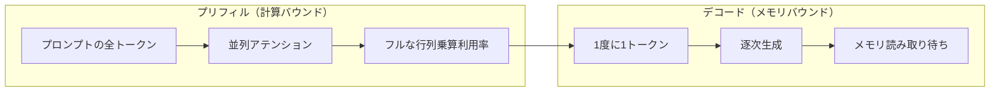
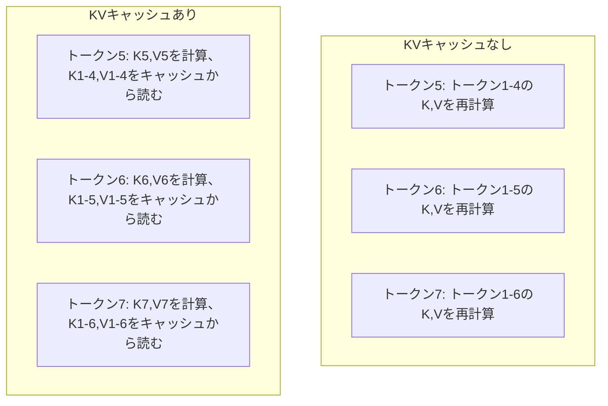
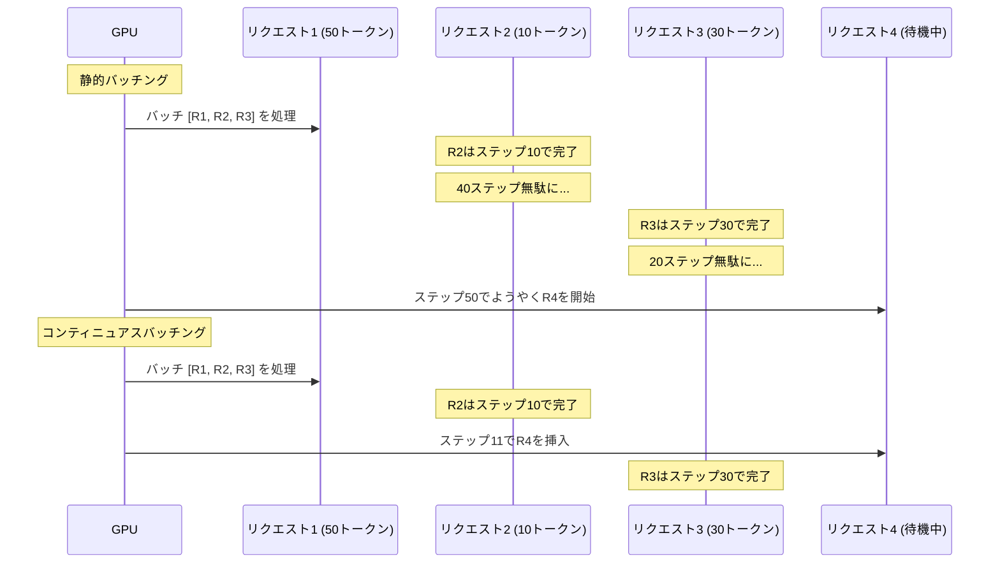
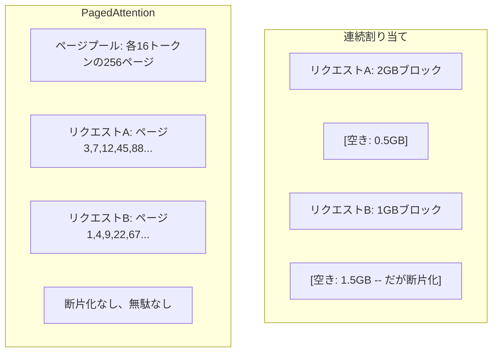
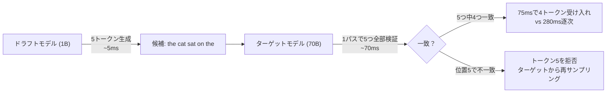

# 推論最適化

> LLM推論を定義する2つのフェーズがある。プリフィルはプロンプトを並列処理する――計算バウンド。デコードはトークンを1つずつ生成する――メモリバウンド。すべての最適化はどちらか、または両方を対象とする。


## 学習目標

- 自己回帰的なトークン生成中の冗長な計算を排除するKV-cacheを実装する
- LLM推論のプリフィルとデコードフェーズ、そしてそれぞれが異なるボトルネックを持つ理由（計算バウンド vs メモリバウンド）を説明する
- 同時リクエストでGPU利用率を最大化するためのコンティニュアスバッチングとPagedAttentionの概念を実装する
- 推論最適化技術（KV-cache、投機的デコーディング、フラッシュアテンション）とそのスループット/レイテンシのトレードオフを比較する

## 問題

Llama 3 70Bを4xA100 GPUにデプロイする。1人のユーザーが毎秒約50トークンを得る。速く感じる。そして100人のユーザーが同時にエンドポイントを叩く。スループットがユーザーあたり毎秒3トークンに落ちる。月$25,000のGPU代で、人間がタイプするより遅い速度で応答を提供することになる。

1人のユーザーと100人のユーザーの間でモデル自体は変わらない。同じ重み、同じアーキテクチャ、同じ計算。変わるのは作業のスケジューリングだ。ナイーブな推論は利用可能なGPU計算の90%以上を無駄にする。トークン47を待っているユーザーが、GPUメモリバスが行列乗算の間にアイドル状態でいる間、バッチスロット全体を占有する。一方、新しいユーザーの2,000トークンのプロンプトがその無駄な時間を有用な計算で埋めることができる。

これはスケーリングの問題ではない。スケジューリングの問題だ。このレッスンの技術――KVキャッシング、コンティニュアスバッチング、PagedAttention、投機的デコーディング、プレフィックスキャッシング――が月$25,000の推論代と同じトラフィックを提供する月$5,000の推論代を分けるものだ。

Llama 3 70Bを4xA100-80GBで提供するvLLMは低い同時実行数でユーザーあたり毎秒約50トークンを達成し、コンティニュアスバッチングとPagedAttentionを通じて100件の同時リクエストで15-25 TPS/ユーザーを維持する。これらの最適化なしでは、同じハードウェアがその同時実行数でユーザーあたり5 TPS/ユーザーを提供する。同じGPU、同じモデル、4倍のスループット。

## 概念

### プリフィルとデコード

すべてのLLM推論リクエストには2つの異なるフェーズがある。

**プリフィル**は入力プロンプト全体を処理する。すべてのトークンがわかっているので、アテンションはシーケンス全体にわたって並列計算できる。これは大きな行列乗算だ――GPUコアが忙しく保たれる。ボトルネックは計算だ：ハードウェアが毎秒提供できるFLOPs数。A100は312 TFLOPS（BF16）。70Bモデルでの4,096トークンプロンプトのプリフィルはA100 1枚で約400msかかる。

**デコード**は出力トークンを1つずつ生成する。各新しいトークンはすべての以前のトークンにアテンションをするが、1回のフォワードパスで1つのトークンしか生成されない。重み行列はプリフィル中と同じサイズだが、行列ではなく単一のベクトルと乗算している。GPUコアはマイクロ秒で終了し、次の重みのバッチがメモリから到着するのを待つ。ボトルネックはメモリ帯域幅だ：HBMからコンピュートユニットへどれだけ速くモデルの重みをストリーミングできるか。A100は2 TB/sの帯域幅を持つ。FP16の70Bモデルは140 GB。モデル全体を1回読み取るのに70ms――単一のデコードステップの最低ラインだ。



**ops:byte比**（算術強度とも呼ばれる）はこのトレードオフを捉える。メモリからロードした1バイトあたりにどれだけの操作を行うかを測定する。

```
ops:byte比 = トークンあたりのFLOPs / メモリから読み取るバイト数
```

4,096トークンのバッチでのプリフィル中は、ロードされた重みあたり約4,096の乗算累算操作を行う。比率が高い――計算バウンドだ。バッチサイズ1のデコード中は、ロードされた重みあたり約1の操作を行う。比率が低い――メモリバウンドだ。

根本的な洞察：*デコードは1つのトークンを生成するためにモデル全体を読み取るのでメモリバウンドだ*。以下のすべての最適化は、読み取るものを減らすか、読み取りあたりに処理するトークンのバッチを増やすか、または読み取りを完全に回避するかのいずれかだ。

### KVキャッシュ

アテンション中、各トークンのクエリはすべての以前のトークンのキーとバリューベクトルにアテンションする。キャッシングなしでは、トークンNを生成するために前のN-1個のトークン全てのキーとバリューの投影を再計算する必要がある。トークン1はトークン2を生成する時に投影され、トークン3でも再び、トークン4でも再び。トークン1,000までに、トークン1は計999回投影された。

KVキャッシュはすべての以前のトークンのキーとバリューの投影を保存する。トークンNを生成する時は、トークンNのキーとバリューだけを計算し、トークン1からN-1のキャッシュされたK/Vと連結する。



**KVキャッシュのメモリ計算式：**

```
KVキャッシュサイズ = 2 * num_layers * num_kv_heads * head_dim * seq_len * bytes_per_param
```

Llama 3 70B（80層、GQAで8 KVヘッド、head_dim=128、BF16）の場合：

```
トークンあたり: 2 * 80 * 8 * 128 * 2バイト = 327,680バイト = 320 KB
4,096トークン時: 320 KB * 4,096 = 1.28 GB
128Kトークン時: 320 KB * 131,072 = 40 GB
```

Llama 3 70Bの128Kコンテキストの1つの会話でKVキャッシュ40 GB――A100のメモリの半分を消費する。100件の同時ユーザーがそれぞれ4Kトークンを使うと、KVキャッシュだけで128 GBが必要だ。これがKVキャッシュ管理が推論最適化の中心的な課題である理由だ。

### コンティニュアスバッチング

静的バッチングはN件のリクエストのバッチが到着するまで待ち、一緒に処理し、*すべて*が終わるまで新しいリクエストを受け付けない。1つのリクエストが500トークン必要で別のリクエストが10トークン必要な場合、短いリクエストは終了後490のデコードステップの間アイドル状態になる。

コンティニュアスバッチング（イテレーションレベルバッチングとも呼ばれる）はリクエストが完了するとすぐに新しいリクエストをバッチに挿入する。バッチは毎デコードステップで再評価される。10トークン後に終了したリクエストはすぐに待機中のリクエストに置き換えられる。



スループットの改善は出力長がどれだけ変化するかに依存する。均一な長さでは、コンティニュアスバッチングは静的バッチングと一致する。可変長（一般的なケース）では、コンティニュアスバッチングはGPUスロットが空にならないため2-5倍の高いスループットを提供できる。

### PagedAttention

各リクエストのKVキャッシュはメモリの連続したブロックだ。リクエストが到着・出発するにつれて、メモリが断片化する――オペレーティングシステムのRAM断片化とまったく同じだ。4Kトークンのリクエストは1.28 GBの連続したメモリが必要だ。合計2 GBの空きがあっても、1.28 GBの*連続した*メモリがないかもしれない。メモリを無駄にするかリクエストを拒否するかのどちらかだ。

PagedAttention（vLLMから）はKVキャッシュにOS的な仮想メモリを適用する。リクエストごとに1つの連続したブロックを割り当てる代わりに、固定サイズの「ページ」（通常それぞれ16トークン）を割り当てる。ページはGPUの物理メモリのどこにでも存在できる。ページテーブルが各リクエストの論理シーケンス位置を物理ページの場所にマッピングする。



PagedAttentionは共有プレフィックスの**コピーオンライト**も可能にする。50件のリクエストが同じシステムプロンプトを共有する場合、そのシステムプロンプトのKVキャッシュページは一度保存され50件全てのリクエストから参照される。リクエストが分岐する（異なるユーザーメッセージ）時にのみ、独自のページを得る。これは共有システムプロンプトを持つアプリケーションでメモリ使用量を劇的に削減する。

vLLMはPagedAttentionを通じてメモリの無駄をほぼゼロに（ナイーブな割り当ての60-80%に対して約4%）にすると報告している。

### 投機的デコーディング

デコードは逐次的なので遅い――1つのトークンを生成し、フィードバックし、次を生成する。しかし次の5トークンを安価に推測し、それらを一度に全部検証できたとしたら？

投機的デコーディングは小さくて速い**ドラフトモデル**を使ってK個の候補トークンを生成する。大きな**ターゲットモデル**は次にK個の候補すべてを単一のフォワードパスで処理する（これはプリフィルのように見える――並列、計算バウンド、効率的）。ターゲットモデルがドラフトモデルの予測に同意すれば、ターゲットの1回のフォワードパス分の時間でK個のトークンすべてを受け入れる。位置jで不一致があれば、トークン1からj-1を受け入れて残りを破棄する。



高速化は**受け入れ率**に依存する――ドラフトモデルの予測がターゲットと一致する頻度。Llama 3 70BへのLlama 3 8Bのドラフトでは、自然言語で70-85%の受け入れ率が典型的だ。これは2-3倍のデコード高速化に相当する。

投機的デコーディングへの3つのアプローチ：

| 手法 | ドラフトのソース | 受け入れ率 | オーバーヘッド |
|------|----------------|-----------|-------------|
| ドラフト-ターゲット（Levithanら） | 別の小さいモデル | 70-85% | ドラフトモデルのメモリ |
| EAGLE（Liら） | ターゲット上の軽量ヘッド | 75-90% | 追加パラメータ約1% |
| Nグラムルックアップ | トークンNグラムテーブル | 40-60% | 無視できる程度 |

**EAGLE**はターゲットモデルの隠れ状態の上に小さな自己回帰ヘッドを訓練する。ターゲットモデルの最後から2番目の層の特徴を使って次のトークンの埋め込みを予測する。ターゲットモデル自身の表現（別のモデルの表現ではなく）を使って動作するため、最小限の追加メモリでより高い受け入れ率を達成する。EAGLE-2はコンテキストに基づいて候補数を調整する動的ドラフトツリーを追加する。

**Nグラム投機的デコーディング**は現在のコンテキストまたは事前構築されたコーパスからNグラムの続きのテーブルを維持する。ドラフトが同じ会話で以前に現れたもの（繰り返しパターン、コード、構造化された出力）と一致する場合、ニューラルネットワークのオーバーヘッドなしに機能する。平均的な受け入れ率は低いが、投機あたりのコストは本質的に無料だ。

投機的デコーディングは*数学的に厳密*だ――出力分布はターゲットモデルの分布と同一だ。近似ではない。検証ステップはすべての受け入れられたトークンがターゲットモデルが割り当てた確率を正確に持つことを保証する。

### プレフィックスキャッシング

多くのリクエストが同じプレフィックスを共有する。チャットボットのシステムプロンプト。RAGコンテキストブロック。少数ショットの例のセット。プレフィックスキャッシングなしでは、すべてのリクエストがこれらの共有トークンのKVキャッシュを最初から再計算する。

プレフィックスキャッシングは一般的なプレフィックスのKVキャッシュを保存し、リクエスト間で再利用する。既知のプレフィックスを持つ新しいリクエストが到着すると、システムはキャッシュされたKVエントリをコピー（または参照）し、ユニークなサフィックスのKVだけを計算する。

全リクエストで共有される2,000トークンのシステムプロンプトでは、プレフィックスキャッシングはリクエストあたり約400msのプリフィルを排除する。毎秒100リクエストで、毎秒40秒分のGPU計算を節約する――GPU1枚以上の仕事量だ。

SGLangのRadixAttentionはトークンコンテンツでプレフィックスをインデックスするRadixツリー（トライ）でプレフィックスキャッシングを実装する。保存されたプレフィックスと一致するリクエストはそのKVキャッシュを無料で得られる。ツリーは部分的なプレフィックスマッチングを可能にする――キャッシュされたエントリと2,000プレフィックストークンのうち1,500を共有する場合、それらの1,500を再利用し500だけを再計算する。

### 推論エンジン

3つのエンジンが本番LLM提供を支配する：

| エンジン | 主な革新 | 最適な用途 |
|--------|---------|-----------|
| vLLM | PagedAttention、コンティニュアスバッチング | 汎用提供、最高の互換性 |
| SGLang | RadixAttention（プレフィックスキャッシング）、構造化生成 | マルチターンチャットボット、制約付きデコーディング |
| TensorRT-LLM | NVIDIAカーネル融合、FP8量子化 | NVIDIAハードウェアでの最大単一GPU スループット |

**vLLM**はデフォルトの出発点だ。最も広い範囲のモデルをサポートし、GPUベンダー（NVIDIA、AMD、Intel）を問わず動作し、PagedAttention + コンティニュアスバッチングで強いスループットを達成する。OpenAI互換APIはOpenAI APIコールの代替としてドロップインできることを意味する。

**SGLang**はvLLMと同じ基盤の上に構築されているが、プレフィックスキャッシングのためのRadixAttentionと構造化LLMプログラムのためのドメイン固有言語を追加する。ワークロードがマルチターン会話、ツール使用、または制約付きデコーディング（JSON出力、正規表現誘導生成）を含む場合、SGLangはプレフィックス再利用によってvLLMを2-5倍上回ることが多い。

**TensorRT-LLM**はモデルを最適化されたNVIDIA GPUカーネルにコンパイルする。操作を融合し（アテンション + 線形 + 活性化を1つのカーネルで）、H100 GPUでFP8を使い、本番デプロイのためにNVIDIA Triton推論サーバーと統合する。NVIDIAハードウェアで最高の単一GPUスループットを達成するが、セットアップがより多く必要でNVIDIA GPUでのみ動作する。

Llama 3 70B（4xA100-80GB、BF16）の実際の数値：

| メトリクス | vLLM | SGLang | TensorRT-LLM |
|---------|------|--------|--------------|
| スループット（1ユーザー） | ~50 TPS | ~55 TPS | ~65 TPS |
| スループット（100ユーザー） | ~2,500 total TPS | ~3,200 total TPS | ~3,000 total TPS |
| 最初のトークンまでの時間 | ~400ms | ~300ms（プレフィックスヒット） | ~350ms |
| 最大コンテキスト | 128K | 128K | 128K |

### ops:byteフレームワーク

測定しないものは最適化できない。ops:byte比は計算バウンドかメモリバウンドかを教えてくれる。どちらの最適化が重要かを決定する。

```
計算の天井: GPUのピークFLOPS
メモリの天井: ピーク帯域幅 * ops:byte比
```

ops:byteが低い（デコード、小さいバッチ）時は、メモリ帯域幅の天井に当たる。計算を増やしても（高いクロック、コアを増やす）役に立たない。メモリ読み取りを減らす（量子化、KVキャッシュ圧縮）か、読み取りをより多くの有用な仕事に分散させるためにバッチサイズを増やす必要がある。

ops:byteが高い（プリフィル、大きいバッチ）時は、計算の天井に当たる。メモリ帯域幅の最適化は役に立たない。より速いGPU、カーネル融合、またはより多くのFLOPSを絞り出すための精度削減が必要だ。

| シナリオ | ops:byte | バウンド | 最適化手段 |
|---------|----------|---------|-----------|
| プリフィル、batch=1 | ~4,096 | 計算 | カーネル融合、FP8 |
| デコード、batch=1 | ~1 | メモリ | 量子化、KV圧縮 |
| デコード、batch=32 | ~32 | メモリ | より大きいバッチ、コンティニュアスバッチング |
| デコード、batch=256 | ~256 | 移行中 | 両方重要 |
| デコード、batch=1024 | ~1,024 | 計算 | カーネル融合、テンソル並列化 |

A100での交差点はops:byte = 156（312 TFLOPS / 2 TB/s）あたりだ。156未満ではメモリバウンド。156以上では計算バウンド。コンティニュアスバッチングはイテレーションあたりにより多くのトークンをパックすることで、デコードをこの交差点に向けて押し上げる。

## 実装する

### ステップ1：KVキャッシュをゼロから

層ごと、ヘッドごとにキーとバリューの投影を保存し、メモリ成長パターンを示す多ヘッドKVキャッシュを構築する。

```python
import numpy as np

class KVCache:
    def __init__(self, num_layers, num_heads, head_dim, max_seq_len, dtype=np.float16):
        self.num_layers = num_layers
        self.num_heads = num_heads
        self.head_dim = head_dim
        self.max_seq_len = max_seq_len
        self.dtype = dtype

        self.k_cache = np.zeros(
            (num_layers, num_heads, max_seq_len, head_dim), dtype=dtype
        )
        self.v_cache = np.zeros(
            (num_layers, num_heads, max_seq_len, head_dim), dtype=dtype
        )
        self.seq_len = 0

    def update(self, layer_idx, new_keys, new_values):
        num_new = new_keys.shape[1]
        end = self.seq_len + num_new
        self.k_cache[layer_idx, :, self.seq_len:end, :] = new_keys
        self.v_cache[layer_idx, :, self.seq_len:end, :] = new_values
        return (
            self.k_cache[layer_idx, :, :end, :],
            self.v_cache[layer_idx, :, :end, :]
        )

    def advance(self, num_tokens):
        self.seq_len += num_tokens

    def memory_bytes(self):
        return self.k_cache.nbytes + self.v_cache.nbytes

    def used_bytes(self):
        per_token = 2 * self.num_layers * self.num_heads * self.head_dim * np.dtype(self.dtype).itemsize
        return per_token * self.seq_len
```

### ステップ2：KVキャッシュ付きアテンション

デコードステップのためにKVキャッシュを使う簡略化された多ヘッドアテンション。

```python
def scaled_dot_product_attention(query, keys, values):
    head_dim = query.shape[-1]
    scores = np.matmul(query, keys.transpose(0, 1, 3, 2)) / np.sqrt(head_dim)
    seq_len_q = scores.shape[-2]
    seq_len_k = scores.shape[-1]
    if seq_len_q > 1:
        mask = np.triu(np.ones((seq_len_q, seq_len_k), dtype=np.float32), k=seq_len_k - seq_len_q + 1)
        scores = scores + mask * (-1e9)
    max_scores = np.max(scores, axis=-1, keepdims=True)
    exp_scores = np.exp(scores - max_scores)
    attn_weights = exp_scores / np.sum(exp_scores, axis=-1, keepdims=True)
    return np.matmul(attn_weights, values)


class MultiHeadAttention:
    def __init__(self, d_model, num_heads):
        self.num_heads = num_heads
        self.head_dim = d_model // num_heads
        scale = np.sqrt(2.0 / d_model)
        self.W_q = np.random.randn(d_model, d_model).astype(np.float32) * scale
        self.W_k = np.random.randn(d_model, d_model).astype(np.float32) * scale
        self.W_v = np.random.randn(d_model, d_model).astype(np.float32) * scale
        self.W_o = np.random.randn(d_model, d_model).astype(np.float32) * scale

    def forward(self, x, kv_cache=None, layer_idx=0):
        batch, seq_len, d_model = x.shape
        Q = np.matmul(x, self.W_q).reshape(batch, seq_len, self.num_heads, self.head_dim).transpose(0, 2, 1, 3)
        K = np.matmul(x, self.W_k).reshape(batch, seq_len, self.num_heads, self.head_dim).transpose(0, 2, 1, 3)
        V = np.matmul(x, self.W_v).reshape(batch, seq_len, self.num_heads, self.head_dim).transpose(0, 2, 1, 3)

        if kv_cache is not None:
            K_full, V_full = kv_cache.update(layer_idx, K[0], V[0])
            K = K_full[np.newaxis, :, :, :]
            V = V_full[np.newaxis, :, :, :]
            if seq_len == 1:
                kv_cache.advance(1)

        attn_out = scaled_dot_product_attention(Q, K, V)
        attn_out = attn_out.transpose(0, 2, 1, 3).reshape(batch, -1, d_model)
        return np.matmul(attn_out, self.W_o)
```

### ステップ3：コンティニュアスバッチングシミュレータ

静的バッチングとコンティニュアスバッチングの間のスケジューリングの違いをシミュレートする。

```python
import heapq

class Request:
    def __init__(self, request_id, prompt_tokens, output_tokens, arrival_step):
        self.request_id = request_id
        self.prompt_tokens = prompt_tokens
        self.output_tokens = output_tokens
        self.arrival_step = arrival_step
        self.tokens_generated = 0
        self.start_step = None
        self.end_step = None

    def is_done(self):
        return self.tokens_generated >= self.output_tokens


def simulate_static_batching(requests, batch_size):
    step = 0
    completed = []
    queue = list(requests)
    queue.sort(key=lambda r: r.arrival_step)

    while queue:
        batch = []
        while queue and len(batch) < batch_size:
            r = queue.pop(0)
            r.start_step = max(step, r.arrival_step)
            batch.append(r)

        if batch:
            step = max(step, max(r.start_step for r in batch))
            max_output = max(r.output_tokens for r in batch)
            for r in batch:
                r.tokens_generated = r.output_tokens
                r.end_step = step + max_output
            step += max_output
            completed.extend(batch)

    return completed


def simulate_continuous_batching(requests, batch_size):
    step = 0
    completed = []
    queue = sorted(requests, key=lambda r: r.arrival_step)
    queue_idx = 0
    active = []
    waiting = []

    while queue_idx < len(queue) or active or waiting:
        while queue_idx < len(queue) and queue[queue_idx].arrival_step <= step:
            waiting.append(queue[queue_idx])
            queue_idx += 1

        while waiting and len(active) < batch_size:
            r = waiting.pop(0)
            r.start_step = step
            active.append(r)

        if not active:
            if waiting:
                step += 1
                continue
            elif queue_idx < len(queue):
                step = queue[queue_idx].arrival_step
                continue
            else:
                break

        for r in active:
            r.tokens_generated += 1

        done = [r for r in active if r.is_done()]
        for r in done:
            r.end_step = step + 1
            completed.append(r)
        active = [r for r in active if not r.is_done()]

        step += 1

    return completed


def batching_stats(completed):
    latencies = [r.end_step - r.arrival_step for r in completed]
    total_time = max(r.end_step for r in completed) - min(r.arrival_step for r in completed)
    total_tokens = sum(r.output_tokens for r in completed)
    return {
        "avg_latency": np.mean(latencies),
        "p50_latency": np.median(latencies),
        "p99_latency": np.percentile(latencies, 99),
        "total_time": total_time,
        "throughput": total_tokens / total_time if total_time > 0 else 0,
    }
```

### ステップ4：プレフィックスキャッシュ

共有プレフィックスのKVエントリを保存するトライベースのプレフィックスキャッシュ。

```python
class TrieNode:
    def __init__(self):
        self.children = {}
        self.kv_data = None
        self.hit_count = 0


class PrefixCache:
    def __init__(self, max_entries=1000):
        self.root = TrieNode()
        self.max_entries = max_entries
        self.total_entries = 0
        self.hits = 0
        self.misses = 0

    def _walk(self, token_ids):
        node = self.root
        depth = 0
        for tid in token_ids:
            if tid not in node.children:
                break
            node = node.children[tid]
            depth += 1
        return node, depth

    def lookup(self, token_ids):
        node, depth = self._walk(token_ids)
        if depth > 0:
            self.hits += 1
            current = self.root
            for tid in token_ids[:depth]:
                current = current.children[tid]
                current.hit_count += 1
            kv_entries = []
            current = self.root
            for tid in token_ids[:depth]:
                current = current.children[tid]
                if current.kv_data is not None:
                    kv_entries.append(current.kv_data)
            return depth, kv_entries
        self.misses += 1
        return 0, []

    def insert(self, token_ids, kv_per_token):
        node = self.root
        for i, tid in enumerate(token_ids):
            if tid not in node.children:
                if self.total_entries >= self.max_entries:
                    return i
                node.children[tid] = TrieNode()
                self.total_entries += 1
            node = node.children[tid]
            if i < len(kv_per_token):
                node.kv_data = kv_per_token[i]
        return len(token_ids)

    def hit_rate(self):
        total = self.hits + self.misses
        return self.hits / total if total > 0 else 0.0
```

### ステップ5：投機的デコーディングシミュレータ

設定可能な受け入れ率でドラフト-ターゲットの投機的デコーディングをシミュレートする。

```python
class DraftModel:
    def __init__(self, vocab_size, acceptance_rate=0.8):
        self.vocab_size = vocab_size
        self.acceptance_rate = acceptance_rate

    def generate(self, context, num_tokens):
        tokens = np.random.randint(0, self.vocab_size, size=num_tokens)
        return tokens

    def get_probs(self, context, token):
        probs = np.random.dirichlet(np.ones(self.vocab_size))
        return probs


class TargetModel:
    def __init__(self, vocab_size):
        self.vocab_size = vocab_size

    def get_probs(self, context, tokens=None):
        if tokens is not None:
            return [np.random.dirichlet(np.ones(self.vocab_size)) for _ in tokens]
        return np.random.dirichlet(np.ones(self.vocab_size))


def speculative_decode(draft_model, target_model, context, num_speculative=5,
                       draft_cost=1.0, target_cost=10.0, verify_cost=12.0):
    total_tokens = 0
    total_cost = 0.0
    accepted_counts = []
    context = list(context)

    max_tokens = 100

    while total_tokens < max_tokens:
        draft_tokens = draft_model.generate(context, num_speculative)
        total_cost += draft_cost * num_speculative

        target_probs = target_model.get_probs(context, draft_tokens)
        total_cost += verify_cost

        accepted = 0
        for i, token in enumerate(draft_tokens):
            draft_p = draft_model.get_probs(context + list(draft_tokens[:i]), token)
            target_p = target_probs[i]

            r = np.random.random()
            acceptance_prob = min(1.0, target_p[token] / (draft_p[token] + 1e-10))

            if r < draft_model.acceptance_rate:
                accepted += 1
                context.append(token)
                total_tokens += 1
            else:
                new_token = np.random.choice(draft_model.vocab_size, p=target_p)
                context.append(new_token)
                total_tokens += 1
                break

        accepted_counts.append(accepted)

        if accepted == num_speculative:
            bonus_probs = target_model.get_probs(context)
            bonus_token = np.random.choice(draft_model.vocab_size, p=bonus_probs)
            context.append(bonus_token)
            total_tokens += 1

    sequential_cost = total_tokens * target_cost
    return {
        "total_tokens": total_tokens,
        "speculative_cost": total_cost,
        "sequential_cost": sequential_cost,
        "speedup": sequential_cost / total_cost if total_cost > 0 else 1.0,
        "avg_accepted": np.mean(accepted_counts),
        "acceptance_rate": np.mean(accepted_counts) / num_speculative,
    }


def compare_speculation_strategies(vocab_size=1000, num_trials=20):
    results = {}

    for name, acceptance_rate, spec_tokens in [
        ("Draft-target (8B->70B)", 0.78, 5),
        ("EAGLE", 0.85, 6),
        ("N-gram", 0.50, 4),
        ("No speculation", 0.0, 0),
    ]:
        if spec_tokens == 0:
            results[name] = {
                "speedup": 1.0,
                "acceptance_rate": 0.0,
                "avg_accepted": 0.0,
            }
            continue

        trial_results = []
        for _ in range(num_trials):
            draft = DraftModel(vocab_size, acceptance_rate=acceptance_rate)
            target = TargetModel(vocab_size)
            context = list(np.random.randint(0, vocab_size, size=10))
            result = speculative_decode(draft, target, context, num_speculative=spec_tokens)
            trial_results.append(result)

        results[name] = {
            "speedup": np.mean([r["speedup"] for r in trial_results]),
            "acceptance_rate": np.mean([r["acceptance_rate"] for r in trial_results]),
            "avg_accepted": np.mean([r["avg_accepted"] for r in trial_results]),
        }

    return results
```

### ステップ6：KVキャッシュメモリプロファイラ

実際のモデル設定のKVキャッシュメモリ要件を計算する。

```python
MODEL_CONFIGS = {
    "Llama-3-8B": {
        "num_layers": 32, "num_kv_heads": 8, "head_dim": 128,
        "model_params_b": 8, "gqa": True,
    },
    "Llama-3-70B": {
        "num_layers": 80, "num_kv_heads": 8, "head_dim": 128,
        "model_params_b": 70, "gqa": True,
    },
    "Llama-3-405B": {
        "num_layers": 126, "num_kv_heads": 8, "head_dim": 128,
        "model_params_b": 405, "gqa": True,
    },
    "Mistral-7B": {
        "num_layers": 32, "num_kv_heads": 8, "head_dim": 128,
        "model_params_b": 7, "gqa": True,
    },
    "GPT-4-est": {
        "num_layers": 120, "num_kv_heads": 96, "head_dim": 128,
        "model_params_b": 1800, "gqa": False,
    },
}


def kv_cache_memory(config, seq_len, dtype_bytes=2):
    per_token = 2 * config["num_layers"] * config["num_kv_heads"] * config["head_dim"] * dtype_bytes
    total = per_token * seq_len
    return {
        "per_token_bytes": per_token,
        "per_token_kb": per_token / 1024,
        "total_bytes": total,
        "total_mb": total / (1024 ** 2),
        "total_gb": total / (1024 ** 3),
    }


def memory_budget(config, gpu_memory_gb, model_dtype_bytes=2, kv_dtype_bytes=2):
    model_memory_gb = config["model_params_b"] * 1e9 * model_dtype_bytes / (1024 ** 3)
    overhead_gb = gpu_memory_gb * 0.1
    available_for_kv = gpu_memory_gb - model_memory_gb - overhead_gb

    if available_for_kv <= 0:
        return {"error": "Model does not fit in GPU memory", "model_memory_gb": model_memory_gb}

    per_token = 2 * config["num_layers"] * config["num_kv_heads"] * config["head_dim"] * kv_dtype_bytes
    max_tokens = int(available_for_kv * (1024 ** 3) / per_token)

    return {
        "gpu_memory_gb": gpu_memory_gb,
        "model_memory_gb": round(model_memory_gb, 1),
        "overhead_gb": round(overhead_gb, 1),
        "available_for_kv_gb": round(available_for_kv, 1),
        "max_total_tokens": max_tokens,
        "max_users_at_2k": max_tokens // 2048,
        "max_users_at_4k": max_tokens // 4096,
        "max_users_at_32k": max_tokens // 32768,
    }
```

## 使ってみる

vLLMで：

```python
from vllm import LLM, SamplingParams

llm = LLM(
    model="meta-llama/Llama-3-70B-Instruct",
    tensor_parallel_size=4,
    enable_prefix_caching=True,
    max_model_len=8192,
    gpu_memory_utilization=0.9,
)

params = SamplingParams(temperature=0.7, max_tokens=256)
outputs = llm.generate(["Explain inference optimization in one paragraph."], params)
```

SGLangでプレフィックスキャッシング + 構造化出力：

```python
import sglang as sgl

@sgl.function
def classify(s, text):
    s += sgl.system("You are a classifier. Output JSON only.")
    s += sgl.user(f"Classify this text: {text}")
    s += sgl.assistant(sgl.gen("result", regex=r'\{"label": "(positive|negative|neutral)"\}'))

runtime = sgl.Runtime(model_path="meta-llama/Llama-3-70B-Instruct", tp_size=4)
sgl.set_default_backend(runtime)

results = classify.run_batch([
    {"text": "This product is amazing!"},
    {"text": "Terrible experience."},
    {"text": "It was okay I guess."},
])
```

TensorRT-LLMで：

```python
import tensorrt_llm
from tensorrt_llm.runtime import ModelRunner

runner = ModelRunner.from_dir("./llama-70b-trt-engine/", rank=0)

outputs = runner.generate(
    batch_input_ids=[tokenizer.encode("Explain KV caching.")],
    max_new_tokens=256,
    temperature=0.7,
)
```

## 成果物を出す

このレッスンは以下を生成する：
- `outputs/skill-inference-optimization.md` -- LLM推論サービングの診断と最適化のためのスキル

## 演習

1. KVキャッシュプロファイラを修正してFP16 vs FP8 vs INT4のKVキャッシュ量子化を比較する。4Kコンテキストでのllama 3 70Bについて、4xA100-80GBでの最大同時ユーザー数を各精度で計算する。INT4へのKV量子化はユーザー容量をおよそ4倍にするはずだ。

2. コンティニュアスバッチングシミュレータを拡張してGPU利用率（ステップごとに埋まっているバッチスロットの割合）を追跡する。パレート分布（shape=1.5、scale=20）に従う出力長を持つ50件のリクエストで、静的バッチングとコンティニュアスバッチングの両方について利用率を時間経過でプロットする。コンティニュアスバッチングは80%以上の利用率を維持するはずだ。

3. `num_kv_heads < num_query_heads` のグループクエリアテンション（GQA）バージョンのKVキャッシュを実装する。Llama 3 70Bは64のクエリヘッドを使うが8のKVヘッドしか使わない。フルな多ヘッドアテンション（KVキャッシュサイズの8倍削減）に対するメモリ節約を計算する。

4. LRU退避を使うプレフィックスキャッシュを構築する。max_entriesを500に設定し、5つの一般的なプレフィックスのいずれかを60%が共有する1,000件のリクエストを生成する。ヒット率を測定して無制限キャッシュと比較する。良い退避では、ヒット率は55%以上を維持するはずだ。

5. 投機的デコーディングシミュレータを拡張してツリーベースの投機（EAGLE-2スタイル）を実装する。K個のドラフトトークンの単一のチェーンの代わりに、候補のツリーを生成する（例：3レベルの各2分岐 = 8枚の葉の候補）。線形投機と比較して検証ラウンドあたりの受け入れトークン総数を比較する。

## キーワード

| 用語 | 一般的な説明 | 実際の意味 |
|------|-------------|-----------|
| プリフィル | 「プロンプトの処理」 | すべての入力トークンに対してアテンションを並列計算する――フルな行列乗算がGPUコアを忙しく保つため計算バウンド |
| デコード | 「トークンの生成」 | フォワードパスあたり1つのトークンを生成し、毎回モデルの全重みを読み取る――次の重みが到着する前に計算が終わるためメモリバウンド |
| KVキャッシュ | 「アテンション状態のキャッシング」 | すべての以前のトークンのキーとバリューの投影を保存して、各デコードステップで再計算しないようにする――計算のためにメモリをトレードオフ |
| コンティニュアスバッチング | 「動的バッチング」 | リクエストが終了するとすぐに実行中のバッチに新しいリクエストを挿入する、バッチ全体を待つのではなく毎デコードイテレーションで評価 |
| PagedAttention | 「KVキャッシュのための仮想メモリ」 | 連続したブロックではなく固定サイズのページでKVキャッシュを割り当て、メモリの断片化を排除し共有プレフィックスのコピーオンライトを可能にする |
| 投機的デコーディング | 「ドラフトと検証」 | 速いドラフトモデルを使って複数のトークンを提案し、それらをすべて1回のターゲットモデルフォワードパスで検証する――数学的に厳密、2-3倍の高速化 |
| EAGLE | 「自己投機的デコーディング」 | ターゲットモデル自身の隠れ状態の上に軽量ヘッドを訓練する投機的デコーディングの変形、別個のドラフトモデルより高い受け入れ率を達成 |
| プレフィックスキャッシング | 「システムプロンプトKVの再利用」 | 一般的なプレフィックス（システムプロンプト、少数ショットの例）の計算済みKVキャッシュエントリを保存し、リクエスト間で再利用して冗長なプリフィルをスキップ |
| ops:byte比 | 「算術強度」 | 計算操作対読み取りメモリバイトの比率――ワークロードが計算バウンド（高比率）かメモリバウンド（低比率）かを決定 |
| 最初のトークンまでの時間 | 「TTFT」 | リクエストの受信から最初の出力トークン生成までのレイテンシ――長いプロンプトではプリフィル時間が支配 |

## 参考資料

- Kwon et al., "Efficient Memory Management for Large Language Model Serving with PagedAttention" (2023) -- ページ化されたKVキャッシュ管理を導入したvLLMの論文、今や推論サービングの業界標準
- Leviathan et al., "Fast Inference from Transformers via Speculative Decoding" (2023) -- ドラフト-検証投機が2-3倍の高速化を達成しながら正確なターゲットモデル分布を生成することを証明した基礎的な論文
- Li et al., "EAGLE: Speculative Sampling Requires Rethinking Feature Uncertainty" (2024) -- 別個のドラフトモデルの代わりにターゲットモデル自身の特徴の上にヘッドを訓練することで高い受け入れ率を達成
- Zheng et al., "SGLang: Efficient Execution of Structured Language Model Programs" (2024) -- プレフィックスキャッシングのためのRadixAttentionとマルチコールLLMプログラムのプログラミングモデルを導入
- Williams et al., "Roofline: An Insightful Visual Performance Model for Multicore Architectures" (2009) -- 計算 vs メモリのボトルネックを推論するためのops:byteフレームワークを形式化したオリジナルのルーフラインの論文
