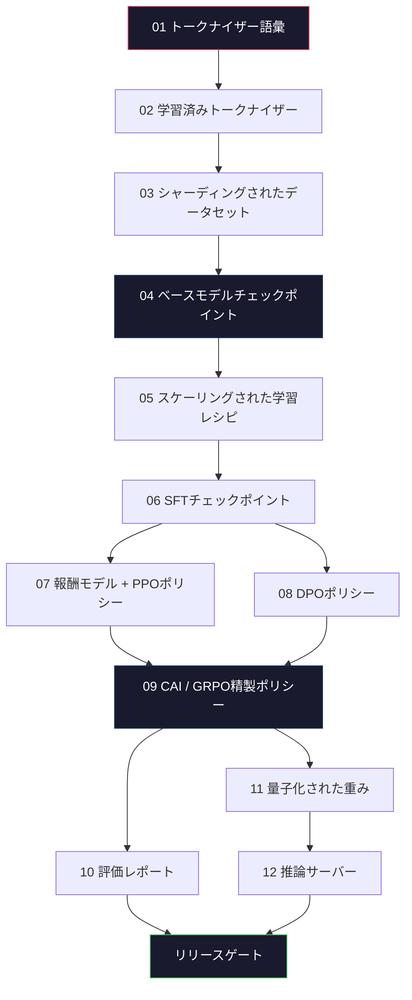
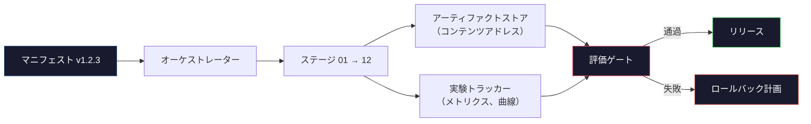

# 完全なLLMパイプラインを構築する

> レッスン01〜12の内容はすべて、一つのパイプラインの一ステージにすぎない。このレッスンは、それらのステージを単一のエンドツーエンド実行にまとめるための骨格だ。トークナイズ、事前学習、スケーリング、SFT、アライメント、評価、量子化、サービング。ラップトップで70Bモデルを学習させることはしない。2026年のフロンティアチームが何をリリースするかを決定するための、オーケストレーション層・マニフェスト・評価ゲート・ロールバック計画を作成する。これはキャップストーン（集大成）だ。


## 学習目標

- 11のレッスン（トークナイザー、データ、事前学習、スケーリング、SFT、RLHF、DPO、CAI、評価、量子化、推論）を単一の再現可能なパイプライン仕様にまとめる
- ステージ間のアーティファクト契約を定義する：各ステージが何を消費し、何を生成し、次のステージがどのように入力を検証するか
- 実験を追跡し、アーティファクトをハッシュし、評価閾値に基づいてリリース判断をゲートするオーケストレーターを構築する
- ロールバック計画を設計する：どのアーティファクトが再実行に安価で、どれが高価か、破損したチェックポイントが何を意味するか

## 課題

前のレッスンはそれぞれ機能する。トークナイザーは学習済み。小型GPTは事前学習済み。SFTデータセットは組み立て済み。報酬モデルは学習済み。DPOは実行済み。評価は測定済み。量子化された重みはエクスポート済み。推論サーバーは稼働中。それぞれがノートブックだ。それぞれが独自の規約、独自の出力パス、独自のシードを持っている。

フロンティアの学習実行はノートブックではない。Llama 3 405Bは約54日間で3,000万H100時間を要した。DeepSeek-V3は約280万H800時間を使った。その間に、一つの破損したチェックポイント、一つのデータ汚染、一つの評価回帰が、チームの1週間の実時間と1ヶ月のGPUバジェットを失わせる可能性がある。チームがこれを乗り越える方法は、パイプラインの衛生管理だ：各ステージには決定論的な入力、決定論的な出力、マニフェスト、ハッシュ、ゲートがある。

これがキャップストーンだ。ラップトップでパイプラインをエンドツーエンドで実行することはしない。ステージを調整するオーケストレーター、実行を説明するマニフェスト、リリース判断をゲートする検証者、そして第三者が単一ファイルから作業を再実行できるリプレイ計画を書く。コードは小さい；規律は大きい。

パターンは100Mから1Tパラメータまで変更なしにスケールする。同じ4つのコンポーネント——マニフェスト、オーケストレーター、評価ゲート、アーティファクトストア——がLlama 3も個人のGPTも実行する。違いは各ステージの設定内の数値のサイズであり、パイプラインの形ではない。

## コンセプト

### 12のステージ

Phase 10のすべてのレッスンはステージだ。以下に完全な依存グラフを示す。



ステージ07と08は並列で実行できる。それ以外はすべて強固な依存関係がある。ステージ02（トークナイザー）の変更はすべての下流アーティファクトを無効にする。ステージ10（評価）の変更はリリース判断のみを無効にする。

### マニフェスト

マニフェストは、実行を再現するために十分な情報を記述した単一ファイルだ。パイプラインが生成するものは、マニフェストに含まれていない状態に依存してはならない。フィールドは単純だが必須だ。

```
pipeline_version: 1.2.3
seed: 42
git_commit: a1b2c3d4
stages:
  01_tokenizer:
    recipe: bpe_32k
    input_hash: sha256:...
    output_hash: sha256:...
    wall_clock_sec: 3600
    cost_usd: 12
```

ステージNの出力ハッシュはステージN+1の入力ハッシュだ。ずれがあればパイプラインは停止する。これはデータ破損を早期に検出する方法だ。また、別の大陸のチームメンバーが、自分のリプレイがあなたのものと同じアーティファクトを生成したことを確認する方法でもある。

実際には、チームは小さなYAMLスキーマに加え、前回の成功した実行と差分を取るマニフェストチェッカーを使用する。期待されるフィールド（コスト、実行時間）以外の差分は危険信号だ。

### アーティファクトの型付け

各ステージの出力は型付きアーティファクトだ。ディレクトリの塊でもなく、pickleファイルでもなく、既知のスキーマを持つ名前付きの型だ。

| ステージ | アーティファクト型 | 主要フィールド |
|----------|------------------|--------------|
| 01-02 | トークナイザー | vocab.json, merges.txt, config.json, ハッシュ |
| 03 | データセット | shards[], 行数, トークン数, 重複除去統計 |
| 04-05 | チェックポイント | weights.safetensors, config.json, オプティマイザー状態, ステップ数 |
| 06 | SFTモデル | チェックポイント + SFTレシピ + データミックス |
| 07 | 報酬モデル | RMチェックポイント + 選好データハッシュ |
| 08-09 | ポリシー | チェックポイント + 参照ハッシュ + ベータ + 消費済みKL予算 |
| 10 | 評価レポート | ベンチマークスコア + 回帰差分 + 評価データハッシュ |
| 11 | 量子化済みモデル | 量子化された重み + キャリブレーションデータ + FP16比の精度差 |
| 12 | サーバー仕様 | エンドポイント + モデルハッシュ + 設定 + 観測性フック |

型付けにより、最も一般的な障害モードが防止される：ステージ08の出力をステージ06の入力として使用し、DPO学習済みモデルをSFTパスでリリースする間違いだ。型付きアーティファクトと型付きステージ署名により、これらのエラーは5日後の障害ではなく、コンパイル時の障害となる。

### 評価ゲート

リリースとは「学習完了」ではない。リリースとは「学習完了かつ評価ゲートが通過した」だ。ゲートは実行開始前に定義される。

```
gates:
  mmlu:      >= baseline + 0.5   # 回帰なし
  humaneval: >= baseline + 1.0
  truthfulqa: >= baseline         # 低下なし
  safety_refusal_rate: <= 0.05
  kl_from_reference: <= 25.0
  cost_total_usd: <= 50000
```

すべてのゲートは数値の閾値だ。「良さそう」なゲートはない。主観的な承認もない。すべてのゲートが通過すれば、アーティファクトはリリース可能としてマークされる。ゲートが一つでも失敗すれば、実行は指定されたレビュアーによる明示的な上書きが保留される。その上書き自体もマニフェストに記録される。

2つのゲートがほとんどの災害を捕捉する。*回帰ゲート*（新しいモデルは、コアベンチマークで少なくとも前のモデルと同等でなければならない）は学習バグを捕捉する。*KL予算ゲート*（アライメントされたポリシーは参照からX以上離れてはならない）はアライメントの過剰調整を捕捉する。すべての本番パイプラインには両方がある。

### オーケストレーター

マニフェストを読み込み、ステージを送出し、アーティファクトを追跡し、契約違反があれば停止する小さなコードだ。これはAirflowではない。Kubeflowでもない。パイプラインの衛生管理には、自分が書いた退屈なものが欲しい。

オーケストレーターの役割は狭い：

1. マニフェストからDAGを解決する。
2. 各ステージについて、期待される出力が正しいハッシュですでに存在するかチェックする（存在する場合はスキップ）。
3. ステージを実行し、stdout/stderrをキャプチャし、実行時間とコストを測定する。
4. 出力ハッシュを下流ステージの期待される入力ハッシュと照合する。
5. 障害が発生した場合、正確に失敗したステージと共に部分マニフェストを書き込み、非ゼロで終了する。

これは200行のPythonだ。このレッスンのファイル`code/main.py`のように見える。裏では、実際のパイプラインは`torchrun`や`ray`を使ってクラスター上で個々のステージを実行するが、オーケストレーター自体は単一のボックスで動作する。

### 実験追跡とアーティファクトストレージ

2つの外部システムがパイプラインを支える。

**実験トラッカー（wandb、neptune、mlflow）。** ステージごとに損失曲線、評価メトリクス、システムテレメトリを記録する。3週間後に実行Aと実行Bを比較する必要があるときはトラッカーを見る。チームはほぼ常にこれにホスト型トラッカーを使う——自前で書くと学習に使うべき時間が失われる。

**アーティファクトストア（S3、R2、GCS）。** チェックポイント、データセット、トークナイザー、評価レポートのための不変オブジェクトストア。アーティファクトはファイル名ではなくハッシュでアドレス指定される。`latest.pt`のようなファイル名は足を撃つ。`ckpt-7b-step-20000-sha256:abc123.safetensors`は契約だ。

オーケストレーターは両方に書き込む。トラッカーはチャートを見る人間のためだ。アーティファクトストアは入力を調べる次のステージのためだ。

### コスト管理

フロンティアの実行にはドルの数字が付いている。予算規律は2つの場所で行われる。

**実行前の見積もり。** マニフェストから、期待されるFLOPを計算する（事前学習の場合：6 × パラメータ数 × トークン数）。期待されるGPU時間（FLOPs / ピークスループット / 利用率）と、現在のレンタル料金でのドルコストを計算する。見積もりが予算ゲートを超える場合、パイプラインの開始を拒否する。

**実行中の追跡。** ステージごとの実行時間とコストがマニフェストに記録される。各ステージの後、残りの予算が確認される。ステージがオーバーランした場合、次のステージのゲートは新しい残り予算で評価される。VCから電話がきたときに資金が尽きていたことを知ることはない。

Llama 3の報告コストは6,100万ドルだった。DeepSeek-V3はメインの事前学習実行に560万ドルを報告した。比率は主にハードウェア効率とMoEによるものだが、具体的なコストは両チームがステージごとに追跡していたために見えている。実行単位ではなくだ。

### 再現性と決定論

これらは同じではない。*再現可能*とは、同じマニフェスト + 同じコード + 同じインフラが同等の下流メトリクスを持つチェックポイントを生成することを意味する。*決定論的*とはビット単位で同一の出力を意味する。

現代のLLM学習は再現可能だが決定論的ではない。分散学習のreduce順序、GPUカーネルの非決定性（cuBLAS、flash-attn）、混合精度の丸めが組み合わさって、実行間で1e-5レベルで異なる浮動小数点数を生成する。最終的なメトリクスには問題ない。ビットレベルの差分でデバッグしようとすると致命的だ。解決策は、各ステージの入力ハッシュ、出力ハッシュ、主要メトリクスを記録することだ——それらが一致すれば、重みがビット単位で同一でなくても実行は「再現」されたとみなされる。



### ロールバック計画

実行開始前に、各ステージの障害時に何をするかを書き出す。3つのカテゴリー。

- **安価に再実行可能**（時間単位）：トークナイザー、評価、量子化、推論サーバー。ただ再実行する。
- **中程度**（日単位）：SFT、DPO、CAI。ベースモデルを保持し、アライメントステージのみを再実行する。
- **高価**（週単位と数百万ドル）：事前学習。ここでのロールバック計画は「再実行」ではない。「最後の良好なチェックポイントを使用し、修正データで安価な下流ステージを再実行する」だ。

ステージの依存関係は型付きでハッシュされているため、オーケストレーターはロールバックセットを自動的に計算できる：失敗したステージとすべての子孫を無効にする。ステージ06（SFT）の障害は06、07、08、09、10、11、12を無効にする。ステージ11（量子化）の障害は11と12のみを無効にする。これを事前に明示しておくことで、チームが午前4時に疲弊しているときに即興で考えずに済む。

### 2026年に観察された本番レシピ

ほとんどのフロンティアチームは同じ骨格に収束している。

- トークナイザー：バイトフォールバック付き128k BPE。小さな均衡多言語スライスで学習。
- 事前学習：10〜20Tトークン、主にWeb + コード + 合成。MuonまたはAdamWオプティマイザー。FSDP2またはDeepSpeed ZeRO-3。勾配チェックポインティング。BF16重み、FP32マスター。
- SFT：50万〜200万の指示ペア、人間と合成の混合、評価セットに対する厳密な重複除去あり。
- アライメント：DPOまたはCAI + GRPO。選好シグナルがDPOには多次元すぎる場合にのみRLHF。
- 評価：MMLU-Pro、MATH、HumanEval+、GPQA、SWE-Bench Verified、LiveBench、および公開されない非公開保留セット。
- 量子化：サービング用4ビットGPTQまたはAWQ、精度差が重要な安全性評価用8ビット。
- サービング：vLLM、TensorRT-LLM、または自社開発。継続的バッチ処理。投機的デコーディング。KVキャッシュ退避。

数値は6ヶ月ごとに変わる。骨格は変わらない。

## 実装する

レッスンのコードはオーケストレーターとマニフェストチェッカーであり、12の学習スクリプトではない。各ステージは、正しい形状とハッシュを持つ出力アーティファクトを生成するプレースホルダーでシミュレートされる。オーケストレーターをエンドツーエンドで実行することで、実際のステージにGPUのお金を使う前にパイプラインの配管が機能することを証明する。

完全な実装については`code/main.py`を参照。主要な部分：

- `Manifest`データクラス：パイプラインバージョン、シード、gitコミット、ステージ、ゲート。
- `Stage`データクラス：名前、型、入力（ハッシュ）、出力（ハッシュ）、実行時間、コスト。
- `Orchestrator.run()`：DAGを解決し、ステージを送出し、ハッシュを検証し、マニフェストを更新する。
- `EvalGate.check()`：閾値を読み込み、最新の評価レポートと比較し、合否を返す。
- `ArtifactStore`（インメモリスタブ）：ハッシュによるput/get、S3をシミュレート。
- `CostTracker`：ステージごとおよび累積、上限超過時に停止。

`main.py`のパイプラインは12のプレースホルダーステージを実行し、マニフェストを生成し、保留された実行がどのように見えるかを示すために失敗した評価ゲートを実行する。各プレースホルダーを対応するレッスンの実際の学習スクリプトに置き換えれば、実際のフロンティアパイプラインが使用する骨格ができる。

## 使ってみる

標準的なワークフローには3つのコマンドがある。

```
python code/main.py plan    # マニフェストを検証し、コスト見積もりを計算し、DAGを出力
python code/main.py run     # ステージを実行し、manifest.out.yamlに書き込む
python code/main.py gate    # manifest.out.yamlを読み込み、評価ゲートを適用し、リリースまたは保留
```

毎回`plan`を最初に実行する。ほとんどのパイプラインバグはplan時に現れる——欠けているゲート閾値、古いハッシュ、予算オーバーラン。`plan`の実行は無料だ。`run`の実行は高価だ。安い側でバグを捕捉してお金を節約する。

`gate`の出力は`SHIP`または`HOLD: <理由>`のいずれかだ。保留された実行は失敗ではなく、意思決定ポイントだ。指定されたレビュアーが上書き（上書きは記録される）するか、ロールバックを承認する。

## 成果物を出す

このレッスンは`outputs/skill-llm-pipeline-reviewer.md`を生成する。提案されたパイプラインマニフェストを与えると、すべての契約を確認する：ステージの型付け、ハッシュチェーン、ゲート、ロールバック計画、コスト見積もり。欠けている評価ゲート、KL予算の無制限、または評価データと学習データが混在する実行のマニフェストは承認を拒否する。

## 演習

1. ステージ07と08の並列実行をサポートするようにオーケストレーターを拡張する。stdlibの`concurrent.futures`モジュールを使用する。最終マニフェストが両ステージの出力を記録し、ステージ09の入力ハッシュが両方の決定論的な組み合わせであることを確認する。

2. 「汚染チェック」ゲートを追加する。評価データセットのハッシュと学習データセットのシャードを与えて、重複を計算する（完全文字列一致または13グラム一致）。重複が0.1%を超える場合にゲートが実行を保留するようにする。汚染された学習セットを与えてゲートが保留されることを確認する。

3. ファーストプリンシプルからコスト見積もりを実装する。ステージ04（事前学習）について、FLOPsを6 × パラメータ数 × トークン数として推定し、H100 BF16 989 TFLOPsで40% MFU（モデルFLOP利用率）を仮定し、1時間あたり2.50ドル/GPUとする。2Tトークンで学習された7Bモデルの見積もりを報告する。公開されたLlama 2の数値と比較する。

4. 部分的ロールバックを構築する。ステージ09（CAI）での障害をシミュレートし、01〜08をキャッシュしたままステージ09〜12を再実行する。オーケストレーターはハッシュでキャッシュされたアーティファクトを検出してスキップする。完全な再実行と比較して節約された実行時間を測定する。

5. 観測性を追加する。各ステージのためにOpenTelemetryスパンを出力し、パラメータ数、見たトークン数、損失、コストの属性を付ける。スパンをローカルコレクターにパイプする。ポイントはダッシュボードではない；ポイントは単一のトレースIDからすべてのステージの健全性が追跡可能であることだ。

## キーワード

| 用語 | 人々が言うこと | 実際の意味 |
|------|----------------|-----------|
| マニフェスト | 「レシピファイル」 | パイプラインバージョン、シード、ステージごとの設定、ゲート閾値を記述したYAMLまたはJSON——実行を再現するために十分 |
| コンテンツアドレス | 「名前でなくハッシュで」 | アーティファクトをその内容のSHA-256で保存し、バージョンAとBを混同できない |
| 評価ゲート | 「リリース基準」 | アーティファクトをリリース可能とマークする前に通過しなければならないベンチマークメトリクスと安全性スコアの数値閾値 |
| KL予算 | 「アライメントがどれだけ逸脱したか」 | アライメントステージ全体のCumulative KL(ポリシー || 参照)の上限、ゲートとして適用される |
| MFU | 「GPUをどれだけ使ったか」 | モデルFLOP利用率——達成FLOPsを理論上のピークで割った値。70Bスケールで40%が典型的、7Bで55% |
| ロールバック計画 | 「壊れたときの対処」 | 障害時の各ステージごとの事前書き込みされたアクションセット：再実行、フォールバック、修正入力での再学習 |
| オーケストレーター | 「指揮者」 | マニフェストを読み込み、ステージを送出し、ハッシュを検証し、契約違反時に停止するプロセス |
| アーティファクトストア | 「重みのバージョン管理S3」 | 不変のコンテンツアドレスオブジェクトストア——チェックポイント、データセット、評価レポートの唯一の真実の源 |
| 再現可能 | 「リプレイ時に同じメトリクス」 | 異なるビットレベルの重みだが同等の下流メトリクス——分散LLM学習の現実的な目標 |
| コストゲート | 「Xを超えることはできない」 | 実行前のコスト見積もりと実行中のトラッカー——見積もりが予算を超える場合にパイプラインの開始を拒否 |

## 参考資料

- [Dubey et al., 2024 -- "The Llama 3 Herd of Models"](https://arxiv.org/abs/2407.21783) -- データ、学習、アライメント、評価を含むフロンティアパイプラインの最も詳細な公開説明
- [DeepSeek-AI, 2024 -- "DeepSeek-V3 Technical Report"](https://arxiv.org/abs/2412.19437) -- Llama 3クラスの学習コストの約10分の1での効率優先パイプライン
- [Kaplan et al., 2020 -- "Scaling Laws for Neural Language Models"](https://arxiv.org/abs/2001.08361) -- 元の計算-データ-パラメータスケーリング関係
- [Hoffmann et al., 2022 -- "Training Compute-Optimal Large Language Models (Chinchilla)"](https://arxiv.org/abs/2203.15556) -- 現代のデータ予算を再調整したKaplanへの修正
- [PyTorch FSDP2 documentation](https://pytorch.org/docs/stable/fsdp.html) -- PyTorch 2.4+でFSDP1を置き換える分散学習プリミティブ
- [Weights & Biases LLM Reports](https://wandb.ai/site/llms) -- オープンソースLLM実行の実際のマニフェストと実験トラッカー出力、参考になるテンプレートとして
