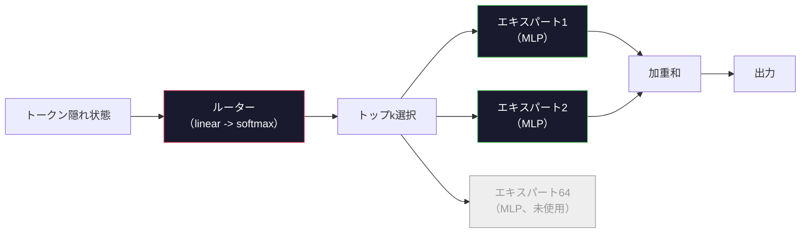

# オープンモデル：アーキテクチャ徹底解説

> レッスン04でGPT-2 Smallをゼロから構築した。2026年のフロンティアオープンモデルは同じファミリーに5つか6つの具体的な変更を加えたものだ。LayerNormの代わりにRMSNorm。GELUの代わりにSwiGLU。学習済み位置エンコーディングの代わりにRoPE。完全なMHAの代わりにGQAまたはMLA。スケールでのMixture-of-Experts。あなたがすでに知っている数学がそれらの95%をカバーする。このレッスンは、Llama 3、DeepSeek-V3、Mixtral、Qwen、Gemmaを並べて読み、各アーキテクチャが分岐する正確な行を示す。


## 学習目標

- Llama 3、Mistral、Mixtral、Gemma 2、Qwen 2.5、DeepSeek-V3のconfig.jsonを読み、すべてのフィールドを説明する
- 各モデルがGPT-2 Smallに対して行った具体的なアーキテクチャの変更を挙げ、ファーストプリンシプルから正当化する
- 設定だけから任意のオープンモデルのパラメータ数、KVキャッシュサイズ、アクティベーションメモリを計算する
- レイテンシ、メモリ、能力の制約を考慮してデプロイメントターゲットに最適なオープンモデルを選ぶ

## 課題

レッスン04でnumpyの350行を書いてGPT-2型のモデルを作った。Llama 3 405Bには200ページの技術レポートがある。あなたの直感はこれらが異なる存在だと言う。そうではない。200ページは同じオブジェクトを5つか6つのよく動機づけられた変更と、スケーリングに関する千の実装詳細で説明している。骨格——埋め込み、トランスフォーマーブロック、アテンション、MLP、ノルム、ヘッド——は変わっていない。

このレッスンはdiffだ。各主要オープンモデルファミリーについて、GPT-2から何が変わったか、なぜか、何がコストとなったかを正確にリストアップする。終わったら、MetaがLlama 5をリリースするかDeepSeekがV4をリリースするとき、新しいメンタルモデルを必要としない。設定を見て、どの既知のノブが動いたかを確認し、下流への影響を知ることができる。2026年のアーキテクチャは有限のツールボックスだ。各新モデルは異なるサブセットを選ぶ。

## コンセプト

### 不変のコア

すべての自己回帰オープンモデルは以下を共有する：

- トークン埋め込み行列（vocab_size × hidden_dim）。
- N個のデコーダーブロックのスタック：ノルム、セルフアテンション、残差、ノルム、MLP、残差。
- vocab_sizeに射影する最終ノルムと線形ヘッド（多くの場合、埋め込みと重み共有）。
- 因果マスク、次トークンのクロスエントロピー損失。

これが形だ。残りはノブだ。

### 実際に動く6つのノブ

2024〜2026年のすべてのフロンティアオープンモデルにわたって、同じ6つの設計選択が繰り返し選ばれる：

1. **正規化。** LayerNorm → RMSNorm。
2. **位置エンコーディング。** 学習済み絶対 → RoPE（変種あり：YaRN、NTK）。
3. **活性化。** GELU → SwiGLU（またはGeGLU）。
4. **アテンションヘッド共有。** MHA → GQA → MQA → MLA。
5. **密対疎MLP。** Dense → Mixture-of-Experts。
6. **Pre-normの配置。** Pre-normは残る。Post-normはなくなった。

それ以外（学習率スケジュール、データミックス、バッチサイズ、コンテキスト長）はアーキテクチャではなく学習設定に存在する。6つのノブ。

### ノブ1：RMSNorm

LayerNormは平均を引き、標準偏差で割り、スケールし、シフトする。RMSNormはスケールのみを保持する：

```
RMSNorm(x) = x / sqrt(mean(x^2) + eps) * gamma
```

平均の引き算なし。バイアスなし。トークンあたり1つのmatmulが減る。Zhang and Sennrich (2019)は、機械翻訳でLayerNormと同等のパフォーマンスを達成しながら10%高速化されると主張した。現代のすべてのオープンモデルが実行している。

コスト：なし。メリット：スループットの小さな向上、シンプルなコード。

### ノブ2：RoPE

学習済み位置埋め込みはGPT-2での1024スロットのルックアップテーブルだった。コンテキスト1025はテーブルの端を超える。モデルは学習長を超えて外挿できない。

Rotary Position Embedding（RoPE、Su et al. 2021）は、アテンションのドット積の前に各QとKベクトルをペアで回転させることで位置を注入する。回転の角度は位置の決定論的な関数であるため、学習されるものも不足するものもない。スケーリングトリック（NTKアウェアな補間、YaRN）を使えば、8kコンテキストで学習されたモデルは推論時に適度な精度損失で128kまで伸ばすことができる。

```
q_rotated = rotate(q, angle(pos))
k_rotated = rotate(k, angle(pos))
score = q_rotated . k_rotated
```

すべてのLlama、Mistral、Qwen、DeepSeek、GemmaはRoPEを使用している。Gemma 2はハイブリッド（ほとんどの層にRoPE、他の層にローカルスライディングウィンドウアテンション）を使用している。

### ノブ3：SwiGLU

GPT-2のMLPは`x -> gelu(xW1 + b1) -> (...)W2 + b2`だ。SwiGLU（Shazeer 2020）は活性化をゲートされた積で置き換える：

```
SwiGLU(x) = (xW1) * sigmoid(xW1) * xV
```

並列に2つの射影をSwish活性化でゲートする。パラメータあたりのパープレキシティで経験的に強力だ。Llama 2が採用し、みんなが続いた。MLPの隠れサイズは通常、元の密なMLPに合計パラメータ数が一致するように設定される：GPT-2が`ff_dim = 4 * hidden`を使った場合、SwiGLUは`ff_dim = (2/3) * 4 * hidden = 8/3 * hidden`を使う。

### ノブ4：アテンションヘッド共有

GPT-2は**Multi-Head Attention（MHA）**を使用：すべてのヘッドがQ、K、V射影を持つ。

**Multi-Query Attention（MQA、Shazeer 2019）**はすべてのヘッドに1つのKと1つのVを共有する。KVキャッシュをnum_headsで削減し、典型的なモデルで12〜32倍の削減だ。難しいベンチマークでの精度が少し落ちる。

**Grouped-Query Attention（GQA、Ainslie et al. 2023）**は中間の解決策：GグループのQヘッドが1つのKと1つのVを共有する。Llama 3 8BはGQAを使用し、32 Qヘッドと8 KVヘッド（G=8）で、KVキャッシュは完全なMHAに対して4倍縮小される。

**Multi-Head Latent Attention（MLA、DeepSeek 2024）**はKとVを共有の低ランクの潜在表現に圧縮し、ヘッドごとに再投影する。ヘッドごとの表現力を維持しながらKVキャッシュをさらに削減する。DeepSeek-V2とV3はこれに依存してロングコンテキストパフォーマンスを実現している。

| スキーム | KVヘッド | KVキャッシュ | 精度 |
|--------|----------|-------------|------|
| MHA    | num_heads | 完全 | 最高 |
| GQA    | num_groups (G < num_heads) | num_heads / G 削減 | MHAに近い |
| MQA    | 1 | num_heads 削減 | 小さな低下 |
| MLA    | 潜在、ヘッドごとに展開 | MQAより小さい | MHAに近い |

13B以上のモデルでは、GQAまたはMLAは事実上必須だ。スケールでの完全なMHAはKVキャッシュの問題だ。

### ノブ5：Mixture of Experts

密なMLPはすべてのトークンにすべてのパラメータを活性化する。MoE MLPはブロックあたりK個のエキスパートを持ち、ルーターがトークンごとにトップkのエキスパートを選ぶ（通常top-2）。それらのエキスパートの重みだけがトークンのフォワードパスを見る。

```
router_logits = xW_r
indices, weights = top_k(router_logits, k=2)
output = sum_i weights[i] * expert[indices[i]](x)
```

魅力：各7Bサイズの64エキスパート（総パラメータ数が巨大）を持ちながら、トークンあたり2つだけ実行する（トークンあたりの計算が密な7Bモデルと一致）。Mixtral 8x7Bは総パラメータ数47Bだが、トークンあたり13Bしか活性化しない。DeepSeek-V3は総パラメータ数671Bだが、トークンあたり37Bしか活性化しない。



長所：同じ計算量、より多くのパラメータ、より良いキャパシティ。短所：エキスパートのメモリは依然としてどこかに存在しなければならない（サービングには密な同等品よりもVRAMが必要）、ルーターの負荷分散が難しい、アライメント中のルーターの微調整はそれ自体が研究分野だ。

### ノブ6：Pre-normは残る

オリジナルのトランスフォーマーは各サブレイヤーの後にレイヤーノルムを適用した。GPT-2以来のすべてのオープンモデルは各サブレイヤーの*前*に配置する。Pre-normは深さでの学習が厳密に簡単だ。議論の余地はない。

### モデルごとのdiff

これをすべて具体的にする表だ。

| モデル | 年 | 総パラメータ | 活性化パラメータ | ノルム | 活性化 | 位置 | アテンション | MoE | コンテキスト |
|-------|------|-------------|----------------|------|--------|------|-------------|-----|----------|
| GPT-2 Small | 2019 | 124M | 124M | LayerNorm | GELU | 学習済み | MHA（12ヘッド） | なし | 1k |
| Llama 3 8B | 2024 | 8B | 8B | RMSNorm | SwiGLU | RoPE | GQA（32/8） | なし | 128k |
| Llama 3 70B | 2024 | 70B | 70B | RMSNorm | SwiGLU | RoPE | GQA（64/8） | なし | 128k |
| Llama 3 405B | 2024 | 405B | 405B | RMSNorm | SwiGLU | RoPE | GQA（128/16） | なし | 128k |
| Mistral 7B | 2023 | 7.2B | 7.2B | RMSNorm | SwiGLU | RoPE | GQA | なし | 32k |
| Mixtral 8x7B | 2023 | 47B | 13B | RMSNorm | SwiGLU | RoPE | GQA | あり（8エキスパート、top-2） | 32k |
| Gemma 2 9B | 2024 | 9B | 9B | RMSNorm（前後） | GeGLU | RoPE + スライディング | GQA | なし | 8k |
| Qwen 2.5 72B | 2024 | 72B | 72B | RMSNorm | SwiGLU | RoPE（YaRN） | GQA（64/8） | なし | 128k |
| DeepSeek V2 236B | 2024 | 236B | 21B | RMSNorm | SwiGLU | RoPE | MLA | あり（160エキスパート、top-6） | 128k |
| DeepSeek V3 | 2024 | 671B | 37B | RMSNorm | SwiGLU | RoPE | MLA | あり（256エキスパート、top-8） | 128k |

列をスキャンする。RMSNormはユニバーサルだ。SwiGLUまたはそのGeGLUの親戚はユニバーサルだ。RoPEはユニバーサルだ。7B以上ではMLAに置き換えられない限りGQAはユニバーサルだ。MoEはトップエンドでの差別化要因だ。

### config.jsonの読み方

Llama 3 8Bの設定：

```
{
  "hidden_size": 4096,
  "intermediate_size": 14336,
  "num_hidden_layers": 32,
  "num_attention_heads": 32,
  "num_key_value_heads": 8,
  "max_position_embeddings": 131072,
  "rope_theta": 500000.0,
  "rms_norm_eps": 1e-5,
  "vocab_size": 128256
}
```

すべてのフィールドはすでに実装したものに対応している。

- `hidden_size`：埋め込み次元。
- `intermediate_size`：MLPの隠れサイズ（3.5倍のhidden——SwiGLUの数学）。
- `num_hidden_layers`：スタックの深さ。
- `num_attention_heads`：Qヘッド数。
- `num_key_value_heads`：KVヘッド数（GQA）。
- `max_position_embeddings`：学習コンテキスト長。
- `rope_theta`：RoPEの基底周波数。Metaはロングコンテキストの外挿のためにデフォルトの10kから500kにスケールした。
- `rms_norm_eps`：数値安定性。
- `vocab_size`：トークン数。

これらだけから総パラメータ数、KVキャッシュ、ピークアクティベーションメモリを計算できる。正確な式については`code/main.py`を参照。

### アクティベーションメモリのバジェット

アクティベーションは数十億パラメータ以上のモデルでの学習メモリを支配する。事前学習のルールオブサム（勾配チェックポインティングあり）：

```
activation_mem ~ batch_size * seq_len * hidden_size * num_layers * bytes_per_element
```

Llama 3 8B、バッチ1、シーケンス8192、BF16、32層、hidden 4096の場合：チェックポインティングありでアクティベーションだけで約8 GB、なしで40 GB。flash-attentionとring-attentionが重要な理由はここにある——アクティベーションが収まるようにアテンション計算を書き直す。

### KVキャッシュのバジェット

最大コンテキストでの推論：

```
kv_cache = 2 * num_layers * num_kv_heads * head_dim * max_seq_len * bytes_per_element
```

Llama 3 8B、128kコンテキスト、BF16、head_dim = hidden / num_heads = 128：
`2 * 32 * 8 * 128 * 131072 * 2 = 17.2 GB`（シーケンスあたり）。

8Bの重みはBF16で16 GBだ。単一の128kシーケンスのKVキャッシュは重みより大きい。これがGQA、MLA、KVキャッシュ量子化の研究を推進しているメモリプレッシャーだ。

### 各モデルが勝つ場面

- **シングル80GB GPU、MoEなし**：Llama 3 8B、Mistral 7B、Gemma 2 9B。サービングが簡単、広いツールサポート。
- **シングルノード（8x80GB）、大きなキャパシティ**：Llama 3 70B、Qwen 2.5 72B。最高密度オープン能力。
- **最大のオープン能力、MoEの複雑さを許容**：DeepSeek V3、Mixtral 8x22B。アクティブFLOPあたりの最良能力。
- **ロングコンテキストニーズ**：Llama 3（RoPEスケーリングで128k）、DeepSeek（MLAの優位性）。
- **低レイテンシサービング**：Gemma 2 9B（スライディングウィンドウがロングコンテキストの計算をカット）。

## 実装する

レッスンのコードはカリキュレーターだ。任意のconfig.jsonが与えられると、コンポーネントごとのパラメータ数、最大コンテキストでのKVキャッシュ、SwiGLU MLPの比率、アーキテクチャの短評（dense / GQA / MLA / MoE）を出力する。

```python
config = {
    "hidden_size": 4096, "intermediate_size": 14336,
    "num_hidden_layers": 32, "num_attention_heads": 32,
    "num_key_value_heads": 8, "vocab_size": 128256,
    "max_position_embeddings": 131072,
}
```

スクリプトはアーキテクチャフィールドを一つひとつ辿り、埋め込み、アテンション（GQA削減あり）、MLP（SwiGLU拡張あり）、レイヤーノルム、ヘッドのパラメータ数を計算する。次に、指定されたコンテキスト長でのKVキャッシュを計算してサマリーを出力する。

実装については`code/main.py`を参照。

## 使ってみる

スクリプトにバンドルされているLlama 3 8B、Mistral 7B、Mixtral 8x7B、DeepSeek V3の設定でカリキュレーターを実行する。パラメータの内訳を比較する。MoEモデルは総パラメータ数が密なモデルをはるかに凌ぐが、活性化パラメータ数はしばしば小さいことに気づく。DeepSeek V3のKVキャッシュは総パラメータ数が多いにもかかわらずLlama 3 405Bよりも小さいことに気づく——これがMLAの効果だ。

次に、ローカルにある任意のモデルの設定を入力してサマリーを読み、GPUに収まるかどうかを判断する。

## 成果物を出す

このレッスンは`outputs/skill-open-model-picker.md`を生成する。デプロイメントターゲット（GPUタイプ、VRAM、コンテキスト長、レイテンシ予算）とタスクプロファイル（チャット、コード、推論、ロングコンテキスト）が与えられると、オープンモデル、レッスン11からの量子化スキーム、レッスン12からの推論スタックを、6つのアーキテクチャノブについての明示的な推論と共に推奨する。

## 演習

1. HuggingFaceからQwen 2.5 72Bの設定を読む。総パラメータ数をゼロから計算する。HFが報告する値と比較し、差分の由来を特定する（ヘッドdimの丸め、KV共有係数など）。

2. DeepSeek V3は256エキスパートでtop-8ルーティングを使用する。活性化されるエキスパートと総エキスパートの比率を計算し、Mixtral 8x7BのtopをMoEのtop-2と比較する。スパース（25%）からより密なスパース（3%）へのシフトは、FLOPあたりのキャパシティについて何を示唆しているか？

3. Llama 3 405BのKVキャッシュをFP8とBF16で128kコンテキストで計算する。FP8ではBF16の半分だ。シングル8xH100ノード（80GB×8 = 640GB合計、重みメモリを除く）で何個の並列シーケンスをサービングできるか？

4. Gemma 2はフルアテンション層とスライディングウィンドウアテンション層を交互に使用する。半分の層が4096トークンのスライディングウィンドウを使用する場合のKVキャッシュの数学を書く。8k総コンテキストでどれだけのメモリを節約できるか？

5. このレッスンが書かれた後にリリースされた最近のフロンティアオープンモデルを見つける。それが選んだ6つのノブとそれが7番目のノブを導入したかどうかを特定する。新しいアーキテクチャがリリースされた瞬間にカリキュラムは古くなる——目標はメンタルモデルを再構築せずにテーブルを更新することだ。

## キーワード

| 用語 | 人々が言うこと | 実際の意味 |
|------|----------------|-----------|
| RMSNorm | 「平均なしのLayerNorm」 | 二乗平均平方根のみで正規化し、学習済みスケールを持つ——LayerNormより安価で同等 |
| RoPE | 「回転位置」 | 位置に依存する角度で2Dのペアで各QとKベクトルを回転させる——スケーリングトリックで学習長を超えて外挿 |
| SwiGLU | 「新しいMLP活性化」 | Swishを使ったゲート付き線形ユニット：`(xW1) * sigmoid(xW1) * xV`——2024年以降のすべてのオープンモデルの標準 |
| GQA | 「中間のアテンション」 | Grouped-Query Attention：GグループのQヘッドが1つのKと1つのVヘッドを共有——MQAの精度低下なしでKVキャッシュを縮小 |
| MLA | 「DeepSeekのアテンション」 | Multi-Head Latent Attention：K/Vを共有の低ランク潜在表現に圧縮し、ヘッドごとに展開——大規模モデルの最小KVキャッシュ |
| MoE | 「スパースエキスパート」 | Mixture of Experts：ブロックあたりN個のMLP、ルーターがトークンごとにトップkを選ぶ——大きな総パラメータ、小さな活性化パラメータ |
| Top-kルーティング | 「トークンごとにkエキスパートを選ぶ」 | ルーターがエキスパートごとのスコアを計算してk番目が最高のものを活性化——典型的なkはMixtralで2、DeepSeekで8 |
| YaRN | 「RoPEを伸ばす」 | Yet another RoPE extension——推論時に8kから128k+にコンテキストを延長するために回転角を補間する |
| スライディングウィンドウアテンション | 「全部に注目しない」 | 各トークンは最後のWトークンにのみ注目——トークンあたりのアテンションコストをO(W)に制限、Gemma 2と初期Mistralで使用 |
| 活性化パラメータ | 「トークンごとに動くもの」 | MoEモデルの場合、トークンごとのフォワードパスを見るパラメータ数（総パラメータよりはるかに小さい）——トークンあたりのFLOPsを支配 |

## 参考資料

- [Dubey et al., 2024 -- "The Llama 3 Herd of Models"](https://arxiv.org/abs/2407.21783) -- 密なLlama 3ファミリーのアーキテクチャと学習リファレンス
- [DeepSeek-AI, 2024 -- "DeepSeek-V3 Technical Report"](https://arxiv.org/abs/2412.19437) -- MLA + 補助損失なし負荷分散 + 671B MoE
- [Jiang et al., 2024 -- "Mixtral of Experts"](https://arxiv.org/abs/2401.04088) -- 標準的なMoEオープンモデル論文
- [Su et al., 2021 -- "RoFormer: Enhanced Transformer with Rotary Position Embedding"](https://arxiv.org/abs/2104.09864) -- RoPEの論文
- [Shazeer, 2020 -- "GLU Variants Improve Transformer"](https://arxiv.org/abs/2002.05202) -- SwiGLU、GeGLUとその仲間
- [Ainslie et al., 2023 -- "GQA: Training Generalized Multi-Query Transformer Models"](https://arxiv.org/abs/2305.13245) -- GQAの論文
- [Gemma 2 Team, 2024 -- "Gemma 2: Improving Open Language Models at a Practical Size"](https://arxiv.org/abs/2408.00118) -- ハイブリッドフル+スライディングアテンション、pre+post-norm
- [Qwen Team, 2024 -- "Qwen 2.5 Technical Report"](https://arxiv.org/abs/2412.15115) -- YaRNコンテキスト拡張とロングコンテキスト学習レシピ
