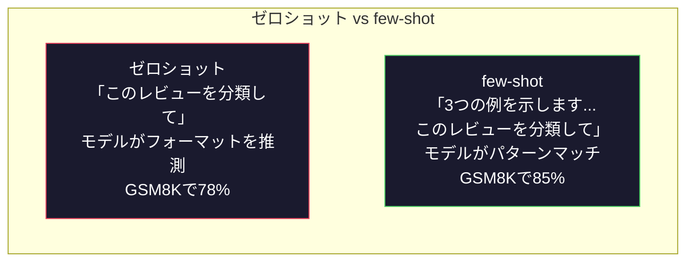
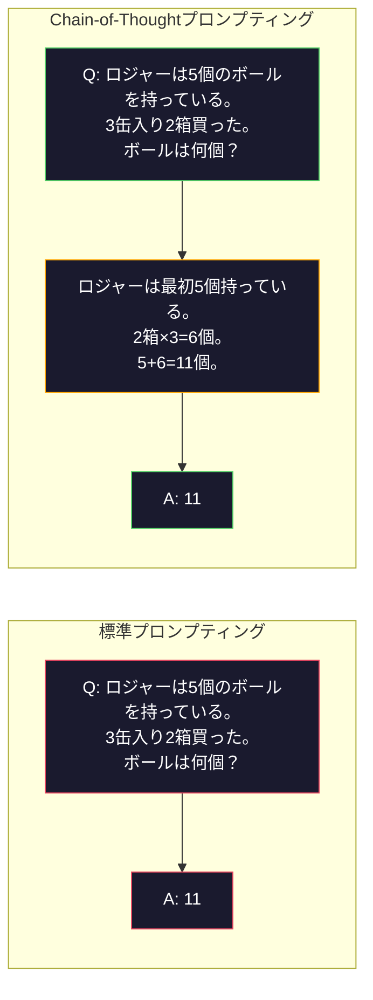
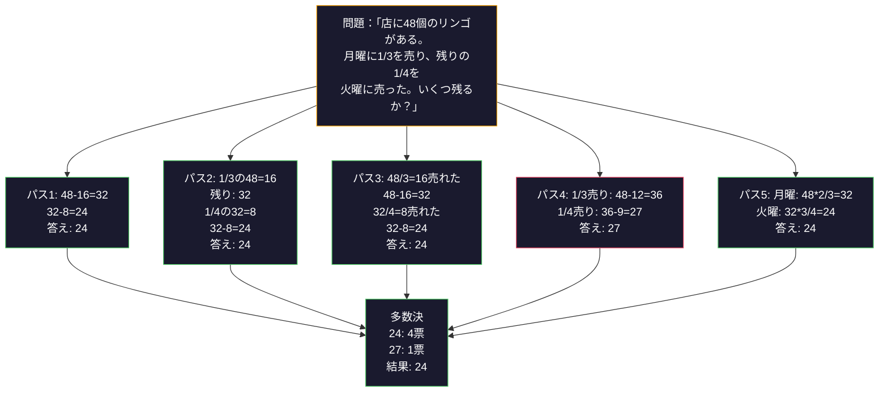
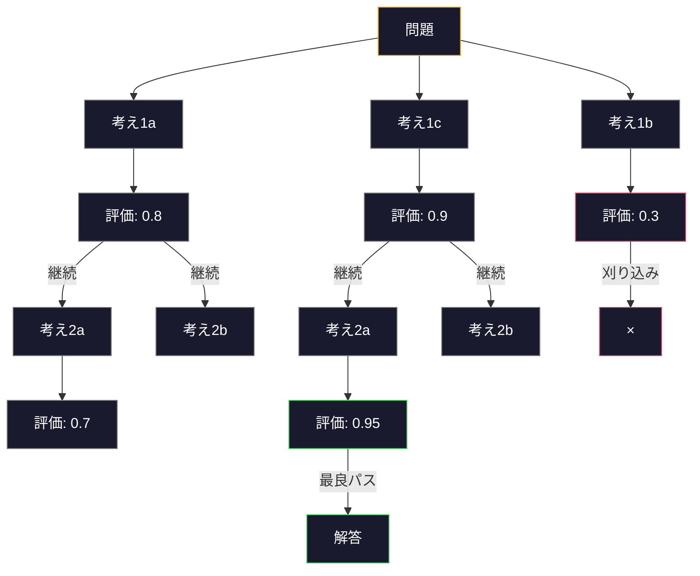

# few-shot・Chain-of-Thought・Tree-of-Thought

> モデルに何をすべきかを伝えるのはプロンプティングだ。どう考えるかを見せるのがエンジニアリングだ。同じモデル・同じタスク・同じデータで78%から91%へのギャップは、より良いモデルによるものではない。より良い推論戦略によるものだ。


## 学習目標

- タスクの精度を最大化する例示のデモンストレーションを選択・フォーマットして、few-shot promptingを実装する
- Chain-of-Thought（CoT）推論を適用し、数学の文章題のような多段階問題の精度を向上させる
- 複数の推論パスを探索して最良のものを選ぶTree-of-Thoughtプロンプトを構築する
- ゼロショット vs few-shot vs CoTの精度向上を標準ベンチマークで計測する

## 問題

数学チュータリングアプリを構築する。プロンプトに書く：「この文章題を解いてください。」GPT-5はGSM8K（小学校レベルの数学標準ベンチマーク）で94%の精度を達成する。もうピークに達したと思う。でも違う——Chain-of-Thoughtでさらに3〜4ポイント上がる。

「Let's think step by step」の5単語を追加すると、精度は91%に跳ね上がる。いくつかの解答済み例を追加すると95%に達する。同じモデル。同じtemperature。同じAPIコスト。唯一の違いは、モデルに下書き用紙を渡したことだ。

これはハックではない。推論がどのように機能するかということだ。人間は多段階の問題を1回の精神的な飛躍で解くわけではない。トランスフォーマーも同じだ。モデルに中間トークンを生成させると、それらのトークンが次のトークンのコンテキストになる。各推論ステップが次のステップを駆動する。モデルは文字通り答えへと計算していく。

しかし「step by step」は始まりに過ぎない。5つの推論パスをサンプリングして多数決を取ったら？モデルが可能性のツリーを探索し、分岐を評価・刈り込むことを許したら？推論とツール使用を交互に行ったら？これらは仮説ではない。計測された改善を持つ発表済みの技術であり、このレッスンですべて構築する。

## 概念

### ゼロショット vs few-shot：例が指示に勝る場合

ゼロショットプロンプティングはモデルにタスクだけを与える。few-shotプロンプティングは最初に例を与える。

Wei et al.（2022）は8つのベンチマークで計測した。感情分類のようなシンプルなタスクでは、ゼロショットとfew-shotは2%以内の差だった。多段階算術や記号推論のような複雑なタスクでは、few-shotが精度を10〜25%向上させた。

直感的な理由：例は圧縮された指示だ。出力フォーマットを説明する代わりに見せる。推論プロセスを説明する代わりにデモンストレーションする。モデルは抽象的な指示を解釈するよりも、例のパターンマッチングをより確実に行う。



**few-shotが勝つ場合：** フォーマット重視のタスク・分類・構造化抽出・ドメイン固有の専門用語・特定のパターンに合わせる必要があるタスク。

**ゼロショットが勝つ場合：** シンプルな事実の質問・例が創造性を制約する創作タスク・良い例を見つけることが良い指示を書くよりも難しいタスク。

### 例の選択：類似性がランダムより優れる

すべての例が同じではない。ターゲット入力に類似した例を選ぶと、分類タスクでランダム選択より5〜15%優れる（Liu et al., 2022）。3つの原則：

1. **意味的類似性**：埋め込み空間で入力に最も近い例を選ぶ
2. **ラベルの多様性**：例ですべての出力カテゴリをカバーする
3. **難易度の一致**：ターゲット問題の複雑さのレベルに合わせる

ほとんどのタスクで最適な例の数は3〜5個だ。3つ未満ではパターンを抽出するシグナルが不十分。5つ超えると収益逓減が始まりコンテキストウィンドウトークンが無駄になる。

### Chain-of-Thought：モデルに下書き用紙を渡す

Chain-of-Thought（CoT）プロンプティングはGoogleブレインのWei et al.（2022）が発表した。アイデアはシンプル：モデルに答えだけを求めるのではなく、最初に推論ステップを見せるよう求める。



なぜこれがメカニズム的に機能するのか？トランスフォーマーが生成する各トークンは次のトークンのコンテキストになる。CoTなしでは、モデルはすべての推論を1回のフォワードパスの隠れ状態に圧縮しなければならない。CoTありでは、モデルは中間計算をトークンとして外部化する。

**GSM8Kベンチマーク（小学校レベルの算数、8500問）：**

| モデル | ゼロショット | ゼロショットCoT | few-shotCoT |
|-------|-----------|---------------|--------------|
| GPT-4o | 78% | 91% | 95% |
| GPT-5 | 94% | 97% | 98% |
| o4-mini（推論） | 97% | — | — |
| Claude Opus 4.7 | 93% | 97% | 98% |
| Gemini 3 Pro | 92% | 96% | 98% |
| Llama 4 70B | 80% | 89% | 94% |
| DeepSeek-V3.1 | 89% | 94% | 96% |

**推論モデルについての注記。** OpenAIのoシリーズ（o3、o4-mini）やDeepSeek-R1のようなモデルは、答えを出す前に内部でChain-of-Thoughtを実行する。推論モデルに「ステップバイステップで考えて」を追加するのは冗長で、時に逆効果になる。

CoTの2つの種類：

**ゼロショットCoT**：プロンプトに「Let's think step by step」を追加する。例は不要。Kojima et al.（2022）はこの1文が算術・常識・記号推論タスク全体で精度を向上させることを示した。

**few-shotCoT**：推論ステップを含む例を提供する。モデルが期待する推論フォーマットを見ることができるため、ゼロショットCoTより効果的だ。

**CoTが逆効果になる場合**：シンプルな事実の確認（「フランスの首都は？」）・シングルステップの分類・速度が精度より重要なタスク。CoTは1クエリごとに50〜200トークンの推論オーバーヘッドを追加する。

### Self-Consistency：多数サンプリングして1回投票する

Wang et al.（2023）がself-consistencyを発表した。洞察：単一のCoTパスには推論エラーが含まれるかもしれない。しかしN個の独立した推論パスをサンプリング（temperature > 0を使用）して最終答えで多数決を取れば、エラーが相殺される。



トレードオフ：Nサンプルはその分のAPIコストとレイテンシを意味する。実際にはN=5でほとんどの利益が得られる。N=3が意味のある投票の最小値。

### Tree-of-Thought：分岐的な探索

Yao et al.（2023）がTree-of-Thought（ToT）を発表した。CoTが1本の線形推論パスをたどるのに対して、ToTは複数の分岐を探索し、最も有望なものを評価してから続ける。



ToTの3つのコンポーネント：

1. **思考の生成**：複数の次のステップ候補を生成する
2. **状態の評価**：各候補をスコアリングする（LLM自身をエバリュエータとして使える）
3. **探索アルゴリズム**：ツリーをBFSまたはDFSで探索し、スコアの低い分岐を刈り込む

「24のゲーム」（4つの数字を算術演算で24にする）タスクで、GPT-4は標準プロンプティングで問題の7.3%しか解けない。CoTでは4.0%（CoTは実際に逆効果）。ToTでは74%。

ToTは高コストだ。ツリーの各ノードにLLMコールが必要。分岐係数3・深さ3のツリーは最大39回のLLMコールが必要。探索空間が広いが評価可能な問題——計画・パズル解決・制約付き創造的問題解決——にのみ使用すること。

### ReAct：考えること＋すること

Yao et al.（2022）が推論トレースとアクションを組み合わせた。モデルは思考（推論の生成）と行動（ツール呼び出し・検索・計算）を交互に行う。

```mermaid
graph LR
    Q["質問：\nエッフェル塔が\nある国の\n人口は？"]
    T1["思考：エッフェル塔が\nある国を\n調べる必要がある"]
    A1["アクション：検索\n「エッフェル塔の場所」"]
    O1["観察：\nパリ、フランス"]
    T2["思考：次は\nフランスの人口を調べる"]
    A2["アクション：検索\n「フランスの人口2024」"]
    O2["観察：\n6840万人"]
    T3["思考：\n答えがわかった"]
    F["答え：\n6840万人"]

    Q --> T1 --> A1 --> O1 --> T2 --> A2 --> O2 --> T3 --> F

    style Q fill:#1a1a2e,stroke:#ffa500,color:#fff
    style T1 fill:#1a1a2e,stroke:#51cf66,color:#fff
    style A1 fill:#1a1a2e,stroke:#e94560,color:#fff
    style O1 fill:#1a1a2e,stroke:#808080,color:#fff
    style T2 fill:#1a1a2e,stroke:#51cf66,color:#fff
    style A2 fill:#1a1a2e,stroke:#e94560,color:#fff
    style O2 fill:#1a1a2e,stroke:#808080,color:#fff
    style T3 fill:#1a1a2e,stroke:#51cf66,color:#fff
    style F fill:#1a1a2e,stroke:#51cf66,color:#fff
```



ReActは知識集約型タスクで純粋なCoTより優れる。推論エラーが観察によって修正される——モデルは実行中盤でプランを更新できる。

ReActは現代AIエージェントの基礎だ。すべてのエージェントフレームワーク（LangChain、CrewAI、AutoGen）はThought-Action-Observationループの何らかのバリアントを実装している。

### 構造化プロンプティング：XMLタグ・デリミタ・ヘッダー

**XMLタグ**（Claudeで最も効果的、他でも確実）：
```
<context>
You are reviewing a pull request.
The codebase uses TypeScript and React.
</context>

<task>
Review the following diff for bugs, security issues, and style violations.
</task>

<diff>
{diff_content}
</diff>

<output_format>
List each issue with: file, line, severity (critical/warning/info), description.
</output_format>
```

**Markdownヘッダー**（汎用的）：
```
## Role
Senior security engineer at a fintech company.

## Task
Analyze this API endpoint for vulnerabilities.

## Input
{api_code}

## Rules
- Focus on OWASP Top 10
- Rate each finding: critical, high, medium, low
- Include remediation steps
```

**デリミタ**（最小限だが効果的）：
```
---INPUT---
{user_text}
---END INPUT---

---INSTRUCTIONS---
Summarize the above in 3 bullet points.
---END INSTRUCTIONS---
```

### プロンプトチェーニング：逐次分解

一部のタスクは単一のプロンプトには複雑すぎる。プロンプトチェーニングはそれをステップに分割し、あるプロンプトの出力が次のプロンプトの入力になる。


### パフォーマンス比較

| 技術 | 最適用途 | GSM8K精度（GPT-5） | APIコール | トークンオーバーヘッド | 複雑さ |
|-----------|----------|------------------------|-----------|----------------|------------|
| ゼロショット | シンプルなタスク | 94% | 1 | なし | 極めて低い |
| few-shot | フォーマットマッチング | 96% | 1 | 200〜500トークン | 低い |
| ゼロショットCoT | クイック推論ブースト | 97% | 1 | 50〜200トークン | 極めて低い |
| few-shotCoT | 最大シングルコール精度 | 98% | 1 | 300〜600トークン | 低い |
| Self-Consistency（N=5） | 高リスク推論 | 98.5% | 5 | コスト5倍 | 中程度 |
| 推論モデル（o4-mini） | CoTのドロップイン代替 | 97% | 1 | 隠れた（内部で2〜10倍） | 極めて低い |
| Tree-of-Thought | 探索・計画問題 | 非対応（24のゲームで74%） | 10〜40以上 | コスト10〜40倍 | 高い |
| ReAct | 知識に基づく推論 | 非対応（HotpotQAで35.1%） | 3〜10以上 | 可変 | 高い |
| プロンプトチェーニング | 複雑な多段階タスク | 96%（パイプライン） | 2〜5 | コスト2〜5倍 | 中程度 |

## 実装する

few-shot prompting・Chain-of-Thought推論・self-consistency投票を単一パイプラインに組み合わせた数学問題ソルバーを構築する。難問にはTree-of-Thoughtも追加する。

### Step 1: few-shot例ストア

```python
GSM8K_EXAMPLES = [
    {
        "question": "Janet's ducks lay 16 eggs per day. She eats three for breakfast every morning and bakes muffins for her friends every day with four. She sells every egg at the farmers' market for $2. How much does she make every day at the farmers' market?",
        "reasoning": "Janet's ducks lay 16 eggs per day. She eats 3 and bakes 4, using 3 + 4 = 7 eggs. So she has 16 - 7 = 9 eggs left. She sells each for $2, so she makes 9 * 2 = $18 per day.",
        "answer": "18"
    },
    ...
]
```

各例には3つの部分がある：問題・推論チェーン・最終答え。推論チェーンが普通のfew-shot例をCoT few-shot例に変換するものだ。

### Step 2: Chain-of-Thoughtプロンプトビルダー

```python
def build_cot_prompt(question, examples, num_examples=3):
    system = (
        "You are a math problem solver. "
        "For each problem, show your step-by-step reasoning, "
        "then give the final numerical answer on the last line "
        "in the format: 'The answer is [number]'."
    )

    example_text = ""
    for ex in examples[:num_examples]:
        example_text += f"Q: {ex['question']}\n"
        example_text += f"A: {ex['reasoning']} The answer is {ex['answer']}.\n\n"

    user = f"{example_text}Q: {question}\nA:"
    return system, user
```

フォーマット制約（「The answer is [number]」）は重要。これなしでは、self-consistencyがサンプル間で答えを抽出して比較できない。

### Step 3: Self-Consistency投票

N個の推論パスをサンプリングして多数決答えを取る。

```python
def self_consistency_solve(question, examples, client, model, n_samples=5):
    system, user = build_cot_prompt(question, examples)

    answers = []
    reasonings = []
    for _ in range(n_samples):
        response = client.chat.completions.create(
            model=model,
            messages=[
                {"role": "system", "content": system},
                {"role": "user", "content": user}
            ],
            temperature=0.7
        )
        text = response.choices[0].message.content
        reasonings.append(text)
        answer = extract_answer(text)
        if answer is not None:
            answers.append(answer)

    vote_counts = Counter(answers)
    best_answer = vote_counts.most_common(1)[0][0] if vote_counts else None
    confidence = vote_counts[best_answer] / len(answers) if best_answer else 0

    return best_answer, confidence, reasonings, vote_counts
```

temperature 0.7が重要。temperature 0.0ではN個のサンプルが同一になり目的が失われる。多様な推論パスには十分なランダム性が必要だが、モデルがナンセンスを生成するほど高くてはいけない。

### Step 4: Tree-of-Thoughtソルバー

線形推論が失敗する問題に対して、ToTは複数のアプローチを探索して最も有望な方向を評価する。

```python
def tree_of_thought_solve(question, client, model, breadth=3, depth=3):
    thoughts = generate_initial_thoughts(question, client, model, breadth)
    scored = [(t, evaluate_thought(t, question, client, model)) for t in thoughts]
    scored.sort(key=lambda x: x[1], reverse=True)

    for current_depth in range(1, depth):
        next_thoughts = []
        for thought, score in scored[:2]:
            extensions = extend_thought(thought, question, client, model, breadth)
            for ext in extensions:
                ext_score = evaluate_thought(ext, question, client, model)
                next_thoughts.append((ext, ext_score))
        scored = sorted(next_thoughts, key=lambda x: x[1], reverse=True)

    best_thought = scored[0][0] if scored else ""
    return extract_answer(best_thought), best_thought
```

エバリュエータ自体がLLMコールだ。モデルに尋ねる：「この推論パスは問題を解くのにどれだけ有望か、0.0から1.0で評価してください。」これがToTの重要な洞察——モデルが自分の部分的な解答を評価する。

### Step 5: フルパイプライン

エスカレーション戦略を持ってすべての技術を組み合わせる。

```python
def solve_with_escalation(question, examples, client, model):
    system, user = build_cot_prompt(question, examples)
    single_response = call_llm(client, model, system, user, temperature=0.0)
    single_answer = extract_answer(single_response)

    sc_answer, confidence, _, _ = self_consistency_solve(
        question, examples, client, model, n_samples=5
    )

    if confidence >= 0.8:
        return sc_answer, "self_consistency", confidence

    tot_answer, _ = tree_of_thought_solve(question, client, model)
    return tot_answer, "tree_of_thought", None
```

エスカレーションロジック：まず安価な方法（シングルCoT）を試みる。self-consistencyの信頼度が0.8未満（5サンプル中4つ以下が一致）の場合、ToTにエスカレーション。これでコストと精度のバランスをとる。

## 使ってみる

### LangChainで使う

```python
from langchain_core.prompts import FewShotPromptTemplate, PromptTemplate
from langchain_openai import ChatOpenAI

example_prompt = PromptTemplate(
    input_variables=["question", "reasoning", "answer"],
    template="Q: {question}\nA: {reasoning} The answer is {answer}."
)

few_shot_prompt = FewShotPromptTemplate(
    examples=examples,
    example_prompt=example_prompt,
    suffix="Q: {input}\nA: Let's think step by step.",
    input_variables=["input"]
)

llm = ChatOpenAI(model="gpt-4o", temperature=0.7)
chain = few_shot_prompt | llm
result = chain.invoke({"input": "If a train travels 120 km in 2 hours..."})
```

LangChainにはセマンティック類似性選択の`ExampleSelector`クラスもある：

```python
from langchain_core.example_selectors import SemanticSimilarityExampleSelector
from langchain_openai import OpenAIEmbeddings

selector = SemanticSimilarityExampleSelector.from_examples(
    examples,
    OpenAIEmbeddings(),
    k=3
)
```

### DSPyで使う

DSPyはプロンプティング戦略を最適化可能なモジュールとして扱う。CoTプロンプトを手作りする代わりに、シグネチャを定義してDSPyがプロンプトを最適化する：

```python
import dspy

dspy.configure(lm=dspy.LM("openai/gpt-4o", temperature=0.7))

class MathSolver(dspy.Module):
    def __init__(self):
        self.solve = dspy.ChainOfThought("question -> answer")

    def forward(self, question):
        return self.solve(question=question)

solver = MathSolver()
result = solver(question="Janet's ducks lay 16 eggs per day...")
```

DSPyの`ChainOfThought`は自動的に推論トレースを追加する。`dspy.majority`はself-consistencyを実装する：

```python
result = dspy.majority(
    [solver(question=q) for _ in range(5)],
    field="answer"
)
```

### 比較：ゼロから vs フレームワーク

| 機能 | ゼロから（このレッスン） | LangChain | DSPy |
|---------|--------------------------|-----------|------|
| プロンプトフォーマットの制御 | 完全 | テンプレートベース | 自動 |
| self-consistency | 手動投票 | 手動 | 組み込み（`dspy.majority`） |
| 例の選択 | カスタムロジック | `ExampleSelector` | `dspy.BootstrapFewShot` |
| Tree-of-Thought | カスタムツリー探索 | コミュニティチェーン | 組み込みなし |
| プロンプト最適化 | 手動イテレーション | 手動 | 自動コンパイル |
| 最適用途 | 学習・カスタムパイプライン | 標準ワークフロー | 研究・最適化 |

## 成果物を出す

このレッスンでは2つのアーティファクトを生成する。

**1. 推論チェーンプロンプト**（`outputs/prompt-reasoning-chain.md`）：few-shotCoTとself-consistencyのための本番対応プロンプトテンプレート。例と問題ドメインを入れるだけ。

**2. CoTパターン選択スキル**（`outputs/skill-cot-patterns.md`）：タスクタイプ・精度要件・コスト制約に基づいて適切な推論技術を選ぶための意思決定フレームワーク。

## 演習

1. **ギャップを計測する**：10個のGSM8K問題を取る。それぞれをゼロショット・few-shot・ゼロショットCoT・few-shotCoTで解く。各手法の精度を記録する。自分のモデルでどの手法が最大の改善をもたらすか？

2. **例の選択実験**：同じ10問に対して、ランダムな例の選択と手動で選んだ類似例を比較する。精度の差を計測する。例の品質が例の量より重要になる時点はどこか？

3. **self-consistencyコスト曲線**：20のGSM8K問題でN=1、3、5、7、10のself-consistencyを実行する。精度対コスト（合計トークン）をプロットする。自分のモデルでカーブの折れ目はどこか？

4. **ReActループを構築する**：計算機ツールでパイプラインを拡張する。モデルが数式を生成したとき、Pythonの`eval()`（サンドボックス内）で実行して結果を返す。ツールに根ざした推論が純粋なCoTより優れるかどうかを計測する。

5. **創作タスクのToT**：Tree-of-Thoughtソルバーを創作タスク用に適応させる：「面白くて悲しい6ワードの物語を書いて。」LLMをエバリュエータとして使う。分岐的な探索がシングルショット生成より良い創作アウトプットを生むか？

## キーワード

| 用語 | 一般的な言い方 | 実際の意味 |
|------|----------------|----------------------|
| few-shot prompting | 「例を与える」 | モデルの出力フォーマットと挙動を固定するために、プロンプトに入出力デモンストレーションを含める |
| Chain-of-Thought | 「ステップバイステップで考えさせる」 | 最終答えを出す前に中間推論トークンを引き出し、モデルの有効な計算量を拡張する |
| Self-Consistency | 「何度も実行する」 | temperature > 0でN個の多様な推論パスをサンプリングし、多数決で最も一般的な最終答えを選ぶ |
| Tree-of-Thought | 「オプションを探索させる」 | 各部分的な解決策が評価され、有望なパスのみが拡張される推論分岐上の構造化探索 |
| ReAct | 「思考＋ツール使用」 | Thought-Action-Observationループで推論トレースと外部アクション（検索・計算・APIコール）を交互に行う |
| プロンプトチェーニング | 「ステップに分割する」 | 複雑なタスクを連続的なプロンプトに分解し、各出力が次の入力を供給する |
| ゼロショットCoT | 「「ステップバイステップで考えて」を追加するだけ」 | 例なしで推論トリガーフレーズをプロンプトに追加し、モデルの潜在的な推論能力に依存する |

## 参考資料

- [Chain-of-Thought Prompting Elicits Reasoning in Large Language Models](https://arxiv.org/abs/2201.11903) — Wei et al. 2022。GoogleブレインのオリジナルCoT論文。セクション2〜3で核心的な結果を確認。
- [Self-Consistency Improves Chain of Thought Reasoning in Language Models](https://arxiv.org/abs/2203.11171) — Wang et al. 2023。self-consistency論文。表1に必要な数値がすべて載っている。
- [Tree of Thoughts: Deliberate Problem Solving with Large Language Models](https://arxiv.org/abs/2305.10601) — Yao et al. 2023。ToT論文。セクション4の「24のゲーム」の結果がハイライト。
- [ReAct: Synergizing Reasoning and Acting in Language Models](https://arxiv.org/abs/2210.03629) — Yao et al. 2022。現代AIエージェントの基礎。セクション3でThought-Action-Observationループを説明。
- [Large Language Models are Zero-Shot Reasoners](https://arxiv.org/abs/2205.11916) — Kojima et al. 2022。「Let's think step by step」論文。シンプルさの割に驚くほど効果的。
- [DSPy: Compiling Declarative Language Model Calls into Self-Improving Pipelines](https://arxiv.org/abs/2310.03714) — Khattab et al. 2023。プロンプティングをコンパイル問題として扱う。手動プロンプトエンジニアリングを超えたい場合に読む。
- [OpenAI — 推論モデルガイド](https://platform.openai.com/docs/guides/reasoning) — Chain-of-Thoughtが内部的な価格付きトークンの「推論」モードになる場合とプロンプトレベルのトリックになる場合のベンダーガイダンス。
- [Lightman et al., 「Let's Verify Step by Step」(2023)](https://arxiv.org/abs/2305.20050) — チェーンの各ステップを採点するプロセスリワードモデル（PRM）。結果のみの報酬に続く推論監督シグナル。
- [Snell et al., 「Scaling LLM Test-Time Compute Optimally」(2024)](https://arxiv.org/abs/2408.03314) — CoTの長さ・self-consistencyサンプリング・MCTSの体系的な研究。精度がレイテンシより重要な場合に「step by step」がどこまで進化するか。
