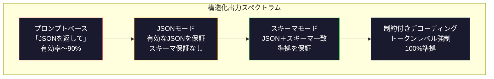
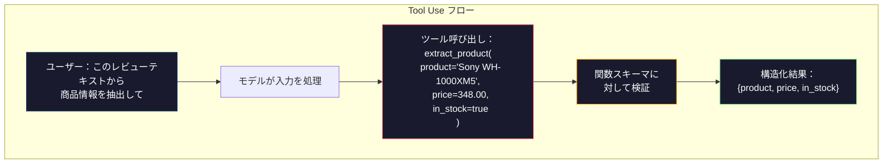

# 構造化出力：JSON・スキーマバリデーション・制約付きデコーディング

> LLMが返すのは文字列だ。アプリケーションが必要なのはJSONだ。このギャップは、どんなモデルの幻覚よりも多くの本番システムをクラッシュさせてきた。構造化出力は自然言語と型付きデータの橋だ。うまくやれば、LLMは信頼できるAPIになる。失敗すれば、深夜3時にregexで自由テキストをパースすることになる。

**関連レッスン:** フェーズ5・20（構造化出力と制約付きデコーディング）でデコーダーレベルの理論（FSM/CFGロジットプロセッサ・Outlines・XGrammar）を解説。このレッスンは本番SDKサーフェス（OpenAI `response_format`・Anthropicのtool use・Instructor）に焦点を当てる。

## 学習目標

- OpenAIとAnthropicのAPIパラメータを使ってJSON-modeとスキーマ制約付き出力を実装する
- 不正なLLM出力を拒否してエラーフィードバックでリトライするPydanticバリデーション層を構築する
- 制約付きデコーディングがpost-processingなしにトークンレベルで有効なJSONを強制する方法を説明する
- 非構造化テキストを型付きデータ構造に確実に変換する堅牢な抽出プロンプトを設計する

## 問題

LLMに「このテキストから商品名・価格・在庫状況を抽出してください」と尋ねる。返答：

```
Sony WH-1000XM5ヘッドフォンは348ドルで、現在在庫あり。
```

これは完全に正しい答えだ。しかしアプリケーションには完全に使い物にならない。在庫システムには`{"product": "Sony WH-1000XM5", "price": 348.00, "in_stock": true}`が必要だ。特定のキー・型・値の制約を持つJSONオブジェクトが必要で、文章は不要だ。

ナイーブな解決策：プロンプトに「JSONで答えてください」を追加する。90%の場合はうまくいく。残り10%では、モデルがJSONをMarkdownコードフェンスで囲んだり、「以下がJSONです：」という前文を追加したり、括弧を途中で閉じてしまって構文的に無効なJSONを生成したりする。JSONパーサーがクラッシュする。パイプラインが壊れる。try/exceptとリトライループを追加する。リトライで異なるデータが生成されることがある。パース問題に加えて一貫性問題が発生する。

これはプロンプトエンジニアリングの問題ではない。デコーディングの問題だ。

## 概念

### 構造化出力スペクトラム

構造化出力制御には4つのレベルがある。



**プロンプトベース**（「有効なJSONで答えてください」）：強制なし。モデルは通常従うが、時々従わない。信頼性：〜90%。

**JSONモード**：APIが出力が有効なJSONであることを保証する。OpenAIの`response_format: { type: "json_object" }`がこれを有効にする。出力はエラーなしでパースできる。しかし期待するスキーマに一致しない場合がある。

**スキーマモード**：APIがJSON Schemaを受け取り、出力がそれに一致することを保証する。2026年には主要プロバイダー全員がこれをネイティブにサポート。

**制約付きデコーディング**：生成中の各トークン位置で、無効な出力を生成するすべてのトークンをマスクアウトする。モデルは有効な出力につながるトークンのみを生成できる。

### JSON Schema：コントラクト言語

JSON Schemaは、出力がどのような形状でなければならないかをモデル（またはバリデーション層）に伝える方法だ。

```json
{
  "type": "object",
  "properties": {
    "product": { "type": "string" },
    "price": { "type": "number", "minimum": 0 },
    "in_stock": { "type": "boolean" },
    "categories": {
      "type": "array",
      "items": { "type": "string" }
    }
  },
  "required": ["product", "price", "in_stock"]
}
```

### Pydanticパターン

Pythonでは、JSON Schemaを手で書かない。Pydanticモデルを定義すればスキーマを自動生成してくれる。

```python
from pydantic import BaseModel

class Product(BaseModel):
    product: str
    price: float
    in_stock: bool
    categories: list[str] = []
```

### Function Calling / Tool Use

同じ問題への代替インターフェース。モデルに直接JSONを生成させる代わりに、型付きパラメータを持つ「ツール」（関数）を定義する。モデルは構造化された引数を持つ関数呼び出しを出力する。OpenAIはこれを「function calling」と呼ぶ。Anthropicは「tool use」と呼ぶ。



### 一般的な失敗パターン

**幻覚値**：出力がスキーマに一致するが、でたらめなデータが含まれる。テキストに$348と書いてあるのにモデルが`{"price": 299.99}`を返す。

**enum混乱**：フィールドを`["in_stock", "out_of_stock", "preorder"]`に制約したが、モデルが`"available"`を返す。

**ネストオブジェクトの深さ**：深くネストされたスキーマ（4+レベル）はエラーが多くなる。

**任意フィールドの省略**：技術的には任意だが意味的には重要なフィールドをモデルが省略する。スキーマで必須に設定し、データがない場合は`null`を明示的に返させる。

## 実装する

### Step 1: JSON Schemaバリデーター

PythonオブジェクトがJSON Schemaに一致するかどうかをチェックするバリデーターをゼロから構築する。

```python
import json

def validate_schema(data, schema):
    errors = []
    _validate(data, schema, "", errors)
    return errors

def _validate(data, schema, path, errors):
    schema_type = schema.get("type")

    if schema_type == "object":
        if not isinstance(data, dict):
            errors.append(f"{path}: expected object, got {type(data).__name__}")
            return
        for key in schema.get("required", []):
            if key not in data:
                errors.append(f"{path}.{key}: required field missing")
        properties = schema.get("properties", {})
        for key, value in data.items():
            if key in properties:
                _validate(value, properties[key], f"{path}.{key}", errors)

    elif schema_type == "array":
        if not isinstance(data, list):
            errors.append(f"{path}: expected array, got {type(data).__name__}")
            return
        min_items = schema.get("minItems", 0)
        max_items = schema.get("maxItems", float("inf"))
        if len(data) < min_items:
            errors.append(f"{path}: array has {len(data)} items, minimum is {min_items}")
        if len(data) > max_items:
            errors.append(f"{path}: array has {len(data)} items, maximum is {max_items}")
        items_schema = schema.get("items", {})
        for i, item in enumerate(data):
            _validate(item, items_schema, f"{path}[{i}]", errors)

    elif schema_type == "string":
        if not isinstance(data, str):
            errors.append(f"{path}: expected string, got {type(data).__name__}")
            return
        enum_values = schema.get("enum")
        if enum_values and data not in enum_values:
            errors.append(f"{path}: '{data}' not in allowed values {enum_values}")

    elif schema_type == "number":
        if not isinstance(data, (int, float)):
            errors.append(f"{path}: expected number, got {type(data).__name__}")
            return
        minimum = schema.get("minimum")
        maximum = schema.get("maximum")
        if minimum is not None and data < minimum:
            errors.append(f"{path}: {data} is less than minimum {minimum}")
        if maximum is not None and data > maximum:
            errors.append(f"{path}: {data} is greater than maximum {maximum}")

    elif schema_type == "boolean":
        if not isinstance(data, bool):
            errors.append(f"{path}: expected boolean, got {type(data).__name__}")

    elif schema_type == "integer":
        if not isinstance(data, int) or isinstance(data, bool):
            errors.append(f"{path}: expected integer, got {type(data).__name__}")
```

### Step 2: Pydanticスタイルモデルからスキーマへ

Pythonクラスからスキーマへの最小限のコンバーターを構築する。

```python
class SchemaField:
    def __init__(self, field_type, required=True, default=None, enum=None, minimum=None, maximum=None):
        self.field_type = field_type
        self.required = required
        self.default = default
        self.enum = enum
        self.minimum = minimum
        self.maximum = maximum

def python_type_to_schema(field):
    type_map = {
        str: "string",
        int: "integer",
        float: "number",
        bool: "boolean",
    }

    schema = {}

    if field.field_type in type_map:
        schema["type"] = type_map[field.field_type]
    elif field.field_type == list:
        schema["type"] = "array"
        schema["items"] = {"type": "string"}
    elif isinstance(field.field_type, dict):
        schema = field.field_type

    if field.enum:
        schema["enum"] = field.enum
    if field.minimum is not None:
        schema["minimum"] = field.minimum
    if field.maximum is not None:
        schema["maximum"] = field.maximum

    return schema

def model_to_schema(name, fields):
    properties = {}
    required = []

    for field_name, field in fields.items():
        properties[field_name] = python_type_to_schema(field)
        if field.required:
            required.append(field_name)

    return {
        "type": "object",
        "properties": properties,
        "required": required,
    }
```

### Step 3: 制約付きトークンフィルター

制約付きデコーディングをシミュレートする。JSONの部分的な文字列とスキーマを与えると、現在の位置で有効なトークンカテゴリを判断する。

```python
def next_valid_tokens(partial_json, schema):
    stripped = partial_json.strip()

    if not stripped:
        return ["{"]

    try:
        json.loads(stripped)
        return ["<EOS>"]
    except json.JSONDecodeError:
        pass

    last_char = stripped[-1] if stripped else ""

    if last_char == "{":
        return ['"', "}"]
    elif last_char == '"':
        if stripped.endswith('":'):
            return ['"', "0-9", "true", "false", "null", "[", "{"]
        return ["a-z", '"']
    elif last_char == ":":
        return [" ", '"', "0-9", "true", "false", "null", "[", "{"]
    elif last_char == ",":
        return [" ", '"', "{", "["]
    elif last_char in "0123456789":
        return ["0-9", ".", ",", "}", "]"]
    elif last_char == "}":
        return [",", "}", "]", "<EOS>"]
    elif last_char == "]":
        return [",", "}", "<EOS>"]
    elif last_char == "[":
        return ['"', "0-9", "true", "false", "null", "{", "[", "]"]
    else:
        return ["any"]

def demonstrate_constrained_decoding():
    partial_states = [
        '',
        '{',
        '{"product"',
        '{"product":',
        '{"product": "Sony"',
        '{"product": "Sony",',
        '{"product": "Sony", "price":',
        '{"product": "Sony", "price": 348',
        '{"product": "Sony", "price": 348}',
    ]

    print(f"{'Partial JSON':<45} {'Valid Next Tokens'}")
    print("-" * 80)
    for state in partial_states:
        valid = next_valid_tokens(state, {})
        display = state if state else "(empty)"
        print(f"{display:<45} {valid}")
```

### Step 4: 抽出パイプライン

スキーマを定義し、LLMが構造化出力を生成するシミュレーションを行い、出力を検証し、リトライを処理する抽出パイプラインをすべて組み合わせる。

```python
def simulate_llm_extraction(text, schema, attempt=0):
    if "headphones" in text.lower() or "sony" in text.lower():
        if attempt == 0:
            return '{"product": "Sony WH-1000XM5", "price": 348.00, "in_stock": true, "categories": ["audio", "headphones"]}'
        return '{"product": "Sony WH-1000XM5", "price": 348.00, "in_stock": true}'

    if "laptop" in text.lower():
        return '{"product": "MacBook Pro 16", "price": 2499.00, "in_stock": false, "categories": ["computers"]}'

    return '{"product": "Unknown", "price": 0, "in_stock": false}'

def extract_with_retry(text, schema, max_retries=3):
    for attempt in range(max_retries):
        raw = simulate_llm_extraction(text, schema, attempt)

        try:
            data = json.loads(raw)
        except json.JSONDecodeError as e:
            print(f"  Attempt {attempt + 1}: JSON parse error -- {e}")
            continue

        errors = validate_schema(data, schema)
        if not errors:
            return data

        print(f"  Attempt {attempt + 1}: Schema validation errors -- {errors}")

    return None

product_schema = {
    "type": "object",
    "properties": {
        "product": {"type": "string"},
        "price": {"type": "number", "minimum": 0},
        "in_stock": {"type": "boolean"},
        "categories": {"type": "array", "items": {"type": "string"}},
    },
    "required": ["product", "price", "in_stock"],
}
```

### Step 5: フルパイプラインを実行する

```python
def run_demo():
    print("=" * 60)
    print("  Structured Output Pipeline Demo")
    print("=" * 60)

    print("\n--- Schema Definition ---")
    product_fields = {
        "product": SchemaField(str),
        "price": SchemaField(float, minimum=0),
        "in_stock": SchemaField(bool),
        "categories": SchemaField(list, required=False),
    }
    generated_schema = model_to_schema("Product", product_fields)
    print(json.dumps(generated_schema, indent=2))

    print("\n--- Schema Validation ---")
    test_cases = [
        ({"product": "Test", "price": 10.0, "in_stock": True}, "Valid object"),
        ({"product": "Test", "price": -5.0, "in_stock": True}, "Negative price"),
        ({"product": "Test", "in_stock": True}, "Missing price"),
        ({"product": "Test", "price": "ten", "in_stock": True}, "String as price"),
        ("not an object", "String instead of object"),
    ]

    for data, label in test_cases:
        errors = validate_schema(data, product_schema)
        status = "PASS" if not errors else f"FAIL: {errors}"
        print(f"  {label}: {status}")

    print("\n--- Constrained Decoding Simulation ---")
    demonstrate_constrained_decoding()

    print("\n--- Extraction Pipeline ---")
    texts = [
        "The Sony WH-1000XM5 headphones are priced at $348 and currently available.",
        "The new MacBook Pro 16-inch laptop costs $2499 but is sold out.",
        "This is a random sentence with no product info.",
    ]

    for text in texts:
        print(f"\n  Input: {text[:60]}...")
        result = extract_with_retry(text, product_schema)
        if result:
            print(f"  Output: {json.dumps(result)}")
        else:
            print(f"  Output: FAILED after retries")
```

## 使ってみる

### OpenAI構造化出力

```python
# from openai import OpenAI
# from pydantic import BaseModel
#
# client = OpenAI()
#
# class Product(BaseModel):
#     product: str
#     price: float
#     in_stock: bool
#
# response = client.beta.chat.completions.parse(
#     model="gpt-5-mini",
#     messages=[
#         {"role": "system", "content": "Extract product information."},
#         {"role": "user", "content": "Sony WH-1000XM5, $348, in stock"},
#     ],
#     response_format=Product,
# )
#
# product = response.choices[0].message.parsed
# print(product.product, product.price, product.in_stock)
```

OpenAIの構造化出力モードは内部で制約付きデコーディングを使用する。モデルが生成するすべてのトークンは、Pydanticスキーマに一致する出力を生成することが保証される。リトライ不要。バリデーション不要。

### Anthropic Tool Use

```python
# import anthropic
#
# client = anthropic.Anthropic()
#
# response = client.messages.create(
#     model="claude-opus-4-7",
#     max_tokens=1024,
#     tools=[{
#         "name": "extract_product",
#         "description": "Extract product information from text",
#         "input_schema": {
#             "type": "object",
#             "properties": {
#                 "product": {"type": "string"},
#                 "price": {"type": "number"},
#                 "in_stock": {"type": "boolean"},
#             },
#             "required": ["product", "price", "in_stock"],
#         },
#     }],
#     messages=[{"role": "user", "content": "Extract: Sony WH-1000XM5, $348, in stock"}],
# )
```

AnthropicはTool Useを通じて構造化出力を実現する。モデルはinput_schemaに一致する構造化された引数を持つツール呼び出しを出力する。

### Instructorライブラリ

```python
# pip install instructor
# import instructor
# from openai import OpenAI
# from pydantic import BaseModel
#
# client = instructor.from_openai(OpenAI())
#
# class Product(BaseModel):
#     product: str
#     price: float
#     in_stock: bool
#
# product = client.chat.completions.create(
#     model="gpt-5-mini",
#     response_model=Product,
#     messages=[{"role": "user", "content": "Sony WH-1000XM5, $348, in stock"}],
# )
```

Instructorは任意のLLMクライアントをラップして、バリデーション付きの自動リトライを追加する。最初の試みがバリデーションに失敗した場合、エラーをコンテキストとしてモデルに送り返し、出力を修正するよう求める。

## 成果物を出す

このレッスンでは`outputs/prompt-structured-extractor.md`を生成する——任意のテキストからスキーマ定義を与えると構造化データを抽出する再利用可能なプロンプトテンプレート。

また`outputs/skill-structured-outputs.md`——プロバイダー・信頼性要件・スキーマ複雑さに基づいて適切な構造化出力戦略を選ぶための意思決定フレームワークも生成する。

## 演習

1. `oneOf`（データが複数のスキーマのうち正確に1つに一致しなければならない）をサポートするようにスキーマバリデーターを拡張する。これは多態的な出力を処理する。

2. 2つのスキーマを比較して破壊的な変更（必須フィールドの削除・型の変更）と非破壊的な変更（任意フィールドの追加・制約の緩和）を特定する「スキーマdiff」ツールを構築する。

3. より現実的な制約付きデコーディングシミュレーターを実装する。JSON Schemaと100トークンの語彙（文字・数字・句読点・キーワード）を与えて、生成をステップバイステップで歩き、各位置で無効なトークンをマスクする。各ステップで語彙の何パーセントが有効かを計測する。

4. 抽出評価スイートを構築する。50個の商品説明と手動ラベル付きJSON出力を作成する。すべての50個に対して抽出パイプラインを実行し、完全一致・フィールドレベル精度・型準拠を計測する。どのフィールドが最も正確に抽出しにくいかを特定する。

5. 抽出パイプラインに「信頼度スコア」を追加する。各抽出フィールドに対して、モデルがどれほど確信しているかを推定する（トークン確率に基づいて、または抽出を3回実行して一貫性を計測することで）。信頼度の低いフィールドに人間のレビューのフラグを立てる。

## キーワード

| 用語 | 一般的な言い方 | 実際の意味 |
|------|----------------|----------------------|
| JSONモード | 「JSONを返す」 | 構文的に有効なJSON出力を保証するAPIフラグ。特定のスキーマは強制しない |
| 構造化出力 | 「型付きJSON」 | 正しいキー・型・制約を持つ特定のJSON Schemaに一致する出力 |
| 制約付きデコーディング | 「ガイド付き生成」 | 各トークン位置で無効な出力を生成するトークンをマスクアウト——100%スキーマ準拠を保証 |
| JSON Schema | 「JSONテンプレート」 | JSONデータの構造・型・制約を記述する宣言型言語（OpenAPI・JSON Formsなどで使用） |
| Pydantic | 「Pythonデータクラス+」 | 型バリデーション付きデータモデルを定義するPythonライブラリ。FastAPIとInstructorがJSON Schema生成に使用 |
| Function calling | 「Tool use」 | LLMが自由テキストの代わりに構造化された関数呼び出し（名前+型付き引数）を出力——OpenAIとAnthropicがサポート |
| Instructor | 「LLM向けPydantic」 | LLMクライアントをラップして検証済みPydanticインスタンスを返し、バリデーション失敗時の自動リトライを持つPythonライブラリ |
| トークンマスキング | 「語彙のフィルタリング」 | 生成中に特定のトークン確率をゼロに設定し、モデルがそれらを生成できないようにする |
| スキーマ準拠 | 「形状の一致」 | 出力がすべての必須フィールド・正しい型・制約内の値を持ち、余分な許可されていないフィールドがない |
| リトライループ | 「動くまで試し続ける」 | バリデーションエラーをモデルに送り返して出力を修正するよう求める——Instructorがこれを自動で行い、設定可能な最大値まで |

## 参考資料

- [OpenAI構造化出力ガイド](https://platform.openai.com/docs/guides/structured-outputs) — OpenAI APIにおけるJSON Schemaベースの制約付きデコーディングの公式ドキュメント
- [Willard & Louf, 2023 — 「Efficient Guided Generation for Large Language Models」](https://arxiv.org/abs/2307.09702) — Outlinesの論文。JSON Schemaを有限状態機械にコンパイルしてトークンレベルの制約を実現する方法を説明
- [Instructorドキュメント](https://python.useinstructor.com/) — PydanticバリデーションとリトライでどんなLLMからも構造化出力を得るための標準ライブラリ
- [Anthropic Tool Useガイド](https://docs.anthropic.com/en/docs/tool-use) — ClaudeがJSON Schemaのinput_schemaを持つtool useで構造化出力を実装する方法
- [JSON Schema仕様](https://json-schema.org/) — すべての主要な構造化出力システムが使用するスキーマ言語の完全な仕様
- [Outlinesライブラリ](https://github.com/outlines-dev/outlines) — 有限状態機械にコンパイルされたregexとJSON Schemaを使ったオープンソースの制約付き生成
- [Dong et al., 「XGrammar: Flexible and Efficient Structured Generation Engine for Large Language Models」(MLSys 2025)](https://arxiv.org/abs/2411.15100) — 現在の最先端文法エンジン。〜100ns/トークンでトークンをマスクするプッシュダウンオートマトンコンパイル。
- [Beurer-Kellner et al., 「Prompting Is Programming: A Query Language for Large Language Models」(LMQL)](https://arxiv.org/abs/2212.06094) — 制約付きデコーディングを型と値の制約を持つクエリ言語としてフレーミングするLMQL論文。
- [Microsoft Guidance（フレームワークドキュメント）](https://github.com/guidance-ai/guidance) — テンプレート駆動の制約付き生成。OutlinesとXGrammarへのベンダー非依存の補完。
