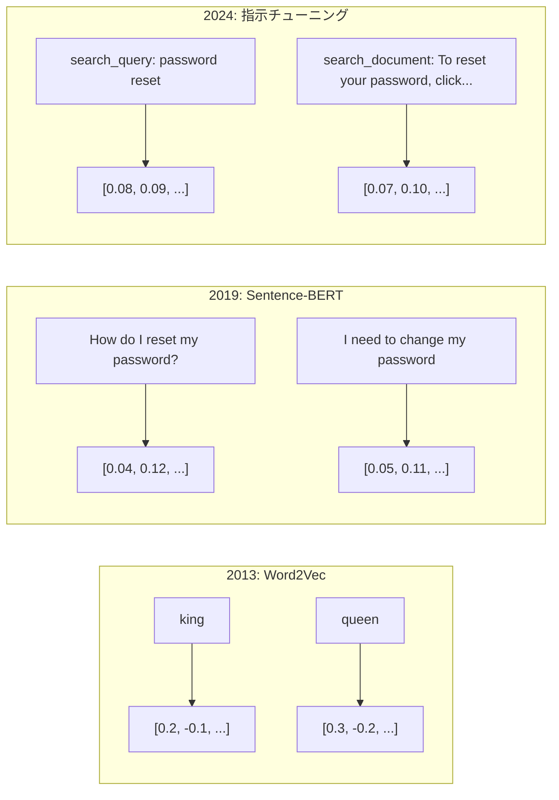
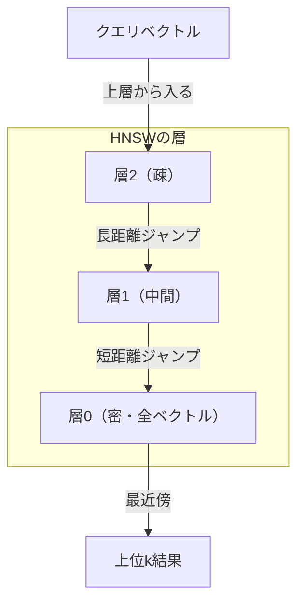

# 埋め込みとベクトル表現

> テキストは離散的だ。数学は連続的だ。LLMに「類似した」ドキュメントの検索・意味の比較・キーワードを超えた検索を求めるたびに、これら2つの世界の橋に頼ることになる。その橋が埋め込みだ。埋め込みを理解しなければ、現代AIを理解したことにはならない。ただ使っているだけだ。

**関連レッスン:** フェーズ5・22（埋め込みモデル深掘り）でdense vs sparse vs マルチベクトル・Matryoshka切り捨て・軸ごとのモデル選択を解説。このレッスンは本番パイプライン（ベクターDB・HNSW・類似度計算）に焦点を当てる。

## 学習目標

- APIプロバイダーとオープンソースモデルを使ってテキスト埋め込みを生成し、それらの間のコサイン類似度を計算する
- 埋め込みがキーワード検索では対処できない語彙ミスマッチ問題を解決する理由を説明する
- 正確なキーワードマッチではなく意味によってドキュメントを検索するセマンティック検索インデックスを構築する
- 検索ベンチマーク（precision@k・recall）を使って埋め込みの品質を評価し、タスクに適した埋め込みモデルを選択する

## 問題

1万件のサポートチケットがある。顧客が「支払いが完了しませんでした」と書く。過去の類似チケットを見つける必要がある。キーワード検索は「支払い」と「完了しませんでした」を含むチケットを見つける。「取引に失敗しました」「請求が拒否されました」「請求エラー」は見逃す。これらのチケットはまったく異なる単語でまったく同じ問題を説明している。

これが語彙ミスマッチ問題だ。人間の言語には同じことを言う何十もの方法がある。キーワード検索は各単語を意味のない独立したシンボルとして扱う。「拒否された」と「完了しなかった」が同じ概念を指すとは知ることができない。

テキストの表現が必要だ——スペルではなく意味が類似度を決める表現が。「支払いが完了しませんでした」と「取引が拒否されました」を、ある数学的空間で近くに置き、共通の単語「支払い」を持つ「支払いが時間通りに届きました」は遠ざける。

その表現が埋め込みだ。

## 概念

### 埋め込みとは何か

埋め込みはテキストの意味を表す浮動小数点数の密なベクトルだ。「密」という言葉が重要——ほとんどの次元がゼロのスパース表現（bag-of-words、TF-IDF）とは異なり、すべての次元が情報を持つ。

「The cat sat on the mat」は`[0.023, -0.041, 0.087, ..., 0.012]`のようなものになる——モデルによって768〜3072個の数値のリスト。これらの数値は意味をエンコードする。直接検査することはない。比較するのだ。

### Word2Vecのブレークスルー

2013年、GoogleのTomas Mikolovらがword2vecを発表した。核心的な洞察：ニューラルネットワークを隣接する単語からある単語を予測するよう（または単語から隣接語を予測するよう）訓練すると、隠れ層の重みが意味のあるベクトル表現になる。

有名な結果：

```
king - man + woman = queen
```

単語埋め込みに対するベクトル演算が意味関係をとらえる。これは幾何学が意味をエンコードできることを分野が気づいた瞬間だった。

Word2Vecは300次元のベクトルを生成した。各単語はコンテキストに関係なく1つのベクトルを持った。「bank」（川岸の「bank」と銀行口座の「bank」）は同じ埋め込みを持った。この制限が次の10年の研究を牽引した。

### 単語から文章へ

単語埋め込みは単一トークンを表現する。本番システムは文章・段落・ドキュメント全体を埋め込む必要がある。4つのアプローチが登場した：

**平均化**：文章内のすべての単語ベクトルの平均を取る。安価・損失が多い・短いテキストには驚くほど有効。単語の順序を完全に失う——「犬が人を噛む」と「人が犬を噛む」は同一の埋め込みを得る。

**CLSトークン**：トランスフォーマーモデル（BERT、2018）は入力全体を表す特別な[CLS]トークンの埋め込みを出力する。平均化より優れるが、[CLS]トークンは類似度ではなく次の文の予測のために訓練された。

**対比学習**：類似したペアを近づけ、異なるペアを離すように明示的にモデルを訓練する。Sentence-BERT（Reimers & Gurevych, 2019）はこのアプローチを使い、現代の埋め込みモデルの基礎となった。

**指示チューニング埋め込み**：最新のアプローチ。E5やGTEのようなモデルはタスクプレフィックス（「search_query:」「search_document:」）を受け入れ、生成する埋め込みの種類をモデルに伝える。



### 現代の埋め込みモデル

2026年初頭時点のMTEBスコア（MTEB v2）：

| モデル | プロバイダー | 次元数 | MTEB | コンテキスト | コスト/100万トークン |
|-------|----------|-----------|------|---------|------------------|
| Gemini Embedding 2 | Google | 3072（Matryoshka） | 67.7（検索） | 8192 | $0.15 |
| embed-v4 | Cohere | 1024（Matryoshka） | 65.2 | 128K | $0.12 |
| voyage-4 | Voyage AI | 1024/2048（Matryoshka） | 66.8 | 32K | $0.12 |
| text-embedding-3-large | OpenAI | 3072（Matryoshka） | 64.6 | 8192 | $0.13 |
| text-embedding-3-small | OpenAI | 1536（Matryoshka） | 62.3 | 8192 | $0.02 |
| BGE-M3 | BAAI | 1024（dense+sparse+ColBERT） | 63.0（多言語） | 8192 | オープンウェイト |
| Qwen3-Embedding | Alibaba | 4096（Matryoshka） | 66.9 | 32K | オープンウェイト |
| Nomic-embed-v2 | Nomic | 768（Matryoshka） | 63.1 | 8192 | オープンウェイト |

2026年までに、オープンウェイトモデル（Qwen3-Embedding、BGE-M3）はほとんどの軸でクローズドホスティングモデルと同等かそれ以上になっている。

### 類似度指標

2つの埋め込みベクトルが与えられた場合、それらがどれほど類似しているかを測定する3つの方法：

**コサイン類似度**：2つのベクトル間の角度のコサイン。-1（反対）から1（同一方向）の範囲。大きさを無視して方向のみを考慮する。ユースケースの90%でデフォルトとして使われる。

```
cosine_sim(a, b) = dot(a, b) / (||a|| * ||b||)
```

**ドット積**：2つのベクトルの生の内積。ベクトルが正規化されている（単位長さ）場合はコサイン類似度と同じ。より速く計算できる。

```
dot(a, b) = sum(a_i * b_i)
```

**ユークリッド（L2）距離**：ベクトル空間内の直線距離。小さいほど類似している。大きさの差に敏感。

```
L2(a, b) = sqrt(sum((a_i - b_i)^2))
```

### ベクターデータベースとHNSW

ブルートフォース類似度検索はクエリを保存されているすべてのベクトルと比較する。100万ベクトル・1536次元では、1クエリあたり15億回の乗算加算演算が必要。遅すぎる。

ベクターデータベースはANN（近似最近傍）アルゴリズムでこれを解決する。主流のアルゴリズムはHNSW（階層ナビゲーブル小世界）だ：

1. ベクトルの多層グラフを構築
2. 上層は疎——遠いクラスター間の長距離接続
3. 下層は密——近くのベクトル間の細かい接続
4. 検索は上層から始まり、絞り込みながら下降
5. O(n)ではなくO(log n)時間で近似上位k結果を返す



### チャンキング戦略

ドキュメントは単一ベクトルとして埋め込むには長すぎる。50ページのPDFは数十のトピックを含み、その埋め込みはすべての平均となって特定の何かに対して類似しなくなる。ドキュメントをチャンクに分割し、各チャンクを個別に埋め込む。

**固定サイズチャンキング**：NトークンごとにMトークンのオーバーラップで分割。シンプルで予測可能。

**文ベースチャンキング**：文の境界で分割し、トークン制限に達するまで文をグループ化する。各チャンクは少なくとも1つの完全な文を含む。

**再帰的チャンキング**：最大の境界（セクションヘッダー）での分割から試みる。それでも大きすぎる場合は段落境界で試みる。次に文の境界で。LangChainの`RecursiveCharacterTextSplitter`がこれで、混合フォーマットのコーパスでうまく機能する。

**セマンティックチャンキング**：各文を埋め込み、埋め込みが類似した連続する文をグループ化する。類似度が閾値を下回ったとき、新しいチャンクを開始する。

| 戦略 | 複雑さ | 品質 | 最適用途 |
|----------|-----------|---------|----------|
| 固定サイズ | 低い | 普通 | 非構造化テキスト・ログ |
| 文ベース | 低い | 良い | 記事・メール |
| 再帰的 | 中程度 | 良い | Markdown・HTML・混合ドキュメント |
| セマンティック | 高い | 最良 | 重要な検索品質 |

ほとんどのシステムのスイートスポット：50トークンのオーバーラップを持つ256〜512トークンのチャンク。

### バイエンコーダー vs クロスエンコーダー

バイエンコーダーはクエリとドキュメントを独立して埋め込み、ベクトルを比較する。速い——クエリを一度埋め込み、事前計算されたドキュメント埋め込みと比較する。これが検索に使うもの。

クロスエンコーダーはクエリとドキュメントを単一の入力として受け取り、関連性スコアを出力する。遅い——各クエリ-ドキュメントペアをモデル全体で処理する。しかしクエリとドキュメントのトークン全体に注意できるためはるかに正確だ。

本番パターン：バイエンコーダーが上位100候補を検索し、クロスエンコーダーが上位10に絞り込む。これが検索-再ランク付けパイプラインだ。


再ランク付けモデル：Cohere Rerank 3.5（クエリ1000件あたり$2）、BGE-reranker-v2（無料・オープンソース）、Jina Reranker v2（無料・オープンソース）。

### Matryoshka埋め込み

従来の埋め込みはオール・オア・ナッシング。1536次元のベクトルは1536個のfloatを使う。再訓練なしに256次元に切り捨てることはできない。

Matryoshka表現学習（Kusupati et al., 2022）はこれを解決する。最初のN次元が最も重要な情報をとらえるようにモデルを訓練する。OpenAIのtext-embedding-3-smallとtext-embedding-3-largeは`dimensions`パラメータを通じてMatryoshkaの切り捨てをサポートしている。

### バイナリ量子化

1536次元の埋め込みをfloat32で保存すると6,144バイトを使う。1000万ドキュメント掛けると61GBがベクトルだけで必要になる。

バイナリ量子化は各floatを1ビットに変換する：正の値は1、負の値は0になる。ストレージは6,144バイトから192バイトに減少——32倍の削減。類似度はハミング距離（異なるビットの数）で計算される。

精度の低下は検索リコールで約5〜10%。一般的なパターン：数百万ベクトルに対する最初のパスの検索にバイナリ量子化を使い、上位1000を完全精度ベクトルで再スコアリングする。

## 実装する

セマンティック検索エンジンをゼロから構築する。ベクターデータベースなし。外部の埋め込みAPIなし。数学にnumpyを使う純粋なPython。

### Step 1: テキストチャンキング

```python
def chunk_text(text, chunk_size=200, overlap=50):
    words = text.split()
    chunks = []
    start = 0
    while start < len(words):
        end = start + chunk_size
        chunk = " ".join(words[start:end])
        chunks.append(chunk)
        start += chunk_size - overlap
    return chunks


def chunk_by_sentences(text, max_chunk_tokens=200):
    sentences = text.replace("\n", " ").split(".")
    sentences = [s.strip() + "." for s in sentences if s.strip()]
    chunks = []
    current_chunk = []
    current_length = 0
    for sentence in sentences:
        sentence_length = len(sentence.split())
        if current_length + sentence_length > max_chunk_tokens and current_chunk:
            chunks.append(" ".join(current_chunk))
            current_chunk = []
            current_length = 0
        current_chunk.append(sentence)
        current_length += sentence_length
    if current_chunk:
        chunks.append(" ".join(current_chunk))
    return chunks
```

### Step 2: ゼロから埋め込みを構築する

TF-IDFとL2正規化を使ったシンプルな密な埋め込みを実装する。これはニューラル埋め込みではないが、同じコントラクトに従う：テキストを入力すると固定サイズのベクトルが出力され、類似したテキストは類似したベクトルを生成する。

```python
import math
import numpy as np
from collections import Counter

class SimpleEmbedder:
    def __init__(self):
        self.vocab = []
        self.idf = []
        self.word_to_idx = {}

    def fit(self, documents):
        vocab_set = set()
        for doc in documents:
            vocab_set.update(doc.lower().split())
        self.vocab = sorted(vocab_set)
        self.word_to_idx = {w: i for i, w in enumerate(self.vocab)}
        n = len(documents)
        self.idf = np.zeros(len(self.vocab))
        for i, word in enumerate(self.vocab):
            doc_count = sum(1 for doc in documents if word in doc.lower().split())
            self.idf[i] = math.log((n + 1) / (doc_count + 1)) + 1

    def embed(self, text):
        words = text.lower().split()
        count = Counter(words)
        total = len(words) if words else 1
        vec = np.zeros(len(self.vocab))
        for word, freq in count.items():
            if word in self.word_to_idx:
                tf = freq / total
                vec[self.word_to_idx[word]] = tf * self.idf[self.word_to_idx[word]]
        norm = np.linalg.norm(vec)
        if norm > 0:
            vec = vec / norm
        return vec
```

### Step 3: 類似度関数

```python
def cosine_similarity(a, b):
    dot = np.dot(a, b)
    norm_a = np.linalg.norm(a)
    norm_b = np.linalg.norm(b)
    if norm_a == 0 or norm_b == 0:
        return 0.0
    return float(dot / (norm_a * norm_b))


def dot_product(a, b):
    return float(np.dot(a, b))


def euclidean_distance(a, b):
    return float(np.linalg.norm(a - b))
```

### Step 4: ブルートフォース検索付きベクターインデックス

```python
class VectorIndex:
    def __init__(self):
        self.vectors = []
        self.texts = []
        self.metadata = []

    def add(self, vector, text, meta=None):
        self.vectors.append(vector)
        self.texts.append(text)
        self.metadata.append(meta or {})

    def search(self, query_vector, top_k=5, metric="cosine"):
        scores = []
        for i, vec in enumerate(self.vectors):
            if metric == "cosine":
                score = cosine_similarity(query_vector, vec)
            elif metric == "dot":
                score = dot_product(query_vector, vec)
            elif metric == "euclidean":
                score = -euclidean_distance(query_vector, vec)
            else:
                raise ValueError(f"Unknown metric: {metric}")
            scores.append((i, score))
        scores.sort(key=lambda x: x[1], reverse=True)
        results = []
        for idx, score in scores[:top_k]:
            results.append({
                "text": self.texts[idx],
                "score": score,
                "metadata": self.metadata[idx],
                "index": idx
            })
        return results

    def size(self):
        return len(self.vectors)
```

### Step 5: セマンティック検索エンジン

```python
class SemanticSearchEngine:
    def __init__(self, chunk_size=200, overlap=50):
        self.embedder = SimpleEmbedder()
        self.index = VectorIndex()
        self.chunk_size = chunk_size
        self.overlap = overlap

    def index_documents(self, documents, source_names=None):
        all_chunks = []
        all_sources = []
        for i, doc in enumerate(documents):
            chunks = chunk_text(doc, self.chunk_size, self.overlap)
            all_chunks.extend(chunks)
            name = source_names[i] if source_names else f"doc_{i}"
            all_sources.extend([name] * len(chunks))
        self.embedder.fit(all_chunks)
        for chunk, source in zip(all_chunks, all_sources):
            vec = self.embedder.embed(chunk)
            self.index.add(vec, chunk, {"source": source})
        return len(all_chunks)

    def search(self, query, top_k=5, metric="cosine"):
        query_vec = self.embedder.embed(query)
        return self.index.search(query_vec, top_k, metric)

    def search_with_scores(self, query, top_k=5):
        results = self.search(query, top_k)
        return [
            {
                "text": r["text"][:200],
                "source": r["metadata"].get("source", "unknown"),
                "score": round(r["score"], 4)
            }
            for r in results
        ]
```

### Step 6: 類似度指標の比較

```python
def compare_metrics(engine, query, top_k=3):
    results = {}
    for metric in ["cosine", "dot", "euclidean"]:
        hits = engine.search(query, top_k=top_k, metric=metric)
        results[metric] = [
            {"score": round(h["score"], 4), "preview": h["text"][:80]}
            for h in hits
        ]
    return results
```

## 使ってみる

本番の埋め込みAPIを使うと、アーキテクチャは同一のままになる。変わるのは埋め込み器のみだ：

```python
from openai import OpenAI

client = OpenAI()

def openai_embed(texts, model="text-embedding-3-small", dimensions=None):
    kwargs = {"model": model, "input": texts}
    if dimensions:
        kwargs["dimensions"] = dimensions
    response = client.embeddings.create(**kwargs)
    return [item.embedding for item in response.data]
```

OpenAIによるMatryoshkaの切り捨て——同じモデル・次元数を減らす・ストレージが低減：

```python
full = openai_embed(["semantic search query"], dimensions=1536)
compact = openai_embed(["semantic search query"], dimensions=256)
```

256次元のベクトルは6倍少ないストレージを使う。1000万ドキュメントでは10GBと61GBの差だ。

Cohereでの再ランク付け：

```python
import cohere

co = cohere.ClientV2()

results = co.rerank(
    model="rerank-v3.5",
    query="What is the refund policy?",
    documents=["Full refund within 30 days...", "No refunds after 90 days..."],
    top_n=3
)
```

APIへの依存なしにローカルで埋め込む：

```python
from sentence_transformers import SentenceTransformer

model = SentenceTransformer("BAAI/bge-small-en-v1.5")
embeddings = model.encode(["semantic search query", "another document"])
```

ビルドのVectorIndexクラスはこれらのどれでも動作する。埋め込み関数を入れ替え、検索ロジックはそのまま保つ。

## 成果物を出す

このレッスンでは：
- `outputs/prompt-embedding-advisor.md` — 特定のユースケース向けの埋め込みモデルと戦略を選ぶためのプロンプト
- `outputs/skill-embedding-patterns.md` — 本番で効果的に埋め込みを使う方法をエージェントに教えるスキル

## 演習

1. **指標比較**：同じ5つのクエリをサンプルドキュメントに対してコサイン類似度・ドット積・ユークリッド距離を使って実行する。各クエリの上位3件の結果を記録する。指標が一致しないクエリはどれか？なぜか？

2. **チャンクサイズ実験**：50・100・200・500ワードのチャンクサイズでサンプルドキュメントをインデックスする。各サイズで5つのクエリを実行し、上位1件の類似度スコアを記録する。大きなチャンクが悪化し始めるポイントを見つける。

3. **Matryoshkaシミュレーション**：500次元のベクトルを生成するSimpleEmbedderを構築する。50・100・200・500次元に切り捨てる。各切り捨てでの検索リコールの劣化を計測する。

4. **バイナリ量子化**：検索エンジンからの埋め込みを取り、バイナリに変換し（正なら1、負なら0）、ハミング距離検索を実装する。上位10件の結果を完全精度コサイン類似度と比較する。

5. **文ベースチャンキング**：固定サイズチャンキングを`chunk_by_sentences`に置き換える。同じクエリを実行して検索スコアを比較する。文の境界を尊重すると結果が向上するか？

## キーワード

| 用語 | 一般的な言い方 | 実際の意味 |
|------|----------------|----------------------|
| 埋め込み | 「テキストを数値に」 | 幾何学的近接性が意味的類似性をエンコードする密なベクトル |
| Word2Vec | 「元祖埋め込み」 | 文脈の単語を予測することで単語ベクトルを学習した2013年のモデル。ベクトル演算が意味をエンコードすることを証明 |
| コサイン類似度 | 「2つのベクトルがどれだけ類似しているか」 | ベクトル間の角度のコサイン。1=同一方向・0=直交・-1=反対 |
| HNSW | 「高速ベクター検索」 | 階層ナビゲーブル小世界グラフ——O(log n)の近似最近傍検索を可能にする多層構造 |
| バイエンコーダー | 「個別に埋め込んで速く比較」 | クエリとドキュメントを独立してベクトルにエンコード。事前計算と高速検索が可能 |
| クロスエンコーダー | 「遅いが正確な再ランク付け器」 | クエリとドキュメントのペアをモデル全体で処理。より高い精度だが事前計算不可 |
| Matryoshka埋め込み | 「切り捨て可能なベクトル」 | 最初のN次元が最も重要な情報をとらえるよう訓練された埋め込み。可変サイズのストレージが可能 |
| バイナリ量子化 | 「1ビット埋め込み」 | floatベクトルをバイナリに変換（符号ビットのみ）してハミング距離検索で32倍のストレージ削減 |
| チャンキング | 「埋め込みのためにドキュメントを分割する」 | ドキュメントを256〜512トークンのセグメントに分割して各チャンクを独立して埋め込み・検索できるようにする |
| ベクターデータベース | 「埋め込みの検索エンジン」 | ベクトルを保存して大規模な近似最近傍検索を実行するために最適化されたデータストア |
| 対比学習 | 「比較による訓練」 | 類似したペアの埋め込みを近づけ、異なるペアの埋め込みを離す訓練アプローチ |
| MTEB | 「埋め込みベンチマーク」 | 8つのタスクにわたる56のデータセットをカバーするMassive Text Embedding Benchmark。埋め込みモデルの比較標準 |

## 参考資料

- Mikolov et al., 「Efficient Estimation of Word Representations in Vector Space」(2013) — king-queenアナロジーで埋め込み革命を起こしたWord2Vec論文
- Reimers & Gurevych, 「Sentence-BERT: Sentence Embeddings using Siamese BERT-Networks」(2019) — 文レベルの類似度のためのバイエンコーダーの訓練方法。現代の埋め込みモデルの基礎
- Kusupati et al., 「Matryoshka Representation Learning」(2022) — OpenAIがtext-embedding-3で採用した可変次元埋め込みの背後にある技術
- Malkov & Yashunin, 「Efficient and Robust Approximate Nearest Neighbor using Hierarchical Navigable Small World Graphs」(2018) — HNSWの論文。ほとんどの本番ベクター検索の背後にあるアルゴリズム
- OpenAI Embeddingsガイド（platform.openai.com/docs/guides/embeddings） — Matryoshka次元削減を含むtext-embedding-3モデルの実用的なリファレンス
- MTEBリーダーボード（huggingface.co/spaces/mteb/leaderboard） — タスクと言語全体ですべての埋め込みモデルを比較するライブベンチマーク
- [Muennighoff et al., 「MTEB: Massive Text Embedding Benchmark」(EACL 2023)](https://arxiv.org/abs/2210.07316) — リーダーボードが報告する8つのタスクカテゴリを定義するベンチマーク
- [Sentence Transformersドキュメント](https://www.sbert.net/) — バイエンコーダー vs クロスエンコーダー・プーリング戦略・ingest-split-embed-store RAGパイプラインの標準リファレンス
