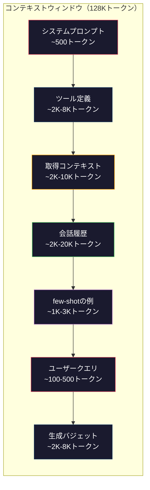
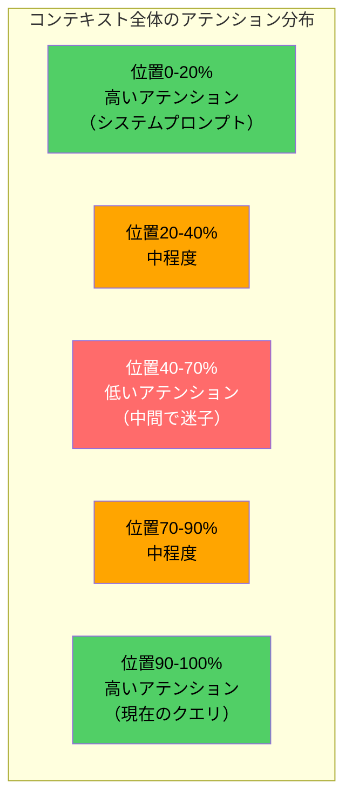
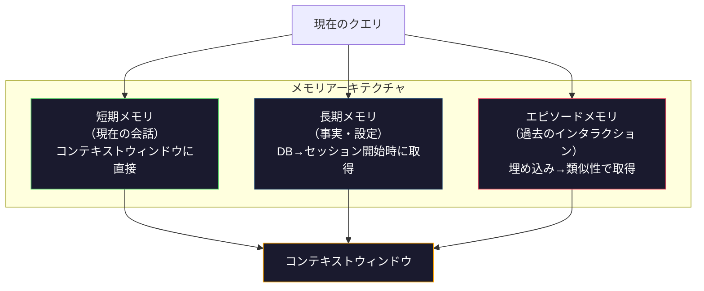

# コンテキストエンジニアリング：ウィンドウ・バジェット・メモリ・検索

> プロンプトエンジニアリングはその一部に過ぎない。コンテキストエンジニアリングこそがすべてだ。プロンプトは自分が入力する文字列だ。コンテキストはモデルのウィンドウに入るすべてのもの——システム指示・取得したドキュメント・ツール定義・会話履歴・few-shotの例・プロンプト自体。2026年の優れたAIエンジニアはコンテキストエンジニアだ。彼らは何を入れるか・何を除くか・どの順序で入れるかを決める。

**関連レッスン:** フェーズ11・15（プロンプトキャッシュ）——キャッシュフレンドリーなレイアウトはコンテキストエンジニアリングの拡張だ。フェーズ5・28（長コンテキスト評価）でNIAH/RULERを使ったlost-in-the-middleの計測方法を解説。

## 学習目標

- コンテキストウィンドウの全コンポーネント（システムプロンプト・ツール・履歴・取得ドキュメント・生成ヘッドルーム）にわたってトークンバジェットを計算する
- 会話履歴のコンテキストウィンドウ管理戦略——切り捨て・要約・スライディングウィンドウを実装する
- モデルが最も関連性の高い情報に注意を向けられるよう、コンテキストコンポーネントを優先順位付けして順序を決める
- クエリタイプと利用可能なウィンドウスペースに基づいてトークンを動的に割り当てるコンテキストアセンブラーを構築する

## 問題

Claude Opus 4.7は200Kトークンウィンドウを持つ（ベータでは1M）。GPT-5は400K。Gemini 3 Proは2M。Llama 4は10Mを謳う。これらの数字は埋めてしまうまでは莫大に聞こえる。

コーディングアシスタントの実際の内訳がある。システムプロンプト：500トークン。50ツールのツール定義：8,000トークン。取得したドキュメント：4,000トークン。会話履歴（10ターン）：6,000トークン。現在のユーザークエリ：200トークン。生成バジェット（最大出力）：4,000トークン。合計：22,700トークン。これは128Kウィンドウの18%に過ぎない。

しかしアテンションはコンテキスト長に対してリニアにスケールしない。128Kトークンのコンテキストを持つモデルは二次的なアテンションコストを払う（バニラのトランスフォーマーではO(n^2)だが、ほとんどの本番モデルは効率的なアテンションのバリアントを使用する）。さらに重要なのは、検索精度が劣化することだ。「Needle in a Haystack」テストは、モデルが長いコンテキストの真ん中に置かれた情報を見つけるのに苦労することを示している。Liu et al.（2023）の研究は、LLMが長いコンテキストの最初と最後の情報をほぼ完璧な精度で取得できるが、中間に置かれた情報（コンテキストの40〜70%の位置）の精度は10〜20%低下することを示した。この「lost-in-the-middle」効果はモデルによって異なるが、現在のすべてのアーキテクチャに影響する。

実践的な教訓：200Kトークンを利用できることは、200Kトークンの使用が効果的であることを意味しない。慎重にキュレーションされた10Kトークンのコンテキストは、詰め込まれた100Kトークンのコンテキストよりも優れたパフォーマンスを発揮することが多い。コンテキストエンジニアリングはコンテキストウィンドウ内のシグナル対ノイズ比を最大化する規律だ。

ウィンドウに入れるすべてのトークンは、より関連性の高い情報を運べたトークンを置き換える。すべての無関係なツール定義・すべての古い会話ターン・質問に答えないすべての取得テキストのチャンク——それぞれがタスクに対してモデルをわずかに悪化させる。

## 概念

### コンテキストウィンドウは希少なリソース

コンテキストウィンドウをディスクではなくRAMとして考える。速く直接アクセスできるが、限られている。すべてを入れることはできない。選択しなければならない。



各コンポーネントはスペースを争う。ツール定義を追加すると会話履歴のスペースが減る。取得コンテキストを追加するとfew-shotの例のスペースが減る。コンテキストエンジニアリングはこのバジェットをタスクパフォーマンス最大化のために割り当てる技術だ。

### Lost-in-the-Middle

コンテキストエンジニアリングにおける最も重要な経験的発見。モデルはコンテキストの最初と最後の情報にうまく注意を向ける。中間の情報はアテンションスコアが低く、無視される可能性が高い。

Liu et al.（2023）はこれを体系的にテストした。関連するドキュメントを20個の無関係なドキュメントの中にさまざまな位置で置き、回答精度を計測した。関連するドキュメントが最初か最後にある場合、精度は85〜90%だった。真ん中にある場合（20個中10番目の位置）、精度は60〜70%まで低下した。

これには直接的なエンジニアリング上の意味がある：

- 最も重要な情報を最初に置く（システムプロンプト・重要な指示）
- 現在のクエリと最も関連するコンテキストを最後に置く（最近性バイアスが助けになる）
- コンテキストの中間を最低優先度ゾーンとして扱う
- どうしても中間に情報を含める必要がある場合、最後にキーポイントを繰り返す



### コンテキストコンポーネント

**システムプロンプト**：ペルソナ・制約・行動ルールを設定する。これが最初に来て、ターンをまたいで一定に保たれる。Claude Codeはシステムプロンプトにツール定義と行動指示を含めて約6,000トークンを使う。コンパクトに保つこと。システムプロンプトのすべての単語はすべてのAPI呼び出しで繰り返される。

**ツール定義**：各ツールは50〜200トークンを追加する（名前・説明・パラメータスキーマ）。50ツールを1ツール150トークンとすると、会話が始まる前に7,500トークンになる。動的ツール選択——現在のクエリに関連するツールのみを含める——これにより60〜80%削減できる。

**取得コンテキスト**：ベクターデータベースからのドキュメント・検索結果・ファイルコンテンツ。検索の品質が応答の品質を直接決定する。悪い検索は検索なしより悪い——ウィンドウをノイズで埋め、モデルを積極的に誤誘導する。

**会話履歴**：すべての前のユーザーメッセージとアシスタントの応答。会話の長さに比例して増加する。1ターン200トークンの50ターンの会話は10,000トークンの履歴になる。そのほとんどは現在のクエリには無関係だ。

**few-shotの例**：望ましい動作を示す入力/出力ペア。適切に選ばれた2〜3つの例は、何千トークンもの指示よりも出力品質を改善することが多い。しかしスペースを消費する。

**生成バジェット**：モデルの応答のために予約されたトークン。ウィンドウをいっぱいにしてしまうと、モデルには答えるスペースがなくなる。生成のために少なくとも2,000〜4,000トークンを確保する。

### コンテキスト圧縮戦略

**履歴の要約**：すべての前のターンをそのまま保持する代わりに、定期的に会話を要約する。「Xについて議論し、Yを決定し、ユーザーはZを望んでいる」という100トークンが、2,000トークンを使った10ターンを置き換える。履歴が閾値（例：5,000トークン）を超えたときに要約を実行する。

**関連性フィルタリング**：取得した各ドキュメントを現在のクエリに対してスコアリングし、閾値以下のドキュメントを削除する。10チャンクを取得したが3チャンクしか関連していない場合、他の7つを捨てる。10個の平凡なチャンクより3つの高度に関連するチャンクの方が良い。

**ツールの刈り込み**：ユーザーのクエリの意図を分類し、その意図に関連するツールのみを含める。コードの質問にはカレンダーツールは不要だ。スケジューリングの質問にはファイルシステムツールは不要だ。これにより、ツール定義を8,000トークンから1,000トークンに削減できる。

**再帰的要約**：非常に長いドキュメントのために、段階的に要約する。まず各セクションを要約し、次に要約を要約する。50ページのドキュメントが重要なポイントをとらえた500トークンのダイジェストになる。

### メモリシステム

コンテキストエンジニアリングは3つの時間軸にまたがる。

**短期メモリ**：現在の会話。コンテキストウィンドウに直接保存される。ターンごとに増加する。要約と切り捨てで管理される。

**長期メモリ**：会話をまたいで持続する事実と設定。「ユーザーはTypeScriptを好む」「プロジェクトはPostgreSQLを使用する」などがある。データベースに保存され、セッション開始時に取得される。Claude CodeはこれをCLAUDE.mdファイルに保存する。ChatGPTはそのメモリ機能に保存する。

**エピソードメモリ**：関連する可能性のある特定の過去のインタラクション。「先週火曜日に認証モジュールの同様の問題をデバッグした」などがある。埋め込みとして保存され、現在の会話が過去のエピソードと一致するときに取得される。



### 動的コンテキストアセンブリ

重要な洞察：異なるクエリは異なるコンテキストを必要とする。静的なシステムプロンプト＋静的なツール＋静的な履歴は無駄が多い。最良のシステムはクエリごとに動的にコンテキストをアセンブルする。

1. クエリの意図を分類する
2. 関連するツールを選択する（全ツールではなく）
3. 関連するドキュメントを取得する（固定セットではなく）
4. 関連する履歴ターンを含める（全履歴ではなく）
5. タスクタイプに合ったfew-shotの例を追加する
6. 重要度ですべてに順序を付ける：重要なものを最初に、重要なものを最後に、オプションのものを中間に

これが良いAIアプリケーションと優れたAIアプリケーションの違いだ。モデルは同じ。コンテキストが差別化要因だ。

## 実装する

### Step 1: トークンカウンター

計測できないものはバジェット管理できない。シンプルなトークンカウンター（空白で分割した近似値——正確なカウントはトークナイザーに依存するため）を構築する。

```python
import json
import numpy as np
from collections import OrderedDict

def count_tokens(text):
    if not text:
        return 0
    return int(len(text.split()) * 1.3)

def count_tokens_json(obj):
    return count_tokens(json.dumps(obj))
```

### Step 2: コンテキストバジェットマネージャー

コア抽象。バジェットマネージャーは各コンポーネントが使用するトークン数を追跡し、制限を施行する。

```python
class ContextBudget:
    def __init__(self, max_tokens=128000, generation_reserve=4000):
        self.max_tokens = max_tokens
        self.generation_reserve = generation_reserve
        self.available = max_tokens - generation_reserve
        self.allocations = OrderedDict()

    def allocate(self, component, content, max_tokens=None):
        tokens = count_tokens(content)
        if max_tokens and tokens > max_tokens:
            words = content.split()
            target_words = int(max_tokens / 1.3)
            content = " ".join(words[:target_words])
            tokens = count_tokens(content)

        used = sum(self.allocations.values())
        if used + tokens > self.available:
            allowed = self.available - used
            if allowed <= 0:
                return None, 0
            words = content.split()
            target_words = int(allowed / 1.3)
            content = " ".join(words[:target_words])
            tokens = count_tokens(content)

        self.allocations[component] = tokens
        return content, tokens

    def remaining(self):
        used = sum(self.allocations.values())
        return self.available - used

    def utilization(self):
        used = sum(self.allocations.values())
        return used / self.max_tokens

    def report(self):
        total_used = sum(self.allocations.values())
        lines = []
        lines.append(f"Context Budget Report ({self.max_tokens:,} token window)")
        lines.append("-" * 50)
        for component, tokens in self.allocations.items():
            pct = tokens / self.max_tokens * 100
            bar = "#" * int(pct / 2)
            lines.append(f"  {component:<25} {tokens:>6} tokens ({pct:>5.1f}%) {bar}")
        lines.append("-" * 50)
        lines.append(f"  {'Used':<25} {total_used:>6} tokens ({total_used/self.max_tokens*100:.1f}%)")
        lines.append(f"  {'Generation reserve':<25} {self.generation_reserve:>6} tokens")
        lines.append(f"  {'Remaining':<25} {self.remaining():>6} tokens")
        return "\n".join(lines)
```

### Step 3: Lost-in-the-Middle 再順序付け

再順序付け戦略を実装する：最も重要なアイテムが最初と最後に来て、最も重要でないアイテムが中間に来る。

```python
def reorder_lost_in_middle(items, scores):
    paired = sorted(zip(scores, items), reverse=True)
    sorted_items = [item for _, item in paired]

    if len(sorted_items) <= 2:
        return sorted_items

    first_half = sorted_items[::2]
    second_half = sorted_items[1::2]
    second_half.reverse()

    return first_half + second_half

def score_relevance(query, documents):
    query_words = set(query.lower().split())
    scores = []
    for doc in documents:
        doc_words = set(doc.lower().split())
        if not query_words:
            scores.append(0.0)
            continue
        overlap = len(query_words & doc_words) / len(query_words)
        scores.append(round(overlap, 3))
    return scores
```

### Step 4: 会話履歴コンプレッサー

古い会話ターンを要約してトークンバジェットを回収する。

```python
class ConversationManager:
    def __init__(self, max_history_tokens=5000):
        self.turns = []
        self.summaries = []
        self.max_history_tokens = max_history_tokens

    def add_turn(self, role, content):
        self.turns.append({"role": role, "content": content})
        self._compress_if_needed()

    def _compress_if_needed(self):
        total = sum(count_tokens(t["content"]) for t in self.turns)
        if total <= self.max_history_tokens:
            return

        while total > self.max_history_tokens and len(self.turns) > 4:
            old_turns = self.turns[:2]
            summary = self._summarize_turns(old_turns)
            self.summaries.append(summary)
            self.turns = self.turns[2:]
            total = sum(count_tokens(t["content"]) for t in self.turns)

    def _summarize_turns(self, turns):
        parts = []
        for t in turns:
            content = t["content"]
            if len(content) > 100:
                content = content[:100] + "..."
            parts.append(f"{t['role']}: {content}")
        return "Previous: " + " | ".join(parts)

    def get_context(self):
        parts = []
        if self.summaries:
            parts.append("[Conversation Summary]")
            for s in self.summaries:
                parts.append(s)
        parts.append("[Recent Conversation]")
        for t in self.turns:
            parts.append(f"{t['role']}: {t['content']}")
        return "\n".join(parts)

    def token_count(self):
        return count_tokens(self.get_context())
```

### Step 5: 動的ツールセレクター

現在のクエリに関連するツールのみを含める。意図を分類してからフィルタリングする。

```python
TOOL_REGISTRY = {
    "read_file": {
        "description": "Read contents of a file",
        "tokens": 120,
        "categories": ["code", "files"],
    },
    "write_file": {
        "description": "Write content to a file",
        "tokens": 150,
        "categories": ["code", "files"],
    },
    "search_code": {
        "description": "Search for patterns in codebase",
        "tokens": 130,
        "categories": ["code"],
    },
    "run_command": {
        "description": "Execute a shell command",
        "tokens": 140,
        "categories": ["code", "system"],
    },
    "create_calendar_event": {
        "description": "Create a new calendar event",
        "tokens": 180,
        "categories": ["calendar"],
    },
    "list_emails": {
        "description": "List recent emails",
        "tokens": 160,
        "categories": ["email"],
    },
    "send_email": {
        "description": "Send an email message",
        "tokens": 200,
        "categories": ["email"],
    },
    "web_search": {
        "description": "Search the web for information",
        "tokens": 140,
        "categories": ["research"],
    },
    "query_database": {
        "description": "Run a SQL query on the database",
        "tokens": 170,
        "categories": ["code", "data"],
    },
    "generate_chart": {
        "description": "Generate a chart from data",
        "tokens": 190,
        "categories": ["data", "visualization"],
    },
}

def classify_intent(query):
    query_lower = query.lower()

    intent_keywords = {
        "code": ["code", "function", "bug", "error", "file", "implement", "refactor", "debug", "test"],
        "calendar": ["meeting", "schedule", "calendar", "appointment", "event"],
        "email": ["email", "mail", "send", "inbox", "message"],
        "research": ["search", "find", "what is", "how does", "explain", "look up"],
        "data": ["data", "query", "database", "chart", "graph", "analytics", "sql"],
    }

    scores = {}
    for intent, keywords in intent_keywords.items():
        score = sum(1 for kw in keywords if kw in query_lower)
        if score > 0:
            scores[intent] = score

    if not scores:
        return ["code"]

    max_score = max(scores.values())
    return [intent for intent, score in scores.items() if score >= max_score * 0.5]

def select_tools(query, token_budget=2000):
    intents = classify_intent(query)
    relevant = {}
    total_tokens = 0

    for name, tool in TOOL_REGISTRY.items():
        if any(cat in intents for cat in tool["categories"]):
            if total_tokens + tool["tokens"] <= token_budget:
                relevant[name] = tool
                total_tokens += tool["tokens"]

    return relevant, total_tokens
```

### Step 6: 完全なコンテキストアセンブリパイプライン

すべてを繋げる。クエリが与えられた場合、最適なコンテキストを動的にアセンブルする。

```python
class ContextEngine:
    def __init__(self, max_tokens=128000, generation_reserve=4000):
        self.budget = ContextBudget(max_tokens, generation_reserve)
        self.conversation = ConversationManager(max_history_tokens=5000)
        self.system_prompt = (
            "You are a helpful AI assistant. You have access to tools for "
            "code editing, file management, web search, and data analysis. "
            "Use the appropriate tools for each task. Be concise and accurate."
        )
        self.knowledge_base = [
            "Python 3.12 introduced type parameter syntax for generic classes using bracket notation.",
            "The project uses PostgreSQL 16 with pgvector for embedding storage.",
            "Authentication is handled by Supabase Auth with JWT tokens.",
            "The frontend is built with Next.js 15 using the App Router.",
            "API rate limits are set to 100 requests per minute per user.",
            "The deployment pipeline uses GitHub Actions with Docker multi-stage builds.",
            "Test coverage must be above 80% for all new modules.",
            "The codebase follows the repository pattern for data access.",
        ]

    def assemble(self, query):
        self.budget = ContextBudget(self.budget.max_tokens, self.budget.generation_reserve)

        system_content, _ = self.budget.allocate("system_prompt", self.system_prompt, max_tokens=1000)

        tools, tool_tokens = select_tools(query, token_budget=2000)
        tool_text = json.dumps(list(tools.keys()))
        tool_content, _ = self.budget.allocate("tools", tool_text, max_tokens=2000)

        relevance = score_relevance(query, self.knowledge_base)
        threshold = 0.1
        relevant_docs = [
            doc for doc, score in zip(self.knowledge_base, relevance)
            if score >= threshold
        ]

        if relevant_docs:
            doc_scores = [s for s in relevance if s >= threshold]
            reordered = reorder_lost_in_middle(relevant_docs, doc_scores)
            doc_text = "\n".join(reordered)
            doc_content, _ = self.budget.allocate("retrieved_context", doc_text, max_tokens=3000)

        history_text = self.conversation.get_context()
        if history_text.strip():
            history_content, _ = self.budget.allocate("conversation_history", history_text, max_tokens=5000)

        query_content, _ = self.budget.allocate("user_query", query, max_tokens=500)

        return self.budget

    def chat(self, query):
        self.conversation.add_turn("user", query)
        budget = self.assemble(query)
        response = f"[Response to: {query[:50]}...]"
        self.conversation.add_turn("assistant", response)
        return budget


def run_demo():
    print("=" * 60)
    print("  Context Engineering Pipeline Demo")
    print("=" * 60)

    engine = ContextEngine(max_tokens=128000, generation_reserve=4000)

    print("\n--- Query 1: Code task ---")
    budget = engine.chat("Fix the bug in the authentication module where JWT tokens expire too early")
    print(budget.report())

    print("\n--- Query 2: Research task ---")
    budget = engine.chat("What is the best approach for implementing vector search in PostgreSQL?")
    print(budget.report())

    print("\n--- Query 3: After conversation history builds up ---")
    for i in range(8):
        engine.conversation.add_turn("user", f"Follow-up question number {i+1} about the implementation details of the system")
        engine.conversation.add_turn("assistant", f"Here is the response to follow-up {i+1} with technical details about the architecture")

    budget = engine.chat("Now implement the changes we discussed")
    print(budget.report())

    print("\n--- Tool Selection Examples ---")
    test_queries = [
        "Fix the bug in auth.py",
        "Schedule a meeting with the team for Tuesday",
        "Show me the database query performance stats",
        "Search for best practices on error handling",
    ]

    for q in test_queries:
        tools, tokens = select_tools(q)
        intents = classify_intent(q)
        print(f"\n  Query: {q}")
        print(f"  Intents: {intents}")
        print(f"  Tools: {list(tools.keys())} ({tokens} tokens)")

    print("\n--- Lost-in-the-Middle Reordering ---")
    docs = ["Doc A (most relevant)", "Doc B (somewhat relevant)", "Doc C (least relevant)",
            "Doc D (relevant)", "Doc E (moderately relevant)"]
    scores = [0.95, 0.60, 0.20, 0.80, 0.50]
    reordered = reorder_lost_in_middle(docs, scores)
    print(f"  Original order: {docs}")
    print(f"  Scores:         {scores}")
    print(f"  Reordered:      {reordered}")
    print(f"  (Most relevant at start and end, least relevant in middle)")
```

## 使ってみる

### Claude Codeのコンテキスト戦略

Claude Codeは階層化されたアプローチでコンテキストを管理する。システムプロンプトには行動ルールとツール定義が含まれる（〜6Kトークン）。ファイルを開くと、そのコンテンツがコンテキストとして注入される。検索すると、結果が追加される。古い会話ターンは要約される。CLAUDE.mdはセッションをまたいで持続する長期メモリを提供する。

重要なエンジニアリング上の決定：Claude Codeはコードベース全体をコンテキストにダンプしない。必要に応じて関連ファイルを取得する。これが実践におけるコンテキストエンジニアリングだ。

### Cursorの動的コンテキストローディング

Cursorはコードベース全体を埋め込みにインデックスする。クエリを入力すると、ベクトル類似度を使って最も関連するファイルとコードブロックを取得する。それらのピースのみがコンテキストウィンドウに入る。50万行のコードベースが最も関連する5〜10個のコードブロックに圧縮される。

これがパターンだ：すべてを埋め込み、オンデマンドで取得し、重要なものだけを含める。

### ChatGPTのメモリ

ChatGPTはユーザーの設定と事実を長期メモリとして保存する。各会話の開始時に、関連するメモリが取得されてシステムプロンプトに含まれる。「ユーザーはPythonを好む」は5トークンのコストで、会話をまたいだ何百トークンもの繰り返しの指示を節約する。

### RAGをコンテキストエンジニアリングとして

Retrieval-Augmented Generationは形式化されたコンテキストエンジニアリングだ。知識をモデルのウェイト（訓練）やシステムプロンプト（静的コンテキスト）に詰め込む代わりに、クエリ時に関連ドキュメントを取得してコンテキストウィンドウに注入する。RAGパイプライン全体——チャンキング・埋め込み・取得・再ランク付け——は1つの問題を解決するために存在する：コンテキストウィンドウに正しい情報を置くこと。

## 成果物を出す

このレッスンでは`outputs/prompt-context-optimizer.md`を作成する——コンテキストアセンブリ戦略を監査して最適化を推奨する再利用可能なプロンプト。システムプロンプト・ツール数・平均履歴長・検索戦略を入力すると、トークンの無駄を特定して改善を提案する。

また`outputs/skill-context-engineering.md`も作成する——タスクタイプ・コンテキストウィンドウサイズ・レイテンシバジェットに基づいてコンテキストアセンブリパイプラインを設計するための意思決定フレームワーク。

## 演習

1. ContextBudgetクラスに「トークン無駄検出器」を追加する。バジェットの30%以上を使用しているコンポーネントにフラグを立て、各コンポーネントタイプに固有の圧縮戦略を提案する（履歴を要約する・ツールを刈り込む・ドキュメントを再ランク付けするなど）。

2. 取得したコンテキストのセマンティック重複排除を実装する。2つの取得ドキュメントが80%以上類似している場合（単語の重複またはコサイン類似度で）、スコアが高い方のみを保持する。これによってどれだけのトークンバジェットが回収されるかを計測する。

3. 「コンテキストリプレイ」ツールを構築する。会話のトランスクリプトが与えられた場合、ContextEngineを通じてリプレイし、ターンごとにバジェット割り当てがどのように変化するかを視覚化する。時間の経過とともにコンポーネントごとのトークン使用量をプロットする。コンテキストが圧縮され始めるターンを特定する。

4. 優先度ベースのツールセレクターを実装する。バイナリのinclude/excludeの代わりに、各ツールに現在のクエリへの関連性スコアを割り当てる。ツールバジェットが尽きるまで関連性の降順でツールを含める。含めるツールが5・10・20・50個の場合のタスクパフォーマンスを比較する。

5. マルチ戦略コンテキストコンプレッサーを構築する。3つの圧縮戦略（切り捨て・要約・主要文の抽出）を実装して、20個のドキュメントのセットでベンチマークする。圧縮比と情報保持のトレードオフを計測する（圧縮されたバージョンでもクエリへの答えが含まれているか？）。

## キーワード

| 用語 | 一般的な言い方 | 実際の意味 |
|------|----------------|----------------------|
| コンテキストウィンドウ | 「モデルが読める量」 | モデルが1回のフォワードパスで処理するトークンの最大数（入力＋出力）——GPT-5は400K・Claude Opus 4.7は200K（ベータ1M）・Gemini 3 Proは2M |
| コンテキストエンジニアリング | 「高度なプロンプトエンジニアリング」 | コンテキストウィンドウに何を入れるか・どの順序で・どの優先度でを決める規律——取得・圧縮・ツール選択・メモリ管理を包含する |
| Lost-in-the-Middle | 「モデルは中間のものを忘れる」 | LLMがコンテキストの最初と最後に注意を向ける経験的発見。中間に置かれた情報の精度が10〜20%低下する |
| トークンバジェット | 「残りトークン数」 | コンテキストウィンドウの容量をコンポーネント（システムプロンプト・ツール・履歴・取得・生成）に明示的に割り当てること（コンポーネントごとの制限付き） |
| 動的コンテキスト | 「オンザフライで読み込む」 | 意図分類・関連ツール選択・取得結果に基づいて、クエリごとに異なるコンテキストウィンドウをアセンブルする |
| 履歴の要約 | 「会話を圧縮する」 | 逐語的な古い会話ターンを簡潔な要約に置き換え、重要な情報を保持しながらトークンコストを削減する |
| ツールの刈り込み | 「関連ツールのみを含める」 | クエリの意図を分類してマッチするツール定義のみを含める。ツールトークンコストを60〜80%削減できる |
| 長期メモリ | 「セッションをまたいで記憶する」 | データベースに保存されてセッション開始時に取得される事実と設定——CLAUDE.md・ChatGPTのメモリなどの類似システム |
| エピソードメモリ | 「特定の過去のイベントを記憶する」 | 埋め込みとして保存された過去のインタラクションで、現在のクエリが過去の会話と類似しているときに取得される |
| 生成バジェット | 「答えるためのスペース」 | モデルの出力のために予約されたトークン——コンテキストがウィンドウを完全に満たすとモデルには答えるスペースがなくなる |

## 参考資料

- [Liu et al., 2023 — 「Lost in the Middle: How Language Models Use Long Contexts」](https://arxiv.org/abs/2307.03172) — 位置依存のアテンションに関する決定的な研究。モデルが長いコンテキストの中間の情報に苦労することを示す
- [Anthropicのコンテキスト取得ブログ記事](https://www.anthropic.com/news/contextual-retrieval) — Anthropicがコンテキスト対応チャンク取得にどのようにアプローチするか。取得失敗を49%削減
- [Simon WillisonのContextual Engineering](https://simonwillison.net/2025/Jun/27/context-engineering/) — この規律に名前を付けてプロンプトエンジニアリングと区別したブログ記事
- [LangChainのRAGドキュメント](https://python.langchain.com/docs/tutorials/rag/) — コンテキストエンジニアリングのパターンとしてのretrieval-augmented generationの実践的な実装
- [Greg KamradtのNeedle in a Haystack テスト](https://github.com/gkamradt/LLMTest_NeedleInAHaystack) — すべての主要モデルにわたる位置依存の取得失敗を明らかにしたベンチマーク
- [Pope et al., 「Efficiently Scaling Transformer Inference」（2022）](https://arxiv.org/abs/2211.05102) — コンテキスト長がメモリとレイテンシを駆動する理由と、KVキャッシュ・MQA・GQAがバジェット計算をどのように変えるか
- [Agrawal et al., 「SARATHI: Efficient LLM Inference by Piggybacking Decodes with Chunked Prefills」（2023）](https://arxiv.org/abs/2308.16369) — 長いプロンプトをTTFTでは高コストだがTPOTでは安価にするインファレンスの2フェーズ。コンテキストパッキングのトレードオフの根拠
- [Ainslie et al., 「GQA: Training Generalized Multi-Query Transformer Models from Multi-Head Checkpoints」（EMNLP 2023）](https://arxiv.org/abs/2305.13245) — 品質を失わずに本番デコーダーのKVメモリを8倍削減したグループクエリアテンション論文
